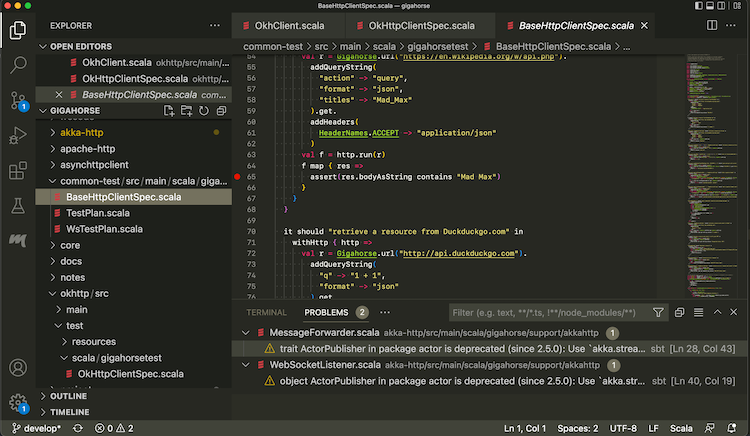

sbt Reference Manual
====================


  [Basic-Def]: Basic-Def.html
  [Scopes]: Scopes.html
  [Task-Graph]: Task-Graph.html

始める sbt
=========

sbt には、柔軟かつ強力なビルド定義（Build Definition）を支えるための独自の概念がいくつか存在している。
その概念は決して多くはないが、sbt は他のビルドシステムとは一味違うので、ドキュメントを読まずに使おうとすると、きっと細かい点でつまづいてしまうだろう。

この「始める sbt」では、sbt ビルド定義を作成してメンテナンスしていく上で知っておくべき概念を説明していく。

このガイドを一通り読んでおくことを_強く推奨したい_。

もしどうしても時間がないというなら、最も重要な概念は
[.sbt ビルド定義][Basic-Def]、
[スコープ][Scopes]、と
[タスク・グラフ][Task-Graph]
に書かれている。
ただし、それ以外のページを読み飛ばしても大丈夫かは保証できない。

このガイドの読み方だが、後ろの方のページはその前のページで紹介された概念の理解を前提に書かれているので、最初から順番に読み進めていくのがベストだ。

sbt を試してくれることに感謝する。_ぜひ楽しいんでほしい！_

> 誤訳の報告は[こちらへ](https://github.com/sbt/website/issues)。<br>
> sbt0.13での変更点や新機能に興味があるなら、[sbt 0.13.0 の変更点](http://eed3si9n.com/ja/node/142) を読むとよいだろう。


  [Basic-Def]: Basic-Def.html
  [Hello]: Hello.html
  [Running]: Running.html
  [Setup-Notes]: ../../docs/Setup-Notes.html
  [Mac]: Installing-sbt-on-Mac.html
  [Windows]: Installing-sbt-on-Windows.html
  [Linux]: Installing-sbt-on-Linux.html

sbt のインストール
----------------

sbt プロジェクトを作るためには、以下の手順をたどる必要がある:

 - JDK をインストールする。(Eclipse Adoptium Temurin JDK 8、11 もしくは 17 を推奨)
 - sbt をインストールする。
 - 簡単な [hello world][Hello] プロジェクトをセットアップする。
 - [実行する][Running]を読んで、sbt の実行方法を知る。
 - [.sbt ビルド定義][Basic-Def]を読んで、ビルド定義についてもっと詳しく知る。

究極的には sbt のインストールはランチャー JAR とシェルスクリプトの 2 つを用意するだけだが、
利用するプラットフォームによってはもう少し簡単なインストール方法もいくつか提供されている。
[macOS][Mac]、[Windows][Windows]、もしくは
[Linux][Linux] の手順を参照してほしい。

### 豆知識

`sbt` の実行が上手くいかない場合は、[Setup Notes][Setup-Notes] のターミナルの文字エンコーディング、HTTP プロキシ、JVM のオプションに関する説明を参照してほしい。


  [MSI]: https://github.com/sbt/sbt/releases/download/v1.7.1/sbt-1.7.1.msi
  [ZIP]: https://github.com/sbt/sbt/releases/download/v1.7.1/sbt-1.7.1.zip
  [TGZ]: https://github.com/sbt/sbt/releases/download/v1.7.1/sbt-1.7.1.tgz
  [Manual-Installation]: Manual-Installation.html
  [AdoptiumOpenJDK]: https://adoptium.net

macOS への sbt のインストール
--------------------------

### **cs setup** を用いた sbt のインストール

[Install](https://www.scala-lang.org/download/) に従い Coursier を用いて Scala をインストールする。これは最新の安定版の `sbt` を含む。

### JDK のインストール

リンクをたどって [JDK 8 もしくは JDK 11][AdoptiumOpenJDK] をインストールする、
もしくは [SDKMAN!](https://sdkman.io/) を使う。

#### [SDKMAN!](https://sdkman.io/)

```scala
$ sdk install java $(sdk list java | grep -o "\b8\.[0-9]*\.[0-9]*\-tem" | head -1)
$ sdk install sbt
```

### ユニバーサルパッケージからのインストール

[ZIP][ZIP] か [TGZ][TGZ] をダウンロードしてきて解凍する。

### サードパーティパッケージを使ってのインストール

> **注意:** サードパーティが提供するパッケージは最新版を使っているとは限らない。
> 何か問題があれば、パッケージメンテナに報告してほしい。

#### [Homebrew](https://brew.sh/)

```
$ brew install sbt
```


  [MSI]: https://github.com/sbt/sbt/releases/download/v1.7.1/sbt-1.7.1.msi
  [ZIP]: https://github.com/sbt/sbt/releases/download/v1.7.1/sbt-1.7.1.zip
  [TGZ]: https://github.com/sbt/sbt/releases/download/v1.7.1/sbt-1.7.1.tgz
  [AdoptiumOpenJDK]: https://adoptium.net

Windows への sbt のインストール
----------------------------

### **cs setup** を用いた sbt のインストール

[Install](https://www.scala-lang.org/download/) に従い Coursier を用いて Scala をインストールする。これは最新の安定版の `sbt` を含む。

### JDK のインストール

リンクをたどって [JDK 8 もしくは JDK 11][AdoptiumOpenJDK] をインストールする。

### ユニバーサルパッケージからのインストール

[ZIP][ZIP] か [TGZ][TGZ] をダウンロードしてきて解凍する。

### Windows インストーラ

[msi インストーラ][MSI]をダウンロードしてインストールする。

### サードパーティパッケージを使ってのインストール

> **注意:** サードパーティが提供するパッケージは最新版を使っているとは限らない。
> 何か問題があれば、パッケージメンテナに報告してほしい。

#### [Scoop](https://scoop.sh/)

```
$ scoop install sbt
```


  [MSI]: https://github.com/sbt/sbt/releases/download/v1.7.1/sbt-1.7.1.msi
  [ZIP]: https://github.com/sbt/sbt/releases/download/v1.7.1/sbt-1.7.1.zip
  [TGZ]: https://github.com/sbt/sbt/releases/download/v1.7.1/sbt-1.7.1.tgz
  [RPM]: https://dl.bintray.com/sbt/rpm/sbt-1.7.1.rpm
  [DEB]: https://dl.bintray.com/sbt/debian/sbt-1.7.1.deb
  [Manual-Installation]: Manual-Installation.html
  [website127]: https://github.com/sbt/website/issues/12
  [cert-bug]: https://bugs.launchpad.net/ubuntu/+source/ca-certificates-java/+bug/1739631
  [openjdk-devel]: https://pkgs.org/download/java-1.8.0-openjdk-devel

Linux への sbt のインストール
--------------------------

### **cs setup** を用いた sbt のインストール

[Install](https://www.scala-lang.org/download/) に従い Coursier を用いて Scala をインストールする。これは最新の安定版の `sbt` を含む。

### SDKMAN からのインストール

JDK と sbt をするのに、[SDKMAN](https://sdkman.io/) の導入を検討してほしい。

```scala
$ sdk install java $(sdk list java | grep -o "\b8\.[0-9]*\.[0-9]*\-tem" | head -1)
$ sdk install sbt
```

Coursier もしくは SDKMAN を使うことには 2つの利点がある。

1. [「闇鍋 OpenJDK ビルド」](https://mail.openjdk.java.net/pipermail/jdk8u-dev/2019-May/009330.html)と揶揄されているディストロ管理の JDK ではなく、Eclipse Adoptium が出している公式のパッケージをインストールできる。
2. sbt の全ての JAR ファイルを含んだ `tgz` パッケージをインストールできる (DEB と RPM版は帯域の節約のために JAR ファイルが含まれていない)。

### JDK のインストール

まず JDK をインストールする必要がある。**Eclipse Adoptium Temurin JDK 8**、**JDK 11**、もしくは **JDK 17** を推奨する。

パッケージ名はディストリビューションによって異なる。例えば、Ubuntu xenial (16.04LTS) には [openjdk-8-jdk](https://packages.ubuntu.com/hu/xenial/openjdk-8-jdk) がある。Redhat 系は [java-1.8.0-openjdk-devel][openjdk-devel] と呼んでいる。

### ユニバーサルパッケージからのインストール

[ZIP][ZIP] か [TGZ][TGZ] をダウンロードしてきて解凍する。

### Ubuntu 及びその他の Debian ベースの Linux ディストリビューション

[DEB][DEB] は sbt による公式パッケージだ。

Ubuntu 及びその他の Debian ベースのディストリビューションは DEB フォーマットを用いるが、
ローカルの DEB ファイルからソフトウェアをインストールすることは稀だ。
これらのディストロは通常コマンドラインや GUI 上から使えるパッケージ・マネージャがあって
(例: `apt-get`、`aptitude`、Synaptic など)、インストールはそれらから行う。
ターミナル上から以下を実行すると `sbt` をインストールできる (superuser 権限を必要とするため、`sudo` を使っている)。

    echo "deb https://repo.scala-sbt.org/scalasbt/debian all main" | sudo tee /etc/apt/sources.list.d/sbt.list
    echo "deb https://repo.scala-sbt.org/scalasbt/debian /" | sudo tee /etc/apt/sources.list.d/sbt_old.list
    curl -sL "https://keyserver.ubuntu.com/pks/lookup?op=get&search=0x2EE0EA64E40A89B84B2DF73499E82A75642AC823" | sudo apt-key add
    sudo apt-get update
    sudo apt-get install sbt

パッケージ・マネージャは設定されたリポジトリに指定されたパッケージがあるか確認しにいく。
このリポジトリをパッケージ・マネージャに追加しさえすればよい。

`sbt` を最初にインストールした後は、このパッケージは `aptitude` や Synaptic
上から管理することができる (パッケージ・キャッシュの更新を忘れずに)。
追加された APT リポジトリは「システム設定 -> ソフトウェアとアップデート -> 他のソフトウェア」 の一番下に表示されているはずだ:


**注意**: Ubuntu で  `Server access Error: java.lang.RuntimeException: Unexpected error: java.security.InvalidAlgorithmParameterException: the trustAnchors parameter must be non-empty url=https://repo1.maven.org/maven2/org/scala-sbt/sbt/1.1.0/sbt-1.1.0.pom` という SSL エラーが多く報告されている。[cert-bug][cert-bug] などによると、これは OpenJDK 9 が `/etc/ssl/certs/java/cacerts` に PKCS12 フォーマットを採用したことに起因するらしい。<https://stackoverflow.com/a/50103533/3827> によるとこの問題は Ubuntu Cosmic (18.10) で修正されているが、Ubuntu Bionic LTS (18.04) はリリース待ちらしい。回避策も Stackoverflow を参照。

### Red Hat Enterprise Linux 及びその他の RPM ベースのディストリビューション

[RPM][RPM] は sbt による公式パッケージだ。

Red Hat Enterprise Linux 及びその他の RPM ベースのディストリビューションは RPM フォーマットを用いる。
ターミナル上から以下を実行すると `sbt` をインストールできる (superuser 権限を必要とするため、`sudo` を使っている)。

    # remove old Bintray repo file
    sudo rm -f /etc/yum.repos.d/bintray-rpm.repo
    curl -L https://www.scala-sbt.org/sbt-rpm.repo > sbt-rpm.repo
    sudo mv sbt-rpm.repo /etc/yum.repos.d/
    sudo yum install sbt

On Fedora (31 and above), use `bintray-sbt-rpm.repo`

    # remove old Bintray repo file
    sudo rm -f /etc/yum.repos.d/bintray-rpm.repo
    curl -L https://www.scala-sbt.org/sbt-rpm.repo > sbt-rpm.repo
    sudo mv sbt-rpm.repo /etc/yum.repos.d/
    sudo dnf install sbt

> **注意:** これらのパッケージに問題があれば、
> [sbt](https://github.com/sbt/sbt)
> プロジェクトに報告してほしい。

### Gentoo

公式には sbt の ebuild は提供されていないが、
バイナリから sbt をマージする [ebuild](https://github.com/whiter4bbit/overlays/tree/master/dev-java/sbt-bin) が公開されているようだ。
この ebuild を使って sbt をマージするには:

    emerge dev-java/sbt


  [Basic-Def]: Basic-Def.html
  [Setup]: Setup.html
  [Running]: Running.html
  [Essential-sbt]: https://www.scalawilliam.com/essential-sbt/

例題でみる sbt
-------------

このページは、
[sbt 1 をインストール][Setup]したことを前提とする。

sbt の内部がどうなっているかや理由みたいなことを解説する代わりに、例題を次々と見ていこう。

### 最小 sbt ビルドを作る

```
$ mkdir foo-build
$ cd foo-build
$ touch build.sbt
```

### sbt シェルを起ち上げる

```
$ sbt
[info] Updated file /tmp/foo-build/project/build.properties: set sbt.version to 1.1.4
[info] Loading project definition from /private/tmp/foo-build/project
[info] Loading settings from build.sbt ...
[info] Set current project to foo-build (in build file:/private/tmp/foo-build/)
[info] sbt server started at local:///Users/eed3si9n/.sbt/1.0/server/abc4fb6c89985a00fd95/sock
sbt:foo-build>
```

### sbt シェルを終了させる

sbt シェルを終了させるには、`exit` と入力するか、Ctrl+D (Unix) か Ctrl+Z (Windows) を押す。

```
sbt:foo-build> exit
```

### プロジェクトをコンパイルする

表記の慣例として `sbt:...>` や `>` というプロンプトは、sbt シェルに入っていることを意味することにする。

```
$ sbt
sbt:foo-build> compile
```

### コード変更時に再コンパイルする

`compile` コマンド (やその他のコマンド) を `~` で始めると、プロジェクト内のソース・ファイルが変更されるたびにそのコマンドが自動的に再実行される。

```
sbt:foo-build> ~compile
[success] Total time: 0 s, completed May 6, 2018 3:52:08 PM
1. Waiting for source changes... (press enter to interrupt)
```

### ソース・ファイルを書く

上記のコマンドは走らせたままにする。別のシェルかファイルマネージャーからプロジェクトのディレクトリへ行って、`src/main/scala/example` というディレクトリを作る。次に好きなエディタを使って `example` ディレクトリ内に以下のファイルを作成する:

```scala
package example

object Hello {
  def main(args: Array[String]): Unit = {
    println("Hello")
  }
}
```

この新しいファイルは実行中のコマンドが自動的に検知したはずだ:

```
[info] Compiling 1 Scala source to /private/tmp/foo-build/target/scala-2.12/classes ...
[info] Done compiling.
[success] Total time: 2 s, completed May 6, 2018 3:53:42 PM
2. Waiting for source changes... (press enter to interrupt)
```

`~compile` を抜けるには `Enter` を押す。

### 以前のコマンドを実行する

sbt シェル内で上矢印キーを 2回押して、上で実行した `compile` コマンドを探す。

```
sbt:foo-build> compile
```

### ヘルプを読む

`help` コマンドを使って、基礎コマンドの一覧を表示する。

```
sbt:foo-build> help

  about                                          Displays basic information about sbt and the build.
  tasks                                          Lists the tasks defined for the current project.
  settings                                       Lists the settings defined for the current project.
  reload                                         (Re)loads the current project or changes to plugins project or returns from it.
  new                                            Creates a new sbt build.
  projects                                       Lists the names of available projects or temporarily adds/removes extra builds to the session.
  project                                        Displays the current project or changes to the provided `project`.

....
```

特定のタスクの説明を表示させる:

```
sbt:foo-build> help run
Runs a main class, passing along arguments provided on the command line.
```

### アプリを実行する

```
sbt:foo-build> run
[info] Packaging /private/tmp/foo-build/target/scala-2.12/foo-build_2.12-0.1.0-SNAPSHOT.jar ...
[info] Done packaging.
[info] Running example.Hello
Hello
[success] Total time: 1 s, completed May 6, 2018 4:10:44 PM
```

### sbt シェルから ThisBuild / scalaVersion をセットする

```
sbt:foo-build> set ThisBuild / scalaVersion := "2.13.8"
[info] Defining ThisBuild / scalaVersion
```

`scalaVersion` セッティングを確認する:

```
sbt:foo-build> scalaVersion
[info] 2.13.8
```

### セッションを build.sbt へと保存する

アドホックに設定したセッティングは `session save` で保存できる。

```
sbt:foo-build> session save
[info] Reapplying settings...
```

`build.sbt` ファイルは以下のようになったはずだ:

```scala
ThisBuild / scalaVersion := "2.13.8"
```

### プロジェクトに名前を付ける

エディタを使って、`build.sbt` を以下のように変更する:

```scala
ThisBuild / scalaVersion := "2.13.6"
ThisBuild / organization := "com.example"

lazy val hello = (project in file("."))
  .settings(
    name := "Hello"
  )
```

### ビルドの再読み込み

`reload` コマンドを使ってビルドを再読み込みする。このコマンドは `build.sbt` を読み直して、そこに書かれたセッティングを再適用する。

```
sbt:foo-build> reload
[info] Loading project definition from /private/tmp/foo-build/project
[info] Loading settings from build.sbt ...
[info] Set current project to Hello (in build file:/private/tmp/foo-build/)
sbt:Hello>
```

プロンプトが `sbt:Hello>` に変わったことに注目してほしい。

### libraryDependencies に ScalaTest を追加する

エディタを使って、`build.sbt` を以下のように変更する:

```scala
ThisBuild / scalaVersion := "2.13.6"
ThisBuild / organization := "com.example"

lazy val hello = (project in file("."))
  .settings(
    name := "Hello",
    libraryDependencies += "org.scalatest" %% "scalatest" % "3.2.7" % Test,
  )
```

`reload` コマンドを使って、`build.sbt` の変更を反映させる。

```
sbt:Hello> reload
```

### テストを実行する

```
sbt:Hello> test
```

### 差分テストを継続的に実行する

```
sbt:Hello> ~testQuick
```

### テストを書く

上のコマンドを走らせたままで、エディタから `src/test/scala/HelloSpec.scala` という名前のファイルを作成する:

```scala
import org.scalatest.funsuite._

class HelloSpec extends AnyFunSuite {
  test("Hello should start with H") {
    assert("hello".startsWith("H"))
  }
}
```

`~testQuick` が検知したはずだ:

```
2. Waiting for source changes... (press enter to interrupt)
[info] Compiling 1 Scala source to /private/tmp/foo-build/target/scala-2.12/test-classes ...
[info] Done compiling.
[info] HelloSpec:
[info] - Hello should start with H *** FAILED ***
[info]   assert("hello".startsWith("H"))
[info]          |       |          |
[info]          "hello" false      "H" (HelloSpec.scala:5)
[info] Run completed in 135 milliseconds.
[info] Total number of tests run: 1
[info] Suites: completed 1, aborted 0
[info] Tests: succeeded 0, failed 1, canceled 0, ignored 0, pending 0
[info] *** 1 TEST FAILED ***
[error] Failed tests:
[error]   HelloSpec
[error] (Test / testQuick) sbt.TestsFailedException: Tests unsuccessful
```

### テストが通るようにする

エディタを使って `src/test/scala/HelloSpec.scala` を以下のように変更する:

```scala
import org.scalatest.funsuite._

class HelloSpec extends AnyFunSuite {
  test("Hello should start with H") {
    // Hello, as opposed to hello
    assert("Hello".startsWith("H"))
  }
}
```

テストが通過したことを確認して、`Enter` を押して継続的テストを抜ける。

### ライブラリ依存性を追加する

エディタを使って `build.sbt` を以下のように変更する:

```scala
ThisBuild / scalaVersion := "2.13.6"
ThisBuild / organization := "com.example"

lazy val hello = (project in file("."))
  .settings(
    name := "Hello",
    libraryDependencies += "com.typesafe.play" %% "play-json" % "2.9.2",
    libraryDependencies += "com.eed3si9n" %% "gigahorse-okhttp" % "0.5.0",
    libraryDependencies += "org.scalatest" %% "scalatest" % "3.2.7" % Test,
  )
```

### Scala REPL を使う

New York の現在の天気を調べてみる:

```scala
sbt:Hello> console
[info] Starting scala interpreter...
Welcome to Scala 2.12.7 (Java HotSpot(TM) 64-Bit Server VM, Java 1.8.0_171).
Type in expressions for evaluation. Or try :help.

scala> :paste
// Entering paste mode (ctrl-D to finish)

import scala.concurrent._, duration._
import gigahorse._, support.okhttp.Gigahorse
import play.api.libs.json._

Gigahorse.withHttp(Gigahorse.config) { http =>
  val baseUrl = "https://www.metaweather.com/api/location"
  val rLoc = Gigahorse.url(baseUrl + "/search/").get.
    addQueryString("query" -> "New York")
  val fLoc = http.run(rLoc, Gigahorse.asString)
  val loc = Await.result(fLoc, 10.seconds)
  val woeid = (Json.parse(loc) \ 0 \ "woeid").get
  val rWeather = Gigahorse.url(baseUrl + s"/$woeid/").get
  val fWeather = http.run(rWeather, Gigahorse.asString)
  val weather = Await.result(fWeather, 10.seconds)
  ({Json.parse(_: String)} andThen Json.prettyPrint)(weather)
}

// Ctrl+D を押してペーストモードを抜ける

// Exiting paste mode, now interpreting.

import scala.concurrent._
import duration._
import gigahorse._
import support.okhttp.Gigahorse
import play.api.libs.json._
res0: String =
{
  "consolidated_weather" : [ {
    "id" : 5325278131781632,
    "weather_state_name" : "Light Rain",
    "weather_state_abbr" : "lr",
    "wind_direction_compass" : "W",
    "created" : "2019-11-23T09:16:43.892336Z",
    "applicable_date" : "2019-11-23",
    "min_temp" : 0.36,
    "max_temp" : 8.375,
    "the_temp" : 3.98,
    "wind_speed" : 4.813710565158143,
    "wind_direction" : 266.48254020294627,
    "air_pressure" : 1017,
    "humidity" : 58,
    "visibility" : 15.37583015191283,
    "predictability" : 75
  }, {
    "id" : 6428406054912000,
    "weather_state_name" : "Heavy Rain",
    "weather_state_abbr" : "hr",
  ...

scala> :q // これで REPL を抜ける
```

### サブプロジェクトを作成する

`build.sbt` を以下のように変更する:

```scala
ThisBuild / scalaVersion := "2.13.6"
ThisBuild / organization := "com.example"

lazy val hello = (project in file("."))
  .settings(
    name := "Hello",
    libraryDependencies += "com.eed3si9n" %% "gigahorse-okhttp" % "0.5.0",
    libraryDependencies += "org.scalatest" %% "scalatest" % "3.2.7" % Test,
  )

lazy val helloCore = (project in file("core"))
  .settings(
    name := "Hello Core",
  )
```

`reload` コマンドを使って `build.sbt` の変更を反映させる。

### 全てのサブプロジェクトを列挙する

```
sbt:Hello> projects
[info] In file:/private/tmp/foo-build/
[info]   * hello
[info]     helloCore
```

### サブプロジェクトをコンパイルする

```
sbt:Hello> helloCore/compile
```

### サブプロジェクトに ScalaTest を追加する

`build.sbt` を以下のように変更する:

```scala
ThisBuild / scalaVersion := "2.13.6"
ThisBuild / organization := "com.example"

val scalaTest = "org.scalatest" %% "scalatest" % "3.2.7"

lazy val hello = (project in file("."))
  .settings(
    name := "Hello",
    libraryDependencies += "com.eed3si9n" %% "gigahorse-okhttp" % "0.5.0",
    libraryDependencies += scalaTest % Test,
  )

lazy val helloCore = (project in file("core"))
  .settings(
    name := "Hello Core",
    libraryDependencies += scalaTest % Test,
  )
```

### コマンドをブロードキャストする

`hello` に送ったコマンドを `helloCore` にもブロードキャストするために集約を設定する:

```scala
ThisBuild / scalaVersion := "2.13.6"
ThisBuild / organization := "com.example"

val scalaTest = "org.scalatest" %% "scalatest" % "3.2.7"

lazy val hello = (project in file("."))
  .aggregate(helloCore)
  .settings(
    name := "Hello",
    libraryDependencies += "com.eed3si9n" %% "gigahorse-okhttp" % "0.5.0",
    libraryDependencies += scalaTest % Test,
  )

lazy val helloCore = (project in file("core"))
  .settings(
    name := "Hello Core",
    libraryDependencies += scalaTest % Test,
  )
```

`reload` 後、`~testQuick` は両方のサブプロジェクトに作用する:

```scala
sbt:Hello> ~testQuick
```

`Enter` を押して継続的テストを抜ける。

### hello が helloCore に依存するようにする

サブプロジェクト間の依存関係を定義するには `.dependsOn(...)` を使う。ついでに、Gigahorse への依存性も `helloCore` に移そう。

```scala
ThisBuild / scalaVersion := "2.13.6"
ThisBuild / organization := "com.example"

val scalaTest = "org.scalatest" %% "scalatest" % "3.2.7"

lazy val hello = (project in file("."))
  .aggregate(helloCore)
  .dependsOn(helloCore)
  .settings(
    name := "Hello",
    libraryDependencies += scalaTest % Test,
  )

lazy val helloCore = (project in file("core"))
  .settings(
    name := "Hello Core",
    libraryDependencies += "com.eed3si9n" %% "gigahorse-okhttp" % "0.5.0",
    libraryDependencies += scalaTest % Test,
  )
```

### Play JSON を使って JSON をパースする

`helloCore` に Play JSON を追加しよう。

```scala
ThisBuild / scalaVersion := "2.13.6"
ThisBuild / organization := "com.example"

val scalaTest = "org.scalatest" %% "scalatest" % "3.2.7"
val gigahorse = "com.eed3si9n" %% "gigahorse-okhttp" % "0.5.0"
val playJson  = "com.typesafe.play" %% "play-json" % "2.9.2"

lazy val hello = (project in file("."))
  .aggregate(helloCore)
  .dependsOn(helloCore)
  .settings(
    name := "Hello",
    libraryDependencies += scalaTest % Test,
  )

lazy val helloCore = (project in file("core"))
  .settings(
    name := "Hello Core",
    libraryDependencies ++= Seq(gigahorse, playJson),
    libraryDependencies += scalaTest % Test,
  )
```

`reload` 後、`core/src/main/scala/example/core/Weather.scala` を追加する:

```scala
package example.core

import gigahorse._, support.okhttp.Gigahorse
import scala.concurrent._, duration._
import play.api.libs.json._

object Weather {
  lazy val http = Gigahorse.http(Gigahorse.config)

  def weather: Future[String] = {
    val baseUrl = "https://www.metaweather.com/api/location"
    val locUrl = baseUrl + "/search/"
    val weatherUrl = baseUrl + "/%s/"
    val rLoc = Gigahorse.url(locUrl).get.
      addQueryString("query" -> "New York")
    import ExecutionContext.Implicits.global
    for {
      loc <- http.run(rLoc, parse)
      woeid = (loc \ 0 \ "woeid").get
      rWeather = Gigahorse.url(weatherUrl format woeid).get
      weather <- http.run(rWeather, parse)
    } yield (weather \\ "weather_state_name")(0).as[String].toLowerCase
  }

  private def parse = Gigahorse.asString andThen Json.parse
}
```

次に `src/main/scala/example/Hello.scala` を以下のように変更する:

```scala
package example

import scala.concurrent._, duration._
import core.Weather

object Hello {
  def main(args: Array[String]): Unit = {
    val w = Await.result(Weather.weather, 10.seconds)
    println(s"Hello! The weather in New York is $w.")
    Weather.http.close()
  }
}
```

アプリを走らせてみて、うまくいったか確認する:

```
sbt:Hello> run
[info] Compiling 1 Scala source to /private/tmp/foo-build/core/target/scala-2.12/classes ...
[info] Done compiling.
[info] Compiling 1 Scala source to /private/tmp/foo-build/target/scala-2.12/classes ...
[info] Packaging /private/tmp/foo-build/core/target/scala-2.12/hello-core_2.12-0.1.0-SNAPSHOT.jar ...
[info] Done packaging.
[info] Done compiling.
[info] Packaging /private/tmp/foo-build/target/scala-2.12/hello_2.12-0.1.0-SNAPSHOT.jar ...
[info] Done packaging.
[info] Running example.Hello
Hello! The weather in New York is mostly cloudy.
```

### sbt-native-packger プラグインを追加する

エディタを使って `project/plugins.sbt` を追加する:

```scala
addSbtPlugin("com.typesafe.sbt" % "sbt-native-packager" % "1.3.4")
```

次に `build.sbt` を以下のように変更して `JavaAppPackaging` を追加する:

```scala
ThisBuild / scalaVersion := "2.13.6"
ThisBuild / organization := "com.example"

val scalaTest = "org.scalatest" %% "scalatest" % "3.2.7"
val gigahorse = "com.eed3si9n" %% "gigahorse-okhttp" % "0.5.0"
val playJson  = "com.typesafe.play" %% "play-json" % "2.9.2"

lazy val hello = (project in file("."))
  .aggregate(helloCore)
  .dependsOn(helloCore)
  .enablePlugins(JavaAppPackaging)
  .settings(
    name := "Hello",
    libraryDependencies += scalaTest % Test,
  )

lazy val helloCore = (project in file("core"))
  .settings(
    name := "Hello Core",
    libraryDependencies ++= Seq(gigahorse, playJson),
    libraryDependencies += scalaTest % Test,
  )
```

### 配布用の .zip ファイルを作る

```
sbt:Hello> dist
[info] Wrote /private/tmp/foo-build/target/scala-2.12/hello_2.12-0.1.0-SNAPSHOT.pom
[info] Wrote /private/tmp/foo-build/core/target/scala-2.12/hello-core_2.12-0.1.0-SNAPSHOT.pom
[info] Your package is ready in /private/tmp/foo-build/target/universal/hello-0.1.0-SNAPSHOT.zip
```

パッケージ化されたアプリの実行は以下のように行う:

```
$ /tmp/someother
$ cd /tmp/someother
$ unzip -o -d /tmp/someother /tmp/foo-build/target/universal/hello-0.1.0-SNAPSHOT.zip
$ ./hello-0.1.0-SNAPSHOT/bin/hello
Hello! The weather in New York is mostly cloudy.
```

### アプリを Docker化させる

```
sbt:Hello> Docker/publishLocal
....
[info] Successfully built b6ce1b6ab2c0
[info] Successfully tagged hello:0.1.0-SNAPSHOT
[info] Built image hello:0.1.0-SNAPSHOT
```

Docker化されたアプリは以下のように実行する:

```
$ docker run hello:0.1.0-SNAPSHOT
Hello! The weather in New York is mostly cloudy
```

### version を設定する

`build.sbt` を以下のように変更する:

```scala
ThisBuild / version      := "0.1.0"
ThisBuild / scalaVersion := "2.13.6"
ThisBuild / organization := "com.example"

val scalaTest = "org.scalatest" %% "scalatest" % "3.2.7"
val gigahorse = "com.eed3si9n" %% "gigahorse-okhttp" % "0.5.0"
val playJson  = "com.typesafe.play" %% "play-json" % "2.9.2"

lazy val hello = (project in file("."))
  .aggregate(helloCore)
  .dependsOn(helloCore)
  .enablePlugins(JavaAppPackaging)
  .settings(
    name := "Hello",
    libraryDependencies += scalaTest % Test,
  )

lazy val helloCore = (project in file("core"))
  .settings(
    name := "Hello Core",
    libraryDependencies ++= Seq(gigahorse, playJson),
    libraryDependencies += scalaTest % Test,
  )
```

### Switch scalaVersion temporarily

```
sbt:Hello> ++2.12.14!
[info] Forcing Scala version to 2.12.14 on all projects.
[info] Reapplying settings...
[info] Set current project to Hello (in build file:/private/tmp/foo-build/)
```

`scalaVersion` セッティングを確認する:

```
sbt:Hello> scalaVersion
[info] helloCore / scalaVersion
[info]  2.12.14
[info] scalaVersion
[info]  2.12.14
```

このセッティングは `reload` 後には無くなる。

### dist タスクのインスペクト

`dist` タスクのことをもっと調べるために、`help` と `inspect` を実行してみる。

```scala
sbt:Hello> help dist
Creates the distribution packages.
sbt:Hello> inspect dist
```

依存タスクに対して `inspect` を再帰的に呼び出すには `inspect tree` を使う。

```scala
sbt:Hello> inspect tree dist
[info] dist = Task[java.io.File]
[info]   +-Universal / dist = Task[java.io.File]
....
```

### バッチモード

sbt のコマンドをターミナルから直接渡して sbt をバッチモードで実行することができる。

```
$ sbt clean "testOnly HelloSpec"
```

**Note**: バッチモードでの実行は JVM のスピンアップと JIT を毎回行うため、**ビルドかなり遅くなる。**
普段のコーディングでは sbt シェル、
もしくは `~testQuick` のような継続的テストを使うことを推奨する。

### sbt new コマンド

sbt `new` コマンドを使って手早く簡単な Hello world ビルドをセットアップすることができる。

```
$ sbt new sbt/scala-seed.g8
....
A minimal Scala project.

name [My Something Project]: hello

Template applied in ./hello
```

プロジェクト名を入力するプロンプトが出てきたら `hello` と入力する。

これで、`hello` ディレクトリ以下に新しいプロジェクトができた。

### クレジット

本ページは William "Scala William" Narmontas さん作の [Essential sbt][essential-sbt] というチュートリアルに基づいて書かれた。


  [ByExample]: sbt-by-example.html
  [Setup]: Setup.html
  [Organizing-Build]: Organizing-Build.html
  [Maven]: https://maven.apache.org/

ディレクトリ構造
--------------

このページは、
[sbt をインストール][Setup]して、
[例題でみる sbt][ByExample] を読んだことを前提とする。

### ベースディレクトリ

sbt 用語では「ベースディレクトリ(base directory) 」はプロジェクトが入ったディレクトリを指す。
[例題でみる sbt][ByExample] での例のように、`/tmp/foo-build/build.sbt` が入った
`hello` プロジェクトを作った場合、ベースディレクトリは `/tmp/foo-build` となる。

### ソースコード

sbt はデフォルトで [Maven][Maven] と同じディレクトリ構造を使う（全てのパスはベースディレクトリからの相対パスとする）:

```
src/
  main/
    resources/
       <メインの jar に含むデータファイル>
    scala/
       <メインの Scala ソースファイル>
    scala-2.12/
       <メインの Scala 2.12 に特定のソースファイル>
    java/
       <メインの Java ソースファイル>
  test/
    resources/
       <テストの jar に含むデータファイル>
    scala/
       <テストの Scala ソースファイル>
    scala-2.12/
       <テストの Scala 2.12 に特定のソースファイル>
    java/
       <テストの Java ソースファイル>
```

`src/` 内の他のディレクトリは無視される。また、隠しディレクトリも無視される。

ソースコードは `hello/app.scala` のようにプロジェクトのベースディレクトリに置くこともできるが、
小さいプロジェクトはともかくとして、通常のプロジェクトでは
`src/main/` 以下のディレクトリにソースを入れて整理するのが普通だ。
ベースディレクトリに `*.scala` ソースコードを配置できるのは小手先だけのトリックに見えるかもしれないが、
この機能は[後ほど][Organizing-Build]重要になる。

### sbt ビルド定義ファイル

ビルド定義はプロジェクトのベースディレクトリ以下の `build.sbt`
(実は `*.sbt` ならどのファイルでもいい) にて記述する。

```
build.sbt
```

### ビルドサポートファイル

`build.sbt` の他に、`project`
ディレクトリにはヘルパーオブジェクトや一点物のプラグインを定義した
`*.scala` ファイルを含むことができる。
詳しくは、[ビルドの整理][Organizing-Build]を参照。

```
build.sbt
project/
  Dependencies.scala
```

`project` 内に `.sbt` があるのを見ることがあるかもしれないが、それはプロジェクトのベースディレクトリ下の `.sbt` とはまた別物だ。
これに関しては他に前提となる知識が必要なので[後ほど説明する][Organizing-Build]。

### ビルド成果物

生成されたファイル（コンパイルされたクラスファイル、パッケージ化された jar ファイル、managed 配下のファイル、キャッシュとドキュメンテーション）は、デフォルトでは `target` ディレクトリに出力される。

### バージョン管理の設定

`.gitignore` （もしくは、他のバージョン管理システムの同様のファイル）には以下を追加しておくとよいだろう:

```
target/
```

ここでは（ディレクトリだけにマッチさせるために）語尾の `/` は意図的につけていて、一方で
（普通の `target/` に加えて `project/target/` にもマッチさせるために）先頭の `/` は意図的に
つけていないことに注意。


  [ByExample]: sbt-by-example.html
  [Setup]: Setup.html
  [Triggered-Execution]: ../../docs/Triggered-Execution.html
  [Command-Line-Reference]: ../../docs/Command-Line-Reference.html

実行
----

このページではプロジェクトをセットアップした後の `sbt` の使い方を説明する。
君が[sbt をインストール][Setup]して、
[例題でみる sbt][ByExample]を実行したことを前提とする。

### sbt シェル

プロジェクトのベースディレクトリで、sbt を引数なしで実行する:

```
$ sbt
```

sbt をコマンドライン引数なしで実行すると sbt シェルが起動される。
インタラクティブモードにはコマンドプロンプト（とタブ補完と履歴も！）がある。

例えば、`compile` と sbt シェルに入力する:

```
> compile
```

もう一度 `compile` するには、上矢印を押して、エンターキーを押す。

プログラムを実行するには、`run` と入力する。

sbt シェルを終了するには、`exit` と入力するか、Ctrl+D (Unix) か Ctrl+Z (Windows) を押す。

### バッチモード

sbt のコマンドを空白で区切られたリストとして引数に指定すると sbt をバッチモードで実行することができる。
引数を取る sbt コマンドの場合は、コマンドと引数の両方を引用符で囲むことで一つの引数として `sbt` に渡す。
例えば、

```
$ sbt clean compile "testOnly TestA TestB"
```

この例では、`testOnly` は `TestA` と `TestB` の二つの引数を取る。
コマンドは順に実行される（この場合 `clean`、`compile`、そして `testOnly`）。

**Note**: バッチモードでの実行は JVM のスピンアップと JIT を毎回行うため、**ビルドかなり遅くなる。**
普段のコーディングでは sbt シェル、
もしくは以下に説明する継続的ビルドとテストを使うことを推奨する。

### 継続的ビルドとテスト

編集〜コンパイル〜テストのサイクルを速めるために、ソースファイルを保存する度
sbt に自動的に再コンパイルを実行させることができる。

ソースファイルが変更されたことを検知してコマンドを実行するには、コマンドの先頭に `~` をつける。
例えば、インタラクティブモードで、これを試してみよう:

```
> ~testQuick
```

このファイル変更監視状態を止めるにはエンターキーを押す。

先頭の `~` は sbt シェルでもバッチモードでも使うことができる。

詳しくは、[Triggered Execution][Triggered-Execution] 参照。

### よく使われるコマンド

最もよく使われる sbt コマンドを紹介する。全ての一覧は [Command Line Reference][Command-Line-Reference] を参照。

<table class="table table-striped">
  <tr>
    <td><tt>clean</tt></td>
    <td>（<tt>target</tt> ディレクトリにある）全ての生成されたファイルを削除する。</td>
  </tr>
  <tr>
    <td><tt>compile</tt></td>
    <td>
    （<tt>src/main/scala</tt> と <tt>src/main/java</tt> ディレクトリにある）
    メインのソースをコンパイルする。</td>
  </tr>
  <tr>
    <td><tt>test</tt></td>
    <td>全てのテストをコンパイルし実行する。</td>
  </tr>
  <tr>
    <td><tt>console</tt></td>
    <td>コンパイル済のソースと依存ライブラリにクラスパスを通して、Scala インタプリタを開始する。
  sbt に戻るには、<tt>:quit</tt> と入力するか、Ctrl+D (Unix) か Ctrl+Z (Windows) を押す。</td>
  </tr>
  <tr>
    <td><nobr><tt>run &lt;argument&gt;*</tt></nobr></td>
    <td><tt>sbt</tt> と同じ仮想マシン上で、プロジェクトのメインクラスを実行する。</td>
  </tr>
  <tr>
    <td><tt>package</tt></td>
    <td><tt>src/main/resources</tt> 内のファイルと <tt>src/main/scala</tt> と
    <tt>src/main/java</tt>
    からコンパイルされたクラスファイルを含む jar を作る。</td>
  </tr>
  <tr>
    <td><tt>help &lt;command&gt;</tt></td>
    <td>指定されたコマンドの詳細なヘルプを表示する。コマンドが指定されていない場合は、
  全てのコマンドの簡単な説明を表示する。</td>
  </tr>
  <tr>
    <td><tt>reload</tt></td>
    <td>ビルド定義（<tt>build.sbt</tt>、 <tt>project/*.scala</tt>、
    <tt>project/*.sbt</tt> ファイル）を再読み込みする。
  ビルド定義を変更した場合に必要。</td>
  </tr>
</table>

### タブ補完

sbt シェルには、空のプロンプトの状態を含め、タブ補完がある。
sbt の特殊な慣例として、タブを一度押すとよく使われる候補だけが表示され、
複数回押すと、より多くの冗長な候補一覧が表示される。

### sbt シェル履歴

sbt シェルは、 sbt を終了して再起動した後でも履歴を覚えている。
履歴にアクセスする最も簡単な方法は矢印キーを使うことだ。

**注意**: `Ctrl-R` を使って履歴を逆方向にインクリメンタル検索できる。

JLine のターミナル環境との統合によって `$HOME/.inputrc` ファイルを変更することで
sbt シェルをカスタマイズすることが可能だ。
例えば、以下の設定を `$HOME/.inputrc` に書くことで上矢印キーと下矢印キーが履歴の前方一致検索をするようになる。

```
"\e[A": history-search-backward
"\e[B": history-search-forward
"\e[C": forward-char
"\e[D": backward-char
```

sbt シェルはその他にも以下のコマンドをサポートする:

<table class="table table-striped">
  <tr>
    <td><tt>!</tt></td>
    <td>履歴コマンドのヘルプを表示する。</td>
  </tr>
  <tr>
    <td><tt>!!</tt></td>
    <td>直前のコマンドを再実行する。</td>
  </tr>
  <tr>
    <td><tt>!:</tt></td>
    <td>全てのコマンド履歴を表示する。</td>
  </tr>
  <tr>
    <td><tt>!:n</tt></td>
    <td>最後の <tt>n</tt> コマンドを表示する。</td>
  </tr>
  <tr>
    <td><tt>!n</tt></td>
    <td><tt>!:</tt> で表示されたインデックス <tt>n</tt> のコマンドを実行する。</td>
  </tr>
  <tr>
    <td><tt>!-n</tt></td>
    <td><tt>n</tt>個前のコマンドを実行する。</td>
  </tr>
  <tr>
    <td><tt>!string</tt></td>
    <td>'string' から始まる最近のコマンドを実行する。</td>
  </tr>
  <tr>
    <td><tt>!?string</tt></td>
    <td>'string' を含む最近のコマンドを実行する。</td>
  </tr>
</table>


  [metals]: https://scalameta.org/metals/
  [intellij]: https://www.jetbrains.com/idea/
  [lsp]: https://microsoft.github.io/language-server-protocol/
  [vscode]: https://code.visualstudio.com/
  [bsp]: https://build-server-protocol.github.io/
  [vscode-debugging]: https://code.visualstudio.com/docs/editor/debugging
  [intellij-debugging]: https://www.jetbrains.com/help/idea/debugging-code.html

IDE との統合
----------

エディタと sbt だけで Scala のコードを書くことも可能だが、今日日のプログラマの多くは統合開発環境 (IDE) を用いる。
Scala の IDE は [Metals][metals] と [IntelliJ IDEA][intellij] の二強で、それぞれ sbt ビルドとの統合をサポートする。

- [Metals のビルドサーバとして sbt を用いる](#metals)
- [IntelliJ IDEA へのインポート](#intellij-import)
- [IntelliJ IDEA のビルドサーバとして sbt を用いる](#intellij-bsp)

<a id="metals"></a>
### Metals のビルドサーバとして sbt を用いる

[Metals][metals] は、Scala のためのオープンソースな**言語サーバ**であり、[VS Code][vscode] その他の
[LSP][lsp] をサポートするエディタのバックエンドとして機能することができる。
一方で Metals は、[Build Server Protocol][bsp] (BSP) 経由で sbt を含む異なる**ビルドサーバ**をサポートする。

VS Code で Metals を使うには:

1. Extensions タブから Metals をインストールする:<br>
   
2. `build.sbt` ファイルを含むディレクトリを開く。
3. メニューバーより View > Command Palette... (macOS だと `Cmd-Shift-P`) を開き Metals: Switch build server と打ち込み、「sbt」を選択する。<br>
   
4. インポート処理が完了したら、Scala のファイルを開いてみてコード補完が機能していることを確認する:<br>
   

一部のサブプロジェクトを BSP へ入れたく無い場合は、以下のセッティングを使うことができる。

```scala
bspEnabled := false
```

コードに変更を加えて保存 (macOS だと `Cmd-S`) すると、Metals は sbt を呼び出して実際のビルド作業を行う。

Igal Tabachnik さんの [Using BSP effectively in IntelliJ and Scala](https://hmemcpy.com/2021/09/bsp-and-intellij/) という記事が参考になる。

#### VS Code でのインタラクティブ・デバッグ

1. コードにブレークポイントを設定することで、Metals はインタラクティブ・デバッグをサポートする:<br>
   
2. 単体テストを右クリックして「Debug Test」を選ぶことでインタラクティブ・デバッグを開始する。
   テストがブレークポイントに当たると、変数の値を検査することができる。<br>
   

インタラクティブ・デバッグが開始してからの操作方法の詳細は VS Code ドキュメンテーションの [Debugging][vscode-debugging] ページ参照。

#### sbt セッションへのログイン

Metals がビルドサーバとして sbt を使う間、シンクライアントを使って同じ sbt セッションにログインすることができる。

- Terminal セクションから `sbt --client` と打ち込む。<br>
  

これで Metals が開始した sbt セッションにログインすることができた。その中でコードが既にコンパイルされた状態から `testOnly` その他のタスクを実行できる。

<a id="intellij-import"></a>
### IntelliJ IDEA へのインポート

[IntelliJ IDEA][intellij] は JetBrains社が開発した IDE で、Community Edition は Apache v2 ライセンスの元でオープンソース化されている。
IntelliJ は sbt を含む多くのビルドツールと統合して、プロジェクトをインポートすることができる。
これは従来の方法で、BSP よりも多くの場合安定性が高い。

IntelliJ IDEA にビルドをインポートするには:

1. Plugins タブから Scala プラグインをインストールする:<br>
   
2. Projects から `build.sbt` ファイルを含んだディレクトリを開く:<br>
   
3. インポート処理が完了したら、Scala のファイルを開いてみてコード補完が機能していることを確認する。

IntelliJ Scala プラグインは独自の軽量コンパイラエンジンを用いてエラーの検知を行うが、これは高速であるが正しくないこともある。[Compiler-based highlighting][intellij-scala-plugin-2021-2] といって、 IntelliJ を Scala コンパイラを使ってエラー・ハイライトを行うように設定することも可能だ。

#### IntelliJ IDEA でのインタラクティブ・デバッグ

1. コードにブレークポイントを設定することで、IntelliJ はインタラクティブ・デバッグをサポートする:<br>
   
2. 単体テストを右クリックして「Debug &lt;テスト名&gt;」を選ぶことでインタラクティブ・デバッグを開始する。
   もしくは、単体テストの左側にある緑色の「実行」アイコンをクリックする。
   テストがブレークポイントに当たると、変数の値を検査することができる。<br>
   

インタラクティブ・デバッグが開始してからの操作方法の詳細は IntelliJ ドキュメンテーションの [Debug code][intellij-debugging] ページ参照。

<a id="intellij-bsp"></a>
### IntelliJ IDEA のビルドサーバとして sbt を用いる (上級者向け)

独自のコンパイラエンジンの他に IntelliJ は [Build Server Protocol][bsp] (BSP) 経由で sbt を含む異なる**ビルドサーバ**をサポートする。
IntelliJ の BSP サポートは従来のインポートと比較すると安定性が低く、バグや UX 問題などに引っかかるかもしれない。

IntelliJ において BSP を使う利点は、実際のビルド作業を sbt を用いて行うため、今までも sbt セッションを立ち上げながら IntelliJ を使っていた人は、二重でコンパイルしなくてもよくなるという利点がある。

IntelliJ のビルドサーバとして sbt を用いるには:

1. Plugins タブから Scala プラグインをインストールする。
2. BSP を使うには、Project タブの Open ボタンは使ってはいけない:<br>
   
3. メニューバーより New > "Project From Existing Sources" をクリックするか、Find Action (macOS だと `Cmd-Shift-P`) より「Existing」 と打ち込んで「Import Project From Existing Sources」を探す:<br>
   
4. `build.sbt` ファイルを開く。ダイアログが表示されたら **BSP** を選択する:<br>
   
5. 「tool to import the BSP workspace」として **sbt (recommended)** を選択する:<br>
   
6. インポート処理が完了したら、Scala のファイルを開いてみてコード補完が機能していることを確認する:<br>
   

一部のサブプロジェクトを BSP へ入れたく無い場合は、以下のセッティングを使うことができる。

```scala
bspEnabled := false
```

- Preferences より BSP と検索して、「build automatically on file save」を選択し、「export sbt projects to Bloop before import」を外す:<br>
  

コードに変更を加えて保存 (macOS だと `Cmd-S`) すると、IntelliJ は sbt を呼び出して実際のビルド作業を行う。

#### sbt セッションへのログイン

シンクライアントを使って既存の sbt セッションにログインすることができる。

- Terminal セクションから `sbt --client` と打ち込む。<br>
  

これで IntelliJ が開始した sbt セッションにログインすることができた。その中でコードが既にコンパイルされた状態から `testOnly` その他のタスクを実行できる。


  [Keys]: ../../api/sbt/Keys$.html
  [Task-Graph]: Task-Graph.html
  [Bare-Def]: Bare-Def.html
  [Full-Def]: Full-Def.html
  [Running]: Running.html
  [Library-Dependencies]: Library-Dependencies.html
  [Input-Tasks]: ../../docs/Input-Tasks.html

ビルド定義
---------

このページでは、多少の「理論」も含めた sbt のビルド定義 (build definition) と `build.sbt` の構文を説明する。
sbt 0.13.13 など最近のバージョンをインストール済みで、
[sbt の使い方][Running]を分かっていて、「始める sbt」の前のページも読んだことを前提とする。

このページでは `build.sbt` ビルド定義を紹介する。

### sbt バージョンの指定

ビルド定義の一部としてビルドに用いる sbt のバージョンを指定する。
これによって異なる sbt ランチャーを持つ複数の人がいても同じプロジェクトを同じようにビルドすることができる。
そのためには、`project/build.properties`
という名前のファイルを作成して以下のように
sbt バージョンを指定する:

```
sbt.version=1.7.1
```

もしも指定されたバージョンがローカルマシンに無ければ、
`sbt` ランチャーは自動的にダウンロードを行う。
このファイルが無ければ、`sbt` ランチャーは任意のバージョンを選択する。
これはビルドの移植性を下げるため、推奨されない。

### ビルド定義とは何か

**ビルド定義**は、`build.sbt`
にて定義され、プロジェクト (型は [Project](../../api/sbt/Project.html))
の集合によって構成される。
プロジェクトという用語が曖昧であることがあるため、このガイドではこれらを**サブプロジェクト**と呼ぶことが多い。

例えば、カレントディレクトリにあるサブプロジェクトは `build.sbt` に以下のように定義できる：

```scala
lazy val root = (project in file("."))
  .settings(
    name := "Hello",
    scalaVersion := "2.12.7"
  )
```

それぞれのサブプロジェクトは、キーと値のペアによって詳細が設定される。

例えば、`name` というキーがあるが、それはサブプロジェクト名という文字列の値に関連付けられる。
キーと値のペア列は `.settings(...)` メソッド内に列挙される:

```scala
lazy val root = (project in file("."))
  .settings(
    name := "Hello",
    scalaVersion := "2.12.7"
  )
```

### `build.sbt` はどのように settings を定義するか

`build.sbt` において定義されるサブプロジェクトは、キーと値のペア列を持つと言ったが、
このペアは**セッティング式** (setting expression) と呼ばれ、**build.sbt DSL** にて記述される。

```scala
ThisBuild / organization := "com.example"
ThisBuild / scalaVersion := "2.12.16"
ThisBuild / version      := "0.1.0-SNAPSHOT"

lazy val root = (project in file("."))
  .settings(
    name := "hello"
  )
```

build.sbt DSL を詳しくみてみよう:<br>
<br>
<br>
それぞれのエントリーは**セッティング式** (setting expression) と呼ばれる。
中にはタスク式と呼ばれるものもある。この違いはこのページの後で説明する。

セッティング式は以下の 3部から構成される:

1. 左辺項を**キー** (key) という。
2. **演算子**。この場合は `:=`。
3. 右辺項は**本文** (body)、もしくは**セッティング本文**という。

左辺値の `name`、`version`、および `scalaVersion` は**キー**である。
キーは
[`SettingKey[T]`](../../api/sbt/SettingKey.html)、
[`TaskKey[T]`](../../api/sbt/TaskKey.html)、もしくは
[`InputKey[T]`](../../api/sbt/InputKey.html) のインスタンスで、
`T` はその値の型である。キーの種類に関しては後述する。

`name` キーは `SettingKey[String]` に型付けされているため、
`name` の `:=` 演算子も `String` に型付けされている。
誤った型の値を使おうとするとビルド定義はコンパイルエラーになる:

```scala
lazy val root = (project in file("."))
  .settings(
    name := 42  // コンパイルできない
  )
```

`build.sbt` 内には `val`、`lazy val`、`def` を定義することもできる。
`build.sbt` において、トップレベルで `object` や `class` を定義することはできない。
それらが必要なら `project/` 配下にScala ソースファイル (`.scala`) を置くべきだろう。

### キー

#### 種類

キーには三種類ある:

 - `SettingKey[T]`: 一度だけ値が計算されるキー（値はサブプロジェクトの読み込み時に計算され、保存される）。
 - `TaskKey[T]`: 毎回再計算される**タスク**を呼び出す、副作用を伴う可能性のある値のキー。
 - `InputKey[T]`: コマンドラインの引数を入力として受け取るタスクのキー。
 　「始める sbt」では `InputKey` を説明しないので、このガイドを終えた後で、[Input Tasks][Input-Tasks] を読んでみよう。

#### 組み込みのキー

組み込みのキーは [Keys][Keys] と呼ばれるオブジェクトのフィールドにすぎない。
`build.sbt` は、自動的に `import sbt.Keys._` するため、`sbt.Keys.name` は `name` として参照することができる。

#### カスタムキー

カスタムキーは `settingKey`、 `taskKey`、 `inputKey` といった生成メソッドを用いて定義する。
どのメソッドでもキーに関連する型パラメータを必要とする。
キーの名前は `val` で宣言された変数の名前がそのまま用いられる。
例として、新しく `hello` と名づけたキーを定義してみよう。

```scala
lazy val hello = taskKey[Unit]("An example task")
```

実は `.sbt` ファイルには、設定を記述するのに必要な `val` や `def` を含めることもできる。
これらの定義はファイル内のどこで書かれてもプロジェクトの設定より前に評価される。

> **注意** 一般的に、初期化順問題を避けるために val の代わりに lazy val が用いられることが多い。

#### タスクキーかセッティングキーか

`TaskKey[T]` は、_タスク_を定義しているといわれる。タスクは、`compile` や `package` のような作業だ。
タスクは `Unit` を返すかもしれないし（`Unit` は、Scala での `void` だ）、
タスクに関連した値を返すかもしれない。例えば、`package` は作成した jar ファイルを値として返す `TaskKey[File]` だ。

例えばインタラクティブモードの sbt プロンプトに `compile` と入力するなど、何らかのタスクを実行する度に、
sbt はそのタスクを一回だけ再実行する。

サブプロジェクトを記述する sbt のキーと値の列は、`name` のようなセッティング (setting) であれば、
その文字列の値をキャッシュすることができるが、
`compile` のようなタスク（task）の場合は実行可能コードを保持しておく必要がある
（たとえその実行可能コードが最終的に文字列を返したとしても、それは毎回再実行されなければならない）。

_あるキーがあるとき、それは常にタスクかただのセッティングかのどちらかを参照する。_
つまり、キーの「タスク性」（毎回再実行するかどうか）はそのキーの特性であり、その値にはよらない。

### タスクとセッティングの定義

`:=` を使うことで、タスクに任意の演算を代入することができる。
セッティングを定義すると、その値はプロジェクトがロードされた時に一度だけ演算が行われる。
タスクを定義すると、その演算はタスクの実行毎に毎回再実行される。

例えば、少し前に宣言した `hello` というタスクはこのように実装できる:

```scala
lazy val hello = taskKey[Unit]("An example task")

lazy val root = (project in file("."))
  .settings(
    hello := { println("Hello!") }
  )
```

セッティングの定義は既に何度か見ていると思うが、プロジェクト名の定義はこのようにできる:

```scala
lazy val root = (project in file("."))
  .settings(
    name := "hello"
  )
```

#### タスクとセッティングの型

型システムの視点から考えると、タスクキー (task key) から作られた `Setting` は、セッティングキー (setting key) から作られたそれとは少し異なるものだ。
`taskKey := 42` は `Setting[Task[T]]` の戻り値を返すが、`settingKey := 42` は `Setting[T]` の戻り値を返す。
タスクが実行されるとタスクキーは型`T` の値を返すため、ほとんどの用途において、これによる影響は特にない。

`T` と `Task[T]` の型の違いによる影響が一つある。
それは、セッティングキーはキャッシュされていて、再実行されないため、タスキキーに依存できないということだ。
このことについては、後ほどの[タスク・グラフ][Task-Graph]にて詳しくみていく。

### sbt シェルにおけるキー

sbt のインタラクティブモードからタスクの名前を入力することで、どのタスクでも実行することができる。
それが `compile` と入力することでコンパイルタスクが起動する仕組みだ。つまり、`compile` はタスクキーだ。

タスクキーのかわりにセッティングキーの名前を入力すると、セッティングキーの値が表示される。
タスクキーの名前を入力すると、タスクを実行するが、その戻り値は表示されないため、
タスクの戻り値を表示するには素の `<タスク名>` ではなく、`show <タスク名>` と入力する。
Scala の慣例にならい、ビルド定義ファイル内ではキーはキャメルケース（`camelCase`）で命名する。

あるキーについてより詳しい情報を得るには、sbt インタラクティブモードで `inspect <キー名>` と入力する。
`inspect` が表示する情報の中にはまだよく分からない点もあるかもしれないが、一番上にはセッティングの値の型と、セッティングの簡単な説明が表示されていることだろう。

### `build.sbt` 内の import 文

`build.sbt` の一番上に import 文を書くことができ、それらは空行で分けなくてもよい。

デフォルトでは以下のものが自動的にインポートされる:

```scala
import sbt._
import Keys._
```

(さらに、auto plugin があれば `autoImport` 以下の名前がインポートされる。)

### Bare .sbt ビルド定義

セッティングは、`.settings(...)` の呼び出しの中だけではなく `build.sbt` に直書きすることができ、
これは 「bare style」と呼ばれる。

```scala
ThisBuild / version := "1.0"
ThisBuild / scalaVersion := "2.12.16"
```

この構文は `ThisBuild` にスコープ付けされたセッティングを書いたり、プラグインを追加するのに向いている。
スコープやプラグインに関してはまた後ほど。

### ライブラリへの依存性を加える

サードパーティのライブラリに依存するには二つの方法がある。
第一は `lib/` に jar ファイルを入れてしまう方法で（アンマネージ依存性、unmanged dependency）、
第二はマネージ依存性（managed dependency）を加えることで、`build.sbt` ではこのようになる:

```scala
val derby = "org.apache.derby" % "derby" % "10.4.1.3"

ThisBuild / organization := "com.example"
ThisBuild / scalaVersion := "2.12.16"
ThisBuild / version      := "0.1.0-SNAPSHOT"

lazy val root = (project in file("."))
  .settings(
    name := "Hello",
    libraryDependencies += derby
  )
```

これで Apache Derby ライブラリのバージョン 10.4.1.3 へのマネージ依存性を加えることができた。

`libraryDependencies` キーは二つの複雑な点がある:
`:=` ではなく `+=` を使うことと、`%` メソッドだ。
後で[タスク・グラフ][Task-Graph]で説明するが、`+=` はキーの古い値を上書きする代わりに新しい値を追加する。
`%` メソッドは文字列から Ivy モジュール ID を構築するのに使われ、これは[ライブラリ依存性][Library-Dependencies]で説明する。

ライブラリ依存性に関する詳細については、このガイドの後ろの方までとっておくことにする。
後ほど[一ページ][Library-Dependencies]を割いて丁寧に説明する。


  [Basic-Def]: Basic-Def.html
  [Scopes]: Scopes.html
  [Directories]: Directories.html
  [Organizing-Build]: Organizing-Build.html

マルチプロジェクト・ビルド
----------------------

このページでは、一つのビルドで複数のサブプロジェクトを管理する方法を紹介する。
このガイドのこれまでのページを読んでおいてほしい。
特に [build.sbt][Basic-Def] を理解していることが必要になる。

### 複数のサブプロジェクト

一つのビルドに複数の関連するサブプロジェクトを入れておくと、
サブプロジェクト間に依存性がある場合や同時に変更されることが多い場合に便利だ。

ビルド内の個々のサブプロジェクトは、それぞれ独自のソースディレクトリを持ち、
`package` を実行すると独自の jar ファイルを生成するなど、概ね通常のプロジェクトと同様に動作する。

個々のプロジェクトは lazy val を用いて [Project](../../api/sbt/Project.html) 型の値を宣言することで定義される。例として、以下のようなものがプロジェクトだ:

```scala
lazy val util = (project in file("util"))

lazy val core = (project in file("core"))
```

val で定義された名前はプロジェクトの ID 及びベースディレクトリの名前になる。
ID は sbt シェルからプロジェクトを指定する時に用いられる。

ベースディレクトリ名が ID と同じ名前であるときは省略することができる。

```scala
lazy val util = project

lazy val core = project
```

#### ビルドワイド・セッティング

複数プロジェクトに共通なセッティングをくくり出す場合、
セッティングを `ThisBuild` にスコープ付けする。
ただし、右辺値には純粋な値か `Global` もしくは `ThisBuild`
にスコープ付けされたセッティングしか置くことができない、
またサブプロジェクトにスコープ付けされたセッティングがデフォルトで存在しない必要があるというという制約がある。
（[スコープ][Scopes]参照）

```scala
ThisBuild / organization := "com.example"
ThisBuild / version      := "0.1.0-SNAPSHOT"
ThisBuild / scalaVersion := "2.12.16"

lazy val core = (project in file("core"))
  .settings(
    // other settings
  )

lazy val util = (project in file("util"))
  .settings(
    // other settings
  )
```

これで `version` を一箇所で変更すれば、再読み込み後に全サブプロジェクトに反映されるようになる。

#### 共通のセッティング

複数プロジェクトに共通なセッティングをくくり出す場合、
`commonSettings` という名前のセッティングの Seq を作って、
それを引数として各プロジェクトの `settings` メソッドを呼び出せばよい。

```scala
lazy val commonSettings = Seq(
  target := { baseDirectory.value / "target2" }
)

lazy val core = (project in file("core"))
  .settings(
    commonSettings,
    // other settings
  )

lazy val util = (project in file("util"))
  .settings(
    commonSettings,
    // other settings
  )
```


### 依存関係

一つのビルドの中の個々のプロジェクトはお互いに完全に独立した状態であってもよいが、
普通、何らかの形で依存関係を持っているだろう。
ここでは集約（`aggregate`）とクラスパス（`classpath`）という二種類の依存関係がある。

#### 集約

集約とは、集約する側のプロジェクトであるタスクを実行するとき、集約される側の複数のプロジェクトでも同じタスクを実行するという関係を意味する。例えば、

```scala
lazy val root = (project in file("."))
  .aggregate(util, core)

lazy val util = (project in file("util"))

lazy val core = (project in file("core"))
```

上の例では、`root` プロジェクトが `util` と `core` を集約している。
この状態で sbt を起動してコンパイルしてみよう。
3 つのプロジェクトが全てコンパイルされることが分かると思う。

_集約プロジェクト内で_（この場合は `root` プロジェクトで）、
タスクごとに集約をコントロールすることができる。
例えば、`update` タスクの集約を以下のようにして回避できる:

```scala
lazy val root = (project in file("."))
  .aggregate(util, core)
  .settings(
    aggregate in update := false
  )

[...]
```

`aggregate in update` は、`update` タスクにスコープ付けされた `aggregate` キーだ
（[スコープ][Scopes]参照）。

注意: 集約は、集約されるタスクを順不同に並列実行する。

#### クラスパス依存性

あるプロジェクトが、他のプロジェクトにあるコードに依存させたい場合、
`dependsOn` メソッドを呼び出して実現すればよい。

例えば、`core` に `util` のクラスパスが必要な場合は `core` の定義を次のように書く:

```scala
lazy val core = project.dependsOn(util)
```

これで `core` 内のコードから `util` の class を利用することができるようになった。

また、これにより `core` がコンパイルされる前に `util` の `update` と `compile` が実行されている必要があるので
プロジェクト間でコンパイル実行が順序付けられることになる。

複数のプロジェクトに依存するには、`dependsOn(bar, baz)` というふうに、
`dependsOn` に複数の引数を渡せばよい。

##### コンフィギュレーションごとのクラスパス依存性

`foo dependsOn(bar)` は、`foo` の `Compile` コンフィギュレーションが
`bar` の `Compile` コンフィギュレーションに依存することを意味する。
これを明示的に書くと、`dependsOn(bar % "compile->compile")` となる。

この `"compile->compile"` 内の `->` は、「依存する」という意味で、
`"test->compile"` は、`foo` の `Test` コンフィギュレーションが
`bar` の `Compile` コンフィギュレーションに依存することを意味する。

`->config` の部分を省くと、`->compile` だと解釈されるため、
`dependsOn(bar % "test")` は、`foo` の `Test` コンフィギュレーションが
`bar` の `Compile` コンフィギュレーションに依存することを意味する。

特に、`Test` が `Test` に依存することを意味する `"test->test"` は役に立つ宣言だ。
これにより、例えば、`bar/src/test/scala` にテストのためのユーティリティコードを
置いておき、それを `foo/src/test/scala` 内のコードから利用することができる。

複数のコンフィギュレーション依存性を宣言する場合は、セミコロンで区切る。
例えば、`dependsOn(bar % "test->test;compile->compile")` と書ける。

### サブプロジェクト間の依存性

多くのファイルとサブプロジェクトを持った巨大なビルドでは
sbt は全てのファイルを監視したり、大量に発生するディスクやシステム I/O
によって高性能とは言えない反応になるかもしれない。

一つの対策として sbt は `compile` を呼び出した時に依存するサブプロジェクトのコンパイルを
行うかどうかを制御する `trackInternalDependencies` と `exportToInternal`
というセッティングがある。両者とも
`TrackLevel.NoTracking`、`TrackLevel.TrackIfMissing`、`TrackLevel.TrackAlways`
という 3つの値を取ることができる。デフォルトは両方とも `TrackLevel.TrackAlways` だ。

`trackInternalDependencies` が `TrackLevel.TrackIfMissing`
に設定されると、sbt は `*.class` ファイル
(`exportJars` が `true` の場合は JAR ファイル)
が一切無い場合を除き自動的に内部 (サブプロジェクト) 依存性をコンパイルすることを止める。

`TrackLevel.NoTracking` に設定すると内部依存性のコンパイルは無視される。
ただし、クラスパスは通常どおり追加されるため、依存性グラフは依存性だと表示する。
この動機は開発時に大量のサブプロジェクトの変更の確認に伴う I/O
オーバーヘッドを回避することにある。全てのサブプロジェクトを `TrackIfMissing`
に設定する方法を以下に示す。

```scala
ThisBuild / trackInternalDependencies := TrackLevel.TrackIfMissing
ThisBuild / exportJars := true

lazy val root = (project in file("."))
  .aggregate(....)
```

`exportToInternal` セッティングは依存された側から内部トラッキングをオプトアウトすることを可能にして、
これを使うことでほとんどのサブプロジェクトは追跡したいが、一部を抜きたいという時に使える。
`trackInternalDependencies` と `exportToInternal` の交叉が実際の追跡レベルを決定する。
以下が 1つのサブプロジェクトをオプトアウトさせる例だ:

```scala
lazy val dontTrackMe = (project in file("dontTrackMe"))
  .settings(
    exportToInternal := TrackLevel.NoTracking
  )
```

### デフォルトルートプロジェクト

もしプロジェクトがルートディレクトリに定義されてなかったら、 sbt はビルド時に他のプロジェクトを集約するデフォルトプロジェクトを勝手に生成する。

プロジェクト `hello-foo` は、`base = file("foo")` と共に定義されているため、
サブディレクトリ `foo` に置かれる。
そのソースは、`foo/Foo.scala` のように `foo` の直下に置かれるか、
`foo/src/main/scala` 内に置かれる。
ビルド定義ファイルを除いては、通常の sbt [ディレクトリ構造][Directories]が `foo` 以下に適用される。

### プロジェクトの切り替え

sbt インタラクティブプロンプトから、`projects` と入力することでプロジェクトの全リストが表示され、
`project <プロジェクト名>` で、カレントプロジェクトを選択できる。
`compile` のようなタスクを実行すると、それはカレントプロジェクトに対して実行される。
これにより、ルートプロジェクトをコンパイルせずに、サブプロジェクトのみをコンパイルすることができる。

また `subProjectID/compile` のように、プロジェクト ID を明示的に指定することで、そのプロジェクトのタスクを実行することもできる。

### 共通のコード

`.sbt` ファイルで定義された値は、他の `.sbt` ファイルからは見えない。 `.sbt` ファイル間でコードを共有するためには、 ベースディレクトリにある `project/` 配下に Scala ファイルを用意すればよい。

詳細は[ビルドの整理][Organizing-Build]を参照。

### 補足: サブプロジェクトビルド定義ファイル

`foo` 内の全ての `.sbt` ファイル、例えば `foo/build.sbt` は、
`hello-foo` プロジェクトにスコープ付けされた上で、ビルド全体のビルド定義に取り込まれる。

ルートプロジェクトが `hello` にあるとき、`hello/build.sbt`、`hello/foo/build.sbt`、
`hello/bar/build.sbt` においてそれぞれ別々のバージョンを定義してみよう（例: `version := "0.6"`）。
次に、インタラクティブプロンプトで `show version` と打ち込んでみる。
以下のように表示されるはずだ（定義したバージョンによるが）:

```
> show version
[info] hello-foo/*:version
[info]  0.7
[info] hello-bar/*:version
[info]  0.9
[info] hello/*:version
[info]  0.5
```

`hello-foo/*:version` は、`hello/foo/build.sbt` 内で定義され、
`hello-bar/*:version` は、`hello/bar/build.sbt` 内で定義され、
`hello/*:version` は、`hello/build.sbt` 内で定義される。
[スコープ付けされたキーの構文][Scopes]を復習しておこう。
それぞれの `version` キーは、`build.sbt` の場所により、
特定のプロジェクトにスコープ付けされている。
だが、三つの `build.sbt` とも同じビルド定義の一部だ。

スタイルの選択:

- 各サブプロジェクトのセッティングはそのベースディレクトリ直下の `*.sbt` ファイル内で宣言することができる。その場合、`build.sbt` は `lazy val foo = (project in file("foo"))` といった形で最小の project 宣言のみを行いセッティングは書かない。
- 全てのプロジェクト宣言とセッティングをルートの `build.sbt` に書けば全てのビルド定義を 1つのファイルにまとめることができるので、その方法を推奨する。ただし、これは好みの問題だから、好きにやっていい。

**注意**: サブプロジェクトは、`project` サブディレクトリや、`project/*.scala` ファイルを持つことができない。
`foo/project/Build.scala` は無視される。


  [Basic-Def]: Basic-Def.html
  [Scopes]: Scopes.html
  [Make]: https://en.wikipedia.org/wiki/Make_(software)
  [Ant]: https://ant.apache.org/
  [Rake]: https://ruby.github.io/rake/

タスク・グラフ
------------

[ビルド定義][Basic-Def]に引き続き、このページでは `build.sbt` 定義をより詳しく解説する。

`settings` をキーと値のペア群だと考えるよりも、
より良いアナロジーは、辺を事前発生 (happens-before) 関係とするタスクの**有向非巡回グラフ** (DAG)
だと考える事だ。
これを**タスク・グラフ**と呼ぼう。

### 用語に関して

重要な用語をおさらいしておく。

- セッティング/タスク式: `.settings(...)` 内のエントリー。
- キー: セッティング式の左辺項。`SettingKey[A]`、 `TaskKey[A]`、もしくは `InputKey[A]` となる。
- セッティング: `SettingKey[A]` を持つセッティング式によって定義される。値はロード時に一度だけ計算される。
- タスク: `TaskKey[A]` を持つタスク式によって定義される。値は呼び出さるたびに計算される。

### 他のタスクへの依存性の宣言

`build.sbt` DSL では `.value` メソッドを用いて他のタスクやセッティングへの依存性を表現する。
この `value` メソッドは特殊なもので、`:=` (もしくは後に見る `+=` や `++=`) の右辺項内でしか使うことができない。

最初の例として、`update` と `clean` というタスクに依存した形で
`scalacOption` を定義したいとする。
（[Keys](../../api/sbt/Keys$.html) より）以下の二つのキーを例に説明する。

**注意**: ここで計算される `scalacOptions` の値はナンセンスなもので、説明のためだけのものだ:

```scala
val scalacOptions = taskKey[Seq[String]]("Options for the Scala compiler.")
val update = taskKey[UpdateReport]("Resolves and optionally retrieves dependencies, producing a report.")
val clean = taskKey[Unit]("Deletes files produced by the build, such as generated sources, compiled classes, and task caches.")
```

以下のように `scalacOptions` を再配線できる:

```scala
scalacOptions := {
  val ur = update.value  // update タスクは scalacOptions よりも事前発生する
  val x = clean.value    // clean タスクは scalacOptions よりも事前発生する
  // ---- scalacOptions はここから始まる ----
  ur.allConfigurations.take(3)
}
```

`update.value` と `clean.value` はタスク依存性を宣言していて、
`ur.allConfigurations.take(3)` がタスクの本文となる。

`.value` は普通の Scala のメソッド呼び出しではない。
`build.sbt` DSL はマクロを用いてこれらをタスクの本文から持ち上げる。
** `update` と `clean` の両タスクとも、本文内のどの行に現れようと、
タスクエンジンが `scalacOption`
の開始中括弧 (`{`) を評価するときには既に完了済みである。**

具体例で説明しよう:

```scala
ThisBuild / organization := "com.example"
ThisBuild / scalaVersion := "2.12.16"
ThisBuild / version      := "0.1.0-SNAPSHOT"

lazy val root = (project in file("."))
  .settings(
    name := "Hello",
    scalacOptions := {
      val out = streams.value // streams タスクは scalacOptions よりも事前発生する
      val log = out.log
      log.info("123")
      val ur = update.value   // update タスクは scalacOptions よりも事前発生する
      log.info("456")
      ur.allConfigurations.take(3)
    }
  )
```

次に、sbt シェル内で `scalacOptions` と打ち込む:

```
> scalacOptions
[info] Updating {file:/xxx/}root...
[info] Resolving jline#jline;2.14.1 ...
[info] Done updating.
[info] 123
[info] 456
[success] Total time: 0 s, completed Jan 2, 2017 10:38:24 PM
```

`val ur = ...` は `log.info("123")` と
`log.info("456")` の間に挟まっているが、
`update` タスクは両者よりも事前発生している。

もう一つの例:

```scala
ThisBuild / organization := "com.example"
ThisBuild / scalaVersion := "2.12.16"
ThisBuild / version      := "0.1.0-SNAPSHOT"

lazy val root = (project in file("."))
  .settings(
    name := "Hello",
    scalacOptions := {
      val ur = update.value  // update task happens-before scalacOptions
      if (false) {
        val x = clean.value  // clean task happens-before scalacOptions
      }
      ur.allConfigurations.take(3)
    }
  )
```

sbt シェル内で `run` それから `scalacOptions` と打ち込む:

```
> run
[info] Updating {file:/xxx/}root...
[info] Resolving jline#jline;2.14.1 ...
[info] Done updating.
[info] Compiling 1 Scala source to /Users/eugene/work/quick-test/task-graph/target/scala-2.12/classes...
[info] Running example.Hello
hello
[success] Total time: 0 s, completed Jan 2, 2017 10:45:19 PM
> scalacOptions
[info] Updating {file:/xxx/}root...
[info] Resolving jline#jline;2.14.1 ...
[info] Done updating.
[success] Total time: 0 s, completed Jan 2, 2017 10:45:23 PM
```

ここで `target/scala-2.12/classes/` を探してみてほしい。
`if (false)` に囲まれていても `clean` タスクが実行されたため、そのディレクトリは存在しないはずだ。

もう一つ重要なのは、`update` と `clean` のタスクの間では順序付けの保証が無いことだ。
`update` してから `clean` が実行されるかもしれないし、
`clean` してから `update` が実行されるかもしれないし、
両者が並列に実行される可能性もある。

### .value 呼び出しのインライン化

上で解説したように、`.value` は他のタスクやセッティングへの依存性を表現するための特殊なメソッドだ。
build.sbt に慣れるまでは、`.value` の呼び出しをタスク本文の一番上にまとめておくことをお勧めする。

しかし、慣れてくると `.value` 呼び出しをインライン化して、
タスクやセッティングを簡略に書きたいと思うようになるだろう。
変数名をいちいち考えなくてもいいのも楽だ。

インライン化するとこう書ける:

```scala
scalacOptions := {
  val x = clean.value
  update.value.allConfigurations.take(3)
}
```

`.value` の呼び出しがインライン化されていようが、タスク本文内のどこに書かれていても
タスク本文に入る前に評価は完了する。

#### タスクのインスペクト

上の例では `scalacOptions` は `update` と `clean` というタスクに**依存性** (dependency) を持つ。
上のタスクを `build.sbt` に書いて、sbt シェル内から `inspect scalacOptions` と打ち込むと以下のように表示される (一部抜粋):

```
> inspect scalacOptions
[info] Task: scala.collection.Seq[java.lang.String]
[info] Description:
[info]  Options for the Scala compiler.
....
[info] Dependencies:
[info]  *:clean
[info]  *:update
....
```

これは sbt が、どのセッティングが他のセッティングに依存しているかをどう把握しているかを示している。

また、`inspect tree compile` と打ち込むと、`compile` は `incCompileSetup`
に依存していて、それは `dependencyClasspath` などの他のキーに依存していることが分かる。
依存性の連鎖をたどっていくと、魔法に出会う。

```
> inspect tree compile
[info] compile:compile = Task[sbt.inc.Analysis]
[info]   +-compile:incCompileSetup = Task[sbt.Compiler$IncSetup]
[info]   | +-*/*:skip = Task[Boolean]
[info]   | +-compile:compileAnalysisFilename = Task[java.lang.String]
[info]   | | +-*/*:crossPaths = true
[info]   | | +-{.}/*:scalaBinaryVersion = 2.12
[info]   | |
[info]   | +-*/*:compilerCache = Task[xsbti.compile.GlobalsCache]
[info]   | +-*/*:definesClass = Task[scala.Function1[java.io.File, scala.Function1[java.lang.String, Boolean]]]
[info]   | +-compile:dependencyClasspath = Task[scala.collection.Seq[sbt.Attributed[java.io.File]]]
[info]   | | +-compile:dependencyClasspath::streams = Task[sbt.std.TaskStreams[sbt.Init$ScopedKey[_ <: Any]]]
[info]   | | | +-*/*:streamsManager = Task[sbt.std.Streams[sbt.Init$ScopedKey[_ <: Any]]]
[info]   | | |
[info]   | | +-compile:externalDependencyClasspath = Task[scala.collection.Seq[sbt.Attributed[java.io.File]]]
[info]   | | | +-compile:externalDependencyClasspath::streams = Task[sbt.std.TaskStreams[sbt.Init$ScopedKey[_ <: Any]]]
[info]   | | | | +-*/*:streamsManager = Task[sbt.std.Streams[sbt.Init$ScopedKey[_ <: Any]]]
[info]   | | | |
[info]   | | | +-compile:managedClasspath = Task[scala.collection.Seq[sbt.Attributed[java.io.File]]]
[info]   | | | | +-compile:classpathConfiguration = Task[sbt.Configuration]
[info]   | | | | | +-compile:configuration = compile
[info]   | | | | | +-*/*:internalConfigurationMap = <function1>
[info]   | | | | | +-*:update = Task[sbt.UpdateReport]
[info]   | | | | |
....
```

例えば `compile` と打ち込むと、sbt は自動的に `update` を実行する。
これが「とにかくちゃんと動く」理由は、`compile` の計算に入力として必要な値が sbt に `update` の計算を先に行うことを強制しているからだ。

このようにして、sbt の全てのビルドの依存性は、明示的には宣言されず、自動化されている。 あるキーの値を別の計算で使うと、その計算はキーに依存することになる。

#### 他のセッティングに依存したタスクの定義

`scalacOptions` はタスク・キーだ。
何らかの値に既に設定されていて、Scala 2.12 以外の場合は
`"-Xfatal-warnings"` と `"-deprecation"` を除外したいとする。

```scala
lazy val root = (project in file("."))
  .settings(
    name := "Hello",
    organization := "com.example",
    scalaVersion := "2.12.16",
    version := "0.1.0-SNAPSHOT",
    scalacOptions := List("-encoding", "utf8", "-Xfatal-warnings", "-deprecation", "-unchecked"),
    scalacOptions := {
      val old = scalacOptions.value
      scalaBinaryVersion.value match {
        case "2.12" => old
        case _      => old filterNot (Set("-Xfatal-warnings", "-deprecation").apply)
      }
    }
  )
```

sbt シェルで試すとこうなるはずだ:

```
> show scalacOptions
[info] * -encoding
[info] * utf8
[info] * -Xfatal-warnings
[info] * -deprecation
[info] * -unchecked
[success] Total time: 0 s, completed Jan 2, 2017 11:44:44 PM
> ++2.11.8!
[info] Forcing Scala version to 2.11.8 on all projects.
[info] Reapplying settings...
[info] Set current project to Hello (in build file:/xxx/)
> show scalacOptions
[info] * -encoding
[info] * utf8
[info] * -unchecked
[success] Total time: 0 s, completed Jan 2, 2017 11:44:51 PM
```

次に ([Keys](../../api/sbt/Keys$.html) より) 以下の二つのキーを例に説明する:

```scala
val scalacOptions = taskKey[Seq[String]]("Options for the Scala compiler.")
val checksums = settingKey[Seq[String]]("The list of checksums to generate and to verify for dependencies.")
```

**注意**: `scalacOptions` と `checksums`はお互い何の関係もない、ただ同じ値の型を持つ二つのキーで片方がタスクというだけだ。

`build.sbt` の中で `scalacOptions` を `checksums`
のエイリアスにすることはできるが、その逆はできない。例えば、以下の例はコンパイルが通る:

```scala
// scalacOptions タスクは checksums セッティングの値を用いて定義される
scalacOptions := checksums.value
```


逆方向への依存、つまりタスクの値に依存したセッティングキーの値を定義することはどうしてもできない。
なぜなら、セッティングキーの値はプロジェクトのロード時に一度だけしか計算されず、毎回再実行されるべきタスクが毎回実行されなくなってしまうからだ。

```scala
// 悪い例: checksums セッティングは scalacOptions タスクに関連付けて定義することはできない!
checksums := scalacOptions.value
```

#### 他のセッティングに依存したセッティングの定義

実行のタイミングという観点から見ると、セッティングはロード時に評価される特殊なタスクと考えることができる。

プロジェクトの名前と同じ `organization` を定義してみよう。

```scala
// プロジェクトの name に基いて organization 名を付ける (どちらも型は SettingKey[String])
organization := name.value
```

実用的な例もみてみる。
これは `Compile / scalaSource` というキーを `scalaBinaryVersion` が `"2.11"`
の場合のみ別のディレクトリに再配線する。

```scala
Compile / scalaSource := {
  val old = (Compile / scalaSource).value
  scalaBinaryVersion.value match {
    case "2.11" => baseDirectory.value / "src-2.11" / "main" / "scala"
    case _      => old
  }
}
```

### そもそも build.sbt DSL は何のためにある?

`build.sbt` DSL は、セッティングやタスクの有向非巡回グラフを構築するためのドメイン特化言語だ。
セッティング式はセッティング、タスク、そしてそれらの間の依存性をエンコードする。

この構造は
[Make][Make] (1976)、 [Ant][Ant] (2000)、 [Rake][Rake] (2003)
などにも共通する。

#### Make 入門

Makefile の基本的な構文は以下のようになる:

```
target: dependencies
[tab] system command1
[tab] system command2
```

対象 (target、デフォルトの target は `all` と呼ばれる) が与えられたとき、

1. Make は対象の依存性が既にビルドされたかを調べて、ビルドされていないものをビルドする。
2. Make は順番にシステムコマンドを実行する。

`Makefile` の具体例で説明しよう:

```
CC=g++
CFLAGS=-Wall

all: hello

hello: main.o hello.o
    $(CC) main.o hello.o -o hello

%.o: %.cpp
    $(CC) $(CFLAGS) -c $< -o $@
```

`make` を実行すると、デフォルトで　`all` という名前の対象を選択する。
その対象は `hello` を依存性として列挙するが、それは未だビルドされいないので、Make は次に `hello` をビルドする。

次に、Make は `hello` という対象の依存性がビルド済みかを調べる。
`hello` は `main.o` と `hello.o` という 2つの対象を列挙する。
これらの対象が最後のパターンマッチを用いたルールによってビルドされた後でやっと
`main.o` と `hello.o` をリンクするシステムコマンドが実行される。

`make` を実行しているだけなら、対象として何がほしいのかだけを考えればよく、
中間成果物をビルドするための正確なタイミングやコマンドなどは Make がやってくれる。
これを依存性指向プログラミングもしくはフローベースプログラミングだと考えることができる。
DSL は対象の依存性を記述するが、アクションはシステムコマンドに委譲されるため、正確には
Make はハイブリッドシステムに分類される。

#### Rake

このハイブリッド性も実は Make の後継である Ant、Rake、sbt といったツールにも受け継がれている。
Rakefile の基本的な構文をみてほしい:

```ruby
task name: [:prereq1, :prereq2] do |t|
  # actions (may reference prereq as t.name etc)
end
```

Rake でのブレークスルーは、アクションをシステムコマンドの代わりにプログラミング言語を使って記述したことだ。

#### ハイブリッド・フローベースプログラミングの利点

ビルドをこのように構成する動機がいくつかある。

第一は非重複化だ。フローベースプログラミングではあるタスクが複数のタスクから依存されていても一度だけしか実行されない。
例えば、タスクグラフ上の複数のタスクが `Compile / compile` に依存していたとしても、実際のコンパイルは唯一一回のみ実行される。

第二は並列処理だ。タスクグラフを用いることでタスクエンジンは相互に非依存なタスクを並列にスケジュールすることができる。

第三は関心事の分離と柔軟さだ。
タスクグラフはビルドの作者が複数のタスクを異なる方法で配線することを可能にする。
一方、sbt やプラグインはコンパイルやライブラリ依存性の管理といった機能を再利用な形で提供できる。

### まとめ

ビルド定義のコアなデータ構造は、辺を事前発生 (happens-before) 関係とするタスクの DAG だ。
`build.sbt` は、依存性指向プログラミングもしくはフローベースプログラミングを表現するための DSL で、`Makefile` や `Rakefile` に似ている。

フローベースプログラミングを行う動機は、非重複化、並列処理、とカスタム化の容易さだ。


  [MavenScopes]: https://maven.apache.org/guides/introduction/introduction-to-dependency-mechanism.html#Dependency_Scope
  [Basic-Def]: Basic-Def.html
  [Task-Graph]: Task-Graph.html
  [Library-Dependencies]: Library-Dependencies.html
  [Multi-Project]: Multi-Project.html
  [Inspecting-Settings]: ../../docs/Inspecting-Settings.html
  [Scope-Delegation]: Scope-Delegation.html

スコープ
-------

このページではスコープの説明をする。前のページの
[.sbt ビルド定義][Basic-Def]、
[タスク・グラフ][Task-Graph]
を読んで理解したことを前提とする。

### キーに関する本当の話

[前のページでは][Basic-Def]、あたかも `name` のようなキーは単一の sbt の Map のキー・値ペアの項目に対応するかのように説明をしてきた。
しかし、それは実際よりも物事を単純化している。

実のところ、全てのキーは「スコープ」と呼ばれる文脈に関連付けられた値を複数もつことができる。

以下に具体例で説明する:

 - ビルド定義に複数のプロジェクト (サブプロジェクトとも呼ばれる) があれば、それぞれのプロジェクトにおいて同じキーが別の値を取ることができる。
 - メインのソースとテストとのソースが異なるようにコンパイルしたければ、`compile` キーは別の値をとることができる。
 - （jar パッケージの作成のオプションを表す）`packageOption` キーはクラスファイルのパッケージ（`packageBin`）とソースコードのパッケージ（`packageSrc`）で異なる値をとることができる。

スコープによって値が異なる可能性があるため、_あるキーへの単一の値は存在しない_。

しかし、**スコープ付きキー**には単一の値が存在する。

 [これまで見てきた][Basic-Def]ように sbt がプロジェクトを記述するキーと値のマップを生成するためのセッティングキーのリストを処理していると考えるなら、
そのキーと値の Map におけるキーとは、実は_スコープ付き_キーである。
また、（`build.sbt` などの）ビルド定義内のセッティングもまたスコープ付きキーである。

スコープは、暗黙に存在していたり、デフォルトのものがあったりするが、
もしそのデフォルトが適切でなければ `build.sbt` で必要なスコープを指定する必要があるだろう。

### スコープ軸

**スコープ軸**（scope axis）は、`Option[A]` に似た型コンストラクタであり、
スコープの各成分を構成する。

スコープ軸は三つある:

 - サブプロジェクト
 - 依存性コンフィギュレーション
 - タスク

**軸**という概念に馴染みがなければ、RGB 色空間を例に取ってみるといいかもしれない。


RGB 色モデルにおいて、全ての色は赤、緑、青の成分を軸とする立方体内の点として表すことができ、それぞれの成分は数値化することができる。
同様に、sbt におけるスコープはサブプロジェクト、コンフィギュレーション、タスクの**タプル**により成り立つ:

```scala
projA / Compile / console / scalacOptions
```

これは以下のスコープ付きキーを sbt 1.1 で導入されたスラッシュ構文で書いたものだ:

```scala
scalacOptions in (
  Select(projA: Reference),
  Select(Compile: ConfigKey),
  Select(console.key)
)
```

#### サブプロジェクト軸によるスコープ付け

[一つのビルドに複数のプロジェクトを入れる][Multi-Project]場合、それぞれのプロジェクトにセッティングが必要だ。
つまり、キーはプロジェクトによりスコープ付けされる。

プロジェクト軸は `ThisBuild` という「ビルド全体」を表す値に設定することもでき、その場合はセッティングは単一のプロジェクトではなくビルド全体に適用される。
ビルドレベルでのセッティングは、プロジェクトが特定のセッティングを定義しない場合のフォールバックとして使われることがよくある。

#### 依存性コンフィギュレーション軸によるスコープ付け

**依存性コンフィギュレーション**（dependency configuration、もしく単に「コンフィギュレーション」）
は、ライブラリ依存性のグラフを定義し、独自のクラスパス、ソース、生成パッケージなどをもつことができる。
コンフィギュレーションの概念は、sbt が [マネージ依存性][Library-Dependencies] に使っている Ivy と、[MavenScopes][MavenScopes] に由来する。

sbt で使われる代表的なコンフィギュレーションには以下のものがある:

 - `Compile` は、メインのビルド（`src/main/scala`）を定義する。
 - `Test` は、テスト（`src/test/scala`）のビルド方法を定義する。
 - `Runtime` は、`run` タスクのクラスパスを定義する。

デフォルトでは、コンパイル、パッケージ化と実行に関するキーの全ては依存性コンフィグレーションにスコープ付けされているため、
依存性コンフィギュレーションごとに異なる動作をする可能性がある。
その最たる例が `compile`、`package` と `run` のタスクキーだが、
（`sourceDirectories` や `scalacOptions` や `fullClasspath` など）それらのキーに_影響を及ぼす_全てのキーもコンフィグレーションにスコープ付けされている。

もう一つコンフィギュレーションで大切なのは、他のコンフィギュレーションを拡張できることだ。
以下に代表的なコンフィギュレーションの拡張関係を図で示す。


`Test` と `IntegrationTest` は `Runtime` を拡張し、`Runtime` は `Compile` を拡張し、
`CompileInternal` は `Compile`、`Optional`、`Provided` の 3つを拡張する。

#### タスク軸によるスコープ付け

セッティングはタスクの動作に影響を与えることもできる。例えば、`packageSrc` は `packageOptions` セッティングの影響を受ける。

これをサポートするため、（`packageSrc` のような）タスクキーは、（`packageOption` のような）別のキーのスコープとなりえる。

パッケージを構築するさまざまなタスク（`packageSrc`、`packageBin`、`packageDoc`）は、`artifactName` や `packageOption` などのパッケージ関連のキーを共有することができる。これらのキーはそれぞれのパッケージタスクに対して独自の値を取ることができる。

#### Zero スコープ成分

各スコープ軸は、`Some(_)` のようにその軸の型のインスタンスを持つか、`Zero` という特殊な値を持つことができる。
つまり、`Zero` は `None` と同様だと考えることができる。

`Zero` は全てのスコープ軸に対応する普遍的なフォールバックであるが、多くの場合直接それを使うのは sbt 本体もしくはプラグインの作者に限定されるべきだ。

`Global` は、全ての軸を `Zero` とするスコープ、`Zero / Zero / Zero` だ。そのため、`Global / someKey` は `Zero / Zero / Zero / someKey` を略記したものだと考えることができる。

### ビルド定義からスコープを参照する

`build.sbt` で裸のキーを使ってセッティングを作った場合は、(現プロジェクト / コンフィグレーション `Zero` / タスク `Zero`) にスコープ付けされる:

```scala
lazy val root = (project in file("."))
  .settings(
    name := "hello"
  )
```

sbt を実行して、`inspect name` と入力して、キーが
`ProjectRef(uri("file:/private/tmp/hello/"), "root") / name` により提供されていることを確認しよう。つまり、プロジェクトは、
`ProjectRef(uri("file:/private/tmp/hello/"), "root")` で、コンフィギュレーション軸もタスク軸も表示されない (これは `Zero` を意味する)。

右辺項に置かれた裸のキーも (現プロジェクト / コンフィグレーション `Zero` / タスク `Zero`) にスコープ付けされる:

```scala
organization := name.value
```

全てのスコープ軸の型には `/` 演算子が導入されている。
`/` は引数としてキーもしくは別のスコープ軸を受け取ることができる。
これをやる意味は全くないけど、例として `Compile` コンフィギュレーションでスコープ付けされた `name` の設定を以下に示す:

```scala
Compile / name := "hello"
```

また、`packageBin` タスクでスコープ付けされた `name` の設定（これも意味なし！ただの例だよ）:

```scala
packageBin / name := "hello"
```

もしくは、例えば `Compile` コンフィギュレーションの `packageBin` の `name` など、複数のスコープ軸でスコープ付けする:

```scala
Compile / packageBin / name := "hello"
```

もしくは、全ての軸に対して `Global` を使う:

```scala
// same as Zero / Zero / Zero / concurrentRestrictions
Global / concurrentRestrictions := Seq(
  Tags.limitAll(1)
)
```

（`Global / concurrentRestrictions` は、`Zero / Zero / Zero / concurrentRestrictions` へと暗黙の変換が行われ、全ての軸を `Zero` に設定する。
タスクとコンフィギュレーションは既にデフォルトで `Zero` であるため、事実上行なっているのはプロジェクトを `Zero` に指定することだ。つまり、`ProjectRef(uri("file:/tmp/hello/"), "root") / Zero / Zero / concurrentRestrictions` ではなく、`Zero / Zero / Zero / concurrentRestrictions` が定義される。）

### sbt シェルからのスコープ付きキーの参照方法

コマンドラインと sbt シェルにおいて、sbt はスコープ付きキーを以下のように表示する（そして、パースする）:

```
ref / Config / intask / キー
```

 - `ref` は、サブプロジェクト軸を特定する。これは `<プロジェクト-id>`、`ProjectRef(uri("file:..."), "id")`、もしくは「ビルド全体」を意味する `ThisBuild` という値を取ることができる。
 - `Config` は、コンフィギュレーション軸を特定し、大文字から始まる Scala 識別子を使う。
 - `intask` は、タスク軸を特定する。
 - `キー` は、スコープ付けされるキーを特定する。

全ての軸において、`Zero` を使うことができる。

スコープ付きキーの一部を省略すると、以下の手順で推論される:

 - プロジェクトを省略した場合は、カレントプロジェクトが使われる。
 - `Config` もしくは `intask` を省略した場合は、キーに依存したコンフィギュレーションが自動検知される。

さらに詳しくは、[Interacting with the Configuration System][Inspecting-Settings] 参照。

### sbt シェルでのスコープ付きキーの表記例

- `fullClasspath` はキーのみを指定し、デフォルトスコープを用いる。ここでは、カレントプロジェクト、キーに依存したコンフィギュレーション、`Zero` タスクスコープとなる。
- `Test / fullClasspath` はコンフィギュレーションを指定する。つまりプロジェクト軸とタスク軸はデフォルトを用いつつも `Test`コンフィギュレーションにおける `fullClasspath` というキーを表す。
- `root / fullClasspath` は `root` というプロジェクトid によって特定されるプロジェクトをプロジェクト軸に指定する。
- `root / Zero / fullClasspath` は `root` プロジェクトと、デフォルトのコンフィギュレーションの代わりに `Zero` をコンフィギュレーション軸に指定する。
- `doc / fullClasspath` は `fullClasspath` キーを `doc` タスク、プロジェクト軸とコンフィギュレーション軸はデフォルト値へと指定する。
- `ProjectRef(uri("file:/tmp/hello/"), "root") / Test / fullClasspath`
  はプロジェクト `ProjectRef(uri("file:/tmp/hello/"), "root")`、Test コンフィギュレーション、デフォルトのタスク軸を指定する。
- `ThisBuild / version` はプロジェクト軸をこの「ビルド全体」である `ThisBuild`、デフォルトのコンフィギュレーション軸へと指定する。
- `Zero / fullClasspath` はプロジェクト軸を `Zero`、コンフィギュレーション軸をデフォルト値へと指定する。
- `root / Compile / doc / fullClasspath` は 3つ全てのスコープ軸を指定する。

### スコープの検査

sbt シェルで `inspect` コマンドを使ってキーとそのスコープを把握することができる。
例えば、`inspect Test/fullClasspath` と試してみよう:

```
$ sbt
sbt:Hello> inspect Test / fullClasspath
[info] Task: scala.collection.Seq[sbt.internal.util.Attributed[java.io.File]]
[info] Description:
[info]  The exported classpath, consisting of build products and unmanaged and managed, internal and external dependencies.
[info] Provided by:
[info]  ProjectRef(uri("file:/tmp/hello/"), "root") / Test / fullClasspath
[info] Defined at:
[info]  (sbt.Classpaths.classpaths) Defaults.scala:1639
[info] Dependencies:
[info]  Test / dependencyClasspath
[info]  Test / exportedProducts
[info]  Test / fullClasspath / streams
[info] Reverse dependencies:
[info]  Test / testLoader
[info] Delegates:
[info]  Test / fullClasspath
[info]  Runtime / fullClasspath
[info]  Compile / fullClasspath
[info]  fullClasspath
[info]  ThisBuild / Test / fullClasspath
[info]  ThisBuild / Runtime / fullClasspath
[info]  ThisBuild / Compile / fullClasspath
[info]  ThisBuild / fullClasspath
[info]  Zero / Test / fullClasspath
[info]  Zero / Runtime / fullClasspath
[info]  Zero / Compile / fullClasspath
[info]  Global / fullClasspath
[info] Related:
[info]  Compile / fullClasspath
[info]  Runtime / fullClasspath
```

一行目からこれが（[.sbt ビルド定義][Basic-Def]で説明されているとおり、セッティングではなく）タスクであることが分かる。
このタスクの戻り値は `scala.collection.Seq[sbt.Attributed[java.io.File]]` の型をとる。

"Provided by" は、この値を定義するスコープ付きキーを指し、この場合は、
`ProjectRef(uri("file:/tmp/hello/"), "root") / Test / fullClasspath`
（`Test` コンフィギュレーションと `ProjectRef(uri("file:/tmp/hello/"), "root")` プロジェクトにスコープ付けされた `fullClasspath` キー）。

"Dependencies" に関しては、[前のページ][Task-Graph]で解説した。

"Delegates" (委譲) に関してはまた後で。

今度は、（`inspect Test/fullClasspath` のかわりに）`inspect fullClasspath` を試してみて、違いをみてみよう。
コンフィグレーションが省略されたため、`Compile` だと自動検知される。
そのため、`inspect Compile/fullClasspath` は `inspect fullClasspath` と同じになるはずだ。

次に、`inspect ThisBuild / Zero / fullClasspath` も実行して違いを比べてみよう。
`fullClasspath` はデフォルトでは、`Zero` スコープには定義されていない。

より詳しくは、[Interacting with the Configuration System][Inspecting-Settings] 参照。

### いつスコープを指定するべきか

あるキーが、通常スコープ付けされている場合は、スコープを指定してそのキーを使う必要がある。
例えば、`compile` タスクは、デフォルトで `Compile` と `Test` コンフィギュレーションにスコープ付けされているけど、
これらのスコープ外には存在しない。

そのため、`compile` キーに関連付けられた値を変更するには、`Compile / compile` か `Test / compile` のどちらかを書く必要がある。
素の `compile` を使うと、コンフィグレーションにスコープ付けされた標準のコンパイルタスクをオーバーライドするかわりに、カレントプロジェクトにスコープ付けされた新しいコンパイルタスクを定義してしまう。

_"Reference to undefined setting"_ のようなエラーに遭遇した場合は、スコープを指定していないか、間違ったスコープを指定したことによることが多い。
君が使っているキーは何か別のスコープの中で定義されている可能性がある。
エラーメッセージの一部として sbt は、意味したであろうものを推測してくれるから、"Did you mean Compile / compile?" を探そう。

キーの名前はキーの**一部**でしかないと考えることもできる。
実際の所は、全てのキーは名前と（三つの軸を持つ）スコープによって構成される。
つまり、`Compile / packageBin / packageOptions` という式全体でキー名だということだ。
単に `packageOptions` と言っただけでもキー名だけど、それは別のキーだ
（スラッシュ無しのキーのスコープは暗黙で決定され、現プロジェクト、`Zero` コンフィグレーション、`Zero` タスクとなる）。

### ビルドレベル・セッティング

サブプロジェクト間に共通なセッティングを一度に定義するための上級テクニックとしてセッティングを
`ThisBuild` にスコープ付けするという方法がある。

もし特定のサブプロジェクトにスコープ付けされたキーが見つから無かった場合、
sbt はフォールバックとして `ThisBuild` 内を探す。
この仕組みを利用して、
`version`、 `scalaVersion`、 `organization`
といったよく使われるキーに対してビルドレベルのデフォルトのセッティングを定義することができる。

```scala
ThisBuild / organization := "com.example",
ThisBuild / scalaVersion := "2.12.16",
ThisBuild / version      := "0.1.0-SNAPSHOT"

lazy val root = (project in file("."))
  .settings(
    name := "Hello",
    publish / skip := true
  )

lazy val core = (project in file("core"))
  .settings(
    // other settings
  )

lazy val util = (project in file("util"))
  .settings(
    // other settings
  )
```

便宜のため、セッティング式のキーと本文の両方を `ThisBuild`
にスコープ付けする
`inThisBuild(...)` という関数が用意されている。
セッティング式を渡すと、それに `ThisBuild /` を可能な所に追加したのと同じものが得られる。

ただし、後で説明する[スコープ委譲][Scope-Delegation]の性質上、ビルドレベル・セッティングは
純粋な値または `Global` か `ThisBuild` にスコープ付けされたセッティングのみを代入するべきだ。

### スコープ委譲

スコープ付きキーは、そのスコープに関連付けられた値がなければ未定義であることもできる。

全てのスコープ軸に対して、sbt には他のスコープ値からなるフォールバック検索パス（fallback search path）がある。
通常は、より特定のスコープに関連付けられた値が見つからなければ、sbt は、`ThisBuild` など、より一般的なスコープから値を見つけ出そうとする。

この機能により、より一般的なスコープで一度だけ値を代入して、複数のより特定なスコープがその値を継承することを可能とする。
[スコープ委譲][Scope-Delegation]に関する詳細は後ほど解説する。


  [Scopes]: Scopes.html

値の追加
-------

### 既存の値に追加する: `+=` と `++=`

`:=` による置換が最も単純な変換だが、キーには他のメソッドもある。
`SettingKey[T]` の `T` が列の場合、つまりキーの値の型が列の場合は、置換のかわりに列に追加することができる。

 - `+=` は、列に単一要素を追加する。
 - `++=` は、別の列を連結する。

例えば、`Compile / sourceDirectories` というキーの値の型は `Seq[File]` だ。
デフォルトで、このキーの値は `src/main/scala` を含む。
（どうしても標準的なやり方では気が済まない君が）`source` という名前のディレクトリに入ったソースもコンパイルしたい場合、
以下のようにして設定できる:

```scala
Compile / sourceDirectories += new File("source")
```

もしくは、sbt パッケージに入っている `file()` 関数を使って:

```scala
Compile / sourceDirectories += file("source")
```

（`file()` は、単に新しい `File` 作る）

`++=` を使って複数のディレクトリを一度に加える事もできる:

```scala
Compile / sourceDirectories ++= Seq(file("sources1"), file("sources2"))
```

ここでの `Seq(a, b, c, ...)` は、列を構築する標準的な Scala の構文だ。

デフォルトのソースディレクトリを完全に置き換えてしまいたい場合は、当然 `:=` を使えばいい:

```scala
Compile / sourceDirectories := Seq(file("sources1"), file("sources2"))
```

#### セッティングが未定義の場合

セッティングが `:=` や `+=` や `++=` を使って自分自身や他のキーへの依存が生まれるとき、その依存されるキーの値が存在しなくてならない。
もしそれが存在しなければ sbt に怒られることになるだろう。例えば、_"Reference to undefined setting"_ のようなエラーだ。
これが起こった場合は、キーが定義されている正しい[スコープ][Scopes]で使っているか確認しよう。

これはエラーになるが、循環した依存性を作ってしまうことも起こりうる。sbt が君がそうしてしまったことを教えてくれるだろう。

#### 他のキーの値を基にしたタスク

あるタスクの値を定義するために他のタスクの値を計算する必要があるかもしれない。
そのような場合には、`:=` や `+=` や `++=` の引数に `Def.task` を使えばよい。

例として、`sourceGenerators` にプロジェクトのベースディレクトリやコンパイル時のクラスパスを加える設定をみてみよう。

```scala
Compile / sourceGenerators += Def.task {
  myGenerator(baseDirectory.value, (Compile / managedClasspath).value)
}
```

### 依存性を用いた追加: `+=` と `++=`

他のキーを使って既存のセッティングキーやタスクキーへ値を追加するには `+=` を使えばよい。

例えば、プロジェクト名を使って名付けたカバレッジレポートがあって、それを `clean` が削除するファイルリストに追加するなら、このようになる:

```scala
cleanFiles += file("coverage-report-" + name.value + ".txt")
```


  [Basic-Def]: Basic-Def.html
  [Scopes]: Scopes.html

スコープ委譲 (.value の照会)
--------------------------

このページはスコープ委譲を説明する。前のページの
[.sbt ビルド定義][Basic-Def]、
[スコープ][Scopes]
を読んで理解したことを前提とする。

スコープ付けの説明が全て終わったので、`.value` 照会の詳細を解説できる。
難易度は高めなので、始めてこのガイドを読む場合はこのページは飛ばしてもいい。

これまでに習ったことをおさらいしておこう。

- スコープは、サブプロジェクト軸、コンフィギュレーション軸、タスク軸という 3つの軸の成分を持つタプルである。
- 全てのスコープ軸には、`Zero` 特殊なスコープ成分がある。
- **サブプロジェクト軸**においてのみ、`ThisBuild` 特殊なスコープ成分がある。
- `Test` コンフィギュレーションは `Runtime` を拡張し、`Runtime` は `Compile` を拡張する。
- build.sbt に書かれたキーは、デフォルトで `${current subproject} / Zero / Zero` にスコープ付けされる。
- キーは、`/` 演算子を使ってさらにスコープ付けできる。

以下のようなビルド定義を考える:

```scala
lazy val foo = settingKey[Int]("")
lazy val bar = settingKey[Int]("")

lazy val projX = (project in file("x"))
  .settings(
    foo := {
      (Test / bar).value + 1
    },
    Compile / bar := 1
  )
```

`foo` のセッティング本文内において、スコープ付きキー `Test / bar` への依存性が宣言されている。
しかし、`projX` において `Test / bar` が未定義であるにも関わらず、sbt
は別のスコープ付きキーへと解決して `foo` は `2` に初期化される。

sbt はキーのフォールバックのための検索パスを厳密に定義し、これを**スコープ委譲** (scope delegation) と呼ぶ。
この機能により、より一般的なスコープで一度だけ値を代入して、複数のより特定なスコープがその値を継承することを可能とする。

### スコープ委譲のルール

スコープ委譲のルールは以下の通り:

- ルール 1: スコープ軸は以下の優先順位を持つ: サブプロジェクト軸、コンフィギュレーション軸、そしてタスク軸。
- ルール 2: あるスコープが与えられたとき、委譲スコープは以下の順にタスク軸を置換することで検索される:
  与えられたタスクスコープ、それから `Zero` (これはタスクスコープ付けを行わないもののこと)。
- ルール 3: あるスコープが与えられたとき、委譲スコープは以下の順にコンフィギュレーション軸を置換することで検索される:
  与えられたコンフィギュレーション、その親、その親の親...、そして `Zero` ( これはコンフィギュレーションのスコープ付けを行わないものと同じ)。
- ルール 4: あるスコープが与えられたとき、委譲スコープは以下の順にサブプロジェクト軸を置換することで検索される:
  与えられたサブプロジェクト、`ThisBuild` そして `Zero`。
- ルール 5: 委譲されたスコープ付きのキー及びそれが依存するセッティングとタスクは、元のコンテキストを一切引き継がずに評価される。

それぞれのルールを以下に説明していく。

### ルール 1: スコープ軸の優先順位

- ルール 1: スコープ軸は以下の優先順位を持つ: サブプロジェクト軸、コンフィギュレーション軸、そしてタスク軸。

言い換えると、2つのスコープ候補があるとき、一方がサブプロジェクト軸により特定な値を持つとき、コンフィギュレーションやタスク軸のスコープに関わらず必ず勝つということだ。
同様に、サブプロジェクトが同じ場合、コンフィギュレーションに特定な値を持つものがタスクのスコープ付けに関わらず勝つ。
「より特定」とは何かは、以下のルールで定義していく。

### ルール 2: タスク軸の委譲

- ルール 2: あるスコープが与えられたとき、委譲スコープは以下の順にタスク軸を置換することで検索される:
  与えられたタスクスコープ、それから `Zero` (これはタスクスコープ付けを行わないもののこと)。

ここでやっとキーが与えられたとき sbt がどのようにして委譲スコープを生成するかの具体的なルールが出てきた。
任意の `(xxx / yyy).value` が与えられたときに、どのような検索パスを取るかを示していることに注目してほしい。

**練習問題 A**: 以下のビルド定義を考える:

```scala
lazy val projA = (project in file("a"))
  .settings(
    name := {
      "foo-" + (packageBin / scalaVersion).value
    },
    scalaVersion := "2.11.11"
  )
```

`name in projA` (sbt シェルだと `projA/name`) の値は何か?

1. `"foo-2.11.11"`
2. `"foo-2.12.16"`
3. その他

正解は `"foo-2.11.11"`。
`.settings(...)` 内において、`scalaVersion` は自動的に `projA / Zero / Zero` にスコープ付けされるため、
`packageBin / scalaVersion` は `projA / Zero / packageBin / scalaVersion` となる。
そのスコープ付きキーは未定義だ。
ルール 2に基いて、sbt はタスク軸を `Zero` に置換して `projA / Zero / Zero` になる (`projA / scalaVersion`)。
そのスコープ付きキーは `"2.11.11"` として定義されている。

### ルール 3: コンフィギュレーション軸の検索パス

- ルール 3: あるスコープが与えられたとき、委譲スコープは以下の順にコンフィギュレーション軸を置換することで検索される:
  与えられたコンフィギュレーション、その親、その親の親...、そして `Zero` ( これはコンフィギュレーションのスコープ付けを行わないものと同じ)。

これを説明する例は上に見た `projX` だ:

```scala
lazy val foo = settingKey[Int]("")
lazy val bar = settingKey[Int]("")

lazy val projX = (project in file("x"))
  .settings(
    foo := {
      (Test / bar).value + 1
    },
    Compile / bar := 1
  )
```

フルスコープを書き出してみると `projX / Test / Zero` となる。
また、`Test` コンフィギュレーションは `Runtime` を拡張し、`Runtime` は `Compile` を拡張することを思い出してほしい。

`Test / bar` は未定義だが、ルール3 に基いて sbt
は `projX / Test / Zero`、`projX / Runtime / Zero`、そして
`projX / Compile / Zero` の順に `bar` をスコープ付けして検索していく。
最後のものが見つかり、それは `Compile / bar` だ。

### ルール 4: サブプロジェクト軸の検索パス

- ルール 4: あるスコープが与えられたとき、委譲スコープは以下の順にサブプロジェクト軸を置換することで検索される:
  与えられたサブプロジェクト、`ThisBuild` そして `Zero`。

**練習問題 B**: 以下のビルド定義を考える:

```scala
ThisBuild / organization := "com.example"

lazy val projB = (project in file("b"))
  .settings(
    name := "abc-" + organization.value,
    organization := "org.tempuri"
  )
```

`name in projB` (sbt シェルだと `projB/name`) の値は何か?

1. `"abc-com.example"`
2. `"abc-org.tempuri"`
3. その他

正解は `abc-org.tempuri` だ。
ルール 4に基づき、最初の検索パスは `projB / Zero / Zero` にスコープ付けされた `organization` で、
これは `projB` 内で `"org.tempuri"` として定義されている。
これは、ビルドレベルのセッティングである `ThisBuild / organization` よりも高い優先順位を持つ。

#### スコープ軸の優先順位、再び

**練習問題 C**: 以下のビルド定義を考える:

```scala
ThisBuild / packageBin / scalaVersion := "2.12.2"

lazy val projC = (project in file("c"))
  .settings(
    name := {
      "foo-" + (packageBin / scalaVersion).value
    },
    scalaVersion := "2.11.11"
  )
```

`projC / name` の値は何か?

1. `"foo-2.12.2"`
2. `"foo-2.11.11"`
3. その他

正解は `foo-2.11.11`。
`projC / Zero / packageBin` にスコープ付けされた `scalaVersion` は未定義だ。
ルール 2 は `projC / Zero / Zero` を見つける。ルール 4 は `ThisBuild / Zero / packageBin` を見つける。
ルール 1 の規定により、より特定なサブプロジェクト軸が勝ち、それは
`projC / Zero / Zero` で `"2.11.11"` と定義されている。

**練習問題 D**: 以下のビルド定義を考える:

```scala
ThisBuild / scalacOptions += "-Ywarn-unused-import"

lazy val projD = (project in file("d"))
  .settings(
    test := {
      println((Compile / console / scalacOptions).value)
    },
    console / scalacOptions -= "-Ywarn-unused-import",
    Compile / scalacOptions := scalacOptions.value // added by sbt
  )
```

`projD/test` を実行した場合の出力は何か?

1. `List()`
2. `List(-Ywarn-unused-import)`
3. その他

正解は `List(-Ywarn-unused-import)`。
ルール 2 は `projD / Compile / Zero` を見つけ、
ルール 3 は `projD / Zero / console` を見つけ、
ルール 4 は `ThisBuild / Zero / Zero` を見つける。
`projD / Compile / Zero` はサブプロジェクト軸に `projD` を持ち、
またコンフィギュレーション軸はタスク軸よりも高い優先順位を持つのでルール 1 は
`projD / Compile / Zero` を選択する。

次に、`Compile / scalacOptions` は `scalacOptions.value` を参照するため、
`projD / Zero / Zero` のための委譲を探す必要がある。
ルール 4 は `ThisBuild / Zero / Zero` を見つけ、これは `List(-Ywarn-unused-import)` に解決される。

### inspect コマンドは委譲スコープを列挙する

何が起こっているのか手早く調べたい場合は `inspect` を使えばいい。

```
sbt:projd> inspect projD / Compile / console / scalacOptions
[info] Task: scala.collection.Seq[java.lang.String]
[info] Description:
[info]  Options for the Scala compiler.
[info] Provided by:
[info]  ProjectRef(uri("file:/tmp/projd/"), "projD") / Compile / scalacOptions
[info] Defined at:
[info]  /tmp/projd/build.sbt:9
[info] Reverse dependencies:
[info]  projD / test
[info]  projD / Compile / console
[info] Delegates:
[info]  projD / Compile / console / scalacOptions
[info]  projD / Compile / scalacOptions
[info]  projD / console / scalacOptions
[info]  projD / scalacOptions
[info]  ThisBuild / Compile / console / scalacOptions
[info]  ThisBuild / Compile / scalacOptions
[info]  ThisBuild / console / scalacOptions
[info]  ThisBuild / scalacOptions
[info]  Zero / Compile / console / scalacOptions
[info]  Zero / Compile / scalacOptions
[info]  Zero / console / scalacOptions
[info]  Global / scalacOptions
....
```

"Provided by" は `projD / Compile / console / scalacOptions` が
`projD / Compile / scalacOptions` によって提供されることを表示しているのに注目してほしい。
"Delegates" 以下に**全て**の委譲スコープ候補が優先順に列挙されている!

- サブプロジェクト軸が `projD` にスコープ付けされているスコープが当然最初に表示されて、`ThisBuild`、`Zero` と続いている。
- サブプロジェクト内だと、コンフィギュレーション軸が `Compile` にスコープ付けされいるのが最初に表示されて、`Zero` にフォールバックしている。
- 最後に、タスク軸は与えられたタスクスコープ付けの `cosole /` が来て、次にタスクスコープ無しが来ている。

### .value 参照 vs 動的ディスパッチ

- ルール 5: 委譲されたスコープ付きのキー及びそれが依存するセッティングとタスクは、元のコンテキストを一切引き継がずに評価される。

スコープ委譲はオブジェクト指向言語のクラス継承に似ていると思うかもしれないが、注意するべき違いがある。
Scala のような OO言語では、`Shape` トレイトに `drawShape` というメソッドがあれば、たとえそれが
`Shape` トレイトの他のメソッドから呼ばれているとしても子クラス側で振る舞いをオーバーライドすることができ、これは動的ディスパッチと呼ばれる。

一方 sbt は、スコープ委譲によってあるスコープをより一般的なスコープに委譲することができ、
例えばプロジェクトレベルのセッティングからビルドレベルのセッティングへ委譲といったことができるが、
ビルドレベルのセッティングはプロジェクトレベルのセッティングを参照することはできない。

**練習問題 E**: 以下のビルド定義を考える:

```scala
lazy val root = (project in file("."))
  .settings(
    inThisBuild(List(
      organization := "com.example",
      scalaVersion := "2.12.2",
      version      := scalaVersion.value + "_0.1.0"
    )),
    name := "Hello"
  )

lazy val projE = (project in file("e"))
  .settings(
    scalaVersion := "2.11.11"
  )
```

`projE / version` の値は何か?

1. `"2.12.2_0.1.0"`
2. `"2.11.11_0.1.0"`
3. その他

正解は `"2.12.2_0.1.0"`。
`projE / version` は `ThisBuild / version` に委譲する。
一方 `ThisBuild / version` は `ThisBuild / scalaVersion` に依存する。
このように振る舞うため、ビルドレベルのセッティングは単純な値の代入に限定するべきだ。

**練習問題 F**: 以下のビルド定義を考える:

```scala
ThisBuild / scalacOptions += "-D0"
scalacOptions += "-D1"

lazy val projF = (project in file("f"))
  .settings(
    compile / scalacOptions += "-D2",
    Compile / scalacOptions += "-D3",
    Compile / compile / scalacOptions += "-D4",
    test := {
      println("bippy" + (Compile / compile / scalacOptions).value.mkString)
    }
  )
```

`projF/test` を実行した場合の出力は何か?

1. `"bippy-D4"`
2. `"bippy-D2-D4"`
3. `"bippy-D0-D3-D4"`
4. その他

正解は `"bippy-D0-D3-D4"`。
これは、[Paul Phillips](https://gist.github.com/paulp/923154ab2d61882195cdea47483592ca)
さんが考案した練習問題を元にしている。

`someKey += "x"` は以下のように展開されるため、全てのルールをデモする素晴らしい問題だ。

```scala
someKey += {
  val old = someKey.value
  old :+ "x"
}
```

このとき、古い方の `.value` を取得するときに委譲が発生して、ルール5 に基いてそれは別のスコープ付きキー扱いする必要がある。
まずは `+=` を取り除いて、古い `.value` の委譲が何になるかをコメントで注釈する。

```scala
ThisBuild / scalacOptions := {
  // Global / scalacOptions <- Rule 4
  val old = (ThisBuild / scalacOptions).value
  old :+ "-D0"
}

scalacOptions := {
  // ThisBuild / scalacOptions <- Rule 4
  val old = scalacOptions.value
  old :+ "-D1"
}

lazy val projF = (project in file("f"))
  .settings(
    compile / scalacOptions := {
      // ThisBuild / scalacOptions <- Rules 2 and 4
      val old = (compile / scalacOptions).value
      old :+ "-D2"
    },
    Compile / scalacOptions := {
      // ThisBuild / scalacOptions <- Rules 3 and 4
      val old = (Compile / scalacOptions).value
      old :+ "-D3"
    },
    Compile / compile / scalacOptions := {
      // projF / Compile / scalacOptions <- Rules 1 and 2
      val old = (Compile / compile / scalacOptions).value
      old :+ "-D4"
    },
    test := {
      println("bippy" + (Compile / compile / scalacOptions).value.mkString)
    }
  )
```

評価するとこうなる:

```scala
ThisBuild / scalacOptions := {
  Nil :+ "-D0"
}

scalacOptions := {
  List("-D0") :+ "-D1"
}

lazy val projF = (project in file("f"))
  .settings(
    compile / scalacOptions := List("-D0") :+ "-D2",
    Compile / scalacOptions := List("-D0") :+ "-D3",
    Compile / compile / scalacOptions := List("-D0", "-D3") :+ "-D4",
    test := {
      println("bippy" + (Compile / compile / scalacOptions).value.mkString)
    }
  )
```


  [Keys]: ../../api/sbt/Keys$.html
  [Apache Ivy]: https://ant.apache.org/ivy/
  [Ivy revisions]: https://ant.apache.org/ivy/history/2.3.0-rc1/ivyfile/dependency.html#revision
  [Extra attributes]: https://ant.apache.org/ivy/history/2.3.0-rc1/concept.html#extra
  [through Ivy]: https://ant.apache.org/ivy/history/latest-milestone/concept.html#checksum
  [ScalaCheck]: https://scalacheck.org
  [Specs2]: http://specs2.org
  [ScalaTest]: https://www.scalatest.org
  [Basic-Def]: Basic-Def.html
  [Scopes]: Scopes.html
  [Task-Graph]: Task-Graph.html
  [external-maven-ivy]: ../../docs/Library-Management.html#external-maven-ivy
  [Cross-Build]: ../../docs/Cross-Build.html
  [Resolvers]: ../../docs/Resolvers.html
  [Library-Management]: ../../docs/Library-Management.html

ライブラリ依存性
--------------

このページは、このガイドのこれまでのページ、特に
[.sbt ビルド定義][Basic-Def]、[スコープ][Scopes]、と
[タスク・グラフ][Task-Graph]
を読んでいることを前提とする。

ライブラリ依存性は二つの方法で加えることができる:

 - `lib` ディレクトリに jar ファイルを入れることでできる_アンマネージ依存性_（unmanaged dependencies）
 - ビルド定義に設定され、リポジトリから自動でダウンロードされる_マネージ依存性_（managed dependencies）

### アンマネージ依存性（Unmanaged Dependencies）

ほとんどの人はアンマネージ依存性ではなくマネージ依存性を使う。
しかし、アンマネージの方が最初に始めるにあたってはより簡単かもしれない。

アンマネージ依存性はこんな感じのものだ: jar ファイルを `lib` 配下に置いておけばプロジェクトのクラスパスに追加される、以上！

[ScalaCheck][ScalaCheck]、[Specs2][Specs2]、[ScalaTest][ScalaTest] のようなテスト用の jar ファイルも `lib` に配置できる。

`lib` 配下の依存ライブラリは（`compile`、`test`、`run`、そして `console` の）全てのクラスパスに追加される。
もし、どれか一つのクラスパスを変えたい場合は、例えば `Compile / dependencyClasspath` や
`Runtime / dependencyClasspath` などを適宜調整する必要がある。

アンマネージ依存性を利用するのに、`build.sbt` には何も書く必要はないが、デフォルトの `lib` 以外のディレクトリを使いたい場合は `unmanagedBase` キーで変更することができる。

`lib` のかわりに、`custom_lib` を使うならこのようになる:

```scala
unmanagedBase := baseDirectory.value / "custom_lib"
```

`baseDirectory` はプロジェクトのベースディレクトリで、
[タスク・グラフ][Task-Graph]で説明したとおり、ここでは `unmanagedBase`
を `value` を使って取り出した `baseDirectory` の値を用いて変更している。

他には、`unmangedJars` という `unmanagedBase` ディレクトリに入っている jar ファイルのリストを返すタスクがある。
複数のディレクトリを使うとか、何か別の複雑なことを行う場合は、この `unmanagedJar` タスクを何か別のものに変える必要があるかもしれない。
例えば `Compile` コンフィギュレーション時に `lib`ディレクトリのファイルを無視したい、など。

```scala
Compile / unmanagedJars := Seq.empty[sbt.Attributed[java.io.File]]
```

### マネージ依存性（Managed Dependencies）

sbt は [Apache Ivy] を使ってマネージ依存性を実装しているので、既に Maven か Ivy に慣れているなら、違和感無く入り込めるだろう。

#### `libraryDependencies` キー

大体の場合、依存性を `libraryDependencies` セッティングに列挙するだけでうまくいくだろう。
Maven POM ファイルや、Ivy コンフィギュレーションファイルを書くなどして、依存性を外部で設定してしまって、
sbt にその外部コンフィギュレーションファイルを使わせるということも可能だ。
これに関しては、[Library Management] を参照。

依存性の宣言は、以下のようになる。ここで、`groupId`、`artifactId`、と `revision` は文字列だ:

```scala
libraryDependencies += groupID % artifactID % revision
```

もしくは、以下のようになる。このときの `configuration` は文字列もしくは `Configuration` の値だ (`Test` など)。

```scala
libraryDependencies += groupID % artifactID % revision % configuration
```

`libraryDependencies` は [Keys] で以下のように定義されている:

```scala
val libraryDependencies = settingKey[Seq[ModuleID]]("Declares managed dependencies.")
```

`%` メソッドは、文字列から `ModuleID` オブジェクトを作るので、君はその `ModuleID` を `libraryDependencies` に追加するだけでいい。

当然ながら、sbt は（Ivy を通じて）モジュールをどこからダウンロードしてくるかを知っていなければならない。
もしそのモジュールが sbt に初めから入っているデフォルトのリポジトリの一つに存在していれば、何もしなくてもそのままで動作する。
例えば、Apache Derby は Maven2 の標準リポジトリ（訳注: sbt にあらかじめ入っているデフォルトリポジトリの一つ）に存在している:

```scala
libraryDependencies += "org.apache.derby" % "derby" % "10.4.1.3"
```

これを `build.sbt` に記述して `update` を実行すると、sbt は Derby を `$COURSIER_CACHE/https/repo1.maven.org/maven2/org/apache/derby/` にダウンロードするはずだ。
（ちなみに、`update` は `compile` の依存性であるため、ほとんどの場合、手動で `update` と入力する必要はないだろう）

もちろん `++=` を使って依存ライブラリのリストを一度に追加することもできる:

```scala
libraryDependencies ++= Seq(
  groupID % artifactID % revision,
  groupID % otherID % otherRevision
)
```

`libraryDependencies` に対して `:=` を使う機会があるかもしれないが、おそらくそれは稀だろう。

#### `%%` を使って正しい Scala バージョンを入手する

`groupID % artifactID % revision` のかわりに、
`groupID %% artifactID % revision` を使うと（違いは groupID の後ろの二つ連なった `%%`）、
sbt はプロジェクトの Scala のバイナリバージョンをアーティファクト名に追加する。
これはただの略記法なので `%%` 無しで書くこともできる:

```scala
libraryDependencies += "org.scala-stm" % "scala-stm_2.13" % "0.9.1"
```

君のビルドの Scala バージョンが `2.13.8` だとすると、以下の設定は上記と等価だ（"org.scala-stm" の後ろの二つ連なった %% に注意）:

```scala
libraryDependencies += "org.scala-stm" %% "scala-stm" % "0.9.1"
```

多くの依存ライブラリは複数の Scala バイナリバージョンに対してコンパイルされており、
ライブラリの利用者はバイナリ互換性のあるものを選択したいと思うはずである。

詳しくは、[Cross Build][Cross-Build] を参照。

#### Ivy revision

`groupID % artifactID % revision` の `revision` は、単一の固定されたバージョン番号でなくてもよい。
Ivy は指定されたバージョン指定の制限の中でモジュールの最新の revision を選ぶことができる。
`"1.6.1"` のような固定 revision ではなく、`"latest.integration"`、`"2.9.+"`、や `"[1.0,)"` など指定できる。
詳しくは、[Ivy revisions] を参照。

<!-- TODO: Add aliases -->

#### Resolvers

全てのパッケージが一つのサーバに置いてあるとは限らない。
sbt は、デフォルトで Maven の標準リポジトリ（訳注：Maven Central Repository）を使う。
もし依存ライブラリがデフォルトのリポジトリに存在しないなら、Ivy がそれを見つけられるよう _resolver_ を追加する必要がある。

リポジトリを追加するには、以下のように:

```scala
resolvers += name at location
```

二つの文字列の間の特別な `at` を使う。

例えばこのようになる:

```scala
resolvers += "Sonatype OSS Snapshots" at "https://oss.sonatype.org/content/repositories/snapshots"
```

[Keys][Keys] で定義されている `resolvers` キーは以下のようになっている:

```scala
val resolvers = settingKey[Seq[Resolver]]("The user-defined additional resolvers for automatically managed dependencies.")
```

`at` メソッドは、二つの文字列から `Resolver` オブジェクトを作る。

sbt は、リポジトリとして追加すれば、ローカル Maven リポジトリも検索することができる:

```scala
resolvers += "Local Maven Repository" at "file://"+Path.userHome.absolutePath+"/.m2/repository"
```

こんな便利な指定方法もある:

```scala
resolvers += Resolver.mavenLocal
```

他の種類のリポジトリの定義の詳細に関しては、[Resolvers] 参照。

#### デフォルトの resolver のオーバーライド

`resolvers` は、デフォルトの resolver を含まず、ビルド定義によって加えられる追加のものだけを含む。

`sbt` は、`resolvers` をデフォルトのリポジトリと組み合わせて `external-resolvers` を形成する。　

そのため、デフォルトの resolver を変更したり、削除したい場合は、`resolvers` ではなく、`external-resolvers` をオーバーライドする必要がある。

#### コンフィギュレーションごとの依存性

依存ライブラリをテストコード（`Test` コンフィギュレーションでコンパイルされる `src/test/scala` 内のコード）から使いたいが、
メインのコードでは使わないということがよくある。

ある依存ライブラリが `Test` コンフィギュレーションのクラスパスには出てきてほしいが、`Compile` コンフィギュレーションでは要らないという場合は、以下のように `% "test"` と追加する:

```scala
libraryDependencies += "org.apache.derby" % "derby" % "10.4.1.3" % "test"
```

`Test` コンフィグレーションの型安全なバージョンを使ってもよい:

```scala
libraryDependencies += "org.apache.derby" % "derby" % "10.4.1.3" % Test
```

この状態で sbt のインタラクティブモードで `show Compile/dependencyClasspath` と入力しても Derby は出てこないはずだ。
だが、`show Test/dependencyClasspath` と入力すると、Derby の jar がリストに含まれていることを確認できるだろう。

普通は、[ScalaCheck][ScalaCheck]、[Specs2][Specs2]、[ScalaTest][ScalaTest] などのテスト関連の依存ライブラリは `% "test"` と共に定義される。

ライブラリの依存性に関しては、もうこの入門用のページで見つからない情報があれば、[このページ][Library-Management]に
もう少し詳細やコツが書いてある。


  [Basic-Def]: Basic-Def.html
  [Library-Dependencies]: Library-Dependencies.html
  [Multi-Project]: Multi-Project.html
  [global-vs-local-plugins]: ../../docs/Best-Practices.html#global-vs-local-plugins
  [Community-Plugins]: ../../docs/Community-Plugins.html
  [Plugins]: ../../docs/Plugins.html
  [Plugins-Best-Practices]: ../../docs/Plugins-Best-Practices.html
  [Task-Graph]: Task-Graph.html

プラグインの使用
--------------

このガイドのこれまでのページを読んでおいてほしい。
特に [build.sbt][Basic-Def]、
[タスク・グラフ][Task-Graph]、
と[ライブラリ依存性][Library-Dependencies]を理解していることが必要になる。

### プラグインとは何か

sbt のプラグインは、最も一般的には新しいセッティングを追加することでビルド定義を拡張するものである。
その新しいセッティングは新しいタスクでもよい。
例えば、テストカバレッジレポートを生成する `codeCoverage` というタスクを追加するプラグインなどが考えられる。

### プラグインの宣言

プロジェクトが `hello` ディレクトリにあり、ビルド定義に sbt-site プラグインを追加する場合、
`hello/project/site.sbt` を新しく作成し、
Ivy のモジュール ID を `addSbtPlugin` メソッドに渡してプラグイン依存性を定義する:

```scala
addSbtPlugin("com.typesafe.sbt" % "sbt-site" % "0.7.0")
```

sbt-assembly プラグインを追加するなら、以下のような内容で `hello/project/assembly.sbt` をつくる:

```scala
addSbtPlugin("com.eed3si9n" % "sbt-assembly" % "0.11.2")
```

全てのプラグインがデフォルトのリポジトリに存在するわけではないので、
プラグインのドキュメントでそのプラグインが見つかるリポジトリを resolvers に追加するよう指示されていることもあるだろう。

```scala
resolvers += Resolver.sonatypeRepo("public")
```

プラグインは普通、プロジェクトでそのプラグインの機能を有効にするためのセッティング群を提供している。
これは次のセクションで説明する。

### auto plugin の有効化と無効化

プラグインは、自身が持つセッティング群がビルド定義に自動的に追加されるよう宣言することができ、
その場合、プラグインの利用者は何もしなくてもいい。

sbt 0.13.5 から、プラグインを自動的に追加して、そのセッティング群と依存関係がプロジェクトに設定されていることを安全に保証する [auto plugin][Plugins] という機能が追加された。

auto plugin の多くはデフォルトのセッティング群を自動的に追加するが、中には明示的な有効化を必要とするものもある。

明示的な有効化が必要な auto plugin を使っている場合は、以下を `build.sbt` に追加する必要がある:

```scala
lazy val util = (project in file("util"))
  .enablePlugins(FooPlugin, BarPlugin)
  .settings(
    name := "hello-util"
  )
```
`enablePlugins` メソッドを使えば、そのプロジェクトで使用したい auto plugin を明示的に定義できる。
逆に `disablePlugins` メソッドを使ってプラグインを除外することもできる。
例えば、`util` から `IvyPlugin` のセッティングを除外したいとすると、`build.sbt` を以下のように変更する:

```scala
lazy val util = (project in file("util"))
  .enablePlugins(FooPlugin, BarPlugin)
  .disablePlugins(plugins.IvyPlugin)
  .settings(
    name := "hello-util"
  )
```

明示的な有効化が必要か否かは、それぞれの auto plugin がドキュメントで明記しておくべきだ。
あるプロジェクトでどんな auto plugin が有効化されているか気になったら、
sbt コンソールから `plugins` コマンドを実行してみよう。

例えば、このようになる。

```
> plugins
In file:/home/jsuereth/projects/sbt/test-ivy-issues/
        sbt.plugins.IvyPlugin: enabled in scala-sbt-org
        sbt.plugins.JvmPlugin: enabled in scala-sbt-org
        sbt.plugins.CorePlugin: enabled in scala-sbt-org
        sbt.plugins.JUnitXmlReportPlugin: enabled in scala-sbt-org
```

ここでは、`plugins` の表示によって sbt のデフォルトのプラグインが全て有効化されていることが分かる。
sbt のデフォルトセッティングは 3 つのプラグインによって提供される:

1.  `CorePlugin`: タスクの並列実行などのコア機能。
2.  `IvyPlugin`: モジュールの公開や依存性の解決機能。
3.  `JvmPlugin`: Java/Scala プロジェクトのコンパイル/テスト/実行/パッケージ化。

さらに `JUnitXmlReportPlugin` は実験的に junit-xml の生成機能を提供する。

古くからある auto plugin ではないプラグインは、[マルチプロジェクトビルド][Multi-Project]内に
異なるタイプのプロジェクトを持つことができるように、セッティング群を明示的に追加することを必要とする。

各プラグインのドキュメントに設定方法が明記されているかと思うが、
一般的にはベースとなるセッティング群を追加して、必要に応じてカスタマイズするというパターンが多い。

例えば sbt-site プラグインの例で説明すると `site.sbt` というファイルを新しく作って

```scala
site.settings
```

を `site.sbt` に記述することで有効化できる。

ビルド定義がマルチプロジェクトの場合は、プロジェクトに直接追加する:

```scala
// don't use the site plugin for the `util` project
lazy val util = (project in file("util"))

// enable the site plugin for the `core` project
lazy val core = (project in file("core"))
  .settings(site.settings)
```

### グローバル・プラグイン

プラグインを `$HOME/.sbt/1.0/plugins/` 以下で宣言することで全てのプロジェクトに対して一括してプラグインをインストールすることができる。
`$HOME/.sbt/1.0/plugins/` はそのクラスパスをすべての sbt ビルド定義に対して export する sbt プロジェクトだ。
大雑把に言えば、`$HOME/.sbt/1.0/plugins/` 内の `.sbt` ファイルや `.scala` ファイルは、それが全てのプロジェクトの `project/` ディレクトリに入っているかのようにふるまう。

`$HOME/.sbt/1.0/plugins/build.sbt` を作って、そこに `addSbtPlugin()` 式を書くことで
全プロジェクトにプラグインを追加することができる。
しかし、これを多用するとマシン環境への依存性を増やしてしまうことになるので、この機能は注意してほどほどに使うべきだ。
[ベスト・プラクティス][global-vs-local-plugins]も参照してほしい。


### 利用可能なプラグイン

[プラグインのリスト](../../docs/Community-Plugins.html)がある。

特に人気のプラグインは:

 - IDE のためのプラグイン（sbt プロジェクトを好みの IDE にインポートするためのもの）
 - [xsbt-web-plugin](https://github.com/earldouglas/xsbt-web-plugin) のような Web フレームワークをサポートするプラグイン

プラグイン開発の方法など、プラグインに関する詳細は [Plugins][Plugins] を参照。
ベストプラクティスを知りたいなら、[ベスト・プラクティス][Plugins-Best-Practices] を見てほしい。


  [Basic-Def]: Basic-Def.html
  [Task-Graph]: Task-Graph.html
  [Using-Plugins]: Using-Plugins.html
  [Organizing-Build]: Organizing-Build.html
  [Input-Tasks]: ../../docs/Input-Tasks.html
  [Plugins]: ../../docs/Plugins.html
  [Tasks]: ../../docs/Tasks.html
  [Keys]: ../../api/sbt/Keys$.html
  [Defaults]: https://github.com/sbt/sbt/blob/develop/main/src/main/scala/sbt/Defaults.scala
  [Scaladocs-IO]: ../../api/sbt/io/IO$.html

カスタムセッティングとタスク
------------------------

このページでは、独自のセッティングやタスクの作成を紹介する。

このページを理解するには、このガイドの前のページ、
特に [build.sbt][Basic-Def] と
[タスク・グラフ][Task-Graph] を読んである必要がある。

### キーを定義する

[Keys][Keys] は、キーをどのように定義するかを示すサンプル例が満載だ。
多くのキーは、[Defaults][Defaults] で実装されている。

キーには 3 つの型がある。
`SettingKey` と `TaskKey` は [.sbt ビルド定義][Basic-Def]で説明した。
`InputKey` に関しては [Input Tasks][Input-Tasks] を見てほしい。

以下に [Keys][Keys] からの具体例を示す:

```scala
val scalaVersion = settingKey[String]("The version of Scala used for building.")
val clean = taskKey[Unit]("Deletes files produced by the build, such as generated sources, compiled classes, and task caches.")
```

キーのコンストラクタは、二つの文字列のパラメータを取る。
キー名（`"scala-version"`）と解説文（`"The version of scala used for building."`）だ。

[.sbt ビルド定義][Basic-Def]でみた通り、`SettingKey[T]` 内の型パラメータ `T` は、セッティングの値の型を表す。
`TaskKey[T]` 内の `T` は、タスクの結果の型を表す。

また、[.sbt ビルド定義][Basic-Def]でみた通り、セッティングはプロジェクトが再読み込みされるまでは固定値を持ち、
タスクは「タスク実行」の度（sbt のインタラクティブモードかバッチモードでコマンドが入力される度）に再計算される。

キーは [.sbt ファイル][Basic-Def]、[.scala ファイル][Organizing-Build]、または [auto plugin][Using-Plugins] 内で定義する事が出来る。
有効化された auto plugin の `autoImport` オブジェクト内で定義された `val` は全て `.sbt` ファイルに自動的にインポートされる。

### タスクを実装する

タスクで使えるキーを定義したら、次はそのキーをタスク定義の中で使ってみよう。
自前のタスクを定義しようとしているかもしれないし、既存のタスクを再定義してようと考えているかもしれないが、
いずれにせよ、やることは同じだ。`:=` を使ってタスクのキーになんらかのコードを関連付けよう:

```scala
val sampleStringTask = taskKey[String]("A sample string task.")
val sampleIntTask = taskKey[Int]("A sample int task.")

ThisBuild / organization := "com.example"
ThisBuild / version      := "0.1.0-SNAPSHOT"
ThisBuild / scalaVersion := "2.12.16"

lazy val library = (project in file("library"))
  .settings(
    sampleStringTask := System.getProperty("user.home"),
    sampleIntTask := {
      val sum = 1 + 2
      println("sum: " + sum)
      sum
    }
  )
```

もしタスクに依存してるものがあれば、[タスク・グラフ][More-About-Settings]で説明したとおり `value` を使ってその値を参照すればよい。

タスクを実装する上で一番難しい点は、多くの場合 sbt 固有の問題ではない。なぜならタスクはただの Scala コードだからだ。
難しいのはそのタスクが実行したいことの「本体」部分を書くことだ。

例えば HTML を整形したいとすると、今度は HTML のライブラリを利用したくなるかもしれない
（おそらく[ビルド定義にライブラリ依存性を追加して][Using-Plugins]、その HTML ライブラリに基づいたコードを書けばよいだろう）。

sbt には、いくつかのユーティリティライブラリや便利な関数があり、特にファイルやディレクトリの取り扱いには [Scaladocs-IO][Scaladocs-IO] にある API がしばしば重宝するだろう。

### タスクの実行意味論

カスタムタスクから `value` を使って他のタスクに依存するとき、
タスクの実行意味論 (execution semantics) に注意する必要がある。
ここでいう実行意味論とは、実際_どの時点で_タスクが評価されるかを決定するものとする。

`sampleIntTask` を例に取ると、タスク本文の各行は一行ずつ正格評価 (strict evaluation) されているはずだ。
これは逐次実行の意味論だ:

```scala
sampleIntTask := {
  val sum = 1 + 2        // first
  println("sum: " + sum) // second
  sum                    // third
}
```

実際には JVM は `sum` を `3` とインライン化したりするかもしれないが、観測可能なタスクの**作用**は、各行ずつ逐次実行したものと同一のものとなる。

次に、`startServer` と `stopServer` という 2つのカスタムタスクを定義して、`sampleIntTask` を以下のように書き換えたとする:

```scala
val startServer = taskKey[Unit]("start server")
val stopServer = taskKey[Unit]("stop server")
val sampleIntTask = taskKey[Int]("A sample int task.")
val sampleStringTask = taskKey[String]("A sample string task.")

ThisBuild / organization := "com.example"
ThisBuild / version      := "0.1.0-SNAPSHOT"
ThisBuild / scalaVersion := "2.12.16"

lazy val library = (project in file("library"))
  .settings(
    startServer := {
      println("starting...")
      Thread.sleep(500)
    },
    stopServer := {
      println("stopping...")
      Thread.sleep(500)
    },
    sampleIntTask := {
      startServer.value
      val sum = 1 + 2
      println("sum: " + sum)
      stopServer.value // THIS WON'T WORK
      sum
    },
    sampleStringTask := {
      startServer.value
      val s = sampleIntTask.value.toString
      println("s: " + s)
      s
    }
  )
```

`sampleIntTask` を sbt のインタラクティブ・プロンプトから実行すると以下の結果となる:

```
> sampleIntTask
stopping...
starting...
sum: 3
[success] Total time: 1 s, completed Dec 22, 2014 5:00:00 PM
```

何が起こったのかを考察するために、`sampleIntTask` を視覚化してみよう:


素の Scala のメソッド呼び出しと違って、タスクの `value` メソッドの呼び出しは正格評価されない。
代わりに、`sampleIntTask` が `startServer` タスクと `stopServer` タスクに依存するということを表すマークとして機能する。
`sampleIntTask` がユーザによって呼び出されると、sbt のタスクエンジンは以下を行う:

- `sampleIntTask` を評価する**前**にタスク依存性を評価する。(半順序)
- タスク依存性が独立ならば、並列に評価しようとする (並列性)
- 各タスクは一度のコマンド実行に対して 1 回のみ評価される (非重複)

#### タスク依存性の非重複化

非重複化を説明するために、sbt インタラクティブ・プロンプトから `sampleStringTask` を実行する。

```
> sampleStringTask
stopping...
starting...
sum: 3
s: 3
[success] Total time: 1 s, completed Dec 22, 2014 5:30:00 PM
```

`sampleStringTask` は `startServer` と `sampleIntTask` の両方に依存し、
`sampleIntTask` もまた `startServer` タスクに依存するため、`startServer` はタスク依存性として 2 度現れる。
しかし、`value` はタスク依存性を表記するだけなので、評価は 1 回だけ行われる。
以下は `sampleStringTask` の評価を視覚化したものだ:


もしタスク依存性を非重複化しなければ、`Test / test` のタスク依存性として `Test / compile`
が何度も現れるため、テストのソースコードを何度もコンパイルすることになる。

#### 終了処理タスク

`stopServer` タスクはどう実装するべきだろうか?
タスクは依存性を保持するものなので、終了処理タスクという考えはタスクの実行モデルにそぐわないものだ。
最後の処理そのものもタスクになるべきで、そのタスクが他の中間タスクに依存すればいい。
例えば、`stopServer` が　`sampleStringTask` に依存するべきだが、
その時点で `stopServer` は `sampleStringTask` と呼ばれるべきだろう。

```scala
lazy val library = (project in file("library"))
  .settings(
    startServer := {
      println("starting...")
      Thread.sleep(500)
    },
    sampleIntTask := {
      startServer.value
      val sum = 1 + 2
      println("sum: " + sum)
      sum
    },
    sampleStringTask := {
      startServer.value
      val s = sampleIntTask.value.toString
      println("s: " + s)
      s
    },
    sampleStringTask := {
      val old = sampleStringTask.value
      println("stopping...")
      Thread.sleep(500)
      old
    }
  )
```

これが動作することを調べるために、インタラクティブ・プロンプトから `sampleStringTask` を実行してみよう:

```
> sampleStringTask
starting...
sum: 3
s: 3
stopping...
[success] Total time: 1 s, completed Dec 22, 2014 6:00:00 PM
```


#### 素の Scala を使おう

何かが起こったその後に別の何かが起こることを保証するもう一つの方法は Scala を使うことだ。
例えば `project/ServerUtil.scala` に簡単な関数を書いたとすると、タスクは以下のように書ける:

```scala
sampleIntTask := {
  ServerUtil.startServer
  try {
    val sum = 1 + 2
    println("sum: " + sum)
  } finally {
    ServerUtil.stopServer
  }
  sum
}
```

素のメソッド呼び出しは逐次実行の意味論に従うので、全ては順序どおりに実行される。
非重複化もされなくなるので、それは気をつける必要がある。

### プラグイン化しよう

`.scala` ファイルに大量のカスタムコードがあることに気づいたら、
プラグインを作って複数のプロジェクト間で再利用できないか考えてみよう。

[以前にちょっと触れた][Using-Plugins]し、[詳しい解説はここにある][Plugins]が、
プラグインを作るのはとても簡単だ。

このページは簡単な味見だけで、カスタムタスクに関しては [Tasks][Tasks]ページで詳細に解説されている。


  [Basic-Def]: Basic-Def.html
  [Task-Graph]: Task-Graph.html
  [Using-Plugins]: Using-Plugins.html
  [Library-Dependencies]: Library-Dependencies.html
  [Multi-Project]: Multi-Project.html
  [Plugins]: ../../reference/Plugins.html

ビルドの整理
-----------

このページではビルド構造の整理について説明する。

このガイドの前のページ、特に
[build.sbt][Basic-Def]、
[タスク・グラフ][Task-Graph]、
[ライブラリ依存性][Library-Dependencies]、
そして[マルチプロジェクト・ビルド][Multi-Project]を理解していることが必要になる。

### sbt は再帰的だ

`build.sbt` は sbt の実際の動作を隠蔽している。
sbt のビルドは、Scala コードにより定義されている。そのコード自身もビルドされなければいけない。
当然これも sbt でビルドされる。sbt でやるより良い方法があるだろうか？

`project` ディレクトリは、ビルドをビルドする方法を記述した**ビルドの中のビルド**だ。
これらのビルドを区別するために、一番上のビルドを**プロパービルド** (proper build) 、
`project` 内のビルドを**メタビルド** (meta-build) と呼んだりする。
メタビルド内のプロジェクトは、他のプロジェクトができる全てのことをこなすことができる。
つまり、**ビルド定義もまた sbt プロジェクトなのだ**。

この入れ子構造は永遠に続く。`project/project` ディレクトリを作ることで
ビルド定義のビルド定義プロジェクトをカスタム化することができる。

以下に具体例で説明する:

```
hello/                     # ビルドのルート・プロジェクトのベースディレクトリ

    Hello.scala            # ビルドのルート・プロジェクトのソースファイル
                           # （src/main/scala に入れることもできる）

    build.sbt              # build.sbt は、project/ 内のメタビルドの
                           # ルート・プロジェクトのソースの一部となる。
                           # つまり、プロパービルドのビルド定義

    project/               # メタビルドのルート・プロジェクトのベースディレクトリ
        Dependencies.scala # メタビルドのルート・プロジェクトのソースファイル、
                           # つまり、ビルド定義のソースファイル。
                           # プロパービルドのビルド定義

        assembly.sbt       # これは、project/project 内のメタメタビルドの
                           # ルート・プロジェクトのソースの一部となり、
                           # ビルド定義のビルド定義となる

        project/           # メタメタビルドのルート・プロジェクトのベースディレクトリ

            MetaDeps.scala # project/project/ 内のメタメタビルドの
                           # ルート・プロジェクトのソースファイル
```

_心配しないでほしい！_ 普通はこういうことをする必要は全くない。
しかし、原理を理解しておくことはきっと役立つことだろう。

ちなみに、`.scala` や `.sbt` の拡張子で終わっていればどんなファイル名でもよく、`build.sbt` や `Dependencies.scala` と命名するのは慣例にすぎない。
これは複数のファイルを使うことができるということも意味する。

### ライブラリ依存性を一箇所にまとめる

`project` 内の任意の `.scala` ファイルがビルド定義の一部となることを利用する一つの例として
`project/Dependencies.scala` というファイルを作ってライブラリ依存性を一箇所にまとめるということができる。

```scala
import sbt._

object Dependencies {
  // Versions
  lazy val akkaVersion = "2.6.19"

  // Libraries
  val akkaActor = "com.typesafe.akka" %% "akka-actor" % akkaVersion
  val akkaCluster = "com.typesafe.akka" %% "akka-cluster" % akkaVersion
  val specs2core = "org.specs2" %% "specs2-core" % "4.16.0"

  // Projects
  val backendDeps =
    Seq(akkaActor, specs2core % Test)
}
```

この `Dependencies` は `build.sbt` 内で利用可能となる。
定義されている `val` が使いやすいように `Dependencies._` を import しておこう。

```scala
import Dependencies._

ThisBuild / organization := "com.example"
ThisBuild / version      := "0.1.0-SNAPSHOT"
ThisBuild / scalaVersion := "2.12.16"

lazy val backend = (project in file("backend"))
  .settings(
    name := "backend",
    libraryDependencies ++= backendDeps
  )
```

マルチプロジェクトでのビルド定義が肥大化して、サブプロジェクト間で同じ依存ライブラリを持っているかを保証したくなったとき、このようなテクニックは有効だ。

### いつ `.scala` ファイルを使うべきか

`.scala` ファイルでは、トップレベルの class や object 定義を含む Scala コードを自由に記述できる。

推奨される方法はマルチプロジェクトを定義する `build.sbt` ファイル内にほとんどのセッティングを定義し、
`project/*.scala` ファイルはタスクの実装や、共有したい値やキーを定義するのに使うことだ。
また `.scala` ファイルを使うかどうかの判断には、君や君のチームがどれくらい Scala に慣れているかということも関係するだろう。

### auto plugin を定義する

上級ユーザ向けのビルドの整理方法として、`project/*.scala` 内に専用の auto plugin を書くという方法がある。
連鎖プラグイン (triggered plugin) を定義することで auto plugin を全サブプロジェクトにカスタムタスクやコマンドを追加する手段として使うことができる。


  [Basic-Def]: Basic-Def.html
  [Scopes]: Scopes.html
  [Using-Plugins]: Using-Plugins.html
  [getting-help]: ../../docs/Faq.html#getting-help
  [Organizing-Build]: Organizing-Build.html

まとめ
-----

このページではこのガイドを総括する。

sbt を使うのに、理解すべき概念の数はさほど多くない。
確かに、これらには多少の学習曲線があるが、
sbt にはこれらの概念_以外_のことは特にないとも考えることもできる。
sbt は、強力なコア・コンセプトだけを用いて全てを実現している。

この「始める sbt」シリーズをここまで読破したのであれば、知るべきことが何かはもう分かっているはずだ。

### sbt: コア・コンセプト

 - Scala の基本。Scala の構文に慣れていると役立つのは言うまでもない。
   Scala の設計者自身による [Scalaスケーラブルプログラミング](https://book.impress.co.jp/books/1119101190)
   （[原著](https://www.artima.com/shop/programming_in_scala_4ed)）は、素晴らしい入門書だ。
 - [.sbt ビルド定義][Basic-Def]  
   - ビルド定義はタスクとタスク間のそ依存性の大きな DAG だ。
   - `Setting` を作成するために `:=`、`+=`、`++=` のようなキーに定義されたメソッドを呼び出す。
   - 各セッティングは、キーにより決定された固有の型の値を持つ。
   - _タスク_は、特殊なセッティングで、タスクを実行するたびに、キーの値を生成する計算が再実行される。
	 非タスクのセッティングは、ビルド定義の読み込み時に一度だけ値が計算される。
 - [スコープ][Scopes]
   - それぞれのキーは、異なるスコープごとにそれぞれ別の値を持つことができる。
   - スコープ付けは、コンフィギュレーション、プロジェクト、タスクの三つの軸を用いることができる。
   - スコープ付けによって、プロジェクト毎、タスク毎、コンフィギュレーション毎に、異なるふるまいを持たせることができる。
   - コンフィギュレーションは、メインのもの（`Compile`）や、テスト用のもの（`Test`）のようなビルドの種類だ。
   - プロジェクト軸には（個々のサブプロジェクトだけでなく）「ビルド全体」を指すスコープもある。
   - スコープはより一般的なスコープにフォールバックする、これを_委譲_（delegate）という。
   - `build.sbt` にほとんどの設定を置くが、class 定義や大きめのタスク実装などは `.scala` ビルド定義を使う。
   - ビルド定義はそれ自体も project ディレクトリをルートとする sbt プロジェクトである。
 - [プラグイン][Using-Plugins]はビルド定義の拡張だ。
   - プラグインは、`addSbtPlugin` メソッドを用いて `project/plugins.sbt` に追加する。
     （プロジェクトのベースディレクトリにある `build.sbt` ではないことに注意）

上記のうち、一つでも分からないことがあれば、[質問してみるか][getting-help]、このガイドをもう一度読み返すか、sbt のインタラクティブモードで実験してみよう。

健闘を祈る！

### 上級者への注意

<!-- TODO: Link to reference. The rest of this wiki consists of deeper dives and less-commonly-needed
information. -->

sbt はオープンソースであるため、いつでも[ソース](https://github.com/sbt/sbt)を見れることも忘れずに！


  [Full-Def]: Full-Def.html
  [Basic-Def]: Basic-Def.html

付録: bare .sbt ビルド定義
------------------------

このページでは旧式の `.sbt` ビルド定義の説明をする。
現在の推奨は[マルチプロジェクト .sbt ビルド定義][Basic-Def]だ。

### bare .sbt ビルド定義とは何か

明示的に [Project](../../api/sbt/Project.html) を定義する
[マルチプロジェクト .sbt ビルド定義][Basic-Def]や [.scala ビルド定義][Full-Def]と違って
bare ビルド定義は `.sbt` ファイルの位置から暗黙にプロジェクトが定義される。

`Project` を定義する代わりに、bare `.sbt` ビルド定義は `Setting[_]` 式のリストから構成される。

```scala
name := "hello"

version := "1.0"

scalaVersion := "2.12.16"
```

### (0.13.7 以前) 設定は空白行で区切る

**注意**: 0.13.7 以降は空白行の区切りを必要としない。

こんな風に `build.sbt` を書くことはできない。

```scala
// 空白行がない場合はコンパイルしない
name := "hello"
version := "1.0"
scalaVersion := "2.10.3"
```

sbt はどこまでで式が終わってどこからが次の式なのかを判別するために、何らかの区切りを必要とする。


インフォメーション
---------------

一般的な情報。


変更点
------

sbt のリリースごとの変更点など。


### sbt 1.0.0

#### 互換性に影響のある新機能、バグ修正、その他の変更点

移植に関しては [Migrating from sbt 0.13.x][Migrating-from-sbt-013x] も参照。

- sbt 1.0 は、ビルド定義とプラグインに **Scala 2.12 ** を使う。そのため、JDK 8 以上を必要とする。
- case class の多くは Contraband を用いて生成された疑似 case class に置き換えられた。`.copy(foo = xxx)` は `withFoo(xxx)` に書き換える必要がある。例えば、`UpdateConfiguration`、 `RetrieveConfiguration`、 `PublishConfiguration` などはビルダーパターンを使うようにリファクタリングした。
- Zinc 1 は、Scala 2.9 及びそれ以前のバージョンのサポートを打ち切る。Scala 2.10 は 2.10.2 以降、Scala 2.11 は 2.11.2 以降を使う必要がある。(最新のパッチ版を使うことを推奨する)
- `config("xyz")` は、`val Xyz = config("xyz")` のように **頭文字が大文字**の `val` に直接代入する必要がある。これは左辺項の識別子を捕捉して後でシェルから使えるようにするためだ。
- `publishTo` と `otherResolvers` は SettingKey から TaskKey へと変更した。[#2059][2059]/[#2662][2662] by [@dwijnand][@dwijnand]
- `Path.relativizeFile(baseFile, file)` は `IO.relativizeFile(baseFile, file)` へと名前が変わった。
- `PathFinder` の `.***` メソッドは `.allPaths` メソッドへと名前が変わった。
- `PathFinder.x_!(mapper)` は `PathFinder` の `def pair` に変更された。
- `sbt.Path` の多くのメソッド (`relativeTo`、`rebase`、 `flat` など) は以前は `sbt` のパッケージオブジェクト経由でデフォルトの名前空間に入っていたが、それが無くなったので `sbt.io.Path` を使ってアクセスしてほしい。
- sbt 1.0 は、スコープ成分としての `Global` を `Zero` と名前を変えて、`GlobalScope` と区別するようにした。 [@eed3si9n][@eed3si9n]
- 今まで `update.value.configuration(...)` のような所でコンフィギュレーションを参照するのに文字列が使われていたのを、`ConfigRef` を使うように変更した。
- `sourceArtifactTypes` と `docArtifactTypes` を `Set[String]` から `Seq[String]` セッティングへと変更した。
- early command 機能を `--<command>` という構文から `early(<command>)` へと変更した。
- sbt 0.12 スタイルのハイフン区切りされたキー名を撤廃した (例えば `publish-local` から `publishLocal` に移行する)。
- ログのオプションとして、`"early(error)"` などの代わりに `-error`、 `-warn`、 `-info`、 `-debug` オプションを追加した。
- `sbt.Process` と `sbt.ProcessExtra` は撤廃した。`scala.sys.process` に移行する。
- name hashing が常に有効となったため、`incOptions.value.withNameHashing(...)` はオプションは無くなる。
- `TestResult.Value` は `TestResult` に名前を変更する。
- Scripted プラグインはクロスバージョンされるため、使う場合は `%%` を使う必要がある。

**以前より廃止勧告が出ていて、今回撤廃されたもの**:

- sbt 0.12 スタイルの `Build` trait は sbt 0.13.12 に廃止勧告となり、この度削除した。[build.sbt へと移行](Migrating-from-sbt-013x.html#Migrating+from+the+Build+trait)する必要がある。Auto plugin と `Build` trait は相性が悪く、またこの機能は既に普及しているマルチプロジェクト build.sbt によって置き換えられた。
- sbt 0.12 スタイルの `Project(...)` コンストラクタは、2つのパラメータを受け取るものだけに制限する。これは、`settings` パラメータは Auto plugin と相性が悪いからだ。代わりに、`project` を使ってほしい。
- sbt 0.12 スタイルのキー依存演算子 `<<=`, `<+=`, `<++=` は撤廃した。[:=、 +=、および ++= 演算子へと移行](Migrating-from-sbt-013x.html#Migrating+simple+expressions)してほしい。古い演算子は多くのユーザにとって混乱の元となっており、長らく 0.13 のドキュメンテーションからは削除され、sbt 0.13.13 以降正式に撤廃勧告が出ていた。
- Auto plugin ではない `sbt.Plugin` を撤廃した。`AutoPlugin` へと移行してほしい。Auto plugin の方が設定が簡単で、プラグイン間の協調が可能だからだ。
- `Project` より `settingsSet` メソッドおよび `add/setSbtFiles` を削除する。
- 廃止勧告が出ていた `InputTask` `apply` メソッドと `inputTask` DSL メソッドを撤廃する。`Def.inputTask` と `Def.spaceDelimited().parsed` へと移行してほしい。
- 廃止勧告が出ていた `ProjectReference` への暗黙の変換を撤廃する。`RootProject(<uri>)`、`RootProject(<file>)`、もしくは `LocalProject(<string>)` へと移行してほしい。
- 廃止勧告が出ていた `seq(...)` DSL メソッドを撤廃する。`Seq(...)` を使うか、そのまま setting を渡すようにしてほしい。
- 廃止勧告が出ていた `File`/`Seq[File]` セッティングの暗黙の変換を撤廃する。`.value` と `Def.setting` へと移行してほしい。
- 廃止勧告が出ていた `SubProcess` の `apply` オーバーロードを撤廃する。`SubProcess(ForkOptions(runJVMOptions = ..))` へと移行する。
- `toError(opt: Option[String]): Unit` を廃止する (`opt foreach sys.error` と同様)。`ScalaRun#run` と併用する場合、`scalaRun.run(...).failed foreach (sys error _.getMessage)` というように書き換える。

### 新機能

- 新しいインクリメンタル・コンパイラ Zinc 1。 (詳細は以下の項目)
- インタラクティブ・シェルにネットワーク API が追加された。(詳細は以下の項目)
- Library management API とアーティファクトの並列ダウンロード。(詳細は以下の項目)
- イベント・ロギング。(詳細は以下の項目)
- Scala Center がコントリビュートした `build.sbt` の静的バリデーション。(詳細は以下の項目)
- sbt-cross-building のプラグインのクロスビルド用の `^` と `^^` コマンドの移植。on projects that adopts Scalafmt

### 改善点

- Scala Center は、Java フレンドリーな Zinc API をコントリビュートした。これは、他のビルドツールからも Scala を取り扱えるように Zinc の API を改善したものだ。 [zinc#304][zinc304] by [@jvican][@jvican]
- Scala Center は、Zinc 内部の保存用のバイナリフォーマットをコントリビュートした。on projects that adopts Scalafmt
- `scalas` を使ったときの、スタートアップのログレベルを `-error` まで落とした。 [#840][840] by [@eed3si9n][@eed3si9n]
- クロスビルドのサポートを sbt-doge に置き換えた。これによって、複数のプロジェクトを異なる Scala バージョンの組み合わせでクロスビルドする必要があるビルドを正しく扱うことができるようになった。`++` の振る舞いが変更され、Scala バージョンのサポートを予め列挙するサブプロジェクトのみが変更されるようになった。しかし、`!` を追加することで全てのプロジェクトを変更することもできる。どのプロジェクトが変更されたのかの詳細な情報を表示するための、`-v` オプションも追加された。[#2613][2613] by [@jroper][@jroper]
- CI 環境が検知された場合は、`ivyLoggingLevel` を `UpdateLogging.Quiet` に落とすようにした。 [@eed3si9n][@eed3si9n]
- `build.sbt` (`*.sbt`) ファイル名をログに表示するようにした。 [#1911][1911] by [@valydia][@valydia]
- 現在のプロジェクトに対して、`build.sbt` ファイルから `aggregate` を呼べるようにした。 By [@xuwei-k][@xuwei-k]
- `inspect tree` などで表示される ASCII グラフの最大幅を決める `asciiGraphWidth` という新しいグローバルセッティングを追加した。デフォルトでは、40文字。By [@RomanIakovlev][@RomanIakovlev].
- [スコープ](www.scala-sbt.org/0.13/docs/Scopes.html)のドキュメンテーションを刷新して、[スコープ委譲](www.scala-sbt.org/0.13/docs/Scope-Delegation.html)のページを追加した。 [@eed3si9n][@eed3si9n]
- クロスバージョンを使ったライブラリの排除ができるようになった。 [#1518][1518]/[lm#88][lm88] by [@jvican][@jvican]
- Ivy ベースのライブラリ管理に新しいオフラインモードを追加した。 [lm#92][lm92] by [@jvican][@jvican]
- 依存性ロッキングに関連するいくつかの機能が追加された。(詳細は以下の項目)
- Eviction 警告の表示の改善。(詳細は以下の項目)
- main class 検知の改善。 [zinc#287][zinc287] by [@smarter][@smarter]
- より速いスタートアップのために、`autoImport` の検知に Java リフレクションを使うようにした。 [#3115][3115] by [@jvican][@jvican]
- より速いスタートアップのために、パーシングに同じコンパイラ Global のインスタンスを再利用するようにした。 [#3115][3115] by [@jvican][@jvican]
- sbt 0.13 との互換性維持のために、sbt-core-next から `InteractionService` を追加した。 [#3182][3182] by [@eed3si9n][@eed3si9n]
- `PollingWatchService` と Java NIO を抽象化する新しい `WatchService` を追加した。 [io#47][io47] by [@Duhemm][@Duhemm] on behalf of The Scala Center.
- `IO.copyFile` と `IO.copyDirectory` に `sbt.io.CopyOptions()` を受け取るバリエーションを追加した。(詳細は以下の項目)
- `Path.directory` と `Path.contentOf` を sbt-native-packager から寄付してもらった。 [io#38][io38] by [@muuki88][@muuki88]
- Zinc のデバッグに使われる ApiDiff 機能を Dotty の Scala 実装のものから借りてきた。 [zinc#346][zinc346] by [@Krever][@Krever]
- Zinc 内部で ExtractAPI が perRunCaches を使うようにした。 [zinc#347][zinc347] by [@gheine][@gheine]

#### 内部

- ソースコードのフォーマットに Scalafmt を採用して、neo-sbt-scalafmt を用いる。
- Scala Center が Scripted test フレームワークがバッチ・モード実行できる再設計をコントリビュートした。これによって Scripted は同じ sbt インスタンスを再利用して sbt テストを実行でき、CI ビルド時間を 50% ダウンさせた。 [#3151][3151] by [@jvican][@jvican]
- sbt 1.0.0 は sbt 1.0.0-RC3 を用いてビルドされた。 [#3184][3184] by [@dwijnand][@dwijnand]

### 大きな変更の詳細点

### Zinc 1: クラスベースの name hashing

(Lightbend の委託で) Grzegorz Kossakowski が Zinc 1 にもたらした大きな改善として、クラスベースの name hashing がある。これは、大規模な Scala プロジェクトにおいて差分コンパイルが高速化することが見込まれる。

Zinc 1 の name hashing は、コード間の依存性をファイルではなく、クラスのレベルで追跡する。GitHub issue [sbt/sbt#1104](https://github.com/sbt/sbt/issues/1104) に有名なプロジェクトの既存のクラスにメソッドを追加した場合の比較データがある:

```
ScalaTest   AndHaveWord class:          Before 49s, After 4s (12x)
Specs2      OptionResultMatcher class:  Before 48s, After 1s (48x)
scala/scala Platform class:             Before 59s, After 15s (3.9x)
scala/scala MatchCodeGen class:         Before 48s, After 17s (2.8x)
```

これは、クラスがどのようにまとめられているかといった様々な要素に依存するが、3x ~ 40x の向上が見られるのが分かる。高速化の理由は、クラスをソースファイルという「くくり」から分けたことで少ない数のソースファイルをコンパイルしているからだ。scala/scala の Platform クラスにメソッドを追加した例だと、sbt 0.13 の name hashing は 72 のソースをコンパイルしていたのに対し、新しい Zinc は 6 のソースをコンパイルしている。

#### Zinc API の変更

- `xsbti.compile` パッケージ以下の `IncOptions` などの Java クラスはコンストラクタを隠蔽する。ファクトリーメソッドである `xsbti.compile.Foo.of(...)` に移行する。
- `ivyScala: IvyScala` キーは `scalaModuleInfo: ScalaModuleInfo` に名前が変わる。
- `xsbti.Reporter#log(...)` は `xsbti.Problem` をパラメータとして受け取るようになった。`log(problem.position, problem.message, problem.severity)` と呼び出すことで以前の `log(...)` に委譲できる。
- `xsbi.Maybe`、`xsbti.F0`、`sxbti.F1` は対応する Java 8 クラスである `java.util.Optional`、`java.util.Supplier`、および `java.util.Function` に変更する。
- 使われていなかった "resident" オプションを撤廃する。 [zinc#345][zinc345] by [@lukeindykiewicz][@lukeindykiewicz]

#### sbt サーバ: ツーリング統合のための JSON API

sbt 1.0 はサーバ機能を含み、IDE や他のツールは JSON API を用いてビルドのセッティングをクエリしたり、コマンドを呼び出すことができる。sbt 0.13 においてインタラクティブ・シェルが `shell` コマンドによって実装されていたのと同様に、「サーバ」も `shell` コマンドによって実装されていて、人間とネットワークの両方の入力を受け取るようになっている。ユーザ視点で見ると、サーバが加わったことによる影響はほとんど無いはずだ。

2016年3月に「サーバ」機能が最小限になるように[リブート](http://eed3si9n.com/ja/sbt-server-reboot)が行われた。JetBrain社で IntelliJ の sbt インターフェイスを担当する @jastice とコラボして機能のリストを絞っていった。sbt 1.0 の段階では当初欲しかった機能の全ては入っていないが、長期的に IDE と sbt エコシステムの連携が向上する布石になることを目指している。例えば、IDE 側から compile タスクを命令して、コンパイラ警告を JSON イベントして受け取るといったことができる:

```
{"type":"xsbti.Problem","message":{"category":"","severity":"Warn","message":"a pure expression does nothing in statement position; you may be omitting necessary parentheses","position":{"line":2,"lineContent":"  1","offset":29,"pointer":2,"pointerSpace":"  ","sourcePath":"/tmp/hello/Hello.scala","sourceFile":"file:/tmp/hello/Hello.scala"}},"level":"warn"}
```

関連して追加された機能として、テスト中にバックグラウンドで web サーバなどを実行するのに使える `bgRun` タスクがある。

#### イベント・ロギング

sbt 1.0 は、Log4J 2 と sjson-new を用いて実装したイベント・ロギングを導入する。
普通の String ベースのログの他に、logger に対して case clase や Contraband によって生成された疑似 case class を渡すことができる:

    def registerStringCodec[A: ShowLines: TypeTag]: Unit = ...
    final def debugEvent[A: JsonFormat: TypeTag](event: => A): Unit = logEvent(Level.Debug, event)
    final def infoEvent[A: JsonFormat: TypeTag](event: => A): Unit = logEvent(Level.Info, event)
    final def warnEvent[A: JsonFormat: TypeTag](event: => A): Unit = logEvent(Level.Warn, event)
    final def errorEvent[A: JsonFormat: TypeTag](event: => A): Unit = logEvent(Level.Error, event)

`[success]` メッセージといった様々なイベントは、内部でイベント・ロギングを用いて送信されている。
この機構をサーバと併用することで、プラグインやコンパイラから JSON イベントを発行することができる。

また、Log4J 2 を内部に採用したことで SLF4J のバインディングを提供するようになった。

#### build.sbt の静的バリデーション

sbt 1.0 は、タスク内において if 式の本文や匿名関数内からの `.value` の呼び出しを禁止する。`@sbtUnchecked` アノテーションを使ってこのチェックを無効化できる。

他に、静的バリデーションは、タスクの本文内から `.value` を呼び忘れるのも予防する。

[#3216][3216] and [#3225][3225] by [@jvican][@jvican]

#### Eviction 警告の表示

sbt 1.0 は eviction 警告の表示を改善する。

ビフォー:

    [warn] There may be incompatibilities among your library dependencies.
    [warn] Here are some of the libraries that were evicted:
    [warn]  * com.google.code.findbugs:jsr305:2.0.1 -> 3.0.0
    [warn] Run 'evicted' to see detailed eviction warnings

アフター:

    [warn] Found version conflict(s) in library dependencies; some are suspected to be binary incompatible:
    [warn]
    [warn]      * com.typesafe.akka:akka-actor_2.12:2.5.0 is selected over 2.4.17
    [warn]          +- de.heikoseeberger:akka-log4j_2.12:1.4.0            (depends on 2.5.0)
    [warn]          +- com.typesafe.akka:akka-parsing_2.12:10.0.6         (depends on 2.4.17)
    [warn]          +- com.typesafe.akka:akka-stream_2.12:2.4.17 ()       (depends on 2.4.17)
    [warn]
    [warn] Run 'evicted' to see detailed eviction warnings

[#3202][3202] by [@eed3si9n][@eed3si9n]

#### sbt-cross-building

[@jrudolph][@jrudolph] の sbt-cross-building はプラグイン作者のためのプラグインだ。
`^` (クロス) コマンドと `^^` (sbtVersion スイッチ) コマンドを追加して、これは `+` を `++` を sbt のメジャーバージョン間の切り替えに対応させたものだと考えることができる。
プラグインを sbt 1.0 に対応させるのに便利なので、sbt 0.13.16 においてこれらのコマンドを sbt 本体にマージした。

シェルから `sbtVersion in pluginCrossBuild` をスイッチするには以下を実行する:

```
^^ 1.0.0
```

これで sbt 1.0.0 (とその Scala バージョンである 2.12) を使うようになる。

sbt バージョンに特定のコードを含む必要があれば、`src/main/scala-sbt-0.13`、`src/main/scala-sbt-1.0` などバイナリ sbt バージョンを末尾に追加したディレクトリを作る。

複数の sbt バージョンをまたいでコマンドを実行するには、まず:

```scala
crossSbtVersions := Vector("0.13.16", "1.0.0")
```

と設定して、以下を実行する:

```
^ compile
```

[#3133][3133] by [@eed3si9n][@eed3si9n] (forward ported from 0.13.16-M1)

#### CopyOptions

sbt IO 1.0 は `IO.copyFile` と `IO.copyDirectory` のバリエーションとして `sbt.io.CopyOptions()` を受け取るものを追加する。
`CopyOptions()` は疑似 case class の一例で、ビルダーパターンに似ている。

```scala
import sbt.io.{ IO, CopyOptions }

IO.copyDirectory(source, target)

// The above is same as the following
IO.copyDirectory(source, target, CopyOptions()
  .withOverwrite(false)
  .withPreserveLastModified(true)
  .withPreserveExecutable(true))
```

[io#53][io53] by [@dwijnand][@dwijnand]

#### Library management API とアーティファクトの並列ダウンロード

sbt 1.0 は Lightbend社の Eugene Yokota ([@eed3si9n][@eed3si9n]) と Scala Center の Martin Duhem ([@Duhemm][@Duhemm]) 共著で書かれた Library management API を追加する。
この API は Apache Ivy および cached resolution や Coursier といったその他の代替依存性解決エンジンを抽象化することを目指している。

Ivy エンジンのためのアーティファクトの並列ダウンロードは Scala Center の Jorge ([@jvican][@jvican]) によってコントリビュートされた。
また、これは Gigahorse OkHttp を Network API として導入し、内部で Square OkHttp をアーティファクトのダウンロードにも用いる。

[lm#124][lm124] by [@eed3si9n][@eed3si9n]/[@Duhemm][@Duhemm],
[lm#90][lm90] by [@jvican][@jvican]/[@jsuereth][@jsuereth]
and [lm#104][lm104] by [@eed3si9n][@eed3si9n].

#### Zinc の内部構造保存のためのバイナリ形式

Zinc の内部構造の保存方法として Google Protocol Buffer を用いたバイナリ形式が Scala Center の Jorge ([@jvican][@jvican]) によってコントリビュートされた。この新形式は主に 3つの利点がある:

1. フォーマットレベルでの後方および前方互換性の向上。
2. ファイルへのシリアライズ・デシリアライズの高速化 (1.5 ~ 2x)。
3. ファイルのマシン非依存性の向上。

[zinc#351][zinc351] by [@jvican][@jvican]

#### ライブラリ依存性のロッキング

ライブラリ依存性のロッキング機能はまだ実装途中だが、Scala Center の Jorge ([@jvican][@jvican]) は関連する機能を追加して、最終的にロッキングが可能となる予定だ。

- Ivy ベースのライブラリ管理に frozen モードを追加して、解決が全て intransitive であることを保証できるようにした。 [lm#100][lm100]
- ライブラリごとにリゾルバを指定できるようにした。 [lm#97][lm97]
- Ivy にチェックサムをスキップするように指示する "managed checksums" を追加した。 [lm#111][lm111]

#### コントリビュータの皆さん

感謝しなければいけない人が多すぎでここにおさまらなった。[Credits][Credits] を参照してほしい。

  [Credits]: ../Credits.html
  [Migrating-from-sbt-013x]: ../Migrating-from-sbt-013x.html
  [@eed3si9n]: https://github.com/eed3si9n
  [@dwijnand]: https://github.com/dwijnand
  [@jvican]: https://github.com/jvican
  [@Duhemm]: https://github.com/Duhemm
  [@jsuereth]: https://github.com/jsuereth
  [@gkossakowski]: https://github.com/gkossakowski
  [sbt-1-0-roadmap]: https://developer.lightbend.com/blog/2017-04-18-sbt-1-0-roadmap-and-beta1/
  [@eed3si9n]: https://github.com/eed3si9n
  [@jroper]: https://github.com/jroper
  [@valydia]: https://github.com/valydia
  [@RomanIakovlev]: https://github.com/RomanIakovlev
  [@smarter]: https://github.com/smarter
  [@jrudolph]: https://github.com/jrudolph
  [@muuki88]: https://github.com/muuki88
  [@Rogach]: https://github.com/Rogach
  [@Krever]: https://github.com/Krever
  [@lukeindykiewicz]: https://github.com/lukeindykiewicz
  [@gheine]: https://github.com/gheine
  [840]: https://github.com/sbt/sbt/issues/840
  [2613]: https://github.com/sbt/sbt/pull/2613
  [1911]: https://github.com/sbt/sbt/issues/1911
  [2059]: https://github.com/sbt/sbt/issues/2059
  [2662]: https://github.com/sbt/sbt/pull/2662
  [3133]: https://github.com/sbt/sbt/pull/3133
  [util80]: https://github.com/sbt/util/pull/80
  [3198]: https://github.com/sbt/sbt/issues/3198
  [lm88]: https://github.com/sbt/librarymanagement/pull/88
  [1518]: https://github.com/sbt/sbt/issues/1518
  [lm90]: https://github.com/sbt/librarymanagement/pull/90
  [lm92]: https://github.com/sbt/librarymanagement/pull/92
  [lm98]: https://github.com/sbt/librarymanagement/pull/98
  [lm100]: https://github.com/sbt/librarymanagement/pull/100
  [lm111]: https://github.com/sbt/librarymanagement/pull/111
  [lm104]: https://github.com/sbt/librarymanagement/pull/104
  [lm97]: https://github.com/sbt/librarymanagement/pull/97
  [lm124]: https://github.com/sbt/librarymanagement/pull/124
  [3202]: https://github.com/sbt/sbt/pull/3202
  [zinc295]: https://github.com/sbt/zinc/pull/295
  [zinc287]: https://github.com/sbt/zinc/pull/287
  [zinc288]: https://github.com/sbt/zinc/pull/288
  [zinc304]: https://github.com/sbt/zinc/pull/304
  [zinc346]: https://github.com/sbt/zinc/pull/346
  [zinc345]: https://github.com/sbt/zinc/pull/345
  [zinc347]: https://github.com/sbt/zinc/pull/347
  [zinc351]: https://github.com/sbt/zinc/pull/351
  [3115]: https://github.com/sbt/sbt/pull/3115
  [3182]: https://github.com/sbt/sbt/pull/3182
  [3151]: https://github.com/sbt/sbt/pull/3151
  [3184]: https://github.com/sbt/sbt/pull/3184
  [3216]: https://github.com/sbt/sbt/pull/3216
  [3218]: https://github.com/sbt/sbt/pull/3218
  [3225]: https://github.com/sbt/sbt/pull/3225
  [3233]: https://github.com/sbt/sbt/pull/3233
  [io47]: https://github.com/sbt/io/pull/47
  [io53]: https://github.com/sbt/io/pull/53
  [io38]: https://github.com/sbt/io/pull/38
  [util81]: https://github.com/sbt/util/pull/81


各論
----


  [Getting-Started]: Getting-Started.html

プラグインとベストプラクティス
--------------------------

このパートでは，sbtの各トピックを詳細に扱う。
これを読む前に、基礎知識として[始める sbt](Getting-Started)を読む必要があるだろう。


  [Howto-Generating-Files]: Howto-Generating-Files.html

一般的なベストプラクティス
----------------------

このページでは、 sbt を利用するに当たってのベストプラクティスについて説明する。

### `project/` と `~/.sbt/` の使い分け

プロジェクトをビルドするために必要なものは、 `project/` に配置するべきだ。
例えばwebプラグインのようなものがこれに相当する。
`~/.sbt/` には、ビルドで使用するローカル環境のカスタマイズやコマンドなど、プロジェクトのビルドに必須ではないものを配置する。
例えば IDE のプラグインなどがこれに相当する。

### ローカル環境の設定

ユーザ独自の設定を行うには2つの方法がある。
そのようなユーザ独自の設定の一例として、 resolvers のリストのはじめにローカルのMavenリポジトリを追加することが挙げられる。

```scala
resolvers := {
  val localMaven = "Local Maven Repository" at "file://"+Path.userHome.absolutePath+"/.m2/repository"
  localMaven +: resolvers.value
}
```

1.  ユーザ独自の設定を, `$HOME/.sbt/1.0/global.sbt` などのグローバルな `.sbt` ファイルに記述する方法。
    ここに記述した設定は、全てのプロジェクトに適用される。
2.  ユーザ独自の設定を `<project>/local.sbt` のようなプロジェクト内の `.sbt` ファイルに記述し、バージョンコントロールから除外しておく方法。
    sbt は複数の .sbt ファイルの設定を結合するので、バージョンコントロール下に通常の `<project>/build.sbt` ファイルも持つことができる。

### .sbtrc

sbt 起動時に実行するコマンドは `.sbtrc` ファイルの各行に記述する。
これらのコマンドはプロジェクトがロードする前に実行されるため、エイリアスの定義などに便利だ。
sbt は、まず `$HOME/.sbtrc` 内のコマンドを実行し(ファイルが存在する場合のみ)、次に `<project>/.sbtrc` を実行する(ファイルが存在する場合のみ)。

### 生成されるファイル

生成されるファイルは `target` で設定された出力ディレクトリのサブディレクトリに書き出す。
このようにしておくことで、生成ファイルが一箇所に整理され、ビルド後のクリーンアップが容易になる。
クロスビルドを効率的にするために、 Scala のバージョンごとに生成されるファイルは `crossTarget` の下に書き出す。

ソースとリソースの生成については、[ソースファイル/リソースファイルの生成][Howto-Generating-Files]を参照して欲しい。

### ハードコードしない

出力ディレクトリの `target/` などの定数をハードコードするべきではない。
これはプラグインを書く際に特に重要だ。
ユーザはこれを `build/` に変更するかもしれないし、プラグインもそれを尊重すべきだ。
代わりに次のような設定を使うとよい。

```scala
myDirectory := target.value / "sub-directory"
```

### ファイルの変更をしない

ビルドは通常たくさんのファイル操作で成り立っている。
これをミュータブルな状態を作らないように設計されたタスクシステムでうまく扱うにはどのようにすればよいだろうか。
推奨される方法の1つは、ファイルへの書き込みを1つのタスクから、かつ1度のみにすることだ。このアプローチは sbt の既定のタスクでも採用している。

1つのビルド成果物へは、ただ1度、1つのタスクからのみ書きこみをされるべきだ。
そのタスクでは生成された File オブジェクトを返し、そのファイルを利用する他のタスクは、このタスクをmapする。
このようにすることで、ファイルの参照を取得すると同時にファイルを生成するタスクが先に実行されることを保証できる。

もちろんこれでもユーザや他のプロセスがファイルを変更することを防ぐことはできないが、
タスクレベルではファイルの内容をイミュータブルに扱うので、ビルドのコントロール下にあるI/Oをより予測可能なものにできる。

例は次の通りだ。

```scala
lazy val makeFile = taskKey[File]("Creates a file with some content.")

// ファイルを作成するタスクの定義
//  内容を書き込んでその File オブジェクトを返す
makeFile := {
    val f: File = file("/tmp/data.txt")
    IO.write(f, "Some content")
    f
}

// makeFile の帰り値は生成された File オブジェクトだ。
//  そのため、 useFile タスクは makeFile タスクを map することで、
//  ファイルへの参照を得るのと同時に、 makeFile タスクへの依存性を宣言できる。
useFile :=
    doSomething( makeFile.value )
```

このような書き方がいつもできるとは限らないが、例外ではなく慣例とすべきだ。

### 絶対パスを利用する

絶対的な File オブジェクトのみを利用すべきだ。
次のように、絶対パスを指定するか、

```scala
file("/home/user/A.scala")
```

絶対的な File オブジェクトを起点として別の File オブジェクトを構築する。

```scala
base / "A.scala"
```

これは前述のハードコーディングしないというベストプラクティスにも関連する。
なぜなら適切な方法は、 `baseDirectory` の設定を参照することだからだ。
次の例では、 myPath に `<base>/licenses/` ディレクトリを設定している。

```scala
myPath := baseDirectory.value / "licenses"
```

Java や Scala では相対的な File オブジェクトは現在のワーキングディレクトリからの相対パスを表す。
種々の理由から、このワーキングディレクトリは、常にビルドのルートディレクトリに一致するとは限らない。

このルールの唯一の例外は、プロジェクトのベースディレクトリを利用している場合だ。
この場合、sbt は利便性のため、相対的な File オブジェクトをビルドのルートディレクトリからの相対パスとして解決する。

### パーサコンビネータ

1.  タブ補完の境界を明確に区切るため、全ての場所で `token` を利用すること。
2.  token のオーバーラップやネストをしないこと。そのようにした場合の挙動は未定義であり、将来的にエラーを引き起こす可能性が高い。
3.  再帰処理には `flatMap` を利用すること。 sbt のコンビネータは生成クラス数の上限に厳格だ。そのため flatMap を使って次のように記述するとよい。

```scala
lazy val parser: Parser[Int] =
  token(IntBasic) flatMap { i =>
    if(i <= 0)
      success(i)
    else
      token(Space ~> parser)
  }
```

> 上記の例では、負数を末尾にもつ空白区切りの整数列をパースし、最後の負数を返すパーサを定義している。


  [sbtScriptedTests]: https://github.com/sbt/sbt/tree/1.x/sbt/src/sbt-test
  [xsbt-web-plugin]: https://github.com/earldouglas/xsbt-web-plugin/tree/master/src/sbt-test
  [sbt-assembly]: https://github.com/sbt/sbt-assembly/tree/master/src/sbt-test/sbt-assembly
  [feabb2]: https://github.com/earldouglas/xsbt-web-plugin/commit/feabb2eb554940d9b28049bd0618b6a790d9e141

sbt プラグインをテストする
-----------------------

テストの話をしよう。一度プラグインを書いてしまうと、どうしても長期的なものになってしまう。新しい機能を加え続ける（もしくはバグを直し続ける）ためにはテストを書くのが合理的だ。

### scripted test framework

sbt は、scripted test framework というものが付いてきて、ビルドの筋書きをスクリプトに書くことができる。これは、もともと 変更の自動検知や、部分コンパイルなどの複雑な状況下で sbt 自体をテストするために書かれたものだ:

> ここで、仮に B.scala を削除するが、A.scala には変更を加えないものとする。ここで、再コンパイルすると、A から参照される B が存在しないために、エラーが得られるはずだ。
> [中略 (非常に複雑なことが書いてある)]
>
> scripted test framework は、sbt が以上に書かれたようなケースを的確に処理しているかを確認するために使われている。

このフレームワークは scripted-plugin 経由で利用可能だ。
このページはプラグインにどのようにして scripted-plugin を導入するかを解説する。

### ステップ 1: snapshot

scripted-plugin はプラグインをローカルに publish するため、まずは version を **-SNAPSHOT** なものに設定しよう。ここで SNAPSHOT を使わないと、あなたと世界のあなた以外の人が別々のアーティファクトを観測するといった酷い不整合な状態に入り込む場合があるからだ。

### ステップ 2: SbtPlugin

`build.sbt` で `SbtPlugin` を enable する。

```scala
lazy val root = (project in file("."))
  .enablePlugins(SbtPlugin)
  .settings(
    name := "sbt-something"
  )
```

以下のセッティングを `build.sbt` に加える:

```scala
lazy val root = (project in file("."))
  .enablePlugins(SbtPlugin)
  .settings(
    name := "sbt-something",
    scriptedLaunchOpts := { scriptedLaunchOpts.value ++
      Seq("-Xmx1024M", "-Dplugin.version=" + version.value)
    },
    scriptedBufferLog := false
  )
```

**注意**: `SbtPlugin` は sbt 1.2.1 以上を必要とする。

### ステップ 3: src/sbt-test

`src/sbt-test/<テストグループ>/<テスト名>` というディレクトリ構造を作る。とりあえず、`src/sbt-test/<プラグイン名>/simple` から始めるとする。

ここがポイントなんだけど、`simple` 下にビルドを作成する。プラグインを使った普通のビルド。手動でテストするために、いくつか既にあると思うけど。以下に、`build.sbt` の例を示す:

```scala
lazy val root = (project in file("."))
  .settings(
    version := "0.1",
    scalaVersion := "2.10.6",
    assembly / assemblyJarName := "foo.jar"
  )
```

これが、`project/plugins.sbt`:

```scala
sys.props.get("plugin.version") match {
  case Some(x) => addSbtPlugin("com.eed3si9n" % "sbt-assembly" % x)
  case _ => sys.error("""|The system property 'plugin.version' is not defined.
                         |Specify this property using the scriptedLaunchOpts -D.""".stripMargin)
}
```

これは [earldouglas/xsbt-web-plugin@feabb2][feabb2] から拝借してきた技で、これで scripted テストに version を渡すことができる。

他に、`src/main/scala/hello.scala` も用意した:

```scala
object Main {
  def main(args: Array[String]): Unit = {
    println("hello")
  }
}
```

### ステップ 4: スクリプトを書く

次に、好きな筋書きを記述したスクリプトを、テストビルドのルート下に置いた `test` というファイルに書く。

```
# ファイルが作成されたかを確認
> assembly
$ exists target/scala-2.10/foo.jar
```

スクリプトの文法は以下の通り:

1. **`#`** は一行コメントを開始する
2. **`>`** `name` はタスクを sbt に送信する（そして結果が成功したかをテストする）
3. **`$`** `name arg*` はファイルコマンドを実行する（そして結果が成功したかをテストする）
4. **`->`** `name` タスクを sbt に送信するが、失敗することを期待する
5. **`-$`** `name arg*` ファイルコマンドを実行するが、失敗することを期待する

ファイルコマンドは以下のとおり:

- **`touch`** `path+` は、ファイルを作成するかタイムスタンプを更新する
- **`delete`** `path+` は、ファイルを削除する
- **`exists`** `path+` は、ファイルが存在するか確認する
- **`mkdir`** `path+` は、ディレクトリを作成する
- **`absent`** `path+` は、はファイルが存在しないことを確認する
- **`newer`** `source target` は、`source` の方が新しいことを確認する
- **`must-mirror`** `source target` は、`source` が同一であることを確認する
- **`pause`** は、enter が押されるまで待つ
- **`sleep`** `time` は、スリープする
- **`exec`** `command args*` は、別のプロセスでコマンドを実行する
- **`copy-file`** `fromPath toPath` は、ファイルをコピーする
- **`copy`** `fromPath+ toDir` は、パスを相対構造を保ったまま `toDir` 下にコピーする
- **`copy-flat`** `fromPath+ toDir` は、パスをフラットに `toDir` 下にコピーする

ということで、僕のスクリプトは、`assembly` タスクを実行して、`foo.jar` が作成されたかをチェックする。もっと複雑なテストは後ほど。

### ステップ 5: スクリプトを実行する
スクリプトを実行するためには、プラグインのプロジェクトに戻って、以下を実行する:

```
> scripted
```

これはテストビルドをテンポラリディレクトリにコピーして、`test` スクリプトを実行する。もし全て順調にいけば、まず `publishLocal` の様子が表示され、以下のようなものが表示される:

```
Running sbt-assembly / simple
[success] Total time: 18 s, completed Sep 17, 2011 3:00:58 AM
```

### ステップ 6: カスタムアサーション

ファイルコマンドは便利だけど、実際のコンテンツをテストしないため、それだけでは不十分だ。コンテンツをテストする簡単な方法は、テストビルドにカスタムのタスクを実装してしまうことだ。

上記の hello プロジェクトを例に取ると、生成された jar が "hello" と表示するかを確認したいとする。`scala.sys.process.Process` を用いて jar を走らせることができる。失敗を表すには、単にエラーを投げればいい。以下に `build.sbt` を示す:

```scala
import scala.sys.process.Process

lazy val root = (project in file("."))
  .settings(
    version := "0.1",
    scalaVersion := "2.10.6",
    assembly / assemblyJarName := "foo.jar",
    TaskKey[Unit]("check") := {
      val process = Process("java", Seq("-jar", (crossTarget.value / "foo.jar").toString))
      val out = (process!!)
      if (out.trim != "bye") sys.error("unexpected output: " + out)
      ()
    }
  )
```

ここでは、テストが失敗するのを確認するため、わざと "bye" とマッチするかテストしている。

これが `test`:

```
# ファイルが作成されたかを確認
> assembly
$ exists target/foo.jar

# hello って言うか確認
> check
```

`scripted` を走らせると、意図通りテストは失敗する:

```
[info] [error] {file:/private/var/folders/Ab/AbC1EFghIj4LMNOPqrStUV+++XX/-Tmp-/sbt_cdd1b3c4/simple/}default-0314bd/*:check: unexpected output: hello
[info] [error] Total time: 0 s, completed Sep 21, 2011 8:43:03 PM
[error] x sbt-assembly / simple
[error]    {line 6}  Command failed: check failed
[error] {file:/Users/foo/work/sbt-assembly/}default-373f46/*:scripted: sbt-assembly / simple failed
[error] Total time: 14 s, completed Sep 21, 2011 8:00:00 PM
```

### ステップ 7: テストをテストする

慣れるまでは、テスト自体がちゃんと振る舞うのに少し時間がかかるかもしれない。ここで使える便利なテクニックがいくつある。

まず最初に試すべきなのは、ログバッファリングを切ることだ。

```
> set scriptedBufferLog := false
```

これにより、例えばテンポラリディレクトリの場所などが分かるようになる:

```
[info] [info] Set current project to default-c6500b (in build file:/private/var/folders/Ab/AbC1EFghIj4LMNOPqrStUV+++XX/-Tmp-/sbt_8d950687/simple/project/plugins/)
...
```

テスト中にテンポラリディレクトリを見たいような状況があるかもしれない。`test` スクリプトに以下の一行を加えると、scripted はエンターキーを押すまで一時停止する:

```
$ pause
```

もしうまくいかなくて、 `sbt/sbt-test/sbt-foo/simple` から直接 `sbt` を実行しようと思っているなら、それは止めたほうがいい。正しいやり方はディレクトリごと別の場所にコピーしてから走らせることだ。

### ステップ 8: インスパイアされる

sbt プロジェクト下には文字通り [100+ の scripted テストがある][sbtScriptedTests]。色々眺めてみて、インスパイアされよう。

例えば、以下に by-name と呼ばれるものを示す:

```
> compile

# change => Int to Function0
$ copy-file changes/A.scala A.scala

# Both A.scala and B.scala need to be recompiled because the type has changed
-> compile
```

[xsbt-web-plugin][xsbt-web-plugin] や [sbt-assembly][sbt-assembly] にも scripted テストがある。

これでおしまい！プラグインをテストしてみた経験などを聞かせて下さい！


How to
------

How to 記事の一覧は[目次](Contents+in+Depth.html)を参照してください。


  [modify-package-contents]: Howto-Package.html#modify-package-contents

ソースファイル/リソースファイルの生成
----------------

sbt にはソースコードやリソースの生成を行うタスクを登録する標準的なフックが用意されている。

<a name="sources"></a>

### ソースコードの生成

ソースコードを生成するタスクでは、ソースコードを `sourceManaged` のサブディレクトリに生成し、
生成した File オブジェクトを返すように実装するのがよいだろう。
タスクの実装の核となる、ソースを生成する関数のシグネチャは次のようになる。

```scala
def makeSomeSources(base: File): Seq[File]
```

ソースを生成するタスクは `sourceGenerators` キーに追加する。
ここでは、実行結果の値ではなくタスク自体を追加するため、通常の `value` ではなく、 `taskValue`を使う。
`sourceGenerators` には生成するソースが main か test かに応じて、それぞれ `Compile`、 `Test`のスコープ付けをしておく。
大まかな定義は次のようになる。

```scala
Compile / sourceGenerators += <task of type Seq[File]>.taskValue
```

これは、 `def makeSomeSources(base: File): Seq[File]` を用いて次のように書ける。

```scala
Compile / sourceGenerators += Def.task {
  makeSomeSources((Compile / sourceManaged).value / "demo")
}.taskValue
```

より具体的な例を示そう。
次の例では、 source generator は、実行するとコンソールに `"Hi"` と表示する `Test.scala` というアプリケーションオブジェクトを生成する。

```scala
Compile / sourceGenerators += Def.task {
  val file = (Compile / sourceManaged).value / "demo" / "Test.scala"
  IO.write(file, """object Test extends App { println("Hi") }""")
  Seq(file)
}.taskValue
```

これを `run` タスクで実行すると、次のように `"Hi"` と表示されるだろう。

```
> run
[info] Running Test
Hi
```

テスト用のソースコードを生成したい場合は、上記の `Compile` の部分を `Test` に変更する。

**注意:** 
ビルドを効率化するために、 `sourceGenerators` では、呼び出しの度にソースの生成を行うのではなく、
`sbt.Tracked.{ inputChanged, outputChanged }` などを用いて、必ず入力値に基づいたキャッシングを行うべきである。

デフォルトでは、生成したソースコードはビルド成果物のパッケージには含まれない。
追加するには、別途 mappings への追加が必要になる。
この詳細は、[Adding files to a package][modify-package-contents]を参照して欲しい。
source generator は Java のソースも Scala のソースも1つの Seq で一緒に返すが、
後続の処理は拡張子を元にそれらを区別できる。

<a name="resources"></a>

### リソースの生成

リソースを生成するタスクは、リソースを `resourceManaged` のサブディレクトリに生成し、
生成した File オブジェクトを返すように実装するのがよいだろう。
ソースの生成の場合と同様に、タスクの実装の核となる、リソースを生成する関数のシグネチャは次のようになる。

```scala
def makeSomeResources(base: File): Seq[File]
```

リソースを生成するタスクは `resourceGenerators` キーに追加する。
ここでも、実行結果の値ではなくタスク自体を追加するため、通常の `value` ではなく、 `taskValue`を使う。
`resourceGenerators` にも、生成するリソースが main か test かに応じて、それぞれ `Compile`、 `Test`のスコープ付けをしておく。
大まかな定義は次のようになる。

```scala
Compile / resourceGenerators += <task of type Seq[File]>.taskValue
```

これは、 `def makeSomeResources(base: File): Seq[File]` を用いて次のように書ける。

```scala
Compile / resourceGenerators += Def.task {
  makeSomeResources((Compile / resourceManaged).value / "demo")
}.taskValue
```

上記の例を、`run` タスク、または `package`タスク (`compile`タスクでないことに注意) で実行すると、
`resourceManaged` が示す `"target/scala-*/resource_managed"` の中に `demo` というファイルが生成される。
デフォルトでは、生成したリソースはビルド成果物のパッケージには含まれない。
追加するには、別途 mappings への追加が必要になる。
こちらについても、詳細は [Adding files to a package][modify-package-contents] を参照して欲しい。

次の例では、アプリケーション名とバージョンが書かれた `myapp.properties`というプロパティファイルが生成される。

```scala
Compile / resourceGenerators += Def.task {
  val file = (Compile / resourceManaged).value / "demo" / "myapp.properties"
  val contents = "name=%s\nversion=%s".format(name.value,version.value)
  IO.write(file, contents)
  Seq(file)
}.taskValue
```

テスト用のリソースとして扱いたい場合は `Compile` を `Test` に変更する。

**注意:**
ビルドを効率化するために、 `resourceGenerators` では、呼び出しの度にリソースの生成を行うのではなく、
`sbt.Tracked.{ inputChanged, outputChanged }` などを用いて、必ず入力値に基づいたキャッシングを行うべきである。


  [ExecutionSemantics]: Custom-Settings.html#Execution+semantics+of+tasks

逐次実行
-------

sbt で最もよくある質問の一つに「X をやった後で Y をするにはどうすればいいのか?」というものがある。

一般論としては、sbt のタスクはそのように作られていない。なぜなら、build.sbt はタスクの依存グラフ作るための DSL だからだ。これに関しては[タスクの実行意味論][ExecutionSemantics]で解説してある。そのため、理想的にはタスク Y を自分で定義して、そこからタスク X に依存させるべきだ。

```scala
taskY := {
  val x = taskX.value
  x + 1
}
```

これは、以下のような、副作用のあるメソッド呼び出しを続けて行っているような命令型の素の Scala と比べるとより制限されていると言える:

```scala
def foo(): Unit = {
  doX()
  doY()
}
```

この依存指向なプログラミング・モデルの利点は sbt のタスク・エンジンがタスクの実行の順序を入れ替えることができることにある。実際、可能な限り sbt は依存タスクを並列に実行する。もう一つの利点は、グラフを非重複化して一回のコマンド実行に対して `Compile / compile` などのタスクは一度だけ実行することで、同じソースを何度もコンパイルすることを回避している。

タスク・システムがこのような設計になっているため、何かを逐次実行させるというのは一応可能ではあるけども、システムの流れに反する行為であり、簡単だとは言えない。

- [Def.sequential を用いて逐次タスクを定義する](Howto-Sequential-Task.html)
- [Def.taskDyn を用いて動的タスクを定義する](Howto-Dynamic-Task.html)
- [タスクの後で何かする](Howto-After-Input-Task.html)
- [Def.inputTaskDyn を用いた動的インプットタスクの定義](Howto-Dynamic-Input-Task.html)
- [コマンドを用いた逐次実行](Howto-Sequence-using-Commands.html)


### Def.sequential を用いて逐次タスクを定義する

sbt 0.13.8 で `Def.sequential` という関数が追加されて、準逐次な意味論でタスクを実行できるようになった。
逐次タスクの説明として `compilecheck` というカスタムタスクを定義してみよう。これは、まず `Compile / compile` を実行して、その後で [scalastyle-sbt-plugin](http://www.scalastyle.org/sbt.html) の `Compile / scalastyle` を呼び出す。

セットアップはこのようになる。

#### project/build.properties

```
sbt.version=1.7.1
```

#### project/style.sbt

```
addSbtPlugin("org.scalastyle" %% "scalastyle-sbt-plugin" % "1.0.0")
```

#### build.sbt

```scala
lazy val compilecheck = taskKey[Unit]("compile and then scalastyle")

lazy val root = (project in file("."))
  .settings(
    Compile / compilecheck := Def.sequential(
      Compile / compile,
      (Compile / scalastyle).toTask("")
    ).value
  )
```

このタスクを呼び出すには、シェルから `compilecheck` と打ち込む。もしコンパイルが失敗すると、`compilecheck` はそこで実行を中止する。

```
root> compilecheck
[info] Compiling 1 Scala source to /Users/x/proj/target/scala-2.10/classes...
[error] /Users/x/proj/src/main/scala/Foo.scala:3: Unmatched closing brace '}' ignored here
[error] }
[error] ^
[error] one error found
[error] (compile:compileIncremental) Compilation failed
```

これで、タスクを逐次実行できた。


  [Howto-Sequential-Task]: Howto-Sequential-Task.html
  [Tasks]: Tasks.html

### Def.taskDyn を用いて動的タスクを定義する

[逐次タスク][Howto-Sequential-Task]だけで十分じゃなければ、次のステップは[動的タスク][Tasks]だ。純粋な型 `A` の値を返すことを期待する `Def.task` と違って、`Def.taskDyn` は `sbt.Def.Initialize[sbt.Task[A]]` という型のタスク・エンジンが残りの計算を継続するタスクを返す。

`Compile / compile` を実行した後で [scalastyle-sbt-plugin](http://www.scalastyle.org/sbt.html) の `Compile / scalastyle` タスクを実行するカスタムタスク、`compilecheck` を実装してみよう。

#### project/build.properties

```
sbt.version=1.7.1
```

#### project/style.sbt

```
addSbtPlugin("org.scalastyle" %% "scalastyle-sbt-plugin" % "1.0.0")
```

#### build.sbt v1

```scala
lazy val compilecheck = taskKey[sbt.inc.Analysis]("compile and then scalastyle")

lazy val root = (project in file("."))
  .settings(
    compilecheck := (Def.taskDyn {
      val c = (Compile / compile).value
      Def.task {
        val x = (Compile / scalastyle).toTask("").value
        c
      }
    }).value
  )
```

これで逐次タスクと同じものができたけども、違いは最初のタスクの結果である `c` を返していることだ。

#### build.sbt v2

`Compile / compile` の戻り値と同じ型を返せるようになったので、もとのキーをこの動的タスクで再配線 (rewire) できるかもしれない。

```scala
lazy val root = (project in file("."))
  .settings(
    Compile / compile := (Def.taskDyn {
      val c = (Compile / compile).value
      Def.task {
        val x = (Compile / scalastyle).toTask("").value
        c
      }
    }).value
  )
```

これで、`Compile / compile` をシェルから呼び出してやりたかったことをやらせれるようになった。


  [Input-Tasks]: Input-Tasks.html

### インプットタスクの後で何かする

ここまでタスクに焦点を当ててみてきた。タスクには他にインプットタスクというものがあって、これはユーザからの入力をシェル上で受け取る。
典型的な例としては `Compile / run` タスクがある。`scalastyle` タスクも実はインプットタスクだ。インプットタスクの詳細は [Input Task][Input-Tasks] 参照。

ここで、`Compile / run` タスクの実行後にテスト用にブラウザを開く方法を考えてみる。

#### src/main/scala/Greeting.scala

```scala
object Greeting {
  def main(args: Array[String]): Unit = {
    println("hello " + args.toList)
  }
}
```

#### build.sbt v1

```scala
lazy val runopen = inputKey[Unit]("run and then open the browser")

lazy val root = (project in file("."))
  .settings(
    runopen := {
      (Compile / run).evaluated
      println("open browser!")
    }
  )
```

ここでは、ブラウザを本当に開く代わりに副作用のある `println` で例示した。シェルからこのタスクを呼び出してみよう:

```
> runopen foo
[info] Compiling 1 Scala source to /x/proj/...
[info] Running Greeting foo
hello List(foo)
open browser!
```

#### build.sbt v2

この新しいインプットタスクを `Compile / run` に再配線することで、実は `runopen` キーを外すことができる:

```scala
lazy val root = (project in file("."))
  .settings(
    Compile / run := {
      (Compile / run).evaluated
      println("open browser!")
    }
  )
```


### Def.inputTaskDyn を用いた動的インプットタスクの定義

ここで、プラグインが `openbrowser` というブラウザを開くタスクを既に提供していると仮定する。それをインプットタスクの後で呼び出す方法を考察する。

#### build.sbt v1

```scala
lazy val runopen = inputKey[Unit]("run and then open the browser")
lazy val openbrowser = taskKey[Unit]("open the browser")

lazy val root = (project in file("."))
  .settings(
    runopen := (Def.inputTaskDyn {
      import sbt.complete.Parsers.spaceDelimited
      val args = spaceDelimited("<args>").parsed
      Def.taskDyn {
        (Compile / run).toTask(" " + args.mkString(" ")).value
        openbrowser
      }
    }).evaluated,
    openbrowser := {
      println("open browser!")
    }
  )
```

#### build.sbt v2

この動的インプットタスクを `Compile / run` に再配線するのは複雑な作業だ。内側の `Compile / run` は既に継続タスクの中に入ってしまっているので、単純に再配線しただけだと循環参照を作ってしまうことになる。
この循環を断ち切るためには、`Compile / run` のクローンである `Compile / actualRun` を導入する必要がある:

```scala
lazy val actualRun = inputKey[Unit]("The actual run task")
lazy val openbrowser = taskKey[Unit]("open the browser")

lazy val root = (project in file("."))
  .settings(
    Compile / run := (Def.inputTaskDyn {
      import sbt.complete.Parsers.spaceDelimited
      val args = spaceDelimited("<args>").parsed
      Def.taskDyn {
        (Compile / actualRun).toTask(" " + args.mkString(" ")).value
        openbrowser
      }
    }).evaluated,
    Comile / actualRun := Defaults.runTask(
      Runtime / fullClasspath,
      Compile / run / mainClass,
      Compile / run / runner
    ).evaluated,
    openbrowser := {
      println("open browser!")
    }
  )
```

この `Compile / actualRun` の実装は Defaults.scala にある `run` の実装からコピペしてきた。

これで `run foo` をシェルから打ち込むと、`Compile / actualRun` を引数とともに評価して、その後で `openbrowser` タスクを評価するようになった。


### コマンドを用いた逐次実行

副作用にしか使っていなくて、人間がコマンドを打ち込んでいるのを真似したいだけならば、カスタムコマンドを作れば済むことかもしれない。これは例えば、リリース手順とかに役立つ。

これは sbt そのもののビルドスクリプトから抜粋だ:

```scala
  commands += Command.command("releaseNightly") { state =>
    "stampVersion" ::
      "clean" ::
      "compile" ::
      "publish" ::
      "bintrayRelease" ::
      state
  }
```

--
out: Archive.html
--

Archived pages
--------------


  [Basic-Def]: Basic-Def.html
  [Setup]: Setup.html
  [Running]: Running.html

Hello, World
------------

このページは、既に[sbt 0.13.13 以上をインストール][Setup]したことを前提とする。

### sbt new コマンド

sbt 0.13.13 以降を使っている場合は、sbt `new`
コマンドを使って手早く簡単な Hello world ビルドをセットアップすることができる。
以下をターミナルから打ち込む。

```
$ sbt new sbt/scala-seed.g8
....
Minimum Scala build.

name [My Something Project]: hello

Template applied in ./hello
```

プロジェクト名を入力するプロンプトが出てきたら `hello` と入力する。

これで、`hello` ディレクトリ以下に新しいプロジェクトができた。

### アプリの実行

次に `hello` ディレクトリ内から sbt を起動して sbt のシェルから
`run` と入力する。Linux や OS X の場合、コマンドは以下のようになる:

```
$ cd hello
$ sbt
...
> run
...
[info] Compiling 1 Scala source to /xxx/hello/target/scala-2.12/classes...
[info] Running example.Hello
hello
```

[後で][Running]他のタスクもみていく。

### sbt シェルの終了

sbt シェルを終了するには、`exit` と入力するか、Ctrl+D (Unix) か Ctrl+Z (Windows) を押す。

```
> exit
```

### ビルド定義

ビルド設定方法はプロジェクトのベースディレクトリに `build.sbt` というファイルとして配置される。
ファイルを読んでみてもいいが、このビルドファイルに書いてあることが分からなくても心配しないでほしい。
[ビルド定義][Basic-Def]で、`build.sbt` の書き方を説明する。
