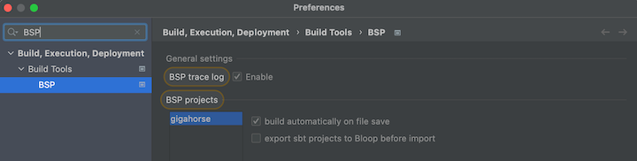
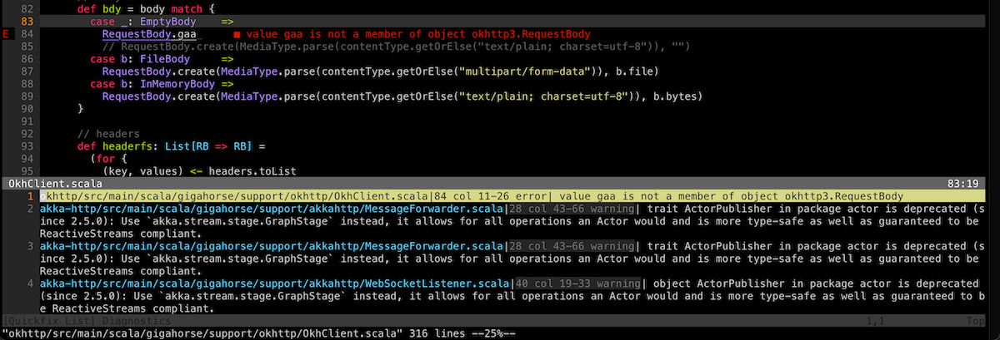

  [Getting-Started]: Getting-Started.html
  [Setup]: Setup.html
  [Basic-Def]: Basic-Def.html
  [Library-Dependencies]: Library-Dependencies.html
  [Multi-Project]: Multi-Project.html
  [Name-Index]: Name-Index.html
  [Triggered-Execution]: Triggered-Execution.html
  [Java-Sources]: Java-Sources.html
  [Testing]: Testing.html
  [Parallel-Execution]: Parallel-Execution.html
  [Discussions]: https://github.com/sbt/sbt/discussions
  [Faq]: Faq.html
  [Apidoc]: https://www.scala-sbt.org/1.x/api/sbt/index.html
  [Get-Help]: https://www.scala-sbt.org/community.html#how-can-I-get-help

sbt Reference Manual
====================

sbt is a build tool for Scala, Java, and
[more](https://github.com/d40cht/sbt-cpp). It requires Java 1.8 or
later.

### Install

See [Installing sbt][Setup] for the setup instructions.

### Getting Started

To get started, *please read* the
[Getting Started Guide][Getting-Started]. You will save
yourself a *lot* of time if you have the right understanding of the big
picture up-front.
All documentation may be found via the table of contents included on the left of every page.

See also [Frequently asked question][Faq].

See [How can I get help?][Get-Help] for where you can get help about sbt.
For discussing sbt development, use [Discussions][Discussions].
To stay up to date about the news related to sbt, follow us [@scala\_sbt](https://twitter.com/scala_sbt).

### Features of sbt

-   Little or no configuration required for simple projects
-   Scala-based [build definition][Basic-Def] that can
    use the full flexibility of Scala code
-   Accurate incremental recompilation using information extracted from
    the compiler
-   [Library management support][Library-Dependencies] using Coursier
-   Continuous compilation and testing with
    [triggered execution][Triggered-Execution]
-   Supports mixed Scala/[Java][Java-Sources] projects
-   Supports [testing][Testing] with ScalaCheck,
    specs, and ScalaTest. JUnit is supported by a plugin.
-   Starts the Scala REPL with project classes and dependencies on the
    classpath
-   Modularization supported with
    [sub-projects][Multi-Project]
-   External project support (list a git repository as a dependency!)
-   [Parallel task execution][Parallel-Execution],
    including parallel test execution

### Also

This documentation can be forked
on [GitHub](https://github.com/sbt/website/). Feel free to make
corrections and add documentation.

Documentation for 0.13.x has been
[archived here](https://www.scala-sbt.org/0.13/docs/index.html). This
documentation applies to sbt 1.10.7.

See also the [API Documentation][Apidoc],
and the [index of names and types][Name-Index].


  [Basic-Def]: Basic-Def.html
  [Scopes]: Scopes.html
  [Task-Graph]: Task-Graph.html

Getting Started with sbt
========================

sbt uses a small number of concepts to support flexible and powerful
build definitions. There are not that many concepts, but sbt is not
exactly like other build systems and there are details you *will*
stumble on if you haven't read the documentation.

The Getting Started Guide covers the concepts you need to know to create
and maintain an sbt build definition.

It is *highly recommended* to read the Getting Started Guide!

If you are in a huge hurry, the most important conceptual background can
be found in [build definition][Basic-Def], [scopes][Scopes], and
[task graph][Task-Graph]. But we don't promise that
it's a good idea to skip the other pages in the guide.

It's best to read in order, as later pages in the Getting Started Guide
build on concepts introduced earlier.

Thanks for trying out sbt and *have fun*!


  [Basic-Def]: Basic-Def.html
  [Hello]: Hello.html
  [Running]: Running.html
  [Command-Line-Reference]: ../docs/Command-Line-Reference.html
  [Mac]: Installing-sbt-on-Mac.html
  [Windows]: Installing-sbt-on-Windows.html
  [Linux]: Installing-sbt-on-Linux.html

Installing sbt
--------------

To create an sbt project, you'll need to take these steps:

-   Install JDK (We recommend Eclipse Adoptium Temurin JDK 8, 11, or 17).
-   Install sbt.
-   Setup a simple [hello world][Hello] project
-   Move on to [running][Running] to learn how to run sbt.
-   Then move on to [.sbt build definition][Basic-Def] to learn more
    about build definitions.

Ultimately, the installation of sbt boils down to a launcher JAR
and a shell script, but depending on your platform, we provide
several ways to make the process less tedious.  Head over to the
installation steps for [macOS][Mac], [Windows][Windows], or
[Linux][Linux].

### Tips and Notes

If you have any trouble running sbt, see [Command line reference][Command-Line-Reference] on
JVM options.


  [ZIP]: https://github.com/sbt/sbt/releases/download/v1.10.7/sbt-1.10.7.zip
  [TGZ]: https://github.com/sbt/sbt/releases/download/v1.10.7/sbt-1.10.7.tgz
  [Manual-Installation]: Manual-Installation.html
  [AdoptiumOpenJDK]: https://adoptium.net/

Installing sbt on macOS
-----------------------

### Install sbt with **cs setup**

Follow [Install](https://www.scala-lang.org/download/) page, and install Scala using Coursier. This should install the latest stable version of `sbt`.

### Install JDK

Follow the link to install [JDK 8 or 11][AdoptiumOpenJDK], or use [SDKMAN!](https://sdkman.io/).

#### [SDKMAN!](https://sdkman.io/)

```scala
$ sdk install java $(sdk list java | grep -o "\b8\.[0-9]*\.[0-9]*\-tem" | head -1)
$ sdk install sbt
```

### Installing from a universal package

Download [ZIP][ZIP] or [TGZ][TGZ] package, and expand it.

### Installing from a third-party package

> **Note:** Third-party packages may not provide the latest version. Please make
> sure to report any issues with these packages to the relevant
> maintainers.

#### [Homebrew](https://brew.sh/)

```
$ brew install sbt
```


  [MSI]: https://github.com/sbt/sbt/releases/download/v1.10.7/sbt-1.10.7.msi
  [ZIP]: https://github.com/sbt/sbt/releases/download/v1.10.7/sbt-1.10.7.zip
  [TGZ]: https://github.com/sbt/sbt/releases/download/v1.10.7/sbt-1.10.7.tgz
  [AdoptiumOpenJDK]: https://adoptium.net

Installing sbt on Windows
-------------------------

### Install sbt with **cs setup**

Follow [Install](https://www.scala-lang.org/download/) page, and install Scala using Coursier. This should install the latest stable version of `sbt`.

### Install JDK

Follow the link to install [JDK 8 or 11][AdoptiumOpenJDK].

### Installing from a universal package

Download [ZIP][ZIP] or [TGZ][TGZ] package and expand it.

### Windows installer

Download [msi installer][MSI] and install it.

### Installing from a third-party package

> **Note:** Third-party packages may not provide the latest version. Please make
> sure to report any issues with these packages to the relevant
> maintainers.

#### [Scoop](https://scoop.sh/)

```
$ scoop install sbt
```

#### [Chocolatey](https://chocolatey.org)

```
$ choco install sbt
```


  [MSI]: https://github.com/sbt/sbt/releases/download/v1.10.7/sbt-1.10.7.msi
  [ZIP]: https://github.com/sbt/sbt/releases/download/v1.10.7/sbt-1.10.7.zip
  [TGZ]: https://github.com/sbt/sbt/releases/download/v1.10.7/sbt-1.10.7.tgz
  [RPM]: https://dl.bintray.com/sbt/rpm/sbt-1.10.7.rpm
  [DEB]: https://dl.bintray.com/sbt/debian/sbt-1.10.7.deb
  [Manual-Installation]: Manual-Installation.html
  [website127]: https://github.com/sbt/website/issues/127
  [cert-bug]: https://bugs.launchpad.net/ubuntu/+source/ca-certificates-java/+bug/1739631
  [openjdk-devel]: https://pkgs.org/download/java-1.8.0-openjdk-devel

Installing sbt on Linux
-----------------------

### Install sbt with **cs setup**

Follow [Install](https://www.scala-lang.org/download/) page, and install Scala using Coursier. This should install the latest stable version of `sbt`.

### Installing from SDKMAN

To install both JDK and sbt, consider using [SDKMAN](https://sdkman.io/).

```scala
$ sdk install java $(sdk list java | grep -o "\b8\.[0-9]*\.[0-9]*\-tem" | head -1)
$ sdk install sbt
```

Using Coursier or SDKMAN has two advantages.

1. They will install the official packaging by Eclipse Adoptium, as opposed to the ["mystery meat OpenJDK builds"](https://mail.openjdk.java.net/pipermail/jdk8u-dev/2019-May/009330.html).
2. They will install `tgz` packaging of sbt that contains all JAR files. (DEB and RPM packages do not to save bandwidth)

### Install JDK

You must first install a JDK. We recommend **Eclipse Adoptium Temurin JDK 8**, **JDK 11**, or **JDK 17**.

The details around the package names differ from one distribution to another. For example, Ubuntu xenial (16.04LTS) has [openjdk-8-jdk](https://packages.ubuntu.com/hu/xenial/openjdk-8-jdk). Redhat family calls it [java-1.8.0-openjdk-devel][openjdk-devel].

### Installing from a universal package

Download [ZIP][ZIP] or [TGZ][TGZ] package and expand it.

### Ubuntu and other Debian-based distributions

[DEB][DEB] package is officially supported by sbt.

Ubuntu and other Debian-based distributions use the DEB format, but usually you don't install your software from a local DEB file. Instead they come with package managers both for the command line (e.g. `apt-get`, `aptitude`) or with a graphical user interface (e.g. Synaptic).
Run the following from the terminal to install `sbt` (You'll need superuser privileges to do so, hence the `sudo`).

    sudo apt-get update
    sudo apt-get install apt-transport-https curl gnupg -yqq
    echo "deb https://repo.scala-sbt.org/scalasbt/debian all main" | sudo tee /etc/apt/sources.list.d/sbt.list
    echo "deb https://repo.scala-sbt.org/scalasbt/debian /" | sudo tee /etc/apt/sources.list.d/sbt_old.list
    curl -sL "https://keyserver.ubuntu.com/pks/lookup?op=get&search=0x2EE0EA64E40A89B84B2DF73499E82A75642AC823" | sudo -H gpg --no-default-keyring --keyring gnupg-ring:/etc/apt/trusted.gpg.d/scalasbt-release.gpg --import
    sudo chmod 644 /etc/apt/trusted.gpg.d/scalasbt-release.gpg
    sudo apt-get update
    sudo apt-get install sbt

Package managers will check a number of configured repositories for packages to offer for installation. You just have to add the repository to the places your package manager will check.

Once `sbt` is installed, you'll be able to manage the package in `aptitude` or Synaptic after you updated their package cache. You should also be able to see the added repository at the bottom of the list in System Settings -> Software & Updates -> Other Software:


**Note**: There have been reports about SSL error using Ubuntu: `Server access Error: java.lang.RuntimeException: Unexpected error: java.security.InvalidAlgorithmParameterException: the trustAnchors parameter must be non-empty url=https://repo1.maven.org/maven2/org/scala-sbt/sbt/1.1.0/sbt-1.1.0.pom`, which apparently stems from OpenJDK 9 using PKCS12 format for `/etc/ssl/certs/java/cacerts` [cert-bug][cert-bug]. According to <https://stackoverflow.com/a/50103533/3827> it is fixed in Ubuntu Cosmic (18.10), but Ubuntu Bionic LTS (18.04) is still waiting for a release. See the answer for a workaround.

**Note**: `sudo apt-key adv --keyserver hkps://keyserver.ubuntu.com:443 --recv 2EE0EA64E40A89B84B2DF73499E82A75642AC823` may not work on Ubuntu Bionic LTS (18.04) since it's using a buggy GnuPG, so we are advising to use web API to download the public key in the above.

### Red Hat Enterprise Linux and other RPM-based distributions

[RPM][RPM] package is officially supported by sbt.

Red Hat Enterprise Linux and other RPM-based distributions use the RPM format.
Run the following from the terminal to install `sbt` (You'll need superuser privileges to do so, hence the `sudo`).

    # remove old Bintray repo file
    sudo rm -f /etc/yum.repos.d/bintray-rpm.repo
    curl -L https://www.scala-sbt.org/sbt-rpm.repo > sbt-rpm.repo
    sudo mv sbt-rpm.repo /etc/yum.repos.d/
    sudo yum install sbt

On Fedora (31 and above), use `sbt-rpm.repo`:

    # remove old Bintray repo file
    sudo rm -f /etc/yum.repos.d/bintray-rpm.repo
    curl -L https://www.scala-sbt.org/sbt-rpm.repo > sbt-rpm.repo
    sudo mv sbt-rpm.repo /etc/yum.repos.d/
    sudo dnf install sbt

> **Note:** Please report any issues with these to the
> [sbt](https://github.com/sbt/sbt)
> project.

### Gentoo

The official tree contains ebuilds for sbt. To install the latest available version do:

    emerge dev-java/sbt


  [Basic-Def]: Basic-Def.html
  [Setup]: Setup.html
  [Running]: Running.html
  [Essential-sbt]: https://www.scalawilliam.com/essential-sbt/

sbt by example
--------------

This page assumes you've [installed sbt 1][Setup].

Let's start with examples rather than explaining how sbt works or why.

### Create a minimum sbt build

```
$ mkdir foo-build
$ cd foo-build
$ touch build.sbt
```

### Start sbt shell

```
$ sbt
[info] Updated file /tmp/foo-build/project/build.properties: set sbt.version to 1.9.3
[info] welcome to sbt 1.9.3 (Eclipse Adoptium Java 17.0.8)
[info] Loading project definition from /tmp/foo-build/project
[info] loading settings for project foo-build from build.sbt ...
[info] Set current project to foo-build (in build file:/tmp/foo-build/)
[info] sbt server started at local:///Users/eed3si9n/.sbt/1.0/server/abc4fb6c89985a00fd95/sock
[info] started sbt server
sbt:foo-build>
```

### Exit sbt shell

To leave sbt shell, type `exit` or use Ctrl+D (Unix) or Ctrl+Z (Windows).

```
sbt:foo-build> exit
```

### Compile a project

As a convention, we will use the `sbt:...>` or `>` prompt to mean that we're in the sbt interactive shell.

```
$ sbt
sbt:foo-build> compile
```

### Recompile on code change

Prefixing the `compile` command (or any other command) with `~` causes the command to be automatically
re-executed whenever one of the source files within the project is modified. For example:

```
sbt:foo-build> ~compile
[success] Total time: 0 s, completed 28 Jul 2023, 13:32:35
[info] 1. Monitoring source files for foo-build/compile...
[info]    Press <enter> to interrupt or '?' for more options.
```

### Create a source file

Leave the previous command running. From a different shell or in your file manager create in the foo-build
directory the following nested directories: `src/main/scala/example`. Then, create `Hello.scala`
in the `example` directory using your favorite editor as follows:

```scala
package example

object Hello {
  def main(args: Array[String]): Unit = {
    println("Hello")
  }
}
```

This new file should be picked up by the running command:

```
[info] Build triggered by /tmp/foo-build/src/main/scala/example/Hello.scala. Running 'compile'.
[info] compiling 1 Scala source to /tmp/foo-build/target/scala-2.12/classes ...
[success] Total time: 0 s, completed 28 Jul 2023, 13:38:55
[info] 2. Monitoring source files for foo-build/compile...
[info]    Press <enter> to interrupt or '?' for more options.
```

Press `Enter` to exit `~compile`.

### Run a previous command

From sbt shell, press up-arrow twice to find the `compile` command that you
executed at the beginning.

```
sbt:foo-build> compile
```

### Getting help

Use the `help` command to get basic help about the available commands.

```
sbt:foo-build> help

  <command> (; <command>)*                       Runs the provided semicolon-separated commands.
  about                                          Displays basic information about sbt and the build.
  tasks                                          Lists the tasks defined for the current project.
  settings                                       Lists the settings defined for the current project.
  reload                                         (Re)loads the current project or changes to plugins project or returns from it.
  new                                            Creates a new sbt build.
  new                                            Creates a new sbt build.
  projects                                       Lists the names of available projects or temporarily adds/removes extra builds to the session.

....
```

Display the description of a specific task:

```
sbt:foo-build> help run
Runs a main class, passing along arguments provided on the command line.
```

### Run your app

```
sbt:foo-build> run
[info] running example.Hello
Hello
[success] Total time: 0 s, completed 28 Jul 2023, 13:40:31
```

### Set ThisBuild / scalaVersion from sbt shell

```
sbt:foo-build> set ThisBuild / scalaVersion := "2.13.12"
[info] Defining ThisBuild / scalaVersion
[info] The new value will be used by Compile / bspBuildTarget, Compile / dependencyTreeCrossProjectId and 50 others.
[info]  Run `last` for details.
[info] Reapplying settings...
[info] set current project to foo-build (in build file:/tmp/foo-build/)
```

Check the `scalaVersion` setting:

```
sbt:foo-build> scalaVersion
[info] 2.13.12
```

### Save the session to build.sbt

We can save the ad-hoc settings using `session save`.

```
sbt:foo-build> session save
[info] Reapplying settings...
[info] set current project to foo-build (in build file:/tmp/foo-build/)
[warn] build source files have changed
[warn] modified files:
[warn]   /tmp/foo-build/build.sbt
[warn] Apply these changes by running `reload`.
[warn] Automatically reload the build when source changes are detected by setting `Global / onChangedBuildSource := ReloadOnSourceChanges`.
[warn] Disable this warning by setting `Global / onChangedBuildSource := IgnoreSourceChanges`.
```

`build.sbt` file should now contain:

```scala
ThisBuild / scalaVersion := "2.13.12"

```

### Name your project

Using an editor, change `build.sbt` as follows:

```scala
ThisBuild / scalaVersion := "2.13.12"
ThisBuild / organization := "com.example"

lazy val hello = (project in file("."))
  .settings(
    name := "Hello"
  )
```

### Reload the build

Use the `reload` command to reload the build. The command causes the
`build.sbt` file to be re-read, and its settings applied.

```
sbt:foo-build> reload
[info] welcome to sbt 1.9.3 (Eclipse Adoptium Java 17.0.8)
[info] loading project definition from /tmp/foo-build/project
[info] loading settings for project hello from build.sbt ...
[info] set current project to Hello (in build file:/tmp/foo-build/)
sbt:Hello>
```

Note that the prompt has now changed to `sbt:Hello>`.

### Add toolkit-test to libraryDependencies

Using an editor, change `build.sbt` as follows:

```scala
ThisBuild / scalaVersion := "2.13.12"
ThisBuild / organization := "com.example"

lazy val hello = project
  .in(file("."))
  .settings(
    name := "Hello",
    libraryDependencies += "org.scala-lang" %% "toolkit-test" % "0.1.7" % Test
  )
```

Use the `reload` command to reflect the change in `build.sbt`.

```
sbt:Hello> reload
```

### Run tests

```
sbt:Hello> test
```

### Run incremental tests continuously

```
sbt:Hello> ~testQuick
```

### Write a test

Leaving the previous command running, create a file named `src/test/scala/example/HelloSuite.scala`
using an editor:

```scala

class HelloSuite extends munit.FunSuite {
  test("Hello should start with H") {
    assert("hello".startsWith("H"))
  }
}
```

`~testQuick` should pick up the change:

```
[info] 2. Monitoring source files for hello/testQuick...
[info]    Press <enter> to interrupt or '?' for more options.
[info] Build triggered by /tmp/foo-build/src/test/scala/example/HelloSuite.scala. Running 'testQuick'.
[info] compiling 1 Scala source to /tmp/foo-build/target/scala-2.13/test-classes ...
HelloSuite:
==> X HelloSuite.Hello should start with H  0.004s munit.FailException: /tmp/foo-build/src/test/scala/example/HelloSuite.scala:4 assertion failed
3:  test("Hello should start with H") {
4:    assert("hello".startsWith("H"))
5:  }
    at munit.FunSuite.assert(FunSuite.scala:11)
    at HelloSuite.$anonfun$new$1(HelloSuite.scala:4)
[error] Failed: Total 1, Failed 1, Errors 0, Passed 0
[error] Failed tests:
[error]         HelloSuite
[error] (Test / testQuick) sbt.TestsFailedException: Tests unsuccessful
```

### Make the test pass

Using an editor, change `src/test/scala/example/HelloSuite.scala` to:

```scala

class HelloSuite extends munit.FunSuite {
  test("Hello should start with H") {
    assert("Hello".startsWith("H"))
  }
}
```

Confirm that the test passes, then press `Enter` to exit the continuous test.

### Add a library dependency

Using an editor, change `build.sbt` as follows:

```scala
ThisBuild / scalaVersion := "2.13.12"
ThisBuild / organization := "com.example"

lazy val hello = project
  .in(file("."))
  .settings(
    name := "Hello",
    libraryDependencies ++= Seq(
      "org.scala-lang" %% "toolkit" % "0.1.7",
      "org.scala-lang" %% "toolkit-test" % "0.1.7" % Test
    )
  )
```

Use the `reload` command to reflect the change in `build.sbt`.

### Use Scala REPL

We can find out the current weather in New York.

```scala
sbt:Hello> console
[info] Starting scala interpreter...
Welcome to Scala 2.13.12 (OpenJDK 64-Bit Server VM, Java 17).
Type in expressions for evaluation. Or try :help.

scala> :paste
// Entering paste mode (ctrl-D to finish)

import sttp.client4.quick._
import sttp.client4.Response

val newYorkLatitude: Double = 40.7143
val newYorkLongitude: Double = -74.006
val response: Response[String] = quickRequest
  .get(
    uri"https://api.open-meteo.com/v1/forecast?latitude=$newYorkLatitude&longitude=$newYorkLongitude&current_weather=true"
  )
  .send()

println(ujson.read(response.body).render(indent = 2))

// press Ctrl+D

// Exiting paste mode, now interpreting.

{
  "latitude": 40.710335,
  "longitude": -73.99307,
  "generationtime_ms": 0.36704540252685547,
  "utc_offset_seconds": 0,
  "timezone": "GMT",
  "timezone_abbreviation": "GMT",
  "elevation": 51,
  "current_weather": {
    "temperature": 21.3,
    "windspeed": 16.7,
    "winddirection": 205,
    "weathercode": 3,
    "is_day": 1,
    "time": "2023-08-04T10:00"
  }
}
import sttp.client4.quick._
import sttp.client4.Response
val newYorkLatitude: Double = 40.7143
val newYorkLongitude: Double = -74.006
val response: sttp.client4.Response[String] = Response({"latitude":40.710335,"longitude":-73.99307,"generationtime_ms":0.36704540252685547,"utc_offset_seconds":0,"timezone":"GMT","timezone_abbreviation":"GMT","elevation":51.0,"current_weather":{"temperature":21.3,"windspeed":16.7,"winddirection":205.0,"weathercode":3,"is_day":1,"time":"2023-08-04T10:00"}},200,,List(:status: 200, content-encoding: deflate, content-type: application/json; charset=utf-8, date: Fri, 04 Aug 2023 10:09:11 GMT),List(),RequestMetadata(GET,https://api.open-meteo.com/v1/forecast?latitude=40.7143&longitude...

scala> :q // to quit
```

### Make a subproject

Change `build.sbt` as follows:

```scala
ThisBuild / scalaVersion := "2.13.12"
ThisBuild / organization := "com.example"

lazy val hello = project
  .in(file("."))
  .settings(
    name := "Hello",
    libraryDependencies ++= Seq(
      "org.scala-lang" %% "toolkit" % "0.1.7",
      "org.scala-lang" %% "toolkit-test" % "0.1.7" % Test
    )
  )

lazy val helloCore = project
  .in(file("core"))
  .settings(
    name := "Hello Core"
  )
```

Use the `reload` command to reflect the change in `build.sbt`.

### List all subprojects

```
sbt:Hello> projects
[info] In file:/tmp/foo-build/
[info]   * hello
[info]     helloCore
```

### Compile the subproject

```
sbt:Hello> helloCore/compile
```

### Add toolkit-test to the subproject

Change `build.sbt` as follows:

```scala
ThisBuild / scalaVersion := "2.13.12"
ThisBuild / organization := "com.example"

val toolkitTest = "org.scala-lang" %% "toolkit-test" % "0.1.7"

lazy val hello = project
  .in(file("."))
  .settings(
    name := "Hello",
    libraryDependencies ++= Seq(
      "org.scala-lang" %% "toolkit" % "0.1.7",
      toolkitTest % Test
    )
  )

lazy val helloCore = project
  .in(file("core"))
  .settings(
    name := "Hello Core",
    libraryDependencies += toolkitTest % Test
  )
```

### Broadcast commands

Set aggregate so that the command sent to `hello` is broadcast to `helloCore` too:

```scala
ThisBuild / scalaVersion := "2.13.12"
ThisBuild / organization := "com.example"

val toolkitTest = "org.scala-lang" %% "toolkit-test" % "0.1.7"

lazy val hello = project
  .in(file("."))
  .aggregate(helloCore)
  .settings(
    name := "Hello",
    libraryDependencies ++= Seq(
      "org.scala-lang" %% "toolkit" % "0.1.7",
      toolkitTest % Test
    )
  )

lazy val helloCore = project
  .in(file("core"))
  .settings(
    name := "Hello Core",
    libraryDependencies += toolkitTest % Test
  )
```

After `reload`, `~testQuick` now runs on both subprojects:

```scala
sbt:Hello> ~testQuick
```

Press `Enter` to exit the continuous test.

### Make hello depend on helloCore

Use `.dependsOn(...)` to add a dependency on other subprojects. Also let's move the toolkit dependency to `helloCore`.

```scala
ThisBuild / scalaVersion := "2.13.12"
ThisBuild / organization := "com.example"

val toolkitTest = "org.scala-lang" %% "toolkit-test" % "0.1.7"

lazy val hello = project
  .in(file("."))
  .aggregate(helloCore)
  .dependsOn(helloCore)
  .settings(
    name := "Hello",
    libraryDependencies += toolkitTest % Test
  )

lazy val helloCore = project
  .in(file("core"))
  .settings(
    name := "Hello Core",
    libraryDependencies += "org.scala-lang" %% "toolkit" % "0.1.7",
    libraryDependencies += toolkitTest % Test
  )
```

### Parse JSON using uJson

Let's use uJson from the toolkit in `helloCore`.

```scala
ThisBuild / scalaVersion := "2.13.12"
ThisBuild / organization := "com.example"

val toolkitTest = "org.scala-lang" %% "toolkit-test" % "0.1.7"

lazy val hello = project
  .in(file("."))
  .aggregate(helloCore)
  .dependsOn(helloCore)
  .settings(
    name := "Hello",
    libraryDependencies += toolkitTest % Test
  )

lazy val helloCore = project
  .in(file("core"))
  .settings(
    name := "Hello Core",
    libraryDependencies += "org.scala-lang" %% "toolkit" % "0.1.7",
    libraryDependencies += toolkitTest % Test
  )
```

After `reload`, add `core/src/main/scala/example/core/Weather.scala`:

```scala
package example.core

import sttp.client4.quick._
import sttp.client4.Response

object Weather {
  def temp() = {
    val response: Response[String] = quickRequest
      .get(
        uri"https://api.open-meteo.com/v1/forecast?latitude=40.7143&longitude=-74.006&current_weather=true"
      )
      .send()
    val json = ujson.read(response.body)
    json.obj("current_weather")("temperature").num
  }
}
```

Next, change `src/main/scala/example/Hello.scala` as follows:

```scala
package example

import example.core.Weather

object Hello {
  def main(args: Array[String]): Unit = {
    val temp = Weather.temp()
    println(s"Hello! The current temperature in New York is $temp C.")
  }
}
```

Let's run the app to see if it worked:

```
sbt:Hello> run
[info] compiling 1 Scala source to /tmp/foo-build/core/target/scala-2.13/classes ...
[info] compiling 1 Scala source to /tmp/foo-build/target/scala-2.13/classes ...
[info] running example.Hello
Hello! The current temperature in New York is 22.7 C.
```

### Add sbt-native-packager plugin

Using an editor, create `project/plugins.sbt`:

```scala
addSbtPlugin("com.github.sbt" % "sbt-native-packager" % "1.9.4")
```

Next change `build.sbt` as follows to add `JavaAppPackaging`:

```scala
ThisBuild / scalaVersion := "2.13.12"
ThisBuild / organization := "com.example"

val toolkitTest = "org.scala-lang" %% "toolkit-test" % "0.1.7"

lazy val hello = project
  .in(file("."))
  .aggregate(helloCore)
  .dependsOn(helloCore)
  .enablePlugins(JavaAppPackaging)
  .settings(
    name := "Hello",
    libraryDependencies += toolkitTest % Test,
    maintainer := "A Scala Dev!"
  )

lazy val helloCore = project
  .in(file("core"))
  .settings(
    name := "Hello Core",
    libraryDependencies += "org.scala-lang" %% "toolkit" % "0.1.7",
    libraryDependencies += toolkitTest % Test
  )
```

### Reload and create a .zip distribution

```
sbt:Hello> reload
...
sbt:Hello> dist
[info] Wrote /private/tmp/foo-build/target/scala-2.13/hello_2.13-0.1.0-SNAPSHOT.pom
[info] Main Scala API documentation to /tmp/foo-build/target/scala-2.13/api...
[info] Main Scala API documentation successful.
[info] Main Scala API documentation to /tmp/foo-build/core/target/scala-2.13/api...
[info] Wrote /tmp/foo-build/core/target/scala-2.13/hello-core_2.13-0.1.0-SNAPSHOT.pom
[info] Main Scala API documentation successful.
[success] All package validations passed
[info] Your package is ready in /tmp/foo-build/target/universal/hello-0.1.0-SNAPSHOT.zip
```

Here's how you can run the packaged app:

```
$ /tmp/someother
$ cd /tmp/someother
$ unzip -o -d /tmp/someother /tmp/foo-build/target/universal/hello-0.1.0-SNAPSHOT.zip
$ ./hello-0.1.0-SNAPSHOT/bin/hello
Hello! The current temperature in New York is 22.7 C.
```

### Dockerize your app

_Note that a Docker daemon will need to be running in order for this to work._

```
sbt:Hello> Docker/publishLocal
....
[info] Built image hello with tags [0.1.0-SNAPSHOT]
```

Here's how to run the Dockerized app:

```
$ docker run hello:0.1.0-SNAPSHOT
Hello! The current temperature in New York is 22.7 C.
```

### Set the version

Change `build.sbt` as follows:

```scala
ThisBuild / version := "0.1.0"
ThisBuild / scalaVersion := "2.13.12"
ThisBuild / organization := "com.example"

val toolkitTest = "org.scala-lang" %% "toolkit-test" % "0.1.7"

lazy val hello = project
  .in(file("."))
  .aggregate(helloCore)
  .dependsOn(helloCore)
  .enablePlugins(JavaAppPackaging)
  .settings(
    name := "Hello",
    libraryDependencies += toolkitTest % Test,
    maintainer := "A Scala Dev!"
  )

lazy val helloCore = project
  .in(file("core"))
  .settings(
    name := "Hello Core",
    libraryDependencies += "org.scala-lang" %% "toolkit" % "0.1.7",
    libraryDependencies += toolkitTest % Test
  )
```

### Switch scalaVersion temporarily

```
sbt:Hello> ++3.3.1!
[info] Forcing Scala version to 3.3.1 on all projects.
[info] Reapplying settings...
[info] Set current project to Hello (in build file:/tmp/foo-build/)
```

Check the `scalaVersion` setting:

```
sbt:Hello> scalaVersion
[info] helloCore / scalaVersion
[info]  3.3.1
[info] scalaVersion
[info]  3.3.1
```

This setting will go away after `reload`.

### Inspect the dist task

To find out more about `dist`, try `help` and `inspect`.

```scala
sbt:Hello> help dist
Creates the distribution packages.
sbt:Hello> inspect dist
```

To call inspect recursively on the dependency tasks use `inspect tree`.

```scala
sbt:Hello> inspect tree dist
[info] dist = Task[java.io.File]
[info]   +-Universal / dist = Task[java.io.File]
....
```

### Batch mode

You can also run sbt in batch mode, passing sbt commands directly from the terminal.

```
$ sbt clean "testOnly HelloSuite"
```

**Note**: Running in batch mode requires JVM spinup and JIT each time,
so **your build will run much slower**.
For day-to-day coding, we recommend using the sbt shell
or a continuous test like `~testQuick`.

### sbt new command

You can use the sbt `new` command to quickly setup a simple "Hello world" build.

```
$ sbt new scala/scala-seed.g8
....
A minimal Scala project.

name [My Something Project]: hello

Template applied in ./hello
```

When prompted for the project name, type `hello`.

This will create a new project under a directory named `hello`.

### Credits

This page is based on the [Essential sbt][essential-sbt] tutorial written by William "Scala William" Narmontas.


  [ByExample]: sbt-by-example.html
  [Setup]: Setup.html
  [Organizing-Build]: Organizing-Build.html

Directory structure
-------------------

This page assumes you've [installed sbt][Setup] and seen
[sbt by example][ByExample].

### Base directory

In sbt's terminology, the "base directory" is the directory containing
the project. So if you created a project `hello` containing
`/tmp/foo-build/build.sbt` as in the [sbt by example][ByExample],
`/tmp/foo-build` is your base directory.

### Source code

sbt uses the same directory structure as
[Maven](https://maven.apache.org/) for source files by default (all paths
are relative to the base directory):

```
src/
  main/
    resources/
       <files to include in main jar here>
    scala/
       <main Scala sources>
    scala-2.12/
       <main Scala 2.12 specific sources>
    java/
       <main Java sources>
  test/
    resources
       <files to include in test jar here>
    scala/
       <test Scala sources>
    scala-2.12/
       <test Scala 2.12 specific sources>
    java/
       <test Java sources>
```

Other directories in `src/` will be ignored. Additionally, all hidden
directories will be ignored.

Source code can be placed in the project's base directory as
`hello/app.scala`, which may be OK for small projects,
though for normal projects people tend to keep the projects in
the `src/main/` directory to keep things neat.
The fact that you can place `*.scala` source code in the base directory might seem like
an odd trick, but this fact becomes relevant [later][Organizing-Build].

### sbt build definition files

The build definition is described in `build.sbt` (actually any files named `*.sbt`) in the project's base directory.

```
build.sbt
```

### Build support files

In addition to `build.sbt`, `project` directory can contain `.scala` files
that define helper objects and one-off plugins.
See [organizing the build][Organizing-Build] for more.

```
build.sbt
project/
  Dependencies.scala
```

You may see `.sbt` files inside `project/` but they are not equivalent to
`.sbt` files in the project's base directory. Explaining this will
come [later][Organizing-Build], since you'll need some background information first.

### Build products

Generated files (compiled classes, packaged jars, managed files, caches,
and documentation) will be written to the `target` directory by default.

### Configuring version control

Your `.gitignore` (or equivalent for other version control systems) should
contain:

```
target/
```

Note that this deliberately has a trailing `/` (to match only directories)
and it deliberately has no leading `/` (to match `project/target/` in
addition to plain `target/`).


  [ByExample]: sbt-by-example.html
  [Setup]: Setup.html
  [Triggered-Execution]: ../docs/Triggered-Execution.html
  [Command-Line-Reference]: ../docs/Command-Line-Reference.html

Running
-------

This page describes how to use sbt once you have set up your project. It
assumes you've [installed sbt][Setup] and went through
[sbt by example][ByExample].

### sbt shell

Run sbt in your project directory with no arguments:

```
$ sbt
```

Running sbt with no command line arguments starts sbt shell.
sbt shell has a command prompt (with tab completion and
history!).

For example, you could type `compile` at the sbt shell:

```
> compile
```

To `compile` again, press up arrow and then enter.

To run your program, type `run`.

To leave sbt shell, type `exit` or use Ctrl+D (Unix) or Ctrl+Z
(Windows).

### Batch mode

You can also run sbt in batch mode, specifying a space-separated list of
sbt commands as arguments. For sbt commands that take arguments, pass
the command and arguments as one argument to sbt by enclosing them in
quotes. For example,

```
$ sbt clean compile "testOnly TestA TestB"
```

In this example, `testOnly` has arguments, `TestA` and `TestB`. The commands
will be run in sequence (`clean`, `compile`, then `testOnly`).

**Note**: Running in batch mode requires JVM spinup and JIT each time,
so **your build will run much slower**.
For day-to-day coding, we recommend using the sbt shell
or Continuous build and test feature described below.

Beginning in sbt 0.13.16, using batch mode in sbt will issue an
informational startup message,

```
$ sbt clean compile
[info] Executing in batch mode. For better performance use sbt's shell
...
```

It will only be triggered for `sbt compile`, and it can also be
suppressed with `suppressSbtShellNotification := true`.

### Continuous build and test

To speed up your edit-compile-test cycle, you can ask sbt to
automatically recompile or run tests whenever you save a source file.

Make a command run when one or more source files change by prefixing the
command with `~`. For example, in sbt shell try:

```
> ~testQuick
```

Press enter to stop watching for changes.

You can use the `~` prefix with either sbt shell or batch mode.

See [Triggered Execution][Triggered-Execution] for more details.

### Common commands

Here are some of the most common sbt commands. For a more complete list,
see [Command Line Reference][Command-Line-Reference].

<table class="table table-striped">
  <tr>
    <th>Command</th>
    <th>Description</th>
  </tr>
  <tr>
    <td><tt>clean</tt></td>
    <td>Deletes all generated files (in the <tt>target</tt> directory).</td>
  </tr>
  <tr>
    <td><tt>compile</tt></td>
    <td>Compiles the main sources (in <tt>src/main/scala</tt> and
   <tt>src/main/java</tt> directories).</td>
  </tr>
  <tr>
    <td><tt>test</tt></td>
    <td>Compiles and runs all tests.</td>
  </tr>
  <tr>
    <td><tt>console</tt></td>
    <td>Starts the Scala interpreter with a classpath including the
   compiled sources and all dependencies. To return to sbt, type <tt>:quit</tt>,
   Ctrl+D (Unix), or Ctrl+Z (Windows).</td>
  </tr>
  <tr>
    <td><nobr><tt>run &lt;argument&gt;*</tt></nobr></td>
    <td>Runs the main class for the project in the same
   virtual machine as sbt.</td>
  </tr>
  <tr>
    <td><tt>package</tt></td>
    <td>Creates a jar file containing the files in
    <tt>src/main/resources</tt> and the classes compiled from <tt>src/main/scala</tt> and
    <tt>src/main/java</tt>.</td>
  </tr>
  <tr>
    <td><tt>help &lt;command&gt;</tt></td>
    <td>Displays detailed help for the specified command.
    If no command is provided, displays brief descriptions of all
    commands.</td>
  </tr>
  <tr>
    <td><tt>reload</tt></td>
    <td>Reloads the build definition (<tt>build.sbt</tt>, <tt>project/*.scala</tt>,
    <tt>project/*.sbt</tt> files). Needed if you change the build definition.</td>
  </tr>
</table>

### Tab completion

sbt shell has tab completion, including at an empty prompt. A
special sbt convention is that pressing tab once may show only a subset
of most likely completions, while pressing it more times shows more
verbose choices.

<a name="history"></a>

### sbt shell history

sbt shell remembers history even if you exit sbt and restart it.
The easiest way to access history is to press the up arrow key to cycle
through previously entered commands.

**Note**: `Ctrl-R` incrementally _searches_ the history backwards.

Through JLine's integration with the terminal environment,
you can customize sbt shell by changing `$HOME/.inputrc` file.
For example, the following settings in `$HOME/.inputrc` will allow up- and down-arrow to perform
prefix-based search of the history.

```
"\e[A": history-search-backward
"\e[B": history-search-forward
"\e[C": forward-char
"\e[D": backward-char
```

sbt shell also supports the following commands:

<table class="table table-striped">
  <tr>
    <th>Command</th>
    <th>Description</th>
  </tr>
  <tr>
    <td><tt>!</tt></td>
    <td>Show history command help.</td>
  </tr>
  <tr>
    <td><tt>!!</tt></td>
    <td>Execute the previous command again.</td>
  </tr>
  <tr>
    <td><tt>!:</tt></td>
    <td>Show all previous commands.</td>
  </tr>
  <tr>
    <td><tt>!:n</tt></td>
    <td>Show the last <tt>n</tt> commands.</td>
  </tr>
  <tr>
    <td><tt>!n</tt></td>
    <td>Execute the command with index <tt>n</tt>, as shown by the <tt>!:</tt> command.</td>
  </tr>
  <tr>
    <td><tt>!-n</tt></td>
    <td>Execute the nth command before this one.</td>
  </tr>
  <tr>
    <td><tt>!string</tt></td>
    <td>Execute the most recent command starting with 'string.'</td>
  </tr>
  <tr>
    <td><tt>!?string</tt></td>
    <td>Execute the most recent command containing 'string.'</td>
  </tr>
</table>


  [metals]: https://scalameta.org/metals/
  [intellij]: https://www.jetbrains.com/idea/
  [intellij-scala-plugin-2021-2]: https://blog.jetbrains.com/scala/2021/07/27/intellij-scala-plugin-2021-2/#Compiler-based_highlighting
  [lsp]: https://microsoft.github.io/language-server-protocol/
  [vscode]: https://code.visualstudio.com/
  [neovim]: https://neovim.io/
  [bsp]: https://build-server-protocol.github.io/
  [vscode-debugging]: https://code.visualstudio.com/docs/editor/debugging
  [intellij-debugging]: https://www.jetbrains.com/help/idea/debugging-code.html
  [nvim-metals]: https://github.com/scalameta/nvim-metals
  [lsp.lua]: https://github.com/scalameta/nvim-metals/discussions/39#discussion-82302

IDE Integration
---------------

While it's possible to code Scala with just an editor and sbt,
most programmers today use an Integrated Development Environment, or IDE for short.
Two of the popular IDEs in Scala are [Metals][metals] and [IntelliJ IDEA][intellij],
and they both integrate with sbt builds.

- [Using sbt as Metals build server](#metals)
- [Importing to IntelliJ IDEA](#intellij-import)
- [Using sbt as IntelliJ IDEA build server](#intellij-bsp)
- [Using Neovim as Metals frontend](#nvim-metals)

<a id="metals"></a>
### Using sbt as Metals build server

[Metals][metals] is an open source _language server_ for Scala, which can
act as the backend for [VS Code][vscode] and other editors that support [LSP][lsp].
Metals in turn supports different _build servers_ including sbt via the [Build Server Protocol][bsp] (BSP).

To use Metals on VS Code:

1. Install Metals from Extensions tab:<br>
   
2. Open a directory containing a `build.sbt` file.
3. From the menubar, run View > Command Palette... (`Cmd-Shift-P` on macOS) "Metals: Switch build server", and select "sbt"<br>
   
4. Once the import process is complete, open a Scala file to see that code completion works:<br>
   

Use the following setting to opt-out some of the subprojects from BSP.

```scala
bspEnabled := false
```

When you make changes to the code and save them (`Cmd-S` on macOS), Metals will invoke sbt to do
the actual building work.

#### Interactive debugging on VS Code

1. Metals supports interactive debugging by setting break points in the code:<br>
  
2. Interactive debugging can be started by right-clicking on an unit test, and selecting "Debug Test."
   When the test hits a break point, you can inspect the values of the variables:<br>
   

See [Debugging][vscode-debugging] page on VS Code documentation for more details on how to navigate an interactive debugging session.

#### Logging into sbt session

While Metals uses sbt as the build server, we can also log into the same sbt session using a thin client.

- From Terminal section, type in `sbt --client`<br>
  

This lets you log into the sbt session Metals has started. In there you can call `testOnly` and other tasks with
the code already compiled.

<a id="intellij-import"></a>
### Importing to IntelliJ IDEA

[IntelliJ IDEA][intellij] is an IDE created by JetBrains, and the Community Edition is open source under Apache v2 license.
IntelliJ integrates with many build tools, including sbt, to import the project.
This is a more traditional approach that might be more reliable than using BSP approach.

To import a build to IntelliJ IDEA:

1. Install Scala plugin on the Plugins tab:<br>
   
2. From Projects, open a directory containing a `build.sbt` file.<br>
   
3. Once the import process is complete, open a Scala file to see that code completion works.

IntelliJ Scala plugin uses its own lightweight compilation engine to detect errors, which is fast but sometimes incorrect. Per [compiler-based highlighting][intellij-scala-plugin-2021-2], IntelliJ can be configured to use the Scala compiler for error highlighting.

#### Interactive debugging with IntelliJ IDEA

1. IntelliJ supports interactive debugging by setting break points in the code:<br>
   
2. Interactive debugging can be started by right-clicking on an unit test, and selecting "Debug '&lt;test name&gt;'."
　　Alternatively, you can click the green "run" icon on the left part of the editor near the unit test.
   When the test hits a break point, you can inspect the values of the variables:<br>
   

See [Debug Code][intellij-debugging] page on IntelliJ documentation for more details on how to navigate an interactive debugging session.

<a id="intellij-bsp"></a>
### Using sbt as IntelliJ IDEA build server (advanced)

Importing the build to IntelliJ means that you're effectively using IntelliJ as the build tool and the compiler while you code (see also [compiler-based highlighting][intellij-scala-plugin-2021-2]).
While many users are happy with the experience, depending on the code base some of the compilation errors may be false, it may not work well with plugins that generate sources, and generally you might want to code with the identical build semantics as sbt.
Thankfully, modern IntelliJ supports alternative _build servers_ including sbt via the [Build Server Protocol][bsp] (BSP).

The benefit of using BSP with IntelliJ is that you're using sbt to do the actual build work, so if you are the kind of programmer who had sbt session up on the side, this avoids double compilation.

<table class="table table-striped">
  <tr>
    <th><nobr></th>
    <th>Import to IntelliJ</th>
    <th>BSP with IntelliJ</th>
  </tr>
  <tr>
    <td>Reliability</td>
    <td>✅ Reliable behavior</td>
    <td>⚠️ Less mature. Might encounter UX issues.</td>
  </tr>
  <tr>
    <td>Responsiveness</td>
    <td>✅</td>
    <td>⚠️</td>
  </tr>
  <tr>
    <td>Correctness</td>
    <td>⚠️ Uses its own compiler for type checking, but can be configured to use scalac</td>
    <td>✅ Uses Zinc + Scala compiler for type checking</td>
  </tr>
  <tr>
    <td>Generated source</td>
    <td>❌ Generated source requires resync</td>
    <td>✅</td>
  </tr>
  <tr>
    <td>Build reuse</td>
    <td>❌ Using sbt side-by-side requires double build</td>
    <td>✅</td>
  </tr>
</table>

To use sbt as build server on IntelliJ:

1. Install Scala plugin on the Plugins tab.
2. To use the BSP approach, do not use Open button on the Project tab:<br>
   
3. From menubar, click New > "Project From Existing Sources", or Find Action (`Cmd-Shift-P` on macOS) and
   type "Existing" to find "Import Project From Existing Sources":<br>
   
4. Open a `build.sbt` file. Select **BSP** when prompted:<br>
   
5. Select **sbt (recommended)** as the tool to import the BSP workspace:<br>
   
6. Once the import process is complete, open a Scala file to see that code completion works:<br>
   

Use the following setting to opt-out some of the subprojects from BSP.

```scala
bspEnabled := false
```

- Open Preferences, search BSP and check "build automatically on file save", and uncheck "export sbt projects to Bloop before import":<br>
  

When you make changes to the code and save them (`Cmd-S` on macOS), IntelliJ will invoke sbt to do
the actual building work.

See also Igal Tabachnik's [Using BSP effectively in IntelliJ and Scala](https://hmemcpy.com/2021/09/bsp-and-intellij/) for more details.

#### Logging into sbt session

We can also log into the existing sbt session using the thin client.

- From Terminal section, type in `sbt --client`
  

This lets you log into the sbt session IntelliJ has started. In there you can call `testOnly` and other tasks with
the code already compiled.

<a id="nvim-metals"></a>
### Using Neovim as Metals frontend (advanced)

[Neovim][neovim] is a modern fork of Vim that supports [LSP][lsp] out-of-box,
which means it can be configured as a frontend for Metals.

Chris Kipp, who is a maintainer of Metals, created [nvim-metals][nvim-metals] plugin that provides comprehensive Metals support on Neovim. To install nvim-metals, create `lsp.lua` under `$XDG_CONFIG_HOME/nvim/lua/` based on Chris's [lsp.lua][lsp.lua] and adjust to your preference. For example, comment out its plugins section and load the listed plugins using the plugin manager of your choice such as vim-plug.

In `init.vim`, the file can be loaded as:

```
lua << END
require('lsp')
END
```

Per `lsp.lua`, `g:metals_status` should be displayed on the status line, which can be done using lualine.nvim etc.

1. Next, open a Scala file in an sbt build using Neovim.
2. Run `:MetalsInstall` when prompted.
3. Run `:MetalsStartServer`.
4. If the status line is set up, you should see something like "Connecting to sbt" or "Indexing."<br>
   
5. Code completion works when you're in Insert mode, and you can tab through the candidates:<br>
   

- A build is triggered upon saving changes, and compilation errors are displayed inline:<br>
  

#### Go to definition

1. You can jump to definition of the symbol under cursor by using `gD` (exact keybinding can be customized):<br>
   
2. Use `Ctrl-O` to return to the old buffer.

#### Hover

- To display the type information of the symbol under cursor, like hovering, use `K` in Normal mode:<br>
   

#### Listing diagnostics

1. To list all compilation errors and warnings, use `<leader>aa`:<br>
   
2. Since this is in the standard quickfix list, you can use the command such as `:cnext` and `:cprev` to nagivate through the errors and warnings.
3. To list just the errors, use `<leader>ae`.

#### Interactive debugging with Neovim

1. Thanks to nvim-dap, Neovim supports interactive debugging. Set break points in the code using `<leader>dt`:<br>
   
2. Nagivate to a unit test, confirm that it's built by hovering (`K`), and then
   "debug continue" (`<leader>dc`) to start a debugger.
   Choose "1: RunOrTest" when prompted.
3. When the test hits a break point, you can inspect the values of the variables by debug hovering (`<leader>dK`):<br>
   
4. "debug continue" (`<leader>dc`) again to end the session.

See [nvim-metals][nvim-metals] regarding further details.

#### Logging into sbt session

We can also log into the existing sbt session using the thin client.

1. In a new vim window type `:terminal` to start the built-in terminal.
2. Type in `sbt --client`<br>
   

Even though it's inside Neovim, tab completion etc works fine inside.


  [Task-Graph]: Task-Graph.html
  [Bare-Def]: Bare-Def.html
  [Full-Def]: Full-Def.html
  [Running]: Running.html
  [Library-Dependencies]: Library-Dependencies.html
  [Input-Tasks]: ../docs/Input-Tasks.html
  [Command-Line-Reference]: Command-Line-Reference.html

Build definition
----------------

This page describes sbt build definitions, including some "theory" and
the syntax of `build.sbt`.
It assumes you have installed a recent version of sbt, such as sbt 1.10.7,
know how to [use sbt][Running],
and have read the previous pages in the Getting Started Guide.

This page discusses the `build.sbt` build definition.

### Specifying the sbt version

As part of your build definition you will specify the version of
sbt that your build uses.
This allows people with different versions of the sbt launcher to
build the same projects with consistent results.
To do this, create a file named `project/build.properties` that specifies the sbt version as follows:

```
sbt.version=1.10.7
```

If the required version is not available locally,
the `sbt` launcher will download it for you.
If this file is not present, the `sbt` launcher will choose an arbitrary version,
which is discouraged because it makes your build non-portable.

### What is a build definition?

A *build definition* is defined in `build.sbt`,
and it consists of a set of projects (of type [`Project`](../api/sbt/Project.html)).
Because the term *project* can be ambiguous,
we often call it a *subproject* in this guide.

For instance, in `build.sbt` you define
the subproject located in the current directory like this:

```scala
lazy val root = (project in file("."))
  .settings(
    name := "Hello",
    scalaVersion := "2.12.7"
  )
```

Each subproject is configured by key-value pairs.

For example, one key is `name` and it maps to a string value, the name of
your subproject.
The key-value pairs are listed under the `.settings(...)` method as follows:

```scala
lazy val root = (project in file("."))
  .settings(
    name := "Hello",
    scalaVersion := "2.12.7"
  )
```

### How build.sbt defines settings

`build.sbt` defines subprojects, which holds a sequence of key-value pairs
called *setting expressions* using *build.sbt domain-specific language (DSL)*.

```scala
ThisBuild / organization := "com.example"
ThisBuild / scalaVersion := "2.12.18"
ThisBuild / version      := "0.1.0-SNAPSHOT"

lazy val root = (project in file("."))
  .settings(
    name := "hello"
  )
```

Let's take a closer look at the `build.sbt` DSL:
<br>
<br>
Each entry is called a *setting expression*.
Some among them are also called task expressions.
We will see more on the difference later in this page.

A setting expression consists of three parts:

1. Left-hand side is a *key*.
2. *Operator*, which in this case is `:=`
3. Right-hand side is called the *body*, or the *setting body*.

On the left-hand side, `name`, `version`, and `scalaVersion` are *keys*.
A key is an instance of
[`SettingKey[T]`](../api/sbt/SettingKey.html),
[`TaskKey[T]`](../api/sbt/TaskKey.html), or
[`InputKey[T]`](../api/sbt/InputKey.html) where `T` is the
expected value type. The kinds of key are explained below.

Because key `name` is typed to `SettingKey[String]`,
the `:=` operator on `name` is also typed specifically to `String`.
If you use the wrong value type, the build definition will not compile:

```scala
lazy val root = (project in file("."))
  .settings(
    name := 42  // will not compile
  )
```

`build.sbt` may also be
interspersed with `val`s, `lazy val`s, and `def`s. Top-level `object`s and
`class`es are not allowed in `build.sbt`. Those should go in the `project/`
directory as Scala source files.

### Keys

#### Types

There are three flavors of key:

- `SettingKey[T]`: a key for a value evaluated only once (the value is
  computed when loading the subproject, and kept around).
- `TaskKey[T]`: a key for a value, called a *task*, that is evaluated 
  each time it's referred to (similarly to a scala function),
  potentially with side effects.
- `InputKey[T]`: a key for a task that has command line arguments as
  input. Check out [Input Tasks][Input-Tasks] for more details.

#### Built-in Keys

The built-in keys are just fields in an object called
[Keys](../api/sbt/Keys$.html). A `build.sbt` implicitly has an
`import sbt.Keys._`, so `sbt.Keys.name` can be referred to as `name`.

#### Custom Keys

Custom keys may be defined with their respective creation methods:
`settingKey`, `taskKey`, and `inputKey`. Each method expects the type of the
value associated with the key as well as a description. The name of the
key is taken from the `val` the key is assigned to. For example, to define
a key for a new task called `hello`,

```scala
lazy val hello = taskKey[Unit]("An example task")
```

Here we have used the fact that an `.sbt` file can contain `val`s and `def`s
in addition to settings. All such definitions are evaluated before
settings regardless of where they are defined in the file.

> **Note:** Typically, lazy vals are used instead of vals to avoid initialization
> order problems.

#### Task vs Setting keys

A `TaskKey[T]` is said to define a *task*. Tasks are operations such as
`compile` or `package`. They may return `Unit` (`Unit` is `void` for Scala), or
they may return a value related to the task, for example `package` is a
`TaskKey[File]` and its value is the jar file it creates.

Each time you start a task execution, for example by typing `compile` at
the interactive sbt prompt, sbt will re-run any tasks involved exactly
once.

sbt's key-value pairs describing the subproject can keep around a fixed string value
for a setting such as name, but it has to keep around some executable
code for a task such as `compile` -- even if that executable code
eventually returns a string, it has to be re-run every time.

*A given key always refers to either a task or a plain setting.* That
is, "taskiness" (whether to re-run each time) is a property of the key,
not the value.

#### Listing all available setting keys and task keys

The list of settings keys that currently exist in your build definition 
can be obtained by typing `settings` or `settings -v` at the sbt prompt. 

Likewise, the list of tasks keys currently defined can be obtained by typing 
`tasks` or `tasks -v`. You can also have a  look at 
[Command Line Reference][Command-Line-Reference] for a discussion on built-in 
tasks commonly used at the sbt prompt.  

A key will be printed in the resulting list if:

* it's built-in sbt (like `name` or `scalaVersion` in the examples above)
* you created it as a custom key 
* you imported a plugin that brought it into the build definition.  

You can also type `help <key>` at the sbt prompt for more information. 

### Defining tasks and settings

Using `:=`, you can assign a value to a setting and a computation to a
task. For a setting, the value will be computed once at project load
time. For a task, the computation will be re-run each time the task is
executed.

For example, to implement the `hello` task from the previous section:

```scala
lazy val hello = taskKey[Unit]("An example task")

lazy val root = (project in file("."))
  .settings(
    hello := { println("Hello!") }
  )
```

We already saw an example of defining settings when we defined the
project's name,

```scala
lazy val root = (project in file("."))
  .settings(
    name := "hello"
  )
```

#### Types for tasks and settings

From a type-system perspective, the `Setting` created from a task key is
slightly different from the one created from a setting key.
`taskKey := 42` results in a `Setting[Task[T]]` while `settingKey := 42`
results in a `Setting[T]`. For most purposes this makes no difference; the
task key still creates a value of type `T` when the task executes.

The `T` vs. `Task[T]` type difference has this implication: a setting can't
depend on a task, because a setting is evaluated only once on project
load and is not re-run. More on this in [task graph][Task-Graph].

### Keys in sbt shell

In sbt shell, you can type the name of any task to execute
that task. This is why typing `compile` runs the `compile` task. `compile` is
a task key.

If you type the name of a setting key rather than a task key, the value
of the setting key will be displayed. Typing a task key name executes
the task but doesn't display the resulting value; to see a task's
result, use `show <task name>` rather than plain `<task name>`. The
convention for keys names is to use `camelCase` so that the command line
name and the Scala identifiers are the same.

To learn more about any key, type `inspect <keyname>` at the sbt
interactive prompt. Some of the information `inspect` displays won't make
sense yet, but at the top it shows you the setting's value type and a
brief description of the setting.

### Imports in build.sbt

You can place import statements at the top of `build.sbt`; they need not
be separated by blank lines.

There are some implied default imports, as follows:

```scala
import sbt._
import Keys._
```

(In addition, if you have auto plugins, the names marked under `autoImport` will be imported.)

### Bare .sbt build definition

The settings can be written directly into the `build.sbt` file instead of
putting them inside a `.settings(...)` call. We call this the "bare style."

```scala
ThisBuild / version := "1.0"
ThisBuild / scalaVersion := "2.12.18"
```

This syntax is recommended for `ThisBuild` scoped settings and adding plugins.
See later section about the scoping and the plugins.

### Adding library dependencies

To depend on third-party libraries, there are two options. The first is
to drop jars in `lib/` (unmanaged dependencies) and the other is to add
managed dependencies, which will look like this in `build.sbt`:

```scala
val derby = "org.apache.derby" % "derby" % "10.4.1.3"

ThisBuild / organization := "com.example"
ThisBuild / scalaVersion := "2.12.18"
ThisBuild / version      := "0.1.0-SNAPSHOT"

lazy val root = (project in file("."))
  .settings(
    name := "Hello",
    libraryDependencies += derby
  )
```

This is how you add a managed dependency on the Apache Derby library,
version 10.4.1.3.

The `libraryDependencies` key involves two complexities: `+=` rather than
`:=`, and the `%` method. `+=` appends to the key's old value rather than
replacing it, this is explained in
[Task Graph][Task-Graph]. The `%`
method is used to construct an Ivy module ID from strings, explained in
[Library dependencies][Library-Dependencies].

We'll skip over the details of library dependencies until later in the
Getting Started Guide. There's a
[whole page][Library-Dependencies] covering it later on.


  [Basic-Def]: Basic-Def.html
  [Scopes]: Scopes.html
  [Directories]: Directories.html
  [Organizing-Build]: Organizing-Build.html

Multi-project builds
--------------------

This page introduces multiple subprojects in a single build.

Please read the earlier pages in the Getting Started Guide first, in
particular you need to understand [build.sbt][Basic-Def] before reading
this page.

### Multiple subprojects

It can be useful to keep multiple related subprojects in a single build,
especially if they depend on one another and you tend to modify them
together.

Each subproject in a build has its own source directories, generates
its own jar file when you run package, and in general works like any
other project.

A project is defined by declaring a lazy val of type
[Project](../api/sbt/Project.html). For example, :

```scala
lazy val util = (project in file("util"))

lazy val core = (project in file("core"))
```

The name of the val is used as the subproject's ID, which
is used to refer to the subproject at the sbt shell.

Optionally the base directory may be omitted if it's the same as the name of the val.

```scala
lazy val util = project

lazy val core = project
```

<a name="ThisBuild"></a>
#### Build-wide settings

To factor out common settings across multiple subprojects,
define the settings scoped to `ThisBuild`.
`ThisBuild` acts as a special subproject name that you can use to define default
value for the build.
When you define one or more subprojects, and when the subproject does not define
`scalaVersion` key, it will look for `ThisBuild / scalaVersion`.

The limitation is that the right-hand side needs to be a pure value
or settings scoped to `Global` or `ThisBuild`,
and there are no default settings scoped to subprojects. (See [Scopes][Scopes])

```scala
ThisBuild / organization := "com.example"
ThisBuild / version      := "0.1.0-SNAPSHOT"
ThisBuild / scalaVersion := "2.12.18"

lazy val core = (project in file("core"))
  .settings(
    // other settings
  )

lazy val util = (project in file("util"))
  .settings(
    // other settings
  )
```

Now we can bump up `version` in one place, and it will be reflected
across subprojects when you reload the build.

#### Common settings

Another way to factor out common settings across multiple projects is to
create a sequence named `commonSettings` and call `settings` method
on each project.

```scala
lazy val commonSettings = Seq(
  target := { baseDirectory.value / "target2" }
)

lazy val core = (project in file("core"))
  .settings(
    commonSettings,
    // other settings
  )

lazy val util = (project in file("util"))
  .settings(
    commonSettings,
    // other settings
  )
```

### Dependencies

Projects in the build can be completely independent of one another, but
usually they will be related to one another by some kind of dependency.
There are two types of dependencies: aggregate and classpath.

#### Aggregation

Aggregation means that running a task on the aggregate project will also
run it on the aggregated projects. For example,

```scala
lazy val root = (project in file("."))
  .aggregate(util, core)

lazy val util = (project in file("util"))

lazy val core = (project in file("core"))
```

In the above example, the root project aggregates `util` and `core`. Start
up sbt with two subprojects as in the example, and try compile. You
should see that all three projects are compiled.

*In the project doing the aggregating*, the root project in this case,
you can control aggregation per-task. For example, to avoid aggregating
the `update` task:

```scala
lazy val root = (project in file("."))
  .aggregate(util, core)
  .settings(
    update / aggregate := false
  )

[...]
```

`update / aggregate` is the aggregate key scoped to the `update` task. (See
[scopes][Scopes].)

Note: aggregation will run the aggregated tasks in parallel and with no
defined ordering between them.

#### Classpath dependencies

A project may depend on code in another project. This is done by adding
a `dependsOn` method call. For example, if core needed util on its
classpath, you would define core as:

```scala
lazy val core = project.dependsOn(util)
```

Now code in `core` can use classes from `util`. This also creates an
ordering between the projects when compiling them; `util` must be updated
and compiled before core can be compiled.

To depend on multiple projects, use multiple arguments to `dependsOn`,
like `dependsOn(bar, baz)`.

##### Per-configuration classpath dependencies

`core dependsOn(util)` means that the `compile` configuration in `core` depends
on the `compile` configuration in `util`. You could write this explicitly as
`dependsOn(util % "compile->compile")`.

The `->` in `"compile->compile"` means "depends on" so `"test->compile"`
means the `test` configuration in `core` would depend on the `compile`
configuration in `util`.

Omitting the `->config` part implies `->compile`, so
`dependsOn(util % "test")` means that the `test` configuration in `core` depends
on the `Compile` configuration in `util`.

A useful declaration is `"test->test"` which means `test` depends on `test`.
This allows you to put utility code for testing in `util/src/test/scala`
and then use that code in `core/src/test/scala`, for example.

You can have multiple configurations for a dependency, separated by
semicolons. For example,
`dependsOn(util % "test->test;compile->compile")`.

### Inter-project dependencies

On extremely large projects with many files and many subprojects, sbt
can perform less optimally at continuously watching files that have
changed and use a lot of disk and system I/O.

sbt has `trackInternalDependencies` and `exportToInternal`
settings. These can be used to control whether a dependent subproject should
trigger compilation of its dependencies when you call `compile`. Both keys will
take one of three values: `TrackLevel.NoTracking`,
`TrackLevel.TrackIfMissing`, and `TrackLevel.TrackAlways`. By default
they are both set to `TrackLevel.TrackAlways`.

When `trackInternalDependencies` is set to
`TrackLevel.TrackIfMissing`, sbt will no longer try to compile
internal (inter-project) dependencies automatically, unless there are
no `*.class` files (or JAR file when `exportJars` is `true`) in the
output directory.

When the setting is set to `TrackLevel.NoTracking`, the compilation of
internal dependencies will be skipped. Note that the classpath will
still be appended, and dependency graph will still show them as
dependencies. The motivation is to save the I/O overhead of checking
for the changes on a build with many subprojects during
development. Here's how to set all subprojects to `TrackIfMissing`.

```scala
ThisBuild / trackInternalDependencies := TrackLevel.TrackIfMissing
ThisBuild / exportJars := true

lazy val root = (project in file("."))
  .aggregate(....)
```

The `exportToInternal` setting allows the dependee subprojects to opt
out of the internal tracking, which might be useful if you want to
track most subprojects except for a few. The intersection of the
`trackInternalDependencies` and `exportToInternal` settings will be
used to determine the actual track level. Here's an example to opt-out
one project:

```scala
lazy val dontTrackMe = (project in file("dontTrackMe"))
  .settings(
    exportToInternal := TrackLevel.NoTracking
  )
```

### Default root project

If a project is not defined for the root directory in the build, sbt
creates a default one that aggregates all other projects in the build.

Because project `hello-foo` is defined with `base = file("foo")`, it will be
contained in the subdirectory foo. Its sources could be directly under
`foo`, like `foo/Foo.scala`, or in `foo/src/main/scala`. The usual sbt
[directory structure][Directories] applies underneath `foo` with the
exception of build definition files.

### Navigating projects interactively

At the sbt interactive prompt, type `projects` to list your projects and
`project <projectname>` to select a current project. When you run a task
like `compile`, it runs on the current project. So you don't necessarily
have to compile the root project, you could compile only a subproject.

You can run a task in another project by explicitly specifying the
project ID, such as `subProjectID/compile`.

### Common code

The definitions in `.sbt` files are not visible in other `.sbt` files. In
order to share code between `.sbt` files, define one or more Scala files
in the `project/` directory of the build root.

See [organizing the build][Organizing-Build] for details.

### Appendix: Subproject build definition files

Any `.sbt` files in `foo`, say `foo/build.sbt`, will be merged with the build
definition for the entire build, but scoped to the `hello-foo` project.

If your whole project is in hello, try defining a different version
(`version := "0.6"`) in `hello/build.sbt`, `hello/foo/build.sbt`, and
`hello/bar/build.sbt`. Now `show version` at the sbt interactive prompt. You
should get something like this (with whatever versions you defined):

```
> show version
[info] hello-foo/*:version
[info]  0.7
[info] hello-bar/*:version
[info]  0.9
[info] hello/*:version
[info]  0.5
```

`hello-foo/*:version` was defined in `hello/foo/build.sbt`,
`hello-bar/*:version` was defined in `hello/bar/build.sbt`, and
`hello/*:version` was defined in `hello/build.sbt`. Remember the
[syntax for scoped keys][Scopes]. Each `version` key is scoped to a
project, based on the location of the `build.sbt`. But all three `build.sbt`
are part of the same build definition.

Style choices:

- Each subproject's settings can go into `*.sbt` files in the base directory of that project,
  while the root `build.sbt` declares only minimum project declarations in the form of `lazy val foo = (project in file("foo"))` without the settings.
- We recommend putting all project declarations and settings in the root `build.sbt` file
  in order to keep all build definition under a single file. However, it's up to you.

**Note**: You cannot have a project subdirectory or `project/*.scala` files in the
sub-projects. `foo/project/Build.scala` would be ignored.


  [Basic-Def]: Basic-Def.html
  [Scopes]: Scopes.html
  [Make]: https://en.wikipedia.org/wiki/Make_(software)
  [Ant]: https://ant.apache.org/
  [Rake]: https://ruby.github.io/rake/

Task graph
----------

Continuing from [build definition][Basic-Def],
this page explains `build.sbt` definition in more detail.

Rather than thinking of `settings` as key-value pairs,
a better analogy would be to think of it as a _directed acyclic graph_ (DAG)
of tasks where the edges denote **happens-before**. Let's call this the _task graph_.

### Terminology

Let's review the key terms before we dive in.

- Setting/Task expression: entry inside `.settings(...)`.
- Key: Left hand side of a setting expression. It could be a `SettingKey[A]`, a `TaskKey[A]`, or an `InputKey[A]`.
- Setting: Defined by a setting expression with `SettingKey[A]`. The value is calculated once during load.
- Task: Defined by a task expression with `TaskKey[A]`. The value is calculated each time it is invoked.

### Declaring dependency to other tasks

In `build.sbt` DSL, we use `.value` method to express the dependency to
another task or setting. The value method is special and may only be
called in the argument to `:=` (or, `+=` or `++=`, which we'll see later).

As a first example, consider defining the `scalacOptions` that depends on
`update` and `clean` tasks. Here are the definitions of these keys (from [Keys](../api/sbt/Keys$.html)).

**Note**: The values calculated below are nonsensical for `scalaOptions`,
and it's just for demonstration purpose only:

```scala
val scalacOptions = taskKey[Seq[String]]("Options for the Scala compiler.")
val update = taskKey[UpdateReport]("Resolves and optionally retrieves dependencies, producing a report.")
val clean = taskKey[Unit]("Deletes files produced by the build, such as generated sources, compiled classes, and task caches.")
```

Here's how we can rewire `scalacOptions`:

```scala
scalacOptions := {
  val ur = update.value  // update task happens-before scalacOptions
  val x = clean.value    // clean task happens-before scalacOptions
  // ---- scalacOptions begins here ----
  ur.allConfigurations.take(3)
}
```

`update.value` and `clean.value` declare task dependencies,
whereas `ur.allConfigurations.take(3)` is the body of the task.

`.value` is not a normal Scala method call. `build.sbt` DSL
uses a macro to lift these outside of the task body.
**Both `update` and `clean` tasks are completed
by the time task engine evaluates the opening `{` of `scalacOptions`
regardless of which line it appears in the body.**

See the following example:

```scala
ThisBuild / organization := "com.example"
ThisBuild / scalaVersion := "2.12.18"
ThisBuild / version      := "0.1.0-SNAPSHOT"

lazy val root = (project in file("."))
  .settings(
    name := "Hello",
    scalacOptions := {
      val out = streams.value // streams task happens-before scalacOptions
      val log = out.log
      log.info("123")
      val ur = update.value   // update task happens-before scalacOptions
      log.info("456")
      ur.allConfigurations.take(3)
    }
  )
```

Next, from sbt shell type `scalacOptions`:

```
> scalacOptions
[info] Updating {file:/xxx/}root...
[info] Resolving jline#jline;2.14.1 ...
[info] Done updating.
[info] 123
[info] 456
[success] Total time: 0 s, completed Jan 2, 2017 10:38:24 PM
```

Even though `val ur = ...` appears in between `log.info("123")` and
`log.info("456")` the evaluation of `update` task happens before
either of them.

Here's another example:

```scala
ThisBuild / organization := "com.example"
ThisBuild / scalaVersion := "2.12.18"
ThisBuild / version      := "0.1.0-SNAPSHOT"

lazy val root = (project in file("."))
  .settings(
    name := "Hello",
    scalacOptions := {
      val ur = update.value  // update task happens-before scalacOptions
      if (false) {
        val x = clean.value  // clean task happens-before scalacOptions
      }
      ur.allConfigurations.take(3)
    }
  )
```

Next, from sbt shell type `run` then `scalacOptions`:

```
> run
[info] Updating {file:/xxx/}root...
[info] Resolving jline#jline;2.14.1 ...
[info] Done updating.
[info] Compiling 1 Scala source to /Users/eugene/work/quick-test/task-graph/target/scala-2.12/classes...
[info] Running example.Hello
hello
[success] Total time: 0 s, completed Jan 2, 2017 10:45:19 PM
> scalacOptions
[info] Updating {file:/xxx/}root...
[info] Resolving jline#jline;2.14.1 ...
[info] Done updating.
[success] Total time: 0 s, completed Jan 2, 2017 10:45:23 PM
```

Now if you check for `target/scala-2.12/classes/`,
it won't exist because `clean` task has run even though it is inside
the `if (false)`.

Another important thing to note is that there's no guarantee
about the ordering of `update` and `clean` tasks.
They might run `update` then `clean`, `clean` then `update`,
or both in parallel.

### Inlining .value calls

As explained above, `.value` is a special method that is used to express
the dependency to other tasks and settings.
Until you're familiar with build.sbt, we recommend you
put all `.value` calls at the top of the task body.

However, as you get more comfortable, you might wish to inline the `.value` calls
because it could make the task/setting more concise, and you don't have to
come up with variable names.

We've inlined a few examples:

```scala
scalacOptions := {
  val x = clean.value
  update.value.allConfigurations.take(3)
}
```

Note whether `.value` calls are inlined, or placed anywhere in the task body,
they are still evaluated before entering the task body.

#### Inspecting the task

In the above example, `scalacOptions` has a *dependency* on
`update` and `clean` tasks.
If you place the above in `build.sbt` and
run the sbt interactive console, then type `inspect scalacOptions`, you should see
(in part):

```
> inspect scalacOptions
[info] Task: scala.collection.Seq[java.lang.String]
[info] Description:
[info]  Options for the Scala compiler.
....
[info] Dependencies:
[info]  *:clean
[info]  *:update
....
```

This is how sbt knows which tasks depend on which other tasks.

For example, if you `inspect tree compile` you'll see it depends on another key
`incCompileSetup`, which it in turn depends on
other keys like `dependencyClasspath`. Keep following the dependency chains and magic happens.

```
> inspect tree compile
[info] compile:compile = Task[sbt.inc.Analysis]
[info]   +-compile:incCompileSetup = Task[sbt.Compiler$IncSetup]
[info]   | +-*/*:skip = Task[Boolean]
[info]   | +-compile:compileAnalysisFilename = Task[java.lang.String]
[info]   | | +-*/*:crossPaths = true
[info]   | | +-{.}/*:scalaBinaryVersion = 2.12
[info]   | |
[info]   | +-*/*:compilerCache = Task[xsbti.compile.GlobalsCache]
[info]   | +-*/*:definesClass = Task[scala.Function1[java.io.File, scala.Function1[java.lang.String, Boolean]]]
[info]   | +-compile:dependencyClasspath = Task[scala.collection.Seq[sbt.Attributed[java.io.File]]]
[info]   | | +-compile:dependencyClasspath::streams = Task[sbt.std.TaskStreams[sbt.Init$ScopedKey[_ <: Any]]]
[info]   | | | +-*/*:streamsManager = Task[sbt.std.Streams[sbt.Init$ScopedKey[_ <: Any]]]
[info]   | | |
[info]   | | +-compile:externalDependencyClasspath = Task[scala.collection.Seq[sbt.Attributed[java.io.File]]]
[info]   | | | +-compile:externalDependencyClasspath::streams = Task[sbt.std.TaskStreams[sbt.Init$ScopedKey[_ <: Any]]]
[info]   | | | | +-*/*:streamsManager = Task[sbt.std.Streams[sbt.Init$ScopedKey[_ <: Any]]]
[info]   | | | |
[info]   | | | +-compile:managedClasspath = Task[scala.collection.Seq[sbt.Attributed[java.io.File]]]
[info]   | | | | +-compile:classpathConfiguration = Task[sbt.Configuration]
[info]   | | | | | +-compile:configuration = compile
[info]   | | | | | +-*/*:internalConfigurationMap = <function1>
[info]   | | | | | +-*:update = Task[sbt.UpdateReport]
[info]   | | | | |
....
```

When you type `compile` sbt automatically performs an `update`, for example. It
Just Works because the values required as inputs to the `compile`
computation require sbt to do the `update` computation first.

In this way, all build dependencies in sbt are *automatic* rather than
explicitly declared. If you use a key's value in another computation,
then the computation depends on that key.

#### Defining a task that depends on other settings

`scalacOptions` is a task key.
Let's say it's been set to some values already, but you want to
filter out `"-Xfatal-warnings"` and `"-deprecation"` for non-2.12.

```scala
lazy val root = (project in file("."))
  .settings(
    name := "Hello",
    organization := "com.example",
    scalaVersion := "2.12.18",
    version := "0.1.0-SNAPSHOT",
    scalacOptions := List("-encoding", "utf8", "-Xfatal-warnings", "-deprecation", "-unchecked"),
    scalacOptions := {
      val old = scalacOptions.value
      scalaBinaryVersion.value match {
        case "2.12" => old
        case _      => old filterNot (Set("-Xfatal-warnings", "-deprecation").apply)
      }
    }
  )
```

Here's how it should look on the sbt shell:

```
> show scalacOptions
[info] * -encoding
[info] * utf8
[info] * -Xfatal-warnings
[info] * -deprecation
[info] * -unchecked
[success] Total time: 0 s, completed Jan 2, 2017 11:44:44 PM
> ++2.11.8!
[info] Forcing Scala version to 2.11.8 on all projects.
[info] Reapplying settings...
[info] Set current project to Hello (in build file:/xxx/)
> show scalacOptions
[info] * -encoding
[info] * utf8
[info] * -unchecked
[success] Total time: 0 s, completed Jan 2, 2017 11:44:51 PM
```

Next, take these two keys (from [Keys](../api/sbt/Keys$.html)):

```scala
val scalacOptions = taskKey[Seq[String]]("Options for the Scala compiler.")
val checksums = settingKey[Seq[String]]("The list of checksums to generate and to verify for dependencies.")
```

**Note**: `scalacOptions` and `checksums` have nothing to do with each other.
They are just two keys with the same value type, where one is a task.

It is possible to compile a `build.sbt` that aliases `scalacOptions` to
`checksums`, but not the other way. For example, this is allowed:

```scala
// The scalacOptions task may be defined in terms of the checksums setting
scalacOptions := checksums.value
```

There is no way to go the *other* direction. That is, a setting key
can't depend on a task key. That's because a setting key is only
computed once on project load, so the task would not be re-run every
time, and tasks expect to re-run every time.

```scala
// Bad example: The checksums setting cannot be defined in terms of the scalacOptions task!
checksums := scalacOptions.value
```

#### Defining a setting that depends on other settings

In terms of the execution timing, we can think of the settings
as a special tasks that evaluate during loading time.

Consider defining the project organization to be the same as the project name.

```scala
// name our organization after our project (both are SettingKey[String])
organization := name.value
```

Here's a realistic example.
This rewires `Compile / scalaSource` key to a different directory
only when `scalaBinaryVersion` is `"2.11"`.

```scala
Compile / scalaSource := {
  val old = (Compile / scalaSource).value
  scalaBinaryVersion.value match {
    case "2.11" => baseDirectory.value / "src-2.11" / "main" / "scala"
    case _      => old
  }
}
```

### What's the point of the build.sbt DSL?

We use the `build.sbt` domain-specific language (DSL) to construct a DAG of settings and tasks.
The setting expressions encode settings, tasks and the dependencies among them.

This structure is common to [Make][Make] (1976), [Ant][Ant] (2000), and [Rake][Rake] (2003).

#### Intro to Make

The basic Makefile syntax looks like the following:

```
target: dependencies
[tab] system command1
[tab] system command2
```

Given a target (the default target is named `all`),

1. Make checks if the target's dependencies have been built, and builds any of the dependencies that hasn't been built yet.
2. Make runs the system commands in order.

Let's take a look at a `Makefile`:

```
CC=g++
CFLAGS=-Wall

all: hello

hello: main.o hello.o
    $(CC) main.o hello.o -o hello

%.o: %.cpp
    $(CC) $(CFLAGS) -c $< -o $@
```

Running `make`, it will by default pick the target named `all`.
The target lists `hello` as its dependency, which hasn't been built yet, so Make will build `hello`.

Next, Make checks if the `hello` target's dependencies have been built yet.
`hello` lists two targets: `main.o` and `hello.o`.
Once those targets are created using the last pattern matching rule,
only then the system command is executed to link `main.o` and `hello.o` to `hello`.

If you're just running `make`, you can focus on what you want as the target,
and the exact timing and commands necessary to build the intermediate products are figured out by Make.
We can think of this as dependency-oriented programming, or flow-based programming.
Make is actually considered a hybrid system because while the DSL describes the task dependencies, the actions are delegated to system commands.

#### Rake

This hybridity is continued for Make successors such as Ant, Rake, and sbt.
Take a look at the basic syntax for Rakefile:

```ruby
task name: [:prereq1, :prereq2] do |t|
  # actions (may reference prereq as t.name etc)
end
```

The breakthrough made with Rake was that it used a programming language to
describe the actions instead of the system commands.

#### Benefits of hybrid flow-based programming

There are several motivation to organizing the build this way.

First is de-duplication. With flow-based programming, a task is executed only once even when it is depended by multiple tasks.
For example, even when multiple tasks along the task graph depend on `Compile / compile`,
the compilation will be executed exactly once.

Second is parallel processing. Using the task graph, the task engine can
schedule mutually non-dependent tasks in parallel.

Third is the separation of concern and the flexibility.
The task graph lets the build user wire the tasks together in different ways,
while sbt and plugins can provide various features such as compilation and
library dependency management as functions that can be reused.

### Summary

The core data structure of the build definition is a DAG of tasks,
where the edges denote happens-before relationships.
`build.sbt` is a DSL designed to express dependency-oriented programming,
or flow-based programming, similar to `Makefile` and `Rakefile`.

The key motivation for the flow-based programming is de-duplication,
parallel processing, and customizability.


  [Basic-Def]: Basic-Def.html
  [Task-Graph]: Task-Graph.html
  [Library-Dependencies]: Library-Dependencies.html
  [Multi-Project]: Multi-Project.html
  [Inspecting-Settings]: ../docs/Inspecting-Settings.html
  [Scope-Delegation]: Scope-Delegation.html

Scopes
------

This page describes scopes. It assumes you've read and understood the
previous pages, [build definition][Basic-Def] and [task graph][Task-Graph].

### The whole story about keys

[Previously][Basic-Def] we pretended that a key like `name` corresponded
to one entry in sbt's map of key-value pairs. This was a simplification.

In truth, each key can have an associated value in more than one
context, called a *scope.*

Some concrete examples:

- if you have multiple projects (also called subprojects) in your build definition, a key can
  have a different value in each project.
- the `compile` key may have a different value for your main sources and
  your test sources, if you want to compile them differently.
- the `packageOptions` key (which contains options for creating jar
  packages) may have different values when packaging class files
  (`packageBin`) or packaging source code (`packageSrc`).

*There is no single value for a given key `name`*, because the value may
differ according to scope.

However, there is a single value for a given *scoped* key.

If you think about sbt processing a list of settings to generate a
key-value map describing the project, as
[discussed earlier][Basic-Def], the keys in that key-value map are
*scoped* keys. Each setting defined in the build definition (for example
in `build.sbt`) applies to a scoped key as well.

Often the scope is implied or has a default, but if the defaults are
wrong, you'll need to mention the desired scope in `build.sbt`.

### Scope axes

A *scope axis* is a type constructor similar to `Option[A]`,
that is used to form a component in a scope.

There are three scope axes:

- The subproject axis
- The dependency configuration axis
- The task axis

If you're not familiar with the notion of *axis*, we can think of the RGB color cube
as an example:


In the RGB color model, all colors are represented by a point in the cube whose axes
correspond to red, green, and blue components encoded by a number.
Similarly, a full scope in sbt is formed by a **tuple** of a subproject,
a configuration, and a task value:

```scala
projA / Compile / console / scalacOptions
```

This is the slash syntax, introduced in sbt 1.1, for:

```scala
scalacOptions in (
  Select(projA: Reference),
  Select(Compile: ConfigKey),
  Select(console.key)
)
```

#### Scoping by the subproject axis

If you [put multiple projects in a single build][Multi-Project], each
project needs its own settings. That is, keys can be scoped according to
the project.

The project axis can also be set to `ThisBuild`, which means the "entire build",
so a setting applies to the entire build rather than a single project.
Build-level settings are often used as a fallback when a project doesn't define a
project-specific setting. We will discuss more on build-level settings later in this page.

#### Scoping by the configuration axis

A *dependency configuration* (or "configuration" for short) defines
a graph of library dependencies, potentially with its own
classpath, sources, generated packages, etc. The dependency configuration concept
comes from Ivy, which sbt used to use for
managed dependencies [Library Dependencies][Library-Dependencies], and from
[MavenScopes](https://maven.apache.org/guides/introduction/introduction-to-dependency-mechanism.html#Dependency_Scope).

Some configurations you'll see in sbt:

- `Compile` which defines the main build (`src/main/scala`).
- `Test` which defines how to build tests (`src/test/scala`).
- `Runtime` which defines the classpath for the `run` task.

By default, all the keys associated with compiling, packaging, and
running are scoped to a configuration and therefore may work differently
in each configuration. The most obvious examples are the task keys
`compile`, `package`, and `run`; but all the keys which *affect* those keys
(such as `sourceDirectories` or `scalacOptions` or `fullClasspath`) are also
scoped to the configuration.

Another thing to note about a configuration is that it can extend other configurations.
The following figure shows the extension relationship among the most common configurations.


`Test` and `IntegrationTest` extends `Runtime`; `Runtime` extends `Compile`;
`CompileInternal` extends `Compile`, `Optional`, and `Provided`.

#### Scoping by Task axis

Settings can affect how a task works. For example, the `packageSrc` task
is affected by the `packageOptions` setting.

To support this, a task key (such as `packageSrc`) can be a scope for
another key (such as `packageOptions`).

The various tasks that build a package (`packageSrc`, `packageBin`,
`packageDoc`) can share keys related to packaging, such as `artifactName`
and `packageOptions`. Those keys can have distinct values for each
packaging task.

#### Zero scope component

Each scope axis can be filled in with an instance of the axis type (analogous to `Some(_)`),
or the axis can be filled in with the special value `Zero`.
So we can think of `Zero` as `None`.

`Zero` is a universal fallback for all scope axes,
but its direct use should be reserved to sbt and plugin authors in most cases.

`Global` is a scope that sets `Zero` to all axes: `Zero / Zero / Zero`. In other words, `Global / someKey` is a shorthand for `Zero / Zero / Zero / someKey`.

### Referring to scopes in a build definition

If you create a setting in `build.sbt` with a bare key, it will be scoped
to (current subproject / configuration `Zero` / task `Zero`):

```scala
lazy val root = (project in file("."))
  .settings(
    name := "hello"
  )
```

Run sbt and `inspect name` to see that it's provided by
`ProjectRef(uri("file:/private/tmp/hello/"), "root") / name`, that is, the
project is `ProjectRef(uri("file:/Users/xxx/hello/"), "root")`, and
neither configuration nor task scope are shown (which means `Zero`).

A bare key on the right hand side is also scoped to
(current subproject / configuration `Zero` / task `Zero`):

```scala
organization := name.value
```

The types of any of the scope axes have been method enriched to have a `/` operator.
The argument to `/` can be a key or another scope axis. So for
example, though there's no good reason to do this, you could have an instance of the
`name` key scoped to the `Compile` configuration:

```scala
Compile / name := "hello"
```

or you could set the name scoped to the `packageBin` task (pointless! just
an example):

```scala
packageBin / name := "hello"
```

or you could set the `name` with multiple scope axes, for example in the
`packageBin` task in the `Compile` configuration:

```scala
Compile / packageBin / name := "hello"
```

or you could use `Global`:

```scala
// same as Zero / Zero / Zero / concurrentRestrictions
Global / concurrentRestrictions := Seq(
  Tags.limitAll(1)
)
```

(`Global / concurrentRestrictions` implicitly converts to
`Zero / Zero / Zero / concurrentRestrictions`, setting
all axes to `Zero` scope component; the task and configuration are already
`Zero` by default, so here the effect is to make the project `Zero`,
that is, define `Zero / Zero / Zero / concurrentRestrictions` rather than
`ProjectRef(uri("file:/tmp/hello/"), "root") / Zero / Zero / concurrentRestrictions`)

### Referring to scoped keys from the sbt shell

On the command line and in the sbt shell, sbt displays (and parses)
scoped keys like this:

```
ref / Config / intask / key
```

- `ref` identifies the subproject axis. It could be `<project-id>`, `ProjectRef(uri("file:..."), "id")`, or `ThisBuild` that denotes the "entire build" scope.
- `Config` identifies the configuration axis using the capitalized Scala identifier.
- `intask` identifies the task axis.
- `key` identifies the key being scoped.

`Zero` can appear for each axis.

If you omit part of the scoped key, it will be inferred as follows:

- the current project will be used if you omit the project.
- a key-dependent configuration will be auto-detected if you omit the
  configuration or task.

For more details, see [Interacting with the Configuration System][Inspecting-Settings].

### Examples of scoped key notation in the sbt shell

- `fullClasspath` specifies just a key, so the default scopes are used:
  current project, a key-dependent configuration, and `Zero` task
  scope.
- `Test / fullClasspath` specifies the configuration, so this is
  `fullClasspath` in the `Test` configuration, with defaults for the other
  two scope axes.
- `root / fullClasspath` specifies the project `root`, where the project is
  identified with the project id.
- `root / Zero / fullClasspath` specified the project `root`, and
  specifies `Zero` for the configuration, rather than the default configuration.
- `doc / fullClasspath` specifies the `fullClasspath` key scoped to the `doc`
  task, with the defaults for the project and configuration axes.
- `ProjectRef(uri("file:/tmp/hello/"), "root") / Test / fullClasspath`
  specifies a project `ProjectRef(uri("file:/tmp/hello/"), "root")`.
  Also specifies configuration Test, leaves the default task axis.
- `ThisBuild / version` sets the subproject axis to "entire build" where
  the build is `ThisBuild`, with the default configuration.
- `Zero / fullClasspath` sets the subproject axis to `Zero`,
  with the default configuration.
- `root / Compile / doc / fullClasspath` sets all three scope axes.

### Inspecting scopes

In sbt shell, you can use the `inspect` command to understand
keys and their scopes. Try `inspect Test/fullClasspath`:

```
$ sbt
sbt:Hello> inspect Test / fullClasspath
[info] Task: scala.collection.Seq[sbt.internal.util.Attributed[java.io.File]]
[info] Description:
[info]  The exported classpath, consisting of build products and unmanaged and managed, internal and external dependencies.
[info] Provided by:
[info]  ProjectRef(uri("file:/tmp/hello/"), "root") / Test / fullClasspath
[info] Defined at:
[info]  (sbt.Classpaths.classpaths) Defaults.scala:1639
[info] Dependencies:
[info]  Test / dependencyClasspath
[info]  Test / exportedProducts
[info]  Test / fullClasspath / streams
[info] Reverse dependencies:
[info]  Test / testLoader
[info] Delegates:
[info]  Test / fullClasspath
[info]  Runtime / fullClasspath
[info]  Compile / fullClasspath
[info]  fullClasspath
[info]  ThisBuild / Test / fullClasspath
[info]  ThisBuild / Runtime / fullClasspath
[info]  ThisBuild / Compile / fullClasspath
[info]  ThisBuild / fullClasspath
[info]  Zero / Test / fullClasspath
[info]  Zero / Runtime / fullClasspath
[info]  Zero / Compile / fullClasspath
[info]  Global / fullClasspath
[info] Related:
[info]  Compile / fullClasspath
[info]  Runtime / fullClasspath
```

On the first line, you can see this is a task (as opposed to a setting,
as explained in [.sbt build definition][Basic-Def]). The value
resulting from the task will have type
`scala.collection.Seq[sbt.Attributed[java.io.File]]`.

"Provided by" points you to the scoped key that defines the value, in
this case
`ProjectRef(uri("file:/tmp/hello/"), "root") / Test / fullClasspath` (which
is the `fullClasspath` key scoped to the `Test` configuration and the
`ProjectRef(uri("file:/tmp/hello/"), "root")` project).

"Dependencies" was discussed in detail in the [previous page][Task-Graph].

We'll discuss "Delegates" later.

Try `inspect fullClasspath` (as opposed to the above example,
inspect `Test / fullClasspath`) to get a sense of the difference. Because
the configuration is omitted, it is autodetected as `Compile`.
`inspect Compile / fullClasspath` should therefore look the same as
`inspect fullClasspath`.

Try `inspect ThisBuild / Zero / fullClasspath` for another contrast. `fullClasspath` is not
defined in the `Zero` configuration scope by default.

Again, for more details, see [Interacting with the Configuration System][Inspecting-Settings].

### When to specify a scope

You need to specify the scope if the key in question is normally scoped.
For example, the `compile` task, by default, is scoped to `Compile` and `Test`
configurations, and does not exist outside of those scopes.

To change the value associated with the `compile` key, you need to write
`Compile / compile` or `Test / compile`. Using plain `compile` would define
a new compile task scoped to the current project, rather than overriding
the standard compile tasks which are scoped to a configuration.

If you get an error like *"Reference to undefined setting"*, often
you've failed to specify a scope, or you've specified the wrong scope.
The key you're using may be defined in some other scope. sbt will try to
suggest what you meant as part of the error message; look for "Did you
mean Compile / compile?"

One way to think of it is that a name is only *part* of a key. In
reality, all keys consist of both a name, and a scope (where the scope
has three axes). The entire expression
`Compile / packageBin / packageOptions` is a key name, in other words.
Simply `packageOptions` is also a key name, but a different one (for keys
with no slashes, a scope is implicitly assumed: current project, `Zero`
config, `Zero` task).

### Build-level settings

An advanced technique for factoring out common settings
across subprojects is to define the settings scoped to `ThisBuild`.

If a key that is scoped to a particular subproject is not found,
sbt will look for it in `ThisBuild` as a fallback.
Using the mechanism, we can define a build-level default setting for
frequently used keys such as `version`, `scalaVersion`, and `organization`.

```scala
ThisBuild / organization := "com.example",
ThisBuild / scalaVersion := "2.12.18",
ThisBuild / version      := "0.1.0-SNAPSHOT"

lazy val root = (project in file("."))
  .settings(
    name := "Hello",
    publish / skip := true
  )

lazy val core = (project in file("core"))
  .settings(
    // other settings
  )

lazy val util = (project in file("util"))
  .settings(
    // other settings
  )
```

For convenience, there is `inThisBuild(...)` function that will
scope both the key and the body of the setting expression to `ThisBuild`.
Putting setting expressions in there would be equivalent to prepending `ThisBuild /` where possible.

Due to the nature of [scope delegation][Scope-Delegation] that we will cover later,
build-level settings should be set only to a pure value or settings from either `Global` or `ThisBuild` scoping.

### Scope delegation

A scoped key may be undefined, if it has no value associated with it in
its scope.

For each scope axis, sbt has a fallback search path made up of other scope values.
Typically, if a key has no associated value in a more-specific scope,
sbt will try to get a value from a more general scope, such as the `ThisBuild` scope.

This feature allows you to set a value once in a more general scope,
allowing multiple more-specific scopes to inherit the value.
We will discuss [scope delegation][Scope-Delegation] in detail later.


  [Scopes]: Scopes.html

Appending values
----------------

### Appending to previous values: `+=` and `++=`

Assignment with `:=` is the simplest transformation, but keys have other
methods as well. If the `T` in `SettingKey[T]` is a sequence, i.e. the key's
value type is a sequence, you can append to the sequence rather than
replacing it.

- `+=` will append a single element to the sequence.
- `++=` will concatenate another sequence.

For example, the key `Compile / sourceDirectories` has a `Seq[File]` as its
value. By default this key's value would include `src/main/scala`. If you
wanted to also compile source code in a directory called source (since
you just have to be nonstandard), you could add that directory:

```scala
Compile / sourceDirectories += new File("source")
```

Or, using the `file()` function from the sbt package for convenience:

```scala
Compile / sourceDirectories += file("source")
```

(`file()` just creates a new `File`.)

You could use `++=` to add more than one directory at a time:

```scala
Compile / sourceDirectories ++= Seq(file("sources1"), file("sources2"))
```

Where `Seq(a, b, c, ...)` is standard Scala syntax to construct a
sequence.

To replace the default source directories entirely, you use `:=` of
course:

```scala
Compile / sourceDirectories := Seq(file("sources1"), file("sources2"))
```

#### When settings are undefined

Whenever a setting uses `:=`, `+=`, or `++=` to create a dependency on itself
or another key's value, the value it depends on must exist. If it does
not, sbt will complain. It might say *"Reference to undefined setting"*,
for example. When this happens, be sure you're using the key in the
[scope][Scopes] that defines it.

It's possible to create cycles, which is an error; sbt will tell you if
you do this.

#### Tasks based on other keys' values

You can compute values of some tasks or settings to define or append a value for another task. It's done by using `Def.task` as an argument to `:=`, `+=`, or `++=`.

As a first example, consider appending a source generator using the project base directory and compilation classpath.

```scala
Compile / sourceGenerators += Def.task {
  myGenerator(baseDirectory.value, (Compile / managedClasspath).value)
}
```

### Appending with dependencies: `+=` and `++=`

Other keys can be used when appending to an existing setting or task,
just like they can for assigning with `:=`.

For example, say you have a coverage report named after the project, and
you want to add it to the files removed by clean:

```scala
cleanFiles += file("coverage-report-" + name.value + ".txt")
```


  [Basic-Def]: Basic-Def.html
  [Scopes]: Scopes.html

Scope delegation (.value lookup)
--------------------------------

This page describes scope delegation. It assumes you've read and understood the
previous pages, [build definition][Basic-Def] and [scopes][Scopes].

Now that we've covered all the details of scoping, we can explain the `.value`
lookup in detail. It's ok to skip this section if this is your first time reading this page.

To summarize what we've learned so far:

- A scope is a tuple of components in three axes: the subproject axis, the configuration axis, and the task axis.
- There's a special scope component `Zero` for any of the scope axes.
- There's a special scope component `ThisBuild` for **the subprojects axis** only.
- `Test` extends `Runtime`, and `Runtime` extends `Compile` configuration.
- A key placed in build.sbt is scoped to `${current subproject} / Zero / Zero` by default.
- A key can be scoped using `/` operator.

Now let's suppose we have the following build definition:

```scala
lazy val foo = settingKey[Int]("")
lazy val bar = settingKey[Int]("")

lazy val projX = (project in file("x"))
  .settings(
    foo := {
      (Test / bar).value + 1
    },
    Compile / bar := 1
  )
```

Inside of `foo`'s setting body a dependency on the scoped key `Test / bar` is declared.
However, despite `Test / bar` being undefined in `projX`,
sbt is still able to resolve `Test / bar` to another scoped key,
resulting in `foo` initialized as `2`.

sbt has a well-defined fallback search path called *scope delegation*.
This feature allows you to set a value once in a more general scope,
allowing multiple more-specific scopes to inherit the value.

### Scope delegation rules

Here are the rules for scope delegation:

- Rule 1: Scope axes have the following precedence: the subproject axis, the configuration axis, and then the task axis.
- Rule 2: Given a scope, delegate scopes are searched by substituting the task axis in the following order:
  the given task scoping, and then `Zero`, which is non-task scoped version of the scope.
- Rule 3: Given a scope, delegate scopes are searched by substituting the configuration axis in the following order:
  the given configuration, its parents, their parents and so on, and then `Zero` (same as unscoped configuration axis).
- Rule 4: Given a scope, delegate scopes are searched by substituting the subproject axis in the following order:
  the given subproject, `ThisBuild`, and then `Zero`.
- Rule 5: A delegated scoped key and its dependent settings/tasks are evaluated without carrying the original context.

We will look at each rule in the rest of this page.

### Rule 1: Scope axis precedence

- Rule 1: Scope axes have the following precedence: the subproject axis, the configuration axis, and then the task axis.

In other words, given two scope candidates, if one has more specific value on the subproject axis,
it will always win regardless of the configuration or the task scoping.
Similarly, if subprojects are the same, one with more specific configuration value will always win regardless
of the task scoping. We will see more rules to define *more specific*.

### Rule 2: The task axis delegation

- Rule 2: Given a scope, delegate scopes are searched by **substituting** the task axis in the following order:
  the given task scoping, and then `Zero`, which is non-task scoped version of the scope.

Here we have a concrete rule for how sbt will generate delegate scopes given a key.
Remember, we are trying to show the search path given an arbitrary `(xxx / yyy).value`.

**Exercise A**: Given the following build definition:

```scala
lazy val projA = (project in file("a"))
  .settings(
    name := {
      "foo-" + (packageBin / scalaVersion).value
    },
    scalaVersion := "2.11.11"
  )
```

What is the value of `projA / name`?

1. `"foo-2.11.11"`
2. `"foo-2.12.18"`
3. something else?

The answer is `"foo-2.11.11"`.
Inside of `.settings(...)`, `scalaVersion` is automatically scoped to `projA / Zero / Zero`,
so `packageBin / scalaVersion` becomes `projA / Zero / packageBin / scalaVersion`.
That particular scoped key is undefined.
By using Rule 2, sbt will substitute the task axis to `Zero` as `projA / Zero / Zero` (or `projA / scalaVersion`).
That scoped key is defined to be `"2.11.11"`.

### Rule 3: The configuration axis search path

- Rule 3: Given a scope, delegate scopes are searched by substituting the configuration axis in the following order:
  the given configuration, its parents, their parents and so on, and then `Zero` (same as unscoped configuration axis).

The example for that is `projX` that we saw earlier:

```scala
lazy val foo = settingKey[Int]("")
lazy val bar = settingKey[Int]("")

lazy val projX = (project in file("x"))
  .settings(
    foo := {
      (Test / bar).value + 1
    },
    Compile / bar := 1
  )
```

If we write out the full scope again, it's `projX / Test / Zero`.
Also recall that `Test` extends `Runtime`, and `Runtime` extends `Compile`.

`Test / bar` is undefined, but due to Rule 3 sbt will look for
`bar` scoped in `projX / Test / Zero`, `projX / Runtime / Zero`, and then
`projX / Compile / Zero`. The last one is found, which is `Compile / bar`.

### Rule 4: The subproject axis search path

- Rule 4: Given a scope, delegate scopes are searched by substituting the subproject axis in the following order:
  the given subproject, `ThisBuild`, and then `Zero`.

**Exercise B**: Given the following build definition:

```scala
ThisBuild / organization := "com.example"

lazy val projB = (project in file("b"))
  .settings(
    name := "abc-" + organization.value,
    organization := "org.tempuri"
  )
```

What is the value of `projB / name`?

1. `"abc-com.example"`
2. `"abc-org.tempuri"`
3. something else?

The answer is `abc-org.tempuri`.
So based on Rule 4, the first search path is `organization` scoped to `projB / Zero / Zero`,
which is defined in `projB` as `"org.tempuri"`.
This has higher precedence than the build-level setting `ThisBuild / organization`.

#### Scope axis precedence, again

**Exercise C**: Given the following build definition:

```scala
ThisBuild / packageBin / scalaVersion := "2.12.2"

lazy val projC = (project in file("c"))
  .settings(
    name := {
      "foo-" + (packageBin / scalaVersion).value
    },
    scalaVersion := "2.11.11"
  )
```

What is value of `projC / name`?

1. `"foo-2.12.2"`
2. `"foo-2.11.11"`
3. something else?

The answer is `foo-2.11.11`.
`scalaVersion` scoped to `projC / Zero / packageBin` is undefined.
Rule 2 finds `projC / Zero / Zero`. Rule 4 finds `ThisBuild / Zero / packageBin`.
In this case Rule 1 dictates that more specific value on the subproject axis wins,
which is `projC / Zero / Zero` that is defined to `"2.11.11"`.

**Exercise D**: Given the following build definition:

```scala
ThisBuild / scalacOptions += "-Ywarn-unused-import"

lazy val projD = (project in file("d"))
  .settings(
    test := {
      println((Compile / console / scalacOptions).value)
    },
    console / scalacOptions -= "-Ywarn-unused-import",
    Compile / scalacOptions := scalacOptions.value // added by sbt
  )
```

What would you see if you ran `projD/test`?

1. `List()`
2. `List(-Ywarn-unused-import)`
3. something else?

The answer is `List(-Ywarn-unused-import)`.
Rule 2 finds `projD / Compile / Zero`,
Rule 3 finds `projD / Zero / console`,
and Rule 4 finds `ThisBuild / Zero / Zero`.
Rule 1 selects `projD / Compile / Zero`
because it has the subproject axis `projD`, and the configuration axis has higher
precedence over the task axis.

Next, `Compile / scalacOptions` refers to `scalacOptions.value`,
we next need to find a delegate for `projD / Zero / Zero`.
Rule 4 finds `ThisBuild / Zero / Zero` and thus it resolves to `List(-Ywarn-unused-import)`.

### Inspect command lists the delegates

You might want to look up quickly what is going on.
This is where `inspect` can be used.

```
sbt:projd> inspect projD / Compile / console / scalacOptions
[info] Task: scala.collection.Seq[java.lang.String]
[info] Description:
[info]  Options for the Scala compiler.
[info] Provided by:
[info]  ProjectRef(uri("file:/tmp/projd/"), "projD") / Compile / scalacOptions
[info] Defined at:
[info]  /tmp/projd/build.sbt:9
[info] Reverse dependencies:
[info]  projD / test
[info]  projD / Compile / console
[info] Delegates:
[info]  projD / Compile / console / scalacOptions
[info]  projD / Compile / scalacOptions
[info]  projD / console / scalacOptions
[info]  projD / scalacOptions
[info]  ThisBuild / Compile / console / scalacOptions
[info]  ThisBuild / Compile / scalacOptions
[info]  ThisBuild / console / scalacOptions
[info]  ThisBuild / scalacOptions
[info]  Zero / Compile / console / scalacOptions
[info]  Zero / Compile / scalacOptions
[info]  Zero / console / scalacOptions
[info]  Global / scalacOptions
```

Note how "Provided by" shows that `projD / Compile / console / scalacOptions`
is provided by `projD / Compile / scalacOptions`.
Also under "Delegates", *all* of the possible delegate candidates
listed in the order of precedence!

- All the scopes with `projD` scoping on the subproject axis are listed first,
  then `ThisBuild`, and `Zero`.
- Within a subproject, scopes with `Compile` scoping on the configuration axis
  are listed first, then falls back to `Zero`.
- Finally, the task axis scoping lists the given task scoping `console /` and the one without.

### .value lookup vs dynamic dispatch

- Rule 5: A delegated scoped key and its dependent settings/tasks are evaluated without carrying the original context.

Note that scope delegation feels similar to class inheritance in an object-oriented language,
but there's a difference. In an OO language like Scala if there's a method named
`drawShape` on a trait `Shape`, its subclasses can override the behavior even when `drawShape` is used
by other methods in the `Shape` trait, which is called dynamic dispatch.

In sbt, however, scope delegation can delegate a scope to a more general scope,
like a project-level setting to a build-level settings,
but that build-level setting cannot refer to the project-level setting.

**Exercise E**: Given the following build definition:

```scala
lazy val root = (project in file("."))
  .settings(
    inThisBuild(List(
      organization := "com.example",
      scalaVersion := "2.12.2",
      version      := scalaVersion.value + "_0.1.0"
    )),
    name := "Hello"
  )

lazy val projE = (project in file("e"))
  .settings(
    scalaVersion := "2.11.11"
  )
```

What will `projE / version` return?

1. `"2.12.2_0.1.0"`
2. `"2.11.11_0.1.0"`
3. something else?

The answer is `2.12.2_0.1.0`.
`projE / version` delegates to `ThisBuild / version`,
which depends on `ThisBuild / scalaVersion`.
Because of this reason, build level setting should be limited mostly to simple value assignments.

**Exercise F**: Given the following build definition:

```scala
ThisBuild / scalacOptions += "-D0"
scalacOptions += "-D1"

lazy val projF = (project in file("f"))
  .settings(
    compile / scalacOptions += "-D2",
    Compile / scalacOptions += "-D3",
    Compile / compile / scalacOptions += "-D4",
    test := {
      println("bippy" + (Compile / compile / scalacOptions).value.mkString)
    }
  )
```

What will `projF / test` show?

1. `"bippy-D4"`
2. `"bippy-D2-D4"`
3. `"bippy-D0-D3-D4"`
4. something else?

The answer is `"bippy-D0-D3-D4"`. This is a variation of an exercise
originally created by [Paul Phillips](https://gist.github.com/paulp/923154ab2d61882195cdea47483592ca).

It's a great demonstration of all the rules because `someKey += "x"` expands to

```scala
someKey := {
  val old = someKey.value
  old :+ "x"
}
```

Retrieving the old value would cause delegation, and due to Rule 5,
it will go to another scoped key.
Let's get rid of `+=` first, and annotate the delegates for old values:

```scala
ThisBuild / scalacOptions := {
  // Global / scalacOptions <- Rule 4
  val old = (ThisBuild / scalacOptions).value
  old :+ "-D0"
}

scalacOptions := {
  // ThisBuild / scalacOptions <- Rule 4
  val old = scalacOptions.value
  old :+ "-D1"
}

lazy val projF = (project in file("f"))
  .settings(
    compile / scalacOptions := {
      // ThisBuild / scalacOptions <- Rules 2 and 4
      val old = (compile / scalacOptions).value
      old :+ "-D2"
    },
    Compile / scalacOptions := {
      // ThisBuild / scalacOptions <- Rules 3 and 4
      val old = (Compile / scalacOptions).value
      old :+ "-D3"
    },
    Compile / compile / scalacOptions := {
      // projF / Compile / scalacOptions <- Rules 1 and 2
      val old = (Compile / compile / scalacOptions).value
      old :+ "-D4"
    },
    test := {
      println("bippy" + (Compile / compile / scalacOptions).value.mkString)
    }
  )
```

This becomes:

```scala
ThisBuild / scalacOptions := {
  Nil :+ "-D0"
}

scalacOptions := {
  List("-D0") :+ "-D1"
}

lazy val projF = (project in file("f"))
  .settings(
    compile / scalacOptions := List("-D0") :+ "-D2",
    Compile / scalacOptions := List("-D0") :+ "-D3",
    Compile / compile / scalacOptions := List("-D0", "-D3") :+ "-D4",
    test := {
      println("bippy" + (Compile / compile / scalacOptions).value.mkString)
    }
  )
```


  [Basic-Def]: Basic-Def.html
  [Scopes]: Scopes.html
  [Task-Graph]: Task-Graph.html
  [external-maven-ivy]: ../docs/Library-Management.html#External+Maven+or+Ivy
  [Cross-Build]: ../docs/Cross-Build.html
  [Resolvers]: ../docs/Resolvers.html
  [Library-Management]: ../docs/Library-Management.html

Library dependencies
--------------------

This page assumes you've already read the earlier Getting Started pages, in
particular [build definition][Basic-Def], [scopes][Scopes], and
[task graph][Task-Graph].

Library dependencies can be added in two ways:

-   *unmanaged dependencies* are jars dropped into the `lib` directory
-   *managed dependencies* are configured in the build definition and
    downloaded automatically from repositories

### Unmanaged dependencies

Most people use managed dependencies instead of unmanaged. But unmanaged
can be simpler when starting out.

Unmanaged dependencies work like this: add jars to `lib` and they will be
placed on the project classpath. Not much else to it!

You can place test jars such as
[ScalaCheck](https://scalacheck.org/),
[Specs2](http://specs2.org), and
[ScalaTest](https://www.scalatest.org/) in `lib` as well.

Dependencies in `lib` go on all the classpaths (for `compile`, `test`, `run`,
and `console`). If you wanted to change the classpath for just one of
those, you would adjust `Compile / dependencyClasspath` or
`Runtime / dependencyClasspath` for example.

There's nothing to add to `build.sbt` to use unmanaged dependencies,
though you could change the `unmanagedBase` key if you'd like to use a
different directory rather than `lib`.

To use `custom_lib` instead of `lib`:

```scala
unmanagedBase := baseDirectory.value / "custom_lib"
```

`baseDirectory` is the project's root directory, so here you're changing
`unmanagedBase` depending on `baseDirectory` using the special `value` method
as explained in [task graph][Task-Graph].

There's also an `unmanagedJars` task which lists the jars from the
`unmanagedBase` directory. If you wanted to use multiple directories or do
something else complex, you might need to replace the whole
`unmanagedJars` task with one that does something else, e.g. empty the list for
`Compile` configuration regardless of the files in `lib` directory:

```scala
Compile / unmanagedJars := Seq.empty[sbt.Attributed[java.io.File]]
```

### Managed Dependencies

sbt uses [Coursier](https://get-coursier.io/) to implement managed
dependencies, so if you're familiar with Coursier, Apache Ivy or Maven, you won't have
much trouble.

#### The `libraryDependencies` key

Most of the time, you can simply list your dependencies in the setting
`libraryDependencies`. It's also possible to write a Maven POM file or Ivy
configuration file to externally configure your dependencies, and have
sbt use those external configuration files. You can learn more about
that [here][external-maven-ivy].

Declaring a dependency looks like this, where `groupId`, `artifactId`, and
`revision` are strings:

```scala
libraryDependencies += groupID % artifactID % revision
```

or like this, where `configuration` can be a string or a `Configuration` value (such as `Test`):

```scala
libraryDependencies += groupID % artifactID % revision % configuration
```

`libraryDependencies` is declared in
[Keys](../api/sbt/Keys$.html#libraryDependencies:sbt.SettingKey[Seq[sbt.librarymanagement.ModuleID]]) like
this:

```scala
val libraryDependencies = settingKey[Seq[ModuleID]]("Declares managed dependencies.")
```

The `%` methods create `ModuleID` objects from strings, then you add those
`ModuleID` to `libraryDependencies`.

Of course, sbt (via Coursier) has to know where to download the module. If
your module is in one of the default repositories sbt comes with, this
will just work. For example, Apache Derby is in the standard Maven2
repository:

```scala
libraryDependencies += "org.apache.derby" % "derby" % "10.4.1.3"
```

If you type that in `build.sbt` and then `update`, sbt should download Derby
to [the Coursier cache](https://get-coursier.io/docs/cache). (By the way, `update` is a dependency
of `compile` so there's no need to manually type `update` most of the time.)

Of course, you can also use `++=` to add a list of dependencies all at
once:

```scala
libraryDependencies ++= Seq(
  groupID % artifactID % revision,
  groupID % otherID % otherRevision
)
```

In rare cases you might find reasons to use `:=` with `libraryDependencies`
as well.

#### Getting the right Scala version with `%%`

If you use `organization %% moduleName % version` rather than
`organization % moduleName % version` (the difference is the double `%%` after
the `organization`), sbt will add your project's binary Scala version to the artifact
name. This is just a shortcut. You could write this without the `%%`:

```scala
libraryDependencies += "org.scala-stm" % "scala-stm_2.13" % "0.9.1"
```

Assuming the `scalaVersion` for your build is `2.13.12`, the following is
identical (note the double `%%` after `"org.scala-stm"`):

```scala
libraryDependencies += "org.scala-stm" %% "scala-stm" % "0.9.1"
```

The idea is that many dependencies are compiled for multiple Scala
versions, and you'd like to get the one that matches your project
to ensure binary compatibility.

See [Cross Building][Cross-Build] for some more detail on this.

#### Ivy revisions

The `version` in `organization % moduleName % version` does not have to be a
single fixed version. Ivy can select the latest revision of a module
according to constraints you specify. Instead of a fixed revision like
`"1.6.1"`, you specify `"latest.integration"`, `"2.9.+"`, or `"[1.0,)"`. See the
[Ivy
revisions](https://ant.apache.org/ivy/history/2.3.0/ivyfile/dependency.html#revision)
documentation for details.

<!-- TODO: Add aliases -->

Occasionally a Maven "version range" is used to specify a dependency
(transitive or otherwise), such as `[1.3.0,)`.  If a specific version
of the dependency is declared in the build, and it satisfies the
range, then sbt will use the specified version.  Otherwise, Coursier could
go out to the Internet to find the latest version.  This would result
to a surprising behavior where the effective version keeps changing
over time, even though there's a specified version of the library that
satisfies the range condition.

Maven version ranges will be replaced with its lower bound if the
build so that when a satisfactory version is found in the dependency
graph it will be used.  You can disable this behavior using the JVM
flag `-Dsbt.modversionrange=false`.

#### Resolvers

Not all packages live on the same server; sbt uses the standard Maven2
repository by default. If your dependency isn't on one of the default
repositories, you'll have to add a *resolver* to help Ivy find it.

To add an additional repository, use

```scala
resolvers += name at location
```

with the special `at` between two strings.

For example:

```scala
resolvers += "Sonatype OSS Snapshots" at "https://oss.sonatype.org/content/repositories/snapshots"
```

The `resolvers` key is defined in
[Keys](../api/sbt/Keys$.html#resolvers:sbt.SettingKey[Seq[sbt.librarymanagement.Resolver]]) like this:

```scala
val resolvers = settingKey[Seq[Resolver]]("The user-defined additional resolvers for automatically managed dependencies.")
```

The `at` method creates a `Resolver` object from two strings.

sbt can search your local Maven repository if you add it as a
repository:

```scala
resolvers += "Local Maven Repository" at "file://"+Path.userHome.absolutePath+"/.m2/repository"
```

or, for convenience:

```scala
resolvers += Resolver.mavenLocal
```

See [Resolvers][Resolvers] for details on defining other types of
repositories.

#### Overriding default resolvers

`resolvers` does not contain the default resolvers; only additional ones
added by your build definition.

sbt combines `resolvers` with some default repositories to form
`externalResolvers`.

Therefore, to change or remove the default resolvers, you would need to
override `externalResolvers` instead of `resolvers`.

#### Per-configuration dependencies

Often a dependency is used by your test code (in `src/test/scala`, which
is compiled by the `Test` configuration) but not your main code.

If you want a dependency to show up in the classpath only for the `Test`
configuration and not the `Compile` configuration, add `% "test"` like this:

```scala
libraryDependencies += "org.apache.derby" % "derby" % "10.4.1.3" % "test"
```

You may also use the type-safe version of `Test` configuration as follows:

```scala
libraryDependencies += "org.apache.derby" % "derby" % "10.4.1.3" % Test
```

Now, if you type `show Compile/dependencyClasspath` at the sbt interactive
prompt, you should not see the derby jar. But if you type
`show Test/dependencyClasspath`, you should see the derby jar in the list.

Typically, test-related dependencies such as
[ScalaCheck](https://scalacheck.org/),
[Specs2](http://specs2.org), and
[ScalaTest](https://www.scalatest.org/) would be defined with `% "test"`.

There are more details and tips-and-tricks related to library
dependencies on [this page][Library-Management].


  [Basic-Def]: Basic-Def.html
  [Library-Dependencies]: Library-Dependencies.html
  [Multi-Project]: Multi-Project.html
  [global-vs-local-plugins]: ../docs/Best-Practices.html#global-vs-local-plugins
  [Community-Plugins]: ../docs/Community-Plugins.html
  [Plugins]: ../docs/Plugins.html
  [Plugins-Best-Practices]: ../docs/Plugins-Best-Practices.html
  [Task-Graph]: Task-Graph.html

Using plugins
-------------

Please read the earlier pages in the Getting Started Guide first, in
particular you need to understand [build.sbt][Basic-Def], [task graph][Task-Graph],
[library dependencies][Library-Dependencies], before reading this page.

### What is a plugin?

A plugin extends the build definition, most commonly by adding new
settings. The new settings could be new tasks. For example, a plugin
could add a `codeCoverage` task which would generate a test coverage
report.

### Declaring a plugin

If your project is in directory `hello`, and you're adding
sbt-site plugin to the build definition, create `hello/project/site.sbt`
and declare the plugin dependency by passing the plugin's Ivy module ID
to `addSbtPlugin`:

```scala
addSbtPlugin("com.typesafe.sbt" % "sbt-site" % "0.7.0")
```

If you're adding sbt-assembly, create `hello/project/assembly.sbt` with the following:

```scala
addSbtPlugin("com.eed3si9n" % "sbt-assembly" % "0.11.2")
```

Not every plugin is located on one of the default repositories and a
plugin's documentation may instruct you to also add the repository where
it can be found:

```scala
resolvers ++= Resolver.sonatypeOssRepos("public")
```

Plugins usually provide settings that get added to a project to enable
the plugin's functionality. This is described in the next section.

### Enabling and disabling auto plugins

A plugin can declare that its settings be automatically added to the build definition,
in which case you don't have to do anything to add them.

As of sbt 0.13.5, there is a new
[auto plugins][Plugins] feature that enables
plugins to automatically, and safely, ensure their settings and
dependencies are on a project. Many auto plugins should have their default
settings automatically, however some may require explicit enablement.

If you're using an auto plugin that requires explicit enablement, then you
have to add the following to your `build.sbt`:

```scala
lazy val util = (project in file("util"))
  .enablePlugins(FooPlugin, BarPlugin)
  .settings(
    name := "hello-util"
  )
```

The `enablePlugins` method allows projects to explicitly define the
auto plugins they wish to consume.

Projects can also exclude plugins using the `disablePlugins`
method. For example, if we wish to remove the `IvyPlugin` settings
from `util`, we modify our `build.sbt` as follows:

```scala
lazy val util = (project in file("util"))
  .enablePlugins(FooPlugin, BarPlugin)
  .disablePlugins(plugins.IvyPlugin)
  .settings(
    name := "hello-util"
  )
```

Auto plugins should document whether they need to be explicitly enabled. If you're
curious which auto plugins are enabled for a given project, just run the
`plugins` command on the sbt console.

For example:

```
> plugins
In file:/home/jsuereth/projects/sbt/test-ivy-issues/
        sbt.plugins.IvyPlugin: enabled in scala-sbt-org
        sbt.plugins.JvmPlugin: enabled in scala-sbt-org
        sbt.plugins.CorePlugin: enabled in scala-sbt-org
        sbt.plugins.JUnitXmlReportPlugin: enabled in scala-sbt-org
```

Here, the `plugins` output is showing that the sbt default plugins are all
enabled. sbt's default settings are provided via three plugins:

1.  `CorePlugin`: Provides the core parallelism controls for tasks.
2.  `IvyPlugin`: Provides the mechanisms to publish/resolve modules.
3.  `JvmPlugin`: Provides the mechanisms to compile/test/run/package
    Java/Scala projects.

In addition, `JUnitXmlReportPlugin` provides an experimental support for
generating junit-xml.

Older non-auto plugins often require settings to be added explicitly, so
that [multi-project build][Multi-Project] could have different types of
projects. The plugin documentation will indicate how to configure it,
but typically for older plugins this involves adding the base settings
for the plugin and customizing as necessary.

For example, for the sbt-site plugin, create `site.sbt` with the following content

```scala
site.settings
```

to enable it for that project.

If the build defines multiple projects, instead add it directly to the
project:

```scala
// don't use the site plugin for the `util` project
lazy val util = (project in file("util"))

// enable the site plugin for the `core` project
lazy val core = (project in file("core"))
  .settings(site.settings)
```

### Global plugins

Plugins can be installed for all your projects at once by declaring them
in `$HOME/.sbt/1.0/plugins/`. `$HOME/.sbt/1.0/plugins/` is an sbt project whose
classpath is exported to all sbt build definition projects. Roughly
speaking, any `.sbt` or `.scala` files in `$HOME/.sbt/1.0/plugins/` behave as if
they were in the `project/` directory for all projects.

You can create `$HOME/.sbt/1.0/plugins/build.sbt` and put `addSbtPlugin()`
expressions in there to add plugins to all your projects at once.
Because doing so would increase the dependency on the machine environment, 
this feature should be used sparingly. See
[Best Practices][global-vs-local-plugins].

### Available Plugins

There's [a list of available plugins][Community-Plugins].

Some especially popular plugins are:

-   those for IDEs (to import an sbt project into your IDE)
-   those supporting web frameworks, such as
    [xsbt-web-plugin](https://github.com/earldouglas/xsbt-web-plugin).

For more details, including ways of developing plugins, see
[Plugins][Plugins].
For best practices, see
[Plugins-Best-Practices][Plugins-Best-Practices].


  [Basic-Def]: Basic-Def.html
  [Task-Graph]: Task-Graph.html
  [Using-Plugins]: Using-Plugins.html
  [Organizing-Build]: Organizing-Build.html
  [Input-Tasks]: ../docs/Input-Tasks.html
  [Plugins]: ../docs/Plugins.html
  [Tasks]: ../docs/Tasks.html

Custom settings and tasks
-------------------------

This page gets you started creating your own settings and tasks.

To understand this page, be sure you've read earlier pages in the
Getting Started Guide, especially [build.sbt][Basic-Def] and
[task graph][Task-Graph].

### Defining a key

[Keys](../api/sbt/Keys$.html) is packed with examples
illustrating how to define keys. Most of the keys are implemented in
[Defaults](https://github.com/sbt/sbt/blob/develop/main/src/main/scala/sbt/Defaults.scala).

Keys have one of three types. `SettingKey` and `TaskKey` are described in
[.sbt build definition][Basic-Def]. Read about `InputKey` on the
[Input Tasks][Input-Tasks] page.

Some examples from [Keys](../api/sbt/Keys$.html):

```scala
val scalaVersion = settingKey[String]("The version of Scala used for building.")
val clean = taskKey[Unit]("Deletes files produced by the build, such as generated sources, compiled classes, and task caches.")
```

The key constructors have two string parameters: the name of the key
(`"scalaVersion"`) and a documentation string
(`"The version of scala used for building."`).

Remember from [.sbt build definition][Basic-Def] that the type
parameter `T` in `SettingKey[T]` indicates the type of value a setting has.
`T` in `TaskKey[T]` indicates the type of the task's result. Also remember
from [.sbt build definition][Basic-Def] that a setting has a fixed
value until project reload, while a task is re-computed for every "task
execution" (every time someone types a command at the sbt interactive
prompt or in batch mode).

Keys may be defined in an [.sbt file][Basic-Def],
a [.scala file][Organizing-Build], or in an [auto plugin][Using-Plugins].
Any `val`s found under `autoImport` object of an enabled auto plugin
will be imported automatically into your `.sbt` files.

### Implementing a task

Once you've defined a key for your task, you'll need to complete it with
a task definition. You could be defining your own task, or you could be
planning to redefine an existing task. Either way looks the same; use `:=`
to associate some code with the task key:

```scala
val sampleStringTask = taskKey[String]("A sample string task.")
val sampleIntTask = taskKey[Int]("A sample int task.")

ThisBuild / organization := "com.example"
ThisBuild / version      := "0.1.0-SNAPSHOT"
ThisBuild / scalaVersion := "2.12.18"

lazy val library = (project in file("library"))
  .settings(
    sampleStringTask := System.getProperty("user.home"),
    sampleIntTask := {
      val sum = 1 + 2
      println("sum: " + sum)
      sum
    }
  )
```

If the task has dependencies, you'd reference their value using `value`,
as discussed in [task graph][Task-Graph].

The hardest part about implementing tasks is often not sbt-specific;
tasks are just Scala code. The hard part could be writing the "body" of
your task that does whatever you're trying to do. For example, maybe
you're trying to format HTML in which case you might want to use an HTML
library (you would
[add a library dependency to your build definition][Using-Plugins] and
write code based on the HTML library, perhaps).

sbt has some utility libraries and convenience functions, in particular
you can often use the convenient APIs in
[IO](../api/sbt/io/IO$.html) to manipulate files and directories.

### Execution semantics of tasks

When depending on other tasks from a custom task using `value`,
an important detail to note is the execution semantics of the tasks.
By execution semantics, we mean exactly *when* these tasks are evaluated.

If we take `sampleIntTask` for instance, each line in the body of the task
should be strictly evaluated one after the other. That is sequential semantics:

```scala
sampleIntTask := {
  val sum = 1 + 2        // first
  println("sum: " + sum) // second
  sum                    // third
}
```

In reality JVM may inline the `sum` to `3`, but the observable *effect* of the
task will remain identical as if each line were executed one after the other.

Now suppose we define two more custom tasks `startServer` and `stopServer`,
and modify `sampleIntTask` as follows:

```scala
val startServer = taskKey[Unit]("start server")
val stopServer = taskKey[Unit]("stop server")
val sampleIntTask = taskKey[Int]("A sample int task.")
val sampleStringTask = taskKey[String]("A sample string task.")

ThisBuild / organization := "com.example"
ThisBuild / version      := "0.1.0-SNAPSHOT"
ThisBuild / scalaVersion := "2.12.18"

lazy val library = (project in file("library"))
  .settings(
    startServer := {
      println("starting...")
      Thread.sleep(500)
    },
    stopServer := {
      println("stopping...")
      Thread.sleep(500)
    },
    sampleIntTask := {
      startServer.value
      val sum = 1 + 2
      println("sum: " + sum)
      stopServer.value // THIS WON'T WORK
      sum
    },
    sampleStringTask := {
      startServer.value
      val s = sampleIntTask.value.toString
      println("s: " + s)
      s
    }
  )
```

Running `sampleIntTask` from sbt interactive prompt results to the following:

```
> sampleIntTask
stopping...
starting...
sum: 3
[success] Total time: 1 s, completed Dec 22, 2014 5:00:00 PM
```

To review what happened, let's look at a graphical notation of `sampleIntTask`:


Unlike plain Scala method calls, invoking `value` method on tasks will not
be evaluated strictly. Instead, they simply act as placeholders to denote
that `sampleIntTask` depends on `startServer` and `stopServer` tasks.
When `sampleIntTask` is invoked by you, sbt's tasks engine will:

- evaluate the task dependencies *before* evaluating `sampleIntTask` (partial ordering)
- try to evaluate task dependencies in parallel if they are independent (parallelization)
- each task dependency will be evaluated once and only once per command execution (deduplication)

#### Deduplication of task dependencies

To demonstrate the last point, we can run `sampleStringTask` from sbt
interactive prompt.

```
> sampleStringTask
stopping...
starting...
sum: 3
s: 3
[success] Total time: 1 s, completed Dec 22, 2014 5:30:00 PM
```

Because `sampleStringTask` depends on both `startServer` and `sampleIntTask` task,
and `sampleIntTask` also depends on `startServer` task, it appears twice as task dependency.
If this was a plain Scala method call it would be evaluated twice,
but since `value` is just denoting a task dependency, it will be evaluated once.
The following is a graphical notation of `sampleStringTask`'s evaluation:


If we did not deduplicate the task dependencies, we will end up
compiling test source code many times when `test` task is invoked
since `Test / compile` appears many times as a task dependency of `Test / test`.

#### Cleanup task

How should one implement `stopServer` task?
The notion of cleanup task does not fit into the execution model of tasks because
tasks are about tracking dependencies.
The last operation should become the task that depends
on other intermediate tasks. For instance `stopServer` should depend on `sampleStringTask`,
at which point `stopServer` should be the `sampleStringTask`.

```scala
lazy val library = (project in file("library"))
  .settings(
    startServer := {
      println("starting...")
      Thread.sleep(500)
    },
    sampleIntTask := {
      startServer.value
      val sum = 1 + 2
      println("sum: " + sum)
      sum
    },
    sampleStringTask := {
      startServer.value
      val s = sampleIntTask.value.toString
      println("s: " + s)
      s
    },
    sampleStringTask := {
      val old = sampleStringTask.value
      println("stopping...")
      Thread.sleep(500)
      old
    }
  )
```

To demonstrate that it works, run `sampleStringTask` from the interactive prompt:

```
> sampleStringTask
starting...
sum: 3
s: 3
stopping...
[success] Total time: 1 s, completed Dec 22, 2014 6:00:00 PM
```


#### Use plain Scala

Another way of making sure that something happens after some other thing is to use Scala.
Implement a simple function in `project/ServerUtil.scala` for example, and you can write:

```scala
sampleIntTask := {
  ServerUtil.startServer
  try {
    val sum = 1 + 2
    println("sum: " + sum)
  } finally {
    ServerUtil.stopServer
  }
  sum
}
```

Since plain method calls follow sequential semantics, everything happens in order.
There's no deduplication, so you have to be careful about that.

### Turn them into plugins

If you find you have a lot of custom code, consider moving it to a
plugin for re-use across multiple builds.

It's very easy to create a plugin, as [teased earlier][Using-Plugins]
and [discussed at more length here][Plugins].

This page has been a quick taste; there's much much more about custom
tasks on the [Tasks][Tasks] page.


  [Basic-Def]: Basic-Def.html
  [Task-Graph]: Task-Graph.html
  [Using-Plugins]: Using-Plugins.html
  [Library-Dependencies]: Library-Dependencies.html
  [Multi-Project]: Multi-Project.html
  [Plugins]: ../docs/Plugins.html

Organizing the build
--------------------

This page discusses the organization of the build structure.

Please read the earlier pages in the Getting Started Guide first, in
particular you need to understand
[build.sbt][Basic-Def],
[task graph][Task-Graph],
[Library dependencies][Library-Dependencies],
and [Multi-project builds][Multi-Project]
before reading this page.

### sbt is recursive

`build.sbt` conceals how sbt really works. sbt builds are
defined with Scala code. That code, itself, has to be built. What better
way than with sbt?

The `project` directory *is another build inside your build*, which
knows how to build your build. To distinguish the builds,
we sometimes use the term **proper build** to refer to your build,
and **meta-build** to refer to the build in `project`.
The projects inside the metabuild can do anything
any other project can do. *Your build definition is an sbt project.*

And the turtles go all the way down. If you like, you can tweak the
build definition of the build definition project, by creating a
`project/project/` directory.

Here's an illustration.

```
hello/                     # your build's root project's base directory

    Hello.scala            # a source file in your build's root project
                           #   (could be in src/main/scala too)

    build.sbt              # build.sbt is part of the source code for
                           #   meta-build's root project inside project/;
                           #   the build definition for your build

    project/               # base directory of meta-build's root project

        Dependencies.scala # a source file in the meta-build's root project,
                           #   that is, a source file in the build definition
                           #   the build definition for your build

        assembly.sbt       # this is part of the source code for
                           #   meta-meta-build's root project in project/project;
                           #   build definition's build definition

        project/           # base directory of meta-meta-build's root project;
                           #   the build definition project for the build definition

            MetaDeps.scala # source file in the root project of
                           #   meta-meta-build in project/project/
```

*Don't worry!* Most of the time you are not going to need all that. But
understanding the principle can be helpful.

By the way: any time files ending in `.scala` or `.sbt` are used, naming
them `build.sbt` and `Dependencies.scala` are conventions only. This also means
that multiple files are allowed.

### Tracking dependencies in one place

One way of using the fact that `.scala` files under `project` becomes
part of the build definition is to create `project/Dependencies.scala`
to track dependencies in one place.

```scala
import sbt._

object Dependencies {
  // Versions
  lazy val akkaVersion = "2.6.21"

  // Libraries
  val akkaActor = "com.typesafe.akka" %% "akka-actor" % akkaVersion
  val akkaCluster = "com.typesafe.akka" %% "akka-cluster" % akkaVersion
  val specs2core = "org.specs2" %% "specs2-core" % "4.20.0"

  // Projects
  val backendDeps =
    Seq(akkaActor, specs2core % Test)
}
```

The `Dependencies` object will be available in `build.sbt`.
To make it easier to use the `val`s defined in it, import `Dependencies._` in your build.sbt file.

```scala
import Dependencies._

ThisBuild / organization := "com.example"
ThisBuild / version      := "0.1.0-SNAPSHOT"
ThisBuild / scalaVersion := "2.12.18"

lazy val backend = (project in file("backend"))
  .settings(
    name := "backend",
    libraryDependencies ++= backendDeps
  )
```

This technique is useful when you have a multi-project build that's getting
large, and you want to ensure that subprojects have consistent dependencies.

### When to use `.scala` files

In `.scala` files, you can write any Scala code, including top-level
classes and objects.

The recommended approach is to define most settings in
a multi-project `build.sbt` file,
and using `project/*.scala` files for task implementations or to share values,
such as keys. The use of `.scala` files also depends on how comfortable
you or your team are with Scala.

### Defining auto plugins

For more advanced users, another way of organizing your build is to
define one-off [auto plugins][Plugins] in `project/*.scala`.
By defining triggered plugins, auto plugins can be used as a convenient
way to inject custom tasks and commands across all subprojects.


  [Basic-Def]: Basic-Def.html
  [Scopes]: Scopes.html
  [Using-Plugins]: Using-Plugins.html
  [getting-help]:  https://www.scala-sbt.org/community.html#how-can-I-get-help

Getting Started summary
-----------------------

This page wraps up the Getting Started Guide.

To use sbt, there are a small number of concepts you must understand.
These have some learning curve, but on the positive side, there isn't
much to sbt *except* these concepts. sbt uses a small core of powerful
concepts to do everything it does.

If you've read the whole Getting Started series, now you know what you
need to know.

### sbt: The Core Concepts

-   the basics of Scala. It's undeniably helpful to be familiar with
    Scala syntax. [Programming in
    Scala](https://www.artima.com/shop/programming_in_scala_3ed) written
    by the creator of Scala is a great introduction.
-   [.sbt build definition][Basic-Def]
-   your build definition is a big DAG of tasks and their dependencies.
-   to create a `Setting`, call one of a few methods on a key: `:=`, `+=`, or
    `++=`.
-   each setting has a value of a particular type, determined by the key.
-   *tasks* are special settings where the computation to produce the
    key's value will be re-run each time you kick off a task. Non-tasks
    compute the value once, when first loading the build definition.
-   [Scopes][Scopes]
-   each key may have multiple values, in distinct scopes.
-   scoping may use three axes: configuration, project, and task.
-   scoping allows you to have different behaviors per-project,
    per-task, or per-configuration.
-   a configuration is a kind of build, such as the main one (`Compile`)
    or the test one (`Test`).
-   the per-project axis also supports "entire build" scope.
-   scopes fall back to or *delegate* to more general scopes.
-   put most of your configuration in `build.sbt`, but use `.scala` build
    definition files for defining classes and larger task
    implementations.
-   the build definition is an sbt project in its own right, rooted in
    the project directory.
-   [Plugins][Using-Plugins] are extensions to the build definition
-   add plugins with the `addSbtPlugin` method in `project/plugins.sbt` (NOT
    `build.sbt` in the project's base directory).

If any of this leaves you wondering rather than nodding, please
[ask for help][getting-help], go back and re-read, or try some
experiments in sbt's interactive mode.

Good luck!

### Advanced Notes

<!-- TODO: Link to reference. The rest of this wiki consists of deeper dives and less-commonly-needed
information. -->

Since sbt is open source, don't forget you can check out the
[source code](https://github.com/sbt/sbt) too!


  [Getting-Started]: Getting-Started.html
  [Basic-Def]: Basic-Def.html
  [Task-Graph]: Task-Graph.html
  [Running]: Running.html
  [Scopes]: Scopes.html
  [Library-Dependencies]: Library-Dependencies.html
  [Custom-Settings]: Custom-Settings.html
  [Multi-Project]: Multi-Project.html
  [Name-Index]: Name-Index.html
  [Mapping-Files]: Mapping-Files.html
  [Custom-Dependency-Configuration]: Custom-Dependency-Configuration.html
  [Testing]: Testing.html
  [additional-test-configurations]: Testing.html#additional-test-configurations
  [Library-Management]: Library-Management.html
  [Migrating-from-sbt-07x]: Migrating-from-sbt-07x.html
  [Update-Report]: Update-Report.html
  [Commands]: Commands.html
  [Build-State]: Build-State.html
  [Howto-Generating-Files]: Howto-Generating-Files.html
  [Contributing-to-sbt]: Contributing-to-sbt.html
  [Community-Plugins]: Community-Plugins.html
  [ivy-configurations]: Library-Management.html#ivy-configurations
  [Appending-Values]: Appending-Values.html
  [Caching]: Caching.html
  [ThisBuild]: Multi-Project.html#ThisBuild
  [Apidoc]: https://www.scala-sbt.org/1.x/api/sbt/index.html

Frequently Asked Questions
--------------------------

### Project Information

#### What does the name "sbt" stand for, and why shouldn't it be written "SBT"?

**TL;DR** the name sbt doesn't stand for anything, it's just "sbt", and it should be written that way.

When Mark Harrah ([@harrah][]) first created the project he called it "Simple Build Tool", but in his
[first public announcement][sbt 0.3.2 announcement] of it he already referred to it as just "sbt".
Over time some have re-defined sbt to stand for "Scala Build Tool", but we believe that isn't accurate either
given it can be used to build Java-only projects.

Nowadays we just call sbt "sbt", and to reinforce that the name is no longer an [initialism][] we
always write it in all lowercase letters. However, we are cool with [酢豚][subuta] (subuta) as a nickname.

[@harrah]: https://github.com/harrah
[sbt 0.3.2 announcement]: https://www.scala-lang.org/old/node/392.html
[initialism]: https://en.oxforddictionaries.com/definition/initialism
[subuta]: https://ja.wikipedia.org/wiki/%E9%85%A2%E8%B1%9A

#### How do I get help?

-  See [How can I get help?](https://www.scala-sbt.org/community.html#how-can-I-get-help)

#### How do I report a bug?

-  See [Get Involved](https://www.scala-sbt.org/community.html#how-can-I-help)

#### How can I help?

-  See [Get Involved](https://www.scala-sbt.org/community.html#how-can-I-help)

### Usage

#### My last command didn't work but I can't see an explanation. Why?

sbt 1.10.7 by default suppresses most stack traces and debugging
information. It has the nice side effect of giving you less noise on
screen, but as a newcomer it can leave you lost for explanation. To see
the previous output of a command at a higher verbosity, type
`last <task>` where `<task>` is the task that failed or that you want to
view detailed output for. For example, if you find that your `update`
fails to load all the dependencies as you expect you can enter:

```
> last update
```

and it will display the full output from the last run of the `update`
command.

#### How do I disable ansi codes in the output?

Sometimes sbt doesn't detect that ansi codes aren't supported and you
get output that looks like:

```
[0m[ [0minfo [0m]  [0mSet current project to root
```

or ansi codes are supported but you want to disable colored output. To
completely disable ansi codes, pass `-no-colors` option:

```
$ sbt -no-colors
```

#### How can I start a Scala interpreter (REPL) with sbt project configuration (dependencies, etc.)?

In sbt's shell run `console`.

### Build definitions

#### What are the `:=`, `+=`, and `++=` methods?

These are methods on keys used to construct a `Setting` or a `Task`. The
Getting Started Guide covers all these methods, see
[.sbt build definition][Basic-Def],
[task graph][Task-Graph], and
[appending values][Appending-Values] for
example.

#### What is the `%` method?

It's used to create a `ModuleID` from strings, when specifying managed
dependencies. Read the Getting Started Guide about
[library dependencies][Library-Dependencies].

#### What does `ThisBuild / scalaVersion` mean?

`ThisBuild` acts as a special subproject name that you can use to define default
value for the build.
When you define one or more subprojects, and when the subproject does not define
`scalaVersion` key, it will look for `ThisBuild / scalaVersion`.

See [build-wide settings][ThisBuild].

#### What is `ModuleID`, `Project`, ...?

To figure out an unknown type or method, have a look at the
[Getting Started Guide][Getting-Started] if you have not. Also
try the [index][Name-Index] of commonly used methods, values, and
types, and the [API Documentation][Apidoc].

#### How do I add files to a jar package?

The files included in an artifact are configured by default by a task
`mappings` that is scoped by the relevant package task. The `mappings`
task returns a sequence `Seq[(File,String)]` of mappings from the file
to include to the path within the jar. See
[mapping files][Mapping-Files] for details on creating these mappings.

For example, to add generated sources to the packaged source artifact:

```scala
Compile / packageSrc / mappings ++= {
  import Path.{flat, relativeTo}
  val base = (Compile / sourceManaged).value
  val srcs = (Compile / managedSources).value
  srcs pair (relativeTo(base) | flat)
}
```

This takes sources from the `managedSources` task and relativizes them
against the `managedSource` base directory, falling back to a flattened
mapping. If a source generation task doesn't write the sources to the
`managedSource` directory, the mapping function would have to be
adjusted to try relativizing against additional directories or something
more appropriate for the generator.

#### How can I generate source code or resources?

See [Generating Files][Howto-Generating-Files].

#### How can a task avoid redoing work if the input files are unchanged?

See [Caching][Caching].

### Extending sbt

#### How can I add a new dependency configuration?

See [How to define a custom dependency configuration][Custom-Dependency-Configuration].

#### How do I add a test configuration?

See the [Additional test configurations][additional-test-configurations] section of
[Testing][Testing].

#### How can I create a custom run task, in addition to `run`?

This answer is extracted from a
[mailing list discussion](https://groups.google.com/group/simple-build-tool/browse_thread/thread/4c28ee5b7e18b46a/).

Read the Getting Started Guide up to
[custom settings][Custom-Settings] for background.

A basic run task is created by:

```scala
lazy val myRunTask = taskKey[Unit]("A custom run task.")

// this can go either in a `build.sbt` or the settings member
//   of a Project in a full configuration
fullRunTask(myRunTask, Test, "foo.Foo", "arg1", "arg2")
```

If you want to be able to supply arguments on the command line, replace
`TaskKey` with `InputKey` and `fullRunTask` with `fullRunInputTask`. The
`Test` part can be replaced with another configuration, such as
`Compile`, to use that configuration's classpath.

This run task can be configured individually by specifying the task key
in the scope. For example:

```scala
myRunTask / fork := true

myRunTask / javaOptions += "-Xmx6144m"
```

#### How should I express a dependency on an outside tool such as proguard?

Tool dependencies are used to implement a task and are not needed by
project source code. These dependencies can be declared in their own
configuration and classpaths. These are the steps:

1.  Define a new [configuration][ivy-configurations].
2.  Declare the tool
    [dependencies][Library-Management] in that
    configuration.
3.  Define a classpath that pulls the dependencies from the
    [Update Report][Update-Report] produced by `update`.
4.  Use the classpath to implement the task.

As an example, consider a `proguard` task. This task needs the ProGuard
jars in order to run the tool. First, define and add the new
configuration:

```scala
lazy val ProguardConfig = config("proguard").hide

ivyConfigurations += ProguardConfig
```

Then,

```scala
// Add proguard as a dependency in the custom configuration.
//  This keeps it separate from project dependencies.
libraryDependencies +=
   "net.sf.proguard" % "proguard" % "4.4" % ProguardConfig.name

// Extract the dependencies from the UpdateReport.
ProguardConfig / managedClasspath := {
    // these are the types of artifacts to include
    val artifactTypes: Set[String] = (ProguardConfig / classpathTypes).value
    Classpaths.managedJars(proguardConfig, artifactTypes, update.value)
}

// Use the dependencies in a task, typically by putting them
//  in a ClassLoader and reflectively calling an appropriate
//  method.
proguard := {
    val cp: Seq[File] = (ProguardConfig / managedClasspath).value
  // ... do something with , which includes proguard ...
}
```

Defining the intermediate classpath is optional, but it can be useful
for debugging or if it needs to be used by multiple tasks. It is also
possible to specify artifact types inline. This alternative `proguard`
task would look like:

```scala
proguard := {
   val artifactTypes = Set("jar")
    val cp =
      Classpaths.managedJars(proguardConfig, artifactTypes, update.value)
  // ... do something with , which includes proguard ...
}
```

#### How would I change sbt's classpath dynamically?

It is possible to register additional jars that will be placed on sbt's
classpath. Through
[State](https://www.scala-sbt.org/1.x/api/sbt/State$.html), it is possible to obtain a
[xsbti.ComponentProvider](../api/xsbti/ComponentProvider.html), which
manages application components. Components are groups of files in the
`~/.sbt/boot/` directory and, in this case, the application is sbt. In
addition to the base classpath, components in the "extra" component are
included on sbt's classpath.

(Note: the additional components on an application's classpath are
declared by the `components` property in the `[main]` section of the
launcher configuration file `boot.properties`.)

Because these components are added to the `~/.sbt/boot/` directory and
`~/.sbt/boot/` may be read-only, this can fail. In this case, the user
has generally intentionally set sbt up this way, so error recovery is
not typically necessary (just a short error message explaining the
situation.)

#### Example of dynamic classpath augmentation

The following code can be used where a `State => State` is required,
such as in the `onLoad` setting (described below) or in a
[command][Commands]. It adds some files to the "extra"
component and reloads sbt if they were not already added. Note that
reloading will drop the user's session state.

```scala
def augment(extra: Seq[File])(s: State): State = {
    // Get the component provider
  val cs: xsbti.ComponentProvider = s.configuration.provider.components()

    // Adds the files in 'extra' to the "extra" component
    //   under an exclusive machine-wide lock.
    //   The returned value is 'true' if files were actually copied and 'false'
    //   if the target files already exists (based on name only).
  val copied: Boolean = s.locked(cs.lockFile, cs.addToComponent("extra", extra.toArray))

    // If files were copied, reload so that we use the new classpath.
  if(copied) s.reload else s
}
```

#### How can I take action when the project is loaded or unloaded?

See [How to take an action on startup](Howto-Startup.html).

#### Example of project load/unload hooks

The following example maintains a count of the number of times a project
has been loaded and prints that number:

```scala
{
  // the key for the current count
  val key = AttributeKey[Int]("loadCount")
  // the State transformer
  val f = (s: State) => {
    val previous = s get key getOrElse 0
    println("Project load count: " + previous)
    s.put(key, previous + 1)
  }
  Global / onLoad := {
    val previous = (Global / onLoad).value
    f compose previous
  }
}
```

### Errors

#### On project load, "Reference to uninitialized setting"

Setting initializers are executed in order. If the initialization of a
setting depends on other settings that has not been initialized, sbt
will stop loading.

In this example, we try to append a library to `libraryDependencies`
before it is initialized with an empty sequence.

```scala
libraryDependencies += "commons-io" % "commons-io" % "1.4" % "test"

disablePlugins(plugins.IvyPlugin)
```

To correct this, include the IvyPlugin plugin settings, which includes
`libraryDependencies := Seq()`. So, we just drop the explicit disabling.

```scala
libraryDependencies += "commons-io" % "commons-io" % "1.4" % "test"
```

A more subtle variation of this error occurs when using
[scoped settings][Scopes].

```scala
// error: Reference to uninitialized setting
settings = Seq(
  libraryDependencies += "commons-io" % "commons-io" % "1.2" % "test",
  fullClasspath := fullClasspath.value.filterNot(_.data.name.contains("commons-io"))
)
```

This setting varies between the test and compile scopes. The solution is
use the scoped setting, both as the input to the initializer, and the
setting that we update.

```scala
Compile / fullClasspath := (Compile / fullClasspath).value.filterNot(_.data.name.contains("commons-io"))
```

### Dependency Management

#### How do I resolve a checksum error?

This error occurs when the published checksum, such as a sha1 or md5
hash, differs from the checksum computed for a downloaded artifact, such
as a jar or pom.xml. An example of such an error is:

```
[warn]  problem while downloading module descriptor:
https://repo1.maven.org/maven2/commons-fileupload/commons-fileupload/1.2.2/commons-fileupload-1.2.2.pom:
invalid sha1: expected=ad3fda4adc95eb0d061341228cc94845ddb9a6fe computed=0ce5d4a03b07c8b00ab60252e5cacdc708a4e6d8 (1070ms)
```

The invalid checksum should generally be reported to the repository
owner (as
[was done](https://issues.sonatype.org/browse/MVNCENTRAL-46) for the
above error). In the meantime, you can temporarily disable checking with
the following setting:

```scala
checksums in update := Nil
```

See [library management][Library-Management] for details.

#### I've added a plugin, and now my cross-compilations fail!

This problem crops up frequently. Plugins are only published for the
Scala version that sbt uses (currently, 2.12). You can still *use*
plugins during cross-compilation, because sbt only looks for a 2.12
version of the plugin.

**... unless you specify the plugin in the wrong place!**

A typical mistake is to put global plugin definitions in
`~/.sbt/plugins.sbt`. **THIS IS WRONG.** `.sbt` files in `~/.sbt` are
loaded for *each* build--that is, for *each* cross-compilation. So, if
you build for Scala 2.11.0, sbt will try to find a version of the plugin
that's compiled for 2.11.0--and it usually won't. That's because it
doesn't *know* the dependency is a plugin.

To tell sbt that the dependency is an sbt plugin, make sure you define
your global plugins in a `.sbt` file in `~/.sbt/plugins/`. sbt knows
that files in `~/.sbt/plugins` are only to be used by sbt itself, not as
part of the general build definition. If you define your plugins in a
file under *that* directory, they won't foul up your cross-compilations.
Any file name ending in `.sbt` will do, but most people use
`~/.sbt/plugins/build.sbt` or `~/.sbt/plugins/plugins.sbt`.

### Miscellaneous

#### Where can I find plugins for 1.10.7?

See [Community Plugins][Community-Plugins] for a list of currently available
plugins.


General Information
-------------------

This part of the documentation has project "meta-information" such as
where to get help, find source code and how to contribute.


Credits
-------

sbt was originally created by Mark Harrah ([@harrah][@harrah]) in [2008](https://www.scala-lang.org/old/node/392.html). Most of the fundamental aspects of sbt, such as the Scala incremental compiler, integration with Maven and Ivy dependencies, and parallel task processing were conceived and initially implemented by Mark.

By 2010, when sbt 0.7 came out, many open-source Scala projects were using sbt as their build tool.

Mark joined Typesafe (now Lightbend) in 2011, the year the company was founded.  sbt 0.10.0 shipped that same year. Mark remained the maintainer and most active contributor until March 2014, with sbt 0.13.1 as his last release.

Josh Suereth ([@jsuereth][@jsuereth]) at Typesafe became the next maintainer of sbt.

In 2014, Eugene Yokota ([@eed3si9n][@eed3si9n]) joined Typesafe to co-lead sbt with Josh. This team carried the 0.13 series through 0.13.5 and started the trajectory to 1.0 as [technology previews][sbt-0.13-Tech-Previews]. By the time of Josh's departure in 2015, after sbt 0.13.9, they had shipped `AutoPlugin`, kept sbt 0.13 in shape, and laid groundwork for sbt server.

Grzegorz Kossakowski ([@gkossakowski][@gkossakowski]) worked on a better incremental compiler algorithm called "name hashing" during his time on the Scala team at Typesafe. Name hashing became the default incremental compiler in sbt 0.13.6 (2014). Lightbend later commissioned Grzegorz to refine name hashing using a technique called class-based name hashing, which was adopted by Zinc 1. Another notable contribution from Grzegorz was hosting a series of [meetups](http://blog.japila.pl/2014/07/gkossakowski-on-warszawscala-about-how-to-patch-scalasbt/) with @WarszawScaLa, and (with his arm in a sling!) guiding the Warszaw Scala community to [fix](http://blog.japila.pl/2014/07/hacking-scalasbt-with-gkossakowski-on-warszawscala-meetup-in-javeo_eu/) the infamous blank-line problem.

In May 2015, Dale Wijnand ([@dwijnand][@dwijnand]) became a committer from the community after contributing features such as `inThisBuild` and `-=`.

From June 2015 to early 2016, Martin Duhem ([@Duhemm][@Duhemm]) joined Typesafe as an intern, working on sbt. During this time, Martin worked on crucial components such as making the compiler bridge configurable for Zinc, and code generation for pseudo case classes (which later became Contraband).

Around this time, Eugene, Martin, and Dale started the sbt 1.x codebase, splitting the code base into multiple modules: sbt/sbt, Zinc 1, sbt/librarymanagement, sbt/util, and sbt/io. The aim was to make Zinc 1, an incremental compiler usable by all build tools.

In August 2016, Dale joined the Tooling team at Lightbend. Dale and Eugene oversaw the releases 0.13.12 through 0.13.16, as well as the development of sbt 1.0.

In spring 2017, the Scala Center participated in the Zinc 1 development effort. Jorge Vicente Cantero ([@jvican][@jvican]) has contributed a number of improvements including the fix for the "as seen from" bug that had blocked Zinc 1.

From spring 2018, Ethan Atkins joined the sbt project as a community member, and quickly became the leading contributor to the project. Initially his contribution was implementing Close Watch that uses native code to provide watch service on macOS. He's worked on various performance related improvements since then including layered ClassLoader, logging rewrite, and native thin client that uses GraalVM native image.

According to `git shortlog -sn --no-merges` on [sbt/sbt](https://github.com/sbt/sbt/graphs/contributors), [sbt/zinc](https://github.com/sbt/zinc/graphs/contributors), [sbt/librarymanagement](https://github.com/sbt/librarymanagement/graphs/contributors), [sbt/util](https://github.com/sbt/util/graphs/contributors), [sbt/io](https://github.com/sbt/io/graphs/contributors), [sbt/contraband](https://github.com/sbt/contraband/graphs/contributors), and [sbt/website](https://github.com/sbt/website/graphs/contributors) there were 9151 non-merge commits by 318 contributors.

- Mark Harrah 3852
- Eugene Yokota (eed3si9n)  1760
- Dale Wijnand  524
- Josh Suereth  357
- Grzegorz Kossakowski  349
- Martin Duhem  333
- Jorge Vicente Cantero (jvican)  314
- Eugene Vigdorchik 108
- Kenji Yoshida (xuwei-k) 96
- Indrajit Raychaudhuri 90
- Dan Sanduleac 74
- Benjy Weinberger  52
- Max Peng  52
- Jacek Laskowski 40
- Jason Zaugg 40
- Josh Soref  39
- Krzysztof Romanowski  39
- Pierre DAL-PRA  36
- Andrzej Jozwik  33
- Antonio Cunei 30
- Aaron S. Hawley 29
- Guillaume Martres 25
- James Roper 24
- Chua Chee Seng (cheeseng) 24
- Paolo G. Giarrusso  23
- Matej Urbas 22
- Stu Hood  22
- Adriaan Moors 18
- Jean-Rémi Desjardins  16
- Sanjin Sehic  16
- Fedor Korotkov  14
- Andrew Johnson  13
- David Perez 13
- Havoc Pennington  13
- Liang Tang  12
- Peter Vlugter 12
- Taro L. Saito 10
- Paul Phillips 9
- Roberto Tyley 9
- Vojin Jovanovic 9
- William Benton  9
- 杨博 (Yang Bo)  9
- Brian Topping 8
- Bruno Bieth 8
- Johannes Rudolph  8
- KAWACHI Takashi 8
- Ken Kaizu (krrrr38) 8
- Artyom Olshevskiy 7
- Eugene Platonov 7
- Matthew Farwell 7
- Michael Allman  7
- David Pratt 6
- Luca Milanesio  6
- Nepomuk Seiler  6
- Peiyu Wang  6
- Simeon H.K. Fitch 6
- Stephen Samuel  6
- Thierry Treyer  6
- James Earl Douglas  5
- Jean-Remi Desjardins  5
- Miles Sabin 5
- Seth Tisue  5
- qgd 5
- Anthony Whitford  4
- Bardur Arantsson  4
- Ches Martin 4
- Chris Birchall  4
- Daniel C. Sobral  4
- Heikki Vesalainen 4
- Krzysztof Nirski  4
- Lloyd Meta  4
- Michael Schmitz 4
- Orr Sella 4
- Philipp Dörfler 4
- Tim Harper  4
- Vasya Novikov 4
- Vincent Munier  4
- Jürgen Keck (j-keck)  4
- Richard Summerhayes (rasummer)  4
- Adam Warski 3
- Ben McCann  3
- Enno Runne  3
- Eric Bowman 3
- Henrik Engstrom 3
- Ian Forsey  3
- James Ward  3
- Jesse Kinkead 3
- Justin Pihony 3
- Kazuhiro Sera 3
- Krzysztof Borowski  3
- Lars Hupel  3
- Leif Wickland 3
- Lukas Rytz  3
- Max Worgan  3
- Oliver Wickham  3
- Olli Helenius 3
- Roman Timushev  3
- Simon Schäfer 3
- ZhiFeng Hu  3
- daniel-shuy 3
- Roland Schatz 3
- soc 3
- wpitula 3
- Alex Dupre  2
- Alexey Alekhin  2
- Allan Erskine 2
- Alois Cochard 2
- Andreas Flierl  2
- Anthony 2
- Antoine Gourlay 2
- Arnout Engelen  2
- Ben Hutchison 2
- Benjamin Darfler  2
- Brendan W. McAdams  2
- Brennan Saeta 2
- Brian McKenna 2
- Brian Smith 2
- BrianLondon 2
- Charles Feduke  2
- Christian Dedie 2
- Cody Allen  2
- Damien Lecan  2
- David Barri 2
- David Harcombe  2
- David Hotham  2
- Derek Wickern 2
- Eric D. Reichert  2
- Eric J. Christeson  2
- Evgeny Goldin 2
- Evgeny Vereshchagin 2
- Francois Armand (fanf42)  2
- Fred Dubois 2
- Heejong Lee 2
- Henri Kerola  2
- Hideki Ikio 2
- Ikenna Nwaiwu 2
- Ismael Juma 2
- Jakob Odersky 2
- Jan Berkel  2
- Jan Niehusmann  2
- Jarek Sacha 2
- Jens Halm 2
- Joachim Hofer 2
- Joe Barnes  2
- Johan Andrén  2
- Jonas Fonseca 2
- Josh Kalderimis 2
- Juan Manuel Caicedo Carvajal  2
- Justin Kaeser 2
- Konrad Malawski 2
- Lex Spoon 2
- Li Haoyi  2
- Lloyd 2
- Lukasz Piepiora 2
- Marcus Lönnberg 2
- Marko Elezovic  2
- Michael Parrott 2
- Mikael Vallerie 2
- Myyk Seok 2
- Ngoc Dao  2
- Nicolas Rémond  2
- Oscar Vargas Torres 2
- Paul Draper 2
- Paulo "JCranky" Siqueira  2
- Petro Verkhogliad 2
- Piotr Kukielka  2
- Robin Green 2
- Roch Delsalle 2
- Roman Iakovlev  2
- Scott Royston 2
- Simon Hafner  2
- Sukant Hajra  2
- Suzanne Hamilton  2
- Tejas Mandke  2
- Thomas Koch 2
- Thomas Lockney  2
- Tobias Neef 2
- Tomasz Bartczak 2
- Travis  2
- Vitalii Voloshyn  2
- Wei Chen  2
- Wojciech Langiewicz 2
- Xin Ren 2
- Zava  2
- amishak 2
- beolnix 2
- ddworak 2
- drdamour  2
- Eric K Richardson (ekrich)  2
- fsi206914 2
- henry 2
- kaatzee 2
- kalmanb 2
- nau 2
- qvaughan  2
- sam 2
- softprops 2
- tbje  2
- timt  2
- Aaron D. Valade 1
- Alexander Buchholtz 1
- Alexandr Nikitin  1
- Alexandre Archambault 1
- Alexey Levan  1
- Anatoly Fayngelerin 1
- Andrea  1
- Andrew D Bate 1
- Andrew Miller 1
- Ashley Mercer 1
- Bruce Mitchener 1
- Cause Cheng 1
- Cause Chung 1
- Christian Krause  1
- Christophe Vidal  1
- Claudio Bley  1
- Daniel Peebles  1
- Denis T 1
- Devis Lucato  1
- Dmitry Melnichenko  1
- EECOLOR 1
- Edward Samson 1
- Erik Bakker 1
- Erik Bruchez  1
- Ethan 1
- Federico Ragona 1
- Felix Leipold 1
- Geoffroy Couprie  1
- Gerolf Seitz  1
- Gilad Hoch  1
- Gregor Heine  1
- HairyFotr 1
- Heiko Seeberger 1
- Holden Karau  1
- Hussachai Puripunpinyo  1
- Jacques 1
- Jakob Grunig  1
- James Koch  1
- Jan Polák 1
- Jan Ziniewicz 1
- Jisoo Park  1
- Joonas Javanainen 1
- Joscha Feth 1
- Josef Vlach 1
- Joseph Earl 1
- João Costa  1
- Justin Ko 1
- Kamil Kloch 1
- Kazuyoshi Kato  1
- Kevin Scaldeferri 1
- Knut Petter Meen  1
- Krzysztof 1
- Kunihiko Ito  1
- LMnet 1
- Luc Bourlier  1
- Lucas Mogari  1
- Lutz Huehnken 1
- Mal Graty 1
- Marcos Savoury  1
- Marek Żebrowski 1
- Markus Siemens  1
- Martynas Mickevicius  1
- Martynas Mickevičius  1
- Michael Bayne 1
- Michael Ledin 1
- Nathan Hamblen  1
- Nyavro  1
- OlegYch 1
- Olivier ROLAND  1
- Pavel Penkov  1
- Pedro Larroy  1
- Peter Pan 1
- Piotr Kukiełka  1
- Rikard Pavelic  1
- Robert Jacob  1
- Rogach  1
- Sergey Andreev  1
- Shanbin Wang  1
- Shane Hender  1
- Simon Olofsson  1
- Stefan Zeiger 1
- Stephen Duncan Jr 1
- Steve Gury  1
- Sören Brunk 1
- Thomas Grainger 1
- Tim Sheppard  1
- Todor Todorov 1
- Toshiyuki Takahashi 1
- Travis Brown  1
- Tsubasa Irisawa 1
- Victor Hiairrassary 1
- Yasuo Nakanishi 1
- Yoshitaka Fujii 1
- adinath 1
- albuch  1
- cchantep  1
- cdietze 1
- choucri 1
- hokada  1
- joiskov 1
- jozic 1
- jyane 1
- k.bigwheel  1
- kavedaa 1
- mmcbride  1
- pishen tsai 1
- sanjiv sahayam  1
- saturday06  1
- seroperson  1
- slideon 1
- thricejamie 1
- todesking 1
- totem3  1
- upescatore  1
- valydia 1
- walidbenchikha  1
- Wiesław Popielarski 1
- Łukasz Indykiewicz  1

For the details on individual contributions, see [Changes][Changes].

The following people contributed ideas, documentation, or code to sbt but are not listed above:

- Josh Cough
- Nolan Darilek
- Viktor Klang
- David R. MacIver
- Ross McDonald
- Andrew O'Malley
- Jorge Ortiz
- Mikko Peltonen
- Ray Racine
- Stuart Roebuck
- Harshad RJ
- Tony Sloane
- Francisco Treacy
- Vesa Vilhonen

The sbt ecosystem would not be the same without so many awesome plugins. Here are some of the plugins and their contributors:

- [Play Framework](https://playframework.com/) by Lightbend (James Roper, Peter Hausel, and many others)
- [Scala.js](https://www.scala-js.org/) by Sébastien Doeraene, Tobias Schlatter, et al
- [sbt-assembly](https://github.com/sbt/sbt-assembly) by Eugene Yokota (eed3si9n)
- [coursier](https://github.com/coursier/coursier) by Alexandre Archambault
- [sbt Native Packager](https://sbt-native-packager.readthedocs.io/en/stable/) by Nepomuk Seiler (muuki88) and Josh Suereth
- [sbt-dependency-graph](https://github.com/jrudolph/sbt-dependency-graph) by Johannes Rudolph
- [WartRemover](https://www.wartremover.org/) by Claire Neveu and Brian McKenna
- [sbt-android](https://github.com/scala-android/sbt-android) by Perry (pfn)
- [sbt-revolver](https://github.com/spray/sbt-revolver) by Johannes Rudolph and Mathias (sirthias)
- [sbt-docker](https://github.com/marcuslonnberg/sbt-docker) by Marcus Lönnberg
- [tut](https://github.com/tpolecat/tut) by Rob Norris (tpolecat)
- [sbt-release](https://github.com/sbt/sbt-release) by Gerolf Seitz
- [sbt-jmh](https://github.com/ktoso/sbt-jmh) by Konrad Malawski (ktoso)
- [sbt-updates](https://github.com/rtimush/sbt-updates) by Roman Timushev
- [xsbt-web-plugin](https://github.com/earldouglas/xsbt-web-plugin) by James Earl Douglas and Artyom Olshevskiy
- [sbt-scoverage](https://github.com/scoverage/sbt-scoverage) by Stephen Samuel and Mikko Koponen
- [sbt-web](https://github.com/sbt/sbt-web) by Lightbend (Christopher Hunt, Peter Vlugter, et al)
- [sbt-buildinfo](https://github.com/sbt/sbt-buildinfo) by Eugene Yokota (eed3si9n)
- [sbt-pack](https://github.com/xerial/sbt-pack) by Taro L. Saito (xerial)
- [sbt-onejar](https://github.com/sbt/sbt-onejar) by Jason Zaugg (retronym)
- [sbt-git](https://github.com/sbt/sbt-git) by Josh Suereth
- [sbt-scalariform](https://github.com/sbt/sbt-scalariform) by Heiko Seeberger, Daniel Trinh, et al
- [ensime-sbt](http://ensime.org/build_tools/sbt/) by Sam Halliday (fommil)
- [sbt-fresh](https://github.com/sbt/sbt-fresh) by Heiko Seeberger
- [sbt-web-scalajs](https://github.com/vmunier/sbt-web-scalajs) by Vincent Munier
- [sbt-sonatype](https://github.com/xerial/sbt-sonatype) by Taro L. Saito (xerial)
- [sbt-sublime](https://github.com/orrsella/sbt-sublime) by Orr Sella
- [sbt-errors-summary](https://github.com/Duhemm/sbt-errors-summary) by Martin Duhem
- [sbt-bintray](https://github.com/sbt/sbt-bintray) by Doug Tangren (softprops)
- [Migration Manager](https://github.com/lightbend/mima/wiki) by Lightbend (Mirco Dotta, Seth Tisue, et al)
- [sbt-protobuf](https://github.com/sbt/sbt-protobuf) by Gerolf Seitz and Kenji Yoshida (xuwei-k)
- [sbt-site](https://github.com/sbt/sbt-site) by Jonas Fonseca, Josh Suereth, et al
- [sbt-doctest](https://github.com/tkawachi/sbt-doctest) by KAWACHI Takashi
- [sbt-robovm](https://github.com/roboscala/sbt-robovm) by Jan Polák
- [scalastyle-sbt-plugin](https://github.com/scalastyle/scalastyle-sbt-plugin) by Matthew Farwell
- [sbt-microsites](https://github.com/47degrees/sbt-microsites) by 47 Degrees (Juan Pedro Moreno, Javier de Silóniz Sandino, et al)
- [sbt-header](https://github.com/sbt/sbt-header) by Heiko Seeberger and Benedikt Ritter
- [sbt-groll](https://github.com/sbt/sbt-groll) by Heiko Seeberger
- [sbt-ctags](https://github.com/ceedubs/sbt-ctags) by Cody Allen
- [sbt-aws-lambda](https://github.com/gilt/sbt-aws-lambda) by Gilt (Brendan St John, et al)
- [sbt-heroku](https://github.com/heroku/heroku-sbt-plugin) by Heroku (Joe Kutner)
- [sbt-dynver](https://github.com/sbt/sbt-dynver) by Dale Wijnand
- [sbt-unidoc](https://github.com/sbt/sbt-unidoc) by Eugene Yokota and Peter Vlugter
- [sbt-docker-compose](https://github.com/Tapad/sbt-docker-compose) by Tapad (Kurt Kopchik et al)
- [sbt-coveralls](https://github.com/scoverage/sbt-coveralls) by Ian Forsey and Stephen Samuel
- [gatling-sbt](https://github.com/gatling/gatling-sbt) by Pierre Dal-Pra
- [sbt-boilerplate](https://github.com/sbt/sbt-boilerplate) by Johannes Rudolph
- [fm-sbt-s3-resolver](https://github.com/frugalmechanic/fm-sbt-s3-resolver) by Tim Underwood
- [sbt-reactjs](https://github.com/dispalt/sbt-reactjs) by Dan Di Spaltro
- [sbt-scalabuff](https://github.com/sbt/sbt-scalabuff) by Aloïs Cochard
- [sbt-pgp](https://github.com/sbt/sbt-pgp) by Josh Suereth
- [jacoco4sbt](https://github.com/sbt/jacoco4sbt) by Joachim Hofer
- [sbt-s3-resolver](https://github.com/ohnosequences/sbt-s3-resolver) by Alexey Alekhin (laughedelic)
- [sbt-maven-plugin](https://github.com/shivawu/sbt-maven-plugin) by Shiva Wu
- [sbt-newrelic](https://github.com/gilt/sbt-newrelic) by Gilt (Gary Coady et al)
- [naptime](https://github.com/coursera/naptime) by Coursera (Brennan Saeta, Bryan Kane et al)
- [neo-sbt-scalafmt](https://github.com/lucidsoftware/neo-sbt-scalafmt) by Lucid Software (Paul Draper et al)
- [Courier](http://coursera.github.io/courier/) by Coursera (Joe Betz et al)
- [sbt-optimizer](https://github.com/jrudolph/sbt-optimizer) by Johannes Rudolph
- [sbt-appengine](https://github.com/sbt/sbt-appengine) by Eugene Yokota (eed3si9n) and Yasushi Abe
- [sbt/sbt-ghpages](https://github.com/sbt/sbt-ghpages) by Josh Suereth
- [kotlin-plugin](https://github.com/pfn/kotlin-plugin) by Perry (pfn)
- [sbt-avro](https://github.com/sbt/sbt-avro) by Juan Manuel Caicedo Carvajal (cavorite), Ben McCann, et al
- [sbt-aspectj](https://github.com/sbt/sbt-aspectj) by Lightbend (Peter Vlugter et al)
- [sbt-crossproject](https://github.com/portable-scala/sbt-crossproject) Denys Shabalin and Guillaume Massé
- [sbt-scapegoat](https://github.com/sksamuel/sbt-scapegoat) by Stephen Samuel
- [sbt-dependency-graph-sugar](https://github.com/gilt/sbt-dependency-graph-sugar) by Gilt (Brendan St John et al)
- [sbt-aether-deploy](https://github.com/arktekk/sbt-aether-deploy) by Arktekk (Erlend Hamnaberg et al)
- [sbt-spark-submit](https://github.com/saurfang/sbt-spark-submit) by Forest Fang
- [sbt-proguard](https://github.com/sbt/sbt-proguard) by Lightbend (Peter Vlugter et al)
- [Jenkins CI sbt plugin](https://github.com/jenkinsci/sbt-plugin) by Uzi Landsmann
- [sbt-quickfix](https://github.com/dscleaver/sbt-quickfix) by Dave Cleaver
- [sbt-growl-plugin](https://github.com/softprops/sbt-growl-plugin) Doug Tangren (softprops)
- [sbt-dependency-check](https://github.com/albuch/sbt-dependency-check) by Alexander v. Buchholtz
- [sbt-structure](https://github.com/JetBrains/sbt-structure) by JetBrains (Justin Kaeser et al)
- [sbt-typescript](https://github.com/ArpNetworking/sbt-typescript) by Brandon Arp
- [sbt-javacv](https://github.com/bytedeco/sbt-javacv) by Bytedeco (Lloyd Chan et al)
- [sbt-stats](https://github.com/orrsella/sbt-stats) by Orr Sella
- [sbt-rig](https://github.com/Verizon/sbt-rig) by Verizon (Timothy Perrett et al)
- [sbt-swagger-codegen](https://github.com/unicredit/sbt-swagger-codegen) by UniCredit (Andrea Peruffo, Francesco MDE, et al)
- [sbt-pom-reader](https://github.com/sbt/sbt-pom-reader) by Josh Suereth
- [sbt-class-diagram](https://github.com/xuwei-k/sbt-class-diagram) by Kenji Yoshida (xuwei-k)

Kudos also to people who have answered questions on [Stack Overflow](https://stackoverflow.com/tags/sbt/topusers) (Jacek Laskowski, Lukasz Piepiora, et al) and [sbt Gitter channel](gitter.im/sbt/sbt), and many who have reported issues and contributed ideas on GitHub.

Thank you all.

  [Changes]: Changes.html
  [@harrah]: https://github.com/harrah
  [@jsuereth]: https://github.com/jsuereth
  [@eed3si9n]: https://github.com/eed3si9n
  [@dwijnand]: https://github.com/dwijnand
  [@gkossakowski]: https://github.com/gkossakowski
  [@Duhemm]: https://github.com/Duhemm
  [@jvican]: https://github.com/jvican
  [sbt-0.13-Tech-Previews]: sbt-0.13-Tech-Previews.html


  [Bintray-For-Plugins]: Bintray-For-Plugins.html
  [Cross-Build-Plugins]: Cross-Build-Plugins.html

Community Plugins
-----------------

### sbt Organization

The [sbt organization](https://github.com/sbt) is available for use by
any sbt plugin. Developers who contribute their plugins into the
community organization will still retain control over their repository
and its access. The goal of the sbt organization is to organize sbt
software into one central location.

A side benefit to using the sbt organization for projects is that you
can use gh-pages to host websites under the https://www.scala-sbt.org domain.

The [sbt autoplugin giter8 template](https://github.com/sbt/sbt-autoplugin.g8) 
is a good place to start. This sets up a new sbt plugin project appropriately. 
The generated `README` includes a summary of the steps for publishing a new 
community plugin.

### Community Ivy Repository

[Lightbend](https://www.lightbend.com) has provided a freely available
[Ivy Repository](https://repo.scala-sbt.org/scalasbt) for sbt projects
to use. This Ivy repository is mirrored from the freely available
[Bintray service](https://bintray.com).
If you'd like to submit your plugin, please follow these instructions:
[Bintray For Plugins][Bintray-For-Plugins].

### Cross building plugins from sbt 0.13

See [Cross Build Plugins][Cross-Build-Plugins].

### Plugins available for sbt 1.0 (including RC-x)

[[Edit]](https://github.com/sbt/website/edit/develop/src/reference/01-General-Info/02-Community-Plugins.md) this page to
submit a pull request that adds
your plugin to the list.

#### Code formatter plugins

- [sbt-scalafmt](https://scalameta.org/scalafmt/): code formatting using
  Scalafmt. <!-- 829 stars -->
- [sbt-scalariform](https://github.com/sbt/sbt-scalariform): code
  formatting using Scalariform. <!-- 218 stars -->
- [neo-sbt-scalafmt](https://github.com/lucidsoftware/neo-sbt-scalafmt): code
  formatting using Scalafmt. <!-- 80 stars -->
- [sbt-java-formatter](https://github.com/sbt/sbt-java-formatter):
  code formatting for Java sources. <!-- 8 stars -->
- [sbt-source-format](https://github.com/swoval/sbt-source-format):
  code formatting for Java and clang (c/c++/objc) sources. <!-- 1 stars -->
- [safety-plugin](https://github.com/leobenkel/safety_plugin): Enforce the use of style rules across your company

#### Documentation plugins

- [tut](https://github.com/tpolecat/tut): documentation and tutorial generator.
  <!-- 409  stars -->
- [Laika](https://github.com/planet42/Laika): Transform Markdown or reStructuredText
  into HTML or PDF with Templating.
  <!-- 161 stars -->
- [sbt-site](https://github.com/sbt/sbt-site): site generator.
  <!-- 131 stars -->
- [sbt-microsites](https://github.com/47degrees/sbt-microsites): generate
  and publish microsites using Jekyll. <!-- 125 stars -->
- [sbt-unidoc](https://github.com/sbt/sbt-unidoc): create unified API
  documentation across subprojects. <!-- 86 stars -->
- [sbt-ghpages](https://github.com/sbt/sbt-ghpages): publish generated
  sites to GitHub pages. <!-- 71 stars -->
- [sbt-class-diagram](https://github.com/xuwei-k/sbt-class-diagram): generate
  class diagrams from Scala source code. <!-- 54 stars -->
- [sbt-api-mappings](https://github.com/ThoughtWorksInc/sbt-api-mappings):
  generate Scaladoc `apiMappings` for common Scala libraries. <!-- 49 stars -->
- [literator](https://github.com/laughedelic/literator):
  generate literate-style markdown docs from your sources. <!-- 33 stars -->
- [sbt-example](https://github.com/ThoughtWorksInc/sbt-example):
  generate ScalaTest test suites from examples in Scaladoc. <!-- 17 stars -->
- [sbt-delombok](https://github.com/ThoughtWorksInc/sbt-delombok):
  delombok Java sources files that contain Lombok annotations to make Javadoc contain Lombok-generated classes and methods. <!-- 2 stars -->
- [sbt-alldocs](https://github.com/glngn/sbt-alldocs): collect all the docs for a project and dependencies into a single folder.
- [sbt-apidoc](https://github.com/valydia/sbt-apidoc): A port of [apidocjs](https://apidocjs.com) to sbt, to document REST Api. <!-- 1 star -->
- [sbt-github-pages](https://github.com/Kevin-Lee/sbt-github-pages)
  ([docs](https://kevin-lee.github.io/sbt-github-pages)): publish a website to GitHub Pages with minimal effort - works well with GitHub Actions.
- [sbt-docusaur](https://github.com/Kevin-Lee/sbt-docusaur)
  ([docs](https://kevin-lee.github.io/sbt-docusaur)): build a website using Docusaurus and publish to GitHub Pages with minimal effort - works well with GitHub Actions.
- [sbt-hl-compiler](https://github.com/cchantep/sbt-hl-compiler/): compile the code snippets from documentation (to keep it consistent). <!-- 1 star -->
- [sbt-scaladoc-compiler](https://github.com/cchantep/sbt-scaladoc-compiler/): compile the code snippets included in Scaladoc comments. <!-- 2 stars -->

#### One jar plugins

- [sbt-assembly](https://github.com/sbt/sbt-assembly): create fat JARs.
  <!-- 1136 stars -->

#### Release plugins

- [sbt-native-packager](https://github.com/sbt/sbt-native-packager)
  ([docs](https://sbt-native-packager.readthedocs.io/en/stable/)): build
  native packages (RPM, .deb etc) for your projects. <!-- 303 stars -->
- [sbt-pack](https://github.com/xerial/sbt-pack): create runnable distributions
  for your projects. <!-- 302 stars -->
- [sbt-bintray](https://github.com/sbt/sbt-bintray): publish artefacts to
  Bintray. <!-- 137 stars -->
- [sbt-sonatype](https://github.com/xerial/sbt-sonatype): publish artefacts to
  Maven Central. <!-- 148 stars -->
- [sbt-release](https://github.com/sbt/sbt-release): create a customizable
  release process. <!-- 113 stars -->
- [sbt-pgp](https://github.com/sbt/sbt-pgp): sign artefacts using PGP/GPG and
  manage signing keys. <!-- 79 stars -->
- [sbt-docker](https://github.com/marcuslonnberg/sbt-docker): create and
  push Docker images. <!-- 72 stars -->
- [sbt-aether-deploy](https://github.com/arktekk/sbt-aether-deploy): publish
  artefacts using Eclipse Aether. <!-- 59 stars -->
- [sbt-rig](https://github.com/Verizon/sbt-rig): opinionated common release
  steps. <!-- 50 stars -->
- [sbt-s3](https://github.com/sbt/sbt-s3): manage objects on Amazon S3.
  <!-- 36 stars -->
- [sbt-osgi](https://github.com/sbt/sbt-osgi): create OSGi bundles.
  <!-- 32 stars -->
- [sbt-github-release](https://github.com/ohnosequences/sbt-github-release): 
  publish Github releases. <!-- 22 stars -->
- [sbt-hadoop](https://github.com/Tapad/sbt-hadoop-oss): publish artifacts
  to the [Hadoop](https://hadoop.apache.org) Distributed File System (HDFS).
  <!-- 6 stars -->
- [sbt-publish-more](https://github.com/laughedelic/sbt-publish-more):
  publish artifacts to several repositories <!-- 1 star -->
- [sbt-deploy](https://github.com/amanjpro/sbt-deploy-plugin): create
  deployable fat JARs. <!-- 1 star -->
- [sbt-release-fossil](https://chiselapp.com/user/twenstar/repository/sbt-release-fossil):
  enhances [sbt-release](https://github.com/sbt/sbt-release) to support [Fossil](https://fossil-scm.org) repositories
- [sbt-autoversion](https://github.com/sbt/sbt-autoversion): automatically set your
  next version bump based on patterns of your commit message since last release. <!-- 2 stars -->
- [sbt-gcs](https://github.com/saint1991/sbt-gcs): manage objects on Google Cloud Storage. <!-- 1 star -->
- [sbt-sourcebundler](https://github.com/kotobotov/sbt-sourcebundler): merge all source code into one scala file. <!-- 1 star -->
- [sbt-kubeyml](https://github.com/vaslabs/sbt-kubeyml): Create a typesafe kubernetes Deployment based on your project settings
- [sbt-k8s](https://github.com/hnaderi/sbt-k8s): Create any manifest or use provided cookbooks using [scala-k8s](https://github.com/hnaderi/scala-k8s) library
- [sbt-release-notes](https://github.com/AmadeusITGroup/sbt-release-notes): provide a Release Step for [sbt-release](https://github.com/sbt/sbt-release) to automatically update the release notes file.

#### Deployment integration plugins

- [sbt-heroku](https://github.com/heroku/heroku-sbt-plugin): deploy applications
  directly to Heroku. <!-- 86 stars -->
- [sbt-docker-compose](https://github.com/Tapad/sbt-docker-compose):
  launch Docker images using docker compose. <!-- 86 stars -->
- [sbt-appengine](https://github.com/sbt/sbt-appengine)
  deploy your webapp to Google App Engine. <!-- 65 stars -->
- [sbt-marathon](https://github.com/Tapad/sbt-marathon): deploy applications
  on Apache Mesos using the [Marathon](https://mesosphere.github.io/marathon)
  framework. <!-- 19 stars -->
- [sbt-riotctl](https://github.com/riot-framework/sbt-riotctl): deploy 
  applications as systemd services directly to a Raspberry Pi, ensuring 
  dependencies (e.g. wiringpi) are met.
- [sbt-kind](https://github.com/tirithel/sbt-kind): load built docker images into a [kind](https://kind.sigs.k8s.io/) cluster.

#### Utility and system plugins

- [sbt-revolver](https://github.com/spray/sbt-revolver): auto-restart forked
  JVMs on update. <!-- 563 stars -->
- [sbt-conscript](https://github.com/foundweekends/conscript)
  ([docs](https://www.foundweekends.org/conscript/)): distribute apps using
  GitHub and Maven Central. <!-- 467 stars -->
- [sbt-git](https://github.com/sbt/sbt-git): run git commands from sbt.
  <!-- 233 stars -->
- [sbt-errors-summary](https://github.com/Duhemm/sbt-errors-summary): show a
  summary of compilation errors. <!-- 145 stars -->
- [MiMa](https://github.com/lightbend/mima): binary
  compatibility management for Scala libraries. <!-- 134 stars -->
- [sbt-groll](https://github.com/sbt/sbt-groll): navigate git history inside
  sbt. <!-- 100 stars -->
- [sbt-dynver](https://github.com/sbt/sbt-dynver): set project version
  dynamically from git metadata. <!-- 87 stars -->
- [sbt-prompt](https://github.com/agemooij/sbt-prompt): add promptlets and
  themes to your sbt prompt. <!-- 75 stars -->
- [sbt-crossproject](https://github.com/portable-scala/sbt-crossproject):
  cross-build Scala, Scala.js and Scala Native. <!-- 66 stars -->
- [sbt-proguard](https://github.com/sbt/sbt-proguard): run ProGuard on
  compiled sources. <!-- 63 stars -->
- [sbt-structure](https://github.com/JetBrains/sbt-structure): extract project
  structure in XML format. <!-- 53 stars -->
- [sbt-jni](https://github.com/sbt/sbt-jni): helpers for working with
  projects that use JNI. <!-- 51 stars -->
- [sbt-jol](https://github.com/ktoso/sbt-jol): inspect OpenJDK Java Object
  Layout from sbt. <!-- 48 stars -->
- [sbt-musical](https://github.com/tototoshi/sbt-musical): control iTunes
  from sbt (Mac only). <!-- 47 stars -->
- [sbt-travisci](https://github.com/dwijnand/sbt-travisci): integration
  with Travis CI. <!-- 33 stars -->
- [horder](https://github.com/romanowski/hoarder): cache compilation
  artefacts for future builds. <!-- 31 stars -->
- [sbt-javaagent](https://github.com/sbt/sbt-javaagent): add Java agents to
  projects. <!-- 13 stars -->
- [sbt-jshell](https://github.com/xuwei-k/sbt-jshell): Java REPL for sbt.
  <!-- 10 stars -->
- [sbt-check](https://github.com/jeffreyolchovy/sbt-check): compile up to,
  and including, the typer phase. <!-- 10 stars -->
- [sbt-mima-version-check](https://github.com/ChristopherDavenport/sbt-mima-version-check): Automate which Mima Versions to Check <!-- 6 stars -->
- [sbt-tmpfs](https://github.com/cuzfrog/sbt-tmpfs): utilize tmpfs to speed
  up builds. <!-- 4 stars -->
- [sbt-sh](https://github.com/melezov/sbt-sh): run shell commands from sbt.
  <!-- 2 stars -->
- [sbt-ammonite-classpath](https://github.com/ThoughtWorksInc/sbt-ammonite-classpath): export classpath for [Ammonite](https://ammonite.io/) and [Almond](https://almond.sh/).
  <!-- 2 stars -->
- [sbt-version-scheme-enforcer-plugin](https://github.com/isomarcte/sbt-version-scheme-enforcer): Derive Mima settings for your library from your declared `versionScheme`. This supports Early SemVer, Strict SemVer, and Package Versioning Policy (PVP).

#### IDE integration plugins

- [sbteclipse](https://github.com/sbt/sbteclipse): Eclipse project
  definition generator. <!-- 672 stars -->
- [sbt-sublime](https://github.com/orrsella/sbt-sublime): Sublime Text project
  generator. <!-- 145 stars -->

#### Test plugins

- [scripted](Testing-sbt-plugins.html): integration testing for sbt plugins.
- [sbt-jmh](https://github.com/ktoso/sbt-jmh): run Java Microbenchmark Harness
  (JMH) benchmarks from sbt. <!-- 403 stars -->
- [sbt-doctest](https://github.com/tkawachi/sbt-doctest): generate and run
  tests from Scaladoc comments. <!-- 120 stars -->
- [gatling-sbt](https://github.com/gatling/gatling-sbt): performance and
  load-testing using Gatling. <!-- 79 stars -->
- [sbt-multi-jvm](https://github.com/sbt/sbt-multi-jvm): run tests using
  multiple JVMs. <!-- 36 stars -->
- [sbt-scalaprops](https://github.com/scalaprops/sbt-scalaprops): scalaprops
  property-based testing integration. <!-- 10 stars -->
- [sbt-testng](https://github.com/sbt/sbt-testng): TestNG framework
  integration. <!-- 8 stars -->
- [sbt-jcstress](https://github.com/ktoso/sbt-jcstress): Java Concurrency
  Stress Test (jcstress) integration. <!-- 8 stars -->
- [sbt-stryker4s](https://github.com/stryker-mutator/stryker4s): Test your tests with mutation testing. <!-- 40 stars -->
- [sbt-cached-ci](https://github.com/OlegYch/sbt-cached-ci): Incremental sbt builds for CI environments. <!-- 0 stars -->


#### Library dependency plugins

- [coursier](https://github.com/coursier/coursier): pure Scala dependency
  fetcher. <!-- 1021 stars -->
- [sbt-dependency-graph](https://github.com/jrudolph/sbt-dependency-graph):
  create dependency graphs using GraphML, graphviz or ASCII. <!-- 821 stars -->
- [sbt-updates](https://github.com/rtimush/sbt-updates): list updated versions
  of dependencies. <!-- 361 stars -->
- [fm-sbt-s3-resolver](https://github.com/frugalmechanic/fm-sbt-s3-resolver):
  resolve and publish artefacts using Amazon S3. <!-- 79 stars -->
- [sbt-s3-resolver](https://github.com/ohnosequences/sbt-s3-resolver): resolve
  dependencies using Amazon S3. <!-- 73 stars -->
- [sbt-dependency-check](https://github.com/albuch/sbt-dependency-check):
  check dependencies for known vulnerabilities/CVEs. <!-- 56 stars -->
- [sbt-lock](https://github.com/tkawachi/sbt-lock): create a lock file
  containing explicit sbt dependencies. <!-- 33 stars -->
- [sbt-license-report](https://github.com/sbt/sbt-license-report): generate
  reports of licenses used by dependencies. <!-- 25 stars -->
- [sbt-duplicates-finder](https://github.com/sbt/sbt-duplicates-finder): detect
  class and resources conflicting in your project's classpath. <!-- 13 stars -->
- [sbt-google-cloud-storage](https://github.com/lightbend/sbt-google-cloud-storage): resolver and publisher for Google Cloud Storage.
- [sbt-trace](https://github.com/delprks/sbt-trace): find traces of the client or library usage in other projects. <!-- 3 stars -->
- [safety-plugin](https://github.com/leobenkel/safety_plugin): Enforce the use of specified versions of dependencies across your company
- [sbt-dependency-lock](https://stringbean.github.io/sbt-dependency-lock):
generate dependency lockfiles and check for changes at build time.
- [sbt-unzip](https://github.com/djice/sbt-unzip-plugin): Extract zip dependencies where you want in your project.

#### Web and frontend development plugins

- [Play Framework](https://www.playframework.com): reactive web framework for
  Scala and Java. <!-- 9727 stars -->
- [Scala.js](https://www.scala-js.org): Scala to JavaScript compiler.
  <!-- 3113 stars -->
- [xsbt-web-plugin](https://github.com/earldouglas/xsbt-web-plugin): Servlet
  support. <!-- 379 stars -->
- [sbt-web](https://github.com/sbt/sbt-web): library for building sbt plugins
  for the web. <!-- 314 stars -->
- [sbt-web-scalajs](https://github.com/vmunier/sbt-web-scalajs): use Scala.js
  with any web server. <!-- 148 stars -->
- [sbt-less](https://github.com/sbt/sbt-less): Less CSS compilation support.
  <!-- 34 stars -->
- [sbt-js-engine](https://github.com/sbt/sbt-js-engine): support for sbt
  plugins that use JavaScript. <!-- 33 stars -->
- [sbt-typescript](https://github.com/joost-de-vries/sbt-typescript):
  TypeScript compilation support. <!-- 25 stars -->
- [sbt-uglify](https://github.com/sbt/sbt-uglify): JavaScript minifier using
  UglifyJS. <!-- 22 stars -->
- [sbt-terser](https://github.com/andriimartynov/sbt-terser): JavaScript (ES6+) minifier 
  using terser. <!-- 0 stars -->
- [sbt-digest](https://github.com/sbt/sbt-digest): generate checksums of
  assets. <!-- 18 stars -->
- [sbt-scalatra](https://github.com/scalatra/sbt-scalatra): build and run
  Scalatra apps. <!-- 17 stars -->
- [sbt-scala-js-map](https://github.com/ThoughtWorksInc/sbt-scala-js-map): Configure source mapping for Scala.js projects hosted on Github. <!-- 16 stars -->
- [sbt-gzip](https://github.com/sbt/sbt-gzip): gzip compressor for assets.
  <!-- 15 stars -->
- [sbt-stylus](https://github.com/sbt/sbt-stylus): Stylus stylesheet compiler.
  <!-- 2 stars -->
- [sbt-hepek](https://github.com/sake92/sbt-hepek): Render static websites directly from Scala code.
  <!-- 5 stars -->
- [sbt-puresass](https://chiselapp.com/user/twenstar/repository/sbt-puresass): [sbt-web](https://github.com/sbt/sbt-web) plugin for Sass styles compilation.
- [sbt-scala-ts](https://github.com/swachter/scala-ts); generates TypeScript declaration files from ScalaJS sources and outputs Node modules.

#### Database plugins

- [scalikejdbc-mapper-generator](https://github.com/scalikejdbc/scalikejdbc):
  Scala code generator from database schema. <!-- 802 stars -->
- [sbt-dynamodb](https://github.com/localytics/sbt-dynamodb): run a local
  Amazon DynamoDB test instance from sbt. <!-- 41 stars -->
- [sbt-migrations](https://github.com/LeonhardtDavid/migrations): database
  migrations manager.

#### Framework-specific plugins

- [sbt-newrelic](https://github.com/gilt/sbt-newrelic): NewRelic support for
  artefacts built with sbt-native-packager. <!-- 73 stars -->
- [sbt-spark](https://github.com/alonsodomin/sbt-spark): Spark application
  configurator. <!-- 7 stars -->
- [sbt-api-builder](https://github.com/sirocchj/sbt-api-builder): support for
  ApiBuilder from within sbt's shell. <!-- 1 star -->

#### Code generator plugins

- [sbt-buildinfo](https://github.com/sbt/sbt-buildinfo): generate Scala code
  from SBT setting keys. <!-- 318 stars -->
- [sbt-scalaxb](https://github.com/eed3si9n/scalaxb): generate model classes
  from XML schemas and WSDL. <!-- 243 stars -->
- [sbt-protobuf](https://github.com/sbt/sbt-protobuf): protobuf code generator.
  <!-- 132 stars -->
- [sbt-header](https://github.com/sbt/sbt-header): auto-generate source code
  file headers (such as copyright notices). <!-- 111 stars -->
- [sbt-boilerplate](https://github.com/sbt/sbt-boilerplate): TupleX and FunctionX
  boilerplate code generator. <!-- 78 stars -->
- [sbt-avro](https://github.com/cavorite/sbt-avro): Apache Avro schema
  and protocol generator. <!-- 66 stars -->
- [sbt-aspectj](https://github.com/sbt/sbt-aspectj): AspectJ weaving for sbt.
  <!-- 62 stars -->
- [sbt-protoc](https://github.com/thesamet/sbt-protoc): protobuf code generator
  using protoc. <!-- 35 stars -->
- [sbt-contraband](https://github.com/sbt/contraband)
  ([docs](https://www.scala-sbt.org/contraband)): generate pseudo-case classes
  from GraphQL schemas. <!-- 34 stars -->
- [sbt-antlr4](https://github.com/ihji/sbt-antlr4): run ANTLR v4 from sbt.
  <!-- 22 stars -->
- [sbt-sql](https://github.com/xerial/sbt-sql): generate model classes from
  SQL. <!-- 15 stars -->
- [sbt-partial-unification](https://github.com/fiadliel/sbt-partial-unification):
  enable partial unification support in Scala (SI-2712). <!-- 2 stars -->
- [sbt-i18n](https://github.com/ant8e/sbt-i18n):
  transform your i18n bundles into Scala code. <!-- 1 stars -->
- [sbt-lit](https://github.com/earldouglas/sbt-lit): build literate code with sbt.
- [sbt-embedded-files](https://github.com/yurique/embedded-files): 
  generate Scala objects containing the contents of glob-specified files as strings or byte-arrays. 
- [sbt-scala-ts](https://github.com/scala-ts/scala-ts/):
  generate TypeScript code according compiled Scala types (case class, trait, object, ...). <!-- 149 stars -->

#### Static code analysis plugins

- [wartremover](https://github.com/wartremover/wartremover): flexible Scala
  linting tool. <!-- 728 stars -->
- [scalastyle-sbt-plugin](https://github.com/scalastyle/scalastyle-sbt-plugin):
  code style checking using Scalastyle. <!-- 114 stars -->
- [sbt-scapegoat](https://github.com/sksamuel/sbt-scapegoat): static analysis
  using Scapegoat. <!-- 63 stars -->
- [sbt-stats](https://github.com/orrsella/sbt-stats): generate source code
  statistics (lines of code etc). <!-- 53 stars -->
- [sbt-scalafix](https://scalacenter.github.io/scalafix/): refactoring and 
  linting tool for Scala using Scalafix. <!-- 24 stars --> 
- [sbt-explicit-dependencies](https://github.com/cb372/sbt-explicit-dependencies):
  check that you have declared all your library dependencies correctly <!-- 12 stars -->
- [sbt-taglist](https://github.com/johanandren/sbt-taglist): find tags within
  source files (such as TODO and FIXME). <!-- 11 stars -->
- [sbt-rewarn](https://github.com/rtimush/sbt-rewarn): always display compilation warnings,
  despite the incremental compilation. <!-- 11 stars -->
- [sbt-jcheckstyle](https://github.com/xerial/sbt-jcheckstyle): Java code
  style checking using Checkstyle. <!-- 6 stars -->
- [sbt-sonar](https://github.com/mwz/sbt-sonar): integration with
  [SonarQube](https://www.sonarqube.org). <!-- 2 stars -->
- [sbt-scala2plantuml](https://github.com/BotTech/scala2plantuml):
  generates [PlantUML](https://plantuml.com/) diagrams from Scala code.

#### Code coverage plugins

- [sbt-scoverage](https://github.com/scoverage/sbt-scoverage): Scala code
  coverage using Scoverage. <!-- 347 stars -->
- [sbt-jacoco](https://github.com/sbt/sbt-jacoco): Scala and Java code coverage
  using JaCoCo. <!-- 76 stars -->

#### Create new project plugins

- [sbt-fresh](https://github.com/sbt/sbt-fresh): create an opinionated fresh
  sbt project. <!-- 177 stars -->

#### In-house plugins

- [sbt-houserules](https://github.com/sbt/sbt-houserules): houserules settings
  for sbt modules. <!-- 12 stars -->

#### Verification plugins

- [sbt-stainless](https://github.com/NiceKingWei/sbt-stainless): verify Scala or Dotty code using stainless. <!-- 1 star -->

#### Language support plugins

- [sbt-frege](https://github.com/earldouglas/sbt-frege): build Frege
  code with sbt. <!-- 47 stars -->
- [sbt-cc](https://github.com/tnakamot/sbt-cc): compile C and C++ source files with sbt.


Community Repository Policy
---------------------------

The community repository has the following guideline for artifacts
published to it:

1.  All published artifacts are the authors own work or have an
    appropriate license which grants distribution rights.
2.  All published artifacts come from open source projects, that have an
    open patch acceptance policy.
3.  All published artifacts are placed under an organization in a DNS
    domain for which you have the permission to use or are an owner
    (scala-sbt.org is available for sbt plugins).
4.  All published artifacts are signed by a committer of the project
    (coming soon).


  [UsingSonatype]: Using-Sonatype.html

Bintray For Plugins
-------------------

**We no longer use Bintray to host plugins.**

First and foremost, we would like to thank JFrog for their continued support of sbt project and the Scala ecosystem.
Between 2014 and April, 2021 sbt hosted its community plugin repository on
[bintray.com/sbt](https://bintray.com/sbt).

When JFrog sunsetted their Bintray product, they have proactively contacted us
and granted Scala Center open source sponsorship that allows us to use an online Artifactory instance.

As of 2021-04-18, we have migrated all sbt plugins and sbt 0.13 artifacts to the Artifactory instance,
and redirected <https://repo.scala-sbt.org/scalasbt/> to point to it as well,
so existing builds should continue to work without making any changes today and after May 1st.
For plugin hosting, we will operate this as a read-only repository.
Any new plugin releases should migrate to using [Sonatype OSS][UsingSonatype].


  [sonatype-ossrhguide]: https://central.sonatype.org/publish/publish-guide/
  [sonatype-signup]: https://issues.sonatype.org/secure/Signup!default.jspa
  [sonatype-new-project]: https://issues.sonatype.org/secure/CreateIssue.jspa?issuetype=21&pid=10134
  [sonatype-requirements]: https://central.sonatype.org/publish/requirements/
  [sonatype-coordinates]: https://central.sonatype.org/publish/requirements/coordinates/
  [sonatype-nexus]: https://oss.sonatype.org/#welcome
  [sonatype-pgp]: https://central.sonatype.org/pages/working-with-pgp-signatures.html
  [sbt-pgp]: https://github.com/sbt/sbt-pgp#sbt-pgp
  [sbt-sonatype]: https://github.com/xerial/sbt-sonatype
  [sbt-release]: https://github.com/sbt/sbt-release
  [gnupg]: https://www.gnupg.org/

Using Sonatype
--------------

Deploying to sonatype is easy! Just follow these simple steps:

### Sonatype setup

The reference process for configuring and publishing to Sonatype is
described in their [OSSRH Guide][sonatype-ossrhguide].
In short, you need two publicly available URLs:

* the website of the project e.g. https://github.com/sonatype/nexus-public
* the project's source code e.g. https://github.com/sonatype/nexus-public.git

The [OSSRH Guide][sonatype-ossrhguide] walks you through the required
process of setting up the account with Sonatype. It’s as simple as
[creating a Sonatype's JIRA account][sonatype-signup] and then a
[New Project ticket][sonatype-new-project]. When creating the account, try to
use the same domain in your email address that the project is hosted on.
It makes it easier for Sonatype to validate the relationship with the groupId requested in
the ticket, but it is not the only method used to confirm the ownership.

Creation of the *New Project ticket* is as simple as:

* providing the name of the library in the ticket’s subject,
* naming the groupId for distributing the library (make sure
  it matches the root package of your code). Sonatype provides
  additional hints on choosing the right groupId for publishing your library in
  [Choosing your coordinates guide][sonatype-coordinates].
* providing the SCM and Project URLs to the source code and homepage of the
  library.

After creating your Sonatype account on JIRA, you can log in
to the [Nexus Repository Manager][sonatype-nexus] using the same credentials,
although this is not required in the guide, it can be helpful later to check
on published artifacts.

> *Note:* Sonatype advises that responding to a **New Project ticket** might
> take up to two business days, but in my case it was a few minutes.

### sbt setup

To address Sonatype's [requirements]
[sonatype-requirements] for publishing to the central repository and to simplify the publishing process, you can
use two community plugins. The [sbt-pgp plugin][sbt-pgp] can sign the files with GPG/PGP.
(Optionally [sbt-sonatype][sbt-sonatype] can publish to a Sonatype repository nicer.)

#### step 1: PGP Signatures

Follow [Working with PGP Signatures][sonatype-pgp].

First, you should [install GnuPG](https://www.gnupg.org/download/), and verify the version:

```
$ gpg --version
gpg (GnuPG/MacGPG2) 2.2.8
libgcrypt 1.8.3
Copyright (C) 2018 Free Software Foundation, Inc.
License GPLv3+: GNU GPL version 3 or later <https://gnu.org/licenses/gpl.html>
```

Next generate a key:

```
$ gpg --gen-key
```

List the keys:

```
$ gpg --list-keys

/home/foo/.gnupg/pubring.gpg
------------------------------

pub   rsa4096 2018-08-22 [SC]
      1234517530FB96F147C6A146A326F592D39AAAAA
uid           [ultimate] your name <you@example.com>
sub   rsa4096 2018-08-22 [E]
```

Distribute the key:

```
$ gpg --keyserver keyserver.ubuntu.com --send-keys 1234517530FB96F147C6A146A326F592D39AAAAA
```

#### step 2: sbt-pgp

With the PGP key you want to use, you can sign the artifacts
you want to publish to the Sonatype repository with the [sbt-pgp plugin][sbt-pgp]. Follow
the instructions for the plugin and you'll have PGP signed artifacts in no
time.

In short, add the following line to your `~/.sbt/1.0/plugins/gpg.sbt` file to
enable it globally for SBT projects:

```
addSbtPlugin("com.github.sbt" % "sbt-pgp" % "2.1.2")
```

> *Note:* The plugin is a solution to sign artifacts. It works with the GPG command line tool.

Make sure that the `gpg` command is in PATH available to the sbt.

#### step 3: Credentials

The credentials for your Sonatype OSSRH account need to be stored
somewhere safe (*e.g. NOT in the repository*). Common convention is a
`$HOME/.sbt/1.0/sonatype.sbt` file, with the following:

```scala
credentials += Credentials(Path.userHome / ".sbt" / "sonatype_credentials")
```

Next create a file `~/.sbt/sonatype_credentials`:

```
realm=Sonatype Nexus Repository Manager
host=oss.sonatype.org
user=<your username>
password=<your password>
```

> *Note:* The first two strings must be `"Sonatype Nexus Repository Manager"`
> and `"oss.sonatype.org"` for Coursier to use the credentials. If you are using
> a new OSSRH account created after February 2021, use `"s01.oss.sonatype.org"`
> instead of `"oss.sonatype.org"`

#### step 4: Configure build.sbt

To publish to a maven repository, you'll need to configure a few
settings so that the correct metadata is generated.

Add these settings at the end of `build.sbt` or a separate `publish.sbt`:

```scala
ThisBuild / organization := "com.example.project2"
ThisBuild / organizationName := "example"
ThisBuild / organizationHomepage := Some(url("http://example.com/"))

ThisBuild / scmInfo := Some(
  ScmInfo(
    url("https://github.com/your-account/your-project"),
    "scm:git@github.com:your-account/your-project.git"
  )
)
ThisBuild / developers := List(
  Developer(
    id = "Your identifier",
    name = "Your Name",
    email = "your@email",
    url = url("http://your.url")
  )
)

ThisBuild / description := "Some description about your project."
ThisBuild / licenses := List(
  "Apache 2" -> new URL("http://www.apache.org/licenses/LICENSE-2.0.txt")
)
ThisBuild / homepage := Some(url("https://github.com/example/project"))

// Remove all additional repository other than Maven Central from POM
ThisBuild / pomIncludeRepository := { _ => false }
ThisBuild / publishTo := {
  // For accounts created after Feb 2021:
  // val nexus = "https://s01.oss.sonatype.org/"
  val nexus = "https://oss.sonatype.org/"
  if (isSnapshot.value) Some("snapshots" at nexus + "content/repositories/snapshots")
  else Some("releases" at nexus + "service/local/staging/deploy/maven2")
}
ThisBuild / publishMavenStyle := true
```

The full format of a `pom.xml` (an end product of the project configuration
used by Maven) file is [outlined here](https://maven.apache.org/pom.html).
You can add more data to it with the `pomExtra` option in `build.sbt`.

#### step 5: Publishing

From sbt shell run:

```
> publishSigned
```

Check the published artifacts in the [Nexus Repository Manager][sonatype-nexus]
(same login as Sonatype's Jira account).

Close the staging repository and promote the release to central, by hitting
"Close" button, then "Release" button.

### Optional steps

#### sbt-sonatype

> *Note:* sbt-sonatype is a third-party plugin meaning it is not covered by Lightbend subscription.

To simplify the usage of the Sonatype's Nexus, add the following line to
`project/plugins.sbt` to import the [sbt-sonatype plugin][sbt-sonatype] to your project:

```
addSbtPlugin("org.xerial.sbt" % "sbt-sonatype" % "3.9.13")
```

This plugin will facilitate the publishing process, but in short, these are
the main steps for publishing the libraries to the repository:

1. Create a new staging repository:
   `sonatypeOpen "your groupId" "Some staging name"`
2. Sign and publish the library to the staging repository:
   `publishSigned`
3. You can and should check the published artifacts in the
   [Nexus Repository Manager][sonatype-nexus] (same login as Sonatype's
   Jira account)
4. Close the staging repository and promote the release to central:
   `sonatypeRelease`

Below are some important keys to take note of when using this plugin. [Read here][sbt-sonatype]
for more information.

```scala
// This becomes a simplified version of the above key.
publishTo := sonatypePublishToBundle.value
// Set this to the same value set as your credential files host.
sonatypeCredentialHost := "oss.sonatype.org"
// Set this to the repository to publish to using `s01.oss.sonatype.org`
// for accounts created after Feb. 2021.
sonatypeRepository := "https://oss.sonatype.org/service/local"
```

After publishing you have to follow the
[release workflow of Nexus](https://central.sonatype.org/publish/release/).

> *Note:* the sbt-sonatype plugin can also be used to publish to other non-sonatype
> repositories

#### Publishing tips

Use staged releases to test across large projects of independent releases
before pushing the full project.

> *Note:* An error message of `PGPException: checksum mismatch at 0 of 20`
> indicates that you got the passphrase wrong. We have found at least on
> OS X that there may be issues with characters outside the 7-bit ASCII
> range (e.g. Umlauts). If you are absolutely sure that you typed the
> right phrase and the error doesn't disappear, try changing the
> passphrase.

> *Note:* If you are using a new OSSRH account created after February 2021,
> use `"s01.oss.sonatype.org"` instead of `"oss.sonatype.org"`

#### Integrate with the release process

> *Note:* sbt-release is a third-party plugin meaning it is not covered by Lightbend subscription.

To automate the publishing approach above with the [sbt-release plugin]
[sbt-release], you should simply add the publishing commands as steps in the
`releaseProcess` task:

```
...
releaseStepCommand("sonatypeOpen \"your groupId\" \"Some staging name\""),
...
releaseStepCommand("publishSigned"),
...
releaseStepCommand("sonatypeRelease"),
...
```


  [sbt-dev]: https://groups.google.com/d/forum/sbt-dev
  [Update-Report]: Update-Report.html

Contributing to sbt
-------------------

Below is a running list of potential areas of contribution. This list
may become out of date quickly, so you may want to check on the
[sbt-dev mailing list][sbt-dev] if you are interested in a specific topic.

1.  There are plenty of possible visualization and analysis
    opportunities.
    -   'compile' produces an Analysis of the source code containing
        -   Source dependencies
        -   Inter-project source dependencies
        -   Binary dependencies (jars + class files)
        -   data structure representing the
            [API](https://github.com/sbt/zinc/tree/v1.1.0/internal/compiler-interface) of the
            source code There is some code already for generating dot
            files that isn't hooked up, but graphing dependencies and
            inheritance relationships is a general area of work.
    -   'update' produces an [Update Report][Update-Report] mapping
        Configuration/ModuleID/Artifact to the retrieved File
    -   Ivy produces more detailed XML reports on dependencies. These
        come with an XSL stylesheet to view them, but this does not
        scale to large numbers of dependencies. Working on this is
        pretty straightforward: the XML files are created in `~/.ivy2`
        and the `.xsl` and `.css` are there as well, so you don't even need
        to work with sbt. Other approaches described in [the email
        thread](https://groups.google.com/group/simple-build-tool/browse_thread/thread/7761f8b2ce51f02c/129064ea836c9baf)
    -   Tasks are a combination of static and dynamic graphs and it
        would be useful to view the graph of a run
    -   Settings are a static graph and there is code to generate the
        dot files, but isn't hooked up anywhere.

2.  There is support for dependencies on external projects, like on
    GitHub. To be more useful, this should support being able to update
    the dependencies. It is also easy to extend this to other ways of
    retrieving projects. Support for svn and hg was a recent
    contribution, for example.
3.  If you like parsers, sbt commands and input tasks are written using
    custom parser combinators that provide tab completion and error
    handling. Among other things, the efficiency could be improved.
4.  The javap task hasn't been reintegrated
5.  Implement enhanced 0.11-style warn/debug/info/error/trace commands.
    Currently, you set it like any other setting:

```
set logLevel := Level.Warn
```

> or
> :   set Test / logLevel := Level.Warn
>
You could make commands that wrap this, like:

```
warn Test/run
```

Also, trace is currently an integer, but should really be an abstract
data type.

6. Each sbt version has more aggressive incremental compilation and
reproducing bugs can be difficult. It would be helpful to have a mode
that generates a diff between successive compilations and records the
options passed to scalac. This could be replayed or inspected to try to
find the cause.

### Documentation

1.  There's a lot to do with this documentation. If you check it out
    from git, there's a directory called Dormant with some content that
    needs going through.
2.  the main page mentions external project references (e.g.
    to a git repository) but doesn't have anything to link to that explains
    how to use those.
3.  API docs are much needed.
4.  Find useful answers or types/methods/values in the other docs, and
    pull references to them up into /faq or /Name-Index so people can
    find the docs. In general the /faq should feel a bit more like a
    bunch of pointers into the regular docs, rather than an alternative
    to the docs.
5.  A lot of the pages could probably have better names, and/or little
    2-4 word blurbs to the right of them in the sidebar.


Changes
-------

These are changes made in each sbt release.


  [Organizing-Build]: Organizing-Build.html

Migrating from sbt 0.13.x
-------------------------

### Migrating case class `.copy(...)`

Many of the case classes are replaced with pseudo case classes generated using Contraband. Migrate `.copy(foo = xxx)` to `withFoo(xxx)`.
Suppose you have `m: ModuleID`, and you're currently calling `m.copy(revision = "1.0.1")`. Here how you can migrate it:

```scala
m.withRevision("1.0.1")
```

### SbtPlugin

sbt 0.13, sbt 1.0, and sbt 1.1 required `sbtPlugin` setting and scripted plugin to develop an sbt plugin.
sbt 1.2.1 combined both into `SbtPlugin` plugin.

Remove scripted-plugin from `project/plugins.sbt`, and just use:

```scala
lazy val root = (project in file("."))
  .enablePlugins(SbtPlugin)
```

### sbt version specific source directory

If you are cross building an sbt plugin, one escape hatch we have is sbt version specific source directory `src/main/scala-sbt-0.13` and `src/main/scala-sbt-1.0`. In there you can define an object named `PluginCompat` as follows:

```scala
package sbtfoo

import sbt._
import Keys._

object PluginCompat {
  type UpdateConfiguration = sbt.librarymanagement.UpdateConfiguration

  def subMissingOk(c: UpdateConfiguration, ok: Boolean): UpdateConfiguration =
    c.withMissingOk(ok)
}
```

Now `subMissingOk(...)` function can be implemented in sbt version specific way.

<a name="slash"></a>
### Migrating to slash syntax

In sbt 0.13 keys were scoped with 2 different syntaxes: one for sbt's shell and one for in code.

* sbt 0.13 shell: `<project-id>/config:intask::key`
* sbt 0.13 code: `key in (<project-id>, Config, intask)`

Starting sbt 1.1.0, the syntax for scoping keys has been unified for both the shell and the build definitions to
the **slash syntax** as follows:

* `<project-id> / Config / intask / key`

Here are some examples:

```scala
version in ThisBuild := "1.0.0-SNAPSHOT"

lazy val root = (project in file("."))
  .settings(
    name := "hello",
    scalacOptions in Compile += "-Xlint",
    scalacOptions in (Compile, console) --= Seq("-Ywarn-unused", "-Ywarn-unused-import"),
    fork in Test := true
  )
```

They are now written as:

```scala
ThisBuild / version := "1.0.0-SNAPSHOT"

lazy val root = (project in file("."))
  .settings(
    name := "hello",
    Compile / scalacOptions += "-Xlint",
    Compile / console / scalacOptions --= Seq("-Ywarn-unused", "-Ywarn-unused-import"),
    Test / fork := true
  )
```

And now the same syntax in sbt's shell:

```
sbt:hello> name
[info] hello
sbt:hello> ThisBuild / version
[info] 1.0.0-SNAPSHOT
sbt:hello> show Compile / scalacOptions
[info] * -Xlint
sbt:hello> show Compile / console / scalacOptions
[info] * -Xlint
sbt:hello> Test / fork
[info] true
```

There's a [syntactic Scalafix rule for unified slash syntax](https://eed3si9n.com/syntactic-scalafix-rule-for-unified-slash-syntax)
to semi-automatically rewrite existing sbt 0.13 syntax to the slash syntax. Currently it requires the use of scalafix CLI
and it's not very precise (because it's a syntactic rule that only looks at the shape of the code) but it gets most of the job done.

```
$ scalafix --rules=https://gist.githubusercontent.com/eed3si9n/57e83f5330592d968ce49f0d5030d4d5/raw/7f576f16a90e432baa49911c9a66204c354947bb/Sbt0_13BuildSyntax.scala *.sbt project/*.scala
```

### Migrating from sbt 0.12 style

Before sbt 0.13 (sbt 0.9 to 0.12) it was very common to see in builds the usage of three aspects of sbt:

* the key dependency operators: `<<=`, `<+=`, `<++=`
* the tuple enrichments (apply and map) for TaskKey's and SettingKey's (eg. `(foo, bar) map { (f, b) => ... }`)
* the use of `Build` trait in `project/Build.scala`

The release of sbt 0.13 (which was over 3 years ago!) introduced the `.value` DSL which allowed for much
easier to read and write code, effectively making the first two aspects redundant and they were removed from the official
documentation.

Similarly, sbt 0.13's introduction of multi-project `build.sbt` made the `Build` trait redundant.
In addition, the auto plugin feature that's now standard in sbt 0.13 enabled automatic sorting of plugin settings
and auto import feature, but it made `Build.scala` more difficult to maintain.

As they are removed in sbt 1.0.0, and here we'll help guide you to how to migrate your code.

#### Migrating sbt 0.12 style operators

With simple expressions such as:

```scala
a <<= aTaskDef
b <+= bTaskDef
c <++= cTaskDefs
```

it is sufficient to replace them with the equivalent:

```scala
a := aTaskDef.value
b += bTaskDef.value
c ++= cTaskDefs.value
```

#### Migrating from the tuple enrichments

As mentioned above, there are two tuple enrichments `.apply` and `.map`. The difference used to be for whether
you're defining a setting for a `SettingKey` or a `TaskKey`, you use `.apply` for the former and `.map` for the
latter:

```scala
val sett1 = settingKey[String]("SettingKey 1")
val sett2 = settingKey[String]("SettingKey 2")
val sett3 = settingKey[String]("SettingKey 3")

val task1 = taskKey[String]("TaskKey 1")
val task2 = taskKey[String]("TaskKey 2")
val task3 = taskKey[String]("TaskKey 3")
val task4 = taskKey[String]("TaskKey 4")

sett1 := "s1"
sett2 := "s2"
sett3 <<= (sett1, sett2)(_ + _)

task1 := { println("t1"); "t1" }
task2 := { println("t2"); "t2" }
task3 <<= (task1, task2) map { (t1, t2) => println(t1 + t2); t1 + t2 }
task4 <<= (sett1, sett2) map { (s1, s2) => println(s1 + s2); s1 + s2 }
```

(Remember you can define tasks in terms of settings, but not the other way round)

With the `.value` DSL you don't have to know or remember if your key is a `SettingKey` or a `TaskKey`:

```scala
sett1 := "s1"
sett2 := "s2"
sett3 := sett1.value + sett2.value

task1 := { println("t1"); "t1" }
task2 := { println("t2"); "t2" }
task3 := { println(task1.value + task2.value); task1.value + task2.value }
task4 := { println(sett1.value + sett2.value); sett1.value + sett2.value }
```

#### Migrating when using `.dependsOn`, `.triggeredBy` or `.runBefore`

When instead calling `.dependsOn`, instead of:

```scala
a <<= a dependsOn b
```

define it as:

```scala
a := (a dependsOn b).value
```

**Note**: You'll need to use the `<<=` operator with `.triggeredBy` and `.runBefore` in sbt 0.13.13 and
earlier due to issue [#1444](https://github.com/sbt/sbt/issues/1444).

#### Migrating when you need to set `Task`s

For keys such as `sourceGenerators` and `resourceGenerators` which use sbt's Task type:

```scala
val sourceGenerators =
  settingKey[Seq[Task[Seq[File]]]]("List of tasks that generate sources")
val resourceGenerators =
  settingKey[Seq[Task[Seq[File]]]]("List of tasks that generate resources")
```

Where you previous would define things as:

```scala
sourceGenerators in Compile <+= buildInfo
```

for sbt 1, you define them as:

```scala
Compile / sourceGenerators += buildInfo
```

or in general,

```scala
Compile / sourceGenerators += Def.task { List(file1, file2) }
```

#### Migrating with `InputKey`

When using `InputKey` instead of:

```scala
run <<= docsRunSetting
```

when migrating you mustn't use `.value` but `.evaluated`:

```scala
run := docsRunSetting.evaluated
```

### Migrating from the Build trait

With `Build` trait based build such as:

```scala
import sbt._
import Keys._
import xyz.XyzPlugin.autoImport._

object HelloBuild extends Build {
  val shared = Defaults.defaultSettings ++ xyz.XyzPlugin.projectSettings ++ Seq(
    organization := "com.example",
    version      := "0.1.0",
    scalaVersion := "2.12.18")

  lazy val hello =
    Project("Hello", file("."),
      settings = shared ++ Seq(
        xyzSkipWrite := true)
    ).aggregate(core)

  lazy val core =
    Project("hello-core", file("core"),
      settings = shared ++ Seq(
        description := "Core interfaces",
        libraryDependencies ++= scalaXml.value)
    )

  def scalaXml = Def.setting {
    scalaBinaryVersion.value match {
      case "2.10" => Nil
      case _      => ("org.scala-lang.modules" %% "scala-xml" % "1.0.6") :: Nil
    }
  }
}
```

You can migrate to `build.sbt`:

```scala
val shared = Seq(
  organization := "com.example",
  version      := "0.1.0",
  scalaVersion := "2.12.18"
)

lazy val helloRoot = (project in file("."))
  .aggregate(core)
  .enablePlugins(XyzPlugin)
  .settings(
    shared,
    name := "Hello",
    xyzSkipWrite := true
  )

lazy val core = (project in file("core"))
  .enablePlugins(XyzPlugin)
  .settings(
    shared,
    name := "hello-core",
    description := "Core interfaces",
    libraryDependencies ++= scalaXml.value
  )

def scalaXml = Def.setting {
  scalaBinaryVersion.value match {
    case "2.10" => Nil
    case _      => ("org.scala-lang.modules" %% "scala-xml" % "1.0.6") :: Nil
  }
}
```

1. Rename `project/Build.scala` to `build.sbt`.
2. Remove import statements `import sbt._`, `import Keys._`, and any auto imports.
3. Move all of the inner definitions (like `shared`, `helloRoot`, etc) out of the `object HelloBuild`, and remove `HelloBuild`.
4. Change `Project(...)` to `(project in file("x"))` style, and call its `settings(...)` method to pass in the settings. This is so the auto plugins can reorder their setting sequence based on the plugin dependencies. `name` setting should be set to keep the old names.
5. Remove `Defaults.defaultSettings` out of `shared` since these settings are already set by the built-in auto plugins, also remove `xyz.XyzPlugin.projectSettings` out of `shared` and call `enablePlugins(XyzPlugin)` instead.

**Note**: `Build` traits is deprecated, but you can still use `project/*.scala` file to organize your build and/or define ad-hoc plugins. See [Organizing the build][Organizing-Build].

### Migrating from Resolver.withDefaultResolvers

In 0.13.x, you use other repositories instead of the Maven Central repository:

```scala
externalResolvers := Resolver.withDefaultResolvers(resolvers.value, mavenCentral = false)
```

After 1.x, `withDefaultResolvers` was renamed to `combineDefaultResolvers`. In the meantime, one of the parameters, `userResolvers`, was changed to `Vector` instead of `Seq`.

* You can use `toVector` to help migration.

    ```scala
    externalResolvers := Resolver.combineDefaultResolvers(resolvers.value.toVector, mavenCentral = false)
    ```
* You can use `Vector` directly too.


## sbt 1.4.x releases

### sbt 1.4.1

- Fixes `sbt new` not echoing back the characters [#5954][5954] by [@eatkins][@eatkins]
- Fixes compiler error reporting in Zinc [zinc#931][zinc931] by [@adpi2][@adpi2]
- Fixes `dependencyBrowseTree` etc [#5967][5967] by [@naderghanbari][@naderghanbari]
- Fixes Scala 2.13-3.0 sandwich support for Scala.JS [#5984][5984] by [@xuwei-k][@xuwei-k]
- Work around `classes` directory causing "classes does not exist" error  [zinc#934][zinc934] by [@eed3si9n][@eed3si9n]
- Adds logging to `ClassfileManager` output [#5990][5990] by [@smarter][@smarter]
- Fixes `Ctrl-C` and `Ctrl-D` handling [#5947][5947]/[#5975][5975] by [@eatkins][@eatkins]
- Fixes `-Dsbt.color=true` not working in some situation [#5960][5960] by [@eatkins][@eatkins]
- Fixes `FileAlreadyExistsException` when `project/target` is a symbolic link [#5972][5972] by [@eatkins][@eatkins]
- Fixes ANSI control character appearing in piped output [#5966][5966] by [@eatkins][@eatkins]
- Fixes line reading issue with jEdit [#5946][5946] by [@eatkins][@eatkins]
- Fixes sbt hanging on invalid `build.sbt` and `--batch` [#5945][5945] by [@eatkins][@eatkins]
- Fixes `.inputrc` file support [#5973][5973] by [@xuwei-k][@xuwei-k]
- Fixes BSP warning diagnostics disappearing on recompilation [#5950][5950] by [@adpi2][@adpi2]
- Fixes BSP support for custom configurations [#5930][5930] by [@adpi2][@adpi2]
- Fixes custom reporter causing `MatchError` [#5948][5948] by [@adpi2][@adpi2]
- Fixes `shellPrompt` and `release*` keys warning on build linting [#5983][5983]/[#5991][5991] by [@xirc][@xirc] and [@eed3si9n][@eed3si9n]
- Fixes `<task>.value` macro causing spurious "a pure expression does nothing" warning [#5981][5981] by [@eed3si9n][@eed3si9n]
- Preserves SemanticDB files in remote cache [#5961][5961] by [@xuwei-k][@xuwei-k]
- Adds AdoptOpenJDK support for JDK cross building [#5964][5964] by [@rdesgroppes][@rdesgroppes]
- Improves `plugins` command output by grouping by subproject [#5932][5932] by [@aaabramov][@aaabramov]

  [5930]: https://github.com/sbt/sbt/pull/5930
  [5946]: https://github.com/sbt/sbt/pull/5946
  [5945]: https://github.com/sbt/sbt/pull/5945
  [5947]: https://github.com/sbt/sbt/pull/5947
  [5961]: https://github.com/sbt/sbt/pull/5961
  [5960]: https://github.com/sbt/sbt/pull/5960
  [5966]: https://github.com/sbt/sbt/pull/5966
  [5954]: https://github.com/sbt/sbt/pull/5954
  [5948]: https://github.com/sbt/sbt/pull/5948
  [5964]: https://github.com/sbt/sbt/pull/5964
  [5967]: https://github.com/sbt/sbt/pull/5967
  [5950]: https://github.com/sbt/sbt/issues/5950
  [5932]: https://github.com/sbt/sbt/pull/5932
  [5972]: https://github.com/sbt/sbt/pull/5972
  [5973]: https://github.com/sbt/sbt/pull/5973
  [5975]: https://github.com/sbt/sbt/pull/5975
  [5984]: https://github.com/sbt/sbt/pull/5984
  [5983]: https://github.com/sbt/sbt/pull/5983
  [5981]: https://github.com/sbt/sbt/pull/5981
  [5991]: https://github.com/sbt/sbt/pull/5991
  [5990]: https://github.com/sbt/sbt/pull/5990
  [zinc931]: https://github.com/sbt/zinc/pull/931
  [zinc934]: https://github.com/sbt/zinc/pull/934
  [@adpi2]: https://github.com/adpi2
  [@eed3si9n]: https://github.com/eed3si9n
  [@eatkins]: https://github.com/eatkins
  [@xuwei-k]: https://github.com/xuwei-k
  [@rdesgroppes]: https://github.com/rdesgroppes
  [@naderghanbari]: https://github.com/naderghanbari
  [@aaabramov]: https://github.com/aaabramov
  [@xirc]: https://github.com/xirc
  [@smarter]: https://github.com/smarter

### sbt 1.4.0

The headline features of sbt 1.4.0 are:

- build server protocol (BSP) support
- sbtn: a native thin client for sbt
- build caching
- `ThisBuild / versionScheme` to take the guessing out of eviction warning

### Build server protocol (BSP) support

sbt 1.4.0 adds build server protocol (BSP) support, contributed by [Scala Center](https://contributors.scala-lang.org/t/build-server-protocol-in-sbt/4234). Main implementation was done by Adrien Piquerez ([@adpi2](https://twitter.com/adrienpi2)) based on [@eed3si9n](https://twitter.com/eed3si9n)'s prototype.

When sbt 1.4.0 starts, it will create a file named `.bsp/sbt.json` containing a machine-readable instruction on how to run `sbt -bsp`, which is a command line program that uses standard input and output to communicate to sbt server using build server protocol.

#### How to import to IntelliJ using BSP

1. Start sbt in a terminal
2. Open IntelliJ IDEA 2020.1.2 or later
3. Select "Open or import", and select "BSP Project"

#### How to import to VS Code + Metals

1. Delete existing `.bsp`, `.metals`, `.bloop` directories if any
2. Open VS Code in the working directory
3. Ignore the prompt to import the project
4. Start `sbt -Dsbt.semanticdb=true` in the Terminal tab. Wait till it displays "sbt server started"
5. Navigate to Metals view, and select "Restart build server"
6. Type `compile` into the sbt session to generate SemanticDB files

[#5538][5538]/[#5443][5443] by [@adpi2][@adpi2]

### Native thin client

sbt 1.4.0 adds an official native thin client called `sbtn` that supports all tasks. If you're using the official sbt launcher 1.4.0 and not the knockoff kind you can use `--client` option to run the native thin client:

```
$ sbt --client compile
$ sbt --client shutdown
```

The native thin client will run sbt (server) as a daemon, which avoids the JVM spinup and loading time for the second call onwards. This could be an option if you would like to use sbt from the system shell such as Zsh and Fish.

Remember to call `sbt --client shutdown` when you're done! If you want to enable this via an environment variable you can set `SBT_NATIVE_CLIENT` to `true`.
`sbtn` binary files are also available from https://github.com/sbt/sbtn-dist/releases/tag/v1.4.0

[#5620][5620] by [@eatkins][@eatkins]

### ThisBuild / versionScheme

sbt 1.4.0 adds a new setting called `ThisBuild / versionScheme` to track version scheme of the build:

```
ThisBuild / versionScheme := Some("early-semver")
```

The supported values are `"early-semver"`, `"pvp"`, and `"semver-spec"`. sbt will include this information into `pom.xml` and `ivy.xml` as a property. In addition, sbt 1.4.0 will use the information to take the guessing out of eviction warning when this information is available. [#5724][5724] by [@eed3si9n][@eed3si9n]

### VirtualFile + RemoteCache

sbt 1.4.0 / Zinc 1.4.0 virtualizes the file paths tracked during incremental compilation. The benefit for this that the state of incremental compilation can shared across _different_ machines, as long as `ThisBuild / rootPaths` are enumerated beforehand.

To demonstrate this, we've also added **experimental** [cached compilation](http://eed3si9n.com/cached-compilation-for-sbt) feature to sbt. All you need is the following setting:

```
ThisBuild / pushRemoteCacheTo := Some(MavenCache("local-cache", file("/tmp/remote-cache")))
```

Then from machine 1, call `pushRemoteCache`. This will publish the `*.class` and Zinc Analysis artifacts to the location. Next, from machine 2, call `pullRemoteCache`.

[zinc#712][zinc712]/[#5417][5417] by [@eed3si9n][@eed3si9n]

### Build linting

On start up, sbt 1.4.0 checks for unused settings/tasks. Because most settings are on the intermediary to other settings/tasks, they are included into the linting by default. The notable exceptions are settings used exclusively by a command. To opt-out, you can either append it to `Global / excludeLintKeys` or set the rank to invisible.

[#5153][5153] by [@eed3si9n][@eed3si9n]

### Conditional task

sbt 1.4.0 adds support for conditional task (or Selective task), which is a new kind of task automatically created when `Def.task { ... }` consists of an `if`-expression:

```
bar := {
  if (number.value < 0) negAction.value
  else if (number.value == 0) zeroAction.value
  else posAction.value
}
```

Unlike the regular (Applicative) task composition, conditional tasks delays the evaluation of then-clause and else-clause as naturally expected of an `if`-expression. This is already possible with `Def.taskDyn { ... }`, but unlike dynamic tasks, conditional task works with `inspect` command. See [Selective functor for sbt](http://eed3si9n.com/selective-functor-in-sbt) for more details. [#5558][5558] by [@eed3si9n][@eed3si9n]

### Incremental build pipelining

sbt 1.4.0 adds experimental incremental build pipelining. To enable build pipelining for the build:

```
ThisBuild / usePipelining := true
```

To opt-out of creating an early output for some of the subprojects:

```
exportPipelining := false
```

[#5703][5703] by [@eed3si9n][@eed3si9n]

### sbt-dependency-graph is in-sourced

sbt 1.4.0 brings in Johannes Rudolph's sbt-dependency-graph plugin into the code base.
Since it injects many tasks per subprojects, the plugin is split into two parts:
- `MiniDependencyTreePlugin` that is enabled by default, bringing in `dependencyTree` task to `Compile` and `Test` configurations
- Full strength `DependencyTreePlugin` that is enabled by putting the following to `project/plugins.sbt`:

```
addDependencyTreePlugin
```

### Fixes with compatibility implications

- Replaces Apache Log4j with our own logger by default to avoid Appender leakage. Use `ThisBuild / useLog4J := true` to use Log4j. [#5731][5731] by [@eatkins][@eatkins]
- Makes JAR file creation repeatable by sorting entry by name and dropping timestamps [#5344][5344]/[io#279][io279] by [@raboof][@raboof]
- Loads bare settings in the alphabetic order of the build files [#2697][2697]/[#5447][5447] by [@eed3si9n][@eed3si9n]
- Loads `val`s from top-to-bottom within a build file [#2232][2232]/[#5448][5448] by [@eed3si9n][@eed3si9n]
- HTTP resolvers require explicit opt-in using `.withAllowInsecureProtocol(true)` [#5593][5593] by [@eed3si9n][@eed3si9n]
- Ctrl-C during triggered execution `~` returns to the shell instead of shutting down sbt [#5804][5804] by [@eatkins][@eatkins]

### Other updates

- Updates shell to use JLine 3 for better tab completion [#5671][5671] by [@eatkins][@eatkins]
- Adds support for Scala 2.13-3.0 sandwich [#5767][5767] by [@eed3si9n][@eed3si9n]
- Throws an error if you run sbt from `/` without `-Dsbt.rootdir=true` [#5112][5112] by [@eed3si9n][@eed3si9n]
- Upates `StateTransform` to accept `State => State` [#5260][5260] by [@eatkins][@eatkins]
- Fixes various issues around background run [#5259][5259] by [@eatkins][@eatkins]
- Turns off supershell when `TERM` is set to "dumb" [#5278][5278] by [@hvesalai][@hvesalai]
- Avoids using system temporary directories for logging [#5289][5289] by [@eatkins][@eatkins]
- Adds library endpoint for `sbt.ForkMain` [#5315][5315] by [@olafurpg][@olafurpg]
- Avoids using last modified time of directories to invalidate `doc` [#5362][5362] by [@eatkins][@eatkins]
- Fixes the default artifact of packageSrc for custom configuration [#5403][5403] by [@eed3si9n][@eed3si9n]
- Fixes task cancellation handling [#5446][5446]/[zinc#742][zinc742] by [@azolotko][@azolotko]
- Adds `toTaskable` method injection to `Initialize[A]` for tuple syntax [#5439][5439] by [@dwijnand][@dwijnand]
- Fixes the error message for an undefined setting [#5469][5469] by [@nigredo-tori][@nigredo-tori]
- Updates `semanticdbVersion` to 4.3.7 [#5481][5481] by [@anilkumarmyla][@anilkumarmyla]
- Adds `Tracked.outputChangedW` and `Tracked.inputChangedW` which requires typeclass evidence of `JsonWriter[A]` instead of `JsonFormat[A]` [#5513][5513] by [@bjaglin][@bjaglin]
- Fixes various supershell interferences [#5319][5319] by [@eatkins][@eatkins]
- Adds [extension methods](https://github.com/sbt/sbt/blob/develop/main/src/main/scala/sbt/UpperStateOps.scala) to `State` to faciliate sbt server communication [#5207][5207] by [@eed3si9n][@eed3si9n]
- Adds support for weighed tags for `testGrouping` [#5527][5527] by [@frosforever][@frosforever]
- Updates to sjson-new, which shades Jawn 1.0.0 [#5595][5595] by [@eed3si9n][@eed3si9n]
- Fixes NullPointerError when credential realm is `null` [#5526][5526] by [@3rwww1][@3rwww1]
- Adds `Def.promise` for long-running tasks to communicate to another task [#5552][5552] by [@eed3si9n][@eed3si9n]
- Uses Java's timestamp on JDK 10+ as opposed to using native call [io#274][io274] by [@slandelle][@slandelle]
- Adds retry with backoff during publish (`-Dsbt.repository.publish.attempts` set to 3) [lm#340][lm340] by [@izharahmd][@izharahmd]
- Improves failure message for PUT [lm#309][lm309] by [@swaldman][@swaldman]
- Adds provenance to AnalyzedClass [zinc#786][zinc786] by [@dwijnand][@dwijnand] + [@mspnf][@mspnf]
- Makes hashing childrenOfSealedClass stable [zinc#788][zinc788] by [@dwijnand][@dwijnand]
- Fixes performance regressions around build source monitoring [#5530][5530] by [@eatkins][@eatkins]
- Fixes performance regressions around super shell [#5531][5531] by [@eatkins][@eatkins]
- Various performance improvements in Zinc [zinc#756][zinc756]/[zinc#763][zinc763] by [@retronym][@retronym]
- Adds a monitor to warn about excessive GC [#5812][5812] by [@eatkins][@eatkins]
- Fixes forked tests running tests twice when they match multiple fingerprints [#5800][5800] by [@Duhemm][@Duhemm]

### Participation

sbt 1.4.0 was brought to you by 34 contributors. Ethan Atkins, Eugene Yokota (eed3si9n), Johannes Rudolph, Dale Wijnand, Adrien Piquerez, Jason Zaugg, Arnout Engelen, Josh Soref, Guillaume Martres, Maksim Ochenashko, Anil Kumar Myla, Brice Jaglin, Claudio Bley, João Ferreira, Steve Waldman, frosforever, Alex Zolotko, Heikki Vesalainen, Ismael Juma, Stephane Landelle, Jannik Theiß, izharahmd, lloydmeta, Alexandre Archambault, Eric Peters, Erwan Queffelec, Kenji Yoshida (xuwei-k), Martin Duhem, Olafur Pall Geirsson, Renato Cavalcanti, Vincent PERICART, nigredo-tori. Thanks!

  [5112]: https://github.com/sbt/sbt/pull/5112
  [5153]: https://github.com/sbt/sbt/pull/5153
  [5260]: https://github.com/sbt/sbt/pull/5260
  [5259]: https://github.com/sbt/sbt/pull/5259
  [5278]: https://github.com/sbt/sbt/pull/5278
  [5289]: https://github.com/sbt/sbt/pull/5289
  [5315]: https://github.com/sbt/sbt/pull/5315
  [5344]: https://github.com/sbt/sbt/pull/5344
  [5362]: https://github.com/sbt/sbt/pull/5362
  [5403]: https://github.com/sbt/sbt/pull/5403
  [5207]: https://github.com/sbt/sbt/pull/5207
  [5446]: https://github.com/sbt/sbt/pull/5446
  [5447]: https://github.com/sbt/sbt/pull/5447
  [2697]: https://github.com/sbt/sbt/issues/2697
  [5448]: https://github.com/sbt/sbt/pull/5448
  [2232]: https://github.com/sbt/sbt/issues/2232
  [5439]: https://github.com/sbt/sbt/pull/5439
  [5469]: https://github.com/sbt/sbt/pull/5469
  [5481]: https://github.com/sbt/sbt/pull/5481
  [5513]: https://github.com/sbt/sbt/pull/5513
  [5417]: https://github.com/sbt/sbt/pull/5417
  [5319]: https://github.com/sbt/sbt/pull/5319
  [5527]: https://github.com/sbt/sbt/pull/5527
  [5530]: https://github.com/sbt/sbt/pull/5530
  [5531]: https://github.com/sbt/sbt/pull/5531
  [5538]: https://github.com/sbt/sbt/pull/5538
  [5443]: https://github.com/sbt/sbt/pull/5443
  [5593]: https://github.com/sbt/sbt/pull/5593
  [5595]: https://github.com/sbt/sbt/pull/5595
  [5526]: https://github.com/sbt/sbt/pull/5526
  [5552]: https://github.com/sbt/sbt/pull/5552
  [5558]: https://github.com/sbt/sbt/pull/5558
  [5724]: https://github.com/sbt/sbt/pull/5724
  [5620]: https://github.com/sbt/sbt/pull/5620
  [5671]: https://github.com/sbt/sbt/pull/5671
  [5703]: https://github.com/sbt/sbt/pull/5703
  [5622]: https://github.com/sbt/sbt/pull/5622
  [5767]: https://github.com/sbt/sbt/pull/5767
  [5812]: https://github.com/sbt/sbt/pull/5812
  [5800]: https://github.com/sbt/sbt/pull/5800
  [5804]: https://github.com/sbt/sbt/pull/5804
  [5782]: https://github.com/sbt/sbt/pull/5782
  [5788]: https://github.com/sbt/sbt/pull/5788
  [5731]: https://github.com/sbt/sbt/pull/5731
  [5839]: https://github.com/sbt/sbt/pull/5839
  [5865]: https://github.com/sbt/sbt/pull/5865
  [5878]: https://github.com/sbt/sbt/pull/5878
  [io274]: https://github.com/sbt/io/pull/274
  [io279]: https://github.com/sbt/io/pull/279
  [lm309]: https://github.com/sbt/librarymanagement/pull/309
  [lm340]: https://github.com/sbt/librarymanagement/pull/340
  [zinc712]: https://github.com/sbt/zinc/pull/712
  [zinc742]: https://github.com/sbt/zinc/pull/742
  [zinc756]: https://github.com/sbt/zinc/pull/756
  [zinc763]: https://github.com/sbt/zinc/pull/763
  [zinc786]: https://github.com/sbt/zinc/pull/786
  [zinc788]: https://github.com/sbt/zinc/pull/788
  [@eed3si9n]: https://github.com/eed3si9n
  [@eatkins]: https://github.com/eatkins
  [@dwijnand]: https://github.com/dwijnand
  [@hvesalai]: https://github.com/hvesalai
  [@olafurpg]: https://github.com/olafurpg
  [@raboof]: https://github.com/raboof
  [@azolotko]: https://github.com/azolotko
  [@nigredo-tori]: https://github.com/nigredo-tori
  [@anilkumarmyla]: https://github.com/anilkumarmyla
  [@bjaglin]: https://github.com/bjaglin
  [@frosforever]: https://github.com/frosforever
  [@adpi2]: https://github.com/adpi2
  [@3rwww1]: https://github.com/3rwww1
  [@slandelle]: https://github.com/slandelle
  [@swaldman]: https://github.com/swaldman
  [@retronym]: https://github.com/retronym
  [@mspnf]: https://github.com/mspnf
  [@iRevive]: https://github.com/iRevive
  [@Duhemm]: https://github.com/Duhemm
  [@jtjeferreira]: https://github.com/jtjeferreira
  [@izharahmd]: https://github.com/izharahmd


## sbt 1.3.x releases

### sbt 1.3.0

This is the third feature release of sbt 1.x, a binary compatible release focusing on new features. sbt 1.x is released under **Semantic Versioning**, and the plugins are expected to work throughout the 1.x series.

The headline features of sbt 1.3 are out-of-box [Coursier](https://get-coursier.io/) library management, ClassLoader layering, IO improvements, and super shell. Combined together we hope these features will improve the user experience of running your builds.

#### Changes with compatibility implication

- Library management with Coursier. See below for details.
- Super shell. See below for details.
- Multi command no longer requires leading semicolon. clean;Test/compile; would work. #4456 by @eatkins
- Deprecates HTTP resolvers, but allow localhost or resolvers marked `.withAllowInsecureProtocol(true)` #4997
- Deprecates `CrossVersion.Disabled`. Please use `CrossVersion.disabled` instead sbt/librarymanagement#316
- ClassLoader management: To prevent resource leaks, sbt 1.3.0 closes the ephemeral ClassLoaders used by the `run` and `test` tasks after those tasks complete. This may cause downstream crashes if the task uses ShutdownHooks or if any threads created by the tasks continue running after the task completes. To disable this behavior, either set `Compile / run / fork := true` or run sbt with `-Dsbt.classloader.close=false`.

#### Library management with Coursier

sbt 1.3.0 adopts [Coursier](https://get-coursier.io/) for the library management. Coursier is a dependency resolver like Ivy, rewritten in Scala by Alexandre Archambault ([@alexarchambault][@alexarchambault]), aiming to be a faster alternative.

**Note**: Under some situations, Coursier may not resolve the same way as Ivy (for example remote `-SNAPSHOT`s are cached for 24 hours). If you wish to go back to Apache Ivy for library management, put the following in your `build.sbt`:

```scala
ThisBuild / useCoursier := false
```

Many people were involved in the effort of bringing Coursier to sbt. Early in 2018 Leonard Ehrenfried ([@leonardehrenfried][@leonardehrenfried]) started the Coursier-backed LM API implementation as [lm#190][lm190]. During the fall, it was further improved by Andrea Peruffo ([@andreaTP][@andreaTP]), and `lm-coursier` eventually became part of coursier/sbt-coursier repository maintained by Alex. This spring, Eugene ([@eed3si9n][@eed3si9n]) revisited this again to make a few more changes so we can swap out the LM engine in [#4614][4614] with the help from Alex.

#### Turbo mode with ClassLoader layering

sbt 1.3.0 adds "turbo" mode that enables experimental or advanced features that might require some debugging by the build user when it doesn't work.

```scala
ThisBuild / turbo := true
```

Initially we are putting the layered ClassLoader (`ClassLoaderLayeringStrategy.AllLibraryJars`) behind this flag.

sbt has always created two-layer ClassLoaders when evaluating the `run` and `test` tasks. The top layer of the ClassLoader contains the scala library jars so that the classes in the scala package may be reused across multiple task evaluations. The second layer loads the rest of the project classpath including the library dependencies and project class files. sbt 1.3.0 introduces **experimental** `classLoaderLayeringStrategy` feature that furthers this concept.

```scala
Compile / classLoaderLayeringStrategy := ClassLoaderLayeringStrategy.Flat
// default
Compile / classLoaderLayeringStrategy := ClassLoaderLayeringStrategy.ScalaLibrary
// enabled with turbo
Compile / classLoaderLayeringStrategy := ClassLoaderLayeringStrategy.AllLibraryJars

Test / classLoaderLayeringStrategy := ClassLoaderLayeringStrategy.Flat
// default
Test / classLoaderLayeringStrategy := ClassLoaderLayeringStrategy.ScalaLibrary
// enabled with turbo
Test / classLoaderLayeringStrategy := ClassLoaderLayeringStrategy.AllLibraryJars
```

- `ClassLoaderLayeringStrategy.Flat` includes all classes and JARs except for the Java runtime. The behavior of tasks using this strategy should be similar to forking without the overhead of starting a new jvm.
- `ClassLoaderLayeringStrategy.ScalaLibrary` creates a two-layer ClassLoader where Scala standard library is kept warm, similar to sbt 1.2.x
- `ClassLoaderLayeringStrategy.AllLibraryJars` creates a three-layer ClassLoader where library dependencies, in addition to Scala standard libraries are kept warm

`ClassLoaderLayeringStrategy.AllLibraryJars` should benefit the response time of run and test tasks. By caching the library jar classloader, the startup latency of the run and test tasks can be reduced significantly when they are run multiple times within the same session. GC pressure is also reduced because libraries jars will not be reloaded every time the task is evaluated.

**Note**: ClassLoaderLayeringStrategy.AllLibraryJars reuses the singleton object between the tests, which requires libraries to clean after itself.

`ClassLoaderLayeringStrategy.Flat` on the other hand will benefit certain applications that do not work well with layered ClassLoaders. One such example is Java serialization + serialization proxy pattern used by Scala collections.

ClassLoader layering was contributed by Ethan Atkins (@eatkins) as #4476


#### IO improvements

In addition to classloader layering, sbt 1.3.0 incorporates numerous performance enhancements including:

- faster recursive directory listing -- sbt internally uses a native library,
[swoval](https://github.com/swoval/swoval/blob/master/files/README.md), that
provides a jni interface to native os apis that allow for faster recursive
directory listing than the implementations in the java standard library.
- reduced latency of file change detection in continuous builds. In most cases
file events will trigger task evaluation within 10ms.

As of this writing sbt 1.3.0's edit-compile-test loop for 5000 source files is faster than that edit-compile-test with three source files using sbt 0.13, Gradle, and other build tools we tested (see [build
performance](https://github.com/eatkins/scala-build-watch-performance) for
details). These changes were contributed by Ethan Atkins (@eatkins).


#### Glob

sbt 1.3.0 introduces a new type, `Glob,` that describes a path search query. For example, all of the scala sources in the project directory can be described by `Glob(baseDirectory.value, RecursiveGlob / "*.scala")` or `baseDirectory.value.toGlob / ** / "*.scala",` where `**` is an alias for `RecursiveGlob`. Glob expands on [PathFinders](https://www.scala-sbt.org/1.x/docs/Paths.html#Path+Finders) but they can be composed with no io overhead. Globs can be retrieved using a `FileTreeView`. For example, one can write:

```scala
val scalaSources = baseDirectory.value.toGlob / ** / "*.scala"
val javaSources = baseDirectory.value.toGlob / ** / "*.java"
val allSources = fileTreeView.value.list(Seq(scalaSources, javaSources))
```

and the `FileTreeView` will only traverse the base directory once. Globs and FileTreeView were added by Ethan Atkins ([@eatkins][@eatkins]) in [io#178](https://github.com/sbt/io/pull/178),[io#216](https://github.com/sbt/io/pull/216),[io#226](https://github.com/sbt/io/pull/226)

#### Watch improvements

sbt 1.3.0 introduces a new file monitoring implementation. It uses enhanced apis for tracking file change events using os events. It adds a new parser that extracts the specific task(s) for which it will monitor source files and rerun when it detects changes. Only source dependencies of the running tasks are monitored. For example, when running `~compile`, changes to test source files will not trigger a new build. Between file events, there are also now options to return to the shell, rerun the previous command(s) or exit sbt. These changes were implemented by Ethan Atkins ([@eatkins][@eatkins]) in [io#178](https://github.com/sbt/io/pull/178),[#216](https://github.com/sbt/io/pull/216),[#226](https://github.com/sbt/io/pull/226),[#4512](https://github.com/sbt/sbt/pull/4512),[#4627](https://github.com/sbt/sbt/pull/4627).

#### Build definition source watch

sbt 1.3.0 automatically watches the build definition sources and displays a warning
if you execute a task without reloading. This can be configured to reload automatically as follows:

```scala
Global / onChangedBuildSource := ReloadOnSourceChanges
```

This feature was contributed by Ethan Atkins ([@eatkins][@eatkins]) in [#4664][4664]

#### Custom incremental tasks

sbt 1.3.0 provides support to implement custom incremental tasks based on files.
Given a custom task that returns `java.nio.file.Path`, `Seq[java.nio.file.Path]`, `File`, or `Seq[File]`,
you can define a few helper tasks to make it more incremental.

```scala
import java.nio.file._
import scala.sys.process._
val gccCompile = taskKey[Seq[Path]]("compile C code using gcc")
val gccHeaders = taskKey[Seq[Path]]("header files")
val gccInclude = settingKey[Path]("include directory")
val gccLink = taskKey[Path]("link C code using gcc")

gccCompile / sourceDirectory := sourceDirectory.value
gccCompile / fileInputs += (gccCompile / sourceDirectory).value.toGlob / ** / "*.c"
gccInclude := (gccCompile / sourceDirectory).value.toPath / "include"
gccHeaders / fileInputs += gccInclude.value.toGlob / "*.h"
gccCompile / target := baseDirectory.value / "out"

gccCompile := {
  val objectDir = Files.createDirectories((gccCompile / target).value.toPath / "objects")
  def objectFile(path: Path): Path =
    target.value.toPath / path.getFileName.toString.replaceAll(".c$", ".o")
  Files.createDirectories(target.value.toPath)
  val headerChanges = gccHeaders.inputFileChanges.hasChanges
  val changes = gccCompile.inputFileChanges
  changes.deleted.foreach(sf => Files.deleteIfExists(objectFile(sf)))
  val sourceFileChanges = changes.created ++ changes.modified
  val needRecompile = (sourceFileChanges ++ (if (headerChanges) changes.unmodified else Nil)).toSet

  val logger = streams.value.log
  gccCompile.inputFiles.map { sf =>
    val of = objectFile(sf)
    if (!Files.exists(of) || needRecompile(sf)) {
      logger.info(s"Compiling $sf")
      s"gcc -I${gccInclude.value} -c $sf -o $of".!!
    }
    of
  }
}
```

Given this setup, `gccCompile.inputFiles` will return a sequence of all of the input `c` source files, `gccCompile.inputFileChanges` returns a data structure containing the created, deleted, modified and unmodified files since the last run of `gccCompile` while `gccHeaders.changedInputFiles` returns the headers that have changed since the last run of `gccCompile`. Taken together, these tasks can be used to incrementally only rebuild the source files that need to be rebuilt given the file system changes since the last time gccCompile completed.

In another task such as `gccLink`, the result of `gccCompile` can be tracked as well using `gccCompile.outputFileChanges`.

```scala
gccLink := {
  val library = (gccCompile / target).value.toPath / "libmylib.dylib"
  val objectFiles = gccCompile.outputFiles
  val logger = streams.value.log
  if (!Files.exists(library) || gccCompile.outputFileChanges.hasChanges) {
    logger.info(s"Rebuilding $library")
    s"gcc -dynamiclib -o $library ${objectFiles mkString " "}".!!
  }
  library
}
```

The inputs of a task will automatically be monitored by the ~ command which has a new parser that is context aware. A custom clean task is also implemented for any task that generates file outputs. The clean tasks are aggregated across the project and config scopes. For example, Test / clean will clean all of the files generated by tasks in the Test config declared in the Test config but not the files generated in the Compile config.

This feature was contributed by Ethan Atkins (@eatkins) in #4627.

#### Super shell

When running in an ANSI-compatible terminal, sbt 1.3.0 will display the currently running tasks. This gives the developer the idea of what tasks are being processed in parallel, and where the build is spending its time. In homage to Gradle's "Rich Console" and Buck's "Super Console", we call ours "Super shell."

To opt-out put the following in the build:

```scala
ThisBuild / useSuperShell := false
```

or run sbt with `--supershell=false` (or `-Dsbt.supershell=false`). This feature was added by Eugene Yokota ([@eed3si9n][@eed3si9n]) as [#4396][4396]/[util#196][util196].

#### Tracing

To view the task breakdown visually, run sbt with `--traces` (or `-Dsbt.traces=true`). This will generate `build.traces` file, which is viewable using Chrome Tracing `chrome://tracing/`. This feature was contributed by Jason Zaugg ([@retronym][@retronym]).

To output the task timings on screen, run sbt with `--timings` (or `-Dsbt.task.timings=true -Dsbt.task.timings.on.shutdown=true`).

#### SemanticDB support

sbt 1.3.0 makes it easier to generate [SemanticDB][SemanticDB]. To enable the generation of SemanticDB build-wide:

```
ThisBuild / semanticdbEnabled := true
ThisBuild / semanticdbVersion := "4.1.9"
ThisBuild / semanticdbIncludeInJar := false
```

This was added by [@eed3si9n][@eed3si9n] as [#4410][4410].

#### print command

sbt 1.3.0 adds a new `print` command, similar to `show` but prints directly to standard out.

```
# sbt -no-colors --error  "print akka-cluster/scalaVersion"
2.12.8
```

This was contributed by David Knapp ([@Falmarri][@Falmarri]) as [#4341][4341]

#### Appending Function1

`Function1` can be appended using `+=`.

```
Global / onLoad += { s =>
  doSomething()
  s
}
```

This was contributed by Dale Wijnand ([@dwijnand][@dwijnand]) as [#4521][4521].

#### JDK 11 support

sbt 1.3.0 is first release of sbt that's been testing on JDK11 extensively.
All integration tests on Travis CI are on AdoptOpenJDK's JDK 11, which were updated by [@eed3si9n][@eed3si9n] as [#4389][4389]/[zinc#639][zinc639]/[zinc640].

- Fixes warnings on JDK 9+ by upgrading to protobuf 3.7.0 [zinc#644][zinc644] by [@smarter][@smarter]
- Fixes spurious rebuilds caused by invalidation of `rt.jar` on JDK 11 [#4679][4679] by [@eatkins][@eatkins]

#### Other bug fixes and improvements

- Fixes cross building with a single-letter alias [#4355][4355] / [#1074][1074] by [@eed3si9n][@eed3si9n]
- Removes old warning about global directory [#4356][4356] / [#1054][1054] by [@eed3si9n][@eed3si9n]
- Improves JDK discovery for cross-JDK forking [#4313][4313] / [#4462][4462] by [@raboof][@raboof]
- Expands `~` in `-Dsbt.global.base` property to user home. [#4367][4367] by [@kai-chi][@kai-chi]
- Adds `def sequential[A](tasks: Seq[Initialize[Task[A]]]): Initialize[Task[A]]`. [#4369][4369] by [@3tty0n][@3tty0n]
- Fixes sbt server to send error event on command failure. [#4378][4378] by [@andreaTP][@andreaTP]
- Implements cancellation of request by LSP client. [#4384][4384] by [@andreaTP][@andreaTP]
- Implements `"sbt/completion"` command in sbt to server to complete sbt commands. [#4397][4397] by [@andreaTP][@andreaTP]
- Fixes errors order reported by sbt server. [#4497][4497] by [@tdroxler][@tdroxler]
- Fixes cached resolution. [#4424][4424] by [@eed3si9n][@eed3si9n]
- The sbt task definition linter warns rather than errors by default.
The linter can be disabled entirely by putting `import sbt.dsl.LinterLevel.Ignore` in scope. [#4485][4485] by [@eatkins][@eatkins]
- Full GC is only automatically triggered when sbt has been idle for at least a
minute and is only run at most once between shell commands. This improves shell
responsiveness. [#4544][4544] by [@eatkins][@eatkins]
- Avoids NPE in JDK12. [#4549][4549] by [@retronym][@retronym]
- Fixes the eviction warning summary [lm#288][lm288] by [@bigwheel][@bigwheel]
- Fixes Zinc's flag to skip the persistence of API info. [zinc#399][zinc399] by [@romanowski][@romanowski]
- Fixes Zinc not detecting synthetic top level member changes. [#4316][4316]/[zinc#572][zinc572] by [@jvican][@jvican]
- Zinc to notify callback of generated non-local classes before the compiler's middle and backend phases. [zinc#582][zinc582] by [@jvican][@jvican]
- Removes a use of regex in Zinc for performance. [zinc#583][zinc583] by [@retronym][@retronym]
- Fixes incremental compilation involving default arguments. [zinc#591][zinc591] by [@jvican][@jvican]
- Adds Analysis callback of Zinc thread-safe. [zinc#626][zinc626] by [@dotta][@dotta]
- Fixes a non-zero exit Javadoc not failing the task. [zinc#625][zinc625] by [@raboof][@raboof]

#### Participation

First, I'd like to introduce Ethan Atkins, a core community member of sbt project, and author of Close Watch that uses native code to provide watch service on macOS. Normally I don't publicize the number of commits, but here's the top 10 for sbt 1.3.0:

```
541 Ethan Atkins
369 Eugene Yokota (eed3si9n)
42  Jorge Vicente Cantero (jvican)
35  Łukasz Wawrzyk
34  Dale Wijnand
24  Andrea Peruffo
16​​  Kenji Yoshida (xuwei-k)
13  Guillaume Martres
7   Arnout Engelen
7   Jason Zaugg
```

As a community member, Ethan has contributed various IO related improvements to make sbt more responsive in his own time. sbt 1.3.0 reflects many of his ideas.

The last feature release of sbt 1 was [sbt 1.2.0](https://www.lightbend.com/blog/scala-sbt-120-patchnotes) in July, 2018. Since then, we've released eight patch releases under sbt 1.2.x for bug fixes, but most of the feature enhancements were merged to `develop` branch. Over the course of these months, 45 contributors contributors participated in sbt 1.3.0 and Zinc: Ethan Atkins, Eugene Yokota (eed3si9n), Jorge Vicente Cantero (jvican), Łukasz Wawrzyk, Dale Wijnand, Andrea Peruffo, Kenji Yoshida (xuwei-k), Guillaume Martres, Arnout Engelen, Jason Zaugg, Krzysztof Romanowski, Antonio Cunei, Mirco Dotta, OlegYch, Alex Dupre, Nepomuk Seiler, 0lejk4, Alexandre Archambault, Eric Peters, Kazuhiro Sera, Philippus, Som Snytt, Syed Akber Jafri, Thomas Droxler, Veera Venky, bigwheel, Akhtyam Sakaev, Alexey Vakhrenev, Eugene Platonov, Helena Edelson, Ignasi Marimon-Clos, Julien Sirocchi, Justin Kaeser, Kajetan Maliszewski, Leonard Ehrenfried, Mikołaj Jakubowski, Nafer Sanabria, Stefan Wachter, Yasuhiro Tatsuno, Yusuke Izawa, falmarri, ilya, kai-chi, tanishiking, Ólafur Páll Geirsson. Thank you!

  [89]: https://github.com/sbt/sbt/issues/89
  [1074]: https://github.com/sbt/sbt/issues/1074
  [1054]: https://github.com/sbt/sbt/issues/1054
  [4355]: https://github.com/sbt/sbt/pull/4355
  [4356]: https://github.com/sbt/sbt/pull/4356
  [4341]: https://github.com/sbt/sbt/pull/4341
  [4313]: https://github.com/sbt/sbt/pull/4313
  [4367]: https://github.com/sbt/sbt/pull/4367
  [4369]: https://github.com/sbt/sbt/pull/4369
  [4378]: https://github.com/sbt/sbt/pull/4378
  [4384]: https://github.com/sbt/sbt/pull/4384
  [4389]: https://github.com/sbt/sbt/pull/4389
  [4396]: https://github.com/sbt/sbt/pull/4396
  [4397]: https://github.com/sbt/sbt/pull/4397
  [4410]: https://github.com/sbt/sbt/pull/4410
  [4424]: https://github.com/sbt/sbt/pull/4424
  [4443]: https://github.com/sbt/sbt/pull/4443
  [4456]: https://github.com/sbt/sbt/pull/4456
  [4462]: https://github.com/sbt/sbt/pull/4462
  [4476]: https://github.com/sbt/sbt/pull/4476
  [4485]: https://github.com/sbt/sbt/pull/4485
  [4497]: https://github.com/sbt/sbt/pull/4497
  [4521]: https://github.com/sbt/sbt/pull/4521
  [4614]: https://github.com/sbt/sbt/pull/4614
  [4544]: https://github.com/sbt/sbt/pull/4544
  [4549]: https://github.com/sbt/sbt/pull/4549
  [4316]: https://github.com/sbt/sbt/issues/4316
  [4664]: https://github.com/sbt/sbt/pull/4664
  [4679]: https://github.com/sbt/sbt/pull/4679
  [util196]: https://github.com/sbt/util/pull/196
  [lm190]: https://github.com/sbt/librarymanagement/pull/190
  [lm288]: https://github.com/sbt/librarymanagement/pull/288
  [zinc399]: https://github.com/sbt/zinc/pull/399
  [zinc572]: https://github.com/sbt/zinc/pull/572
  [zinc582]: https://github.com/sbt/zinc/pull/582
  [zinc583]: https://github.com/sbt/zinc/pull/583
  [zinc591]: https://github.com/sbt/zinc/pull/591
  [zinc626]: https://github.com/sbt/zinc/pull/626
  [zinc625]: https://github.com/sbt/zinc/pull/625
  [zinc644]: https://github.com/sbt/zinc/pull/644
  [zinc639]: https://github.com/sbt/zinc/pull/639
  [zinc640]: https://github.com/sbt/zinc/pull/640
  [zinc655]: https://github.com/sbt/zinc/pull/655
  [@eed3si9n]: https://github.com/eed3si9n
  [@eatkins]: https://github.com/eatkins
  [@dwijnand]: https://github.com/dwijnand
  [@cunei]: https://github.com/cunei
  [@Falmarri]: https://github.com/Falmarri
  [@raboof]: https://github.com/raboof
  [@retronym]: https://github.com/retronym
  [@kai-chi]: https://github.com/kai-chi
  [@3tty0n]: https://github.com/3tty0n
  [@andreaTP]: https://github.com/andreaTP
  [@tdroxler]: https://github.com/tdroxler
  [@leonardehrenfried]: https://github.com/leonardehrenfried
  [@alexarchambault]: https://github.com/alexarchambault
  [@bigwheel]: https://github.com/bigwheel
  [@romanowski]: https://github.com/romanowski
  [@jvican]: https://github.com/jvican
  [@dotta]: https://github.com/dotta
  [@smarter]: https://github.com/smarter
  [SemanticDB]: https://scalameta.org/docs/semanticdb/guide.html


## sbt 1.2.x releases

### sbt 1.2.1

#### Forward bincompat breakage

If you are writing a plugin, please use 1.2.1+, and avoid 1.2.0.

We unintentionally broke forward binary compatibility in 1.2.0.
If someone publishes an sbt plugin using sbt 1.2.0, it cannot be used from sbt 1.0.x or 1.1.x.
sbt 1.2.1 reverts the change, so the forward compatibility is restored.
Unfortunately, this means we won't be able to use varargs in `inThisBuild(...)` etc again.

Note that we might eventually break forward compatibility, like we did in 0.13.5 for `AutoPlugin`,
but only when the tradeoff is worth it.

#### The project Foo references an unknown configuration "bar"

Second regression fix is for the wall of warnings you might have seen in 1.2.0 that looks as follows:

```
[warn] The project ProjectRef(uri("file:/Users/xxx/work/akka/"), "akka-actor-typed") references an unknown configuration "multi-jvm" and was guessed to be "Multi-jvm".
[warn] This configuration should be explicitly added to the project.
[warn] The project ProjectRef(uri("file:/Users/xxx/work/akka/"), "akka-actor-typed-tests") references an unknown configuration "multi-jvm" and was guessed to be "Multi-jvm".
[warn] This configuration should be explicitly added to the project.
```

The original issue was that unified slash syntax doesn't pick the configuration names
when the configuration is not part of the subproject. Since this warning is immaterial,
we are removing them in this patch release.

One thing the plugin authors can start doing is declaring the custom configuration
as hidden, and adding them into the subprojects as follows:

```scala
import sbt._
import sbt.Keys._

object ParadoxPlugin extends AutoPlugin {
  val ParadoxTheme = config("paradox-theme").hide
  override def projectConfigurations: Seq[Configuration] = Seq(ParadoxTheme)

  ....
}
```

We are also looking into improving unified slash syntax parser to make it more robust.

#### Other bug fixes

- Updates `IO.relativize` for JDK 9. [io#175][io175] by [@eatkins][@eatkins]
- Fixes logic for adding external class file manager. [zinc#562][zinc562] by [@allanrenucci][@allanrenucci]

#### Contributors

A huge thank you to everyone who's helped improve sbt and Zinc 1 by using them, reporting bugs, improving our documentation, porting builds, porting plugins, and submitting and reviewing pull requests.

sbt 1.2.1 was brought to you by 4 contributors, according to `git shortlog -sn --no-merges v1.2.1...v1.2.0` on sbt, zinc, librarymanagement, util, io, launcher-package, and website: Eugene Yokota, Aaron S. Hawley, Ethan Atkins, and Allan Renucci. Thanks! Also special thanks to Ches Martin and Yoshida-san for reporting these issues.

  [io175]: https://github.com/sbt/io/pull/175
  [zinc562]: https://github.com/sbt/zinc/pull/562
  [@eed3si9n]: https://github.com/eed3si9n
  [@dwijnand]: https://github.com/dwijnand
  [@cunei]: https://github.com/cunei
  [@eatkins]: https://github.com/eatkins
  [@allanrenucci]: https://github.com/allanrenucci


----

### sbt 1.2.0

**Warning**: We found forward compatibility breakage in 1.2.0, so we recommend everyone to upgrade to [sbt 1.2.1](https://github.com/sbt/sbt/releases/tag/v1.2.1) or later.

The headline features of sbt 1.2 are cross JDK forking, composite project, and experimental thin clients. But, there are lots of other bug fixes and enhancements that we've been accumulating for six months since sbt 1.1.

#### SbtPlugin for plugin development

`SbtPlugin` is a plugin to declare a project for sbt plugins. This automatically brings in scripted tests, and sets `sbtPlugin := true`.

```scala
lazy val root = (project in file("."))
  .enablePlugins(SbtPlugin)
```

**Compatibility note**: `ScriptedPlugin` is no longer a triggered plugin.

[#3875][3875] by [@eed3si9n][@eed3si9n]

#### Cross JDK forking

For forked `run` and `test`, `java++` can now switch Java Home.

```
sbt:helloworld> run
[info] Running (fork) Hello
[info] 1.8.0_171
sbt:helloworld> java++ 10!
[info] Reapplying settings...
sbt:helloworld> run
[info] Running (fork) Hello
[info] 10.0.1
```

sbt will try to detect Java homes into `discoveredJavaHomes` setting, supporting [shyiko/jabba](https://github.com/shyiko/jabba). This can be augmented by `Global / javaHomes`:

```
Global / javaHomes += "6" -> file("/something/java-6")
```

This feature is intended for testing your library in an older JVM to check compatibility.

[#4139][4139] by [@2m][@2m], [@cunei][@cunei], and [@eed3si9n][@eed3si9n]

#### scalaVersion-filtered aggregation

In 2015 James Roper [contributed](https://github.com/sbt/sbt-doge/pull/4) scalaVersion-filtered aggregation to sbt-doge. This feature is brought back into sbt 1.2 by Rui Gonçalves ([@ruippeixotog][@ruippeixotog]) in [#3698][3698]/[#3995][3995]!

This extends switch command `++` to take an optional `<command>`:

```
> ++2.12.7 compile
```

This will aggregate only the subproject where `++2.12.7` is valid, which is useful when you have a build where some subprojects are 2.11 only etc.

#### Composite project

sbt 1.2.0 introduces "composite project" trait, which allows plugin authors to generate subprojects, for example for cross building.

```
trait CompositeProject {
  def componentProjects: Seq[Project]
}
```

This was contributed by [@BennyHill][@BennyHill] as [#4056][4056].

#### Project matrix

**Experimental**. As a reference implementation of the `CompositeProject` I implemented a new DSL called `projectMatrix` introduced by [sbt-projectmatrix][projectmatrix] plugin.

```scala
lazy val core = (projectMatrix in file("core"))
  .scalaVersions("2.12.7", "2.11.12")
  .settings(
    name := "core"
  )
  .jvmPlatform()

lazy val app = (projectMatrix in file("app"))
  .dependsOn(core)
  .scalaVersions("2.12.7")
  .settings(
    name := "app"
  )
  .jvmPlatform()
```

The aim of the plugin is to support a generic notion of cross building (Scala version, platform, etc) expressed using subprojects. In the above `projectMarix` will produce three subprojects: `coreJVM2_12`, `coreJVM2_11`, and `appJVM2_12`.

#### Semantic Version selector API

sbt 1.2.0 introduces Semantic Version selector on `VersionNumber()` datatype supporting basic match, comparison (`<=`, `<`, `>=`, `>`), combination (`>1.0.0 <2.0.0`, `||`), ranges (`A.B.C - D.E.F`), and wildcard (`2.12.x`).

```scala
scala> import sbt.librarymanagement.{ VersionNumber, SemanticSelector }
import sbt.librarymanagement.{VersionNumber, SemanticSelector}

scala> VersionNumber("2.12.5").matchesSemVer(SemanticSelector(">=2.12"))
res1: Boolean = true

scala> VersionNumber("2.12.5").matchesSemVer(SemanticSelector("<2.12"))
res2: Boolean = false

scala> VersionNumber("2.13.0-M4").matchesSemVer(SemanticSelector("2.13"))
res3: Boolean = false

scala> VersionNumber("2.12.5").matchesSemVer(SemanticSelector("2.12.1 - 2.12.7"))
res4: Boolean = true

scala> VersionNumber("2.12.5").matchesSemVer(SemanticSelector("2.12.x"))
res5: Boolean = true

scala> VersionNumber("2.12.5").matchesSemVer(SemanticSelector("2.11.x || 2.12.x"))
res6: Boolean = true
```

**Note**: This has no effect on library management at the moment.

This was contributed by Rikito Taniguchi ([@tanishiking][@tanishiking]) as [lm#239][lm239].


#### addPluginSbtFile command

There's been a request from IntelliJ to safely inject a plugin to a build. sbt 1.2.0 adds `-addPluginSbtFile` command to do so.

```
$ cat /tmp/extra.sbt
addSbtPlugin("com.eed3si9n" % "sbt-assembly" % "0.14.7")

$ sbt -addPluginSbtFile=/tmp/extra.sbt
...
sbt:helloworld> plugins
In file:/xxxx/hellotest/
  ...
  sbtassembly.AssemblyPlugin: enabled in root
```

Implmented by [@eed3si9n][@eed3si9n] as [#4211][4211].

#### Extensible sbt server

**Experimental**. sbt server can now be extended via the plugin.

```scala
    Global / serverHandlers += ServerHandler({ callback =>
      import callback._
      import sjsonnew.BasicJsonProtocol._
      import sbt.internal.protocol.JsonRpcRequestMessage
      ServerIntent(
        {
          case r: JsonRpcRequestMessage if r.method == "lunar/helo" =>
            jsonRpcNotify("lunar/oleh", "")
            ()
        },
        PartialFunction.empty
      )
```

This feature is still experimental and the API may change in the future.

[#3975][3975] by [@eed3si9n][@eed3si9n]

#### Thin client(s)

**Experimental**. sbt 1.2.0 adds a new mode called `-client`. When sbt is started with -client command, it no longer to loads the build, and instead tries to connect to an instance of sbt server over JSON-RPC. When the server is not running (portfile is not found), it will fork a new instance of sbt entirely in a new JVM.

This lets you invoke `sbt` from the terminal shell or from an editor.

```
$ time sbt -client clean
[info] entering *experimental* thin client - BEEP WHIRR
[info] server was not detected. starting an instance
[info] waiting for the server...
[info] waiting for the server...
[info] waiting for the server...
[info] waiting for the server...
[info] server found
> clean
[success] completed
sbt -client clean  9.23s user 2.33s system 22% cpu 50.558 total

# server stays
$ ps | rg java
21860 ttys015    1:22.43 java -Xms2048M -Xmx2048M -Xss2M -jar /usr/local/Cellar/sbt/1.1.6/libexec/bin/sbt-launch.jar
22014 ttys015    0:00.00 rg java

$ time sbt -client clean
[info] entering *experimental* thin client - BEEP WHIRR
> clean
[info] Updating ...
[info] Done updating.
[success] completed
sbt -client clean  3.39s user 1.75s system 104% cpu 4.898 total
```

To end the server, call `sbt -client shutdown`. [#4227][4227] by [@eed3si9n][@eed3si9n]

In addition, there are also an alternative thin clients [cb372/sbt-client](https://github.com/cb372/sbt-client) and [dwijnand/sbtl](https://github.com/dwijnand/sbtl) implemented using Rust.

#### Changes with compatibility implication

- Removes deprecated commands `-`, `--`, and `---`. Use `onFailure`, `sbtClearOnFailure`, and `resumeFromFailure` instead. [#4124][4124]
- Makes `++` fail when it doesn't affect any subprojects [#4269][4269] by [@eed3si9n][@eed3si9n]

#### Other bug fixes and improvements

- Fixes output caching bug. [util#169][util169] by [@bpholt][@bpholt]
- Fixes "destination file exists" error message. [lm#255][lm255] by [@eed3si9n][@eed3si9n]
- Reintroduces `Command.process(String, State): State`. [#4023][4023] by [@dwijnand][@dwijnand]
- Fixes `active.json` not getting removed on JVM shutdown. [#4194][4194] by [@veera83372][@veera83372]
- Fixes file permission error ("`CreateFile()` failed") while reading the timestamp on Windows. [io#134][io134] by [@cunei][@cunei]
- Fixes the linter that detects missing `.value`. [#4090][4090] by [@eed3si9n][@eed3si9n]
- Fixes `StringIndexOutOfBoundsException` in `removeEscapeSequences`. [util#139][util139] by [@dwijnand][@dwijnand]
- Fixes OkHttp's `JavaNetAuthenticator` with a null check. [lm#177][lm177] by [@eed3si9n][@eed3si9n]
- Fixes Sonatype timeout issue by extending the default timeout to 1h. [lm#246][lm246] by [@peterneyens][@peterneyens]
- Fixes thread thrashing error during the parallel download. [lm249][lm249] by [@OlegYch][@OlegYch]
- Fixes JavaDoc warnings logged as errors. [zinc#506][zinc506] by [@kaygorodov][@kaygorodov]
- Fixes class dependency not picking up `classOf[A]`. [zinc#510][zinc510] by [@natansil][@natansil]
- Fixes class dependency including non-existing objects. [zinc422][zinc422] by [@romanowski][@romanowski]
- Fixes link to the documentation of deprecated 0.10/0.12 DSL syntax. [#3901][3901] by [@colindean]
- Fixes the documentation of `skip` key. [#3926][3926] by [@dkim][@dkim]
- Fixes race condition in non-forked parallel tests. [#3985][3985] by [@retronym][@retronym]
- Fixes Ctrl-C handing in forked tests when `Global / cancelable` is set to `true`. [#4226][4226] by [@driquelme][@driquelme]
- Fixes the stacktrace of `run`. [#4232][4232] by [@eed3si9n][@eed3si9n]
- Bumps the version of Giter8 used by `sbt new` to 0.11.0, fixing various issues [#4263][4263] by [@eed3si9n][@eed3si9n]
- Improves Javac error parsing. [zinc#557][zinc557] by [@eed3si9n][@eed3si9n]

- Displays only the eviction warning summary by default, and make it configurable using `ThisBuild / evictionWarningOptions`. [lm211][lm211] and [#3947][3947] by [@exoego][@exoego]
- Allow varargs in `inThisBuild(...)`, `inConfig(C)(...)`, `inTask(t)(...)`, `inScope(scope)(...)`. [#4106][4106] by [@dwijnand][@dwijnand] 
- Adds `fgRun` and `fgRunMain` tasks that behaves like sbt 0.13's `run`. [#4216][4216] by [@agaro1121][@agaro1121]
- Supports `test.script` and `pending.script` as the scripted file name. [#4220][4220] by [@regadas][@regadas]
- Supports aliases in `inspect` command. [#4221][4221] by [@gpoirier][@gpoirier]
- Adds the current project's id to `~`'s watching message. [#2038][2038] / [#3813][3813] by [@dwijnand][@dwijnand]
- Changes `PathFinder#get` to `get()`. [io#104][io104] by [@dwijnand][@dwijnand]
- Improves the error message when access is denied. [lm#203][lm203] by [@stephennancekivell][@stephennancekivell]
- Improve the warning message "Choosing local" to something more actionable. [lm#248][lm248] by [@khvatov][@khvatov]
- Adds an option to ignore scalac options change. [zinc#548][zinc548] by [@lukaszwawrzyk][@lukaszwawrzyk]
- Enable parallel execution of scripted in the plugin. [#3891][3891] by [@jvican][@jvican]
- Adds factory methods for Configuration axis scope filters `inConfigurationsByKeys` and `inConfigurationsByRefs`. [#3994][3994]
- Adds `lastGrep`, `loadFailed`, etc commands to replace the kebab-cased commands. [#4080][4080] by [@naferx][@naferx], [#4159][4159] by [@Asamsig][@Asamsig], and [#4169][4169] by [@tiqwab][@tiqwab]
- Adds timestamp field to JUnitXML report. [4154][4154] by [@timcharper][@timcharper]
- "Loading settings" log messages now show subproject name. [#4164][4164] by [@alodavi][@alodavi]
- `about` command sorts and indents plugins list. [#4187][4187] by [@mcanlas][@mcanlas]
- `-Dsbt.offline` sets `offline` setting. [#4198][4198] by [@eed3si9n][@eed3si9n]
- Selects most recent JDK during cross JDK forking (see below for details) [#4245][4245] by [@raboof][@raboof]

#### Internal

- Removes some compiler warnings. [#3087][3087] by [@dwijnand][@dwijnand]
- Lots of other refactorings by [@dwijnand][@dwijnand]
- Removes some compiler warnings in Zinc. [zinc#493][zinc493] by [@exoego][@exoego]
- Perf: Prevents creation of useless `URI` copies in `IO.directoryURI`. [io#132][io132] by [@jrudolph][@jrudolph]
- Perf: Avoids reflect universe initialization in `initStringCodecs`. [util#153][util153] by [@jrudolph][@jrudolph]
- Perf: Speeds up `Parsers.validID`. [#3952][3952] by [@jrudolph][@jrudolph]
- Perf: Optimizes scope delegation by hand rolling `for` comprehension. [#4003][4003] by [@jrudolph][@jrudolph] and [@eed3si9n][@eed3si9n]
- Use `val` instead of `var` in an internal code. [#4253][4253] by [@xuwei-k][@xuwei-k]

#### Contributors

Thanks again to everyone who’s helped improve sbt and Zinc 1.

sbt 1.2.0 was brought to you by 60 contributors. Dale Wijnand, Eugene Yokota, Kenji Yoshida (xuwei-k), Yasuhiro Tatsuno (exoego), Łukasz Wawrzyk, Jorge Vicente Cantero (jvican), Alistair Johnson, Antonio Cunei, Jason Zaugg, Rikito Taniguchi (tanishiking), Seiya Mizuno, Tim Harper, Aloisia Davì (alodavi), Arnout Engelen, Ethan Atkins, Johannes Rudolph, Krzysztof Romanowski, Allan Renucci, Brian P. Holt, Filipe Regadas, Hiroshi Ito, Martijn Hoekstra, OlegYch, Seth Tisue, natans, Aaron S. Hawley, Alex Khvatov, Alexander Samsig, Andreas Jim-Hartmann, Andrei Pozolotin, Andrey Kaygorodov, Anthony Garo, Christopher Hunt, Colin Dean, Daniel Riquelme, Deokhwan Kim, Gerard Maas, Guillaume Poirier, Heikki Vesalainen, Jason Pickens, Jonas Fonseca, Julien Jerphanion, Justin Pihony, Kazufumi Nishida, Kyle Goodale, Maksym Fedorov, Mark Canlas, Martynas Mickevičius, Michael Pollmeier, Mike Skells, Nafer Sanabria, Naohisa Murakami (tiqwab), PanAeon, Peter Neyens, Rui Gonçalves, Sean Sullivan, Stephen Nancekivell, Veera Venky, blakkan, ortigali. Thank you!

  [help-wanted]: https://github.com/sbt/sbt/issues?q=is%3Aissue+is%3Aopen+label%3A%22help+wanted%22
  [good-first-issue]: https://github.com/sbt/sbt/issues?q=is%3Aissue+is%3Aopen+label%3A%22good+first+issue%22
  [projectmatrix]: https://github.com/sbt/sbt-projectmatrix
  [3087]: https://github.com/sbt/sbt/pull/3807
  [3875]: https://github.com/sbt/sbt/pull/3875
  [4139]: https://github.com/sbt/sbt/pull/4139
  [3975]: https://github.com/sbt/sbt/pull/3975
  [4056]: https://github.com/sbt/sbt/pull/4056
  [4211]: https://github.com/sbt/sbt/pull/4211
  [2038]: https://github.com/sbt/sbt/issues/2038
  [3813]: https://github.com/sbt/sbt/pull/3813
  [3891]: https://github.com/sbt/sbt/pull/3891
  [3901]: https://github.com/sbt/sbt/pull/3901
  [3926]: https://github.com/sbt/sbt/pull/3926
  [3952]: https://github.com/sbt/sbt/pull/3952
  [3985]: https://github.com/sbt/sbt/pull/3985
  [3947]: https://github.com/sbt/sbt/pull/3947
  [3994]: https://github.com/sbt/sbt/pull/3994
  [3995]: https://github.com/sbt/sbt/pull/3995
  [3698]: https://github.com/sbt/sbt/issues/3698
  [4023]: https://github.com/sbt/sbt/pull/4023
  [4194]: https://github.com/sbt/sbt/pull/4194
  [4080]: https://github.com/sbt/sbt/pull/4080
  [4106]: https://github.com/sbt/sbt/pull/4106
  [4124]: https://github.com/sbt/sbt/pull/4124
  [4090]: https://github.com/sbt/sbt/pull/4090
  [4154]: https://github.com/sbt/sbt/pull/4154
  [4159]: https://github.com/sbt/sbt/pull/4159
  [4169]: https://github.com/sbt/sbt/pull/4169
  [4164]: https://github.com/sbt/sbt/pull/4164
  [4187]: https://github.com/sbt/sbt/pull/4187
  [4198]: https://github.com/sbt/sbt/pull/4198
  [4216]: https://github.com/sbt/sbt/pull/4216
  [4220]: https://github.com/sbt/sbt/pull/4220
  [4221]: https://github.com/sbt/sbt/pull/4221
  [4226]: https://github.com/sbt/sbt/pull/4226
  [4232]: https://github.com/sbt/sbt/pull/4232
  [4227]: https://github.com/sbt/sbt/pull/4227
  [4003]: https://github.com/sbt/sbt/pull/4003
  [4218]: https://github.com/sbt/sbt/pull/4218
  [4245]: https://github.com/sbt/sbt/pull/4245
  [4246]: https://github.com/sbt/sbt/pull/4246
  [4253]: https://github.com/sbt/sbt/pull/4253
  [4258]: https://github.com/sbt/sbt/pull/4258
  [4263]: https://github.com/sbt/sbt/pull/4263
  [4264]: https://github.com/sbt/sbt/pull/4264
  [4269]: https://github.com/sbt/sbt/pull/4269
  [4270]: https://github.com/sbt/sbt/pull/4270
  [io104]: https://github.com/sbt/io/pull/104
  [io132]: https://github.com/sbt/io/pull/132
  [io134]: https://github.com/sbt/io/pull/134
  [util139]: https://github.com/sbt/util/pull/139
  [util153]: https://github.com/sbt/util/pull/153
  [util169]: https://github.com/sbt/util/pull/169
  [lm177]: https://github.com/sbt/librarymanagement/pull/177
  [lm203]: https://github.com/sbt/librarymanagement/pull/203
  [lm211]: https://github.com/sbt/librarymanagement/pull/211
  [lm239]: https://github.com/sbt/librarymanagement/pull/239
  [lm246]: https://github.com/sbt/librarymanagement/pull/246
  [lm248]: https://github.com/sbt/librarymanagement/pull/248
  [lm249]: https://github.com/sbt/librarymanagement/pull/249
  [lm255]: https://github.com/sbt/librarymanagement/pull/255
  [zinc493]: https://github.com/sbt/zinc/pull/493
  [zinc506]: https://github.com/sbt/zinc/pull/506
  [zinc510]: https://github.com/sbt/zinc/pull/510
  [zinc422]: https://github.com/sbt/zinc/pull/422
  [zinc548]: https://github.com/sbt/zinc/pull/548
  [zinc557]: https://github.com/sbt/zinc/pull/557
  [@eed3si9n]: https://github.com/eed3si9n
  [@dwijnand]: https://github.com/dwijnand
  [@cunei]: https://github.com/cunei
  [@jvican]: https://github.com/jvican
  [@Duhemm]: https://github.com/Duhemm
  [@jrudolph]: https://github.com/jrudolph
  [@2m]: https://github.com/2m
  [@retronym]: https://github.com/retronym
  [@xuwei-k]: https://github.com/xuwei-k
  [@BennyHill]: https://github.com/BennyHill
  [@stephennancekivell]: https://github.com/stephennancekivell
  [@exoego]: https://github.com/exoego
  [@tanishiking]: https://github.com/tanishiking
  [@peterneyens]: https://github.com/peterneyens
  [@khvatov]: https://github.com/khvatov
  [@OlegYch]: https://github.com/OlegYch
  [@kaygorodov]: https://github.com/kaygorodov
  [@natansil]: https://github.com/natansil
  [@romanowski]: https://github.com/romanowski
  [@lukaszwawrzyk]: https://github.com/lukaszwawrzyk
  [@colindean]: https://github.com/colindean
  [@dkim]: https://github.com/dkim
  [@fmlrt]: https://github.com/fmlrt
  [@ruippeixotog]: https://github.com/ruippeixotog
  [@veera83372]: https://github.com/veera8337
  [@naferx]: https://github.com/naferx
  [@timcharper]: https://github.com/timcharper
  [@Asamsig]: https://github.com/Asamsig
  [@tiqwab]: https://github.com/tiqwab
  [@alodavi]: https://github.com/alodavi
  [@mcanlas]: https://github.com/mcanlas
  [@agaro1121]: https://github.com/agaro1121
  [@regadas]: https://github.com/regadas
  [@gpoirier]: https://github.com/gpoirier
  [@driquelme]: https://github.com/driquelme
  [@raboof]: https://github.com/raboof
  [@bpholt]: https://github.com/bpholt


## sbt 1.1.x releases

### sbt 1.1.6

#### Bug fixes

- Fixes file watching for Unix/Linux. [io#150][io150] by [@eatkins][@eatkins]
- Fixes packageBin not creating file when deleted. sbt/sbt#4161 by [@dadarakt][]
- Fixes help -v rendering of multi-line descriptions. [#4160][4160] by [@ninjalama][@ninjalama]
- Fixes --error etc to set log level. [#4162][4162] by [@holdenk][@holdenk]
- Handles managedSources writing into unmanaged source directories. [#4099][4099] by [@eatkins][@eatkins]
- Fixes handling of overflows in EventMonitor. [io#155][io155] by [@eatkins][@eatkins]
- Recovers "Resolving..." log under `UpdateLogging.Full`. [lm#240][lm240] by [@hodga][@hodga]
- Fixes `-Dconfig.resource=/path/to/configFile` conflicting with Gigahorse. [lm#241][lm241] by [@tanishiking][@tanishiking] 
- Removes use of deprecated ModifiedTime methods. [io#154][io154] by [@dwestheide][@dwestheide]
- Fixes tests on Windows. [io#153][io153] by [@OlegYch][@OlegYch]

#### Contributors

A huge thank you to everyone who's helped improve sbt and Zinc 1 by using them, reporting bugs, improving our documentation, porting builds, porting plugins, and submitting and reviewing pull requests.

sbt 1.1.6 was brought to you by 15 contributors, according to `git shortlog -sn --no-merges v1.1.5...v1.1.6` on sbt, zinc, librarymanagement, util, io, launcher-package, and website: Ethan Atkins, Eugene Yokota, Dale Wijnand, Aaron S. Hawley, OlegYch, Richard Summerhayes, Jannis (dadarakt), Rikito Taniguchi (tanishiking), Øyvind Høisæther, Daniel Westheide, Harrison Houghton, Holden Karau, Håkon Wold, Jason Zaugg, and tekay.

  [@eed3si9n]: https://github.com/eed3si9n
  [@dwijnand]: https://github.com/dwijnand
  [@cunei]: https://github.com/cunei
  [@jvican]: https://github.com/jvican
  [@Duhemm]: https://github.com/Duhemm
  [@xuwei-k]: https://github.com/xuwei-k
  [@retronym]: https://github.com/retronym
  [@eatkins]: https://github.com/eatkins
  [@dadarakt]: https://github.com/dadarakt
  [@ninjalama]: https://github.com/ninjalama
  [@holdenk]: https://github.com/holdenk
  [@hodga]: https://github.com/hodga
  [@tanishiking]: https://github.com/tanishiking
  [@dwestheide]: https://github.com/dwestheide
  [@OlegYch]: https://github.com/OlegYch

  [io150]: https://github.com/sbt/io/pull/150
  [io153]: https://github.com/sbt/io/pull/153
  [io154]: https://github.com/sbt/io/pull/154
  [io155]: https://github.com/sbt/io/pull/155
  [lm240]: https://github.com/sbt/librarymanagement/pull/240
  [lm241]: https://github.com/sbt/librarymanagement/pull/241
  [4099]: https://github.com/sbt/sbt/pull/4099
  [4159]: https://github.com/sbt/sbt/pull/4159
  [4160]: https://github.com/sbt/sbt/pull/4160
  [4161]: https://github.com/sbt/sbt/pull/4161
  [4162]: https://github.com/sbt/sbt/pull/4162
  [4163]: https://github.com/sbt/sbt/pull/4163
  [4164]: https://github.com/sbt/sbt/pull/4164

----

### sbt 1.1.5

#### Bug fixes

- Fixes the latency between file modification events and triggered execution. [io#142][io142] and [sbt#4096][4096] by [@eatkins][@eatkins]
- Fixes NPE that could arise from WatchEvent [io#140][io140] by [@oneill][@oneill]
- Fixes deleted files not triggering `~`. [sbt#4098][4098] by [@eatkins][@eatkins]
- Fixes MacOSXWatchService to meet the WatchService API. [io#142][io142] by [@eatkins][@eatkins]
- Avoids printing `RejectedExectionExeption` stack trace after cancellation. [sbt#4058][4058] by [@retronym][@retronym]
- Fixes Java version checking on Windows. [lp#227][lp227] / [lp#228][lp228] by [@jessicah][@jessicah] and [@spangaer][@spangaer]
- Fixes unexpected responses from sbt server. [sbt#4093][4093] by [@laughedelic][@laughedelic]
- Re-fix console and JLine bug. [sbt#4123][4123] by [@eed3si9n][@eed3si9n]
- Fixes grammar for contributors guide. [sbt#4133][4133] by [@som-snytt][@som-snytt]

#### Improvements

- Performance optimization for Zinc. [zinc#492][zinc492] by [@retronym][@retronym]
- Adds support for detecting Dotty compiler plugins. [zinc#529][zinc529] by [@liufengyun][@liufengyun]
- Bumps Scala to 2.12.6. [sbt#4129][4129] by [@SethTisue][@SethTisue]
- Updates to JLine 2.14.6. [sbt#4087][4087] by [@hvesalai][@hvesalai]
- Start sbt in VS Code terminal window. See below.

#### Watcher improvements

Continuing from sbt 1.1.4, Ethan Atkins contributed fixes and improvements for triggered execution `~` watcher. sbt 1.1.5 should fix the latency between file modification events and the command execution.

#### VS Code extension update

We released a new sbt VS Code extension that starts sbt session in the embedded terminal window. This was contributed by Robert Walker ([@WalkingOlof][@WalkingOlof]) in [sbt#4130][4130].

#### sbt by example

We added [sbt by example][by-example] to the sbt documentation.
This is a single-page guide that takes you from zero to building an app on Docker, inspired by, and largely based on William Narmontas ([@ScalaWilliam][@ScalaWilliam])'s [Essential sbt][essential-sbt].

#### Contributors

A huge thank you to everyone who's helped improve sbt and Zinc 1 by using them, reporting bugs, improving our documentation, porting builds, porting plugins, and submitting and reviewing pull requests.

sbt 1.1.5 was brought to you by 21 contributors, according to `git shortlog -sn --no-merges v1.1.4...v1.1.5` on sbt, zinc, librarymanagement, util, io, launcher-package, and website: Eugene Yokota, Ethan Atkins, Jason Zaugg, Liu Fengyun, Antonio Cunei, Dale Wijnand, Roberto Bonvallet, Alexey Alekhin, Daniel Parks, Heikki Vesalainen, Jean-Luc Deprez, Jessica Hamilton, Kenji Yoshida (xuwei-k), Nikita Gazarov, OlegYch, Richard Summerhayes, Robert Walker, Seth Tisue, Som Snytt, oneill, and 杨博 (Yang Bo)


  [@eed3si9n]: https://github.com/eed3si9n
  [@dwijnand]: https://github.com/dwijnand
  [@cunei]: https://github.com/cunei
  [@jvican]: https://github.com/jvican
  [@Duhemm]: https://github.com/Duhemm
  [@xuwei-k]: https://github.com/xuwei-k
  [@retronym]: https://github.com/retronym
  [@eatkins]: https://github.com/eatkins
  [@oneill]: https://github.com/oneill
  [@jessicah]: https://github.com/jessicah
  [@spangaer]: https://github.com/spangaer
  [@laughedelic]: https://github.com/laughedelic
  [@som-snytt]: https://github.com/som-snytt
  [@liufengyun]: https://github.com/liufengyun
  [@SethTisue]: https://github.com/SethTisue
  [@hvesalai]: https://github.com/hvesalai
  [@olofwalker]: https://github.com/olofwalker
  [@ScalaWilliam]: https://twitter.com/ScalaWilliam
  [@WalkingOlof]: https://twitter.com/WalkingOlof
  [io140]: https://github.com/sbt/io/pull/140
  [io142]: https://github.com/sbt/io/pull/142
  [4058]: https://github.com/sbt/sbt/pull/4058
  [4087]: https://github.com/sbt/sbt/pull/4087
  [4093]: https://github.com/sbt/sbt/pull/4093
  [4096]: https://github.com/sbt/sbt/pull/4096
  [4098]: https://github.com/sbt/sbt/pull/4098
  [4123]: https://github.com/sbt/sbt/pull/4123
  [4129]: https://github.com/sbt/sbt/pull/4129
  [4130]: https://github.com/sbt/sbt/pull/4130
  [4133]: https://github.com/sbt/sbt/pull/4133
  [lp227]: https://github.com/sbt/sbt-launcher-package/pull/227
  [lp228]: https://github.com/sbt/sbt-launcher-package/pull/228
  [zinc492]: https://github.com/sbt/zinc/pull/492
  [zinc529]: https://github.com/sbt/zinc/pull/529
  [by-example]: https://www.scala-sbt.org/1.x/docs/sbt-by-example.html
  [essential-sbt]: https://www.scalawilliam.com/essential-sbt/

----

### sbt 1.1.4

#### Bug fixes

- Fixes triggered execution on macOS. See below for details.
- Fixes running `console` twice messing up JLine. [#3482][3482]/[#4054][4054] by [@eed3si9n][@eed3si9n]
- Fixes `updateSbtClassifiers`. [#4070][4070]/[#3432][3432] by [@steinybot][@steinybot]
- Fixes Java error message handling. [zinc#524][zinc524]/[zinc#525][zinc525] by [@retronym][@retronym] and [@dwijnand][@dwijnand]
- Fixes the error message linking to the migration guide. [#4063][4063] by [@dwijnand][@dwijnand]
- Fixes batch script so sbt runs on JDK 10 on Windows. [lp#225][lp225] by [@eed3si9n][@eed3si9n]
- Fixes bash script so `sbt -debug` changes log level to debug. [lp#226][lp226] by [@eed3si9n][@eed3si9n]

#### Improvements

- Exposes `sbt.io.JavaMilli`. [io#139][io139] by [@dwijnand][@dwijnand]
- Adds `-Dsbt.launcher.cp.prepend` JVM flag that is used for monkey patching sbt. [launcher#50][launcher50] by [@fommil][@fommil]

#### Triggered execution on macOS

sbt has long had issues with triggered execution on macOS. Ethan Atkins has contributed a fix for this problem by merging MacOSXWatchService from his [CloseWatch][closewatch]. Thanks, Ethan!

Credit also goes to Greg Methvin and Takari's directory-watcher. [#3860][3860]/[#4071][4071]/[io#138][io138] by [@eatkins][@eatkins]

#### Running sbt with standby

One of the tricky things you come across while profiling is figuring out the process ID,
while wanting to profile the beginning of the application.

For this purpose, we've added `sbt.launcher.standby` JVM flag. Starting sbt 1.1.4, you can run:

```
$ sbt -J-Dsbt.launcher.standby=20s exit
```

This will count down for 20s before doing anything else. [launcher#51][launcher51] by [@eed3si9n][@eed3si9n]

#### Loading performance improvement

Using Flame graph (if you haven't yet, check out [Profiling JVM applications](../2018-04-09-profiling-JVM-applications/) post), Jason Zaugg identified hashing code of the build file to be one of the hot paths during sbt startup. Flame graph supports `Ctrl+F` to filter on method names; and when I ran it, it showed 4.5% of the time was spent in `Eval#evalCommon` method.

Instead of creating an intermediate `Array[Byte]` and passing it to `MessageDigest` at the end, Jason suggested that we pass the arrays to `MessageDigest#update` in a more procedural style. After confirming that it worked, we've next identified file timestamp code to be the next bottle neck using Flame graph, so that was switched to using NIO. After both changes, `Eval#evalCommon`'s footprint reduced to 2.3%.

This means that your build loads slightly faster on sbt 1.1.4 (about 0.54s faster on akka/akka, for example). [#4067][4067] by [@eed3si9n][@eed3si9n]

### Contributors

A huge thank you to everyone who's helped improve sbt and Zinc 1 by using them, reporting bugs, improving our documentation, porting builds, porting plugins, and submitting and reviewing pull requests.

sbt 1.1.4 was brought to you by 11 contributors, according to `git shortlog -sn --no-merges v1.1.2...v1.1.4` on sbt, zinc, librarymanagement, util, io, launcher-package, and website: Eugene Yokota, Dale Wijnand, 杨博 (Yang Bo), Ethan Atkins, Sam Halliday, Aaron S. Hawley, Gabriele Petronella, Jason Steenstra-Pickens, Jason Zaugg, Julien Jean Paul Sirocchi, and aumann.

  [@eed3si9n]: https://github.com/eed3si9n
  [@dwijnand]: https://github.com/dwijnand
  [@cunei]: https://github.com/cunei
  [@jvican]: https://github.com/jvican
  [@Duhemm]: https://github.com/Duhemm
  [@xuwei-k]: https://github.com/xuwei-k
  [@retronym]: https://github.com/retronym
  [@eatkins]: https://github.com/eatkins
  [@steinybot]: https://github.com/steinybot
  [@fommil]: https://github.com/fommil
  [closewatch]: https://github.com/swoval/swoval/tree/master/plugin
  [io138]: https://github.com/sbt/io/pull/138
  [io139]: https://github.com/sbt/io/pull/139
  [3860]: https://github.com/sbt/sbt/issues/3860
  [4071]: https://github.com/sbt/sbt/pull/4071
  [zinc524]: https://github.com/sbt/zinc/pull/524
  [zinc525]: https://github.com/sbt/zinc/pull/525
  [4054]: https://github.com/sbt/sbt/pull/4054
  [3482]: https://github.com/sbt/sbt/issues/3482
  [4063]: https://github.com/sbt/sbt/pull/4063
  [4067]: https://github.com/sbt/sbt/pull/4067
  [4070]: https://github.com/sbt/sbt/pull/4070
  [3432]: https://github.com/sbt/sbt/issues/3432
  [launcher50]: https://github.com/sbt/launcher/pull/50
  [launcher51]: https://github.com/sbt/launcher/pull/51
  [lp225]: https://github.com/sbt/sbt-launcher-package/pull/225
  [lp226]: https://github.com/sbt/sbt-launcher-package/pull/226

----

### sbt 1.1.2

#### Bug fixes

- Fixes triggered execution's resource leak by caching the watch service. [#3999][3999] by [@eatkins][@eatkins]
- Fixes classloader inheriting the dependencies of Scala compiler during `run` [zinc#505][zinc505] by [@eed3si9n][@eed3si9n]
- Fixes forked test concurrency issue. [#4030][4030] by [@eatkins][@eatkins]
- Fixes `new` command leaving behind target directory [#4033][4033] by [@eed3si9n][@eed3si9n]
- Fixes handling on null Content-Type. [lm214][lm214] by [@staale][@staale]
- Fixes null handling of `managedChecksums` in `ivySettings` file. [lm#218][lm218] by [@IanGabes][@IanGabes]
- Adds `sbt.boot.lock` as a JVM property to opt-out of locking. [#3927][3927] by [@dwijnand][@dwijnand]
- Provides `SBT_GLOBAL_SERVER_DIR` env var as a workaround to long socket file path on UNIX. [#3932][3932] by [@dwijnand][@dwijnand]
- Fixes forked runs reporting noisy "Stream closed" exception. [#3970][3970] by [@retronym][@retronym]
- Fixes test compilation not getting included in VS Code save trigger. [#4022][4022] by [@tmiyamon][@tmiyamon]
- Fixes sbt server responding with string id when number id passed. [#4025][4025] by [@tiqwab][@tiqwab]
- Fixes `getDecoder` in Analysis format [zinc#502][zinc502] by [@jilen][@jilen]
- Fixes equal / hashCode inconsistencies around Array. [zinc#513][zinc513] by [@eed3si9n][@eed3si9n]
- Whitelists `java9-rt-ext-output` in rt export process [lp#211][lp211] by [@eatkins][@eatkins]
- Fixes JDK version detection for Java 10 friendliness. [lp#219][lp219] by [@eed3si9n][@eed3si9n] and [@2m][@2m]
- Fixes quoting in Windows bat file. [lp#220][lp220] by [@ForNeVeR][@ForNeVeR]
- Fixes `-error` not suppressing startup logs. [#4036][4036] by [@eed3si9n][@eed3si9n]

#### Improvements

- Performance optimization around logging. [util#152][util152] by [@retronym][@retronym]
- Performance fix by caching the hashCode of `Configuration`. [lm#213][lm213] by [@retronym][@retronym]
- Returns error code `-33000L` on sbt server when a command fails. [#3991][3991] by [@dwijnand][@dwijnand]
- Allows wildcards in organization and artifact. [#215][lm215] by [@dhs3000][@dhs3000]
- Updates to latest Jsch to support stronger key exchange algorithms. [lm#217][lm217] by [@ryandbair][@ryandbair]
- Fixes preloading of compiler bridge. [lp#222][lp222] by [@analytically][@analytically]

#### Internal

- Updates [contribution guide][CONTRIBUTING]. [#3960][3960]/[#4019][4019] by [@eed3si9n][@eed3si9n] and [@itohiro73][@itohiro73]
- Deletes `buildinfo.BuildInfo` from sbt main that was intended for testing. [3967][3967] by [@dwijnand][@dwijnand] and [@xuwei-k][@xuwei-k]
- Various improvements around Zinc benchmark by [@retronym][@retronym]

#### Contributors

sbt 1.1.2 was brought to you by 23 contributors, according to `git shortlog -sn --no-merges v1.1.1...v1.1.2` on sbt, zinc, librarymanagement, util, io, launcher-package, and website: Dale Wijnand, Eugene Yokota, Jason Zaugg, Kenji Yoshida (xuwei-k), Ethan Atkins, Martijn Hoekstra, Martynas Mickevičius, Dennis Hörsch, Hosam Aly, Antonio Cunei, Friedrich von Never, Hiroshi Ito, Ian Gabes, Jilen Zhang, Mathias Bogaert, Naohisa Murakami (tiqwab), Philippus Baalman, Ryan Bair, Seth Tisue, Ståle Undheim, Takuya Miyamoto (tmiyamon), Yasuhiro Tatsuno. Thank you!

  [@eed3si9n]: https://github.com/eed3si9n
  [@dwijnand]: https://github.com/dwijnand
  [@cunei]: https://github.com/cunei
  [@jvican]: https://github.com/jvican
  [@Duhemm]: https://github.com/Duhemm
  [@xuwei-k]: https://github.com/xuwei-k
  [@retronym]: https://github.com/retronym
  [@eatkins]: https://github.com/eatkins
  [@itohiro73]: https://github.com/itohiro73
  [@tmiyamon]: https://github.com/tmiyamon
  [@tiqwab]: https://github.com/tiqwab
  [@staale]: https://github.com/staale
  [@ryandbair]: https://github.com/ryandbair
  [@dhs3000]: https://github.com/dhs3000
  [@IanGabes]: https://github.com/IanGabes
  [@jilen]: https://github.com/jilen
  [@2m]: https://github.com/2m
  [@ForNeVeR]: https://github.com/ForNeVeR
  [@analytically]: https://github.com/analytically
  [3927]: https://github.com/sbt/sbt/pull/3927
  [3932]: https://github.com/sbt/sbt/pull/3932
  [3960]: https://github.com/sbt/sbt/pull/3960
  [3967]: https://github.com/sbt/sbt/pull/3967
  [3970]: https://github.com/sbt/sbt/pull/3970
  [3999]: https://github.com/sbt/sbt/pull/3999
  [3991]: https://github.com/sbt/sbt/pull/3991
  [4019]: https://github.com/sbt/sbt/pull/4019
  [4022]: https://github.com/sbt/sbt/pull/4022
  [4025]: https://github.com/sbt/sbt/pull/4025
  [4030]: https://github.com/sbt/sbt/pull/4030
  [4033]: https://github.com/sbt/sbt/pull/4033
  [4036]: https://github.com/sbt/sbt/pull/4036
  [util152]: https://github.com/sbt/util/pull/152
  [lm213]: https://github.com/sbt/librarymanagement/pull/213
  [lm214]: https://github.com/sbt/librarymanagement/pull/214
  [lm215]: https://github.com/sbt/librarymanagement/pull/215
  [lm217]: https://github.com/sbt/librarymanagement/pull/217
  [lm218]: https://github.com/sbt/librarymanagement/pull/218
  [zinc502]: https://github.com/sbt/zinc/pull/502
  [zinc505]: https://github.com/sbt/zinc/pull/505
  [zinc513]: https://github.com/sbt/zinc/pull/513
  [lp211]: https://github.com/sbt/sbt-launcher-package/pull/211
  [lp219]: https://github.com/sbt/sbt-launcher-package/pull/219
  [lp220]: https://github.com/sbt/sbt-launcher-package/pull/220
  [lp222]: https://github.com/sbt/sbt-launcher-package/pull/222
  [CONTRIBUTING]: https://github.com/sbt/sbt/blob/1.x/CONTRIBUTING.md

----

### sbt 1.1.1

#### Bug fixes

- Fixes "Modified names for (class) is empty" error. [zinc#292][zinc292] / [zinc#484][zinc484] by [@jvican][@jvican] (Scala Center)
- Fixes tab completion in `console` while running in batch mode as `sbt console`. [#3841][3841]/[#3876][3876] by [@eed3si9n][@eed3si9n]
- Fixes file timestamp retrieval of missing files on Windows. [#3871][3871] / [io#120][io120] by [@cunei][@cunei]
- Aligns the errors thrown by file timestamp implementations. Fixes [#3894][3894] / [io#121][io121] by [@j-keck][@j-keck]
- Adds file timestamps native support for FreeBSD. [#3894][3894] / [io#124][io124] by [@cunei][@cunei]
- Fixes JDK 10 version string parsing. [sbt/sbt-launcher-package#209][launcher209] by [@2m][@2m]

#### Improvements

- Deprecates `Extracted#append` in favour of `appendWithSession` or `appendWithoutSession`.  [#3865][3865] by [@dwijnand][@dwijnand]
- Adds a new global `Boolean` setting called `autoStartServer`. See below.
- Upgrades Scala versions used for sbt cross building `^^`. [#3923][3923] by [@dwijnand][@dwijnand]
- Many documentation maintenance changes by [@xuwei-k][@xuwei-k].

#### autoStartServer setting

sbt 1.1.1 adds a new global `Boolean` setting called `autoStartServer`, which is set to `true` by default.
When set to `true`, sbt shell will automatically start sbt server. Otherwise, it will not start the server until `startSever` command is issued. This could be used to opt out of server for security reasons.

[#3922][3922] by [@swaldman][@swaldman]

#### Contributors

sbt 1.1.1 was brought to you by 16 contributors, according to `git shortlog -sn --no-merges v1.1.0 ..v1.1.0` on sbt, zinc, librarymanagement, util, io, and website: Kenji Yoshida (xuwei-k), Eugene Yokota, Dale Wijnand, Antonio Cunei, Steve Waldman, Arnout Engelen, Deokhwan Kim, OlegYch, Robert Walker, Jorge Vicente Cantero (jvican), Claudio Bley, Eric Peters, Lena Brüder, Seiya Mizuno, Seth Tisue, j-keck. Thank you!

  [@eed3si9n]: https://github.com/eed3si9n
  [@dwijnand]: https://github.com/dwijnand
  [@cunei]: https://github.com/cunei
  [@jvican]: https://github.com/jvican
  [@Duhemm]: https://github.com/Duhemm
  [@j-keck]: https://github.com/j-keck
  [@swaldman]: https://github.com/swaldman
  [@xuwei-k]: https://github.com/xuwei-k
  [@2m]: https://github.com/2m
  [3871]: https://github.com/sbt/sbt/issues/3871
  [io120]: https://github.com/sbt/io/pull/120
  [3894]: https://github.com/sbt/sbt/issues/3894
  [io121]: https://github.com/sbt/io/pull/121
  [io124]: https://github.com/sbt/io/pull/124
  [zinc292]: https://github.com/sbt/zinc/issues/292
  [zinc484]: https://github.com/sbt/zinc/pull/484
  [3865]: https://github.com/sbt/sbt/pull/3865
  [3841]: https://github.com/sbt/sbt/issues/3841
  [3876]: https://github.com/sbt/sbt/pull/3876
  [3923]: https://github.com/sbt/sbt/pull/3923
  [3922]: https://github.com/sbt/sbt/pull/3922
  [launcher209]: https://github.com/sbt/sbt-launcher-package/pull/209

----

### sbt 1.1.0

This is a feature release for sbt 1.0.x series.

#### Features, fixes, changes with compatibility implications

- sbt server feature is reworked in sbt 1.1.0. See below.
- Changes `version` setting default to `0.1.0-SNAPSHOT` for compatibility with Semantic Versioning. [#3577][3577] by [@laughedelic][@laughedelic]

#### Features

- Unifies sbt shell and build.sbt syntax. See below.

#### Fixes

- Fixes `ClasspathFilter` that was causing `Class.forName` to not work in `run`. [zinc#473](https://github.com/sbt/zinc/pull/473) / [#3736](https://github.com/sbt/sbt/issues/3736) / [#3733](https://github.com/sbt/sbt/issues/3733) / [#3647](https://github.com/sbt/sbt/issues/3647) / [#3608](https://github.com/sbt/sbt/issues/3608) by [@ravwojdyla][@ravwojdyla]
- Fixes Java compilation causing `NullPointerException` by making PositionImpl thread-safe. [zinc#465](https://github.com/sbt/zinc/pull/465) by [@eed3si9n][@eed3si9n]
- Fixes `PollingWatchService` by preventing concurrent modification of `keysWithEvents` map. [io#90](https://github.com/sbt/io/pull/90) by [@mechkg][@mechkg], which fixes `~` related issues [#3687](https://github.com/sbt/sbt/issues/3687), [#3695](https://github.com/sbt/sbt/issues/3695), and [#3775](https://github.com/sbt/sbt/issues/3775).
- Provides workaround for `File#lastModified()` losing millisecond-precision by using native code when possible. [io#92](https://github.com/sbt/io/pull/92)/[io#106](https://github.com/sbt/io/pull/106) by [@cunei][@cunei]
- Fixes `IO.relativize` not working with relative path. [io#108](https://github.com/sbt/io/pull/108) by [@dwijnand][@dwijnand]
- Fixes warning message when multiple instances are detected. [#3828](https://github.com/sbt/sbt/pull/3828) by [@eed3si9n][@eed3si9n]
- Fixes over-compilation bug with Java 9. [zinc#450][zinc450] by [@retronym][@retronym]
- Fixes handling of deeply nested Java classes. [zinc#423][zinc423] by [@romanowski][@romanowski]
- Fixes JavaDoc not printing all errors. [zinc#415][zinc415] by [@raboof][@raboof]
- Preserves JAR order in `ScalaInstance.otherJars`. [zinc#411][zinc411] by [@dwijnand][@dwijnand]
- Fixes used name when it contains NL. [zinc#449][zinc449] by [@jilen][@jilen]
- Fixes handling of `ThisProject`. [#3609][3609] by [@dwijnand][@dwijnand]
- Escapes imports from sbt files, so if user creates a backquoted definition then task evaluation will not fail. [#3635][3635] by [@panaeon][@panaeon]
- Removes reference to version 0.14.0 from a warning message. [#3693][3693] by [@saniyatech][@saniyatech]
- Fixes screpl throwing "Not a valid key: console-quick". [#3762][3762] by [@xuwei-k][@xuwei-k]
- Restores Scala 2.13.0-M1 support. #461 by [@dwijnand][@dwijnand]
- Fixes the encoding of Unix-like file path to use `file:///`. [#3805](https://github.com/sbt/sbt/pull/3805) by [@eed3si9n][@eed3si9n]
- Fixes Log4J2 initialization error during startup. [#3814](https://github.com/sbt/sbt/pull/3814) by [@dwijnand][@dwijnand]

#### Improvements

- Filters scripted tests based on optional `project/build.properties`. See below.
- Adds `Project#withId` to change a project's id. [#3601][3601] by [@dwijnand][@dwijnand]
- Adds `reboot dev` command, which deletes the current artifact from the boot directory. This is useful when working with development versions of sbt. [#3659][3659] by [@eed3si9n][@eed3si9n]
- Adds a check for a change in sbt version before `reload`. [#1055][1055]/[#3673][3673] by [@RomanIakovlev][@RomanIakovlev]
- Adds a new setting `insideCI`, which indicates that sbt is likely running in an Continuous Integration environment. [#3672][3672] by [@RomanIakovlev][@RomanIakovlev]
- Adds `nameOption` to `Command` trait. [#3671][3671] by [@miklos-martin][@miklos-martin]
- Adds POSIX permission operations in IO, such as `IO.chmod(..)`. [io#76][io76] by [@eed3si9n][@eed3si9n]
- Treat sbt 1 modules using Semantic Versioning in the eviction warning. [lm#188][lm188] by [@eed3si9n][@eed3si9n]
- Uses kind-projector in the code. [#3650][3650] by [@dwijnand][@dwijnand]
- Make `displayOnly` etc methods strict in `Completions`. [#3763][3763] by [@xuwei-k][@xuwei-k]

#### Unified slash syntax for sbt shell and build.sbt

This adds unified slash syntax for both sbt shell and the build.sbt DSL.
Instead of the current `<project-id>/config:intask::key`, this adds
`<project-id>/<config-ident>/intask/key` where `<config-ident>` is the Scala identifier
notation for the configurations like `Compile` and `Test`. (The old shell syntax will continue to function)

These examples work both from the shell and in build.sbt.

    Global / cancelable
    ThisBuild / scalaVersion
    Test / test
    root / Compile / compile / scalacOptions
    ProjectRef(uri("file:/xxx/helloworld/"),"root")/Compile/scalacOptions
    Zero / Zero / name

The inspect command now outputs something that can be copy-pasted:

    > inspect compile
    [info] Task: sbt.inc.Analysis
    [info] Description:
    [info]  Compiles sources.
    [info] Provided by:
    [info]  ProjectRef(uri("file:/xxx/helloworld/"),"root")/Compile/compile
    [info] Defined at:
    [info]  (sbt.Defaults) Defaults.scala:326
    [info] Dependencies:
    [info]  Compile/manipulateBytecode
    [info]  Compile/incCompileSetup
    ....

[#1812][1812]/[#3434][3434]/[#3617][3617]/[#3620][3620] by [@eed3si9n][@eed3si9n] and [@dwijnand][@dwijnand]

#### sbt server

sbt server feature was reworked to use Language Server Protocol 3.0 (LSP) as the wire protocol, a protocol created by Microsoft for Visual Studio Code.

To discover a running server, sbt 1.1.0 creates a port file at `./project/target/active.json` relative to a build:

```
{"uri":"local:///Users/foo/.sbt/1.0/server/0845deda85cb41abcdef/sock"}
```

`local:` indicates a UNIX domain socket. Here's how we can say hello to the server using `nc`. (`^M` can be sent `Ctrl-V` then `Return`):

```
$ nc -U /Users/foo/.sbt/1.0/server/0845deda85cb41abcdef/sock
Content-Length: 99^M
^M
{ "jsonrpc": "2.0", "id": 1, "method": "initialize", "params": { "initializationOptions": { } } }^M
```

sbt server adds network access to sbt's shell command so, in addition to accepting input from the terminal, server also to accepts input from the network. Here's how we can call `compile`:

```
Content-Length: 93^M
^M
{ "jsonrpc": "2.0", "id": 2, "method": "sbt/exec", "params": { "commandLine": "compile" } }^M
```

The running sbt session should now queue `compile`, and return back with compiler warnings and errors, if any:

```
Content-Length: 296
Content-Type: application/vscode-jsonrpc; charset=utf-8

{"jsonrpc":"2.0","method":"textDocument/publishDiagnostics","params":{"uri":"file:/Users/foo/work/hellotest/Hello.scala","diagnostics":[{"range":{"start":{"line":2,"character":26},"end":{"line":2,"character":27}},"severity":1,"source":"sbt","message":"object X is not a member of package foo"}]}}
```

[#3524][3524]/[#3556][3556] by [@eed3si9n][@eed3si9n]

#### VS Code extension

The primary use case we have in mind for the sbt server is tooling integration such as editors and IDEs. As a proof of concept, we created a Visual Studio Code extension called [Scala (sbt)][vscode-sbt-scala].

Currently this extension is able to:

- Run `compile` at the root project when `*.scala` files are saved. [#3524][3524] by [@eed3si9n][@eed3si9n]
- Display compiler errors.
- Display log messages. [#3740][3740] by [@laughedelic][@laughedelic]
- Jump to class definitions. [#3660][3660] by [@wpopielarski][@wpopielarski]

#### Filtering scripted tests using `project/build.properties`

For all scripted tests in which `project/build.properties` exist, the value of the `sbt.version` property is read. If its binary version is different from `sbtBinaryVersion in pluginCrossBuild` the test will be skipped and a message indicating this will be logged.

This allows you to define scripted tests that track the minimum supported sbt versions, e.g. 0.13.9 and 1.0.0-RC2. [#3564][3564]/[#3566][3566] by [@jonas][@jonas]

#### Contributors

sbt 1.1.0 was brought to you by 33 contributors, according to `git shortlog -sn --no-merges v1.0.4..v1.1.0` on sbt, zinc, librarymanagement, util, io, and website: Eugene Yokota, Dale Wijnand, Antonio Cunei, Kenji Yoshida (xuwei-k), Alexey Alekhin, Simon Schäfer, Jorge Vicente Cantero (jvican), Miklos Martin, Jeffrey Olchovy, Jonas Fonseca, Andrey Artemov, Arnout Engelen, Dominik Winter, Krzysztof Romanowski, Roman Iakovlev, Wiesław Popielarski, Age Mooij, Allan Timothy Leong, Ivan Poliakov, Jason Zaugg, Jilen Zhang, Long Jinwei, Martin Duhem, Michael Stringer, Michael Wizner, Nud Teeraworamongkol, OlegYch, PanAeon, Philippus Baalman, Pierre Dal-Pra, Rafal Wojdyla, Saniya Tech, Tom Walford, and many others who contributed ideas. Thank you!

  [@eed3si9n]: https://github.com/eed3si9n
  [@dwijnand]: https://github.com/dwijnand
  [@cunei]: https://github.com/cunei
  [@jvican]: https://github.com/jvican
  [@Duhemm]: https://github.com/Duhemm
  [@jonas]: https://github.com/jonas
  [@laughedelic]: https://github.com/laughedelic
  [@panaeon]: https://github.com/panaeon
  [@RomanIakovlev]: https://github.com/RomanIakovlev
  [@miklos-martin]: https://github.com/miklos-martin
  [@saniyatech]: https://github.com/saniyatech
  [@xuwei-k]: https://github.com/xuwei-k
  [@wpopielarski]: https://github.com/wpopielarski
  [@retronym]: https://github.com/retronym
  [@romanowski]: https://github.com/romanowski
  [@raboof]: https://github.com/raboof
  [@jilen]: https://github.com/jilen
  [@mechkg]: https://github.com/mechkg
  [@ravwojdyla]: https://github.com/ravwojdyla
  [vscode-sbt-scala]: https://marketplace.visualstudio.com/items?itemName=lightbend.vscode-sbt-scala
  [1812]: https://github.com/sbt/sbt/issues/1812
  [3524]: https://github.com/sbt/sbt/pull/3524
  [3556]: https://github.com/sbt/sbt/pull/3556
  [3564]: https://github.com/sbt/sbt/issues/3564
  [3566]: https://github.com/sbt/sbt/pull/3566
  [3577]: https://github.com/sbt/sbt/pull/3577
  [3434]: https://github.com/sbt/sbt/pull/3434
  [3601]: https://github.com/sbt/sbt/pull/3601
  [3609]: https://github.com/sbt/sbt/pull/3609
  [3617]: https://github.com/sbt/sbt/pull/3617
  [3620]: https://github.com/sbt/sbt/pull/3620
  [3464]: https://github.com/sbt/sbt/issues/3464
  [3635]: https://github.com/sbt/sbt/pull/3635
  [3659]: https://github.com/sbt/sbt/pull/3659
  [3650]: https://github.com/sbt/sbt/pull/3650
  [3673]: https://github.com/sbt/sbt/pull/3673
  [1055]: https://github.com/sbt/sbt/issues/1055
  [3672]: https://github.com/sbt/sbt/pull/3672
  [3671]: https://github.com/sbt/sbt/pull/3671
  [3693]: https://github.com/sbt/sbt/issues/3693
  [3763]: https://github.com/sbt/sbt/pull/3763
  [3762]: https://github.com/sbt/sbt/pull/3762
  [3740]: https://github.com/sbt/sbt/pull/3740
  [3660]: https://github.com/sbt/sbt/pull/3660
  [io76]: https://github.com/sbt/io/pull/76
  [lm188]: https://github.com/sbt/librarymanagement/pull/188
  [zinc450]: https://github.com/sbt/zinc/pull/450
  [zinc423]: https://github.com/sbt/zinc/pull/423
  [zinc415]: https://github.com/sbt/zinc/issues/415
  [zinc411]: https://github.com/sbt/zinc/pull/411
  [zinc449]: https://github.com/sbt/zinc/pull/449


## sbt 1.0.x releases

### sbt 1.0.4

This is a hotfix release for sbt 1.0.x series.

#### Bug fixes

- Fixes undercompilation of value classes when the underlying type changes. [zinc#444][zinc444] by [@smarter][@smarter]
- Fixes `ArrayIndexOutOfBoundsException` on Ivy when running on Java 9. [ivy#27][ivy27] by [@xuwei-k][@xuwei-k]
- Fixes Java 9 warning by upgrading to launcher 1.0.2. [ivy#26][ivy26]/[launcher#45][launcher45] by [@dwijnand][@dwijnand]
- Fixes `-jvm-debug` on Java 9. [launcher-package197][sbt-launcher-package197] by [@mkurz][@mkurz]
- Fixes `run` outputting debug level logs. [#3655][3655]/[#3717][3717] by [@cunei][@cunei]
- Fixes performance regression caused by classpath hashing. [zinc#452][zinc452] by [@jvican][@jvican], [@fommil][@fommil] provided reproduction, and [@eed3si9n][@eed3si9n] fixed https://github.com/sbt/zinc/issues/457
- Fixes performance regression of `testQuick`. [#3680][3680]/[#3720][3720] by [@OlegYch][@OlegYch]
- Disables Ivy log4j caller location calculation for performance regression reported in [#3711][3711]. [util#132][util132] by [@leonardehrenfried][@leonardehrenfried]
- Works around Scala compiler's `templateStats()` not being thread-safe. [#3743][3743] by [@cunei][@cunei]
- Fixes "Attempting to overwrite" error message. [lm#174][lm174] by [@dwijnand][@dwijnand]
- Fixes incorrect eviction warning message. [lm#179][lm179] by [@xuwei-k][@xuwei-k]
- Registers Ivy protocol only for `http:` and `https:` to be more plugin friendly. [lm183][lm183] by [@tpunder][@tpunder]
- Fixes script issues related to `bc` by using `expr`. [launcher-package#199][sbt-launcher-package199] by [@thatfulvioguy][@thatfulvioguy]

#### Enhancement

- Adds Scala 2.13.0-M2 support. [zinc#453][zinc453] by [@eed3si9n][@eed3si9n] and [@jan0sch][@jan0sch]

#### Internal

- Improves Zinc scripted testing. [zinc#440][zinc440] by [@jvican][@jvican]

#### Contributors

A huge thank you to everyone who's helped improve sbt and Zinc 1 by using them, reporting bugs, improving our documentation, porting builds, porting plugins, and submitting and reviewing pull requests.

This release was brought to you by 17 contributors, according to `git shortlog -sn --no-merges v1.0.3..v1.0.4` on sbt, zinc, librarymanagement, util, io, and website: Eugene Yokota, Kenji Yoshida (xuwei-k), Jorge Vicente Cantero (jvican), Dale Wijnand, Leonard Ehrenfried, Antonio Cunei, Brett Randall, Guillaume Martres, Arnout Engelen, Fulvio Valente, Jens Grassel, Matthias Kurz, OlegYch, Philippus Baalman, Sam Halliday, Tim Underwood, Tom Most. Thank you!

  [@dwijnand]: https://github.com/dwijnand
  [@cunei]: https://github.com/cunei
  [@eed3si9n]: https://github.com/eed3si9n
  [@jvican]: https://github.com/jvican
  [@OlegYch]: https://github.com/OlegYch
  [@leonardehrenfried]: https://github.com/leonardehrenfried
  [@xuwei-k]: https://github.com/xuwei-k
  [@tpunder]: https://github.com/tpunder
  [@smarter]: https://github.com/smarter
  [@jan0sch]: https://github.com/jan0sch
  [@mkurz]: https://github.com/mkurz
  [@thatfulvioguy]: https://github.com/thatfulvioguy
  [@fommil]: https://github.com/fommil
  [3655]: https://github.com/sbt/sbt/issues/3655
  [3717]: https://github.com/sbt/sbt/pull/3717
  [ivy26]: https://github.com/sbt/ivy/pull/26
  [ivy27]: https://github.com/sbt/ivy/pull/27
  [launcher45]: https://github.com/sbt/launcher/pull/45
  [3680]: https://github.com/sbt/sbt/issues/3680
  [3720]: https://github.com/sbt/sbt/pull/3720
  [3743]: https://github.com/sbt/sbt/pull/3743
  [3711]: https://github.com/sbt/sbt/issues/3711
  [util132]: https://github.com/sbt/util/pull/132
  [lm174]: https://github.com/sbt/librarymanagement/pull/174
  [lm179]: https://github.com/sbt/librarymanagement/pull/179
  [lm183]: https://github.com/sbt/librarymanagement/pull/183
  [zinc452]: https://github.com/sbt/zinc/pull/452
  [zinc444]: https://github.com/sbt/zinc/pull/444
  [zinc453]: https://github.com/sbt/zinc/pull/453
  [zinc440]: https://github.com/sbt/zinc/pull/440
  [sbt-launcher-package197]: https://github.com/sbt/sbt-launcher-package/pull/197
  [sbt-launcher-package199]: https://github.com/sbt/sbt-launcher-package/pull/199

----

### sbt 1.0.3

This is a hotfix release for sbt 1.0.x series.

#### Bug fixes

- Fixes `~` recompiling in loop (when a source generator or sbt-buildinfo is present). [#3501][3501]/[#3634][3634] by [@dwijnand][@dwijnand]
- Fixes undercompilation on inheritance on same source. [zinc#424][zinc424] by [@eed3si9n][@eed3si9n]
- Fixes the compilation of package-protected objects. [zinc#431][zinc431] by [@jvican][@jvican]
- Workaround for Java returning `null` for `getGenericParameterTypes`. [zinc#446][zinc446] by [@jvican][@jvican]
- Fixes test detection regression. sbt 1.0.3 filters out nested objects/classes from the list, restoring compatibility with 0.13. [#3669][3669] by [@cunei][@cunei]
- Uses Scala 2.12.4 for the build definition. This includes fix for runtime reflection of empty package members under Java 9. [#3587][3587] by [@eed3si9n][@eed3si9n]
- Fixes extra `/` in Ivy style patterns. [lm#170][lm170] by [@laughedelic][@laughedelic]
- Fixes "destination file exist" error message by including the file name. [lm171][lm171] by [@leonardehrenfried][@leonardehrenfried]
- Fixes JDK 9 warning "Illegal reflective access" in library management module and Ivy. [lm173][lm173] by [@dwijnand][@dwijnand]

#### Improvements

- Adds `sbt.watch.mode` system property to allow switching back to old polling behaviour for watch. See below for more details.

#### Alternative watch mode

sbt 1.0.0 introduced a new mechanism for watching for source changes based on the NIO `WatchService` in Java 1.7. On
some platforms (namely macOS) this has led to long delays before changes are picked up. An alternative `WatchService`
for these platforms is planned for sbt 1.1.0 ([#3527][3527]), in the meantime an option to select which watch service
has been added.

The new `sbt.watch.mode` JVM flag has been added with the following supported values:

- `polling`: (default for macOS) poll the filesystem for changes (mechanism used in sbt 0.13).
- `nio` (default for other platforms): use the NIO based `WatchService`.

If you are experiencing long delays on a non-macOS machine then try adding `-Dsbt.watch.mode=polling` to your sbt
options.

[#3597][3597] by [@stringbean][@stringbean]

#### Contributors

A huge thank you to everyone who's helped improve sbt and Zinc 1 by using them, reporting bugs, improving our documentation, porting builds, porting plugins, and submitting and reviewing pull requests.

This release was brought to you by 15 contributors, according to `git shortlog -sn --no-merges v1.0.2..v1.0.3` on sbt, zinc, librarymanagement, util, io, and website: Eugene Yokota, Dale Wijnand, Michael Stringer, Jorge Vicente Cantero (jvican), Alexey Alekhin, Antonio Cunei, Andrey Artemov, Jeffrey Olchovy, Kenji Yoshida (xuwei-k), Dominik Winter, Long Jinwei, Arnout Engelen, Justin Kaeser, Leonard Ehrenfried, Sakib Hadžiavdić. Thank you!

  [@dwijnand]: https://github.com/dwijnand
  [@cunei]: https://github.com/cunei
  [@eed3si9n]: https://github.com/eed3si9n
  [@jvican]: https://github.com/jvican
  [@stringbean]: https://github.com/stringbean
  [@laughedelic]: https://github.com/laughedelic
  [@leonardehrenfried]: https://github.com/leonardehrenfried
  [3669]: https://github.com/sbt/sbt/pull/3669
  [3583]: https://github.com/sbt/sbt/issues/3583
  [3587]: https://github.com/sbt/sbt/issues/3587
  [3527]: https://github.com/sbt/sbt/issues/3527
  [3597]: https://github.com/sbt/sbt/pull/3597
  [3501]: https://github.com/sbt/sbt/issues/3501
  [3634]: https://github.com/sbt/sbt/pull/3634
  [lm170]: https://github.com/sbt/librarymanagement/pull/170
  [lm171]: https://github.com/sbt/librarymanagement/pull/171
  [lm173]: https://github.com/sbt/librarymanagement/pull/173
  [zinc424]: https://github.com/sbt/zinc/pull/424
  [zinc431]: https://github.com/sbt/zinc/pull/431
  [zinc446]: https://github.com/sbt/zinc/pull/446

----

### sbt 1.0.2

This is a hotfix release for sbt 1.0.x series.

#### Bug fixes

- Fixes terminal echo issue. [#3507][3507] by [@kczulko][@kczulko]
- Fixes `deliver` task, and adds `makeIvyXml` as a more sensibly named task. [#3487][3487] by [@cunei][@cunei]
- Replaces the deprecated use of `OkUrlFactory`, and fixes connection leaks. [lm#164][lm164] by [@dpratt][@dpratt]
- Refixes false positive in DSL checker for setting keys. [#3513][3513] by [@dwijnand][@dwijnand]
- Fixes `run` and `bgRun` not picking up changes to directories in the classpath. [#3517][3517] by [@dwijnand][@dwijnand]
- Fixes `++` so it won't change the value of `crossScalaVersion`. [#3495][3495]/[#3526][3526] by [@dwijnand][@dwijnand]
- Fixes sbt server missing some messages. [#3523][3523] by [@guillaumebort][@guillaumebort]
- Refixes `consoleProject`. [zinc#386][zinc386] by [@dwijnand][@dwijnand]
- Adds JVM flag `sbt.gigahorse` to enable/disable the internal use of Gigahorse to workaround NPE in `JavaNetAuthenticator` when used in conjunction with `repositories` override. [lm#167][lm167] by [@cunei][@cunei]
- Adds JVM flag `sbt.server.autostart` to enable/disable the automatic starting of sbt server with the sbt shell. This also adds new `startServer` command to manually start the server. by [@eed3si9n][@eed3si9n]

#### Internal

- Fixes unused import warnings. [#3533][3533] by [@razvan-panda][@razvan-panda]

#### Contributors

A huge thank you to everyone who's helped improve sbt and Zinc 1 by using them, reporting bugs, improving our documentation, porting plugins, and submitting and reviewing pull requests.

This release was brought to you by 19 contributors, according to `git shortlog -sn --no-merges v1.0.1..v1.0.2` on sbt, zinc, librarymanagement, and website: Dale Wijnand, Eugene Yokota, Kenji Yoshida (xuwei-k), Antonio Cunei, David Pratt, Karol Cz (kczulko), Amanj Sherwany, Emanuele Blanco, Eric Peters, Guillaume Bort, James Roper, Joost de Vries, Marko Elezovic, Martynas Mickevičius, Michael Stringer, Răzvan Flavius Panda, Peter Vlugter, Philippus Baalman, and Wiesław Popielarski. Thank you!

  [@dwijnand]: https://github.com/dwijnand
  [@cunei]: https://github.com/cunei
  [@eed3si9n]: https://github.com/eed3si9n
  [@dpratt]: https://github.com/dpratt
  [@kczulko]: https://github.com/kczulko
  [@razvan-panda]: https://github.com/razvan-panda
  [@guillaumebort]: https://github.com/guillaumebort
  [3487]: https://github.com/sbt/sbt/pull/3487
  [lm164]: https://github.com/sbt/librarymanagement/pull/164
  [3495]: https://github.com/sbt/sbt/issues/3495
  [3526]: https://github.com/sbt/sbt/pull/3526
  [3513]: https://github.com/sbt/sbt/pull/3513
  [3517]: https://github.com/sbt/sbt/pull/3517
  [3507]: https://github.com/sbt/sbt/pull/3507
  [3533]: https://github.com/sbt/sbt/pull/3533
  [3523]: https://github.com/sbt/sbt/pull/3523
  [zinc386]: https://github.com/sbt/zinc/pull/386
  [lm167]: https://github.com/sbt/librarymanagement/pull/167

----

### sbt 1.0.1

This is a hotfix release for sbt 1.0.x series.

#### Bug fixes

- Fixes command support for cross building `+` command. The `+` added to sbt 1.0 traveres over the subprojects, respecting `crossScalaVersions`; however, it no longer accepted commands as arguments. This brings back the support for it. [#3446][3446] by [@jroper][@jroper]
- Fixes `addSbtPlugin` to use the correct version of sbt during cross building. [#3442][3442] by [@dwijnand][@dwijnand]
- Fixes `run in Compile` task not including `Runtime` configuration, by reimplementing `run` in terms of `bgRun`. [#3477][3477] by [@eed3si9n][@eed3si9n]
- Shows `actual` as a potential option of `inspect` [#3335][3335] by [@Duhemm][@Duhemm]
- Includes base directory to watched sources. [#3439][3439] by [@Duhemm][@Duhemm]
- Adds an attempt to workaround intermittent `NullPointerException` arround logging. [util#121][util121] by [@eed3si9n][@eed3si9n]
- Reverts a bad forward porting. [#3481][3481] by [@eed3si9n][@eed3si9n]

#### WatchSource

The watch source feature went through a major change from sbt 0.13 to sbt 1.0 using NIO; however, it did not have clear migration path, so we are rectifying that in sbt 1.0.1.

First, `sbt.WatchSource` is a new alias for `sbt.internal.io.Source`. Hopefully this is easy enough to remember because the key is named `watchSources`. Next, `def apply(base: File)` and `def apply(base: File, includeFilter: FileFilter, excludeFilter: FileFilter)` constructors were added to the companion object of `sbt.WatchSource`.

For backward compatiblity, sbt 1.0.1 adds `+=` support (`Append` instance) from `File` to `Seq[WatchSource]`.

So, if you have a directory you want to watch:

    watchSources += WatchSource(sourceDirectory.value)

If you have a list of files:

    watchSources ++= (sourceDirectory.value ** "*.scala").get

[#3438][3438] by [@Duhemm][@Duhemm]; [#3478][3478] and [io#74][io74] by [@eed3si9n][@eed3si9n]

  [3335]: https://github.com/sbt/sbt/pull/3335
  [3438]: https://github.com/sbt/sbt/pull/3438
  [3478]: https://github.com/sbt/sbt/pull/3478
  [3439]: https://github.com/sbt/sbt/pull/3439
  [io74]: https://github.com/sbt/io/pull/74
  [3442]: https://github.com/sbt/sbt/pull/3442
  [3446]: https://github.com/sbt/sbt/pull/3446
  [3477]: https://github.com/sbt/sbt/pull/3477
  [3481]: https://github.com/sbt/sbt/pull/3481
  [util121]: https://github.com/sbt/util/pull/121
  [@eed3si9n]: https://github.com/eed3si9n
  [@dwijnand]: https://github.com/dwijnand
  [@jvican]: https://github.com/jvican
  [@Duhemm]: https://github.com/Duhemm
  [@jroper]: https://github.com/jroper

----

### sbt 1.0.0

#### Features, fixes, changes with compatibility implications

See [Migrating from sbt 0.13.x][Migrating-from-sbt-013x] also.

- sbt 1.0 uses **Scala 2.12** for build definitions and plugins. This also requires JDK 8.
- Many of the case classes are replaced with pseudo case classes generated using Contraband. Migrate `.copy(foo = xxx)` to `withFoo(xxx)`.
  For example, `UpdateConfiguration`, `RetrieveConfiguration`, `PublishConfiguration` are refactored to use builder pattern.
- Zinc 1 drops support for Scala 2.9 and earlier. Scala 2.10 must use 2.10.2 and above. Scala 2.11 must use 2.11.2 and above. (latest patch releases are recommended)
- `config("xyz")` must be directly assigned to a *capitalized* `val`, like `val Xyz = config("xyz")`. This captures the lhs identifier into the configuration so we can use it from the shell later.
- Changes `publishTo` and `otherResolvers` from SettingKeys to TaskKeys. [#2059][2059]/[#2662][2662] by [@dwijnand][@dwijnand]
- `Path.relativizeFile(baseFile, file)` is renamed to `IO.relativizeFile(baseFile, file)`.
- `PathFinder`'s `.***` method is renamed to `.allPaths` method.
- `PathFinder.x_!(mapper)` is moved to `def pair` on `PathFinder`.
- A number of the methods on `sbt.Path` (such as `relativeTo` and `rebase` and `flat`) are now no longer in the
    default namespace by virtue of being mixed into the sbt package object. Use `sbt.io.Path` to access them
    again.
- sbt 1.0 renames `Global` as scope component to `Zero` to disambiguate from `GlobalScope`. [@eed3si9n][@eed3si9n]
- sbt 1.0 uses `ConfigRef` in places where `String` was used to reference configuration, such as `update.value.configuration(...)`. Pass in `Configuration`, which implicitly converts to `ConfigRef`.
- Changes `sourceArtifactTypes` and `docArtifactTypes` from `Set[String]` to `Seq[String]` settings.
- Renames early command feature from `--<command>` to `early(<command>)`.
- Drops sbt 0.12 style hyphen-separated key names (use `publishLocal` instead of `publish-local`).
- Log options `-error`, `-warn`, `-info`, `-debug` are added as shorthand for `"early(error)"` etc.
- `sbt.Process` and `sbt.ProcessExtra` are dropped. Use `scala.sys.process` instead.
- `incOptions.value.withNameHashing(...)` option is removed because name hashing is always on.
- `TestResult.Value` is now called `TestResult`.
- The scripted plugin is cross-versioned now, so you must use `%%` when depending on it.

**Dropped dreprecations**:

- sbt 0.12 style `Build` trait that was deprecated in sbt 0.13.12, is removed. Please [migrate to build.sbt](Migrating-from-sbt-013x.html#Migrating+from+the+Build+trait). Auto plugins and `Build` trait do not work well together, and its feature is now largely subsumed by multi-project build.sbt.
- sbt 0.12 style `Project(...)` constructor is restricted down to two parameters. This is because `settings` parameter does not work well with Auto Plugins. Use `project` instead.
- sbt 0.12 style key dependency operators `<<=`, `<+=`, `<++=` are removed. Please [migrate to :=, +=, and ++=](Migrating-from-sbt-013x.html#Migrating+simple+expressions). These operators have been sources of confusion for many users, and have long been removed from 0.13 docs, and have been formally deprecated since sbt 0.13.13.
- Non-auto `sbt.Plugin` trait is dropped. Please migrate to AutoPlugin. Auto plugins are easier to configure, and work better with each other.
- Removes the `settingsSets` method from `Project` (along with `add/setSbtFiles`).
- Drops deprecated `InputTask` `apply` method and `inputTask` DSL method. Use `Def.inputTask` and `Def.spaceDelimited().parsed`.
- Drops deprecated `ProjectReference` implicit lifts. Use `RootProject(<uri>)`, `RootProject(<file>)` or `LocalProject(<string>)`.
- Drops deprecated `seq(..)` DSL method. Use `Seq` or pass in the settings without wrapping.
- Drops deprecated `File`/`Seq[File]` setting enrichments. Use `.value` and `Def.setting`.
- Drops deprecated `SubProcess` `apply` overload. Use `SubProcess(ForkOptions(runJVMOptions = ..))`.
- Drops `toError(opt: Option[String]): Unit` (equivalent to `opt foreach sys.error`); if used to wrap
    `ScalaRun#run` then the replacement is `scalaRun.run(...).failed foreach (sys error _.getMessage)`

#### Features

- New incremental compiler called Zinc 1. Details below.
- The interactive shell is adds network API. Details below.

#### Fixes

- Fixes test content log not showing up. [#3198][3198]/[util#80][util80] by [@eed3si9n][@eed3si9n]
- Fixes confusing log about "Unable to parse". [lm#98][lm98] by [@jvican][@jvican]
- Fixes `console` task. [zinc#295][zinc295] by [@dwijnand][@dwijnand]
- Fixes spurious recompilations when unrelated constructor changes. [zinc#288][zinc288] by [@smarter][@smarter]
- Fixes restligeist macro for old operators. [#3218][3218] by [@eed3si9n][@eed3si9n]
- Fixes task caching of `update` task. [#3233][3233] by [@eed3si9n][@eed3si9n]
- Fixes ncurses-JLine issue by updating to JLine 2.14.4. [util#81][util81] by [@Rogach][@Rogach]

#### Improvements

- Scala Center contributed a Java-friendly Zinc API. This was a overhaul of the Zinc internal API for a good Scala integration with other build tools. [zinc#304][zinc304] by [@jvican][@jvican]
- Scala Center contributed a binary format for Zinc's internal storage. See below
- Scala Center contributed static validation of `build.sbt`. See below
- Library management API and parallel artifact download. See below.
- The startup log level is dropped to `-error` in script mode using `scalas`. [#840][840] by [@eed3si9n][@eed3si9n]
- Replace cross building support with sbt-doge. This allows builds with projects that have multiple different combinations of cross scala versions to be cross built correctly.  The behaviour of ++ is changed so that it only updates the Scala version of projects that support that Scala version, but the Scala version can be post fixed with ! to force it to change for all projects. A -v argument has been added that prints verbose information about which projects are having their settings changed along with their cross scala versions. [#2613][2613] by [@jroper][@jroper]
- `ivyLoggingLevel` is dropped to `UpdateLogging.Quiet` when CI environment is detected. [@eed3si9n][@eed3si9n]
- Add logging of the name of the different `build.sbt` (matching `*.sbt`) files used. [#1911][1911] by [@valydia][@valydia]
- Add the ability to call [`aggregate`](Multi-Project.html#Aggregation) for the current project inside a build sbt file. By [@xuwei-k][@xuwei-k]
- Add new global setting `asciiGraphWidth` that controls the maximum width of the ASCII graphs printed by commands like `inspect tree`. Default value corresponds to the previously hardcoded value of 40 characters. By [@RomanIakovlev][@RomanIakovlev].
- Revamped documentation for [Scopes](www.scala-sbt.org/0.13/docs/Scopes.html), and added [Scope Delegation](www.scala-sbt.org/0.13/docs/Scope-Delegation.html). [@eed3si9n][@eed3si9n]
- Ports sbt-cross-building's `^` and `^^` commands for plugin cross building. See below.
- Adds support for cross-versioned exclusions. [#1518][1518]/[lm#88][lm88] by [@jvican][@jvican]
- Adds new offline mode to the Ivy-based library management. [lm#92][lm92] by [@jvican][@jvican]
- A number of features related to dependency locking. See below.
- Improved eviction warning presentation. See below.
- A better main class detection. [zinc#287][zinc287] by [@smarter][@smarter]
- For faster startup, sbt will use Java refection to discover `autoImport` . [#3115][3115] by [@jvican][@jvican]
- For faster startup, reuse the same global instance for parsing. [#3115][3115] by [@jvican][@jvican]
- Adds `InteractionService` from sbt-core-next to keep compatibility with sbt 0.13. [#3182][3182] by [@eed3si9n][@eed3si9n]
- Adds new `WatchService` that abstracts `PollingWatchService` and Java NIO. [io#47][io47] by [@Duhemm][@Duhemm] on behalf of The Scala Center.
- Adds variants of `IO.copyFile` and `IO.copyDirectory` that accept `sbt.io.CopyOptions()`. See below for details.
- `Path.directory` and `Path.contentOf` are donated from sbt-native-packager [io#38][io38] by [@muuki88][@muuki88]
- ApiDiff feature used to debug Zinc uses Scala implementation borrowed from Dotty. [zinc#346][zinc346] by [@Krever][@Krever]
- In Zinc internal, make ExtractAPI use perRunCaches. [zinc#347][zinc347] by [@gheine][@gheine]

#### Internals

- Adopted Scalafmt for formatting the source code using neo-scalafmt.
- Scala Center contributed a redesign of the scripted test framework that has batch mode execution. Scripted now reuses the same sbt instance to run sbt tests, which reduces the CI build times by 50% [#3151][3151] by [@jvican][@jvican]
- sbt 1.0.0-M6 is built using sbt 1.0.0-M5. [#3184][3184] by [@dwijnand][@dwijnand]

#### Details of major changes

#### Zinc 1: Class-based name hashing

A major improvement brought into Zinc 1.0 by Grzegorz Kossakowski (commissioned by Lightbend) is class-based name hashing, which will speed up the incremental compilation of Scala in large projects.

Zinc 1.0's name hashing tracks your code dependendencies at the class level, instead of at the source file level. The GitHub issue [sbt/sbt#1104](https://github.com/sbt/sbt/issues/1104) lists some comparisons of adding a method to an existing class in some projects:

```
ScalaTest   AndHaveWord class:          Before 49s, After 4s (12x)
Specs2      OptionResultMatcher class:  Before 48s, After 1s (48x)
scala/scala Platform class:             Before 59s, After 15s (3.9x)
scala/scala MatchCodeGen class:         Before 48s, After 17s (2.8x)
```

This depends on some factors such as how your classes are organized, but you can see 3x ~ 40x improvements. The reason for the speedup is because it compiles fewer source files than before by untangling the classes from source files. In the example adding a method to scala/scala's Platform class, sbt 0.13's name hashing used to compile 72 sources, but the new Zinc compiles 6 sources.

##### Zinc API changes

- Java classes under the `xsbti.compile` package such as `IncOptions` hides the constructor. Use the factory method `xsbti.compile.Foo.of(...)`.
- Renames `ivyScala: IvyScala` key to `scalaModuleInfo: ScalaModuleInfo`.
- `xsbti.Reporter#log(...)` takes `xsbti.Problem` as the parameter. Call `log(problem.position, problem.message, problem.severity)` to delegate to the older `log(...)`.
- `xsbi.Maybe`, `xsbti.F0`, and `sxbti.F1` are changed to corresponding Java 8 classes `java.util.Optional`, `java.util.Supplier` and `java.util.Function`.
- Removes unused "resident" option. [zinc#345][zinc345] by [@lukeindykiewicz][@lukeindykiewicz]

##### sbt server: JSON API for tooling integration

sbt 1.0 includes server feature, which allows IDEs and other tools to query the build for settings, and invoke commands via a JSON API. Similar to the way that the interactive shell in sbt 0.13 is implemented with `shell` command, "server" is also just `shell` command that listens to both human input and network input. As a user, there should be minimal impact because of the server.

In March 2016, we [rebooted](https://eed3si9n.com/sbt-server-reboot) the "server" feature to make it as small as possible. We worked in collaboration with JetBrains' @jastice who works on IntelliJ's sbt interface to narrow down the feature list. sbt 1.0 will not have all the things we originally wanted, but in the long term, we hope to see better integration between IDE and sbt ecosystem using this system. For example, IDEs will be able to issue the compile task and retrieve compiler warning as JSON events:

```
{"type":"xsbti.Problem","message":{"category":"","severity":"Warn","message":"a pure expression does nothing in statement position; you may be omitting necessary parentheses","position":{"line":2,"lineContent":"  1","offset":29,"pointer":2,"pointerSpace":"  ","sourcePath":"/tmp/hello/Hello.scala","sourceFile":"file:/tmp/hello/Hello.scala"}},"level":"warn"}
```

Another related feature that was added is the `bgRun` task which, for example, enables a server process to be run in the background while you run tests against it.

##### Static validation of build.sbt

sbt 1.0 prohibits `.value` calls inside the bodies of if expressions and anonymous functions in a task, `@sbtUnchecked` annotation can be used to override the check.

The static validation also catches if you forget to call `.value` in a body of a task.

[#3216][3216] and [#3225][3225] by [@jvican][@jvican]

##### Eviction warning presentation

sbt 1.0 improves the eviction warning presetation.

Before:

    [warn] There may be incompatibilities among your library dependencies.
    [warn] Here are some of the libraries that were evicted:
    [warn]  * com.google.code.findbugs:jsr305:2.0.1 -> 3.0.0
    [warn] Run 'evicted' to see detailed eviction warnings

After:

    [warn] Found version conflict(s) in library dependencies; some are suspected to be binary incompatible:
    [warn]
    [warn]      * com.typesafe.akka:akka-actor_2.12:2.5.0 is selected over 2.4.17
    [warn]          +- de.heikoseeberger:akka-log4j_2.12:1.4.0            (depends on 2.5.0)
    [warn]          +- com.typesafe.akka:akka-parsing_2.12:10.0.6         (depends on 2.4.17)
    [warn]          +- com.typesafe.akka:akka-stream_2.12:2.4.17 ()       (depends on 2.4.17)
    [warn]
    [warn] Run 'evicted' to see detailed eviction warnings

[#3202][3202] by [@eed3si9n][@eed3si9n]

##### sbt-cross-building

[@jrudolph][@jrudolph]'s sbt-cross-building is a plugin author's plugin.
It adds cross command `^` and sbtVersion switch command `^^`, similar to `+` and `++`,
but for switching between multiple sbt versions across major versions.
sbt 0.13.16 merges these commands into sbt because the feature it provides is useful as we migrate plugins to sbt 1.0.

To switch the `sbtVersion in pluginCrossBuild` from the shell use:

```
^^ 1.0.0-M5
```

Your plugin will now build with sbt 1.0.0-M5 (and its Scala version 2.12.2).

If you need to make changes specific to a sbt version, you can now include them into `src/main/scala-sbt-0.13`,
and `src/main/scala-sbt-1.0.0-M5`, where the binary sbt version number is used as postfix.

To run a command across multiple sbt versions, set:

```scala
crossSbtVersions := Vector("0.13.15", "1.0.0-M5")
```

Then, run:

```
^ compile
```

[#3133][3133] by [@eed3si9n][@eed3si9n] (forward ported from 0.13.16-M1)

##### CopyOptions

sbt IO 1.0 add variant of `IO.copyFile` and `IO.copyDirectory` that accept `sbt.io.CopyOptions()`.
`CopyOptions()` is an example of pseudo case class similar to the builder pattern.

```scala
import sbt.io.{ IO, CopyOptions }

IO.copyDirectory(source, target)

// The above is same as the following
IO.copyDirectory(source, target, CopyOptions()
  .withOverwrite(false)
  .withPreserveLastModified(true)
  .withPreserveExecutable(true))
```

[io#53][io53] by [@dwijnand][@dwijnand]

##### Library management API and parallel artifact download

sbt 1.0 adds Library management API co-authored by Eugene Yokota ([@eed3si9n][@eed3si9n]) from Lightbend and Martin Duhem ([@Duhemm][@Duhemm]) from Scala Center.
This API aims to abstract Apache Ivy as well as alternative dependency resolution engines Ivy, cached resolution, and Coursier.

Parallel artifact download for Ivy engine was contributed by Jorge ([@jvican][@jvican]) from Scala Center.
It also introduces Gigahorse OkHttp as the Network API, and it uses Square OkHttp for artifact download as well.

[lm#124][lm124] by [@eed3si9n][@eed3si9n]/[@Duhemm][@Duhemm],
[lm#90][lm90] by [@jvican][@jvican]/[@jsuereth][@jsuereth]
and [lm#104][lm104] by [@eed3si9n][@eed3si9n].

##### Binary format for Zinc's internal storage

Jorge ([@jvican][@jvican]) from Scala Center contributed a binary format for Zinc's internal storage using Google Procol Buffer.
The new format provides us with three main advantages:

1. Backwards and forwards binary compatibility at the analysis format level.
2. Faster (1.5 ~ 2x) serialization/deserialization of the analysis file.
3. Provides a better way to make the analysis file machine-independent.

[zinc#351][zinc351] by [@jvican][@jvican]

##### Dependency locking

Dependency locking feature is still in progress, but Jorge ([@jvican][@jvican]) from Scala Center has added a number of related features
that would should work together to allow dependency locking.

- Frozen mode to the Ivy-based library management, which makes sure that the resolution is always intransitive. [lm#100][lm100]
- Adds support to specify a resolver for dependencies. [lm#97][lm97]
- Adds "managed checksums", which tells Ivy to skip the checksum process. [lm#111][lm111]

#### Contributors

Too many people to thank here. See [Credits][Credits]

  [Credits]: Credits.html
  [Migrating-from-sbt-013x]: Migrating-from-sbt-013x.html
  [@eed3si9n]: https://github.com/eed3si9n
  [@Duhemm]: https://github.com/Duhemm
  [@dwijnand]: https://github.com/dwijnand
  [@gheine]: https://github.com/gheine
  [@gkossakowski]: https://github.com/gkossakowski
  [@jroper]: https://github.com/jroper
  [@jrudolph]: https://github.com/jrudolph
  [@jsuereth]: https://github.com/jsuereth
  [@jvican]: https://github.com/jvican
  [@Krever]: https://github.com/Krever
  [@lukeindykiewicz]: https://github.com/lukeindykiewicz
  [@muuki88]: https://github.com/muuki88
  [@Rogach]: https://github.com/Rogach
  [@RomanIakovlev]: https://github.com/RomanIakovlev
  [@smarter]: https://github.com/smarter
  [@valydia]: https://github.com/valydia
  [@xuwei-k]: https://github.com/xuwei-k
  [sbt-1-0-roadmap]: https://developer.lightbend.com/blog/2017-04-18-sbt-1-0-roadmap-and-beta1/
  [840]: https://github.com/sbt/sbt/issues/840
  [2613]: https://github.com/sbt/sbt/pull/2613
  [1911]: https://github.com/sbt/sbt/issues/1911
  [2059]: https://github.com/sbt/sbt/issues/2059
  [2662]: https://github.com/sbt/sbt/pull/2662
  [3133]: https://github.com/sbt/sbt/pull/3133
  [util80]: https://github.com/sbt/util/pull/80
  [3198]: https://github.com/sbt/sbt/issues/3198
  [lm88]: https://github.com/sbt/librarymanagement/pull/88
  [1518]: https://github.com/sbt/sbt/issues/1518
  [lm90]: https://github.com/sbt/librarymanagement/pull/90
  [lm92]: https://github.com/sbt/librarymanagement/pull/92
  [lm98]: https://github.com/sbt/librarymanagement/pull/98
  [lm100]: https://github.com/sbt/librarymanagement/pull/100
  [lm111]: https://github.com/sbt/librarymanagement/pull/111
  [lm104]: https://github.com/sbt/librarymanagement/pull/104
  [lm97]: https://github.com/sbt/librarymanagement/pull/97
  [lm124]: https://github.com/sbt/librarymanagement/pull/124
  [3202]: https://github.com/sbt/sbt/pull/3202
  [zinc295]: https://github.com/sbt/zinc/pull/295
  [zinc287]: https://github.com/sbt/zinc/pull/287
  [zinc288]: https://github.com/sbt/zinc/pull/288
  [zinc304]: https://github.com/sbt/zinc/pull/304
  [zinc346]: https://github.com/sbt/zinc/pull/346
  [zinc345]: https://github.com/sbt/zinc/pull/345
  [zinc347]: https://github.com/sbt/zinc/pull/347
  [zinc351]: https://github.com/sbt/zinc/pull/351
  [3115]: https://github.com/sbt/sbt/pull/3115
  [3182]: https://github.com/sbt/sbt/pull/3182
  [3151]: https://github.com/sbt/sbt/pull/3151
  [3184]: https://github.com/sbt/sbt/pull/3184
  [3216]: https://github.com/sbt/sbt/pull/3216
  [3218]: https://github.com/sbt/sbt/pull/3218
  [3225]: https://github.com/sbt/sbt/pull/3225
  [3233]: https://github.com/sbt/sbt/pull/3233
  [io47]: https://github.com/sbt/io/pull/47
  [io53]: https://github.com/sbt/io/pull/53
  [io38]: https://github.com/sbt/io/pull/38
  [util81]: https://github.com/sbt/util/pull/81


  [Getting-Started]: Getting-Started.html
  [Howto]: Howto.html
  [Developers-Guide]: Developers-Guide.html

Detailed Topics
---------------

This part of the documentation has pages documenting particular sbt
topics in detail. Before reading anything in here, you will need the
information in the
[Getting Started Guide][Getting-Started] as
a foundation.

Other resources include the
[How to][Howto] and
[Developer’s Guide][Developers-Guide]
sections in this reference, and the
[API Documentation](../api/index.html)


  [Getting-Started]: Getting-Started.html

Using sbt
---------

This part of the documentation has pages documenting particular sbt
topics in detail. Before reading anything in here, you will need the
information in the
[Getting Started Guide][Getting-Started] as
a foundation.


  [Console-Project]: Console-Project.html
  [Basic-Def]: Basic-Def.html
  [Full-Def]: Full-Def.html
  [Library-Dependencies]: Library-Dependencies.html
  [Multi-Project]: Multi-Project.html
  [Running]: Running.html
  [Inspecting-Settings]: Inspecting-Settings.html
  [Triggered-Execution]: Triggered-Execution.html
  [Commands]: Commands.html
  [Running-Project-Code]: Running-Project-Code.html
  [Testing]: Testing.html

Command Line Reference
----------------------

This page is a relatively complete list of command line options,
commands, and tasks you can use from the sbt interactive prompt or in
batch mode. See [Running][Running] in the Getting
Started Guide for an intro to the basics, while this page has a lot more
detail.

### Notes on the command line

-   There is a technical distinction in sbt between *tasks*, which are
    "inside" the build definition, and *commands*, which manipulate the
    build definition itself. If you're interested in creating a command,
    see [Commands][Commands]. This specific sbt meaning of "command"
    means there's no good general term for "thing you can type at the
    sbt prompt", which may be a setting, task, or command.
-   Some tasks produce useful values. The `toString` representation of
    these values can be shown using `show <task>` to run the task
    instead of just `<task>`.
-   In a multi-project build, execution dependencies and the aggregate
    setting control which tasks from which projects are executed. See
    [multi-project builds][Multi-Project].

### Project-level tasks

-   `clean` Deletes all generated files (the `target` directory).
-   `publishLocal` Publishes artifacts (such as jars) to the local Ivy
    repository as described in Publishing.
-   `publish` Publishes artifacts (such as jars) to the repository
    defined by the publishTo setting, described in Publishing.
-   `update` Resolves and retrieves external dependencies as described
    in [library dependencies][Library-Dependencies].

### Configuration-level tasks

Configuration-level tasks are tasks associated with a configuration. For
example, `compile`, which is equivalent to `Compile/compile`, compiles
the main source code (the `compile` configuration). `Test/compile`
compiles the test source code (test `test` configuration). Most tasks
for the `compile` configuration have an equivalent in the `test`
configuration that can be run using a `Test/` prefix.

-   `compile` Compiles the main sources (in the `src/main/scala`
    directory). `Test/compile` compiles test sources (in the
    src/test/scala/ directory).
-   `console` Starts the Scala interpreter with a classpath including
    the compiled sources, all jars in the lib directory, and managed
    libraries. To return to sbt, type :quit, Ctrl+D (Unix), or Ctrl+Z
    (Windows). Similarly, Test/console starts the interpreter with the
    test classes and classpath.
-   `consoleQuick` Starts the Scala interpreter with the project's
    compile-time dependencies on the classpath. Test/consoleQuick uses
    the test dependencies. This task differs from console in that it
    does not force compilation of the current project's sources.
-   `consoleProject` Enters an interactive session with sbt and the
    build definition on the classpath. The build definition and related
    values are bound to variables and common packages and values are
    imported. See the [consoleProject documentation][Console-Project]
    for more information.
-   `doc` Generates API documentation for Scala source files in
    `src/main/scala` using scaladoc. `Test/doc` generates API documentation
    for source files in `src/test/scala`.
-   `package` Creates a jar file containing the files in
    `src/main/resources` and the classes compiled from `src/main/scala`.
    `Test/package` creates a jar containing the files in
    `src/test/resources` and the class compiled from `src/test/scala`.
-   `packageDoc` Creates a jar file containing API documentation
    generated from Scala source files in src/main/scala. Test/packageDoc
    creates a jar containing API documentation for test sources files in
    src/test/scala.
-   `packageSrc`: Creates a jar file containing all main source files
    and resources. The packaged paths are relative to src/main/scala and
    src/main/resources. Similarly, Test/packageSrc operates on test
    source files and resources.
-   `run <argument>*` Runs the main class for the project in the same
    virtual machine as sbt. The main class is passed the arguments
    provided. Please see
    [Running Project Code][Running-Project-Code] for details on the use of
    System.exit and multithreading (including GUIs) in code run by this
    action. `Test/run` runs a main class in the test code.
-   `runMain <main-class> <argument>*` Runs the specified main class for
    the project in the same virtual machine as sbt. The main class is
    passed the arguments provided. Please see
    [Running Project Code][Running-Project-Code] for
    details on the use of System.exit and multithreading (including
    GUIs) in code run by this action. `Test/runMain` runs the specified
    main class in the test code.
-   `test` Runs all tests detected during test compilation. See [Testing][Testing]
    for details.
-   `testOnly <test>*` Runs the tests provided as arguments. `*` (will
    be) interpreted as a wildcard in the test name. See [Testing][Testing] for
    details.
-   `testQuick <test>*` Runs the tests specified as arguments (or all
    tests if no arguments are given) that:
    1.  have not been run yet OR
    2.  failed the last time they were run OR
    3.  had any transitive dependencies recompiled since the last
        successful run `*` (will be) interpreted as a wildcard in the
        test name. See [Testing][Testing] for details.

### General commands

-   `exit` or `quit` End the current interactive session or build.
    Additionally, Ctrl+D (Unix) or Ctrl+Z (Windows) will exit the
    interactive prompt.
-   `help <command>` Displays detailed help for the specified command.
    If the command does not exist, help lists detailed help for commands
    whose name or description match the argument, which is interpreted
    as a regular expression. If no command is provided, displays brief
    descriptions of the main commands. Related commands are tasks and
    settings.
-   `projects [add|remove <URI>]` List all available projects if no
    arguments provided or adds/removes the build at the provided URI.
    (See [multi-project builds][Multi-Project] for details on multi-project
    builds.)
-   `project <project-id>` Change the current project to the project
    with ID `<project-id>`. Further operations will be done in the
    context of the given project. (See [multi-project builds][Multi-Project] for
    details on multiple project builds.)
-   `~ <command>` Executes the project specified action or method
    whenever source files change. See
    [Triggered Execution][Triggered-Execution] for details.
-   `< filename` Executes the commands in the given file. Each command
    should be on its own line. Empty lines and lines beginning with '#'
    are ignored
-   `+ <command>` Executes the project specified action or method for
    all versions of Scala defined in the crossScalaVersions setting.
-   `++ <version|home-directory> <command>` Temporarily changes the
    version of Scala building the project and executes the provided
    command. `<command>` is optional. The specified version of Scala is
    used until the project is reloaded, settings are modified (such as
    by the set or session commands), or ++ is run again. `<version>`
    does not need to be listed in the build definition, but it must be
    available in a repository. Alternatively, specify the path to a
    Scala installation.
-   `; A ; B` Execute A and if it succeeds, run B. Note that the leading
    semicolon is required.
-   `eval <Scala-expression>` Evaluates the given Scala expression and
    returns the result and inferred type. This can be used to set system
    properties, as a calculator, to fork processes, etc ... For example:

        > eval System.setProperty("demo", "true")
        > eval 1+1
        > eval "ls -l" !

### Commands for managing the build definition

-   `reload [plugins|return]` If no argument is specified, reloads the
    build, recompiling any build or plugin definitions as necessary.
    reload plugins changes the current project to the build definition
    project (in `project/`). This can be useful to directly manipulate the
    build definition. For example, running clean on the build definition
    project will force snapshots to be updated and the build definition
    to be recompiled. reload return changes back to the main project.
-   `set <setting-expression>` Evaluates and applies the given setting
    definition. The setting applies until sbt is restarted, the build is
    reloaded, or the setting is overridden by another set command or
    removed by the session command. See
    [.sbt build definition][Basic-Def] and
    [Inspecting Settings][Inspecting-Settings] for details.
-   `session <command>` Manages session settings defined by the `set`
    command. It can persist settings configured at the prompt. See
    [Inspecting Settings][Inspecting-Settings] for details.
-   `inspect <setting-key>` Displays information about settings, such as
    the value, description, defining scope, dependencies, delegation
    chain, and related settings. See
    [Inspecting Settings][Inspecting-Settings] for details.


Sbt runner arguments
-----------------

When launching the `sbt` runner from the OS shell, various system properties
or JVM extra options can be specified to influence its behaviour.

#### sbt JVM options and system properties

If the `JAVA_OPTS` and/or `SBT_OPTS` environment variables are defined when 
`sbt` starts, their content is passed as command line arguments to the JVM 
running sbt. 

If a file named `.jvmopts` exists in the  current directory, its content
is appended to `JAVA_OPTS` at sbt startup. Similarly, if `.sbtopts` 
and/or `/etc/sbt/sbtopts` exist, their content is appended to `SBT_OPTS`.
The default value of `JAVA_OPTS` is `-Dfile.encoding=UTF8`.

You can also specify JVM system properties and command line options 
directly as `sbt` arguments: any `-Dkey=val` argument will be passed 
as-is to the JVM, and any `-J-Xfoo` will be passed as `-Xfoo`.

See also `sbt --help` for more details. 


#### sbt JVM heap, permgen, and stack sizes

If you find yourself running out of permgen space or your workstation is
low on memory, adjust the JVM configuration as you would for any java
application. 

For example a common set of memory-related options is:

```
export SBT_OPTS="-Xmx2048M -Xss2M"
sbt
```

Or if you prefer to specify them just for this session:

```
sbt -J-Xmx2048M -J-Xss2M
```

#### Boot directory

`sbt` is just a bootstrap, the actual meat of sbt, the Scala compiler 
and standard library are by default downloaded to the shared directory 
`$HOME/.sbt/boot/`.

To change the location of this directory, set the `sbt.boot.directory`
system property. A relative path will be resolved
against the current working directory, which can be useful if you want
to avoid sharing the boot directory between projects. For example, the
following uses the pre-0.11 style of putting the boot directory in
`project/boot/`:

```
sbt -Dsbt.boot.directory=project/boot/
```

#### Terminal encoding

The character encoding used by your terminal may differ from Java's
default encoding for your platform. In this case, you will need to specify
the `file.encoding=<encoding>` system property, which might look like:

```
export JAVA_OPTS="-Dfile.encoding=Cp1252"
sbt
```

#### HTTP/HTTPS/FTP Proxy

On Unix, sbt will pick up any HTTP, HTTPS, or FTP proxy settings from
the standard `http_proxy`, `https_proxy`, and `ftp_proxy` environment
variables. If you are behind a proxy requiring authentication, you
need to pass some supplementary flags at sbt startup. See 
[JVM networking system properties](https://docs.oracle.com/en/java/javase/17/docs/api/java.base/java/net/doc-files/net-properties.html) for more details. 

For example:

```
sbt -Dhttp.proxyUser=username -Dhttp.proxyPassword=mypassword
```

On Windows, your script should set properties for proxy host, port, and
if applicable, username and password. For example, for HTTP:

```
sbt -Dhttp.proxyHost=myproxy -Dhttp.proxyPort=8080 -Dhttp.proxyUser=username -Dhttp.proxyPassword=mypassword
```

Replace `http` with `https` or `ftp` in the above command line to
configure HTTPS or FTP.

#### Other system properties

The following system properties can also be passed to `sbt`:

<table class="table table-striped">
  <tr>
    <th>Property</th>
    <th>Values</th>
    <th>Default</th>
    <th>Meaning</th>
  </tr>

  <tr>
    <td><tt>sbt.banner</tt></td>
    <td>Boolean</td>
    <td><tt>true</tt> (in 1.3+)</td>
    <td>Show a welcome banner advertising new features.</td>
  </tr>

  <tr>
    <td><tt>sbt.boot.directory</tt></td>
    <td>Directory</td>
    <td><tt>~/.sbt/boot</tt></td>
    <td>Path to shared boot directory.  You should define <tt>sbt.boot.directory</tt> explicitly if you are using sbt in a CI environment and want to cache sbt boot classes between runs.</td>
  </tr>

  <tr>
    <td><tt>sbt.boot.properties</tt></td>
    <td>File</td>
    <td>Roughly <tt>sbt.boot.properties</tt> internal to the sbt launcher and specific to the sbt version.</td>
    <td>The path to find the sbt <a href="Launcher-Configuration.html">boot
        properties</a> file. This can be a
        relative path, relative to the sbt base directory, the users
        home directory or the location of the sbt jar file, or it can
        be an absolute path or an absolute file URI.</td>
  </tr>

  <tr>
    <td><tt>sbt.ci</tt></td>
    <td>Boolean</td>
    <td><tt>false</tt> (unless then env var <tt>BUILD_NUMBER</tt> is set)</td>
    <td>For continuous integration environments. Suppress supershell and color.</td>
  </tr>

  <tr>
    <td><tt>sbt.client</tt></td>
    <td>Boolean</td>
    <td><tt>false</tt></td>
    <td></td>
  </tr>

  <tr>
    <td><tt>sbt.color</tt></td>
    <td>String</td>
    <td><tt>auto</tt></td>
    <td>Supersedes <tt>sbt.log.format</tt>.
    To turn on color, use <tt>always</tt> or <tt>true</tt>.
    To turn off color, use <tt>never</tt> or <tt>false>.
    To use color if the output is a terminal (not a pipe) that supports color, use <tt>auto</tt>.</td>
  </tr>

  <tr>
    <td><tt>sbt.coursier</tt></td>
    <td>Boolean</td>
    <td><tt>true</tt> (in 1.3+)</td>
    <td>Use coursier to retrieve packages. (See also <tt>sbt.ivy</tt>.)</td>
  </tr>

  <tr>
    <td><tt>sbt.coursier.home</tt></td>
    <td>Directory</td>
    <!-- https://github.com/sbt/sbt/blob/v1.3.1/main/src/main/scala/sbt/coursierint/LMCoursier.scala#L40-L44 -->
    <td><tt>CoursierDependencyResolution.defaultCacheLocation</tt> (in 1.3+)</td>
    <td>Location of coursier artifact cache, where the default is defined by <a href="https://get-coursier.io/docs/cache.html#default-location">Coursier cache resolution logic</a>. You can verify the value with the command `csrCacheDirectory`.  You should define <tt>sbt.coursier.home</tt> explicitly if you are using coursier in a CI environment and want to cache artifacts between runs.</td>
  </tr>

  <tr>
    <td><tt>sbt.extraClasspath</tt></td>
    <td>Classpath Entries</td>
    <td><tt></tt></td>
    <td>(jar files or directories) that are added to sbt's classpath.
        Note that the entries are delimited by comma, e.g.:
        <tt>entry1, entry2,..</tt>. See also <tt>resource</tt> in the
        <a href="Launcher-Configuration.html">sbt launcher</a> documentation.
        </td>
  </tr>

  <tr>
    <td><tt>sbt.genbuildprops</tt></td>
    <td>Boolean</td>
    <td><tt>true</tt></td>
    <td>Generate <tt>build.properties</tt> if missing.
        If unset, this defers to <tt>sbt.skip.version.write</tt>.</td>
  </tr>

  <tr>
    <td><tt>sbt.global.base</tt></td>
    <td>Directory</td>
    <td><tt>$HOME/.sbt/1.0</tt></td>
    <td>The directory containing global settings and plugins.</td>
  </tr>

  <tr>
    <td><tt>xsbt.inc.debug</tt></td>
    <td>Boolean</td>
    <td><tt>false</tt></td>
    <td>Extra debugging for the incremental debugger.</td>
  </tr>

  <tr>
    <td><tt>sbt.ivy</tt></td>
    <td>Boolean</td>
    <td><tt>true</tt> (in <1.3)</td>
    <td>Use ivy to retrieve packages.</td>
  </tr>

  <tr>
    <td><tt>sbt.ivy.home</tt></td>
    <td>Directory</td>
    <td><tt>~/.ivy2</tt></td>
    <td>The directory containing the local Ivy repository and artifact cache.  You should define <tt>sbt.ivy.home</tt> explicitly if you are using sbt in a CI environment and want to cache ivy artifacts between runs.</td>
  </tr>

  <tr>
    <td><tt>sbt.log.noformat</tt></td>
    <td>Boolean</td>
    <td><tt>false</tt></td>
    <td>If true, disable ANSI color
        codes. Useful on build servers
        or terminals that do not support
        color.</td>
  </tr>

  <tr>
    <td><tt>sbt.main.class</tt></td>
    <td>String</td>
    <td><tt>sbt.xMain</tt></td>
    <td>The sbt class to use (<a
        href="Scripts.html#Manual+Setup">alternatives</a> include
        <tt>sbt.ConsoleMain</tt> and <tt>sbt.ScriptMain</tt>).</td>
  </tr>

  <tr>
    <td><tt>sbt.offline</tt></td>
    <td>Boolean</td>
    <td><tt>false</tt></td>
    <td>Avoid retrieving classes from repositories.</td>
  </tr>

  <tr>
    <td><tt>sbt.override.build.repos</tt></td>
    <td>Boolean</td>
    <td><tt>false</tt></td>
    <td>If true, repositories configured in a build definition
        are ignored and the repositories configured for the launcher are
        used instead. See <tt>sbt.repository.config</tt> and the
        <a href="Launcher-Configuration.html">sbt launcher</a> documentation.</td>
  </tr>

  <tr>
    <td><tt>sbt.progress</tt></td>
    <td>String</td>
    <td><tt>?</tt></td>
    <td>Use <tt>always</tt> to show progress ("supershell").</td>
  </tr>

  <tr>
    <td><tt>sbt.repository.config</tt></td>
    <td>File</td>
    <td><tt>~/.sbt/repositories</tt></td>
    <td>A file containing the repositories to use for the
        launcher. The format is the same as a
        <tt>[repositories]</tt> section for a
        <a href="Launcher-Configuration.html">sbt launcher</a> configuration file.
        This setting is typically used in conjunction with setting
        <tt>sbt.override.build.repos</tt> to
        <tt>true</tt> (see <tt>sbt.override.build.repos</tt> and the
        <a href="Launcher-Configuration.html">sbt launcher</a> documentation).</td>
  </tr>

  <tr>
    <td><tt>sbt.resident.limit</tt></td>
    <td>Number</td>
    <td><tt>0</tt></td>
    <td>The number of scala compilers to keep around.
        This experimental feature was intended to improve compilation time.
        It does not appear to have succeeded and this flag will probably be removed.</td>
  </tr>

  <tr>
    <td><tt>sbt.skip.version.write</tt></td>
    <td>Boolean</td>
    <td><tt>false</tt></td>
    <td>Generate <tt>build.properties</tt> if missing. See <tt>sbt.genbuildprops</tt>.</td>
  </tr>

  <tr>
    <td><tt>sbt.supershell</tt></td>
    <td>Boolean</td>
    <td><tt>true</tt> if color is enabled</td>
    <td>Use supershell (show progress at bottom of shell).</td>
  </tr>

  <tr>
    <td><tt>sbt.supershell.sleep</tt></td>
    <td>Number</td>
    <td><tt>100</tt></td>
    <td>Time to wait between updating the supershell progress area.</td>
  </tr>

  <tr>
    <td><tt>sbt.task.timings</tt></td>
    <td>Boolean</td>
    <td><tt>false</tt></td>
    <td>Measure the time elapsed for running tasks.</td>
  </tr>

  <tr>
    <td><tt>sbt.task.timings.omit.paths</tt></td>
    <td>Boolean</td>
    <td><tt>false</tt></td>
    <td>Omit paths when reporting timings.</td>
  </tr>

  <tr>
    <td><tt>sbt.task.timings.on.shutdown</tt></td>
    <td>Boolean</td>
    <td><tt>false</tt></td>
    <td>Report timings at JVM shutdown (instead of at task completion).</td>
  </tr>

  <tr>
    <td><tt>sbt.task.timings.threshold</tt></td>
    <td>String</td>
    <td><tt>0</tt></td>
    <td>Omit items from timing report if they are below this threshold.</td>
  </tr>

  <tr>
    <td><tt>sbt.traces</tt></td>
    <td>Boolean</td>
    <td><tt>false</tt></td>
    <td>Generate Chrome Trace Event Format log for tasks.</td>
  </tr>

  <tr>
    <td><tt>sbt.turbo</tt></td>
    <td>Boolean</td>
    <td><tt>false</tt></td>
    <td>Use additional layered class loaders.</td>
  </tr>

  <tr>
    <td><tt>sbt.version</tt></td>
    <td>Version</td>
    <td><tt>1.10.7</tt></td>
    <td>sbt version to use, usually taken from <tt>project/build.properties</tt>.</td>
  </tr>

  <tr>
    <td><tt>sbt.watch.mode</tt></td>
    <td>String</td>
    <td><tt>auto</tt></td>
    <td>If <tt>polling</tt>, check file system periodically for updates.</td>
  </tr>
</table>


  [Build-State]: Build-State.html

Console Project
---------------

### Description

The `consoleProject` task starts the Scala interpreter with access to
your project definition and to `sbt`. Specifically, the interpreter is
started up with these commands already executed:

```scala
import sbt._
import Keys._
import <your-project-definition>._
import currentState._
import extracted._
import cpHelpers._
```

For example, running external processes with sbt's process library (to
be included in the standard library in Scala 2.9):

```
> "tar -zcvf project-src.tar.gz src" !
> "find project -name *.jar" !
> "cat build.sbt" #| "grep version" #> new File("sbt-version") !
> "grep -r null src" #|| "echo null-free" !
> uri("http://databinder.net/dispatch/About").toURL #> file("About.html") !
```

`consoleProject` can be useful for creating and modifying your build in
the same way that the Scala interpreter is normally used to explore
writing code. Note that this gives you raw access to your build. Think
about what you pass to `IO.delete`, for example.

### Accessing settings

To get a particular setting, use the form:

```scala
> val value = (<scope> / <key>).eval
```

#### Examples

```scala
> IO.delete( (Compile / classesDirectory).eval )
```

Show current compile options:

```scala
> (Compile / scalacOptions).eval foreach println
```

Show additionally configured repositories.

```scala
> resolvers.eval foreach println
```

### Evaluating tasks

To evaluate a task (and its dependencies), use the same form:

```scala
> val value = (<scope> / <key>).eval
```

#### Examples

Show all repositories, including defaults.

```scala
> fullResolvers.eval foreach println
```

Show the classpaths used for compilation and testing:

```scala
> (Compile / fullClasspath).eval.files foreach println
> (Test / fullClasspath).eval.files foreach println
```

### State

The current [build State][Build-State] is available as
`currentState`. The contents of `currentState` are imported by default
and can be used without qualification.

#### Examples

Show the remaining commands to be executed in the build (more
interesting if you invoke `consoleProject` like
`; consoleProject ; clean ; compile`):

```scala
> remainingCommands
```

Show the number of currently registered commands:

```scala
> definedCommands.size
```


  [Command-Line-Reference]: Command-Line-Reference.html
  [Publishing]: Publishing.html
  [Cross-Build-Plugins]: Cross-Build-Plugins.html
  [playframework4520]: https://github.com/playframework/playframework/pull/4520

Cross-building
--------------

### Introduction

Different versions of Scala can be binary incompatible, despite
maintaining source compatibility. This page describes how to use `sbt`
to build and publish your project against multiple versions of Scala and
how to use libraries that have done the same.

For cross building sbt plugins see also [Cross building plugins][Cross-Build-Plugins].

### Publishing conventions

The underlying mechanism used to indicate which version of Scala a
library was compiled against is to append `_<scala-binary-version>` to the
library's name. For example, the artifact name `dispatch-core_2.12` is used
when compiled against Scala 2.12.0, 2.12.1 or any 2.12.x version. This fairly simple approach
allows interoperability with users of Maven, Ant and other build tools.

For pre-prelease versions of Scala such as 2.13.0-RC1 and for versions prior to 2.10.x,
full version is used as the suffix.

The rest of this page describes how sbt handles this for you as part
of cross-building.

### Using cross-built libraries

To use a library built against multiple versions of Scala, double the
first `%` in an inline dependency to be `%%`. This tells `sbt` that it
should append the current version of Scala being used to build the
library to the dependency's name. For example:

```scala
libraryDependencies += "net.databinder.dispatch" %% "dispatch-core" % "0.13.3"
```
A nearly equivalent, manual alternative for a fixed version of Scala is:

```scala
libraryDependencies += "net.databinder.dispatch" % "dispatch-core_2.12" % "0.13.3"
```

### Cross building a project using sbt-projectmatrix

No plugin is required to enable cross-building in sbt, although consider using 
[sbt-projectmatrix](https://github.com/sbt/sbt-projectmatrix) that is capable of 
cross building across Scala versions and different platforms in parallel.

### Cross building a project statefully

Define the versions of Scala to build against in the
`crossScalaVersions` setting. Versions of Scala 2.10.2 or later are
allowed. For example, in a `.sbt` build definition:

```scala
lazy val scala212 = "2.12.18"
lazy val scala211 = "2.11.12"
lazy val supportedScalaVersions = List(scala212, scala211)

ThisBuild / organization := "com.example"
ThisBuild / version      := "0.1.0-SNAPSHOT"
ThisBuild / scalaVersion := scala212

lazy val root = (project in file("."))
  .aggregate(util, core)
  .settings(
    // crossScalaVersions must be set to Nil on the aggregating project
    crossScalaVersions := Nil,
    publish / skip := true
  )

lazy val core = (project in file("core"))
  .settings(
    crossScalaVersions := supportedScalaVersions,
    // other settings
  )

lazy val util = (project in file("util"))
  .settings(
    crossScalaVersions := supportedScalaVersions,
    // other settings
  )
```

**Note**: `crossScalaVersions` must be set to `Nil` on the root project to avoid double publishing.

To build against all versions listed in `crossScalaVersions`, prefix
the action to run with `+`. For example:

```
> + test
```

A typical way to use this feature is to do development on a single Scala
version (no `+` prefix) and then cross-build (using `+`) occasionally
and when releasing.

### Change settings depending on the Scala version

Here's how we can change some settings depending on the Scala version.
`CrossVersion.partialVersion(scalaVersion.value)` returns `Option[(Int, Int)]` containing
the first two segments of the Scala version.

This can be useful for instance if you include a dependency that requires the macro paradise
compiler plugin for Scala 2.12 and the `-Ymacro-annotations` compiler option for Scala 2.13.

```scala
lazy val core = (project in file("core"))
  .settings(
    crossScalaVersions := supportedScalaVersions,
    libraryDependencies ++= {
      CrossVersion.partialVersion(scalaVersion.value) match {
        case Some((2, n)) if n <= 12 =>
          List(compilerPlugin("org.scalamacros" % "paradise" % "2.1.1" cross CrossVersion.full))
        case _                       => Nil
      }
    },
    Compile / scalacOptions ++= {
      CrossVersion.partialVersion(scalaVersion.value) match {
        case Some((2, n)) if n <= 12 => Nil
        case _                       => List("-Ymacro-annotations")
      }
    },
  )
```

<a name="crossPaths"></a>
#### Scala-version specific source directory

In addition to `src/main/scala/` directory, `src/main/scala-<scala binary version>/`
directory is included as a source directory.
For, example if the current subproject's `scalaVersion` is 2.12.10, then
`src/main/scala-2.12` is included as a Scala-version specific source.

By setting `crossPaths` to `false`, you can opt out of both Scala-version source directory
and the `_<scala-binary-version>` publishing convention. This might be useful for non-Scala projects.

Similarly, the build products such as `*.class` files are written into
`crossTarget` directory, which by default is `target/scala-<scala binary version>`.

#### Cross building with a Java project

A special care must be taken when cross building involves pure Java project.
Let's say in the following example, `network` is a Java project, and `core` is
a Scala project that depends on `network`.

```scala
lazy val scala212 = "2.12.18"
lazy val scala211 = "2.11.12"
lazy val supportedScalaVersions = List(scala212, scala211)

ThisBuild / organization := "com.example"
ThisBuild / version      := "0.1.0-SNAPSHOT"
ThisBuild / scalaVersion := scala212

lazy val root = (project in file("."))
  .aggregate(network, core)
  .settings(
    // crossScalaVersions must be set to Nil on the aggregating project
    crossScalaVersions := Nil,
    publish / skip := false
  )

// example Java project
lazy val network = (project in file("network"))
  .settings(
    // set to exactly one Scala version
    crossScalaVersions := List(scala212),
    crossPaths := false,
    autoScalaLibrary := false,
    // other settings
  )

lazy val core = (project in file("core"))
  .dependsOn(network)
  .settings(
    crossScalaVersions := supportedScalaVersions,
    // other settings
  )
```

1. `crossScalaVersions` must be set to `Nil` on the aggregating projects such as the root.
2. Java subprojects should set `crossPaths` to false, which turns off the `_<scala-binary-version>` publishing convention and the Scala-version specific source directory.
3. Java subprojects should have exactly one Scala version in `crossScalaVersions` to avoid double publishing, typically `scala212`.
4. Scala subprojects can have multiple Scala versions in `crossScalaVersions`, but must avoid aggregating Java subprojects.

#### Switching Scala version

You can use `++ <version> [command]` to temporarily switch the Scala version currently
being used to build the subprojects given that `<version>` is listed in their `crossScalaVersions`.

For example:

```
> ++ 2.12.18
[info] Setting version to 2.12.18
> ++ 2.11.12
[info] Setting version to 2.11.12
> compile
```

`<version>` should be either a version for Scala published to a repository or
the path to a Scala home directory, as in `++ /path/to/scala/home`.
See [Command Line Reference][Command-Line-Reference] for details.

When a `[command]` is passed in to `++`, it will execute the command
on the subprojects that supports the given `<version>`.

For example:

```
> ++ 2.11.12 -v test
[info] Setting Scala version to 2.11.12 on 1 projects.
[info] Switching Scala version on:
[info]     core (2.12.18, 2.11.12)
[info] Excluding projects:
[info]   * root ()
[info]     network (2.12.18)
[info] Reapplying settings...
[info] Set current project to core (in build file:/Users/xxx/hello/)
```

Sometimes you might want to force the Scala version switch regardless of the `crossScalaVersions` values.
You can use `++ <version>!` with exclamation mark for that.

For example:

```
> ++ 2.13.0-M5! -v
[info] Forcing Scala version to 2.13.0-M5 on all projects.
[info] Switching Scala version on:
[info]   * root ()
[info]     core (2.12.18, 2.11.12)
[info]     network (2.12.18)
```

#### Cross publishing

The ultimate purpose of `+` is to cross-publish your
project. That is, by doing:

```
> + publishSigned
```

you make your project available to users for different versions of
Scala. See [Publishing][Publishing] for more details on publishing your project.

In order to make this process as quick as possible, different output and
managed dependency directories are used for different versions of Scala.
For example, when building against Scala 2.12.7,

-   `./target/` becomes `./target/scala_2.12/`
-   `./lib_managed/` becomes `./lib_managed/scala_2.12/`

Packaged jars, wars, and other artifacts have `_<scala-version>`
appended to the normal artifact ID as mentioned in the Publishing
Conventions section above.

This means that the outputs of each build against each version of Scala
are independent of the others. sbt will resolve your dependencies for
each version separately. This way, for example, you get the version of
Dispatch compiled against 2.11 for your 2.11.x build, the version
compiled against 2.12 for your 2.12.x builds, and so on.

#### Overriding the publishing convention

`crossVersion` setting can override the publishing convention:

- `CrossVersion.disabled` (no suffix)
- `CrossVersion.binary` (`_<scala-binary-version>`)
- `CrossVersion.full` (`_<scala-version>`)

The default is either `CrossVersion.binary` or `CrossVersion.disabled`
depending on the value of `crossPaths`.

Because (unlike Scala library) Scala compiler is not forward compatible among
the patch releases, compiler plugins should use `CrossVersion.full`.

#### Scala 3 specific cross-versions 

In a Scala 3 project you can use Scala 2.13 libraries:

```scala
("a" % "b" % "1.0") cross CrossVersion.for3Use2_13
```

This is equivalent to using `%%` except it resolves the `_2.13` variant 
of the library  when `scalaVersion` is 3.x.y.

Conversely we have `CrossVersion.for2_13Use3` to use the `_3` variant of the
library when `scalaVersion` is 2.13.x:

```scala
("a" % "b" % "1.0") cross CrossVersion.for2_13Use3
```

**Warning for library authors:** It is generally not safe to publish
a Scala 3 library that depends on a Scala 2.13 library or vice-versa.
The reason is to prevent your end users from having two versions `x_2.13`
and `x_3` of the same x library in their classpath.

#### More about using cross-built libraries

You can have fine-grained control over the behavior for different Scala versions
by using the `cross` method on `ModuleID` These are equivalent:

```scala
"a" % "b" % "1.0"
("a" % "b" % "1.0").cross(CrossVersion.disabled)
```

These are equivalent:

```scala
"a" %% "b" % "1.0"
("a" % "b" % "1.0").cross(CrossVersion.binary)
```

This overrides the defaults to always use the full Scala version instead
of the binary Scala version:

```scala
("a" % "b" % "1.0").cross(CrossVersion.full)
```

`CrossVersion.patch` sits between `CrossVersion.binary` and `CrossVersion.full`
in that it strips off any trailing `-bin-...` suffix which is used to
distinguish variant but binary compatible Scala toolchain builds.

```scala
("a" % "b" % "1.0").cross(CrossVersion.patch)
```

`CrossVersion.constant` fixes a constant value:

```scala
("a" % "b" % "1.0") cross CrossVersion.constant("2.9.1")
```

It is equivalent to:

```scala
"a" % "b_2.9.1" % "1.0"
```

A constant cross version is mainly used when cross-building and a dependency
isn't available for all Scala versions or it uses a different convention
than the default.

```scala
("a" % "b" % "1.0") cross CrossVersion.constant {
  scalaVersion.value match {
    case "2.9.1" => "2.9.0"
    case x => x
  }
}
```

#### Note about sbt-release

sbt-release implemented cross building support by copy-pasting sbt 0.13's `+` implementation,
so at least as of sbt-release 1.0.10, it does not work correctly with sbt 1.x's cross building,
which was prototyped originally as sbt-doge.

To cross publish using sbt-release with sbt 1.x, use the following workaround:

```scala
ThisBuild / organization := "com.example"
ThisBuild / version      := "0.1.0-SNAPSHOT"
ThisBuild / scalaVersion := scala212

import ReleaseTransformations._
lazy val root = (project in file("."))
  .aggregate(util, core)
  .settings(
    // crossScalaVersions must be set to Nil on the aggregating project
    crossScalaVersions := Nil,
    publish / skip := true,

    // don't use sbt-release's cross facility
    releaseCrossBuild := false,
    releaseProcess := Seq[ReleaseStep](
      checkSnapshotDependencies,
      inquireVersions,
      runClean,
      releaseStepCommandAndRemaining("+test"),
      setReleaseVersion,
      commitReleaseVersion,
      tagRelease,
      releaseStepCommandAndRemaining("+publishSigned"),
      setNextVersion,
      commitNextVersion,
      pushChanges
    )
  )
```

This will then use the real cross (`+`) implementation for testing and publishing.
Credit for this technique goes to James Roper at [playframework#4520][playframework4520] and later inventing `releaseStepCommandAndRemaining`.


  [Basic-Def]: Basic-Def.html

Interacting with the Configuration System
-----------------------------------------

Central to sbt is the new configuration system, which is designed to
enable extensive customization. The goal of this page is to explain the
general model behind the configuration system and how to work with it.
The Getting Started Guide (see
[.sbt files][Basic-Def]) describes how to define
settings; this page describes interacting with them and exploring them
at the command line.

### Selecting commands, tasks, and settings

A fully-qualified reference to a setting or task looks like:

```
{<build-uri>}<project-id>/config:intask::key
```

This "scoped key" reference is used by commands like `last` and
`inspect` and when selecting a task to run. Only `key` is usually
required by the parser; the remaining optional pieces select the scope.
These optional pieces are individually referred to as scope axes. In the
above description, `{<build-uri>}` and `<project-id>/` specify the
project axis, `config:` is the configuration axis, and `intask` is the
task-specific axis. Unspecified components are taken to be the current
project (project axis) or auto-detected (configuration and task axes).
An asterisk (`*`) is used to explicitly refer to the `Global` context,
as in `*/*:key`.

#### Selecting the configuration

In the case of an unspecified configuration (that is, when the `config:`
part is omitted), if the key is defined in `Global`, that is selected.
Otherwise, the first configuration defining the key is selected, where
order is determined by the project definition's `configurations` member.
By default, this ordering is `compile, test, ...`

For example, the following are equivalent when run in a project `root`
in the build in `/home/user/sample/`:

```
> compile
> Compile/compile
> root/compile
> root/Compile/compile
> {file:/home/user/sample/}root/Compile/compile
```

As another example, `run` by itself refers to `Compile/run` because
there is no global `run` task and the first configuration searched,
`compile`, defines a `run`. Therefore, to reference the `run` task for
the `Test` configuration, the configuration axis must be specified like
`Test/run`. Some other examples that require the explicit `Test/` axis:

```
> Test/consoleQuick
> Test/console
> Test/doc
> Test/package
```

#### Task-specific Settings

Some settings are defined per-task. This is used when there are several
related tasks, such as `package`, `packageSrc`, and `packageDoc`, in the
same configuration (such as `compile` or `test`). For package tasks,
their settings are the files to package, the options to use, and the
output file to produce. Each package task should be able to have
different values for these settings.

This is done with the task axis, which selects the task to apply a
setting to. For example, the following prints the output jar for the
different package tasks.

```
> package::artifactPath
[info] /home/user/sample/target/scala-2.8.1.final/demo_2.8.1-0.1.jar

> packageSrc::artifactPath
[info] /home/user/sample/target/scala-2.8.1.final/demo_2.8.1-0.1-src.jar

> packageDoc::artifactPath
[info] /home/user/sample/target/scala-2.8.1.final/demo_2.8.1-0.1-doc.jar

> test:package::artifactPath
[info] /home/user/sample/target/scala-2.8.1.final/root_2.8.1-0.1-test.jar
```

Note that a single colon `:` follows a configuration axis and a double
colon `::` follows a task axis.

### Discovering Settings and Tasks

This section discusses the `inspect` command, which is useful for
exploring relationships between settings. It can be used to determine
which setting should be modified in order to affect another setting, for
example.

#### Value and Provided By

The first piece of information provided by `inspect` is the type of a
task or the value and type of a setting. The following section of output
is labeled "Provided by". This shows the actual scope where the setting
is defined. For example,

```
> inspect libraryDependencies
[info] Setting: scala.collection.Seq[sbt.ModuleID] = List(org.scalaz:scalaz-core:6.0-SNAPSHOT, org.scala-tools.testing:scalacheck:1.8:test)
[info] Provided by:
[info]  {file:/home/user/sample/}root/*:libraryDependencies
...
```

This shows that `libraryDependencies` has been defined on the current
project (`{file:/home/user/sample/}root`) in the global configuration
(`*:`). For a task like `update`, the output looks like:

```
> inspect update
[info] Task: sbt.UpdateReport
[info] Provided by:
[info]  {file:/home/user/sample/}root/*:update
...
```

#### Related Settings

The "Related" section of `inspect` output lists all of the definitions
of a key. For example,

```
> inspect compile
...
[info] Related:
[info]  test:compile
```

This shows that in addition to the requested `Compile/compile` task,
there is also a `Test/compile` task.

#### Dependencies

Forward dependencies show the other settings (or tasks) used to define a
setting (or task). Reverse dependencies go the other direction, showing
what uses a given setting. `inspect` provides this information based on
either the requested dependencies or the actual dependencies. Requested
dependencies are those that a setting directly specifies. Actual
settings are what those dependencies get resolved to. This distinction
is explained in more detail in the following sections.

##### Requested Dependencies

As an example, we'll look at `console`:

```
> inspect console
...
[info] Dependencies:
[info]  Compile / console / initialCommands
[info]  Compile / console / streams
[info]  Compile / console / compilers
[info]  Compile / console / cleanupCommands
[info]  Compile / console / taskTemporaryDirectory
[info]  Compile / console / scalaInstance
[info]  Compile / console / scalacOptions
[info]  Compile / console / fullClasspath

...
```

This shows the inputs to the `console` task. We can see that it gets its
classpath and options from `Compile / console / fullClasspath` and
`Compile / console / scalacOptions`. The information provided by the `inspect`
command can thus assist in finding the right setting to change. The
convention for keys, like `console` and `fullClasspath`, is that the
Scala identifier is camel case, while the String representation is
lowercase and separated by dashes. The Scala identifier for a
configuration is uppercase to distinguish it from tasks like `compile`
and `test`. For example, we can infer from the previous example how to
add code to be run when the Scala interpreter starts up:

```
> set Compile / console / initialCommands := "import mypackage._"
> console
...
import mypackage._
...
```

`inspect` showed that `console` used the setting
`Compile / console / initialCommands`. Translating the `initialCommands`
string to the Scala identifier gives us `initialCommands`. `compile`
indicates that this is for the main sources. `console /` indicates that
the setting is specific to `console`. Because of this, we can set the
initial commands on the `console` task without affecting the
`consoleQuick` task, for example.

##### Actual Dependencies

`inspect actual <scoped-key>` shows the actual dependency used. This is
useful because delegation means that the dependency can come from a
scope other than the requested one. Using `inspect actual`, we see
exactly which scope is providing a value for a setting. Combining
`inspect actual` with plain `inspect`, we can see the range of scopes
that will affect a setting. Returning to the example in Requested
Dependencies,

```
> inspect actual console
...
[info] Dependencies:
[info]  Compile / console / streams
[info]  Global / taskTemporaryDirectory
[info]  scalaInstance
[info]  Compile / scalacOptions
[info]  Global / initialCommands
[info]  Global / cleanupCommands
[info]  Compile / fullClasspath
[info]  console / compilers
...
```

For `initialCommands`, we see that it comes from the global scope
(`Global`). Combining this with the relevant output from
`inspect console`:

```
Compile / console / initialCommands
```

we know that we can set `initialCommands` as generally as the global
scope, as specific as the current project's `console` task scope, or
anything in between. This means that we can, for example, set
`initialCommands` for the whole project and will affect `console`:

```
> set initialCommands := "import mypackage._"
...
```

The reason we might want to set it here this is that other console tasks
will use this value now. We can see which ones use our new setting by
looking at the reverse dependencies output of `inspect actual`:

```
> inspect actual initialCommands
...
[info] Reverse dependencies:
[info]  Compile / console
[info]  Test / console
[info]  consoleProject
[info]  Test / consoleQuick
[info]  Compile / consoleQuick
...
```

We now know that by setting `initialCommands` on the whole project, we
affect all console tasks in all configurations in that project. If we
didn't want the initial commands to apply for `consoleProject`, which
doesn't have our project's classpath available, we could use the more
specific task axis:

```
> set console / initialCommands := "import mypackage._"
> set consoleQuick / initialCommands := "import mypackage._"`
```

or configuration axis:

```
> set Compile/　initialCommands := "import mypackage._"
> set Test / initialCommands := "import mypackage._"
```

The next part describes the Delegates section, which shows the chain of
delegation for scopes.

#### Delegates

A setting has a key and a scope. A request for a key in a scope A may be
delegated to another scope if A doesn't define a value for the key. The
delegation chain is well-defined and is displayed in the Delegates
section of the `inspect` command. The Delegates section shows the order
in which scopes are searched when a value is not defined for the
requested key.

As an example, consider the initial commands for `console` again:

```
> inspect console/initialCommands
...
[info] Delegates:
[info]  console / initialCommands
[info]  initialCommands
[info]  ThisBuild / console / initialCommands
[info]  ThisBuild / initialCommands
[info]  Zero / console / initialCommands
[info]  Global / initialCommands
...
```

This means that if there is no value specifically for
`console/initialCommands`, the scopes listed under Delegates will be
searched in order until a defined value is found.


[Full-Def]: Full-Def.html

Triggered Execution
-------------------

sbt provides the ability to monitor the input files for a particular task
and repeat the task when changes to those files occur.

Some example usages are described below:

### Compile

A common use-case is continuous compilation. The following commands will make
sbt watch for source changes in the Test and Compile (default) configurations
respectively and re-run the compile command.

```
> ~ Test / compile

> ~ compile
```
Note that because `Test / compile` depends on `Compile / compile`,
source changes in the main source directory will trigger recompilation
of the test sources.

### Testing

Triggered execution is often used when developing in a test driven development
(TDD) style. The following command will monitor changes to both the main and
test source sources for the build and re-run only the tests that reference
classes that have been re-compiled since the last test run.

```
> ~ testQuick
```

It is also possible to re-run only a particular test if its dependencies
have changed.

```
> ~ testQuick foo.BarTest
```

It is possible to always re-run a test when source changes are
detected regardless of whether the test depends on any of the updated
source files.

```
> ~ testOnly foo.BarTest
```

To run all of the tests in the project when any sources change, use

```
> ~test
```

### Running Multiple Commands

sbt supports watching multiple, semicolon separated, commands. For example, the
following command will monitor for source file changes and run `clean` and
`test`:

```
> ~ clean; test
```

### Build sources

If the build is configured to automatically reload when build source changes
are made by setting `Global / onChangedBuildSource := ReloadOnSourceChanges`,
then sbt will monitor the build sources (i.e. `*.sbt` and `*.{java,scala}`
files in the `project` directory). When build source changes are detected,
the build will be reloaded and sbt will re-enter triggered execution mode
when the reload completes.

The following snippet can be added as a [global setting](../api/sbt/Global-Settings.html) to `~/.sbt/1.0/config.sbt` to enable `ReloadOnSourceChanges` for all sbt 1.3+ builds without breaking earlier versions:

```
Def.settings {
  try {
    val value = Class.forName("sbt.nio.Keys$ReloadOnSourceChanges$").getDeclaredField("MODULE$").get(null)
    val clazz = Class.forName("sbt.nio.Keys$WatchBuildSourceOption")
    val manifest = new scala.reflect.Manifest[AnyRef]{ def runtimeClass = clazz }
    Seq(
      Global / SettingKey[AnyRef]("onChangedBuildSource")(manifest, sbt.util.NoJsonWriter()) := value
    )
  } catch {
    case e: Throwable =>
      Nil
  }
}
```

### Clearing the screen

sbt can clear the console screen before it evaluates the task or after it
triggers an event. To configure sbt to clear the screen after an event is
triggered add

```
ThisBuild / watchTriggeredMessage := Watch.clearScreenOnTrigger
```
to the build settings. To clear the screen before running the task, add

```
ThisBuild  / watchBeforeCommand := Watch.clearScreen
```
to the build settings.

### Configuration

The behavior of triggered execution can be configured via a number of settings.

- `watchTriggers: Seq[Glob]` adds search queries for files that should task
trigger evaluation but that the task does not directly depend on. For
example, if the project build.sbt file contains `foo / watchTriggers +=
baseDirectory.value.toGlob / "*.txt"`, then any modifications to files
ending with the `txt` extension will cause the `foo` command to trigger
when in triggered execution mode.

- `watchTriggeredMessage: (Int, Path, Seq[String]) => Option[String]`
sets the message that is displayed when a file modification triggers a
new build. Its input parameters are the current watch iteration count,
the file that triggered the build and the command(s) that are going to
be run. By default, it prints a message indicating what file triggered
the build and what commands its going to run. No message is printed when
the function returns `None`. To clear the screen before printing the
message, just add `Watch.clearScreen()` inside of the task definition.
This will ensure that the screen is cleared and that the message, if
any is defined, will be printed after the screen clearing.

- `watchInputOptions: Seq[Watch.InputOption]` allows the build to
override the default watch options. For example, to add the ability to
reload the build by typing the 'l' key, add
`ThisBuild / watchInputOptions += Watch.InputOption('l', "reload",
Watch.Reload)` to the `build.sbt` file. When using the default
`watchStartMessage`, this will also add the option to the list displayed
by the '?' option.

- `watchBeforeCommand: () => Unit` provides a callback to run before
evaluating the task.  It can be used to clear the console screen by
adding `ThisBuild / watchBeforeCommand := Watch.clearScreen` to the
project build.sbt file. By default it is no-op.

- `watchLogLevel` sets the logging level of the file monitoring system.
This can be useful if the triggered execution is not being evaluated
when source files or modified or if is unexpectedly triggering due to
modifications to files that should not be monitored.

- `watchInputParser: Parser[Watch.Action]` changes how the monitor
handles input events. For example, setting `watchInputParser := 'l' ^^^
Watch.Reload | '\r' ^^^ new Watch.Run("")` will make it so that
typing the 'l' key will reload the build and typing a newline will
return to the shell. By default this is automatically derived from the
`watchInputOptions`.

- `watchStartMessage: (Int, ProjectRef, Seq[String]) => Option[String]`
sets the banner that is printed while the watch process is waiting for
file or input events. The inputs are the iteration count, the current
project and the commands to run. The default message includes
instructions for terminating the watch or displaying all available
options. This banner is only displayed if `watchOnIteration` logs the
result of `watchStartMessage`.

- `watchOnIteration: (Int, ProjectRef, Seq[String]) => Watch.Action` a
function that is evaluated before waiting for source or input events. It
can be used to terminate the watch early if, for example, a certain
number of iterations have been reached. By default, it just logs the
result of `watchStartMessage`.

- `watchForceTriggerOnAnyChange: Boolean` configures whether or not the
contents of a source file must change in order to trigger a build. The default
value is false.

- `watchPersistFileStamps: Boolean` toggles whether or not sbt will
persist the file hashes computed for source files across multiple task
evaluation runs. This can improve performance for projects with many
source files. Because the file hashes are cached, it is possible for the
evaluated task to read an invalid hash if many source files are being
concurrently modified. The default value is false.

- `watchAntiEntropy: FiniteDuration` controls the time that must elapse
before a build is re-triggered by the same file that previously
triggered the build. This is intended to prevent spurious builds that
can occur when a file is modified in short bursts. The default value is 500ms.


  [Setup]: Setup.html

Script mode
-----------

sbt has an alternative entry points that may be used to:

-   Compile and execute a Scala script containing dependency
    declarations or other sbt settings

This entry point should be considered experimental. A notable
disadvantage of these approaches is the startup time involved.

### sbt Script runner

The script runner can run a standard Scala script, but with the
additional ability to configure sbt. sbt settings may be embedded in the
script in a comment block that opens with `/***`.

#### Example

Copy the following script and make it executable. You may need to adjust
the first line depending on your script name and operating system. When
run, the example should retrieve Scala, the required dependencies,
compile the script, and run it directly. For example, if you name it
`script.scala`, you would do on Unix:

```
chmod u+x script.scala
./script.scala
```

<nbsp>

```scala
#!/usr/bin/env sbt -Dsbt.version=1.6.1 -Dsbt.main.class=sbt.ScriptMain -error

/***
ThisBuild / scalaVersion := "2.13.12"
libraryDependencies += "org.scala-sbt" %% "io" % "1.6.0"
*/

println("hello")
```

This prints out hello.
If you're used to using IO from sbt, we can use that do basic file operations,
like reading a text file.


```scala
#!/usr/bin/env sbt -Dsbt.version=1.6.1 -Dsbt.main.class=sbt.ScriptMain -error

/***
ThisBuild / scalaVersion := "2.13.12"
libraryDependencies += "org.scala-sbt" %% "io" % "1.6.0"
*/

import sbt.io.IO
import sbt.io.Path._
import sbt.io.syntax._
import java.io.File
import java.net.URI
import sys.process._

def file(s: String): File = new File(s)
def uri(s: String): URI = new URI(s)

def processFile(f: File): Unit = {
  val lines = IO.readLines(f)
  lines foreach { line =>
    println(line.toUpperCase)
  }
}

args.toList match {
  case Nil => sys.error("usage: ./script.scala <file>...")
  case xs  => xs foreach { x => processFile(file(x)) }
}
```

This script will take file names as argument and print them out in all upper case.

```
$ ./script.scala script.scala
#!/USR/BIN/ENV SBT -DSBT.MAIN.CLASS=SBT.SCRIPTMAIN -ERROR
....
```


  [IDE]: IDE.html

sbt Server
----------

sbt server is a feature that is newly introduced in sbt 1.x, and it's still a work in progress.
You might at first imagine server to be something that runs on remote servers, and does great things, but for now sbt server is not that.

Actually, sbt server just adds network access to sbt's shell command so,
in addition to accepting input from the terminal, server also to accepts input from the network.
This allows multiple clients to connect to a _single session_ of sbt.
The primary use case we have in mind for the client is tooling integration such as editors and IDEs. See [IDE Integration][IDE] page.

### Configuration

There are several settings that can be used to configure the server.
The following lists some of these and their default values.
One may change the settings either per project or by setting values in `~/.sbt/1.0/global.sbt`.

```scala
// If set to a defined value, sbt server will exit if it goes at least the
// specified duration without receiving any commands.
Global / serverIdleTimeout := Some(new FiniteDuration(5, TimeUnit.MINUTES))
```

### Language Server Protocol 3.0

The wire protocol we use is [Language Server Protocol 3.0][lsp] (LSP), which in turn is based on [JSON-RPC][jsonrpc].

The base protocol consists of a header and a content part (comparable to HTTP). The header and content part are separated by a `\r\n`.

Currently the following header fields are supported:

- `Content-Length`: The length of the content part in bytes. If you don't provide this header, we'll read until the end of the line.
- `Content-Type`: Must be set to `application/vscode-jsonrpc; charset=utf-8` or omit it.

Here is an example:

```
Content-Type: application/vscode-jsonrpc; charset=utf-8\r\n
Content-Length: ...\r\n
\r\n
{
  "jsonrpc": "2.0",
  "id": 1,
  "method": "textDocument/didSave",
  "params": {
    ...
  }
}
```

A JSON-RPC request consists of an `id` number, a `method` name, and an optional `params` object.
So all LSP requests are pairs of method name and `params` JSON.

An example response to the JSON-RPC request is:

```
Content-Type: application/vscode-jsonrpc; charset=utf-8\r\n
Content-Length: ...\r\n
\r\n
{
  "jsonrpc": "2.0",
  "id": 1,
  "result": {
    ...
  }
}
```

Or the server might return an error response:

```
Content-Type: application/vscode-jsonrpc; charset=utf-8\r\n
Content-Length: ...\r\n
\r\n
{
  "jsonrpc": "2.0",
  "id": 1,
  "error": {
    "code": -32602,
    "message": "some error message"
  }
}
```

In addition to the responses, the server might also send events ("notifications" in LSP terminology).

```
Content-Type: application/vscode-jsonrpc; charset=utf-8\r\n
Content-Length: ...\r\n
\r\n
{
  "jsonrpc": "2.0",
  "method": "textDocument/publishDiagnostics",
  "params": {
    ...
  }
}
```

### Server modes

Sbt server can run in two modes, which differ in wire protocol and initialization. The default mode since sbt 1.1.x is *domain socket mode*, which uses either Unix domain sockets (on Unix) or named pipes (on Windows) for data transfer between server and client. In addition, there is a *TCP mode*, which uses TCP for data transfer.

The mode which sbt server starts in is governed by the key `serverConnectionType`, which can be set to `ConnectionType.Local` for domain socket/named pipe mode, or to `ConnectionType.Tcp` for TCP mode.

### Server discovery and authentication

To discover a running server, we use a *port file*.

By default, sbt server will be running when a sbt shell session is active. When the server is up, it will create a file called the port file. The port file is located at `./project/target/active.json`. The port file will look different depending on whether the server is running in TCP mode or domain socket/named pipe mode. They will look something like this:

In domain socket/named pipe mode, on Unix:

```json
{"uri":"local:///Users/someone/.sbt/1.0/server/0845deda85cb41abdb9f/sock"}
```

where the `uri` key will contain a string starting with `local://` followed by the socket address sbt server is listening on.

In domain socket/named pipe mode, on Windows, it will look something like

```json
{"uri":"local:sbt-server-0845deda85cb41abdb9f"}
```

where the `uri` key will contain a string starting with `local:` followed by the name of the named pipe. In this example, the path of the named pipe will be `\.\pipe\sbt-server-0845deda85cb41abdb9f`.

In TCP mode it will look something like the following:

```json
{
  "uri":"tcp://127.0.0.1:5010",
  "tokenfilePath":"/Users/xxx/.sbt/1.0/server/0845deda85cb41abdb9f/token.json",
  "tokenfileUri":"file:/Users/xxx/.sbt/1.0/server/0845deda85cb41abdb9f/token.json"
}
```

In this case, the `uri` key will hold a TCP uri with the address the server is listening on. In this mode, the port file will contain two additional keys, `tokenfilePath` and `tokenfileUri`. These point to the location of a *token file*.

The location of the token file will not change between runs. It's contents will look something like this:

```json
{
  "uri":"tcp://127.0.0.1:5010",
  "token":"12345678901234567890123456789012345678"
}
```

The `uri` field is the same, and the `token` field contains a 128-bits non-negative integer.

### Initialize request

To initiate communication with sbt server, the client (such as a tool like VS Code) must first send an [`initialize` request][lsp_initialize]. This means that the client must send a request with method set to "initialize" and the `InitializeParams` datatype as the `params` field.

If the server is running in TCP mode, to authenticate yourself, you must pass in the token in `initializationOptions` as follows:

```
type InitializationOptionsParams {
  token: String!
}
```

On telnet it would look as follows:

```
$ telnet 127.0.0.1 5010
Content-Type: application/vscode-jsonrpc; charset=utf-8
Content-Length: 149

{ "jsonrpc": "2.0", "id": 1, "method": "initialize", "params": { "initializationOptions": { "token": "84046191245433876643612047032303751629" } } }
```

If the server is running in named pipe mode, no token is needed, and the `initializationOptions` should be the empty object `{}`.

On Unix, using netcat, sending the initialize message in domain socket/named pipe mode will look something like this:

```
$ nc -U /Users/foo/.sbt/1.0/server/0845deda85cb41abcdef/sock
Content-Length: 99^M
^M
{ "jsonrpc": "2.0", "id": 1, "method": "initialize", "params": { "initializationOptions": { } } }^M
```

Connections to the server when it's running in named pipe mode are exclusive to the first process that connects to the socket or pipe.

After sbt receives the request, it will send an [`initialized` event][lsp_initialized].

### `textDocument/publishDiagnostics` event

The compiler warnings and errors are sent to the client using the `textDocument/publishDiagnostics` event.

- method: `textDocument/publishDiagnostics`
- params: [`PublishDiagnosticsParams`][lsp_publishdiagnosticsparams]

Here's an example output (with JSON-RPC headers omitted):

```
{
  "jsonrpc": "2.0",
  "method": "textDocument/publishDiagnostics",
  "params": {
    "uri": "file:/Users/xxx/work/hellotest/Hello.scala",
    "diagnostics": [
      {
        "range": {
          "start": {
            "line": 2,
            "character": 0
          },
          "end": {
            "line": 2,
            "character": 1
          }
        },
        "severity": 1,
        "source": "sbt",
        "message": "')' expected but '}' found."
      }
    ]
  }
}
```

### `textDocument/didSave` event

As of sbt 1.1.0, sbt will execute the `compile` task upon receiving a `textDocument/didSave` notification.
This behavior is subject to change.

### `sbt/exec` request

A `sbt/exec` request emulates the user typing into the shell.

- method: `sbt/exec`
- params:

```
type SbtExecParams {
  commandLine: String!
}
```

On telnet it would look as follows:

```
Content-Length: 91

{ "jsonrpc": "2.0", "id": 2, "method": "sbt/exec", "params": { "commandLine": "clean" } }
```

Note that there might be other commands running on the build, so in that case the request will be queued up.

### `sbt/setting` request

A `sbt/setting` request can be used to query settings.

- method: `sbt/setting`
- params:

```
type SettingQuery {
  setting: String!
}
```

On telnet it would look as follows:

```
Content-Length: 102

{ "jsonrpc": "2.0", "id": 3, "method": "sbt/setting", "params": { "setting": "root/scalaVersion" } }
Content-Length: 87
Content-Type: application/vscode-jsonrpc; charset=utf-8

{"jsonrpc":"2.0","id":"3","result":{"value":"2.12.2","contentType":"java.lang.String"}}
```

Unlike the command execution, this will respond immediately.

### `sbt/completion` request

__(sbt 1.3.0+)__

A `sbt/completion` request is used to emulate tab completions for sbt shell.

- method: `sbt/completion`
- params:
```
type CompletionParams {
  query: String!
}
```

On telnet it would look as follows:

```
Content-Length: 100

{ "jsonrpc": "2.0", "id": 15, "method": "sbt/completion", "params": { "query": "testOnly org." } }
Content-Length: 79
Content-Type: application/vscode-jsonrpc; charset=utf-8

{"jsonrpc":"2.0","id":15,"result":{"items":["testOnly org.sbt.ExampleSpec"]}}
```

This will respond immediately based on the last available state of sbt.

### `sbt/cancelRequest`

__(sbt 1.3.0+)__

A `sbt/cancelRequest` request can be used to terminate the execution of an on-going task.

- method: `sbt/cancelRequest`
- params:
```
type CancelRequestParams {
  id: String!
}
```

On telnet it would look as follows (assuming a task with Id "foo" is currently running):

```
Content-Length: 93

{ "jsonrpc": "2.0", "id": "bar", "method": "sbt/cancelRequest", "params": { "id": "foo" } }
Content-Length: 126
Content-Type: application/vscode-jsonrpc; charset=utf-8

{"jsonrpc":"2.0","id":"bar","result":{"status":"Task cancelled","channelName":"network-1","execId":"foo","commandQueue":[]}}
```

This will respond back with the result of the action.

  [lsp]: https://github.com/Microsoft/language-server-protocol/blob/master/protocol.md
  [jsonrpc]: https://www.jsonrpc.org/specification
  [vscode-sbt-scala]: https://marketplace.visualstudio.com/items?itemName=lightbend.vscode-sbt-scala
  [lsp_initialize]: https://github.com/Microsoft/language-server-protocol/blob/master/protocol.md#initialize
  [lsp_initialized]: https://github.com/Microsoft/language-server-protocol/blob/master/protocol.md#initialized
  [lsp_publishdiagnosticsparams]: https://github.com/Microsoft/language-server-protocol/blob/master/protocol.md#publishdiagnostics-notification


  [466]: https://github.com/sbt/sbt/issues/466
  [288]: https://github.com/sbt/sbt/issues/288
  [322]: https://github.com/sbt/sbt/issues/322
  [1104]: https://github.com/sbt/sbt/issues/1104
  [1002]: https://github.com/sbt/sbt/issues/1002
  [1010]: https://github.com/sbt/sbt/issues/1010

Understanding Incremental Recompilation
---------------------------------------

Compiling Scala code with scalac is slow, but sbt often makes it faster.
By understanding how, you can even understand how to make compilation even
faster. Modifying source files with many dependencies might require
recompiling only those source files
(which might take 5 seconds for instance)
instead of all the dependencies
(which might take 2 minutes for instance).
Often you can control which will be your case and make
development faster with a few coding practices.

Improving the Scala compilation performance is a major goal of sbt,
and thus the speedups it gives are one of the major motivations to use it.
A significant portion of sbt's sources and development efforts deal
with strategies for speeding up compilation.

To reduce compile times, sbt uses two strategies:

<ol>
<li>Reduce the overhead for restarting Scalac
    <ul>
    <li>Implement smart and transparent strategies for incremental
      recompilation, so that only modified files and the needed
      dependencies are recompiled.</li>
    <li>sbt always runs Scalac in the same virtual machine. If one compiles
      source code using sbt, keeps sbt alive, modifies source code and
      triggers a new compilation, this compilation will be faster because
      (part of) Scalac will have already been JIT-compiled.</li>
    </ul>
</li>
<li>Reduce the number of recompiled source. 
    <ul>
    <li>When a source file <code>A.scala</code> is modified, sbt goes to great effort
        to recompile other source files depending on A.scala only if
        required - that is, only if the interface of A.scala was modified.
        With other build management tools (especially for Java, like ant),
        when a developer changes a source file in a non-binary-compatible
        way, she needs to manually ensure that dependencies are also
        recompiled - often by manually running the clean command to remove
        existing compilation output; otherwise compilation might succeed
        even when dependent class files might need to be recompiled. What is
        worse, the change to one source might make dependencies incorrect,
        but this is not discovered automatically: One might get a
        compilation success with incorrect source code. Since Scala compile
        times are so high, running clean is particularly undesirable.
    </li>
    </ul>
</li>
</ol>

By organizing your source code appropriately, you can minimize the
amount of code affected by a change. sbt cannot determine precisely
which dependencies have to be recompiled; the goal is to compute a
conservative approximation, so that whenever a file must be recompiled,
it will, even though we might recompile extra files.

### sbt heuristics

sbt tracks source dependencies at the granularity of source files. For
each source file, sbt tracks files which depend on it directly; if the
**interface** of classes, objects or traits in a file changes, all files
dependent on that source must be recompiled. At the moment sbt uses the
following algorithm to calculate source files dependent on a given
source file:

-  dependencies introduced through inheritance are included *transitively*;
   a dependency is introduced through inheritance if
   a class/trait in one file inherits from a trait/class in another file
-  all other direct dependencies are considered by name hashing optimization;
   other dependencies are also called "member reference" dependencies because
   they are introduced by referring to a member (class, method, type, etc.)
   defined in some other source file
-  name hashing optimization considers all member reference dependencies in
   context of interface changes of a given source file; it tries to prune
   irrelevant dependencies by looking at names of members that got modified
   and checking if dependent source files mention those names

The name hashing optimization is enabled by default since sbt 0.13.6.

### How to take advantage of sbt heuristics

The heuristics used by sbt imply the following user-visible
consequences, which determine whether a change to a class affects other
classes.

1.  Adding, removing, modifying `private` methods does not require
    recompilation of client classes. Therefore, suppose you add a method
    to a class with a lot of dependencies, and that this method is only
    used in the declaring class; marking it private will prevent
    recompilation of clients. However, this only applies to methods
    which are not accessible to other classes, hence methods marked with
    private or private[this]; methods which are private to a package,
    marked with private[name], are part of the API.
2.  Modifying the interface of a non-private method triggers name
    hashing optimization
3.  Modifying one class does require recompiling dependencies of other
    classes defined in the same file (unlike said in a previous version
    of this guide). Hence separating different classes in different
    source files might reduce recompilations.
4.  Changing the implementation of a method should *not* affect its
    clients, unless the return type is inferred, and the new
    implementation leads to a slightly different type being inferred.
    Hence, annotating the return type of a non-private method
    explicitly, if it is more general than the type actually returned,
    can reduce the code to be recompiled when the implementation of such
    a method changes. (Explicitly annotating return types of a public
    API is a good practice in general.)

All the above discussion about methods also applies to fields and
members in general; similarly, references to classes also extend to
objects and traits.

## Implementation of incremental recompilation

This sections goes into details of incremental compiler implementation. It's
starts with an overview of the problem incremental compiler tries to solve
and then discusses design choices that led to the current implementation.

### Overview

The goal of incremental compilation is detect changes to source files or to the classpath and
determine a small set of files to be recompiled in such a way that it'll yield the final result
identical to the result from a full, batch compilation. When reacting to changes the incremental
compiler has to goals that are at odds with each other:

  * recompile as little source files as possible cover all changes to type checking and produced
  * byte code triggered by changed source files and/or classpath

The first goal is about making recompilation fast and it's a sole point of incremental compiler
existence. The second goal is about correctness and sets a lower limit on the size of a set of
recompiled files. Determining that set is the core problem incremental compiler tries to solve.
We'll dive a little bit into this problem in the overview to understand what makes implementing
incremental compiler a challenging task.

Let's consider this very simple example:

```scala
// A.scala
package a
class A {
  def foo(): Int = 12
}

// B.scala
package b
class B {
  def bar(x: a.A): Int = x.foo()
}
```

Let's assume both of those files are already compiled and user changes `A.scala` so it looks like
this:

```scala
// A.scala
package a
class A {
  def foo(): Int = 23 // changed constant
}
```

The first step of incremental compilation is to compile modified source files. That's minimal set of
files incremental compiler has to compile. Modified version of `A.scala` will be compiled
successfully as changing the constant doesn't introduce type checking errors. The next step of
incremental compilation is determining whether changes applied to `A.scala` may affect other files.
In the example above only the constant returned by method `foo` has changed and that does not affect
compilation results of other files.

Let's consider another change to `A.scala`:

```scala
// A.scala
package a
class A {
  def foo(): String = "abc" // changed constant and return type
}
```

As before, the first step of incremental compilation is to compile modified files. In this case we
compile `A.scala` and compilation will finish successfully. The second step is again determining
whether changes to `A.scala` affect other files. We see that the return type of the `foo` public
method has changed so this might affect compilation results of other files. Indeed, `B.scala`
contains call to the `foo` method so has to be compiled in the second step. Compilation of `B.scala`
will fail because of type mismatch in `B.bar` method and that error will be reported back to the
user. That's where incremental compilation terminates in this case.

Let's identify the two main pieces of information that were needed to make decisions in the examples
presented above. The incremental compiler algorithm needs to:

  * index source files so it knows whether there were API changes that might affect other source
    files; e.g. it needs to detect changes to method signatures as in the example above
  * track dependencies between source files; once the change to an API is detected the algorithm
    needs to determine the set of files that might be potentially affected by this change

Both of those pieces of information are extracted from the Scala compiler.

### Interaction with the Scala compiler

Incremental compiler interacts with Scala compiler in many ways:

<ul>
  <li>provides three phases additional phases that extract needed information:
  <ul>
    <li>api phase extracts public interface of compiled sources by walking trees and indexing types</li>
    <li>dependency phase which extracts dependencies between source files (compilation units)</li>
    <li>analyzer phase which captures the list of emitted class files</li>
  </ul>
  </li>
  <li>defines a custom reporter which allows sbt to gather errors and warnings</li>
  <li>subclasses Global to:
  <ul>
    <li>add the api, dependency and analyzer phases</li>
    <li>set the custom reporter</li>
  </ul>
  </li>
  <li>manages instances of the custom Global and uses them to compile files it determined that need
    to be compiled</li>
</ul>

#### API extraction phase

The API extraction phase extracts information from Trees, Types and Symbols and maps it to
incremental compiler's internal data structures described in the
[api.specification](https://raw.github.com/sbt/sbt/0.13/api.specification) file.Those data
structures allow to express an API in a way that is independent from Scala compiler version. Also,
such representation is persistent so it is serialized on disk and reused between compiler runs or
even sbt runs.

The API extraction phase consist of two major components:

  1. mapping Types and Symbols to incremental compiler representation of an extracted API
  2. hashing that representation

##### Mapping Types and Symbols

The logic responsible for mapping Types and Symbols is implemented in
[API.scala](https://github.com/sbt/sbt/blob/0.13/compile/interface/src/main/scala/xsbt/API.scala).
With introduction of Scala reflection we have multiple variants of Types and Symbols. The
incremental compiler uses the variant defined in `scala.reflect.internal` package.

Also, there's one design choice that might not be obvious. When type corresponding to a class or a
trait is mapped then all inherited members are copied instead of declarations in that class/trait.
The reason for doing so is that it greatly simplifies analysis of API representation because all
relevant information to a class is stored in one place so there's no need for looking up parent type
representation. This simplicity comes at a price: the same information is copied over and over again
resulting in a performance hit. For example, every class will have members of `java.lang.Object`
duplicated along with full information about their signatures.

##### Hashing an API representation

The incremental compiler (as it's implemented right now) doesn't need very fine grained information
about the API. The incremental compiler just needs to know whether an API has changed since the last
time it was indexed. For that purpose hash sum is enough and it saves a lot of memory. Therefore,
API representation is hashed immediately after single compilation unit is processed and only hash
sum is stored persistently.

In earlier versions the incremental compiler wouldn't hash. That resulted in a very high memory
consumption and poor serialization/deserialization performance.

The hashing logic is implemented in the [HashAPI.scala](https://github.com/sbt/sbt/blob/0.13/compile
/api/src/main/scala/xsbt/api/HashAPI.scala) file.

#### Dependency phase

The incremental compiler extracts all Symbols given compilation unit depends on (refers to) and then
tries to map them back to corresponding source/class files. Mapping a Symbol back to a source file
is performed by using `sourceFile` attribute that Symbols derived from source files have set.
Mapping a Symbol back to (binary) class file is more tricky because Scala compiler does not track
origin of Symbols derived from binary files. Therefore simple heuristic is used which maps a
qualified class name to corresponding classpath entry. This logic is implemented in dependency phase
which has an access to the full classpath.

The set of Symbols given compilation unit depend on is obtained by performing a tree walk. The tree
walk examines all tree nodes that can introduce a dependency (refer to another Symbol) and gathers
all Symbols assigned to them. Symbols are assigned to tree nodes by Scala compiler during type
checking phase.

_Incremental compiler used to rely on `CompilationUnit.depends` for collecting dependencies.
However, name hashing requires a more precise dependency information. Check [#1002][1002] for
details_.

#### Analyzer phase

Collection of produced class files is extracted by inspecting contents `CompilationUnit.icode`
property which contains  all ICode classes that backend will emit as JVM class files.

### Name hashing algorithm

#### Motivation

Let's consider the following example:

```scala
// A.scala
class A {
  def inc(x: Int): Int = x+1
}

// B.scala
class B {
  def foo(a: A, x: Int): Int = a.inc(x)
}
```

Let's assume both of those files are compiled and user changes `A.scala` so it looks like this:

```scala
// A.scala
class A {
  def inc(x: Int): Int = x+1
  def dec(x: Int): Int = x-1
}
```

Once user hits save and asks incremental compiler to recompile it's project it will do the
following:

  1. Recompile `A.scala` as the source code has changed (first iteration)
  2. While recompiling it will reindex API structure of `A.scala` and detect it has changed
  3. It will determine that `B.scala` depends on `A.scala` and since the API structure of `A.scala` has changed `B.scala` has to be recompiled as well (`B.scala` has been invalidated)
  4. Recompile `B.scala` because it was invalidated in 3. due to dependency change
  5. Reindex API structure of `B.scala` and find out that it hasn't changed so we are done

To summarize, we'll invoke Scala compiler twice: one time to recompile `A.scala` and then to
recompile `B.scala` because `A` has a new method `dec`.

However, one can easily see that in this simple scenario recompilation of `B.scala` is not needed
because addition of `dec` method to `A` class is irrelevant to the `B` class as its not using it
and it is not affected by it in any way.

In case of two files the fact that we recompile too much doesn't sound too bad. However, in
practice, the dependency graph is rather dense so one might end up recompiling the whole project
upon a change that is irrelevant to almost all files in the whole project. That's exactly what
happens in Play projects when routes are modified. The nature of routes and reversed routes is that
every template and every controller depends on some methods defined in those two classes (`Routes`
and `ReversedRoutes`) but changes to specific route definition usually affects only small subset of
all templates and controllers.

The idea behind name hashing is to exploit that observation and make the invalidation algorithm
smarter about changes that can possibly affect a small number of files.

#### Detection of irrelevant dependencies (direct approach)

A change to the API of a given source file `X.scala` can be called irrelevant if it doesn't affect the compilation
result of file `Y.scala` even if `Y.scala` depends on `X.scala`.

From that definition one can easily see that a change can be declared irrelevant only with respect to
a given dependency. Conversely, one can declare a dependency between two source files irrelevant with
respect to a given change of API in one of the files if the change doesn't affect the compilation
result of the other file. From now on we'll focus on detection of irrelevant dependencies.

A very naive way of solving a problem of detecting irrelevant dependencies would be to say that we
keep track of all used methods in `Y.scala` so if a method in `X.scala` is added/removed/modified we
just check if it's being used in `Y.scala` and if it's not then we consider the dependency of `Y.scala`
on `X.scala` irrelevant in this particular case.

Just to give you a sneak preview of problems that quickly arise if you consider that strategy let's
consider those two scenarios.

##### Inheritance

We'll see how a method not used in another source file might affect its compilation result. Let's
consider this structure:

```scala
// A.scala
abstract class A

// B.scala
class B extends A
```

Let's add an abstract method to class `A`:

```scala
// A.scala
abstract class A {
  def foo(x: Int): Int
}
```

Now, once we recompile `A.scala` we could just say that since `A.foo` is not used in `B` class then
we don't need to recompile `B.scala`. However, this is not true because `B` doesn't implement a newly
introduced, abstract method and an error should be reported.

Therefore, a simple strategy of looking at used methods for determining whether a given dependency
is relevant or not is not enough.

##### Enrichment pattern

Here we'll see another case of newly introduced method (that is not used anywhere yet) that affects
compilation results of other files. This time, no inheritance will be involved but we'll use
enrichment pattern (implicit conversions) instead.

Let's assume we have the following structure:

```scala
// A.scala
class A

// B.scala
class B {
  class AOps(a: A) {
    def foo(x: Int): Int = x+1
  }
  implicit def richA(a: A): AOps = new AOps(a)
  def bar(a: A): Int = a.foo(12) // this is expanded to richA(a).foo so we are calling AOPs.foo method
}
```

Now, let's add a `foo` method directly to `A`:

```scala
// A.scala
class A {
  def foo(x: Int): Int = x-1
}
```

Now, once we recompile `A.scala` and detect that there's a new method defined in the `A` class we would
need to consider whether this is relevant to the dependency of `B.scala` on `A.scala`. Notice that in
`B.scala` we do not use `A.foo` (it didn't exist at the time `B.scala` was compiled) but we use
`AOps.foo` and it's not immediately clear that `AOps.foo` has anything to do with `A.foo`. One would
need to detect the fact that a call to `AOps.foo` as a result of implicit conversion `richA` that
was inserted because we failed to find `foo` on `A` before.

This kind of analysis gets us very quickly to the implementation complexity of Scala's type checker and
is not feasible to implement in a general case.

##### Too much information to track

All of the above assumed we actually have full information about the structure of the API and used methods
preserved so we can make use of it. However, as described in
[Hashing an API representation](#hashing-an-api-representation) we do not store the whole
representation of the API but only its hash sum. Also, dependencies are tracked at source file
level and not at class/method level.

One could imagine reworking the current design to track more information but it would be a very big
undertaking. Also, the incremental compiler used to preserve the whole API structure but it switched to
hashing due to the resulting infeasible memory requirements.

#### Detection of irrelevant dependencies (name hashing)

As we saw in the previous chapter, the direct approach of tracking more information about what's being
used in the source files becomes tricky very quickly. One would wish to come up with a simpler and less
precise approach that would still yield big improvements over the existing implementation.

The idea is to not track all the used members and reason very precisely about when a given change to some
members affects the result of the compilation of other files. We would track just the used _simple names_
instead and we would also track the hash sums for all members with the given simple name. The simple name
means just an unqualified name of a term or a type.

Let's see first how this simplified strategy addresses the problem with the
[enrichment pattern](#enrichment-pattern). We'll do that by simulating the name hashing algorithm.
Let's start with the original code:

```scala
// A.scala
class A

// B.scala
class B {
  class AOps(a: A) {
    def foo(x: Int): Int = x+1
  }
  implicit def richA(a: A): AOps = new AOps(a)
  def bar(a: A): Int = a.foo(12) // this is expanded to richA(a).foo so we are calling AOPs.foo method
}
```

During the compilation of those two files we'll extract the following information:

```
usedNames("A.scala"): A
usedNames("B.scala"): B, AOps, a, A, foo, x, Int, richA, AOps, bar

nameHashes("A.scala"): A -> ...
nameHashes("B.scala"): B -> ..., AOps -> ..., foo -> ..., richA -> ..., bar -> ...
```

The `usedNames` relation track all the names mentioned in the given source file. The `nameHashes` relation
gives us a hash sum of the groups of members that are put together in one bucket if they have the same
simple name. In addition to the information presented above we still track the dependency of `B.scala` on
`A.scala`.

Now, if we add a `foo` method to `A` class:

```scala
// A.scala
class A {
  def foo(x: Int): Int = x-1
}
```

and recompile, we'll get the following (updated) information:

```
usedNames("A.scala"): A, foo
nameHashes("A.scala"): A -> ..., foo -> ...
```

The incremental compiler compares the name hashes before and after the change and detects that the hash
sum of `foo` has changed (it's been added). Therefore, it looks at all the source files that depend
on `A.scala`, in our case it's just `B.scala`, and checks whether `foo` appears as a used name. It
does, therefore it recompiles `B.scala` as intended.

You can see now, that if we added another method to `A` like `xyz` then `B.scala` wouldn't be
recompiled because nowhere in `B.scala` is the name `xyz` mentioned. Therefore, if you have
reasonably non-clashing names you should benefit from a lot of dependencies between source files
marked as irrelevant.

It's very nice that this simple, name-based heuristic manages to withstand the "enrichment pattern"
test. However, name-hashing fails to pass the other test of [inheritance](#inheritance). In order to
address that problem, we'll need to take a closer look at the dependencies introduced by inheritance vs
dependencies introduced by member references.

#### Dependencies introduced by member reference and inheritance

The core assumption behind the name-hashing algorithm is that if a user adds/modifies/removes a member
of a class (e.g. a method) then the results of compilation of other classes won't be affected unless
they are using that particular member. Inheritance with its various override checks makes the whole
situation much more complicated; if you combine it with mix-in composition that introduces new
fields to classes inheriting from traits then you quickly realize that inheritance requires special
handling.

The idea is that for now we would switch back to the old scheme whenever inheritance is involved.
Therefore, we track dependencies introduced by member reference separately from dependencies
introduced by inheritance. All dependencies introduced by inheritance are _not_ subject to name-hashing
analysis so they are never marked as irrelevant.

The intuition behind the dependency introduced by inheritance is very simple: it's a dependency a
class/trait introduces by inheriting from another class/trait. All other dependencies are called
dependencies by member reference because they are introduced by referring (selecting) a member
(method, type alias, inner class, val, etc.) from another class. Notice that in order to inherit from
a class you need to refer to it so dependencies introduced by inheritance are a strict subset of
member reference dependencies.

Here's an example which illustrates the distinction:

```scala
// A.scala
class A {
  def foo(x: Int): Int = x+1
}

// B.scala
class B(val a: A)

// C.scala
trait C

// D.scala
trait D[T]

// X.scala
class X extends A with C with D[B] {
  // dependencies by inheritance: A, C, D
  // dependencies by member reference: A, C, D, B
}

// Y.scala
class Y {
  def test(b: B): Int = b.a.foo(12)
  // dependencies by member reference: B, Int, A
}
```

There are two things to notice:

  1. `X` does not depend on `B` by inheritance because `B` is passed as a type parameter to `D`; we
     consider only types that appear as parents to `X`
  2. `Y` _does_ depend on `A` even if there's no explicit mention of `A` in the source file; we
     select a method `foo` defined in `A` and that's enough to introduce a dependency

To sum it up, the way we want to handle inheritance and the problems it introduces is to track all
dependencies introduced by inheritance separately and have a much more strict way of invalidating
dependencies. Essentially, whenever there's a dependency by inheritance it will react to any
(even minor) change in parent types.

#### Computing name hashes

One thing we skimmed over so far is how name hashes are actually computed.

As mentioned before, all definitions are grouped together by their simple name and then hashed as one
bucket. If a definition (for example a class) contains other definition then those nested
definitions do _not_ contribute to a hash sum. The nested definitions will contribute to hashes of
buckets selected by their name.

### What is included in the interface of a Scala class

It is surprisingly tricky to understand which changes to a class require
recompiling its clients. The rules valid for Java are much simpler (even
if they include some subtle points as well); trying to apply them to
Scala will prove frustrating. Here is a list of a few surprising points,
just to illustrate the ideas; this list is not intended to be complete.

1.  Since Scala supports named arguments in method invocations, the name
    of method arguments are part of its interface.
2.  Adding a method to a trait requires recompiling all implementing
    classes. The same is true for most changes to a method signature in
    a trait.
3.  Calls to `super.methodName` in traits are resolved to calls to an
    abstract method called `fullyQualifiedTraitName$$super$methodName`;
    such methods only exist if they are used. Hence, adding the first
    call to `super.methodName` for a specific method name changes the
    interface. At present, this is not yet handled—see [#466][466].
4.  `sealed` hierarchies of case classes allow to check exhaustiveness
    of pattern matching. Hence pattern matches using case classes must
    depend on the complete hierarchy - this is one reason why
    dependencies cannot be easily tracked at the class level (see Scala
    issue [SI-2559](https://github.com/scala/bug/issues/2559) for an
    example.). Check [#1104][1104] for detailed discussion of tracking
    dependencies at class level.

#### Debugging an interface representation

If you see spurious incremental recompilations or you want to understand
what changes to an extracted interface cause incremental recompilation
then sbt 0.13 has the right tools for that.

In order to debug the interface representation and its changes as you
modify and recompile source code you need to do two things:

1.  Enable the incremental compiler's `apiDebug` option.
2.  Add [diff-utils library](https://code.google.com/p/java-diff-utils/) to sbt's
    classpath. Check documentation of `sbt.extraClasspath` system
    property in the Command-Line-Reference.

> **warning**
>
> Enabling the `apiDebug` option increases significantly
> the memory consumption and degrades the performance of the incremental
> compiler. The underlying reason is that in order to produce
> meaningful debugging information about interface differences
> the incremental compiler has to retain the full representation of the
> interface instead of just the hash sum as it does by default.
>
> Keep this option enabled when you are debugging the incremental compiler
> problem only.

Below is a complete transcript which shows how to enable interface
debugging in your project. First, we download the `diffutils` jar and
pass it to sbt:

``` 
curl -O https://java-diff-utils.googlecode.com/files/diffutils-1.2.1.jar
sbt -Dsbt.extraClasspath=diffutils-1.2.1.jar
[info] Loading project definition from /Users/grek/tmp/sbt-013/project
[info] Set current project to sbt-013 (in build file:/Users/grek/tmp/sbt-013/)
> set incOptions := incOptions.value.withApiDebug(true)
[info] Defining *:incOptions
[info] The new value will be used by compile:incCompileSetup, test:incCompileSetup
[info] Reapplying settings...
[info] Set current project to sbt-013 (in build file:/Users/grek/tmp/sbt-013/)
```

Let's suppose you have the following source code in `Test.scala`:

```scala
class A {
  def b: Int = 123
}
```

compile it and then change the `Test.scala` file so it looks like:

```scala
class A {
   def b: String = "abc"
}
```

and run `compile` again. Now if you run `last compile` you should
see the following lines in the debugging log

``` 
> last compile
[...]
[debug] Detected a change in a public API:
[debug] --- /Users/grek/tmp/sbt-013/Test.scala
[debug] +++ /Users/grek/tmp/sbt-013/Test.scala
[debug] @@ -23,7 +23,7 @@
[debug]  ^inherited^ final def ##(): scala.this#Int
[debug]  ^inherited^ final def synchronized[ java.lang.Object.T0 >: scala.this#Nothing <: scala.this#Any](x$1: <java.lang.Object.T0>): <java.lang.Object.T0>
[debug]  ^inherited^ final def $isInstanceOf[ java.lang.Object.T0 >: scala.this#Nothing <: scala.this#Any](): scala.this#Boolean
[debug]  ^inherited^ final def $asInstanceOf[ java.lang.Object.T0 >: scala.this#Nothing <: scala.this#Any](): <java.lang.Object.T0>
[debug]  def <init>(): this#A
[debug] -def b: scala.this#Int
[debug] +def b: java.lang.this#String
[debug]  }
```

You can see a unified diff of the two interface textual represetantions. As
you can see, the incremental compiler detected a change to the return
type of `b` method.

#### Why changing the implementation of a method might affect clients, and why type annotations help

This section explains why relying on type inference for return types of
public methods is not always appropriate. However this is an important
design issue, so we cannot give fixed rules. Moreover, this change is
often invasive, and reducing compilation times is not often a good
enough motivation. That is also why we discuss some of the implications
from the point of view of binary compatibility and software engineering.

Consider the following source file `A.scala`:

```scala
import java.io._
object A {
  def openFiles(list: List[File]) = 
    list.map(name => new FileWriter(name))
}
```

Let us now consider the public interface of trait `A`. Note that the
return type of method `openFiles` is not specified explicitly, but
computed by type inference to be `List[FileWriter]`. Suppose that after
writing this source code, we introduce some client code and then modify
`A.scala` as follows:

```scala
import java.io._
object A {
  def openFiles(list: List[File]) =
    Vector(list.map(name => new BufferedWriter(new FileWriter(name))): _*)
}
```

Type inference will now compute the result type as `Vector[BufferedWriter]`;
in other words, changing the implementation lead to a change to the
public interface, with two undesirable consequences:

1.  Concerning our topic, the client code needs to be recompiled, since
    changing the return type of a method, in the JVM, is a
    binary-incompatible interface change.
2.  If our component is a released library, using our new version
    requires recompiling all client code, changing the version number,
    and so on. Often not good, if you distribute a library where binary
    compatibility becomes an issue.
3.  More in general, the client code might now even be invalid. The
    following code will for instance become invalid after the change:

```scala
val res: List[FileWriter] = A.openFiles(List(new File("foo.input")))
```

Also the following code will break:

```scala
val a: Seq[Writer] = new BufferedWriter(new FileWriter("bar.input"))
A.openFiles(List(new File("foo.input")))
```

How can we avoid these problems?

Of course, we cannot solve them in general: if we want to alter the
interface of a module, breakage might result. However, often we can
remove *implementation details* from the interface of a module. In the
example above, for instance, it might well be that the intended return
type is more general - namely `Seq[Writer]`. It might also not be the
case - this is a design choice to be decided on a case-by-case basis. In
this example I will assume however that the designer chooses
`Seq[Writer]`, since it is a reasonable choice both in the above
simplified example and in a real-world extension of the above code.

The client snippets above will now become

```scala
val res: Seq[Writer] =
  A.openFiles(List(new File("foo.input")))

val a: Seq[Writer] =
  new BufferedWriter(new FileWriter("bar.input")) +:
  A.openFiles(List(new File("foo.input")))
```

### Bytecode Enhancers

sbt added an extension point whereby users can effectively manipulate
Java bytecode (`.class` files) *before* the incremental compiler
attempts to cache the classfile hashes.  This allows libraries like
Ebean to function with sbt without corrupting the compiler cache and
rerunning compile every few seconds.

This splits the compile task into several subTasks:

1. `previousCompile`: This task returns the previously persisted
   `Analysis` object for this project.

2. `compileIncremental`: This is the core logic of compiling
    Scala/Java files together.  This task actually does the work of
    compiling a project incrementally, including ensuring a minimum
    number of source files are compiled.  After this method, all
    .class files that would be generated by scalac + javac will be
    available.

3. `manipulateByteCode`: This is a stub task which takes the
   `compileIncremental` result and returns it.  Plugins which need to
   manipulate bytecode are expected to override this task with their
   own implementation, ensuring to call the previous behavior.

4. `compile`: This task depends on `manipulateBytecode` and then
   persists the `Analysis` object containing all incremental compiler
   information.

Here's an example of how to hook the new `manipulateBytecode` key in
your own plugin:

```scala
    Compile / manipulateBytecode := {
      val previous = (Compile / manipulateBytecode).value
      // Note: This must return a new Compiler.CompileResult with our changes.
      doManipulateBytecode(previous)
    }
```

### Further references

The incremental compilation logic is implemented in
<https://github.com/sbt/sbt/blob/0.13/compile/inc/src/main/scala/inc/Incremental.scala>.
Some discussion on the incremental recompilation policies is available
in issue [#322][322], [#288][288] and [#1010][1010].


  [Getting-Started]: Getting-Started.html

Configuration
-------------

This part of the documentation has pages documenting particular sbt
topics in detail. Before reading anything in here, you will need the
information in the
[Getting Started Guide][Getting-Started] as
a foundation.


  [Inspecting-Settings]: Inspecting-Settings.html

Classpaths, sources, and resources
----------------------------------

This page discusses how sbt builds up classpaths for different actions,
like `compile`, `run`, and `test` and how to override or augment these
classpaths.

### Basics

In sbt, the classpath includes the Scala library and
(when declared as a dependency) the Scala compiler. Classpath-related
settings and tasks typically provide a value of type `Classpath`. This
is an alias for `Seq[Attributed[File]]`.
[Attributed](../api/sbt/internal/util/Attributed.html) is a type that associates
a heterogeneous map with each classpath entry. Currently, this allows
sbt to associate the `Analysis` resulting from compilation with the
corresponding classpath entry and for managed entries, the `ModuleID`
and `Artifact` that defined the dependency.

To explicitly extract the raw `Seq[File]`, use the `files` method
implicitly added to `Classpath`:

```scala
val cp: Classpath = ...
val raw: Seq[File] = cp.files
```

To create a `Classpath` from a `Seq[File]`, use `classpath` and to
create an `Attributed[File]` from a `File`, use `Attributed.blank`:

```scala
val raw: Seq[File] = ...
val cp: Classpath = raw.classpath

val rawFile: File = ..
val af: Attributed[File] = Attributed.blank(rawFile)
```

#### Unmanaged vs managed

Classpaths, sources, and resources are separated into two main
categories: unmanaged and managed. Unmanaged files are manually created
files that are outside of the control of the build. They are the inputs
to the build. Managed files are under the control of the build. These
include generated sources and resources as well as resolved and
retrieved dependencies and compiled classes.

Tasks that produce managed files should be inserted as follows:

```scala
Compile / sourceGenerators +=
    generate( (Compile / sourceManaged).value / "some_directory")
```

In this example, `generate` is some function of type `File => Seq[File]`
that actually does the work. So, we are appending a new task to the list
of main source generators (`Compile / sourceGenerators`).

To insert a named task, which is the better approach for plugins:

```scala
val mySourceGenerator = taskKey[Seq[File]](...)

Compile / mySourceGenerator :=
  generate( (Compile / sourceManaged).value / "some_directory")

Compile / sourceGenerators += (Compile / mySourceGenerator)
```

The `task` method is used to refer to the actual task instead of the
result of the task.

For resources, there are similar keys `resourceGenerators` and
`resourceManaged`.

##### Excluding source files by name

The project base directory is by default a source directory in addition
to `src/main/scala`. You can exclude source files by name
(`butler.scala` in the example below) like:

```scala
unmanagedSources / excludeFilter := "butler.scala"
```

Read more on
[How to exclude .scala source file in project folder - Google Groups](https://groups.google.com/group/simple-build-tool/browse_thread/thread/cd5332a164405568?hl=en)

#### External vs internal

Classpaths are also divided into internal and external dependencies. The
internal dependencies are inter-project dependencies. These effectively
put the outputs of one project on the classpath of another project.

External classpaths are the union of the unmanaged and managed
classpaths.

#### Keys

For classpaths, the relevant keys are:

-   `unmanagedClasspath`
-   `managedClasspath`
-   `externalDependencyClasspath`
-   `internalDependencyClasspath`

For sources:

-   `unmanagedSources` These are by default built up from
    unmanagedSourceDirectories, which consists of scalaSource and
    javaSource.
-   `managedSources` These are generated sources.
-   `sources` Combines `managedSources` and `unmanagedSources`.
-   `sourceGenerators` These are tasks that generate source files.
    Typically, these tasks will put sources in the directory provided by
    sourceManaged.

For resources

-   `unmanagedResources` These are by default built up from
    unmanagedResourceDirectories, which by default is resourceDirectory,
    excluding files matched by defaultExcludes.
-   `managedResources` By default, this is empty for standard projects.
    sbt plugins will have a generated descriptor file here.
-   `resourceGenerators` These are tasks that generate resource files.
    Typically, these tasks will put resources in the directory provided
    by resourceManaged.

Use the [inspect command][Inspecting-Settings] for
more details.

See also a related
[StackOverflow answer](https://stackoverflow.com/a/7862872/850196).

#### Example

You have a standalone project which uses a library that loads
xxx.properties from classpath at run time. You put xxx.properties inside
directory "config". When you run "sbt run", you want the directory to be
in classpath.

```scala
Runtime / unmanagedClasspath += baseDirectory.value / "config"
```


Compiler Plugin Support
-----------------------

There is some special support for using compiler plugins. You can set
`autoCompilerPlugins` to `true` to enable this functionality.

```scala
autoCompilerPlugins := true
```

To use a compiler plugin, you either put it in your unmanaged library
directory (`lib/` by default) or add it as managed dependency in the
`plugin` configuration. `addCompilerPlugin` is a convenience method for
specifying `plugin` as the configuration for a dependency:

```scala
addCompilerPlugin("org.scala-tools.sxr" %% "sxr" % "0.3.0")
```

The `compile` and `testCompile` actions will use any compiler plugins
found in the `lib` directory or in the `plugin` configuration. You are
responsible for configuring the plugins as necessary. For example, Scala
X-Ray requires the extra option:

```scala
// declare the main Scala source directory as the base directory
scalacOptions :=
    scalacOptions.value :+ ("-Psxr:base-directory:" + (Compile / scalaSource).value.getAbsolutePath)
```

You can still specify compiler plugins manually. For example:

```scala
scalacOptions += "-Xplugin:<path-to-sxr>/sxr-0.3.0.jar"
```

### Continuations Plugin Example

Support for continuations in Scala 2.12 is implemented as a compiler
plugin. You can use the compiler plugin support for this, as shown here.

```scala
val continuationsVersion = "1.0.3"

autoCompilerPlugins := true

addCompilerPlugin("org.scala-lang.plugins" % "scala-continuations-plugin_2.12.2" % continuationsVersion)

libraryDependencies += "org.scala-lang.plugins" %% "scala-continuations-library" % continuationsVersion

scalacOptions += "-P:continuations:enable"
```

### Version-specific Compiler Plugin Example

Adding a version-specific compiler plugin can be done as follows:

```scala
val continuationsVersion = "1.0.3"

autoCompilerPlugins := true

libraryDependencies +=
    compilerPlugin("org.scala-lang.plugins" % ("scala-continuations-plugin_" + scalaVersion.value) % continuationsVersion)

libraryDependencies += "org.scala-lang.plugins" %% "scala-continuations-library" % continuationsVersion

scalacOptions += "-P:continuations:enable"
```


  [Sbt-Launcher]: Sbt-Launcher.html

Configuring Scala
-----------------

sbt needs to obtain Scala for a project and it can do this automatically
or you can configure it explicitly. The Scala version that is configured
for a project will compile, run, document, and provide a REPL for the
project code. When compiling a project, sbt needs to run the Scala
compiler as well as provide the compiler with a classpath, which may
include several Scala jars, like the reflection jar.

### Automatically managed Scala

The most common case is when you want to use a version of Scala that is
available in a repository. The only required configuration is the Scala
version you want to use. For example,

```scala
scalaVersion := "2.10.0"
```

This will retrieve Scala from the repositories configured via the
`resolvers` setting. It will use this version for building your project:
compiling, running, scaladoc, and the REPL.

#### Configuring the scala-library dependency

By default, the standard Scala library is automatically added as a
dependency. If you want to configure it differently than the default or
you have a project with only Java sources, set:

```scala
autoScalaLibrary := false
```

In order to compile Scala sources, the Scala library needs to be on the
classpath. When `autoScalaLibrary` is true, the Scala library will be on
all classpaths: test, runtime, and compile. Otherwise, you need to add
it like any other dependency. For example, the following dependency
definition uses Scala only for tests:

```scala
autoScalaLibrary := false

libraryDependencies += "org.scala-lang" % "scala-library" % scalaVersion.value % "test"
```

#### Configuring additional Scala dependencies

When using a Scala dependency other than the standard library, add it as
a normal managed dependency. For example, to depend on the Scala
compiler,

```scala
libraryDependencies += "org.scala-lang" % "scala-compiler" % scalaVersion.value
```

Note that this is necessary regardless of the value of the
`autoScalaLibrary` setting described in the previous section.

#### Configuring Scala tool dependencies

In order to compile Scala code, run scaladoc, and provide a Scala REPL,
sbt needs the `scala-compiler` jar. This should not be a normal
dependency of the project, so sbt adds a dependency on `scala-compiler`
in the special, private `scala-tool` configuration. It may be desirable
to have more control over this in some situations. Disable this
automatic behavior with the `managedScalaInstance` key:

```scala
managedScalaInstance := false
```

This will also disable the automatic dependency on `scala-library`. If
you do not need the Scala compiler for anything (compiling, the REPL,
scaladoc, etc...), you can stop here. sbt does not need an instance of
Scala for your project in that case. Otherwise, sbt will still need
access to the jars for the Scala compiler for compilation and other
tasks. You can provide them by either declaring a dependency in the
`scala-tool` configuration or by explicitly defining `scalaInstance`.

In the first case, add the `scala-tool` configuration and add a
dependency on `scala-compiler` in this configuration. The organization
is not important, but sbt needs the module name to be `scala-compiler`
and `scala-library` in order to handle those jars appropriately. For
example,

```scala
managedScalaInstance := false

// Add the configuration for the dependencies on Scala tool jars
// You can also use a manually constructed configuration like:
//   config("scala-tool").hide
ivyConfigurations += Configurations.ScalaTool

// Add the usual dependency on the library as well on the compiler in the
//  'scala-tool' configuration
libraryDependencies ++= Seq(
   "org.scala-lang" % "scala-library" % scalaVersion.value,
   "org.scala-lang" % "scala-compiler" % scalaVersion.value % "scala-tool"
)
```

In the second case, directly construct a value of type
[ScalaInstance](../api/sbt/internal/inc/ScalaInstance.html), typically using a
method in the [companion object](../api/sbt/internal/inc/ScalaInstance$.html),
and assign it to `scalaInstance`. You will also need to add the
`scala-library` jar to the classpath to compile and run Scala sources.
For example,

```scala
managedScalaInstance := false
scalaInstance := ...
Compile / unmanagedJars += scalaInstance.value.libraryJar
```

#### Switching to a local Scala version

To use a locally built Scala version, configure Scala home as described
in the following section. Scala will still be resolved as before, but
the jars will come from the configured Scala home directory.

### Using Scala from a local directory

The result of building Scala from source is a Scala home directory
`<base>/build/pack/` that contains a subdirectory `lib/` containing the
Scala library, compiler, and other jars. The same directory layout is
obtained by downloading and extracting a Scala distribution. Such a
Scala home directory may be used as the source for jars by setting
`scalaHome`. For example,

```scala
scalaHome := Some(file("/home/user/scala-2.10/"))
```

By default, `lib/scala-library.jar` will be added to the unmanaged
classpath and `lib/scala-compiler.jar` will be used to compile Scala
sources and provide a Scala REPL. No managed dependency is recorded on
`scala-library`. This means that Scala will only be resolved from a
repository if you explicitly define a dependency on Scala or if Scala is
depended on indirectly via a dependency. In these cases, the artifacts
for the resolved dependencies will be substituted with jars in the Scala
home `lib/` directory.

#### Mixing with managed dependencies

As an example, consider adding a dependency on `scala-reflect` when
`scalaHome` is configured:

```scala
scalaHome := Some(file("/home/user/scala-2.10/"))

libraryDependencies += "org.scala-lang" % "scala-reflect" % scalaVersion.value
```

This will be resolved as normal, except that sbt will see if
`/home/user/scala-2.10/lib/scala-reflect.jar` exists. If it does, that
file will be used in place of the artifact from the managed dependency.

#### Using unmanaged dependencies only

Instead of adding managed dependencies on Scala jars, you can directly
add them. The `scalaInstance` task provides structured access to the
Scala distribution. For example, to add all jars in the Scala home
`lib/` directory,

```scala
scalaHome := Some(file("/home/user/scala-2.10/"))

Compile / unmanagedJars ++= scalaInstance.value.jars
```

To add only some jars, filter the jars from `scalaInstance` before
adding them.

### sbt's Scala version

sbt needs Scala jars to run itself since it is written in Scala. sbt
uses that same version of Scala to compile the build definitions that
you write for your project because they use sbt APIs. This version of
Scala is fixed for a specific sbt release and cannot be changed. For sbt
1.10.7, this version is Scala 2.12.18. Because this Scala
version is needed before sbt runs, the repositories used to retrieve
this version are configured in the sbt
[launcher][Sbt-Launcher].


  [Running-Project-Code]: Running-Project-Code.html
  [Testing]: Testing.html

Forking
-------

By default, the `run` task runs in the same JVM as sbt. Forking is
required under [certain circumstances][Running-Project-Code], however.
Or, you might want to fork Java processes when implementing new tasks.

By default, a forked process uses the same Java and Scala versions being
used for the build and the working directory and JVM options of the
current process. This page discusses how to enable and configure forking
for both `run` and `test` tasks. Each kind of task may be configured
separately by scoping the relevant keys as explained below.

### Enable forking

The `fork` setting controls whether forking is enabled (true) or not
(false). It can be set in the `run` scope to only fork `run` commands or
in the `test` scope to only fork `test` commands.

To fork all test tasks (`test`, `testOnly`, and `testQuick`) and run
tasks (`run`, `runMain`, `Test / run`, and `Test / runMain`),

```scala
fork := true
```

To only fork `Compile / run` and `Compile / runMain`:

```scala
Compile / run / fork := true
```

To only fork `Test / run` and `Test / runMain`:

```scala
Test / run / fork := true
```

_Note:_ `run` and `runMain` share the same configuration and cannot be configured separately.

To enable forking all `test` tasks only, set `fork` to `true` in the
`Test` scope:

```scala
Test / fork := true
```

See [Testing][Testing] for more control over how tests are assigned to JVMs and
what options to pass to each group.

### Change working directory

To change the working directory when forked, set `Compile / run / baseDirectory`
or `Test / baseDirectory`:

```scala
// sets the working directory for all `run`-like tasks
run / baseDirectory := file("/path/to/working/directory/")

// sets the working directory for `run` and `runMain` only
Compile / run / baseDirectory := file("/path/to/working/directory/")

// sets the working directory for `Test / run` and `Test / runMain` only
Test / run / baseDirectory := file("/path/to/working/directory/")

// sets the working directory for `test`, `testQuick`, and `testOnly`
Test / baseDirectory := file("/path/to/working/directory/")
```

### Forked JVM options

To specify options to be provided to the forked JVM, set `javaOptions`:

```scala
run / javaOptions += "-Xmx8G"
```

or specify the configuration to affect only the main or test `run`
tasks:

```scala
Test / run / javaOptions += "-Xmx8G"
```

or only affect the `test` tasks:

```scala
Test / javaOptions += "-Xmx8G"
```

### Java Home

Select the Java installation to use by setting the `javaHome` directory:

```scala
javaHome := Some(file("/path/to/jre/"))
```

Note that if this is set globally, it also sets the Java installation
used to compile Java sources. You can restrict it to running only by
setting it in the `run` scope:

```scala
run / javaHome := Some(file("/path/to/jre/"))
```

As with the other settings, you can specify the configuration to affect
only the main or test `run` tasks or just the `test` tasks.

### Configuring output

By default, forked output is sent to the Logger, with standard output
logged at the `Info` level and standard error at the `Error` level. This
can be configured with the `outputStrategy` setting, which is of type
[OutputStrategy](../api/sbt/OutputStrategy.html).

```scala
// send output to the build's standard output and error
outputStrategy := Some(StdoutOutput)

// send output to the provided OutputStream `someStream`
outputStrategy := Some(CustomOutput(someStream: OutputStream))

// send output to the provided Logger `log` (unbuffered)
outputStrategy := Some(LoggedOutput(log: Logger))

// send output to the provided Logger `log` after the process terminates
outputStrategy := Some(BufferedOutput(log: Logger))
```

As with other settings, this can be configured individually for main or
test `run` tasks or for `test` tasks.

### Configuring Input

By default, the standard input of the sbt process is not forwarded to
the forked process. To enable this, configure the `connectInput`
setting:

```scala
run / connectInput := true
```

### Direct Usage

To fork a new Java process, use the
[Fork API](../api/sbt/Fork$.html). The values of interest are
`Fork.java`, `Fork.javac`, `Fork.scala`, and `Fork.scalac`. These are of
type [Fork](../api/sbt/Fork.html) and provide `apply` and `fork`
methods. For example, to fork a new Java process, :

```scala
val options = ForkOptions(...)
val arguments: Seq[String] = ...
val mainClass: String = ...
val exitCode: Int = Fork.java(options, mainClass +: arguments)
```

[ForkOptions](../api/sbt/ForkOptions.html) defines the Java
installation to use, the working directory, environment variables, and
more. For example, :

```scala
val cwd: File = ...
val javaDir: File = ...
val options = ForkOptions(
   envVars = Map("KEY" -> "value"),
   workingDirectory = Some(cwd),
   javaHome = Some(javaDir)
)
```


Global Settings
---------------

### Basic global configuration file

Settings that should be applied to all projects can go in
`$HOME/.sbt/1.0/global.sbt` (or any file in `$HOME/.sbt/1.0` with a `.sbt`
extension). Plugins that are defined globally in `$HOME/.sbt/1.0/plugins/`
are available to these settings. For example, to change the default
`shellPrompt` for your projects:

`$HOME/.sbt/1.0/global.sbt`

```scala
shellPrompt := { state =>
  "sbt (%s)> ".format(Project.extract(state).currentProject.id)
}
```

You can also configure plugins globally added in `$HOME/.sbt/1.0/plugins/build.sbt`
(see next paragraph) in that file, but you need to use fully qualified
names for their properties. For example, for sbt-eclipse property `withSource`
documented in https://github.com/sbt/sbteclipse/wiki/Using-sbteclipse,
you need to use:

```scala
com.typesafe.sbteclipse.core.EclipsePlugin.EclipseKeys.withSource := true
```


### Global Settings using a Global Plugin

The `$HOME/.sbt/1.0/plugins/` directory is a global plugin project. This
can be used to provide global commands, plugins, or other code.

To add a plugin globally, create `$HOME/.sbt/1.0/plugins/build.sbt` containing
the dependency definitions. For example:

```scala
addSbtPlugin("org.example" % "plugin" % "1.0")
```

To change the default `shellPrompt` for every project using this
approach, create a local plugin `$HOME/.sbt/1.0/plugins/ShellPrompt.scala`:

```scala
import sbt._
import Keys._

object ShellPrompt extends AutoPlugin {
  override def trigger = allRequirements

  override def projectSettings = Seq(
    shellPrompt := { state =>
      "sbt (%s)> ".format(Project.extract(state).currentProject.id) }
  )
}
```

The `$HOME/.sbt/1.0/plugins/` directory is a full project that is
included as an external dependency of every plugin project. In practice,
settings and code defined here effectively work as if they were defined
in a project's `project/` directory. This means that
`$HOME/.sbt/1.0/plugins/` can be used to try out ideas for plugins such as
shown in the `shellPrompt` example.


Java Sources
------------

sbt has support for compiling Java sources with the limitation that
dependency tracking is limited to the dependencies present in compiled
class files.

### Usage

-   `compile` will compile the sources under `src/main/java` by default.
-   `testCompile` will compile the sources under `src/test/java` by
    default.

Pass options to the Java compiler by setting `javacOptions`:

```scala
javacOptions += "-g:none"
```

As with options for the Scala compiler, the arguments are not parsed by
sbt. Multi-element options, such as `-source 1.5`, are specified like:

```scala
javacOptions ++= Seq("-source", "1.5")
```

You can specify the order in which Scala and Java sources are built with
the `compileOrder` setting. Possible values are from the `CompileOrder`
enumeration: `Mixed`, `JavaThenScala`, and `ScalaThenJava`. If you have
circular dependencies between Scala and Java sources, you need the
default, `Mixed`, which passes both Java and Scala sources to `scalac`
and then compiles the Java sources with `javac`. If you do not have
circular dependencies, you can use one of the other two options to speed
up your build by not passing the Java sources to `scalac`. For example,
if your Scala sources depend on your Java sources, but your Java sources
do not depend on your Scala sources, you can do:

```scala
compileOrder := CompileOrder.JavaThenScala
```

To specify different orders for main and test sources, scope the setting
by configuration:

```scala
// Java then Scala for main sources
Compile / compileOrder := CompileOrder.JavaThenScala

// allow circular dependencies for test sources
Test / compileOrder := CompileOrder.Mixed
```

Note that in an incremental compilation setting, it is not practical to
ensure complete isolation between Java sources and Scala sources because
they share the same output directory. So, previously compiled classes
not involved in the current recompilation may be picked up. A clean
compile will always provide full checking, however.

### Known issues in mixed mode compilation

The Scala compiler does not identify compile-time constant variables
(Java specification [4.12.4](https://docs.oracle.com/javase/specs/jls/se8/html/jls-4.html#jls-4.12.4))
in Java source code if their definition is not a literal.
This issue has several symptoms, described in the Scala ticket [SI-5333](https://github.com/scala/bug/issues/5333):

1. The selection of a (non-literal) constant variable is rejected when used as an argument
to a Java annotation (a compile-time constant expression is required).
2. The selection of a constant variable is not replaced by its value, but compiled
as an actual field load (the
[Scala specification 4.1](https://www.scala-lang.org/files/archive/spec/2.13/04-basic-declarations-and-definitions.html#value-declarations-and-definitions)
defines that constant expressions should be replaced by their values).

Since Scala 2.11.4, a similar issue arises when using a Java-defined annotation in
a Scala class. The Scala compiler does not recognize `@Retention` annotations when
parsing the annotation `@interface` from source and therefore emits the annotation
with visibility `RUNTIME` ([SI-8928](https://github.com/scala/bug/issues/8928)).

### Ignoring the Scala source directories

By default, sbt includes `src/main/scala` and `src/main/java` in its
list of unmanaged source directories. For Java-only projects, the
unnecessary Scala directories can be ignored by modifying
`unmanagedSourceDirectories`:

```scala
// Include only src/main/java in the compile configuration
Compile / unmanagedSourceDirectories := (Compile / javaSource).value :: Nil

// Include only src/test/java in the test configuration
Test / unmanagedSourceDirectories := (Test / javaSource).value :: Nil
```

However, there should not be any harm in leaving the Scala directories
if they are empty.


Mapping Files
-------------

Tasks like `package`, `packageSrc`, and `packageDoc` accept mappings of
type `Seq[(File, String)]` from an input file to the path to use in the
resulting artifact (jar). Similarly, tasks that copy files accept
mappings of type `Seq[(File, File)]` from an input file to the
destination file. There are some methods on
[PathFinder](../api/sbt/io/PathFinder.html) and
[Path](../api/sbt/io/Path$.html) that can be useful for constructing
the `Seq[(File, String)]` or `Seq[(File, File)]` sequences.

A common way of making this sequence is to start with a `PathFinder` or
`Seq[File]` (which is implicitly convertible to `PathFinder`) and then
call the `pair` method. See the
[PathFinder](../api/sbt/io/PathFinder.html) API for details, but
essentially this method accepts a function `File => Option[String]` or
`File => Option[File]` that is used to generate mappings.

### Relative to a directory

The `Path.relativeTo` method is used to map a `File` to its path
`String` relative to a base directory or directories. The `relativeTo`
method accepts a base directory or sequence of base directories to
relativize an input file against. The first directory that is an
ancestor of the file is used in the case of a sequence of base
directories.

For example:

```scala
import Path.relativeTo
val files: Seq[File] = file("/a/b/C.scala") :: Nil
val baseDirectories: Seq[File] = file("/a") :: Nil
val mappings: Seq[(File,String)] = files pair relativeTo(baseDirectories)

val expected = (file("/a/b/C.scala") -> "b/C.scala") :: Nil
assert( mappings == expected )
```

### Rebase

The `Path.rebase` method relativizes an input file against one or more
base directories (the first argument) and then prepends a base String or
File (the second argument) to the result. As with `relativeTo`, the
first base directory that is an ancestor of the input file is used in
the case of multiple base directories.

For example, the following demonstrates building a `Seq[(File, String)]`
using `rebase`:

```scala
import Path.rebase
val files: Seq[File] = file("/a/b/C.scala") :: Nil
val baseDirectories: Seq[File] = file("/a") :: Nil
val mappings: Seq[(File,String)] = files pair rebase(baseDirectories, "pre/")

val expected = (file("/a/b/C.scala") -> "pre/b/C.scala" ) :: Nil
assert( mappings == expected )
```

Or, to build a `Seq[(File, File)]`:

```scala
import Path.rebase
val files: Seq[File] = file("/a/b/C.scala") :: Nil
val baseDirectories: Seq[File] = file("/a") :: Nil
val newBase: File = file("/new/base")
val mappings: Seq[(File,File)] = files pair rebase(baseDirectories, newBase)

val expected = (file("/a/b/C.scala") -> file("/new/base/b/C.scala") ) :: Nil
assert( mappings == expected )
```

### Flatten

The `Path.flat` method provides a function that maps a file to the last
component of the path (its name). For a File to File mapping, the input
file is mapped to a file with the same name in a given target directory.
For example:

```scala
import Path.flat
val files: Seq[File] = file("/a/b/C.scala") :: Nil
val mappings: Seq[(File,String)] = files pair flat

val expected = (file("/a/b/C.scala") -> "C.scala" ) :: Nil
assert( mappings == expected )
```

To build a `Seq[(File, File)]` using `flat`:

```scala
import Path.flat
val files: Seq[File] = file("/a/b/C.scala") :: Nil
val newBase: File = file("/new/base")
val mappings: Seq[(File,File)] = files pair flat(newBase)

val expected = (file("/a/b/C.scala") -> file("/new/base/C.scala") ) :: Nil
assert( mappings == expected )
```

### Alternatives

To try to apply several alternative mappings for a file, use `|`, which
is implicitly added to a function of type `A => Option[B]`. For example,
to try to relativize a file against some base directories but fall back
to flattening:

```scala
import Path.relativeTo
val files: Seq[File] = file("/a/b/C.scala") :: file("/zzz/D.scala") :: Nil
val baseDirectories: Seq[File] = file("/a") :: Nil
val mappings: Seq[(File,String)] = files pair ( relativeTo(baseDirectories) | flat )

val expected = (file("/a/b/C.scala") -> "b/C.scala") ) :: (file("/zzz/D.scala") -> "D.scala") ) :: Nil
assert( mappings == expected )
```


  [Cross-Build]: Cross-Build.html

Local Scala
-----------

To use a locally built Scala version, define the `scalaHome` setting,
which is of type `Option[File]`. This Scala version will only be used
for the build and not for sbt, which will still use the version it was
compiled against.

Example:

```scala
scalaHome := Some(file("/path/to/scala"))
```

Using a local Scala version will override the `scalaVersion` setting and
will not work with [cross building][Cross-Build].

sbt reuses the class loader for the local Scala version. If you
recompile your local Scala version and you are using sbt interactively,
run

```
> reload
```

to use the new compilation results.


Macro Projects
--------------

### Introduction

Some common problems arise when working with macros.

1.  The current macro implementation in the compiler requires that macro
    implementations be compiled before they are used. The solution is
    typically to put the macros in a subproject or in their own
    configuration.
2.  Sometimes the macro implementation should be distributed with the
    main code that uses them and sometimes the implementation should not
    be distributed at all.

The rest of the page shows example solutions to these problems.

### Defining the Project Relationships

The macro implementation will go in a subproject in the `macro/`
directory. The core project in the `core/` directory will depend
on this subproject and use the macro. This configuration is shown in the
following build definition. `build.sbt`:

```scala
lazy val commonSettings = Seq(
  scalaVersion := "2.12.18",
  organization := "com.example"
)
lazy val scalaReflect = Def.setting { "org.scala-lang" % "scala-reflect" % scalaVersion.value }

lazy val core = (project in file("core"))
  .dependsOn(macroSub)
  .settings(
    commonSettings,
    // other settings here
  )

lazy val macroSub = (project in file("macro"))
  .settings(
    commonSettings,
    libraryDependencies += scalaReflect.value
    // other settings here
  )
```

This specifies that the macro implementation goes in
`macro/src/main/scala/` and tests go in `macro/src/test/scala/`. It also
shows that we need a dependency on the compiler for the macro
implementation. As an example macro, we'll use `desugar` from
[macrocosm](https://github.com/retronym/macrocosm). `macro/src/main/scala/demo/Demo.scala`:

```scala
package demo

import language.experimental.macros
import scala.reflect.macros.blackbox.Context

object Demo {

  // Returns the tree of `a` after the typer, printed as source code.
  def desugar(a: Any): String = macro desugarImpl

  def desugarImpl(c: Context)(a: c.Expr[Any]) = {
    import c.universe._

    val s = show(a.tree)
    c.Expr(
      Literal(Constant(s))
    )
  }
}
```

`macro/src/test/scala/demo/Usage.scala`:

```scala
package demo

object Usage {
   def main(args: Array[String]): Unit = {
      val s = Demo.desugar(List(1, 2, 3).reverse)
      println(s)
   }
}
```

This can be then run at the console:

```
$ sbt
> macroSub/Test/run
scala.collection.immutable.List.apply[Int](1, 2, 3).reverse
```

Actual tests can be defined and run as usual with `macro/test`.

The main project can use the macro in the same way that the tests do.
For example,

`core/src/main/scala/MainUsage.scala`:

```scala
package demo

object Usage {
   def main(args: Array[String]): Unit = {
      val s = Demo.desugar(List(6, 4, 5).sorted)
      println(s)
   }
}
```

```
$ sbt
> core/run
scala.collection.immutable.List.apply[Int](6, 4, 5).sorted[Int](math.this.Ordering.Int)
```

### Common Interface

Sometimes, the macro implementation and the macro usage should share
some common code. In this case, declare another subproject for the
common code and have the main project and the macro subproject depend on
the new subproject. For example, the project definitions from above
would look like:


```scala
lazy val commonSettings = Seq(
  scalaVersion := "2.12.18",
  organization := "com.example"
)
lazy val scalaReflect = Def.setting { "org.scala-lang" % "scala-reflect" % scalaVersion.value }

lazy val core = (project in file("core"))
  .dependsOn(macroSub, util)
  .settings(
    commonSettings,
    // other settings here
  )

lazy val macroSub = (project in file("macro"))
  .dependsOn(util)
  .settings(
    commonSettings,
    libraryDependencies += scalaReflect.value
    // other settings here
  )

lazy util = (project in file("util"))
  .settings(
    commonSettings,
    // other setting here
  )
```

Code in `util/src/main/scala/` is available for both the `macroSub` and
`main` projects to use.

### Distribution

To include the macro code with the core code, add the binary and source
mappings from the macro subproject to the core project. And also
macro subproject should be removed from core project dependency in
publishing. For example, the `core` Project definition above would now
look like:

```scala
lazy val core = (project in file("core"))
  .dependsOn(macroSub % "compile-internal, test-internal")
  .settings(
    commonSettings,
    // include the macro classes and resources in the main jar
    Compile / packageBin / mappings ++= (macroSub / Compile / packageBin / mappings).value,
    // include the macro sources in the main source jar
    Compile / packageSrc / mappings ++= (macroSub / Compile / packageSrc / mappings).value
  )
```

You may wish to disable publishing the macro implementation. This is
done by overriding `publish` and `publishLocal` to do nothing:

```scala
lazy val macroSub = (project in file("macro"))
  .settings(
    commonSettings,
    libraryDependencies += scalaReflect.value,
    publish := {},
    publishLocal := {}
  )
```

The techniques described here may also be used for the common interface
described in the previous section.


Paths
-----

This page describes files, sequences of files, and file filters. The
base type used is
[java.io.File](https://docs.oracle.com/javase/8/docs/api/java/io/File.html),
but several methods are augmented through implicits:

-   [RichFile](../api/sbt/io/RichFile.html) adds methods to File
-   [PathFinder](../api/sbt/io/PathFinder.html) adds methods to File
    and Seq[File]
-   [Path](../api/sbt/io/Path$.html) and [IO](../api/sbt/io/IO$.html)
    provide general methods related to files and I/O.

### Constructing a File

sbt uses
[java.io.File](https://docs.oracle.com/javase/8/docs/api/java/io/File.html)
to represent a file
and defines the type alias `File` for `java.io.File` so
that an extra import is not necessary. The `file` method is an alias for
the single-argument `File` constructor to simplify constructing a new
file from a String:

```scala
val source: File = file("/home/user/code/A.scala")
```

Additionally, sbt augments File with a `/` method, which is an alias for
the two-argument `File` constructor for building up a path:

```scala
def readme(base: File): File = base / "README"
```

Relative files should only be used when defining the base directory of a
`Project`, where they will be resolved properly.

```scala
val root = Project("root", file("."))
```

Elsewhere, files should be absolute or be built up from an absolute base
`File`. The `baseDirectory` setting defines the base directory of the
build or project depending on the scope.

For example, the following setting sets the unmanaged library directory
to be the "custom_lib" directory in a project's base directory:

```scala
unmanagedBase := baseDirectory.value /"custom_lib"
```

Or, more concisely:

```scala
unmanagedBase := baseDirectory.value /"custom_lib"
```

This setting sets the location of the shell history to be in the base
directory of the build, irrespective of the project the setting is
defined in:

```scala
historyPath := Some( (ThisBuild / baseDirectory).value / ".history"),
```

<a name="path-finder"></a>
### Path Finders

A `PathFinder` computes a `Seq[File]` on demand. It is a way to build a
sequence of files. There are several methods that augment `File` and
`Seq[File]` to construct a `PathFinder`. Ultimately, call `get` on the
resulting `PathFinder` to evaluate it and get back a `Seq[File]`.

#### Selecting descendants

The `**` method accepts a `java.io.FileFilter` and selects all files
matching that filter.

```scala
def scalaSources(base: File): PathFinder = (base / "src") ** "*.scala"
```

#### get

This selects all files that end in `.scala` that are in `src` or a
descendent directory. The list of files is not actually evaluated until
`get` is called:

```scala
def scalaSources(base: File): Seq[File] = {
  val finder: PathFinder = (base / "src") ** "*.scala" 
  finder.get
}
```

If the filesystem changes, a second call to `get` on the same
`PathFinder` object will reflect the changes. That is, the `get` method
reconstructs the list of files each time. Also, `get` only returns
`File`s that existed at the time it was called.

#### Selecting children

Selecting files that are immediate children of a subdirectory is done
with a single `*`:

```scala
def scalaSources(base: File): PathFinder = (base / "src") * "*.scala"
```

This selects all files that end in `.scala` that are in the `src`
directory.

#### Existing files only

If a selector, such as `/`, `**`, or `*`, is used on a path that does
not represent a directory, the path list will be empty:

```scala
def emptyFinder(base: File) = (base / "lib" / "ivy.jar") * "not_possible"
```

#### Name Filter

The argument to the child and descendent selectors `*` and `**` is
actually a `NameFilter`. An implicit is used to convert a `String` to a
`NameFilter` that interprets `*` to represent zero or more characters of
any value. See the Name Filters section below for more information.

#### Combining PathFinders

Another operation is concatenation of `PathFinder`s:

```scala
def multiPath(base: File): PathFinder =
   (base / "src" / "main") +++
   (base / "lib") +++
   (base / "target" / "classes")
```

When evaluated using `get`, this will return `src/main/`, `lib/`, and
`target/classes/`. The concatenated finder supports all standard
methods. For example,

```scala
def jars(base: File): PathFinder =
   (base / "lib" +++ base / "target") * "*.jar"
```

selects all jars directly in the "lib" and "target" directories.

A common problem is excluding version control directories. This can be
accomplished as follows:

```scala
def sources(base: File) =
   ( (base / "src") ** "*.scala") --- ( (base / "src") ** ".svn" ** "*.scala")
```

The first selector selects all Scala sources and the second selects all
sources that are a descendent of a `.svn` directory. The `---` method
removes all files returned by the second selector from the sequence of
files returned by the first selector.

<a name="file-filter"></a>

#### Filtering

There is a `filter` method that accepts a predicate of type
`File => Boolean` and is non-strict:

```scala
// selects all directories under "src"
def srcDirs(base: File) = ( (base / "src") ** "*") filter { _.isDirectory }

// selects archives (.zip or .jar) that are selected by 'somePathFinder'
def archivesOnly(base: PathFinder) = base filter ClasspathUtilities.isArchive
```

#### Empty PathFinder

`PathFinder.empty` is a `PathFinder` that returns the empty sequence
when `get` is called:

```scala
assert( PathFinder.empty.get == Seq[File]() )
```

#### PathFinder to String conversions

Convert a `PathFinder` to a String using one of the following methods:

-   `toString` is for debugging. It puts the absolute path of each
    component on its own line.
-   `absString` gets the absolute paths of each component and separates
    them by the platform's path separator.
-   `getPaths` produces a `Seq[String]` containing the absolute paths of
    each component

#### Mappings

The packaging and file copying methods in sbt expect values of type
`Seq[(File,String)]` and `Seq[(File,File)]`, respectively. These are
mappings from the input file to its (String) path in the jar or its
(File) destination. This approach replaces the relative path approach
(using the `##` method) from earlier versions of sbt.

Mappings are discussed in detail on the `Mapping-Files` page.

### File Filters

The argument to `*` and `**` is of type
[java.io.FileFilter](https://docs.oracle.com/javase/8/docs/api/java/io/FileFilter.html).
sbt provides combinators for constructing `FileFilter`s.

First, a String may be implicitly converted to a `FileFilter`. The
resulting filter selects files with a name matching the string, with a
`*` in the string interpreted as a wildcard. For example, the following
selects all Scala sources with the word "Test" in them:

```scala
def testSrcs(base: File): PathFinder =  (base / "src") * "*Test*.scala"
```

There are some useful combinators added to `FileFilter`. The `||` method
declares alternative `FileFilter`s. The following example selects all
Java or Scala source files under "src":

```scala
def sources(base: File): PathFinder  =  (base / "src") ** ("*.scala" || "*.java")
```

The `--` method excludes a files matching a second filter from the files
matched by the first:

```scala
def imageResources(base: File): PathFinder =
   (base/"src"/"main"/"resources") * ("*.png" -- "logo.png")
```

This will get `right.png` and `left.png`, but not `logo.png`, for
example.


Parallel Execution
------------------

### Task ordering

Task ordering is specified by declaring a task's inputs. Correctness of
execution requires correct input declarations. For example, the
following two tasks do not have an ordering specified:

```scala
write := IO.write(file("/tmp/sample.txt"), "Some content.")

read := IO.read(file("/tmp/sample.txt"))
```

sbt is free to execute `write` first and then `read`, `read` first and
then `write`, or `read` and `write` simultaneously. Execution of these
tasks is non-deterministic because they share a file. A correct
declaration of the tasks would be:

```scala
write := {
  val f = file("/tmp/sample.txt")
  IO.write(f, "Some content.")
  f
}

read := IO.read(write.value)
```

This establishes an ordering: `read` must run after `write`. We've also
guaranteed that `read` will read from the same file that `write`
created.

### Practical constraints

Note: The feature described in this section is experimental. The default
configuration of the feature is subject to change in particular.

#### Background

Declaring inputs and dependencies of a task ensures the task is properly
ordered and that code executes correctly. In practice, tasks share
finite hardware and software resources and can require control over
utilization of these resources. By default, sbt executes tasks in
parallel (subject to the ordering constraints already described) in an
effort to utilize all available processors. Also by default, each test
class is mapped to its own task to enable executing tests in parallel.

Prior to sbt 0.12, user control over this process was restricted to:

1.  Enabling or disabling all parallel execution
    (parallelExecution := false, for example).
2.  Enabling or disabling mapping tests to their own tasks
    (Test / parallelExecution := false, for example).

(Although never exposed as a setting, the maximum number of tasks
running at a given time was internally configurable as well.)

The second configuration mechanism described above only selected between
running all of a project's tests in the same task or in separate tasks.
Each project still had a separate task for running its tests and so test
tasks in separate projects could still run in parallel if overall
execution was parallel. There was no way to restriction execution such
that only a single test out of all projects executed.

### Configuration

sbt 0.12.0 introduces a general infrastructure for restricting task
concurrency beyond the usual ordering declarations. There are two parts
to these restrictions.

1.  A task is tagged in order to classify its purpose and resource
    utilization. For example, the compile task may be tagged as
    Tags.Compile and Tags.CPU.
2.  A list of rules restrict the tasks that may execute concurrently.
    For example, Tags.limit(Tags.CPU, 4) would allow up to four
    computation-heavy tasks to run at a time.

The system is thus dependent on proper tagging of tasks and then on a
good set of rules.

#### Tagging Tasks

In general, a tag is associated with a weight that represents the task's
relative utilization of the resource represented by the tag. Currently,
this weight is an integer, but it may be a floating point in the future.
`Initialize[Task[T]]` defines two methods for tagging the constructed
Task: `tag` and `tagw`. The first method, `tag`, fixes the weight to be
1 for the tags provided to it as arguments. The second method, `tagw`,
accepts pairs of tags and weights. For example, the following associates
the `CPU` and `Compile` tags with the `compile` task (with a weight of
1).

```scala
def myCompileTask = Def.task { ... } tag(Tags.CPU, Tags.Compile)

compile := myCompileTask.value
```

Different weights may be specified by passing tag/weight pairs to
`tagw`:

```scala
def downloadImpl = Def.task { ... } tagw(Tags.Network -> 3)

download := downloadImpl.value
```

#### Defining Restrictions

Once tasks are tagged, the `concurrentRestrictions` setting sets
restrictions on the tasks that may be concurrently executed based on the
weighted tags of those tasks. This is necessarily a global set of rules,
so it must be scoped `Global /`. For example,

```scala
Global / concurrentRestrictions := Seq(
  Tags.limit(Tags.CPU, 2),
  Tags.limit(Tags.Network, 10),
  Tags.limit(Tags.Test, 1),
  Tags.limitAll( 15 )
)
```

The example limits:

-   the number of CPU-using tasks to be no more than 2
-   the number of tasks using the network to be no more than 10
-   test execution to only one test at a time across all projects
-   the total number of tasks to be less than or equal to 15

Note that these restrictions rely on proper tagging of tasks. Also, the
value provided as the limit must be at least 1 to ensure every task is
able to be executed. sbt will generate an error if this condition is not
met.

Most tasks won't be tagged because they are very short-lived. These
tasks are automatically assigned the label `Untagged`. You may want to
include these tasks in the CPU rule by using the `limitSum` method. For
example:

```scala
...
Tags.limitSum(2, Tags.CPU, Tags.Untagged)
...
```

Note that the limit is the first argument so that tags can be provided
as varargs.

Another useful convenience function is `Tags.exclusive`. This specifies
that a task with the given tag should execute in isolation. It starts
executing only when no other tasks are running (even if they have the
exclusive tag) and no other tasks may start execution until it
completes. For example, a task could be tagged with a custom tag
`Benchmark` and a rule configured to ensure such a task is executed by
itself:

```scala
...
Tags.exclusive(Benchmark)
...
```

Finally, for the most flexibility, you can specify a custom function of
type `Map[Tag,Int] => Boolean`. The `Map[Tag,Int]` represents the
weighted tags of a set of tasks. If the function returns `true`, it
indicates that the set of tasks is allowed to execute concurrently. If
the return value is `false`, the set of tasks will not be allowed to
execute concurrently. For example, `Tags.exclusive(Benchmark)` is
equivalent to the following:

```scala
...
Tags.customLimit { (tags: Map[Tag,Int]) =>
  val exclusive = tags.getOrElse(Benchmark, 0)
   //  the total number of tasks in the group
  val all = tags.getOrElse(Tags.All, 0)
   // if there are no exclusive tasks in this group, this rule adds no restrictions
  exclusive == 0 ||
    // If there is only one task, allow it to execute.
    all == 1
}
...
```

There are some basic rules that custom functions must follow, but the
main one to be aware of in practice is that if there is only one task,
it must be allowed to execute. sbt will generate a warning if the user
defines restrictions that prevent a task from executing at all and will
then execute the task anyway.

##### Built-in Tags and Rules

Built-in tags are defined in the `Tags` object. All tags listed below
must be qualified by this object. For example, `CPU` refers to the
`Tags.CPU` value.

The built-in semantic tags are:

-   `Compile` - describes a task that compiles sources.
-   `Test` - describes a task that performs a test.
-   `Publish`
-   `Update`
-   `Untagged` - automatically added when a task doesn't explicitly
    define any tags.
-   `All`- automatically added to every task.

The built-in resource tags are:

-   `Network` - describes a task's network utilization.
-   `Disk` - describes a task's filesystem utilization.
-   `CPU` - describes a task's computational utilization.

The tasks that are currently tagged by default are:

-   `compile` : `Compile`, `CPU`
-   `test` : `Test`
-   `update` : `Update`, `Network`
-   `publish`, `publishLocal` : `Publish`, `Network`

Of additional note is that the default `test` task will propagate its
tags to each child task created for each test class.

The default rules provide the same behavior as previous versions of sbt:

```scala
Global / concurrentRestrictions := {
  val max = Runtime.getRuntime.availableProcessors
  Tags.limitAll(if(parallelExecution.value) max else 1) :: Nil
}
```

As before, `Test / parallelExecution` controls whether tests are mapped
to separate tasks. To restrict the number of concurrently executing
tests in all projects, use:

```scala
Global / concurrentRestrictions += Tags.limit(Tags.Test, 1)
```

#### Custom Tags

To define a new tag, pass a String to the `Tags.Tag` method. For
example:

```scala
val Custom = Tags.Tag("custom")
```

Then, use this tag as any other tag. For example:

```scala
def aImpl = Def.task { ... } tag(Custom)

aCustomTask := aImpl.value

Global / concurrentRestrictions +=
  Tags.limit(Custom, 1)
```

### Future work

This is an experimental feature and there are several aspects that may
change or require further work.

#### Tagging Tasks

Currently, a tag applies only to the immediate computation it is defined
on. For example, in the following, the second compile definition has no
tags applied to it. Only the first computation is labeled.

```scala
def myCompileTask = Def.task { ... } tag(Tags.CPU, Tags.Compile)

compile := myCompileTask.value

compile := {
  val result = compile.value
  ... do some post processing ...
}
```

Is this desirable? expected? If not, what is a better, alternative
behavior?

#### Fractional weighting

Weights are currently `int`s, but could be changed to be `double`s if
fractional weights would be useful. It is important to preserve a
consistent notion of what a weight of 1 means so that built-in and
custom tasks share this definition and useful rules can be written.

#### Default Behavior

User feedback on what custom rules work for what workloads will help
determine a good set of default tags and rules.

#### Adjustments to Defaults

Rules should be easier to remove or redefine, perhaps by giving them
names. As it is, rules must be appended or all rules must be completely
redefined. Also, tags can only be defined for tasks at the original
definition site when using the `:=` syntax.

For removing tags, an implementation of `removeTag` should follow from
the implementation of `tag` in a straightforward manner.

#### Other characteristics

The system of a tag with a weight was selected as being reasonably
powerful and flexible without being too complicated. This selection is
not fundamental and could be enhance, simplified, or replaced if
necessary. The fundamental interface that describes the constraints the
system must work within is `sbt.ConcurrentRestrictions`. This interface
is used to provide an intermediate scheduling queue between task
execution (`sbt.Execute`) and the underlying thread-based parallel
execution service (`java.util.concurrent.CompletionService`). This
intermediate queue restricts new tasks from being forwarded to the
`j.u.c.CompletionService` according to the `sbt.ConcurrentRestrictions`
implementation. See the
[sbt.ConcurrentRestrictions](https://github.com/sbt/sbt/blob/v1.0.3/tasks/src/main/scala/sbt/ConcurrentRestrictions.scala)
API documentation for details.


  [Console-Project]: Console-Project.html

External Processes
------------------

### Usage

Scala includes a process library to simplify working with external
processes. Use `import scala.sys.process._` to bring the implicit
conversions into scope.

To run an external command, follow it with an exclamation mark `!`:

```scala
"find project -name *.jar" !
```

An implicit converts the `String` to `scala.sys.process.ProcessBuilder`,
which defines the `!` method. This method runs the constructed command,
waits until the command completes, and returns the exit code.
Alternatively, the `run` method defined on `ProcessBuilder` runs the
command and returns an instance of `scala.sys.process.Process`, which
can be used to `destroy` the process before it completes. With no
arguments, the `!` method sends output to standard output and standard
error. You can pass a `Logger` to the `!` method to send output to the
`Logger`:

```scala
"find project -name *.jar" ! log
```

You can get a `Logger` with:

```scala
val log = streams.value.log
```

If you need to set the working directory or modify the environment, call
`scala.sys.process.Process` explicitly, passing the command sequence
(command and argument list) or command string first and the working
directory second.  Any environment variables can be passed as a vararg
list of key/value String pairs.

```scala
Process("ls" :: "-l" :: Nil, Path.userHome, "key1" -> value1, "key2" -> value2) ! log
```

Operators are defined to combine commands. These operators start with
`#` in order to keep the precedence the same and to separate them from
the operators defined elsewhere in `sbt` for filters. In the following
operator definitions, `a` and `b` are subcommands.

-   `a #&& b` Execute `a`. If the exit code is nonzero, return that exit
    code and do not execute b. If the exit code is zero, execute b and
    return its exit code.
-   `a #|| b` Execute `a`. If the exit code is zero, return zero for the
    exit code and do not execute b. If the exit code is nonzero, execute
    b and return its exit code.
-   `a #| b` Execute `a` and `b`, piping the output of `a` to the input
    of b.

There are also operators defined for redirecting output to `File`s and
input from `File`s and `URL`s. In the following definitions, `url` is an
instance of `URL` and `file` is an instance of `File`.

-   `a #< url` or `url #> a` Use `url` as the input to `a`. `a` may be a
    File or a command.
-   `a #< file` or `file #> a` Use `file` as the input to `a`. a may be
    a File or a command.
-   `a #> file` or `file #< a` Write the output of `a` to `file`. a may
    be a File, URL, or a command.
-   `a #>> file` or `file #<< a` Append the output of `a` to file. a may
    be a File, URL, or a command.

There are some additional methods to get the output from a forked
process into a `String` or the output lines as a `Stream[String]`. Here
are some examples, but see the
[ProcessBuilder API](https://www.scala-lang.org/api/2.12.x/scala/sys/process/ProcessBuilder.html) for details.

```scala
val listed: String = "ls" !!
val lines2: Stream[String] = "ls" lines_!
```

Finally, there is a `cat` method to send the contents of `File`s and
`URL`s to standard output.

#### Examples

Download a `URL` to a `File`:

```scala
url("http://databinder.net/dispatch/About") #> file("About.html") !
// or
file("About.html") #< url("http://databinder.net/dispatch/About") !
```

Copy a `File`:

```scala
file("About.html") #> file("About_copy.html") !
// or
file("About_copy.html") #< file("About.html") !
```

Append the contents of a `URL` to a `File` after filtering through
`grep`:

```scala
url("http://databinder.net/dispatch/About") #> "grep JSON" #>> file("About_JSON") !
// or
file("About_JSON") #<< ( "grep JSON" #< url("http://databinder.net/dispatch/About") )  !
```

Search for uses of `null` in the source directory:

```scala
"find src -name *.scala -exec grep null {} ;"  #|  "xargs test -z"  #&&  "echo null-free"  #||  "echo null detected"  !
```

Use `cat`:

```scala
val spde = url("http://technically.us/spde/About")
val dispatch = url("http://databinder.net/dispatch/About")
val build = file("project/build.properties")
cat(spde, dispatch, build) #| "grep -i scala" !
```


  [Forking]: Forking.html

Running Project Code
--------------------

The `run` and `console` actions provide a means for running user code in
the same virtual machine as sbt.

`run` also exists in a variant called `runMain` that takes an
additional initial argument allowing you to specify the fully
qualified name of the main class you want to run.  `run` and`runMain`
share the same configuration and cannot be configured separately.

This page describes the problems with running user code in the same
virtual machine as sbt, how sbt handles these problems, what types of
code can use this feature, and what types of code must use a
[forked jvm][Forking].  Skip to User Code if you just want to see when
you should use a [forked jvm][Forking].

### Problems

#### System.exit

User code can call `System.exit`, which normally shuts down the JVM.
Because the `run` and `console` actions run inside the same JVM as sbt,
this also ends the build and requires restarting sbt.

#### Threads

User code can also start other threads. Threads can be left running
after the main method returns. In particular, creating a GUI creates
several threads, some of which may not terminate until the JVM
terminates. The program is not completed until either `System.exit` is
called or all non-daemon threads terminate.

#### Deserialization and class loading

During deserialization, the wrong class loader might be used for various
complex reasons. This can happen in many scenarios, and running under
SBT is just one of them. This is discussed for instance in issues
#163 and #136. The reason is
explained
[here](https://issues.apache.org/jira/browse/GROOVY-1627).


  [Running]: Running.html
  [Plugins]: Plugins.html
  [Library-Dependencies]: ../tutorial/Library-Dependencies.html
  [ivy-configurations]: Library-Management.html#ivy-configurations
  [Forking]: Forking.html

Testing
-------

### Basics

The standard source locations for testing are:

-   Scala sources in `src/test/scala/`
-   Java sources in `src/test/java/`
-   Resources for the test classpath in `src/test/resources/`

The resources may be accessed from tests by using the `getResource`
methods of `java.lang.Class` or `java.lang.ClassLoader`.

The main Scala testing frameworks (
[ScalaCheck](https://scalacheck.org/),
[ScalaTest](https://www.scalatest.org/), and
[specs2](http://specs2.org/)) provide an implementation of the
common test interface and only need to be added to the classpath to work
with sbt. For example, ScalaCheck may be used by declaring it as a
[managed dependency][Library-Dependencies]:

```scala
lazy val scalacheck = "org.scalacheck" %% "scalacheck" % "1.17.0"
libraryDependencies += scalacheck % Test
```

`Test` is the [configuration][ivy-configurations] and means that ScalaCheck will
only be on the test classpath and it isn't needed by the main sources.
This is generally good practice for libraries because your users don't
typically need your test dependencies to use your library.

With the library dependency defined, you can then add test sources in
the locations listed above and compile and run tests. The tasks for
running tests are `test` and `testOnly`. The `test` task accepts no
command line arguments and runs all tests:

```
> test
```

#### testOnly

The `testOnly` task accepts a whitespace separated list of test names to
run. For example:

```
> testOnly org.example.MyTest1 org.example.MyTest2
```

It supports wildcards as well:

```
> testOnly org.example.*Slow org.example.MyTest1
```

#### testQuick

The `testQuick` task, like `testOnly`, allows to filter the tests to run
to specific tests or wildcards using the same syntax to indicate the
filters. In addition to the explicit filter, only the tests that satisfy
one of the following conditions are run:

-   The tests that failed in the previous run
-   The tests that were not run before
-   The tests that have one or more transitive dependencies, maybe in a
    different project, recompiled.

##### Tab completion

Tab completion is provided for test names based on the results of the
last `Test/compile`. This means that a new sources aren't available for
tab completion until they are compiled and deleted sources won't be
removed from tab completion until a recompile. A new test source can
still be manually written out and run using `testOnly`.

#### Other tasks

Tasks that are available for main sources are generally available for
test sources, but are prefixed with `Test /` on the command line and are
referenced in Scala code with `Test /` as well. These tasks include:

-   `Test / compile`
-   `Test / console`
-   `Test / consoleQuick`
-   `Test / run`
-   `Test / runMain`

See [Running][Running] for details on these tasks.

### Output

By default, logging is buffered for each test source file until all
tests for that file complete. This can be disabled by setting
`logBuffered`:

```scala
Test / logBuffered := false
```

#### Test Reports

By default, sbt will generate JUnit XML test reports for all tests in
the build, located in the `target/test-reports` directory for a project.
This can be disabled by disabling the `JUnitXmlReportPlugin`

```scala
val myProject = (project in file(".")).disablePlugins(plugins.JUnitXmlReportPlugin)
```

### Options

#### Test Framework Arguments

Arguments to the test framework may be provided on the command line to
the `testOnly` tasks following a `--` separator. For example:

```
> testOnly org.example.MyTest -- -verbosity 1
```

To specify test framework arguments as part of the build, add options
constructed by `Tests.Argument`:

```scala
Test / testOptions += Tests.Argument("-verbosity", "1")
```

To specify them for a specific test framework only:

```scala
Test / testOptions += Tests.Argument(TestFrameworks.ScalaCheck, "-verbosity", "1")
```

#### Setup and Cleanup

Specify setup and cleanup actions using `Tests.Setup` and
`Tests.Cleanup`. These accept either a function of type `() => Unit` or
a function of type `ClassLoader => Unit`. The variant that accepts a
ClassLoader is passed the class loader that is (or was) used for running
the tests. It provides access to the test classes as well as the test
framework classes.

> **Note**: When forking, the ClassLoader containing the test classes cannot be
> provided because it is in another JVM. Only use the () => Unit
> variants in this case.

Examples:

```scala
Test / testOptions += Tests.Setup( () => println("Setup") )
Test / testOptions += Tests.Cleanup( () => println("Cleanup") )
Test / testOptions += Tests.Setup( loader => ... )
Test / testOptions += Tests.Cleanup( loader => ... )
```

#### Disable Parallel Execution of Tests

By default, sbt runs all tasks in parallel and within the same JVM as sbt itself. 
Because each test is mapped to a task, tests are also run in parallel by default. 
To make tests within a given project execute serially: :

```scala
Test / parallelExecution := false
```

`Test` can be replaced with `IntegrationTest` to only execute
integration tests serially. Note that tests from different projects may
still execute concurrently.

#### Filter classes

If you want to only run test classes whose name ends with "Test", use
`Tests.Filter`:

```scala
Test / testOptions := Seq(Tests.Filter(s => s.endsWith("Test")))
```

#### Forking tests

The setting:

```scala
Test / fork := true
```

specifies that all tests will be executed in a single external JVM. See
[Forking][Forking] for configuring standard options for forking. By default,
tests executed in a forked JVM are executed *sequentially*.   More control
over how tests are assigned to JVMs and what options to pass to those is
available with `testGrouping` key. For example in build.sbt:

```scala
import Tests._

{
  def groupByFirst(tests: Seq[TestDefinition]) =
    tests groupBy (_.name(0)) map {
      case (letter, tests) =>
        val options = ForkOptions().withRunJVMOptions(Vector("-Dfirst.letter"+letter))
        new Group(letter.toString, tests, SubProcess(options))
    } toSeq

    Test / testGrouping := groupByFirst( (Test / definedTests).value )
}
```

The tests in a single group are run sequentially. Control the number of
forked JVMs allowed to run at the same time by setting the limit on
`Tags.ForkedTestGroup` tag, which is 1 by default. `Setup` and `Cleanup`
actions cannot be provided with the actual test class loader when a
group is forked.

In addition, forked tests can optionally be run in parallel within the
forked JVM(s), using the following setting:

```scala
Test / testForkedParallel := true
```

<a name="additional-test-configurations"></a>

### Additional test configurations

You can add an additional test configuration to have a separate set of
test sources and associated compilation, packaging, and testing tasks
and settings. The steps are:

-   Define the configuration
-   Add the tasks and settings
-   Declare library dependencies
-   Create sources
-   Run tasks

The following two examples demonstrate this. The first example shows how
to enable integration tests. The second shows how to define a customized
test configuration. This allows you to define multiple types of tests
per project.

#### Integration Tests

The following full build configuration demonstrates integration tests.

```scala
lazy val scalatest = "org.scalatest" %% "scalatest" % "3.2.17"

ThisBuild / organization := "com.example"
ThisBuild / scalaVersion := "2.12.18"
ThisBuild / version      := "0.1.0-SNAPSHOT"

lazy val root = (project in file("."))
  .configs(IntegrationTest)
  .settings(
    Defaults.itSettings,
    libraryDependencies += scalatest % "it,test"
    // other settings here
  )
```

-   `configs(IntegrationTest)` adds the predefined integration test
    configuration. This configuration is referred to by the name `it`. 
-   `settings(Defaults.itSettings)` adds compilation, packaging,
    and testing actions and settings in the IntegrationTest
    configuration.
-   `settings(libraryDependencies += scalatest % "it,test")` adds scalatest to both the
    standard test configuration and the integration test configuration
    it. To define a dependency only for integration tests, use "it" as
    the configuration instead of "it,test".

The standard source hierarchy is used:

-   `src/it/scala` for Scala sources
-   `src/it/java` for Java sources
-   `src/it/resources` for resources that should go on the integration
    test classpath

The standard testing tasks are available, but must be prefixed with
`IntegrationTest/`. For example to run all integration tests:

```
> IntegrationTest/test
```

Or to run a specific test:

```
> IntegrationTest/testOnly org.example.AnIntegrationTest
```

Similarly the standard settings may be configured for the
`IntegrationTest` configuration. If not specified directly, most
`IntegrationTest` settings delegate to `Test` settings by default. For
example, if test options are specified as:

```scala
Test / testOptions += ...
```

then these will be picked up by the `Test` configuration and in turn by
the `IntegrationTest` configuration. Options can be added specifically
for integration tests by putting them in the `IntegrationTest`
configuration:

```scala
IntegrationTest / testOptions += ...
```

Or, use `:=` to overwrite any existing options, declaring these to be
the definitive integration test options:

```scala
IntegrationTest / testOptions := Seq(...)
```

#### Custom test configuration

The previous example may be generalized to a custom test configuration.

```scala
lazy val scalatest = "org.scalatest" %% "scalatest" % "3.2.17"
lazy val FunTest = config("fun") extend(Test)

ThisBuild / organization := "com.example"
ThisBuild / scalaVersion := "2.12.18"
ThisBuild / version      := "0.1.0-SNAPSHOT"

lazy val root = (project in file("."))
  .configs(FunTest)
  .settings(
    inConfig(FunTest)(Defaults.testSettings),
    libraryDependencies += scalatest % FunTest
    // other settings here
  )
```

Instead of using the built-in configuration, we defined a new one:

```scala
lazy val FunTest = config("fun") extend(Test)
```

The `extend(Test)` part means to delegate to `Test` for undefined
`FunTest` settings. The line that adds the tasks and settings for the
new test configuration is:

```scala
settings(inConfig(FunTest)(Defaults.testSettings))
```

This says to add test and settings tasks in the `FunTest` configuration.
We could have done it this way for integration tests as well. In fact,
`Defaults.itSettings` is a convenience definition:
`val itSettings = inConfig(IntegrationTest)(Defaults.testSettings)`.

The comments in the integration test section hold, except with
`IntegrationTest` replaced with `FunTest` and `"it"` replaced with
`"fun"`. For example, test options can be configured specifically for
`FunTest`:

```scala
FunTest / testOptions += ...
```

Test tasks are run by prefixing them with `fun:`

```
> FunTest / test
```

#### Additional test configurations with shared sources

An alternative to adding separate sets of test sources (and
compilations) is to share sources. In this approach, the sources are
compiled together using the same classpath and are packaged together.
However, different tests are run depending on the configuration.

```scala
lazy val scalatest = "org.scalatest" %% "scalatest" % "3.2.17"
lazy val FunTest = config("fun") extend(Test)

ThisBuild / organization := "com.example"
ThisBuild / scalaVersion := "2.12.18"
ThisBuild / version      := "0.1.0-SNAPSHOT"

def itFilter(name: String): Boolean = name endsWith "ITest"
def unitFilter(name: String): Boolean = (name endsWith "Test") && !itFilter(name)

lazy val root = (project in file("."))
  .configs(FunTest)
  .settings(
    inConfig(FunTest)(Defaults.testTasks),
    libraryDependencies += scalatest % FunTest,
    Test / testOptions := Seq(Tests.Filter(unitFilter)),
    FunTest / testOptions := Seq(Tests.Filter(itFilter))
    // other settings here
  )
```

The key differences are:

-   We are now only adding the test tasks
    (inConfig(FunTest)(Defaults.testTasks)) and not compilation and
    packaging tasks and settings.
-   We filter the tests to be run for each configuration.

To run standard unit tests, run `test` (or equivalently, `Test / test`):

```
> test
```

To run tests for the added configuration (here, `"FunTest"`), prefix it with
the configuration name as before:

```
> FunTest / test
> FunTest / testOnly org.example.AFunTest
```

##### Application to parallel execution

One use for this shared-source approach is to separate tests that can
run in parallel from those that must execute serially. Apply the
procedure described in this section for an additional configuration.
Let's call the configuration `serial`:

```scala
lazy val Serial = config("serial") extend(Test)
```

Then, we can disable parallel execution in just that configuration
using:

```scala
Serial / parallelExecution := false
```

The tests to run in parallel would be run with `test` and the ones to
run in serial would be run with `Serial/test`.

### JUnit

Support for JUnit5 is provided by
[sbt-jupiter-interface](https://github.com/sbt/sbt-jupiter-interface). To add
JUnit Jupiter support into your project, add the jupiter-interface dependency in
your project's main build.sbt file.

```scala
libraryDependencies += "net.aichler" % "jupiter-interface" % "0.9.0" % Test
```

and the sbt-jupiter-interface plugin to your project/plugins.sbt

```scala
addSbtPlugin("net.aichler" % "sbt-jupiter-interface" % "0.9.0")
```

Support for JUnit4 is provided by
[junit-interface](https://github.com/sbt/junit-interface).
Add the junit-interface dependency in your project's main build.sbt file.

```scala
libraryDependencies += "com.github.sbt" % "junit-interface" % "0.13.3" % Test
```

### Extensions

This page describes adding support for additional testing libraries and
defining additional test reporters. You do this by implementing `sbt`
interfaces (described below). If you are the author of the testing
framework, you can depend on the test interface as a provided
dependency. Alternatively, anyone can provide support for a test
framework by implementing the interfaces in a separate project and
packaging the project as an sbt [Plugin][Plugins].

#### Custom Test Framework

The main Scala testing libraries have built-in support for sbt. To add
support for a different framework, implement the
[uniform test interface](https://github.com/sbt/test-interface).

#### Custom Test Reporters

Test frameworks report status and results to test reporters. You can
create a new test reporter by implementing either
[TestReportListener](../api/sbt/TestReportListener.html) or
[TestsListener](../api/sbt/TestsListener.html).

#### Using Extensions

To use your extensions in a project definition:

Modify the `testFrameworks` setting to reference your test framework:

```scala
testFrameworks += new TestFramework("custom.framework.ClassName")
```

Specify the test reporters you want to use by overriding the
`testListeners` setting in your project definition.

```scala
testListeners += customTestListener
```

where `customTestListener` is of type `sbt.TestReportListener`.


  [Running Project Code]: Running-Project-Code.html
  [Forking]: Forking.html


### In process class loading

By default, sbt executes the `run` and `test` tasks within its own JVM instance.
It emulates running an external java command by invoking the task in an isolated
`ClassLoader`. Compared to [forking][Forking], this approach reduces the start
start up latency and total runtime. The performance benefit from simply reusing
the JVM is modest. Class loading and linking of the application dependencies
dominate the start up time of many applications. sbt reduces this start up
latency by re-using some of the loaded classes between runs. It does this by
creating a layered `ClassLoader` following the standard delegation model of a java
[ClassLoader](https://docs.oracle.com/javase/8/docs/api/java/lang/ClassLoader.html).
The outermost layer, which always contains the class files and jars specific to
the project, is discarded between runs. The inner layers, however, can be
reused.

Starting with sbt 1.3.0, it is possible to configure the particular approach
that sbt takes to generate layered `ClassLoader` instances. It is specified via
the `classLoaderLayeringStrategy`. There are three possible values:

1. `ScalaLibrary` - The parent of the outermost layer is able to load the
scala standard library as well as the scala reflect library provided it is on
the application classpath. This is the default strategy. It is most similar to
the layered `ClassLoaders` provided by sbt versions < 1.3.0.

2. `AllLibraryJars` - Adds an additional layer for all of the dependency jars
between the scala library layer and the outermost layer. It is the default
strategy when turbo mode is enabled. This strategy can significantly improve the
startup and total runtime performance compared to `ScalaLibrary`. Results may be
inconsistent if any of the libraries have mutable global state because, unlike
`ScalaLibrary`, the global state persists between runs. When any libraries use
java serialization, `AllLibraryJars` should be avoided.

3. Flat - No layering is used. The full classpath, as specified by the
`fullClasspath` key of the task is loaded in the outermost layer. Consider using
as an alternative to fork if any issues are experienced with `ScalaLibrary` or
if the application requires all classes to be loaded in the same `ClassLoader`,
which may be the case for some uses of java serialization.

The `classLoaderLayeringStrategy` can be set in different configurations. For
example, to use the `AllLibraryJars` strategy in the `Test` configuration, add

```
Test / classLoaderLayeringStrategy := ClassLoaderLayeringStrategy.AllLibraryJars
```

to the `build.sbt` file. Assuming no other changes to the `build.sbt` file, The
`run` task will still use `ScalaLibrary` strategy.


### Troubleshooting

Java reflection may cause issues when used with layered classloaders because it
is possible that the class method that loads another class via reflection may
not have access to that class to be loaded. This is particularly likely if the
class is loaded using `Class.forName` or
`Thread.currentThread.getContextClassLoader.loadClass`. Consider the following
example:

```scala
package example

import scala.concurrent.{ Await, Future }
import scala.concurrent.ExecutionContext.Implicits.global
import scala.concurrent.duration.Duration

object ReflectionExample {
  def main(args: Array[String]): Unit = Await.result(Future {
      val cl = Thread.currentThread.getContextClassLoader
      println(cl.loadClass("example.Foo"))
  }, Duration.Inf)
}
class Foo
```

If one runs `ReflectionExample` with `sbt run` using the sbt default `ScalaLibrary`
strategy, it will fail with a `ClassNotFoundException` because the context
classloader of the thread that backs the future is the scala library classloader
which is not able to load project classes. To work around this limitation
without changing the layering strategy to `Flat`, one can do the following:

1. Use `Class.forName` instead of `ClassLoader.loadClass`. The jvm implicitly
uses the loader of the calling class for loading classes using `Class.forName`.
In this case, `ReflectionExample` is the calling class and it will be in the
same classloader as `Foo` since they are both part of the project classpath.

2. Provide a classloader for loading. In the example above, this can be done by
replacing `val cl = Thread.currentThread.getContextClassLoader` with `val cl =
getClass.getClassLoader`.

For case (2), if the name lookup is performed by a library, then a
`ClassLoader` parameter could be added to the library method that does the
lookup. For example,

```scala
object Library {
  def lookup(name: String): Class[_] =
    Thread.currentThread.getContextClassLoader.loadClass(name)
}
```
could be rewritten to

```scala
object Library {
  def lookup(name: String): Class[_] =
    lookup(name, Thread.currentThread.getContextClassLoader)
  def lookup(name: String, loader: ClassLoader): Class[_] =
    loader.loadClass(name)
}
```

  [Paths]: Paths.html#path-finder

Globs
-----

sbt 1.3.0 introduces the `Glob` type which can be used to specify a file system
query. The design is inspired by shell
[globs](https://en.wikipedia.org/wiki/Glob_%28programming%29). `Glob` has
only one public method, `matches(java.nio.file.Path)`, that can be used to
check if a path matches the glob pattern.

### Constructing Globs

Globs can be constructed explicitly or using a dsl that uses the `/` operator to
extend queries. In all of the examples provided, we use `java.nio.file.Path`,
but `java.io.File` may also be used.

The simplest Glob represents a single path. Explicitly create a single path glob
with:

```scala
val glob = Glob(Paths.get("foo/bar"))
println(glob.matches(Paths.get("foo"))) // prints false
println(glob.matches(Paths.get("foo/bar"))) // prints true
println(glob.matches(Paths.get("foo/bar/baz"))) // prints false
```
It can also be created using the glob dsl with:

```scala
val glob = Paths.get("foo/bar").toGlob
```

There are two special glob objects:
1) `AnyPath` (aliased by `*`) matches any path with just one name component
2) `RecursiveGlob` (aliased by `**`) matches all paths

Using `AnyPath`, we can explicitly construct a glob that matches all children of
a directory:

```scala
val path = Paths.get("/foo/bar")
val children = Glob(path, AnyPath)
println(children.matches(path)) // prints false
println(children.matches(path.resolve("baz")) // prints true
println(children.matches(path.resolve("baz").resolve("buzz") // prints false
```

Using the dsl, the above becomes:

```scala
val children    = Paths.get("/foo/bar").toGlob / AnyPath
val dslChildren = Paths.get("/foo/bar").toGlob / *
// these two definitions have identical results
```

Recursive globs are similar:

```scala
val path = Paths.get("/foo/bar")
val allDescendants = Glob(path, RescursiveGlob)
println(allDescendants.matches(path)) // prints false
println(allDescendants.matches(path.resolve("baz")) // prints true
println(allDescendants.matches(path.resolve("baz").resolve("buzz") // prints true
```

or

```scala
val allDescendants = Paths.get("/foo/bar").toGlob / **
```

### Path names

Globs may also be constructed using path names. The following three globs are
equivalent:

```scala
val pathGlob = Paths.get("foo").resolve("bar")
val glob = Glob("foo/bar")
val altGlob = Glob("foo") / "bar"
```

When parsing glob paths, any `/` characters are automatically converted to `\`
on windows.

### Filters

Globs can apply name filters at each path level. For example,

```scala
val scalaSources = Paths.get("/foo/bar").toGlob / ** / "src" / "*.scala"
```
specifies all of the descendants of `/foo/bar` that have the `scala` file
extension whose parent directory is named `src`.

More advanced queries are also possible:

```scala
val scalaAndJavaSources =
  Paths.get("/foo/bar").toGlob / ** / "src" / "*.{scala,java}"
```

### Depth

The `AnyPath` special glob can be used to control the depth of the query. For
example, the glob

```scala
  val twoDeep = Glob("/foo/bar") / * / * / *
```

matches any path that is a descendant of `/foo/bar` that has exactly two
parents, e.g. `/foo/bar/a/b/c.txt` would be accepted but not `/foo/bar/a/b` or
`/foo/bar/a/b/c/d.txt`.

### Regular expressions

The `Glob` apis use glob syntax (see
[PathMatcher](https://docs.oracle.com/en/java/javase/11/docs/api/java.base/java/nio/file/FileSystem.html#getPathMatcher(java.lang.String))
for details). [Regular
expressions](https://www.scala-lang.org/api/2.12.8/scala/util/matching/Regex.html)
can be used instead:

```scala
val digitGlob = Glob("/foo/bar") / ".*-\d{2,3}[.]txt".r
digitGlob.matches(Paths.get("/foo/bar").resolve("foo-1.txt")) // false
digitGlob.matches(Paths.get("/foo/bar").resolve("foo-23.txt")) // true
digitGlob.matches(Paths.get("/foo/bar").resolve("foo-123.txt")) // true
```

It is possible to specify multiple path components in the regex:

```scala
val multiRegex = Glob("/foo/bar") / "baz-\d/.*/foo.txt"
multiRegex.matches(Paths.get("/foo/bar/baz-1/buzz/foo.txt")) // true
multiRegex.matches(Paths.get("/foo/bar/baz-12/buzz/foo.txt")) // false
```

Recursive globs cannot be expressed using regex syntax because `**` is not valid
in a regex and paths are matched component wise (so `"foo/.*/foo.txt"` is actually
split into three regular expressions `{"foo", ".*", "foo.txt"}` for matching
purposes. To make the `multiRegex` from above recursive, one could write:

```
val multiRegex = Glob("/foo/bar") / "baz-\d/".r / ** / "foo.txt"
multiRegex.matches(Paths.get("/foo/bar/baz-1/buzz/foo.txt")) // true
multiRegex.matches(Paths.get("/foo/bar/baz-1/fizz/buzz/foo.txt")) // true
```

In regex syntax, `\` is an escape character and cannot be used as a path
separator. If the regex covers multiple path components, `/` must be used as the
path separator, even on Windows:

```
val multiRegex = Glob("/foo/bar") / "baz-\d/foo\.txt".r
val validRegex = Glob("/foo/bar") / "baz/Foo[.].txt".r
// throws java.util.regex.PatternSyntaxException because \F is not a valid
// regex construct
val invalidRegex = Glob("/foo/bar") / "baz\Foo[.].txt".r
```

<a name="file-tree-view"></a>
### Querying the file system with FileTreeView

Querying the file system for the files that match one or more `Glob` patterns is
done via the `sbt.nio.file.FileTreeView` trait. It provides two methods

1. `def list(glob: Glob): Seq[(Path, FileAttributes)]`
2. `def list(globs: Seq[Glob]): Seq[(Path, FileAttributes)]`

that can be used to retrieve all of the paths matching the provided patterns.

```scala
val scalaSources: Glob = ** / "*.scala"
val regularSources: Glob = "/foo/src/main/scala" / scalaSources
val scala212Sources: Glob = "/foo/src/main/scala-2.12"
val sources: Seq[Path] = FileTreeView.default.list(regularSources).map(_._1)
val allSources: Seq[Path] =
  FileTreeView.default.list(Seq(regularSources, scala212Sources)).map(_._1)
```

In the variant that takes `Seq[Glob]` as input, sbt will aggregate all of the
globs in such a way that it will only ever list any directory on the file system
once. It should return all of the files whose path name matches _any_ of the
provided `Glob` patterns in the input `Seq[Glob]`.

#### File attributes

The `FileTreeView` trait is parameterized by a type, `T`, that is always
`(java.nio.file.Path, sbt.nio.file.FileAttributes)` in sbt. The `FileAttributes`
trait provides access to the following properties:

1. `isDirectory` -- returns true if the `Path` represents a directory.
2. `isRegularFile` -- returns true if the `Path` represents a regular file. This
should usually be the inverse of `isDirectory`.
3. `isSymbolicLink` -- returns true if the `Path` is a symbolic link. The
default `FileTreeView` implementation always follows symbolic links. If the
symbolic link targets a regular file, both `isSymbolicLink` and `isRegularFile`
will be true. Similarly, if the link targets a directory, both `isSymbolicLink`
and `isDirectory` will be true. If the link is broken, `isSymbolicLink` will be
true but both `isDirectory` and `isRegularFile` will be false.

The reason that the `FileTreeView` always provides the attributes is because
checking the type of a file requires a system call, which can be slow. All of
the major desktop operating systems provide apis for listing a directory where
both the file names and file node types are returned. This allows sbt to provide
this information without making an extra system call. We can use this to
efficiently filter paths:

```scala
// No additional io is performed in the call to attributes.isRegularFile
val scalaSourcePaths =
  FileTreeView.default.list(Glob("/foo/src/main/scala/**/*.scala")).collect {
    case (path, attributes) if attributes.isRegularFile => path
  }
```

<a name="path-filters"></a>
#### Filtering

In addition to the `list` methods described above, there two additional
overloads that take an `sbt.nio.file.PathFilter` argument:

1. `def list(glob: Glob, filter: PathFilter): Seq[(Path, FileAttributes)]`
2. `def list(globs: Seq[Glob], filter: PathFilter): Seq[(Path, FileAttributes)]`

The `PathFilter` has a single abstract method:

```scala
def accept(path: Path, attributes: FileAttributes): Boolean
```
It can be used to further filter the query specified by the glob patterns:

```scala
val regularFileFilter: PathFilter = (_, a) => a.isRegularFile
val scalaSourceFiles =
  FileTreeView.list(Glob("/foo/bar/src/main/scala/**/*.scala"), regularFileFilter)
```

A `Glob` may be used as a `PathFilter`:

```scala
val filter: PathFilter = ** / "*include*"
val scalaSourceFiles =
  FileTreeView.default.list(Glob("/foo/bar/src/main/scala/**/*.scala"), filter)
```
Instances of `PathFilter` can be negated with the `!` unary operator:

```scala
val hiddenFileFilter: PathFilter = (p, _) => Try(Files.isHidden(p)).getOrElse(false)
val notHiddenFileFilter: PathFilter = !hiddenFileFilter
```
They can be combined with the `&&` operator:

```scala
val regularFileFilter: PathFilter = (_, a) => a.isRegularFile
val notHiddenFileFilter: PathFilter = (p, _) => Try(Files.isHidden(p)).getOrElse(false)
val andFilter = regularFileFilter && notHiddenFileFilter
val scalaSources =
  FileTreeView.default.list(Glob("/foo/bar/src/main/scala/**/*.scala"), andFilter)
```

They can be combined with the `||` operator:

```scala
val scalaSources: PathFilter = ** / "*.scala"
val javaSources: PathFilter = ** / "*.java"
val jvmSourceFilter = scalaSources || javaSources
val jvmSourceFiles =
  FileTreeView.default.list(Glob("/foo/bar/src/**"), jvmSourceFilter)
```

There is also an implicit conversion from `String` to `PathFilter` that converts
the `String` to a `Glob` and converts the `Glob` to a `PathFilter`:

```scala
val regularFileFilter: PathFilter = (p, a) => a.isRegularFile
val regularScalaFiles: PathFilter = regularFileFilter && "**/*.scala"
```

In addition to the ad-hoc filters, there are some commonly used filters that are
available in the default sbt scope:

1. `sbt.io.HiddenFileFilter` -- accepts any file that is hidden according to
`Files.isHidden`. On posix systems, this will just check if the name starts with
`.` while on Windows, it will need to perform io to extract the `dos:hidden`
attribute.
2. `sbt.io.RegularFileFilter` -- equivalent to `(_, a: FileAttributes) =>
a.isRegularFile`
3. `sbt.io.DirectoryFilter` -- equivalent to `(_, a: FileAttributes) =>
a.isDirectory`

There is also a converter from `sbt.io.FileFilter` to `sbt.nio.file.PathFilter`
that can be invoked by calling `toNio` on the `sbt.io.FileFilter` instance:

```scala
val excludeFilter: sbt.io.FileFilter = HiddenFileFilter || DirectoryFilter
val excludePathFilter: sbt.nio.file.PathFilter = excludeFilter.toNio
```

The `HiddenFileFilter`, `RegularFileFilter` and `DirectoryFilter` inherit both
`sbt.io.FileFilter` and `sbt.nio.file.PathFilter`. They typically can be treated
like a `PathFilter`:

```scala
val regularScalaFiles: PathFilter = RegularFileFilter && (** / "*.scala")
```

This will not work when the implicit conversion from `String` to `PathFinder` is
required.

```scala
 val regularScalaFiles = RegularFileFilter && "**/*.scala"
// won't compile because it gets interpreted as
// (RegularFileFilter: sbt.io.FileFilter).&&(("**/*.scala"): sbt.io.NameFilter)
```

In these situations, use `toNio`:

```scala
 val regularScalaFiles = RegularFileFilter.toNio && "**/*.scala"
```

It is important to note that semantics of `Glob` are different from
`NameFilter`. When using the `sbt.io.FileFilter`, in order to filter files
ending with the `.scala` extension, one would write:

```scala
val scalaFilter: NameFilter = "*.scala"
```

An equivalent `PathFilter` is written

```scala
val scalaFilter: PathFilter = "**/*.scala"
```
The glob represented `"*.scala"` matches a path with a single component ending
in scala. In general, when converting `sbt.io.NameFilter` to
`sbt.nio.file.PathFilter`, it will be necessary to add a `"**/"` prefix.

#### Streaming

In addition to `FileTreeView.list`, there is also `FileTreeView.iterator`. The
latter may be used to reduce memory pressure:

```
// Prints all of the files on the root file system
FileTreeView.iterator(Glob("/**")).foreach { case (p, _) => println(p) }
```

In the context of sbt, the type parameter, `T`, is always `(java.nio.file.Path,
sbt.nio.file.FileAttributes)`. An implementation of `FileTreeView` is provided in sbt with the `fileTreeView`
key:

```
fileTreeView.value.list(baseDirectory.value / ** / "*.txt")
```

#### Implementation

The `FileTreeView[+T]` trait has a single abstract method:

```
def list(path: Path): Seq[T]
```

sbt only provides implementations of `FileTreeView[(Path, FileAttributes)]`. In
this context, the `list` method should return the `(Path, FileAttributes)` pairs
for all of the direct children of the input `path`.

There are two implementations of `FileTreeView[(Path, FileAttribute)]`
provided by sbt:
1. `FileTreeView.native` -- this uses a native jni library to efficiently
extract the file names and attributes from the file system without performing
additional io. Native implementations are available for 64 bit FreeBSD, Linux,
Mac OS and Windows. If no native implementation is available, it falls back to a
`java.nio.file` based implementation.
2. `FileTreeView.nio` -- uses apis in `java.nio.file` to implement
`FileTreeView`

The `FileTreeView.default` method returns `FileTreeView.native`.

The `list` and `iterator` methods that take `Glob` or `Seq[Glob]` as arguments
are provided as extension methods to `FileTreeView[(Path, FileAttributes)]`.
Since any implementation of `FileTreeView[(Path, FileAttributes)]` automatically
receives these extensions, it is easy to write an alternative implementation
that will still correctly work with `Glob` and `Seq[Glob]`:

```scala
val listedDirectories = mutable.Set.empty[Path]
val trackingView: FileTreeView[(Path, FileAttributes)] = path => {
  val results = FileTreeView.default.list(path)
  listedDirectories += path
  results
}
val scalaSources =
  trackingView.list(Glob("/foo/bar/src/main/scala/**/*.scala")).map(_._1)
println(listedDirectories) // prints all of the directories traversed by list
```

<a name="glob-vs-pathfinder"></a>
### Globs vs. PathFinder

sbt has long had the [PathFinder][Paths] api which provides a dsl for collecting
files. While there is overlap, Globs are a less powerful abstraction than
PathFinder. This makes them more suitable for optimization. Globs describe the
what, but not the how, of a query. PathFinders combine the what and the how,
which makes them more difficult to optimize. For example, the following sbt snippet:

```
val paths = fileTreeView.value.list(
    baseDirectory.value / ** / "*.scala",
    baseDirectory.value / ** / "*.java").map(_._1)
```

will only traverse the file system once to collect all of the scala and java
sources in the project. By contrast,

```
val paths =
    (baseDirectory.value ** "*.scala" +++
     baseDirectory.value ** "*.java").allPaths
```

will make two passes and will thus take about twice as long to run when compared
to the Glob version.


Remote Caching
--------------

sbt 1.4.0 / Zinc 1.4.0 virtualizes the file paths tracked during incremental compilation, and uses content hash for change detection. With these combination, we can realize repeatable build, also known as _build as function_.

This enables **experimental** remote caching (cached compilation) feature. The idea is for a team of developers and/or a continuous integration (CI) system to share build outputs. If the build is repeatable, the output from one machine can be reused by another machine, which can make the build significantly faster.

#### Usage

```scala
ThisBuild / pushRemoteCacheTo := Some(MavenCache("local-cache", file("/tmp/remote-cache")))
```

Then from machine 1, call `pushRemoteCache`. This will publish the `*.class` and Zinc Analysis artifacts to the location. Next, from machine 2, call `pullRemoteCache`.

#### Remote caching via Maven repository

As of sbt 1.4.0, we're reusing the Maven publishing and resolution mechanism to exchange the cached build outputs. This is likely to easy to get started using existing infrastructure such as Bintray.

In the future, we might consider simpler cache server like plain HTTP server that uses `PUT` and `GET`. This would require someone to host an HTTP server somewhere, but provisioning them might become simpler.


#### ThisBuild / rootPaths

To abstract machine-specific paths such as your working directory and Coursier cache directory, sbt keeps a map of root paths in `ThisBuild / rootPaths`. If your build adds special paths for your source or output directory, add them to `ThisBuild / rootPaths`.

If you need to guarantee that `ThisBuild / rootPaths` contains all necessary paths you can set  `ThisBuild / allowMachinePath` to `false`.


#### remoteCacheId

As of sbt 1.4.2, `remoteCacheId` uses hash of content hashes for input sources.


  [Getting-Started]: Getting-Started.html

Dependency Management
---------------------

This part of the documentation has pages documenting particular sbt
topics in detail. Before reading anything in here, you will need the
information in the
[Getting Started Guide][Getting-Started] as
a foundation.


  [Library-Management]: Library-Management.html

Artifacts
---------

### Selecting default artifacts

By default, the published artifacts are the main binary jar, a jar
containing the main sources and resources, and a jar containing the API
documentation. You can add artifacts for the test classes, sources, or
API or you can disable some of the main artifacts.

To add all test artifacts:

```scala
lazy val app = (project in file("app"))
  .settings(
    Test / publishArtifact := true,
  )
```

To add them individually:

```scala
lazy val app = (project in file("app"))
  .settings(
    // enable publishing the jar produced by `Test/package`
    Test / packageBin / publishArtifact := true,

    // enable publishing the test API jar
    Test / packageDoc / publishArtifact := true,

    // enable publishing the test sources jar
    Test / packageSrc / publishArtifact := true,
  )
```

To disable main artifacts individually:

```scala
lazy val app = (project in file("app"))
  .settings(
    // disable publishing the main jar produced by `package`
    Compile / packageBin / publishArtifact := false,

    // disable publishing the main API jar
    Compile / packageDoc / publishArtifact := false,

    // disable publishing the main sources jar
    Compile / packageSrc / publishArtifact := false,
  )
```

### Modifying default artifacts

Each built-in artifact has several configurable settings in addition to
`publishArtifact`. The basic ones are `artifact` (of type
`SettingKey[Artifact]`), `mappings` (of type `TaskKey[(File, String)]`),
and `artifactPath` (of type `SettingKey[File]`).
They are scoped by `(Config / <task>)` as indicated in the previous section.

To modify the type of the main artifact, for example:

```scala
Compile / packageBin / artifact := {
  val prev: Artifact = (Compile / packageBin / artifact).value
  prev.withType("bundle")
}
```

The generated artifact name is determined by the `artifactName` setting.
This setting is of type `(ScalaVersion, ModuleID, Artifact) => String`.
The ScalaVersion argument provides the full Scala version String and the
binary compatible part of the version String. The String result is the
name of the file to produce. The default implementation is
`Artifact.artifactName _`. The function may be modified to produce
different local names for artifacts without affecting the published
name, which is determined by the `artifact` definition combined with the
repository pattern.

For example, to produce a minimal name without a classifier or cross
path:

```scala
artifactName := { (sv: ScalaVersion, module: ModuleID, artifact: Artifact) =>
  artifact.name + "-" + module.revision + "." + artifact.extension
}
```

(Note that in practice you rarely want to drop the classifier.)

Finally, you can get the `(Artifact, File)` pair for the artifact by
mapping the `packagedArtifact` task. Note that if you don't need the
`Artifact`, you can get just the File from the package task (`package`,
`packageDoc`, or `packageSrc`). In both cases, mapping the task to get
the file ensures that the artifact is generated first and so the file is
guaranteed to be up-to-date.

For example:

```scala
val myTask = taskKey[Unit]("My task.")

myTask :=  {
  val (art, file) = (Compile / packageBin / packagedArtifact).value
  println("Artifact definition: " + art)
  println("Packaged file: " + file.getAbsolutePath)
}
```

### Defining custom artifacts

In addition to configuring the built-in artifacts, you can declare other
artifacts to publish. Multiple artifacts are allowed when using Ivy
metadata, but a Maven POM file only supports distinguishing artifacts
based on classifiers and these are not recorded in the POM.

Basic `Artifact` construction look like:

```scala
Artifact("name", "type", "extension")
Artifact("name", "classifier")
Artifact("name", url: URL)
Artifact("name", Map("extra1" -> "value1", "extra2" -> "value2"))
```

For example:

```scala
Artifact("myproject", "zip", "zip")
Artifact("myproject", "image", "jpg")
Artifact("myproject", "jdk15")
```

See the
[Ivy documentation](https://ant.apache.org/ivy/history/2.3.0/ivyfile/dependency-artifact.html)
for more details on artifacts. See the
[Artifact API](../api/sbt/librarymanagement/Artifact$.html) for combining the
parameters above and specifying [Configurations] and extra attributes.

To declare these artifacts for publishing, map them to the task that
generates the artifact:

```scala
val myImageTask = taskKey[File](...)

myImageTask := {
  val artifact: File = makeArtifact(...)
  artifact
}

addArtifact(Artifact("myproject", "image", "jpg"), myImageTask)
```

`addArtifact` returns a sequence of settings (wrapped in a
[SettingsDefinition](../api/sbt/internal/util/Init$SettingsDefinition.html)). In a
full build configuration, usage looks like:

```scala
lazy val app = (project in file("app"))
  .settings(
    addArtifact(...)
  )
```

### Publishing .war files

A common use case for web applications is to publish the `.war` file
instead of the `.jar` file.

```scala
lazy val app = (project in file("app"))
  .settings(
    // disable .jar publishing
    Compile / packageBin / publishArtifact := false,

    // create an Artifact for publishing the .war file
    Compile / packageWar / artifact := {
      val prev: Artifact = (Compile / packageWar / artifact).value
      prev.withType("war").withExtension("war")
    },

    // add the .war file to what gets published
    addArtifact(Compile / packageWar / artifact, packageWar),
  )
```

### Using dependencies with artifacts

To specify the artifacts to use from a dependency that has custom or
multiple artifacts, use the `artifacts` method on your dependencies. For
example:

```scala
libraryDependencies += ("org" % "name" % "rev").artifacts(Artifact("name", "type", "ext"))
```

The `from` and `classifer` methods (described on the
[Library Management][Library-Management] page) are actually convenience
methods that translate to `artifacts`:

```scala
def from(url: String) = artifacts(Artifact(name, new URL(url)))
def classifier(c: String) = artifacts(Artifact(name, c))
```

That is, the following two dependency declarations are equivalent:

```scala
libraryDependencies += ("org.testng" % "testng" % "5.7").classifier("jdk15")

libraryDependencies += ("org.testng" % "testng" % "5.7").artifacts(Artifact("testng", "jdk15"))
```


  [Library-Dependencies]: Library-Dependencies.html
  [TTL]: https://get-coursier.io/docs/ttl

Dependency Management Flow
--------------------------

There's a
[getting started page][Library-Dependencies] about
library management, which you may want to read first.

This page explains the relationship between the `compile` task
and library dependency management.

#### Background

`update` resolves dependencies according to the settings in a build
file, such as `libraryDependencies` and `resolvers`. Other tasks use the
output of `update` (an `UpdateReport`) to form various classpaths. Tasks
that in turn use these classpaths, such as `compile` or `run`, thus
indirectly depend on `update`. This means that before `compile` can run,
the `update` task needs to run. However, resolving dependencies on every
`compile` would be unnecessarily slow and so `update` must be particular
about when it actually performs a resolution.

In addition, sbt 1.x introduced the notion of Library Management API (LM API),
which abstracted the notion of library management.
As of sbt 1.3.0, there are two implementations for the LM API:
one based on Coursier, and the other based on Apache Ivy.

#### Caching and Configuration

1.  If no library dependency settings have changed since
    the last successful resolution and the retrieved files are
    still present, sbt does not ask dependency resolver (like Coursier)
    to perform resolution.
2.  Changing the settings, such as adding or removing dependencies
    or changing the version or other attributes of a dependency, will
    automatically cause resolution to be performed.
3.  Directly running the `update` task (as opposed to a task that
    depends on it) will force resolution to run, whether or not
    configuration changed.
4.  Clearing the task cache by running `clean` will also cause
    resolution to be performed.
5.  Overriding all of the above, `update / skip := true` will tell sbt
    to never perform resolution. Note that this can cause dependent
    tasks to fail.

#### Notes on SNAPSHOTs

Repeatability of the build is paramount, especially when you share
the build with someone else.
`SNAPSHOT` versions are convenient way of locally testing something,
but its use should be limited only to the local machine
because it introduces mutability to the build, which makes it brittle,
and the dependency resolution slower as the publish date must be
checked over the network even when the artifacts are locally cached.

By default, `SNAPSHOT` artifacts in Coursier are given [24h time-to-live][TTL] (TTL) to avoid network IO. If you need to force re-resolution of `SNAPSHOTS`,
run sbt with `COURSIER_TTL` environment variable set to `0s`.


  [Setup]: Setup.html
  [Basic-Def]: Basic-Def.html
  [Full-Def]: Full-Def.html
  [Library-Dependencies]: Library-Dependencies.html
  [Update-Report]: Update-Report.html
  [Paths]: Paths.html
  [Resolvers]: Resolvers.html
  [Publishing]: Publishing.html
  [Cross-Build]: Cross-Build.html
  [Cached-Resolution]: Cached-Resolution.html

Library Management
------------------

There's now a
[getting started page][Library-Dependencies] about
library management, which you may want to read first.

*Documentation Maintenance Note:* it would be nice to remove the overlap
between this page and the getting started page, leaving this page with
the more advanced topics such as checksums and external Ivy files.

### Introduction

There are two ways for you to manage libraries with sbt: manually or
automatically. These two ways can be mixed as well. This page discusses
the two approaches. All configurations shown here are settings that go
directly in a [.sbt file][Basic-Def].

### Manual Dependency Management

Manually managing dependencies involves copying any jars that you want
to use to the `lib` directory. sbt will put these jars on the classpath
during compilation, testing, running, and when using the interpreter.
You are responsible for adding, removing, updating, and otherwise
managing the jars in this directory. No modifications to your project
definition are required to use this method unless you would like to
change the location of the directory you store the jars in.

To change the directory jars are stored in, change the `unmanagedBase`
setting in your project definition. For example, to use `custom_lib/`:

```scala
unmanagedBase := baseDirectory.value / "custom_lib"
```

If you want more control and flexibility, override the `unmanagedJars`
task, which ultimately provides the manual dependencies to sbt. The
default implementation is roughly:

```scala
Compile / unmanagedJars := (baseDirectory.value ** "*.jar").classpath
```

If you want to add jars from multiple directories in addition to the
default directory, you can do:

```scala
Compile / unmanagedJars ++= {
    val base = baseDirectory.value
    val baseDirectories = (base / "libA") +++ (base / "b" / "lib") +++ (base / "libC")
    val customJars = (baseDirectories ** "*.jar") +++ (base / "d" / "my.jar")
    customJars.classpath
}
```

See [Paths][Paths] for more information on building up paths.

### Automatic Dependency Management

This method of dependency management involves specifying the direct
dependencies of your project and letting sbt handle retrieving and
updating your dependencies.

sbt 1.3.0+ uses [Coursier](https://get-coursier.io/) to implement dependency management.
Until sbt 1.3.0, sbt has used Apache Ivy for ten years. Coursier does a good job
of keeping the compatibility, but some of the feature might be specific to Apache Ivy.
In those cases, you can use the following setting to switch back to Ivy:

```scala
ThisBuild / useCoursier := false
```

#### Inline Declarations

Inline declarations are a basic way of specifying the dependencies to be
automatically retrieved. They are intended as a lightweight alternative
to a full configuration using Ivy.

##### Dependencies

Declaring a dependency looks like:

```scala
libraryDependencies += groupID % artifactID % revision
```

or

```scala
libraryDependencies += groupID % artifactID % revision % configuration
```

See [configurations](#ivy-configurations) for details on configuration
mappings. Also, several dependencies can be declared together:

```scala
libraryDependencies ++= Seq(
  groupID %% artifactID % revision,
  groupID %% otherID % otherRevision
)
```

If you are using a dependency that was built with sbt, double the first
`%` to be `%%`:

```scala
libraryDependencies += groupID %% artifactID % revision
```

This will use the right jar for the dependency built with the version of
Scala that you are currently using. If you get an error while resolving
this kind of dependency, that dependency probably wasn't published for
the version of Scala you are using. See [Cross Build][Cross-Build] for details.

Ivy can select the latest revision of a module according to constraints
you specify. Instead of a fixed revision like `"1.6.1"`, you specify
`"latest.integration"`, `"2.9.+"`, or `"[1.0,)"`. See the
[Ivy revisions](https://ant.apache.org/ivy/history/2.3.0/ivyfile/dependency.html#revision)
documentation for details.

##### Resolvers

sbt uses the standard Maven2 repository by default.

Declare additional repositories with the form:

```scala
resolvers += name at location
```

For example:

```scala
libraryDependencies ++= Seq(
    "org.apache.derby" % "derby" % "10.4.1.3",
    "org.specs" % "specs" % "1.6.1"
)

resolvers += "Sonatype OSS Snapshots" at "https://oss.sonatype.org/content/repositories/snapshots"
```

sbt can search your local Maven repository if you add it as a
repository:

```scala
resolvers += "Local Maven Repository" at "file://"+Path.userHome.absolutePath+"/.m2/repository"
```

See [Resolvers][Resolvers] for details on defining other types of repositories.

##### Override default resolvers

`resolvers` configures additional, inline user resolvers. By default,
`sbt` combines these resolvers with default repositories (Maven Central
and the local Ivy repository) to form `externalResolvers`. To have more
control over repositories, set `externalResolvers` directly. To only
specify repositories in addition to the usual defaults, configure
`resolvers`.

For example, to use the Sonatype OSS Snapshots repository in addition to
the default repositories,

```scala
resolvers += "Sonatype OSS Snapshots" at "https://oss.sonatype.org/content/repositories/snapshots"
```

To use the local repository, but not the Maven Central repository:

```scala
externalResolvers := Resolver.combineDefaultResolvers(resolvers.value.toVector, mavenCentral = false)
```

##### Override all resolvers for all builds

The repositories used to retrieve sbt, Scala, plugins, and application
dependencies can be configured globally and declared to override the
resolvers configured in a build or plugin definition. There are two
parts:

1.  Define the repositories used by the launcher.
2.  Specify that these repositories should override those in build
    definitions.

The repositories used by the launcher can be overridden by defining
`~/.sbt/repositories`, which must contain a `[repositories]` section
with the same format as the `Launcher` configuration file. For example:

```
[repositories]
local
my-maven-repo: https://example.org/repo
my-ivy-repo: https://example.org/ivy-repo/, [organization]/[module]/[revision]/[type]s/[artifact](-[classifier]).[ext]
```

A different location for the repositories file may be specified by the
`sbt.repository.config` system property in the sbt startup script. The
final step is to set `sbt.override.build.repos` to true to use these
repositories for dependency resolution and retrieval.

##### Explicit URL

If your project requires a dependency that is not present in a
repository, a direct URL to its jar can be specified as follows:

```scala
libraryDependencies += "slinky" % "slinky" % "2.1" from "https://slinky2.googlecode.com/svn/artifacts/2.1/slinky.jar"
```

The URL is only used as a fallback if the dependency cannot be found
through the configured repositories. Also, the explicit URL is not
included in published metadata (that is, the pom or ivy.xml).

##### Disable Transitivity

By default, these declarations fetch all project dependencies,
transitively. In some instances, you may find that the dependencies
listed for a project aren't necessary for it to build. Projects using
the Felix OSGI framework, for instance, only explicitly require its main
jar to compile and run. Avoid fetching artifact dependencies with either
`intransitive()` or `notTransitive()`, as in this example:

```scala
libraryDependencies += "org.apache.felix" % "org.apache.felix.framework" % "1.8.0" intransitive()
```

##### Classifiers

You can specify the classifier for a dependency using the `classifier`
method. For example, to get the jdk15 version of TestNG:

```scala
libraryDependencies += "org.testng" % "testng" % "5.7" classifier "jdk15"
```

For multiple classifiers, use multiple `classifier` calls:

```scala
libraryDependencies += 
  "org.lwjgl.lwjgl" % "lwjgl-platform" % lwjglVersion classifier "natives-windows" classifier "natives-linux" classifier "natives-osx"
```

To obtain particular classifiers for all dependencies transitively, run
the `updateClassifiers` task. By default, this resolves all artifacts
with the `sources` or `javadoc` classifier. Select the classifiers to
obtain by configuring the `transitiveClassifiers` setting. For example,
to only retrieve sources:

```scala
transitiveClassifiers := Seq("sources")
```

##### Exclude Transitive Dependencies

To exclude certain transitive dependencies of a dependency, use the
`excludeAll` or `exclude` methods. The `exclude` method should be used
when a pom will be published for the project. It requires the
organization and module name to exclude. For example,

```scala
libraryDependencies += 
  "log4j" % "log4j" % "1.2.15" exclude("javax.jms", "jms")
```

The `excludeAll` method is more flexible, but because it cannot be
represented in a pom.xml, it should only be used when a pom doesn't need
to be generated. For example,

```scala
libraryDependencies +=
  "log4j" % "log4j" % "1.2.15" excludeAll(
    ExclusionRule(organization = "com.sun.jdmk"),
    ExclusionRule(organization = "com.sun.jmx"),
    ExclusionRule(organization = "javax.jms")
  )
```

See [ModuleID](../api/sbt/librarymanagement/ModuleID.html) for API details.

In certain cases a transitive dependency should be excluded from
all dependencies. This can be achieved by setting up `ExclusionRules`
in `excludeDependencies`. 

```scala
excludeDependencies ++= Seq(
  // commons-logging is replaced by jcl-over-slf4j
  ExclusionRule("commons-logging", "commons-logging")
)
```

##### Download Sources

Downloading source and API documentation jars is usually handled by an
IDE plugin. These plugins use the `updateClassifiers` and
`updateSbtClassifiers` tasks, which produce an `Update-Report`
referencing these jars.

To have sbt download the dependency's sources without using an IDE
plugin, add `withSources()` to the dependency definition. For API jars,
add `withJavadoc()`. For example:

```scala
libraryDependencies += 
  "org.apache.felix" % "org.apache.felix.framework" % "1.8.0" withSources() withJavadoc()
```

Note that this is not transitive. Use the `update*Classifiers` tasks
for that.

##### Extra Attributes

[Extra attributes](https://ant.apache.org/ivy/history/2.3.0/concept.html#extra)
can be specified by passing key/value pairs to the `extra` method.

To select dependencies by extra attributes:

```scala
libraryDependencies += "org" % "name" % "rev" extra("color" -> "blue")
```

To define extra attributes on the current project:

```scala
projectID := {
    val previous = projectID.value
    previous.extra("color" -> "blue", "component" -> "compiler-interface")
}
```

##### Inline Ivy XML

sbt additionally supports directly specifying the configurations or
dependencies sections of an Ivy configuration file inline. You can mix
this with inline Scala dependency and repository declarations.

For example:

```scala
ivyXML :=
  <dependencies>
    <dependency org="javax.mail" name="mail" rev="1.4.2">
      <exclude module="activation"/>
    </dependency>
  </dependencies>
```

##### Ivy Home Directory

By default, sbt uses the standard Ivy home directory location
`${user.home}/.ivy2/`. This can be configured machine-wide, for use by
both the sbt launcher and by projects, by setting the system property
`sbt.ivy.home` in the sbt startup script (described in
[Setup][Setup]).

For example:

```
java -Dsbt.ivy.home=/tmp/.ivy2/ ...
```

##### Checksums

sbt
([through Ivy](https://ant.apache.org/ivy/history/latest-milestone/concept.html#checksum))
verifies the checksums of downloaded files by default. It also publishes
checksums of artifacts by default. The checksums to use are specified by
the *checksums* setting.

To disable checksum checking during update:

```scala
update / checksums := Nil
```

To disable checksum creation during artifact publishing:

```scala
publishLocal / checksums := Nil

publish / checksums := Nil
```

The default value is:

```scala
checksums := Seq("sha1", "md5")
```

<a name="conflict-management"></a>

##### Conflict Management

The conflict manager decides what to do when dependency resolution
brings in different versions of the same library. By default, the latest
revision is selected. This can be changed by setting `conflictManager`,
which has type [ConflictManager](../api/sbt/librarymanagement/ConflictManager.html).
See the
[Ivy documentation](https://ant.apache.org/ivy/history/latest-milestone/settings/conflict-managers.html)
for details on the different conflict managers. For example, to specify
that no conflicts are allowed,

```scala
conflictManager := ConflictManager.strict
```

With this set, any conflicts will generate an error. To resolve a
conflict, you must configure a dependency override, which is explained in a later section.

<a name="eviction-warning"></a>

##### Eviction warning

The following direct dependencies will introduce a conflict on the akka-actor
version because banana-rdf requires akka-actor 2.1.4.

```scala
libraryDependencies ++= Seq(
  "org.w3" %% "banana-rdf" % "0.4",
  "com.typesafe.akka" %% "akka-actor" % "2.3.7",
)
```

The default conflict manager will select the newer version of akka-actor,
2.3.7. This can be confirmed in the output of `show update`, which
shows the newer version as being selected and the older version as evicted.

```
> show update
[info] compile:

[info]  com.typesafe.akka:akka-actor_2.10
[info]    - 2.3.7
...
[info]    - 2.1.4
...
[info]      evicted: true
[info]      evictedReason: latest-revision
...
[info]      callers: org.w3:banana-rdf_2.10:0.4
```

Furthermore, the binary version compatibility of the akka-actor 2.1.4 and 2.3.7 are not guaranteed since the second segment has bumped up. sbt 0.13.6+ detects this automatically and prints out the following warning:

```
[warn] There may be incompatibilities among your library dependencies.
[warn] Here are some of the libraries that were evicted:
[warn]  * com.typesafe.akka:akka-actor_2.10:2.1.4 -> 2.3.7
[warn] Run 'evicted' to see detailed eviction warnings
```

Since akka-actor 2.1.4 and 2.3.7 are not binary compatible, the only way to fix this is to downgrade your dependency to akka-actor 2.1.4, or upgrade banana-rdf to use akka-actor 2.3.

##### Overriding a version

For binary compatible conflicts, sbt provides dependency overrides.
They are configured with the
`dependencyOverrides` setting, which is a set of `ModuleIDs`. For
example, the following dependency definitions conflict because spark
uses log4j 1.2.16 and scalaxb uses log4j 1.2.17:

```scala
libraryDependencies ++= Seq(
   "org.spark-project" %% "spark-core" % "0.5.1",
   "org.scalaxb" %% "scalaxb" % "1.0.0"
)
```

The default conflict manager chooses the latest revision of log4j,
1.2.17:

```
> show update
[info] compile:
[info]    log4j:log4j:1.2.17: ...
...
[info]    (EVICTED) log4j:log4j:1.2.16
...
```

To change the version selected, add an override:

```scala
dependencyOverrides += "log4j" % "log4j" % "1.2.16"
```

This will not add a direct dependency on log4j, but will force the
revision to be 1.2.16. This is confirmed by the output of `show update`:

```
> show update
[info] compile:
[info]    log4j:log4j:1.2.16
...
```

> **Note:** this is an Ivy-only feature and will not be included in a
> published pom.xml.

##### Unresolved dependencies error

Adding the following dependency to your project will result to an unresolved dependencies error of vpp 2.2.1:

```scala
libraryDependencies += "org.apache.cayenne.plugins" % "maven-cayenne-plugin" % "3.0.2"
```

sbt 0.13.6+ will try to reconstruct dependencies tree when it fails to resolve a managed dependency. This is an approximation, but it should help you figure out where the problematic dependency is coming from. When possible sbt will display the source position next to the modules:

```
[warn]  ::::::::::::::::::::::::::::::::::::::::::::::
[warn]  ::          UNRESOLVED DEPENDENCIES         ::
[warn]  ::::::::::::::::::::::::::::::::::::::::::::::
[warn]  :: foundrylogic.vpp#vpp;2.2.1: not found
[warn]  ::::::::::::::::::::::::::::::::::::::::::::::
[warn] 
[warn]  Note: Unresolved dependencies path:
[warn]      foundrylogic.vpp:vpp:2.2.1
[warn]        +- org.apache.cayenne:cayenne-tools:3.0.2
[warn]        +- org.apache.cayenne.plugins:maven-cayenne-plugin:3.0.2 (/foo/some-test/build.sbt#L28)
[warn]        +- d:d_2.10:0.1-SNAPSHOT
```

##### Cached resolution

See [Cached resolution][Cached-Resolution] for performance improvement option.

##### Publishing

See [Publishing][Publishing] for how to publish your project.

<a name="ivy-configurations"></a>

##### Configurations

Ivy configurations are a useful feature for your build when you need
custom groups of dependencies, such as for a plugin. Ivy configurations
are essentially named sets of dependencies. You can read the
[Ivy documentation](https://ant.apache.org/ivy/history/2.3.0/tutorial/conf.html)
for details.

The built-in use of configurations in sbt is similar to scopes in Maven.
sbt adds dependencies to different classpaths by the configuration that
they are defined in. See the description of
[Maven Scopes](https://maven.apache.org/guides/introduction/introduction-to-dependency-mechanism.html#Dependency_Scope)
for details.

You put a dependency in a configuration by selecting one or more of its
configurations to map to one or more of your project's configurations.
The most common case is to have one of your configurations `A` use a
dependency's configuration `B`. The mapping for this looks like
`"A->B"`. To apply this mapping to a dependency, add it to the end of
your dependency definition:

```scala
libraryDependencies += "org.scalatest" %% "scalatest" % "3.2.17" % "test->compile"
```

This says that your project's `"test"` configuration uses `ScalaTest`'s
`"compile"` configuration. See the
[Ivy documentation](https://ant.apache.org/ivy/history/2.3.0/tutorial/conf.html)
for more advanced mappings. Most projects published to Maven
repositories will use the `"compile"` configuration.

A useful application of configurations is to group dependencies that are
not used on normal classpaths. For example, your project might use a
`"js"` configuration to automatically download jQuery and then include
it in your jar by modifying `resources`. For example:

```scala
val JS = config("js") hide

ivyConfigurations += JS

libraryDependencies += "jquery" % "jquery" % "3.2.1" % "js->default" from "https://code.jquery.com/jquery-3.2.1.min.js"

Compile / resources ++= update.value.select(configurationFilter("js"))
```

The `config` method defines a new configuration with name `"js"` and
makes it private to the project so that it is not used for publishing.
See [Update Report][Update-Report] for more information on selecting
managed artifacts.

A configuration without a mapping (no `"->"`) is mapped to `"default"`
or `"compile"`. The `->` is only needed when mapping to a different
configuration than those. The ScalaTest dependency above can then be
shortened to:

```scala
libraryDependencies += "org.scalatest" %% "scalatest" % "3.2.17" % "test"
```

##### Forcing a revision (Not recommended)

**Note**: Forcing can create logical inconsistencies so it's no longer recommended.

To say that we prefer the version we've specified over the version from
indirect dependencies, use `force()`:

```scala
libraryDependencies ++= Seq(
  "org.spark-project" %% "spark-core" % "0.5.1",
  "log4j" % "log4j" % "1.2.14" force()
)
```

**Note:** this is an Ivy-only feature and cannot be included in a
published pom.xml.

##### Known limitations

Maven support is dependent on Coursier or Ivy's support for Maven POMs. Known issues
with this support:

-   Specifying `relativePath` in the `parent` section of a POM will
    produce an error.
-   Ivy ignores repositories specified in the POM. A workaround is to
    specify repositories inline or in an Ivy `ivysettings.xml` file.


  [Launcher-Configuration]: Launcher-Configuration.html

Proxy Repositories
------------------

It's often the case that users wish to set up a maven/ivy proxy
repository inside their corporate firewall, and have developer sbt
instances resolve artifacts through such a proxy. Let's detail what
exact changes must be made for this to work.

### Overview

The situation arises when many developers inside an organization are
attempting to resolve artifacts. Each developer's machine will hit the
internet and download an artifact, regardless of whether or not another
on the team has already done so. Proxy repositories provide a single
point of remote download for an organization. In addition to control and
security concerns, Proxy repositories are primarily important for
increased speed across a team.


There are many good proxy repository solutions out there:

-   [JFrog Artifactory Open Source](https://jfrog.com/open-source/)
-   [JFrog Artifactory Pro](https://jfrog.com/artifactory/)
-   [Sonatype Nexus Repository Manager](http://www.sonatype.org/nexus/)
-   [Apache Archiva](https://archiva.apache.org/)
-   [CloudRepo](https://www.cloudrepo.io)

Once you have a proxy repository installed and configured, then it's
time to configure sbt for your needs. Read the note at the bottom about
proxy issues with ivy repositories.

### sbt Configuration

sbt requires configuration in two places to make use of a proxy
repository. The first is the `~/.sbt/repositories` file, and the second
is the launcher script.

### `~/.sbt/repositories`

The repositories file is an external configuration for the Launcher. The
exact syntax for the configuration file is detailed in the
[sbt Launcher Configuration][Launcher-Configuration].

Here's an example config:

```
[repositories]
  local
  my-ivy-proxy-releases: http://repo.company.com/ivy-releases/, [organization]/[module]/(scala_[scalaVersion]/)(sbt_[sbtVersion]/)[revision]/[type]s/[artifact](-[classifier]).[ext]
  my-maven-proxy-releases: http://repo.company.com/maven-releases/
```

This example configuration has three repositories configured for sbt.

The first resolver is `local`, and is used so that artifacts pushed
using `publishLocal` will be seen in other sbt projects.

The second resolver is `my-ivy-proxy-releases`. This repository is used
to resolve sbt *itself* from the company proxy repository, as well as
any sbt plugins that may be required. Note that the ivy resolver pattern
is important, make sure that yours matches the one shown or you may not
be able to resolve sbt plugins.

The final resolver is `my-maven-proxy-releases`. This repository is a
proxy for all standard maven repositories, including maven central.

This repositories file is all that's required to use a proxy repository.  These repositories will get included first in any sbt build, however you can add some additional configuration to force the use of the proxy repository instead of other configurations.

### Using credentials for the proxy repository

In case you need to define credentials to connect to your proxy repository, define an environment variable `SBT_CREDENTIALS` that points to the file containing your credentials:

    export SBT_CREDENTIALS="$HOME/.ivy2/.credentials"

with file contents

```
  realm=My Nexus Repository Manager
  host=my.artifact.repo.net
  user=admin
  password=admin123
```

If the above does not work for your system, then another approach is to explicitly provide the boot credentials via:

    -Dsbt.boot.credentials="$HOME/.ivy2/.credentials"

As well as add the credentials to your build file directly:

    credentials += Credentials(Path.userHome / ".ivy2" / ".credentials")

#### Launcher Script

The sbt launcher supports two configuration options that allow the usage
of proxy repositories. The first is the `sbt.override.build.repos`
setting and the second is the `sbt.repository.config` setting.

#### `sbt.override.build.repos`

This setting is used to specify that all sbt project added resolvers
should be ignored in favor of those configured in the `repositories`
configuration. Using this with a properly configured
`~/.sbt/repositories` file leads to only your proxy repository used for
builds.

It is specified like so:

```
-Dsbt.override.build.repos=true
```

The value defaults to false and must be explicitly enabled.

#### `sbt.repository.config`

If you are unable to create a `~/.sbt/repositories` file, due to user
permission errors or for convenience of developers, you can modify the
sbt start script directly with the following:

```
-Dsbt.repository.config=<path-to-your-repo-file>
```

This is only necessary if users do not already have their own default
repository file.

### Proxying Ivy Repositories

The most common mistake made when setting up a proxy repository for sbt
is attempting to *merge* both *maven* and *ivy* repositories into
the *same* proxy repository. While some repository managers will allow
this, it's not recommended to do so.

Even if your company does not use ivy, sbt uses a custom layout to
handle binary compatibility constraints of its own plugins. To ensure
that these are resolved correctly, simply set up two virtual/proxy
repositories, one for maven and one for ivy.

Here's an example setup:


**NOTE**: If using Nexus as the proxy repository, then it is very important that you set the layout policy to
"permissive" for the proxy mapping that you create to the upstream repository
https://repo.scala-sbt.org/scalasbt/sbt-plugin-releases. If you do not, Nexus will stop short of proxying the
original request to this url and issue a HTTP 404 in its place and the dependency will not resolve.


  [Artifacts]: Artifacts.html
  [Resolvers]: Resolvers.html
  [Cross-Build]: Cross-Build.html

Publishing
----------

This page describes how to publish your project. Publishing consists of
uploading a descriptor, such as an Ivy file or Maven POM, and artifacts,
such as a jar or war, to a repository so that other projects can specify
your project as a dependency.

The `publish` action is used to publish your project to a remote
repository. To use publishing, you need to specify the repository to
publish to and the credentials to use. Once these are set up, you can
run `publish`.

The `publishLocal` action is used to publish your project to your Ivy local
file repository, which is usually located at `$HOME/.ivy2/local/`. You can
then use this project from other projects on the same machine.

### Skip publishing

To avoid publishing a project, add the following setting to the subprojects that you want to skip:

```scala
publish / skip := true
```

Common use case is to prevent publishing of the root project.

### Define the repository

To specify the repository, assign a repository to `publishTo` and
optionally set the publishing style. For example, to upload to Nexus:

```scala
publishTo := Some("Sonatype Snapshots Nexus" at "https://oss.sonatype.org/content/repositories/snapshots")
```

To publish to a local maven repository:

```scala
publishTo := Some(MavenCache("local-maven", file("path/to/maven-repo/releases")))
```

To publish to a local Ivy repository:

```scala
publishTo := Some(Resolver.file("local-ivy", file("path/to/ivy-repo/releases")))
```

If you're using Maven repositories you will also have to select the
right repository depending on your artifacts: SNAPSHOT versions go to
the /snapshot repository while other versions go to the /releases
repository. Doing this selection can be done by using the value of the
`isSnapshot` SettingKey:

```scala
publishTo := {
  val nexus = "https://my.artifact.repo.net/"
  if (isSnapshot.value)
    Some("snapshots" at nexus + "content/repositories/snapshots")
  else
    Some("releases"  at nexus + "service/local/staging/deploy/maven2")
}
```

### Publishing locally

The `publishLocal` task will publish to the "local" Ivy repository.
By default, this is at `$HOME/.ivy2/local/`. Other builds on the
same machine can then list the project as a dependency. For example, if
the project you are publishing has configuration parameters like:

```scala
ThisBuild / organization := "org.me"
ThisBuild / version      := "0.1-SNAPSHOT"

name := "My Project"
```

Then another build on the same machine can depend on it:

```scala
libraryDependencies += "org.me" %% "my-project" % "0.1-SNAPSHOT"
```

The version number you select must end with `SNAPSHOT`, or you must
change the version number each time you publish to indicate that it's
a changing artifact.

**Note**: SNAPSHOT dependencies should be avoided beyond local testing since
it makes dependency resolution slower and the build non-repeatable.

Similar to `publishLocal`, `publishM2` task will publish the user's Maven local repository.
This is at the location specified by `$HOME/.m2/settings.xml` or at
`$HOME/.m2/repository/` by default.
Another build would require `Resolver.mavenLocal` to resolve out of it:

```scala
resolvers += Resolver.mavenLocal
```

See [Resolvers][Resolvers] for more details.

### Credentials

There are two ways to specify credentials for such a repository.

The first and better way is to load them from a file, for example:

```scala
credentials += Credentials(Path.userHome / ".sbt" / ".credentials")
```

The credentials file is a properties file with keys `realm`, `host`,
`user`, and `password`. For example:

```
realm=Sonatype Nexus Repository Manager
host=my.artifact.repo.net
user=admin
password=admin123
```

The second way is to specify them inline:

```scala
credentials += Credentials("Sonatype Nexus Repository Manager", "my.artifact.repo.net", "admin", "admin123")
```

**NOTE**: Credentials matching is done using both: `realm` and `host` keys.
The `realm` key is the HTTP WWW-Authenticate header's realm directive, which is
part of the response of HTTP servers for [HTTP Basic Authentication](https://en.wikipedia.org/wiki/Basic_access_authentication#Server_side).
For a given repository, this can be found by reading all the headers received.
For example:

```bash
curl -D - my.artifact.repo.net
```

### Cross-publishing

To support multiple incompatible Scala versions, enable cross building
and do `+ publish` (see [Cross Build][Cross-Build]). See [Resolvers] for other
supported repository types.

### Overriding the publishing convention

By default sbt will publish your artifact with the binary version of Scala
you're using. For example if your project is using Scala 2.13.x your example
artifact would be published under `example_2.13`. This is often what you want,
but if you're publishing a pure Java artifact or a compiler plugin you'll want
to change the `CrossVersion`. See the [Cross Build][Cross-Build] page for more
details under the _Overriding the publishing convention_ section.

### Published artifacts

By default, the main binary jar, a sources jar, and a API documentation
jar are published. You can declare other types of artifacts to publish
and disable or modify the default artifacts. See the [Artifacts][Artifacts] page
for details.

### Modifying the generated POM

When `publishMavenStyle` is `true`, a POM is generated by the `makePom`
action and published to the repository instead of an Ivy file. This POM
file may be altered by changing a few settings. Set `pomExtra` to
provide XML (`scala.xml.NodeSeq`) to insert directly into the generated
pom. For example:

```scala
pomExtra := <something></something>
```

There is also a `pomPostProcess` setting that can be used to manipulate
the final XML before it is written. It's type is `Node => Node`.

```scala
pomPostProcess := { (node: Node) =>
  ...
}
```

`makePom` adds to the POM any Maven-style repositories you have
declared. You can filter these by modifying `pomRepositoryFilter`, which
by default excludes local repositories. To instead only include local
repositories:

```scala
pomIncludeRepository := { (repo: MavenRepository) =>
  repo.root.startsWith("file:")
}
```

### Version scheme

sbt 1.4.0 adds a new setting called `ThisBuild / versionScheme` to track version scheme of the build:

```
ThisBuild / versionScheme := Some("early-semver")
```

The supported values are `"early-semver"`, `"pvp"`, `"semver-spec"`, and `"strict"`. sbt will include this information into `pom.xml` and `ivy.xml` as a property.

<table>
<tr><th>versionScheme</th><th>description</th></tr>
<tr><td><nobr><code>Some("early-semver")</code></nobr></td><td>Early Semantic Versioning that would keep binary compatibility across patch updates within 0.Y.z (for instance 0.13.0 and 0.13.2). Once it goes 1.0.0, it follows the regular Semantic Versioning where 1.1.0 is bincompat with 1.0.0.</td></tr>
<tr><td><nobr><code>Some("semver-spec")</code></nobr></td><td><a href="https://semver.org/">Semantic Versioning</a> where all 0.y.z are treated as initial development (no bincompat guarantees)</td></tr>
<tr><td><code>Some("pvp")</code></td><td><a href="https://pvp.haskell.org/">Haskell Package Versioning Policy</a> where X.Y are treated as major version</td></tr>
<tr><td><code>Some("strict")</code></td><td>Requires exact match of version</td></tr>
</table>


Resolvers
---------

### Maven resolvers

Resolvers for Maven repositories are added as follows:

```scala
resolvers +=
  "Sonatype OSS Snapshots" at "https://oss.sonatype.org/content/repositories/snapshots"
```

This is the most common kind of user-defined resolvers. The rest of this
page describes how to define other types of repositories.

### Local Maven resolvers

Following adds a resolver to the Maven local repository:

```scala
resolvers += Resolver.mavenLocal
```

To add a resolver for a custom location:

```scala
resolvers += MavenCache("local-maven", file("path/to/maven-repo/releases"))
```

### Predefined resolvers

A few predefined repositories are available and are listed below

-   `Resolver.mavenLocal` This is the local Maven repository.
-   `DefaultMavenRepository` This is the main Maven repository at
    <https://repo1.maven.org/maven2/> and is included by default
-   `JavaNet2Repository` This is the java.net Maven2 Repository at
    <https://maven.java.net/content/repositories/public/>
-   `Resolver.sonatypeOssRepos("public")` (or "snapshots", "staging", "releases") This is Sonatype OSS Maven Repository at
    <https://oss.sonatype.org/content/repositories/public>, <https://s01.oss.sonatype.org/content/repositories>
-   `Resolver.typesafeRepo("releases")` (or "snapshots") This is Typesafe Repository at
    <https://repo.typesafe.com/typesafe/releases>
-   `Resolver.typesafeIvyRepo("releases")` (or "snapshots") This is Typesafe Ivy Repository at
    <https://repo.typesafe.com/typesafe/ivy-releases>
-   `Resolver.sbtPluginRepo("releases")` (or "snapshots") This is sbt Community Repository at
    <https://repo.scala-sbt.org/scalasbt/sbt-plugin-releases>
-   `Resolver.bintrayRepo("owner", "repo")` This is the Bintray repository at
    <https://dl.bintray.com/[owner]/[repo]/>
-   `Resolver.jcenterRepo` This is the Bintray JCenter repository at
    <https://jcenter.bintray.com/>

For example, to use the `java.net` repository, use the following setting
in your build definition:

```scala
resolvers += JavaNet2Repository
```

Predefined repositories will go under Resolver going forward so they are
in one place:

```scala
Resolver.sonatypeOssRepos("releases")  // Or "snapshots"
```

### Custom resolvers

sbt provides an interface to the repository types available in Ivy:
file, URL, SSH, and SFTP. A key feature of repositories in Ivy is using
[patterns](https://ant.apache.org/ivy/history/latest-milestone/concept.html#patterns)
to configure repositories.

Construct a repository definition using the factory in `sbt.Resolver`
for the desired type. This factory creates a `Repository` object that
can be further configured. The following table contains links to the Ivy
documentation for the repository type and the API documentation for the
factory and repository class. The SSH and SFTP repositories are
configured identically except for the name of the factory. Use
`Resolver.ssh` for SSH and `Resolver.sftp` for SFTP.

<table class="table table-striped">
  <tr>
    <th>Type</th>
    <th>Factory</th>
    <th>Ivy Docs</th>
    <th>Factory API</th>
    <th>Repository Class API</th>
  </tr>

  <tr>
    <td>Filesystem</td>
    <td><tt>Resolver.file</tt></td>
    <td><a href="https://ant.apache.org/ivy/history/latest-milestone/resolver/filesystem.html">Ivy filesystem</a></td>
    <td><a href="../api/sbt/librarymanagement/Resolver$.html#file">filesystem factory</a></td>
    <td><a href="../api/sbt/librarymanagement/FileRepository.html">FileRepository API</a></td>
  </tr>

  <tr>
    <td>SFTP</td>
    <td><tt>Resolver.sftp</tt></td>
    <td><a href="https://ant.apache.org/ivy/history/latest-milestone/resolver/sftp.html">Ivy sftp</a></td>
    <td><a href="../api/sbt/librarymanagement/Resolver$.html#sftp">sftp factory</a></td>
    <td><a href="../api/sbt/librarymanagement/SftpRepository.html">SftpRepository API</a></td>
  </tr>

  <tr>
    <td>SSH</td>
    <td><tt>Resolver.ssh</tt></td>
    <td><a href="https://ant.apache.org/ivy/history/latest-milestone/resolver/ssh.html">Ivy ssh</a></td>
    <td><a href="../api/sbt/librarymanagement/Resolver$.html#ssh">ssh factory</a></td>
    <td><a href="../api/sbt/librarymanagement/SshRepository.html">SshRepository API</a></td>
  </tr>

  <tr>
    <td>URL</td>
    <td><tt>Resolver.url</tt></td>
    <td><a href="https://ant.apache.org/ivy/history/latest-milestone/resolver/url.html">Ivy url</a></td>
    <td><a href="../api/sbt/librarymanagement/Resolver$.html#url">url factory</a></td>
    <td><a href="../api/sbt/librarymanagement/URLRepository.html">URLRepository API</a></td>
  </tr>
</table>

#### Basic Examples

These are basic examples that use the default Maven-style repository
layout.

##### Filesystem

Define a filesystem repository in the `test` directory of the current
working directory and declare that publishing to this repository must be
atomic.

```scala
resolvers += Resolver.file("my-test-repo", file("test")) transactional()
```

##### URL

Define a URL repository at `"https://example.org/repo-releases/"`.

```scala
resolvers += Resolver.url("my-test-repo", url("https://example.org/repo-releases/"))
```

To specify an Ivy repository, use:

```scala
resolvers += Resolver.url("my-test-repo", url)(Resolver.ivyStylePatterns)
```

or customize the layout pattern described in the Custom Layout section
below.

##### SFTP and SSH Repositories

The following defines a repository that is served by SFTP from host
`"example.org"`:

```scala
resolvers += Resolver.sftp("my-sftp-repo", "example.org")
```

To explicitly specify the port:

```scala
resolvers += Resolver.sftp("my-sftp-repo", "example.org", 22)
```

To specify a base path:

```scala
resolvers += Resolver.sftp("my-sftp-repo", "example.org", "maven2/repo-releases/")
```

Authentication for the repositories returned by `sftp` and `ssh` can be
configured by the `as` methods.

To use password authentication:

```scala
resolvers += Resolver.ssh("my-ssh-repo", "example.org") as("user", "password")
```

or to be prompted for the password:

```scala
resolvers += Resolver.ssh("my-ssh-repo", "example.org") as("user")
```

To use key authentication:

```scala
resolvers += {
  val keyFile: File = ...
  Resolver.ssh("my-ssh-repo", "example.org") as("user", keyFile, "keyFilePassword")
}
```

or if no keyfile password is required or if you want to be prompted for
it:

```scala
resolvers += Resolver.ssh("my-ssh-repo", "example.org") as("user", keyFile)
```

To specify the permissions used when publishing to the server:

```scala
resolvers += Resolver.ssh("my-ssh-repo", "example.org") withPermissions("0644")
```

This is a chmod-like mode specification.

#### Custom Layout

These examples specify custom repository layouts using patterns. The
factory methods accept an `Patterns` instance that defines the patterns
to use. The patterns are first resolved against the base file or URL.
The default patterns give the default Maven-style layout. Provide a
different Patterns object to use a different layout. For example:

```scala
resolvers += Resolver.url("my-test-repo", url)( Patterns("[organisation]/[module]/[revision]/[artifact].[ext]") )
```

You can specify multiple patterns or patterns for the metadata and
artifacts separately. You can also specify whether the repository should
be Maven compatible (as defined by Ivy). See the
[patterns API](../api/sbt/librarymanagement/Patterns$.html) for the methods to use.

For filesystem and URL repositories, you can specify absolute patterns
by omitting the base URL, passing an empty `Patterns` instance, and
using `ivys` and `artifacts`:

```scala
resolvers += Resolver.url("my-test-repo") artifacts
        "https://example.org/[organisation]/[module]/[revision]/[artifact].[ext]"
```


Update Report
-------------

`update` and related tasks produce a value of type
[sbt.UpdateReport](../api/sbt/librarymanagement/UpdateReport.html) This data
structure provides information about the resolved configurations,
modules, and artifacts. At the top level, `UpdateReport` provides
reports of type `ConfigurationReport` for each resolved configuration. A
`ConfigurationReport` supplies reports (of type `ModuleReport`) for each
module resolved for a given configuration. Finally, a `ModuleReport`
lists each successfully retrieved `Artifact` and the `File` it was
retrieved to as well as the `Artifact`s that couldn't be downloaded.
This missing `Artifact` list is always empty for `update`, which will
fail if it is non-empty. However, it may be non-empty for
`updateClassifiers` and `updateSbtClassifers`.

### Filtering a Report and Getting Artifacts

A typical use of `UpdateReport` is to retrieve a list of files matching
a filter. A conversion of type `UpdateReport => RichUpdateReport`
implicitly provides these methods for `UpdateReport`. The filters are
defined by the
[DependencyFilter](../api/sbt/librarymanagement/DependencyFilter.html),
[ConfigurationFilter](../api/sbt/librarymanagement/ConfigurationFilter.html),
[ModuleFilter](../api/sbt/librarymanagement/ModuleFilter.html), and
[ArtifactFilter](../api/sbt/librarymanagement/ArtifactFilter.html) types. Using
these filter types, you can filter by the configuration name, the module
organization, name, or revision, and the artifact name, type, extension,
or classifier.

The relevant methods (implicitly on `UpdateReport`) are:

```scala
def matching(f: DependencyFilter): Seq[File]

def select(configuration: ConfigurationFilter = ...,
  module: ModuleFilter = ...,
  artifact: ArtifactFilter = ...): Seq[File]
```

Any argument to `select` may be omitted, in which case all values are
allowed for the corresponding component. For example, if the
`ConfigurationFilter` is not specified, all configurations are accepted.
The individual filter types are discussed below.

#### Filter Basics

Configuration, module, and artifact filters are typically built by
applying a `NameFilter` to each component of a `Configuration`,
`ModuleID`, or `Artifact`. A basic `NameFilter` is implicitly
constructed from a String, with `*` interpreted as a wildcard.

```scala
import sbt._
// each argument is of type NameFilter
val mf: ModuleFilter = moduleFilter(organization = "*sbt*",
  name = "main" | "actions", revision = "1.*" - "1.0")

// unspecified arguments match everything by default
val mf: ModuleFilter = moduleFilter(organization = "net.databinder")

// specifying "*" is the same as omitting the argument
val af: ArtifactFilter = artifactFilter(name = "*", `type` = "source",
  extension = "jar", classifier = "sources")

val cf: ConfigurationFilter = configurationFilter(name = "compile" | "test")
```

Alternatively, these filters, including a `NameFilter`, may be directly
defined by an appropriate predicate (a single-argument function
returning a Boolean).

```scala
import sbt._

// here the function value of type String => Boolean is implicitly converted to a NameFilter
val nf: NameFilter = (s: String) => s.startsWith("dispatch-")

// a Set[String] is a function String => Boolean
val acceptConfigs: Set[String] = Set("compile", "test")
// implicitly converted to a ConfigurationFilter
val cf: ConfigurationFilter = acceptConfigs

val mf: ModuleFilter = (m: ModuleID) => m.organization contains "sbt"

val af: ArtifactFilter = (a: Artifact) => a.classifier.isEmpty
```

#### ConfigurationFilter

A configuration filter essentially wraps a `NameFilter` and is
explicitly constructed by the `configurationFilter` method:

```scala
def configurationFilter(name: NameFilter = ...): ConfigurationFilter
```

If the argument is omitted, the filter matches all configurations.
Functions of type `String => Boolean` are implicitly convertible to a
`ConfigurationFilter`. As with `ModuleFilter`, `ArtifactFilter`, and
`NameFilter`, the `&`, `|`, and `-` methods may be used to combine
`ConfigurationFilter`s.

```scala
import sbt._
val a: ConfigurationFilter = Set("compile", "test")
val b: ConfigurationFilter = (c: String) => c.startsWith("r")
val c: ConfigurationFilter = a | b
```

(The explicit types are optional here.)

#### ModuleFilter

A module filter is defined by three `NameFilter`s: one for the
organization, one for the module name, and one for the revision. Each
component filter must match for the whole module filter to match. A
module filter is explicitly constructed by the `moduleFilter` method:

```scala
def moduleFilter(organization: NameFilter = ..., name: NameFilter = ..., revision: NameFilter = ...): ModuleFilter
```

An omitted argument does not contribute to the match. If all arguments
are omitted, the filter matches all `ModuleID`s. Functions of type
`ModuleID => Boolean` are implicitly convertible to a `ModuleFilter`. As
with `ConfigurationFilter`, `ArtifactFilter`, and `NameFilter`, the `&`,
`|`, and `-` methods may be used to combine `ModuleFilter`s:

```scala
import sbt._
val a: ModuleFilter = moduleFilter(name = "dispatch-twitter", revision = "0.7.8")
val b: ModuleFilter = moduleFilter(name = "dispatch-*")
val c: ModuleFilter = b - a
```

(The explicit types are optional here.)

#### ArtifactFilter

An artifact filter is defined by four `NameFilter`s: one for the name,
one for the type, one for the extension, and one for the classifier.
Each component filter must match for the whole artifact filter to match.
An artifact filter is explicitly constructed by the `artifactFilter`
method:

```scala
def artifactFilter(name: NameFilter = ..., `type`: NameFilter = ...,
  extension: NameFilter = ..., classifier: NameFilter = ...): ArtifactFilter
```

Functions of type `Artifact => Boolean` are implicitly convertible to an
`ArtifactFilter`. As with `ConfigurationFilter`, `ModuleFilter`, and
`NameFilter`, the `&`, `|`, and `-` methods may be used to combine
`ArtifactFilter`s:

```scala
import sbt._
val a: ArtifactFilter = artifactFilter(classifier = "javadoc")
val b: ArtifactFilter = artifactFilter(`type` = "jar")
val c: ArtifactFilter = b - a
```

(The explicit types are optional here.)

#### DependencyFilter

A `DependencyFilter` is typically constructed by combining other
`DependencyFilter`s together using `&&`, `||`, and `--`. Configuration,
module, and artifact filters are `DependencyFilter`s themselves and can
be used directly as a `DependencyFilter` or they can build up a
`DependencyFilter`. Note that the symbols for the `DependencyFilter`
combining methods are doubled up to distinguish them from the
combinators of the more specific filters for configurations, modules,
and artifacts. These double-character methods will always return a
`DependencyFilter`, whereas the single character methods preserve the
more specific filter type. For example:

```scala
import sbt._

val df: DependencyFilter =
  configurationFilter(name = "compile" | "test") &&
  artifactFilter(`type` = "jar") ||
  moduleFilter(name = "dispatch-*")
```

Here, we used `&&` and `||` to combine individual component filters into
a dependency filter, which can then be provided to the
`UpdateReport.matches` method. Alternatively, the `UpdateReport.select`
method may be used, which is equivalent to calling `matches` with its
arguments combined with `&&`.


  [1711]: https://github.com/sbt/sbt/issues/1711
  [Library-Management]: Library-Management.html

Cached Resolution
-----------------

Cached Resolution is an **experimental** feature of sbt added since 0.13.7 to address the scalability performance of dependency resolution.

### Setup

To set up Cached Resolution include the following setting in your project's build:

```scala
updateOptions := updateOptions.value.withCachedResolution(true)
```

### Dependency as a graph

A project declares its own library dependency using `libraryDependencies` setting. The libraries you added also bring in their transitive dependencies. For example, your project may depend on dispatch-core 0.11.2; dispatch-core 0.11.2 depends on async-http-client 1.8.10; async-http-client 1.8.10 depends on netty 3.9.2.Final, and so forth. If we think of each library to be a node with arrows going out to dependent nodes, we can think of the entire dependencies to be a graph -- specifically a [directed acyclic graph](https://en.wikipedia.org/wiki/Directed_acyclic_graph).

This graph-like structure, which was adopted from Apache Ivy, allows us to define [override rules and exclusions][Library-Management] transitively, but as the number of the node increases, the time it takes to resolve dependencies grows significantly. See [Motivation](#motivation) section later in this page for the full description.

### Cached Resolution

The Cached Resolution feature is akin to incremental compilation, which only recompiles the sources that have been changed since the last `compile`. Unlike the Scala compiler, Ivy does not have the concept of separate compilation, so that needed to be implemented.

Instead of resolving the full dependency graph, the Cached Resolution feature creates  minigraphs -- one for each direct dependency appearing in all related subprojects. These minigraphs are resolved using Ivy's resolution engine, and the result is stored locally under `$HOME/.sbt/1.0/dependency/` (or what's specified by `sbt.dependency.base` flag) shared across all builds. After all minigraphs are resolved, they are stitched together by applying the conflict resolution algorithm (typically picking the latest version).

When you add a new library to your project, Cached Resolution feature will check for the minigraph files under `$HOME/.sbt/1.0/dependency/` and load the previously resolved nodes, which incurs negligible I/O overhead, and only resolve the newly added library. The intended performance improvement is that the second and third subprojects can take advantage of the resolved minigraphs from the first one and avoid duplicated work. The following figure illustrates projects A, B, and C, all hitting the same set of json files.

<br>


The actual speedup will vary case by case, but you should see significant speedup if you have many subprojects. An initial report from a user showed a change from 260s to 25s. Your mileage may vary.

### Caveats and known issues

Cached Resolution is an **experimental** feature, and you might run into some issues. When you see them please report to GitHub Issue or sbt-dev list.

#### First runs

The first time you run, Cached Resolution will likely be slow since it needs to resolve all minigraphs and save the result into the filesystem. Whenever you add a new node the system has not seen, it will save the minigraph. The second run onwards should be faster, but comparing full-resolution `update` with second run onwards might not be a fair comparison.

#### Ivy fidelity is not guaranteed

Some of the Ivy behavior doesn't make sense, especially around Maven emulation. For example, it seems to treat all transitive dependencies introduced by Maven-published library as `force()` even when the original `pom.xml` doesn't say to:

```
$ cat ~/.ivy2/cache/com.ning/async-http-client/ivy-1.8.10.xml | grep netty
    <dependency org="io.netty" name="netty" rev="3.9.2.Final" force="true" conf="compile->compile(*),master(*);runtime->runtime(*)"/>
```

There are also some issues around multiple dependencies to the same library with different [Maven classifiers](https://maven.apache.org/pom.html#Maven_Coordinates). In these cases, reproducing the exact result as normal `update` may not make sense or is downright impossible.

#### SNAPSHOT and dynamic dependencies

When a minigraph contains either a SNAPSHOT or dynamic dependency, the graph is considered dynamic, and it will be invalidated after a single task execution.
Therefore, if you have any SNAPSHOT in your graph, your experience may degrade.
(This could be improved in the future)

A setting key called `updateOptions` customizes the details of
managed dependency resolution with the `update` task. One of its flags is
called `latestSnapshots`, which controls the behavior of the chained
resolver. Up until 0.13.6, sbt was picking the first `-SNAPSHOT`
revision it found along the chain.  When `latestSnapshots` is enabled
(default: `true`), it will look into all resolvers on the chain, and
compare them using the publish date.

The tradeoff is probably a longer resolution time if you have many
remote repositories on the build or you live away from the severs. So
here's how to disable it:

```scala
    updateOptions := updateOptions.value.withLatestSnapshots(false)
```

<a name="motivation"></a>

### Motivation

sbt internally uses Apache Ivy to resolve library dependencies. While sbt has benefited from not having to reinvent its own dependency resolution engine all these years, we are increasingly seeing scalability challenges especially for projects with both multiple subprojects and large dependency graph. There are several factors involved in sbt's resolution scalability:

- Number of transitive nodes (libraries) in the graph
- Exclusion and override rules
- Number of subprojects
- Configurations
- Number of repositories and their availability
- Classifiers (additional sources and docs used by IDE)

Of the above factors, the one that has the most impact is the number of transitive nodes.

1. The more nodes there are the greater the chance of version conflicts. Conflicts are resolved typically by picking the latest version within the same library.
2. The more nodes there are, the more it needs to backtrack to check for exclusion and override rules.

Exclusion and override rules are applied transitively, so any time a new node is introduced to the graph it needs to check its parent node's rules, its grandparent node's rules, great-grandparent node's rules, etc.

sbt treats configurations and subprojects to be independent dependency graph. This allows us to include arbitrary libraries for different configurations and subprojects, but if the dependency resolution is slow, the linear scaling starts to hurt. There have been prior efforts to cache the result of library dependencies, but it still resulted in full resolution when `libraryDependencies` has changed.


  [Getting-Started]: Getting-Started.html

Tasks and Commands
------------------

This part of the documentation has pages documenting particular sbt
topics in detail. Before reading anything in here, you will need the
information in the
[Getting Started Guide][Getting-Started] as
a foundation.


  [Basic-Def]: Basic-Def.html
  [Full-Def]: Full-Def.html
  [Input-Tasks]: Input-Tasks.html
  [Commands]: Commands.html
  [Parsing-Input]: Parsing-Input.html

Tasks
-----

Tasks and settings are introduced in the
[getting started guide][Basic-Def], which you may wish
to read first. This page has additional details and background and is
intended more as a reference.

### Introduction

Both settings and tasks produce values, but there are two major
differences between them:

1.  Settings are evaluated at project load time. Tasks are executed on
    demand, often in response to a command from the user.
2.  At the beginning of project loading, settings and their dependencies
    are fixed. Tasks can introduce new tasks during execution, however.

### Features

There are several features of the task system:

1.  By integrating with the settings system, tasks can be added,
    removed, and modified as easily and flexibly as settings.
2.  [Input Tasks][Input-Tasks] use
    [parser combinators][Parsing-Input] to define the syntax for their
    arguments. This allows flexible syntax and tab-completions in the
    same way as [Commands][Commands].
3.  Tasks produce values. Other tasks can access a task's value by
    calling `value` on it within a task definition.
4.  Dynamically changing the structure of the task graph is possible.
    Tasks can be injected into the execution graph based on the result
    of another task.
5.  There are ways to handle task failure, similar to
    `try/catch/finally`.
6.  Each task has access to its own Logger that by default persists the
    logging for that task at a more verbose level than is initially
    printed to the screen.

These features are discussed in detail in the following sections.

### Defining a Task

#### Hello World example (sbt)

`build.sbt`:

```scala
lazy val hello = taskKey[Unit]("Prints 'Hello World'")

hello := println("hello world!")
```

Run "sbt hello" from command line to invoke the task. Run "sbt tasks" to
see this task listed.

#### Define the key

To declare a new task, define a lazy val of type `TaskKey`:

```scala
lazy val sampleTask = taskKey[Int]("A sample task.")
```

The name of the `val` is used when referring to the task in Scala code
and at the command line. The string passed to the `taskKey` method is a
description of the task. The type parameter passed to `taskKey` (here,
`Int`) is the type of value produced by the task.

We'll define a couple of other keys for the examples:

```scala
lazy val intTask = taskKey[Int]("An int task")
lazy val stringTask = taskKey[String]("A string task")
```

The examples themselves are valid entries in a `build.sbt` or can be
provided as part of a sequence to `Project.settings` (see
[.scala build definition][Full-Def]).

#### Implement the task

There are three main parts to implementing a task once its key is
defined:

1.  Determine the settings and other tasks needed by the task. They are
    the task's inputs.
2.  Define the code that implements the task in terms of these inputs.
3.  Determine the scope the task will go in.

These parts are then combined just like the parts of a setting are
combined.

##### Defining a basic task

A task is defined using `:=`

```scala
intTask := 1 + 2

stringTask := System.getProperty("user.name")

sampleTask := {
   val sum = 1 + 2
   println("sum: " + sum)
   sum
}
```

As mentioned in the introduction, a task is evaluated on demand. Each
time `sampleTask` is invoked, for example, it will print the sum. If the
username changes between runs, `stringTask` will take different values
in those separate runs. (Within a run, each task is evaluated at most
once.) In contrast, settings are evaluated once on project load and are
fixed until the next reload.

##### Tasks with inputs

Tasks with other tasks or settings as inputs are also defined using
`:=`. The values of the inputs are referenced by the `value` method.
This method is special syntax and can only be called when defining a
task, such as in the argument to `:=`. The following defines a task that
adds one to the value produced by `intTask` and returns the result.

```scala
sampleTask := intTask.value + 1
```

Multiple settings are handled similarly:

```scala
stringTask := "Sample: " + sampleTask.value + ", int: " + intTask.value
```

##### Task Scope

As with settings, tasks can be defined in a specific scope. For example,
there are separate `compile` tasks for the `compile` and `test` scopes.
The scope of a task is defined the same as for a setting. In the
following example, `Test/sampleTask` uses the result of
`Compile/intTask`.

```scala
Test / sampleTask := (Compile / intTask).value * 3
```

##### On precedence

As a reminder, infix method precedence is by the name of the method and
postfix methods have lower precedence than infix methods.

1.  Assignment methods have the lowest precedence. These are methods
    with names ending in `=`, except for `!=`, `<=`, `>=`, and names that
    start with `=`.
2.  Methods starting with a letter have the next highest precedence.
3.  Methods with names that start with a symbol and aren't included in
    1. have the highest precedence. (This category is divided further
    according to the specific character it starts with. See the Scala
    specification for details.)

Therefore, the previous example is equivalent to the following:


```scala
(Test / sampleTask).:=( (Compile / intTask).value * 3 )
```

Additionally, the braces in the following are necessary:

```scala
helloTask := { "echo Hello" ! }
```

Without them, Scala interprets the line as
`( helloTask.:=("echo Hello") ).!` instead of the desired
`helloTask.:=( "echo Hello".! )`.

#### Separating implementations

The implementation of a task can be separated from the binding. For
example, a basic separate definition looks like:

```scala
// Define a new, standalone task implemention
lazy val intTaskImpl: Initialize[Task[Int]] =
   Def.task { sampleTask.value - 3 }

// Bind the implementation to a specific key
intTask := intTaskImpl.value
```

Note that whenever `.value` is used, it must be within a task
definition, such as within `Def.task` above or as an argument to `:=`.

#### Modifying an Existing Task

In the general case, modify a task by declaring the previous task as an
input.

```scala
// initial definition
intTask := 3

// overriding definition that references the previous definition
intTask := intTask.value + 1
```

Completely override a task by not declaring the previous task as an
input. Each of the definitions in the following example completely
overrides the previous one. That is, when `intTask` is run, it will only
print `#3`.

```scala
intTask := {
    println("#1")
    3
}

intTask := {
    println("#2")
    5
}

intTask :=  {
    println("#3")
    sampleTask.value - 3
}
```

<a name="multiple-scopes"></a>

### Getting values from multiple scopes

#### Introduction

The general form of an expression that gets values from multiple scopes
is:

```scala
<setting-or-task>.all(<scope-filter>).value
```

**NOTE!** Make sure to assign the `ScopeFilter` as a `val`!  This is an
implementation detail requirement of the `.all` macro.

The `all` method is implicitly added to tasks and settings. It accepts a
`ScopeFilter` that will select the `Scopes`. The result has type
`Seq[T]`, where `T` is the key's underlying type.

#### Example

A common scenario is getting the sources for all subprojects for
processing all at once, such as passing them to scaladoc. The task that
we want to obtain values for is `sources` and we want to get the values
in all non-root projects and in the `Compile` configuration. This looks
like:

```scala
lazy val core = project

lazy val util = project

val filter = ScopeFilter( inProjects(core, util), inConfigurations(Compile) )

lazy val root = project.settings(
   sources := {
      // each sources definition is of type Seq[File],
      //   giving us a Seq[Seq[File]] that we then flatten to Seq[File]
      val allSources: Seq[Seq[File]] = sources.all(filter).value
      allSources.flatten
   }
)
```

The next section describes various ways to construct a ScopeFilter.

#### ScopeFilter

A basic `ScopeFilter` is constructed by the `ScopeFilter.apply` method.
This method makes a `ScopeFilter` from filters on the parts of a
`Scope`: a `ProjectFilter`, `ConfigurationFilter`, and `TaskFilter`. The
simplest case is explicitly specifying the values for the parts:

```scala
val filter: ScopeFilter =
   ScopeFilter(
      inProjects( core, util ),
      inConfigurations( Compile, Test )
   )
```

##### Unspecified filters

If the task filter is not specified, as in the example above, the
default is to select scopes without a specific task (global). Similarly,
an unspecified configuration filter will select scopes in the global
configuration. The project filter should usually be explicit, but if
left unspecified, the current project context will be used.

##### More on filter construction

The example showed the basic methods `inProjects` and
`inConfigurations`. This section describes all methods for constructing
a `ProjectFilter`, `ConfigurationFilter`, or `TaskFilter`. These methods
can be organized into four groups:

-   Explicit member list (`inProjects`, `inConfigurations`, `inTasks`)
-   Global value (`inGlobalProject`, `inGlobalConfiguration`,
    `inGlobalTask`)
-   Default filter (`inAnyProject`, `inAnyConfiguration`, `inAnyTask`)
-   Project relationships (`inAggregates`, `inDependencies`)

See the [API documentation](../api/sbt/ScopeFilter$$Make.html) for
details.

##### Combining ScopeFilters

`ScopeFilters` may be combined with the `&&`, `||`, `--`, and `-`
methods:

- `a && b` Selects scopes that match both a and b
- `a || b` Selects scopes that match either a or b
- `a -- b` Selects scopes that match a but not b
- `-b` Selects scopes that do not match b

For example, the following selects the scope for the `Compile` and
`Test` configurations of the `core` project and the global configuration
of the `util` project:

```scala
val filter: ScopeFilter =
   ScopeFilter( inProjects(core), inConfigurations(Compile, Test)) ||
   ScopeFilter( inProjects(util), inGlobalConfiguration )
```

#### More operations

The `all` method applies to both settings (values of type
`Initialize[T]`) and tasks (values of type `Initialize[Task[T]]`). It
returns a setting or task that provides a `Seq[T]`, as shown in this
table:

<table class="table table-striped">
  <tr>
    <th>Target</th>
    <th>Result</th>
  </tr>

  <tr>
    <td><tt>Initialize[T] </tt></td>
    <td><tt>Initialize[Seq[T]]</tt></td>
  </tr>

  <tr>
    <td><tt>Initialize[Task[T]]</tt></td>
    <td><tt>Initialize[Task[Seq[T]]]</tt></td>
  </tr>
</table>

This means that the `all` method can be combined with methods that
construct tasks and settings.

##### Missing values

Some scopes might not define a setting or task. The `?` and `??` methods
can help in this case. They are both defined on settings and tasks and
indicate what to do when a key is undefined.

<table class="table table-striped">
  <tr>
    <td><tt>?</tt></td>
    <td><tt>On a setting or task with underlying type T, this accepts no
    arguments and returns a setting or task (respectively) of type
    Option[T]. The result is None if the setting/task is undefined and
    Some[T] with the value if it is.</tt></td>
  </tr>

  <tr>
    <td><tt>??</tt></td>
    <td><tt>On a setting or task with underlying type T, this accepts an
    argument of type T and uses this argument if the setting/task is
    undefined.</tt></td>
  </tr>
</table>

The following contrived example sets the maximum errors to be the
maximum of all aggregates of the current project.

```scala
// select the transitive aggregates for this project, but not the project itself
val filter: ScopeFilter =
   ScopeFilter( inAggregates(ThisProject, includeRoot=false) )

maxErrors := {
   // get the configured maximum errors in each selected scope,
   // using 0 if not defined in a scope
   val allVersions: Seq[Int] =
      (maxErrors ?? 0).all(filter).value
   allVersions.max
}
```

##### Multiple values from multiple scopes

The target of `all` is any task or setting, including anonymous ones.
This means it is possible to get multiple values at once without
defining a new task or setting in each scope. A common use case is to
pair each value obtained with the project, configuration, or full scope
it came from.

- `resolvedScoped`: Provides the full enclosing ScopedKey (which is a Scope +
    `AttributeKey[_]`)
- `thisProject`: Provides the Project associated with this scope (undefined at the
    global and build levels)
-  `thisProjectRef`: Provides the ProjectRef for the context (undefined at the global and
    build levels)
- `configuration`: Provides the Configuration for the context (undefined for the global
    configuration)

For example, the following defines a task that prints non-Compile
configurations that define sbt plugins. This might be used to identify
an incorrectly configured build (or not, since this is a fairly
contrived example):

```scala
// Select all configurations in the current project except for Compile
lazy val filter: ScopeFilter = ScopeFilter(
   inProjects(ThisProject),
   inAnyConfiguration -- inConfigurations(Compile)
)

// Define a task that provides the name of the current configuration
//   and the set of sbt plugins defined in the configuration
lazy val pluginsWithConfig: Initialize[Task[ (String, Set[String]) ]] =
   Def.task {
      ( configuration.value.name, definedSbtPlugins.value )
   }

checkPluginsTask := {
   val oddPlugins: Seq[(String, Set[String])] =
      pluginsWithConfig.all(filter).value
   // Print each configuration that defines sbt plugins
   for( (config, plugins) <- oddPlugins if plugins.nonEmpty )
      println(s"$config defines sbt plugins: ${plugins.mkString(", ")}")
}
```

### Advanced Task Operations

The examples in this section use the task keys defined in the previous
section.

#### Streams: Per-task logging

Per-task loggers are part of a more general system for task-specific
data called Streams. This allows controlling the verbosity of stack
traces and logging individually for tasks as well as recalling the last
logging for a task. Tasks also have access to their own persisted binary
or text data.

To use Streams, get the value of the `streams` task. This is a special
task that provides an instance of
[TaskStreams](../api/sbt/std/TaskStreams.html) for the defining
task. This type provides access to named binary and text streams, named
loggers, and a default logger. The default
[Logger](../api/sbt/util/Logger.html), which is the most commonly used
aspect, is obtained by the `log` method:

```scala
myTask := {
  val s: TaskStreams = streams.value
  s.log.debug("Saying hi...")
  s.log.info("Hello!")
}
```

You can scope logging settings by the specific task's scope:

```scala
myTask / logLevel := Level.Debug

myTask / traceLevel := 5
```

To obtain the last logging output from a task, use the `last` command:

```
$ last myTask
[debug] Saying hi...
[info] Hello!
```

The verbosity with which logging is persisted is controlled using the
`persistLogLevel` and `persistTraceLevel` settings. The `last` command
displays what was logged according to these levels. The levels do not
affect already logged information.

### Conditional task

(Requires sbt 1.4.0+)

When `Def.task { ... }` consists of an `if`-expression at the top-level, a conditional task (or Selective task) is automatically created:

```scala
bar := {
  if (number.value < 0) negAction.value
  else if (number.value == 0) zeroAction.value
  else posAction.value
}
```

Unlike the regular (Applicative) task composition, conditional tasks delays the evaluation of then-clause and else-clause as naturally expected of an `if`-expression. This is already possible with `Def.taskDyn { ... }`, but unlike dynamic tasks, conditional task works with `inspect` command.

### Dynamic Computations with `Def.taskDyn`

It can be useful to use the result of a task to determine the next tasks
to evaluate. This is done using `Def.taskDyn`. The result of `taskDyn`
is called a dynamic task because it introduces dependencies at runtime.
The `taskDyn` method supports the same syntax as `Def.task` and `:=`
except that you return a task instead of a plain value.

For example,

```scala
val dynamic = Def.taskDyn {
  // decide what to evaluate based on the value of `stringTask`
  if(stringTask.value == "dev")
    // create the dev-mode task: this is only evaluated if the
    //   value of stringTask is "dev"
    Def.task {
      3
    }
  else
    // create the production task: only evaluated if the value
    //    of the stringTask is not "dev"
    Def.task {
      intTask.value + 5
    }
}

myTask := {
  val num = dynamic.value
  println(s"Number selected was $num")
}
```

The only static dependency of `myTask` is `stringTask`. The dependency
on `intTask` is only introduced in non-dev mode.

> **Note**: A dynamic task cannot refer to itself or a circular dependency will
> result. In the example above, there would be a circular dependency if
> the code passed to taskDyn referenced myTask.


### Using Def.sequential

sbt 0.13.8 added `Def.sequential` function to run tasks under semi-sequential semantics.
This is similar to the dynamic task, but easier to define.
To demonstrate the sequential task, let's create a custom task called `compilecheck` that runs `Compile / compile` and then `Compile / scalastyle` task added by [scalastyle-sbt-plugin](http://www.scalastyle.org/sbt.html).

```scala
lazy val compilecheck = taskKey[Unit]("compile and then scalastyle")

lazy val root = (project in file("."))
  .settings(
    Compile / compilecheck := Def.sequential(
      Compile / compile,
      (Compile / scalastyle).toTask("")
    ).value
  )
```

To call this task type in `compilecheck` from the shell. If the compilation fails, `compilecheck` would stop the execution.

```
root> compilecheck
[info] Compiling 1 Scala source to /Users/x/proj/target/scala-2.10/classes...
[error] /Users/x/proj/src/main/scala/Foo.scala:3: Unmatched closing brace '}' ignored here
[error] }
[error] ^
[error] one error found
[error] (compile:compileIncremental) Compilation failed
```

### Handling Failure

This section discusses the `failure`, `result`, and `andFinally`
methods, which are used to handle failure of other tasks.

#### `failure`

The `failure` method creates a new task that returns the `Incomplete`
value when the original task fails to complete normally. If the original
task succeeds, the new task fails.
[Incomplete](../api/sbt/Incomplete.html) is an exception with
information about any tasks that caused the failure and any underlying
exceptions thrown during task execution.

For example:

```scala
intTask := sys.error("Failed.")

intTask := {
   println("Ignoring failure: " + intTask.failure.value)
   3
}
```

This overrides the `intTask` so that the original exception is printed
and the constant `3` is returned.

`failure` does not prevent other tasks that depend on the target from
failing. Consider the following example:

```scala
intTask := if(shouldSucceed) 5 else sys.error("Failed.")

// Return 3 if intTask fails. If intTask succeeds, this task will fail.
aTask := intTask.failure.value - 2

// A new task that increments the result of intTask.
bTask := intTask.value + 1

cTask := aTask.value + bTask.value
```

The following table lists the results of each task depending on the
initially invoked task:

<table class="table table-striped">
  <thead>
    <tr>
      <th>invoked task</th>
      <th>intTask result</th>
      <th>aTask result</th>
      <th>bTask result</th>
      <th>cTask result</th>
      <th>overall result</th>
    </tr>
  </thead>
  <tbody>
    <tr>
      <td>intTask</td>
      <td>failure</td>
      <td>not run</td>
      <td>not run</td>
      <td>not run</td>
      <td>failure</td>
    </tr>
    <tr>
      <td>aTask</td>
      <td>failure</td>
      <td>success</td>
      <td>not run</td>
      <td>not run</td>
      <td>success</td>
    </tr>
    <tr>
      <td>bTask</td>
      <td>failure</td>
      <td>not run</td>
      <td>failure</td>
      <td>not run</td>
      <td>failure</td>
    </tr>
    <tr>
      <td>cTask</td>
      <td>failure</td>
      <td>success</td>
      <td>failure</td>
      <td>failure</td>
      <td>failure</td>
    </tr>
    <tr>
      <td>intTask</td>
      <td>success</td>
      <td>not run</td>
      <td>not run</td>
      <td>not run</td>
      <td>success</td>
    </tr>
    <tr>
      <td>aTask</td>
      <td>success</td>
      <td>failure</td>
      <td>not run</td>
      <td>not run</td>
      <td>failure</td>
    </tr>
    <tr>
      <td>bTask</td>
      <td>success</td>
      <td>not run</td>
      <td>success</td>
      <td>not run</td>
      <td>success</td>
    </tr>
    <tr>
      <td>cTask</td>
      <td>success</td>
      <td>failure</td>
      <td>success</td>
      <td>failure</td>
      <td>failure</td>
    </tr>
  </tbody>
</table>

The overall result is always the same as the root task (the directly
invoked task). A `failure` turns a success into a failure, and a failure
into an `Incomplete`. A normal task definition fails when any of its
inputs fail and computes its value otherwise.

#### `result`

The `result` method creates a new task that returns the full `Result[T]`
value for the original task. [Result](../api/sbt/Result.html) has
the same structure as `Either[Incomplete, T]` for a task result of type
`T`. That is, it has two subtypes:

-   `Inc`, which wraps `Incomplete` in case of failure
-   `Value`, which wraps a task's result in case of success.

Thus, the task created by `result` executes whether or not the original
task succeeds or fails.

For example:

```scala
intTask := sys.error("Failed.")

intTask := {
   intTask.result.value match {
      case Inc(inc: Incomplete) =>
         println("Ignoring failure: " + inc)
         3
      case Value(v) =>
         println("Using successful result: " + v)
         v
   }
}
```

This overrides the original `intTask` definition so that if the original
task fails, the exception is printed and the constant `3` is returned.
If it succeeds, the value is printed and returned.

##### andFinally

The `andFinally` method defines a new task that runs the original task
and evaluates a side effect regardless of whether the original task
succeeded. The result of the task is the result of the original task.
For example:

```scala
intTask := sys.error("I didn't succeed.")

lazy val intTaskImpl = intTask andFinally { println("andFinally") }

intTask := intTaskImpl.value
```

This modifies the original `intTask` to always print "andFinally" even
if the task fails.

Note that `andFinally` constructs a new task. This means that the new
task has to be invoked in order for the extra block to run. This is
important when calling andFinally on another task instead of overriding
a task like in the previous example. For example, consider this code:

```scala
intTask := sys.error("I didn't succeed.")

lazy val intTaskImpl = intTask andFinally { println("andFinally") }

otherIntTask := intTaskImpl.value
```

If `intTask` is run directly, `otherIntTask` is never involved in
execution. This case is similar to the following plain Scala code:

```scala
def intTask(): Int =
  sys.error("I didn't succeed.")

def otherIntTask(): Int =
  try { intTask() }
  finally { println("finally") }

intTask()
```

It is obvious here that calling intTask() will never result in "finally"
being printed.


  [Basic-Def]: Basic-Def.html
  [Tasks]: Tasks.html
  [apidoc-FileFunction-cached]: https://www.scala-sbt.org/1.x/api/sbt/util/FileFunction$.html#cached(cacheBaseDirectory:java.io.File)(action:Set[java.io.File]=>Set[java.io.File]):Set[java.io.File]=>Set[java.io.File]

Caching
-------

Tasks and settings are introduced in the
[getting started guide][Basic-Def], and explained in more detail in [Tasks][Tasks].
You may wish to read them first.

When you define a custom task, you might want to cache the value to avoid unnecessary work.

### Cache.cached

`sbt.util.Cache` provides a basic caching facility:

```scala
package sbt.util

/**
 * A simple cache with keys of type `I` and values of type `O`
 */
trait Cache[I, O] {

  /**
   * Queries the cache backed with store `store` for key `key`.
   */
  def apply(store: CacheStore)(key: I): CacheResult[O]
}
```

We can derive the instances of `Cache[I, O]` from `sjsonnew.JsonFormat` instances for both `I` and `O` by importing `sbt.util.CacheImplicits._` (This also brings in `BasicJsonProtocol`).

To use the cache, we can create a _cached_ function by calling `Cache.cached` with a `CacheStore` (or a file) and a function that does the actual work. Normally, the cache store would be created as `streams.value.cacheStoreFactory / "something"`. In the following REPL example, I will create a cache store from a temp file.

```scala
scala> import sbt._, sbt.util.CacheImplicits._
import sbt._
import sbt.util.CacheImplicits._

scala> def doWork(i: Int): List[String] = {
         println("working...")
         Thread.sleep(1000)
         List.fill(i)("foo")
       }
doWork: (i: Int)List[String]

// use streams.value.cacheStoreFactory.make("something") for real tasks
scala> val store = sbt.util.CacheStore(file("/tmp/something"))
store: sbt.util.CacheStore = sbt.util.FileBasedStore@5a4a6716

scala> val cachedWork: Int => List[String] = Cache.cached(store)(doWork)
cachedWork: Int => List[String] = sbt.util.Cache$$$Lambda$5577/1548870528@3bb59fba

scala> cachedWork(1)
working...
res0: List[String] = List(foo)

scala> cachedWork(1)
res1: List[String] = List(foo)

scala> cachedWork(3)
working...
res2: List[String] = List(foo, foo, foo)

scala> cachedWork(1)
working...
res3: List[String] = List(foo)
```

As you can see, `cachedWork(1)` is cached when it is called consecutively.

### Previous value

`TaskKey` has a method called `previous` that returns `Option[A]`, which can be used a lightweight tracker.
Suppose we would want to create a task where it initially returns `"hi"`, and append `"!"` for subsequent calls, you can define a `TaskKey[String]` called `hi`, and retrieve its previous value, which would be typed `Option[String]`. The previous value would be `None` the first time, and `Some(x)` for the subsequent calls.

```scala
lazy val hi = taskKey[String]("say hi again")
hi := {
  import sbt.util.CacheImplicits._
  val prev = hi.previous
  prev match {
    case None    => "hi"
    case Some(x) => x + "!"
  }
}
```

We can test this by running `show hi` from the sbt shell:

```
sbt:hello> show hi
[info] hi
[success] Total time: 0 s, completed Aug 16, 2019 12:24:32 AM
sbt:hello> show hi
[info] hi!
[success] Total time: 0 s, completed Aug 16, 2019 12:24:33 AM
sbt:hello> show hi
[info] hi!!
[success] Total time: 0 s, completed Aug 16, 2019 12:24:34 AM
sbt:hello> show hi
[info] hi!!!
[success] Total time: 0 s, completed Aug 16, 2019 12:24:35 AM
```

For each call `hi.previous` contains the previous result from evaluating `hi`.

### Tracked.lastOutput

`sbt.util.Tracked` provides a facility for partial caching that can be mixed and matched with other trackers.

Similar to the previous value associated with task keys, `sbt.util.Tracked.lastOutput` creates a tracker for the last calculated value. `Tracked.lastOutput` offers more flexibility in terms of where to store the value. (This allows the value to be shared across multiple tasks).

Suppose we would initially take an `Int` as the input, and turn it into a `String`, but for subsequent invocation we'd append `"!"`:

```scala
scala> import sbt._, sbt.util.CacheImplicits._
import sbt._
import sbt.util.CacheImplicits._

// use streams.value.cacheStoreFactory.make("last") for real tasks
scala> val store = sbt.util.CacheStore(file("/tmp/last"))
store: sbt.util.CacheStore = sbt.util.FileBasedStore@5a4a6716

scala> val badCachedWork = Tracked.lastOutput[Int, String](store) {
         case (in, None)       => in.toString
         case (in, Some(read)) => read + "!"
       }
badCachedWork: Int => String = sbt.util.Tracked$$$Lambda$6326/638923124@68c6ff60

scala> badCachedWork(1)
res1: String = 1

scala> badCachedWork(1)
res2: String = 1!

scala> badCachedWork(2)
res3: String = 1!!

scala> badCachedWork(2)
res4: String = 1!!!
```

**Note**: `Tracked.lastOutput` does not invalidate the cache when the input changes.

See the `Tracked.inputChanged` section below to make this work.

### Tracked.inputChanged

To track the changes of input parameters, use `Tracked.inputChanged`.

```scala
scala> import sbt._, sbt.util.CacheImplicits._
import sbt._
import sbt.util.CacheImplicits._

// use streams.value.cacheStoreFactory.make("input") for real tasks
scala> val store = sbt.util.CacheStore(file("/tmp/input"))
store: sbt.util.CacheStore = sbt.util.FileBasedStore@5a4a6716

scala> val tracker = Tracked.inputChanged[Int, String](store) { case (changed, in) =>
         if (changed) {
           println("input changed")
         }
         in.toString
       }
tracker: Int => String = sbt.util.Tracked$$$Lambda$6357/1296627950@6e6837e4

scala> tracker(1)
input changed
res6: String = 1

scala> tracker(1)
res7: String = 1

scala> tracker(2)
input changed
res8: String = 2

scala> tracker(2)
res9: String = 2

scala> tracker(1)
input changed
res10: String = 1
```

Now, we can nest `Tracked.inputChanged` and `Tracked.lastOutput` to regain the cache invalidation.

```scala
// use streams.value.cacheStoreFactory
scala> val cacheFactory = sbt.util.CacheStoreFactory(file("/tmp/cache"))
cacheFactory: sbt.util.CacheStoreFactory = sbt.util.DirectoryStoreFactory@3a3d3778

scala> def doWork(i: Int): String = {
         println("working...")
         Thread.sleep(1000)
         i.toString
       }
doWork: (i: Int)String

scala> val cachedWork2 = Tracked.inputChanged[Int, String](cacheFactory.make("input")) { case (changed: Boolean, in: Int) =>
         val tracker = Tracked.lastOutput[Int, String](cacheFactory.make("last")) {
           case (in, None)       => doWork(in)
           case (in, Some(read)) =>
             if (changed) doWork(in)
             else read
         }
         tracker(in)
       }
cachedWork2: Int => String = sbt.util.Tracked$$$Lambda$6548/972308467@1c9788cc

scala> cachedWork2(1)
working...
res0: String = 1

scala> cachedWork2(1)
res1: String = 1
```

One benefit of combining trackers and/or previous value is that we can control the invalidation timing. For example, we can create a cache that works only twice.

```scala
lazy val hi = taskKey[String]("say hi")
lazy val hiCount = taskKey[(String, Int)]("track number of the times hi was called")

hi := hiCount.value._1
hiCount := {
  import sbt.util.CacheImplicits._
  val prev = hiCount.previous
  val s = streams.value
  def doWork(x: String): String = {
    s.log.info("working...")
    Thread.sleep(1000)
    x + "!"
  }
  val cachedWork = Tracked.inputChanged[String, (String, Int)](s.cacheStoreFactory.make("input")) { case (changed: Boolean, in: String) =>
    prev match {
      case None            => (doWork(in), 0)
      case Some((last, n)) =>
        if (changed || n > 1) (doWork(in), 0)
        else (last, n + 1)
    }
  }
  cachedWork("hi")
}
```

This uses `hiCount` task's previous value to track the number of times it got called, and invalidates the cache when `n > 1`.

```scala
sbt:hello> hi
[info] working...
[success] Total time: 1 s, completed Aug 17, 2019 10:36:34 AM
sbt:hello> hi
[success] Total time: 0 s, completed Aug 17, 2019 10:36:35 AM
sbt:hello> hi
[success] Total time: 0 s, completed Aug 17, 2019 10:36:38 AM
sbt:hello> hi
[info] working...
[success] Total time: 1 s, completed Aug 17, 2019 10:36:40 AM
```

<a name="filefunction"></a>
### Tracking file attributes

Files often come up as caching targets, but `java.io.File` just carries the file name, so it's not very useful on its own for the purpose of caching.

For file caching, sbt provides a facility called [sbt.util.FileFunction.cached(...)][apidoc-FileFunction-cached]
to cache file inputs and outputs. The following example implements a cached task
that counts the number of lines in `*.md` and outputs `*.md` under cross target
directory with the number of lines as their contents.

```scala
lazy val countInput = taskKey[Seq[File]]("")
lazy val countFiles = taskKey[Seq[File]]("")

def doCount(in: Set[File], outDir: File): Set[File] =
  in map { source =>
    val out = outDir / source.getName
    val c = IO.readLines(source).size
    IO.write(out, c + "\n")
    out
  }

lazy val root = (project in file("."))
  .settings(
    countInput :=
      sbt.nio.file.FileTreeView.default
        .list(Glob(baseDirectory.value + "/*.md"))
        .map(_._1.toFile),
    countFiles := {
      val s = streams.value
      val in = countInput.value
      val t = crossTarget.value

      // wraps a function doCount in an up-to-date check
      val cachedFun = FileFunction.cached(s.cacheDirectory / "count") { (in: Set[File]) =>
        doCount(in, t): Set[File]
      }
      // Applies the cached function to the inputs files
      cachedFun(in.toSet).toSeq.sorted
    },
  )
```

There are two additional arguments for the first parameter list that
allow the file tracking style to be explicitly specified. By default,
the input tracking style is `FilesInfo.lastModified`, based on a file's
last modified time, and the output tracking style is `FilesInfo.exists`,
based only on whether the file exists.

### FileInfo

- `FileInfo.exists` tracks if the file exists
- `FileInfo.lastModified` track the last modified timestamp
- `FileInfo.hash` tracks the SHA-1 content hash
- `FileInfo.full` tracks both the last modified and the content hash

```scala
scala> FileInfo.exists(file("/tmp/cache/last"))
res23: sbt.util.PlainFileInfo = PlainFile(/tmp/cache/last,true)

scala> FileInfo.lastModified(file("/tmp/cache/last"))
res24: sbt.util.ModifiedFileInfo = FileModified(/tmp/cache/last,1565855326328)

scala> FileInfo.hash(file("/tmp/cache/last"))
res25: sbt.util.HashFileInfo = FileHash(/tmp/cache/last,List(-89, -11, 75, 97, 65, -109, -74, -126, -124, 43, 37, -16, 9, -92, -70, -100, -82, 95, 93, -112))

scala> FileInfo.full(file("/tmp/cache/last"))
res26: sbt.util.HashModifiedFileInfo = FileHashModified(/tmp/cache/last,List(-89, -11, 75, 97, 65, -109, -74, -126, -124, 43, 37, -16, 9, -92, -70, -100, -82, 95, 93, -112),1565855326328)
```

There is also `sbt.util.FilesInfo` that accepts a `Set` of `File`s (though this doesn't always work due to complicated abstract type that it uses).

```scala
scala> FilesInfo.exists(Set(file("/tmp/cache/last"), file("/tmp/cache/nonexistent")))
res31: sbt.util.FilesInfo[_1.F] forSome { val _1: sbt.util.FileInfo.Style } = FilesInfo(Set(PlainFile(/tmp/cache/last,true), PlainFile(/tmp/cache/nonexistent,false)))
```

### Tracked.inputChanged

The following example implements a cached task that counts the number of lines in `README.md`.

```scala
lazy val count = taskKey[Int]("")

count := {
  import sbt.util.CacheImplicits._
  val prev = count.previous
  val s = streams.value
  val toCount = baseDirectory.value / "README.md"
  def doCount(source: File): Int = {
    s.log.info("working...")
    IO.readLines(source).size
  }
  val cachedCount = Tracked.inputChanged[ModifiedFileInfo, Int](s.cacheStoreFactory.make("input")) {
    (changed: Boolean, in: ModifiedFileInfo) =>
      prev match {
        case None       => doCount(in.file)
        case Some(last) =>
          if (changed) doCount(in.file)
          else last
      }
  }
  cachedCount(FileInfo.lastModified(toCount))
}
```

We can try this by running `show count` from the sbt shell:

```scala
sbt:hello> show count
[info] working...
[info] 2
[success] Total time: 0 s, completed Aug 16, 2019 9:58:38 PM
sbt:hello> show count
[info] 2
[success] Total time: 0 s, completed Aug 16, 2019 9:58:39 PM

// change something in README.md
sbt:hello> show count
[info] working...
[info] 3
[success] Total time: 0 s, completed Aug 16, 2019 9:58:44 PM
```

This works out-of-box thanks to `sbt.util.FileInfo` implementing `JsonFormat` to persist itself.

### Tracked.outputChanged

The tracking works by stamping the files (collecting file attributes), storing the stamps in a cache, and comparing them later. Sometimes, it's important to pay attention to the timing of when stamping happens. Suppose that we want to format TypeScript files, and use SHA-1 hash to detect changes. Stamping the files _before_ running the formatter would cause the cache to be invalidated in subsequent calls to the task. This is because the formatter itself may modify the TypeScript files.

Use `Tracked.outputChanged` stamps _after_ your work is done to prevent this.

```scala
lazy val compileTypeScript = taskKey[Unit]("compiles *.ts files")
lazy val formatTypeScript = taskKey[Seq[File]]("format *.ts files")

compileTypeScript / sources := (baseDirectory.value / "src").globRecursive("*.ts").get
formatTypeScript := {
  import sbt.util.CacheImplicits._
  val s = streams.value
  val files = (compileTypeScript / sources).value

  def doFormat(source: File): File = {
    s.log.info(s"formatting $source")
    val lines = IO.readLines(source)
    IO.writeLines(source, lines ++ List("// something"))
    source
  }
  val tracker = Tracked.outputChanged(s.cacheStoreFactory.make("output")) {
     (outChanged: Boolean, outputs: Seq[HashFileInfo]) =>
       if (outChanged) outputs map { info => doFormat(info.file) }
       else outputs map { _.file }
  }
  tracker(() => files.map(FileInfo.hash(_)))
}
```

Type `formatTypeScript` from the sbt shell to see how it works:

```scala
sbt:hello> formatTypeScript
[info] formatting /Users/eed3si9n/work/hellotest/src/util.ts
[info] formatting /Users/eed3si9n/work/hellotest/src/hello.ts
[success] Total time: 0 s, completed Aug 17, 2019 10:07:30 AM
sbt:hello> formatTypeScript
[success] Total time: 0 s, completed Aug 17, 2019 10:07:32 AM
```

One potential drawback of this implementation is that we only have `true/false` information about the fact that any of the files have changed.
This could result in a reformatting of _all_ of the files anytime one file gets changed.

```scala
// make change to one file
sbt:hello> formatTypeScript
[info] formatting /Users/eed3si9n/work/hellotest/src/util.ts
[info] formatting /Users/eed3si9n/work/hellotest/src/hello.ts
[success] Total time: 0 s, completed Aug 17, 2019 10:13:47 AM
```

See the `Tracked.diffOuputs` in the below to prevent this all-or-nothing behavior.

Another potential use for `Tracked.outputChanged` is using it with `FileInfo.exists(_)` to track if the output file still exists.
This is usually not necessary if you output something under `target` directory where caches are also stored.

### Tracked.diffInputs

The `Tracked.inputChanged` tracker only gives `Boolean` value, so when the cache is invalidated we need to redo all the work. Use `Tracked.diffInputs` to track the differences.

`Tracked.diffInputs` reports a datatype called `sbt.util.ChangeReport`:

```scala
/** The result of comparing some current set of objects against a previous set of objects.*/
trait ChangeReport[T] {

  /** The set of all of the objects in the current set.*/
  def checked: Set[T]

  /** All of the objects that are in the same state in the current and reference sets.*/
  def unmodified: Set[T]

  /**
   * All checked objects that are not in the same state as the reference.  This includes objects that are in both
   * sets but have changed and files that are only in one set.
   */
  def modified: Set[T] // all changes, including added

  /** All objects that are only in the current set.*/
  def added: Set[T]

  /** All objects only in the previous set*/
  def removed: Set[T]
  def +++(other: ChangeReport[T]): ChangeReport[T] = new CompoundChangeReport(this, other)

  ....
}
```

Let's see how the report works by printing it out.

```scala
lazy val compileTypeScript = taskKey[Unit]("compiles *.ts files")

compileTypeScript / sources := (baseDirectory.value / "src").globRecursive("*.ts").get
compileTypeScript := {
  val s = streams.value
  val files = (compileTypeScript / sources).value
  Tracked.diffInputs(s.cacheStoreFactory.make("input_diff"), FileInfo.lastModified)(files.toSet) {
    (inDiff: ChangeReport[File]) =>
    s.log.info(inDiff.toString)
  }
}
```

Here's how it looks when you rename a file for example:

```scala
sbt:hello> compileTypeScript
[info] Change report:
[info]  Checked: /Users/eed3si9n/work/hellotest/src/util.ts, /Users/eed3si9n/work/hellotest/src/hello.ts
[info]  Modified: /Users/eed3si9n/work/hellotest/src/util.ts, /Users/eed3si9n/work/hellotest/src/hello.ts
[info]  Unmodified:
[info]  Added: /Users/eed3si9n/work/hellotest/src/util.ts, /Users/eed3si9n/work/hellotest/src/hello.ts
[info]  Removed:
[success] Total time: 0 s, completed Aug 17, 2019 10:42:50 AM
sbt:hello> compileTypeScript
[info] Change report:
[info]  Checked: /Users/eed3si9n/work/hellotest/src/util.ts, /Users/eed3si9n/work/hellotest/src/bye.ts
[info]  Modified: /Users/eed3si9n/work/hellotest/src/hello.ts, /Users/eed3si9n/work/hellotest/src/bye.ts
[info]  Unmodified: /Users/eed3si9n/work/hellotest/src/util.ts
[info]  Added: /Users/eed3si9n/work/hellotest/src/bye.ts
[info]  Removed: /Users/eed3si9n/work/hellotest/src/hello.ts
[success] Total time: 0 s, completed Aug 17, 2019 10:43:37 AM
```

If we had a mapping between `*.ts` files and `*.js` files, then we should be able to make the compilation more incremental. For incremental compilation of Scala, Zinc tracks both the relationship between the `*.scala` and `*.class` files as well as the relationship among `*.scala`. We could make something like that for TypeScript. Save the following as `project/TypeScript.scala`:

```scala
import sbt._
import sjsonnew.{ :*:, LList, LNil}
import sbt.util.CacheImplicits._

/**
 * products - products keep the mapping between source *.ts files and *.js files that are generated.
 * references - references keep the mapping between *.ts files referencing other *.ts files.
 */
case class TypeScriptAnalysis(products: List[(File, File)], references: List[(File, File)]) {
  def ++(that: TypeScriptAnalysis): TypeScriptAnalysis =
    TypeScriptAnalysis(products ++ that.products, references ++ that.references)
}
object TypeScriptAnalysis {
  implicit val analysisIso = LList.iso(
    { a: TypeScriptAnalysis => ("products", a.products) :*: ("references", a.references) :*: LNil },
    { in: List[(File, File)] :*: List[(File, File)] :*: LNil => TypeScriptAnalysis(in._1, in._2) })
}
```

In the `build.sbt`:

```scala
lazy val compileTypeScript = taskKey[TypeScriptAnalysis]("compiles *.ts files")

compileTypeScript / sources := (baseDirectory.value / "src").globRecursive("*.ts").get
compileTypeScript / target := target.value / "js"
compileTypeScript := {
  import sbt.util.CacheImplicits._
  val prev0 = compileTypeScript.previous
  val prev = prev0.getOrElse(TypeScriptAnalysis(Nil, Nil))
  val s = streams.value
  val files = (compileTypeScript / sources).value

  def doCompile(source: File): TypeScriptAnalysis = {
    println("working...")
    val out = (compileTypeScript / target).value / source.getName.replaceAll("""\.ts$""", ".js")
    IO.touch(out)
    // add a fake reference from any file to util.ts
    val references: List[(File, File)] =
      if (source.getName != "util.ts") List(source -> (baseDirectory.value / "src" / "util.ts"))
      else Nil
    TypeScriptAnalysis(List(source -> out), references)
  }
  Tracked.diffInputs(s.cacheStoreFactory.make("input_diff"), FileInfo.lastModified)(files.toSet) {
    (inDiff: ChangeReport[File]) =>
    val products = scala.collection.mutable.ListBuffer(prev.products: _*)
    val references = scala.collection.mutable.ListBuffer(prev.references: _*)
    val initial = inDiff.modified & inDiff.checked
    val reverseRefs = initial.flatMap(x => Set(x) ++ references.collect({ case (k, `x`) => k }).toSet )
    products --= products.filter({ case (k, v) => reverseRefs(k) || inDiff.removed(k) })
    references --= references.filter({ case (k, v) => reverseRefs(k) || inDiff.removed(k) })
    reverseRefs foreach { x =>
      val temp = doCompile(x)
      products ++= temp.products
      references ++= temp.references
    }
    TypeScriptAnalysis(products.toList, references.toList)
  }
}
```

The above is a fake compilation that just creates `.js` files under `target/js`.

```scala
sbt:hello> compileTypeScript
working...
working...
[success] Total time: 0 s, completed Aug 16, 2019 10:22:58 PM
sbt:hello> compileTypeScript
[success] Total time: 0 s, completed Aug 16, 2019 10:23:03 PM
```

Since we added a reference from `hello.ts` to `util.ts`, if we modified `src/util.ts`, it should trigger the compilation of `src/util.ts` as well as `src/hello.ts`.

```scala
sbt:hello> show compileTypeScript
working...
working...
[info] TypeScriptAnalysis(List((/Users/eed3si9n/work/hellotest/src/util.ts,/Users/eed3si9n/work/hellotest/target/js/util.ts), (/Users/eed3si9n/work/hellotest/src/hello.ts,/Users/eed3si9n/work/hellotest/target/js/hello.ts)),List((/Users/eed3si9n/work/hellotest/src/hello.ts,/Users/eed3si9n/work/hellotest/src/util.ts)))
```

It works.

### Tracked.diffOutputs

`Tracked.diffOutputs` is a finer version of `Tracked.outputChanged` that stamps after the work is done, and also able to report the set of modified files.

This can be used to format only the changed TypeScript files.

```scala
lazy val formatTypeScript = taskKey[Seq[File]]("format *.ts files")

compileTypeScript / sources := (baseDirectory.value / "src").globRecursive("*.ts").get
formatTypeScript := {
  val s = streams.value
  val files = (compileTypeScript / sources).value
  def doFormat(source: File): File = {
    s.log.info(s"formatting $source")
    val lines = IO.readLines(source)
    IO.writeLines(source, lines ++ List("// something"))
    source
  }
  Tracked.diffOutputs(s.cacheStoreFactory.make("output_diff"), FileInfo.hash)(files.toSet) {
    (outDiff: ChangeReport[File]) =>
    val initial = outDiff.modified & outDiff.checked
    initial.toList map doFormat
  }
}
```

Here's how `formatTypeScript` looks like in the shell:

```scala
sbt:hello> formatTypeScript
[info] formatting /Users/eed3si9n/work/hellotest/src/util.ts
[info] formatting /Users/eed3si9n/work/hellotest/src/hello.ts
[success] Total time: 0 s, completed Aug 17, 2019 9:28:56 AM
sbt:hello> formatTypeScript
[success] Total time: 0 s, completed Aug 17, 2019 9:28:58 AM
```

### Case study: sbt-scalafmt

sbt-scalafmt implements `scalafmt` and `scalafmtCheck` tasks that cooperate with each other.
For example, if `scalafmt` ran successfully, and no changes have been made to the sources, it will skip `scalafmtCheck`'s checking.

Here's a snippet of how that may be implemented:

```scala
private def cachedCheckSources(
  cacheStoreFactory: CacheStoreFactory,
  sources: Seq[File],
  config: Path,
  log: Logger,
  writer: PrintWriter
): ScalafmtAnalysis = {
  trackSourcesAndConfig(cacheStoreFactory, sources, config) {
    (outDiff, configChanged, prev) =>
      log.debug(outDiff.toString)
      val updatedOrAdded = outDiff.modified & outDiff.checked
      val filesToCheck =
        if (configChanged) sources
        else updatedOrAdded.toList
      val failed = prev.failed filter { _.exists }
      val files = (filesToCheck ++ failed.toSet).toSeq
      val result = checkSources(files, config, log, writer)
      // cachedCheckSources moved the outDiff cursor forward,
      // save filesToCheck so scalafmt can later run formatting
      prev.copy(
        failed = result.failed,
        pending = (prev.pending ++ filesToCheck).distinct
      )
  }
}

private def trackSourcesAndConfig(
  cacheStoreFactory: CacheStoreFactory,
  sources: Seq[File],
  config: Path
)(
    f: (ChangeReport[File], Boolean, ScalafmtAnalysis) => ScalafmtAnalysis
): ScalafmtAnalysis = {
  val prevTracker = Tracked.lastOutput[Unit, ScalafmtAnalysis](cacheStoreFactory.make("last")) {
    (_, prev0) =>
    val prev = prev0.getOrElse(ScalafmtAnalysis(Nil, Nil))
    val tracker = Tracked.inputChanged[HashFileInfo, ScalafmtAnalysis](cacheStoreFactory.make("config")) {
      case (configChanged, configHash) =>
        Tracked.diffOutputs(cacheStoreFactory.make("output-diff"), FileInfo.lastModified)(sources.toSet) {
          (outDiff: ChangeReport[File]) =>
          f(outDiff, configChanged, prev)
        }
    }
    tracker(FileInfo.hash(config.toFile))
  }
  prevTracker(())
}
```

In the above, `trackSourcesAndConfig` is a triple-nested tracker that tracks configuration file, source last modified stamps, and the previous value shared between two tasks. To share the previous value across two different tasks, we are using `Tracked.lastOutput` instead of the `.previous` method associated with the keys.

### Summary

Depending on the level of control you need, sbt offers a flexible set of utilities to cache and track values and files.

- `.previous`, `FileFunction.cached`, and `Cache.cached` are the basic cache to get started.
- To invalidate some result based on a change to its input parameters, use `Tracked.inputChanged`.
- File attributes can be tracked as values by using `FileInfo.exists`, `FileInfo.lastModified`, and `FileInfo.hash`.
- `Tracked` offers trackers that are often nested to track input invalidation, output invalidation, and diffing.


  [Parsing-Input]: Parsing-Input.html
  [Build-State]: Build-State.html

Input Tasks
-----------

Input Tasks parse user input and produce a task to run.
[Parsing Input][Parsing-Input] describes how to use the parser
combinators that define the input syntax and tab completion. This page
describes how to hook those parser combinators into the input task
system.

### Input Keys

A key for an input task is of type `InputKey` and represents the input
task like a `SettingKey` represents a setting or a `TaskKey` represents
a task. Define a new input task key using the `inputKey.apply` factory
method:

```scala
// goes in project/Build.scala or in build.sbt
val demo = inputKey[Unit]("A demo input task.")
```

The definition of an input task is similar to that of a normal task, but
it can also use the result of a

[Parser][Parsing-Input] applied to user input. Just as
the special `value` method gets the value of a setting or task, the
special `parsed` method gets the result of a `Parser`.

### Basic Input Task Definition

The simplest input task accepts a space-delimited sequence of arguments.
It does not provide useful tab completion and parsing is basic. The
built-in parser for space-delimited arguments is constructed via the
`spaceDelimited` method, which accepts as its only argument the label to
present to the user during tab completion.

For example, the following task prints the current Scala version and
then echoes the arguments passed to it on their own line.

```scala
import complete.DefaultParsers._

demo := {
  // get the result of parsing
  val args: Seq[String] = spaceDelimited("<arg>").parsed
  // Here, we also use the value of the `scalaVersion` setting
  println("The current Scala version is " + scalaVersion.value)
  println("The arguments to demo were:")
  args foreach println
}
```

### Input Task using Parsers

The Parser provided by the `spaceDelimited` method does not provide any
flexibility in defining the input syntax. Using a custom parser is just
a matter of defining your own `Parser` as described on the
[Parsing Input][Parsing-Input] page.

#### Constructing the Parser

The first step is to construct the actual `Parser` by defining a value
of one of the following types:

-   `Parser[I]`: a basic parser that does not use any settings
-   `Initialize[Parser[I]]`: a parser whose definition depends on one or
    more settings
-   `Initialize[State => Parser[I]]`: a parser that is defined using
    both settings and the current [state][Build-State]

We already saw an example of the first case with `spaceDelimited`, which
doesn't use any settings in its definition. As an example of the third
case, the following defines a contrived `Parser` that uses the project's
Scala and sbt version settings as well as the state. To use these
settings, we need to wrap the Parser construction in `Def.setting` and
get the setting values with the special `value` method:

```scala
import complete.DefaultParsers._
import complete.Parser

val parser: Def.Initialize[State => Parser[(String,String)]] =
Def.setting {
  (state: State) =>
    ( token("scala" <~ Space) ~ token(scalaVersion.value) ) |
    ( token("sbt" <~ Space) ~ token(sbtVersion.value) ) |
    ( token("commands" <~ Space) ~
        token(state.remainingCommands.size.toString) )
}
```

This Parser definition will produce a value of type `(String,String)`.
The input syntax defined isn't very flexible; it is just a
demonstration. It will produce one of the following values for a
successful parse (assuming the current Scala version is 2.12.18,
the current sbt version is 1.10.7, and there are 3 commands left to
run):

* (scala,2.12.18)
* (sbt,1.10.7)
* (commands,3)

Again, we were able to access the current Scala and sbt version for the
project because they are settings. Tasks cannot be used to define the
parser.

#### Constructing the Task

Next, we construct the actual task to execute from the result of the
`Parser`. For this, we define a task as usual, but we can access the
result of parsing via the special `parsed` method on `Parser`.

The following contrived example uses the previous example's output (of
type `(String,String)`) and the result of the `package` task to print
some information to the screen.

```scala
demo := {
    val (tpe, value) = parser.parsed
    println("Type: " + tpe)
    println("Value: " + value)
    println("Packaged: " + packageBin.value.getAbsolutePath)
}
```

### The InputTask type

It helps to look at the `InputTask` type to understand more advanced
usage of input tasks. The core input task type is:

```scala
class InputTask[T](val parser: State => Parser[Task[T]])
```

Normally, an input task is assigned to a setting and you work with
`Initialize[InputTask[T]]`.

Breaking this down,

1.  You can use other settings (via Initialize) to construct an input
    task.
2.  You can use the current State to construct the parser.
3.  The parser accepts user input and provides tab completion.
4.  The parser produces the task to run.

So, you can use settings or `State` to construct the parser that defines
an input task's command line syntax. This was described in the previous
section. You can then use settings, `State`, or user input to construct
the task to run. This is implicit in the input task syntax.

### Using other input tasks

The types involved in an input task are composable, so it is possible to
reuse input tasks. The `.parsed` and `.evaluated` methods are defined on
InputTasks to make this more convenient in common situations:

-   Call `.parsed` on an `InputTask[T]` or `Initialize[InputTask[T]]`
    to get the `Task[T]` created after parsing the command line
-   Call `.evaluated` on an `InputTask[T]` or
    `Initialize[InputTask[T]]` to get the value of type `T` from
    evaluating that task

In both situations, the underlying `Parser` is sequenced with other
parsers in the input task definition. In the case of `.evaluated`, the
generated task is evaluated.

The following example applies the `run` input task, a literal separator
parser `--`, and `run` again. The parsers are sequenced in order of
syntactic appearance, so that the arguments before `--` are passed to
the first `run` and the ones after are passed to the second.

```scala
val run2 = inputKey[Unit](
    "Runs the main class twice with different argument lists separated by --")

val separator: Parser[String] = "--"

run2 := {
   val one = (Compile / run).evaluated
   val sep = separator.parsed
   val two = (Compile / run).evaluated
}
```

For a main class Demo that echoes its arguments, this looks like:

```
$ sbt
> run2 a b -- c d
[info] Running Demo c d
[info] Running Demo a b
c
d
a
b
```

### Preapplying input

Because `InputTasks` are built from `Parsers`, it is possible to
generate a new `InputTask` by applying some input programmatically. (It
is also possible to generate a `Task`, which is covered in the next
section.) Two convenience methods are provided on `InputTask[T]` and
`Initialize[InputTask[T]]` that accept the String to apply.

-   `partialInput` applies the input and allows further input, such as
    from the command line
-   `fullInput` applies the input and terminates parsing, so that
    further input is not accepted

In each case, the input is applied to the input task's parser. Because
input tasks handle all input after the task name, they usually require
initial whitespace to be provided in the input.

Consider the example in the previous section. We can modify it so that
we:

-   Explicitly specify all of the arguments to the first `run`. We use
    `name` and `version` to show that settings can be used to define
    and modify parsers.
-   Define the initial arguments passed to the second `run`, but allow
    further input on the command line.

> **Note**: if the input derives from settings you need to use, for
example, `Def.taskDyn { ... }.value`

```scala
lazy val run2 = inputKey[Unit]("Runs the main class twice: " +
   "once with the project name and version as arguments"
   "and once with command line arguments preceded by hard coded values.")

// The argument string for the first run task is ' <name> <version>'
lazy val firstInput: Initialize[String] =
   Def.setting(s" ${name.value} ${version.value}")

// Make the first arguments to the second run task ' red blue'
lazy val secondInput: String = " red blue"

run2 := {
   val one = (Compile / run).fullInput(firstInput.value).evaluated
   val two = (Compile / run).partialInput(secondInput).evaluated
}
```

For a main class Demo that echoes its arguments, this looks like:

```
$ sbt
> run2 green
[info] Running Demo demo 1.0
[info] Running Demo red blue green
demo
1.0
red
blue
green
```

### Get a Task from an InputTask

The previous section showed how to derive a new `InputTask` by applying
input. In this section, applying input produces a `Task`. The `toTask`
method on `Initialize[InputTask[T]]` accepts the `String` input to apply
and produces a task that can be used normally. For example, the
following defines a plain task `runFixed` that can be used by other
tasks or run directly without providing any input:

```scala
lazy val runFixed = taskKey[Unit]("A task that hard codes the values to `run`")

runFixed := {
   val _ = (Compile / run).toTask(" blue green").value
   println("Done!")
}
```

For a main class Demo that echoes its arguments, running `runFixed`
looks like:

```
$ sbt
> runFixed
[info] Running Demo blue green
blue
green
Done!
```

Each call to `toTask` generates a new task, but each task is configured
the same as the original `InputTask` (in this case, `run`) but with
different input applied. For example:

```scala
lazy val runFixed2 = taskKey[Unit]("A task that hard codes the values to `run`")

run / fork := true

runFixed2 := {
   val x = (Compile / run).toTask(" blue green").value
   val y = (Compile / run).toTask(" red orange").value
   println("Done!")
}
```

The different `toTask` calls define different tasks that each run the
project's main class in a new jvm. That is, the `fork` setting
configures both, each has the same classpath, and each run the same main
class. However, each task passes different arguments to the main class.
For a main class Demo that echoes its arguments, the output of running
`runFixed2` might look like:

```
$ sbt
> runFixed2
[info] Running Demo blue green
[info] Running Demo red orange
blue
green
red
orange
Done!
```


  [Parsing-Input]: Parsing-Input.html
  [Build-State]: Build-State.html

Commands
--------

### What is a "command"?

A "command" looks similar to a task: it's a named operation that can be
executed from the sbt console.

However, a command's implementation takes as its parameter the entire
state of the build (represented by [State][Build-State]) and
computes a new [State][Build-State]. This means that a command can
look at or modify other sbt settings, for example. Typically, you would
resort to a command when you need to do something that's impossible in a
regular task.

### Introduction

There are three main aspects to commands:

1.  The syntax used by the user to invoke the command, including:
    -   Tab completion for the syntax
    -   The parser to turn input into an appropriate data structure

2.  The action to perform using the parsed data structure. This action
    transforms the build [State](../api/sbt/State.html).
3.  Help provided to the user

In sbt, the syntax part, including tab completion, is specified with
parser combinators. If you are familiar with the parser combinators in
Scala's standard library, these are very similar. The action part is a
function `(State, T) => State`, where `T` is the data structure produced
by the parser. See the
[Parsing Input][Parsing-Input] page for how to
use the parser combinators.

[State](../api/sbt/State.html) provides access to the build state,
such as all registered `Command`s, the remaining commands to execute,
and all project-related information. See [States and Actions][Build-State] for details on
State.

Finally, basic help information may be provided that is used by the
`help` command to display command help.

### Defining a Command

A command combines a function `State => Parser[T]` with an action
`(State, T) => State`. The reason for `State => Parser[T]` and not
simply `Parser[T]` is that often the current `State` is used to build
the parser. For example, the currently loaded projects (provided by
`State`) determine valid completions for the `project` command. Examples
for the general and specific cases are shown in the following sections.

See [Command.scala](https://github.com/sbt/sbt/blob/develop/main-command/src/main/scala/sbt/Command.scala) for the source
API details for constructing commands.

#### General commands

General command construction looks like:

```scala
val action: (State, T) => State = ...
val parser: State => Parser[T] = ...
val command: Command = Command("name")(parser)(action)
```

#### No-argument commands

There is a convenience method for constructing commands that do not
accept any arguments.

```scala
val action: State => State = ...
val command: Command = Command.command("name")(action)
```

#### Single-argument command

There is a convenience method for constructing commands that accept a
single argument with arbitrary content.

```scala
// accepts the state and the single argument
val action: (State, String) => State = ...
val command: Command = Command.single("name")(action)
```

#### Multi-argument command

There is a convenience method for constructing commands that accept
multiple arguments separated by spaces.

```scala
val action: (State, Seq[String]) => State = ...

// <arg> is the suggestion printed for tab completion on an argument
val command: Command = Command.args("name", "<arg>")(action)
```

### Full Example

The following example is a sample build that adds
commands to a project. To try it out:

1.  Create `build.sbt` and `project/CommandExample.scala`.
2.  Run sbt on the project.
3.  Try out the `hello`, `helloAll`, `failIfTrue`, `color`, and
    printState commands.
4.  Use tab-completion and the code below as guidance.

Here's `build.sbt`:

```scala
import CommandExample._

ThisBuild / organization := "com.example"
ThisBuild / scalaVersion := "2.12.18"
ThisBuild / version      := "0.1.0-SNAPSHOT"

lazy val root = (project in file("."))
  .settings(
    commands ++= Seq(hello, helloAll, failIfTrue, changeColor, printState)
  )
```

Here's `project/CommandExample.scala`:

```scala
import sbt._
import Keys._

// imports standard command parsing functionality
import complete.DefaultParsers._

object CommandExample {
  // A simple, no-argument command that prints "Hi",
  //  leaving the current state unchanged.
  def hello = Command.command("hello") { state =>
    println("Hi!")
    state
  }

  // A simple, multiple-argument command that prints "Hi" followed by the arguments.
  //   Again, it leaves the current state unchanged.
  def helloAll = Command.args("helloAll", "<name>") { (state, args) =>
    println("Hi " + args.mkString(" "))
    state
  }

  // A command that demonstrates failing or succeeding based on the input
  def failIfTrue = Command.single("failIfTrue") {
    case (state, "true") => state.fail
    case (state, _) => state
  }

  // Demonstration of a custom parser.
  // The command changes the foreground or background terminal color
  //  according to the input.
  lazy val change = Space ~> (reset | setColor)
  lazy val reset = token("reset" ^^^ "\033[0m")
  lazy val color = token( Space ~> ("blue" ^^^ "4" | "green" ^^^ "2") )
  lazy val select = token( "fg" ^^^ "3" | "bg" ^^^ "4" )
  lazy val setColor = (select ~ color) map { case (g, c) => "\033[" + g + c + "m" }

  def changeColor = Command("color")(_ => change) { (state, ansicode) =>
    print(ansicode)
    state
  }

  // A command that demonstrates getting information out of State.
  def printState = Command.command("printState") { state =>
    import state._
    println(definedCommands.size + " registered commands")
    println("commands to run: " + show(remainingCommands))
    println()

    println("original arguments: " + show(configuration.arguments))
    println("base directory: " + configuration.baseDirectory)
    println()

    println("sbt version: " + configuration.provider.id.version)
    println("Scala version (for sbt): " + configuration.provider.scalaProvider.version)
    println()

    val extracted = Project.extract(state)
    import extracted._
    println("Current build: " + currentRef.build)
    println("Current project: " + currentRef.project)
    println("Original setting count: " + session.original.size)
    println("Session setting count: " + session.append.size)

    state
  }

  def show[T](s: Seq[T]) =
    s.map("'" + _ + "'").mkString("[", ", ", "]")
}
```


  [Commands]: Commands.html
  [Input-Tasks]: Input-Tasks.html

Parsing and tab completion
--------------------------

This page describes the parser combinators in sbt. These parser
combinators are typically used to parse user input and provide tab
completion for [Input Tasks][Input-Tasks] and [Commands][Commands]. If
you are already familiar with Scala's parser combinators, the methods
are mostly the same except that their arguments are strict. There are
two additional methods for controlling tab completion that are discussed
at the end of the section.

Parser combinators build up a parser from smaller parsers. A `Parser[T]`
in its most basic usage is a function `String => Option[T]`. It accepts
a `String` to parse and produces a value wrapped in `Some` if parsing
succeeds or `None` if it fails. Error handling and tab completion make
this picture more complicated, but we'll stick with `Option` for this
discussion.

The following examples assume the imports: :

```scala
import sbt._
import complete.DefaultParsers._
```

### Basic parsers

The simplest parser combinators match exact inputs:

```scala
// A parser that succeeds if the input is 'x', returning the Char 'x'
//  and failing otherwise
val singleChar: Parser[Char] = 'x'

// A parser that succeeds if the input is "blue", returning the String "blue"
//   and failing otherwise
val litString: Parser[String] = "blue"
```

In these examples, implicit conversions produce a literal `Parser` from
a `Char` or `String`. Other basic parser constructors are the
`charClass`, `success` and `failure` methods:

```scala
// A parser that succeeds if the character is a digit, returning the matched Char 
//   The second argument, "digit", describes the parser and is used in error messages
val digit: Parser[Char] = charClass( (c: Char) => c.isDigit, "digit")

// A parser that produces the value 3 for an empty input string, fails otherwise
val alwaysSucceed: Parser[Int] = success( 3 )

// Represents failure (always returns None for an input String).
//  The argument is the error message.
val alwaysFail: Parser[Nothing] = failure("Invalid input.")
```

### Built-in parsers

sbt comes with several built-in parsers defined in
[sbt.complete.DefaultParsers](../api/sbt/internal/util/complete/DefaultParsers$.html).
Some commonly used built-in parsers are:

> -   `Space`, `NotSpace`, `OptSpace`, and `OptNotSpace` for parsing
>     spaces or non-spaces, required or not.
> -   `StringBasic` for parsing text that may be quoted.
> -   `IntBasic` for parsing a signed Int value.
> -   `Digit` and `HexDigit` for parsing a single decimal or hexadecimal
>     digit.
> -   `Bool` for parsing a `Boolean` value

See the
[DefaultParsers API](../api/sbt/internal/util/complete/DefaultParsers$.html) for
details.

### Combining parsers

We build on these basic parsers to construct more interesting parsers.
We can combine parsers in a sequence, choose between parsers, or repeat
a parser.

```scala
// A parser that succeeds if the input is "blue" or "green",
//  returning the matched input
val color: Parser[String] = "blue" | "green"

// A parser that matches either "fg" or "bg"
val select: Parser[String] = "fg" | "bg"

// A parser that matches "fg" or "bg", a space, and then the color, returning the matched values.
val setColor: Parser[(String, Char, String)] =
  select ~ ' ' ~ color

// Often, we don't care about the value matched by a parser, such as the space above
//  For this, we can use ~> or <~, which keep the result of
//  the parser on the right or left, respectively
val setColor2: Parser[(String, String)]  =  select ~ (' ' ~> color)

// Match one or more digits, returning a list of the matched characters
val digits: Parser[Seq[Char]]  =  charClass(_.isDigit, "digit").+

// Match zero or more digits, returning a list of the matched characters
val digits0: Parser[Seq[Char]]  =  charClass(_.isDigit, "digit").*

// Optionally match a digit
val optDigit: Parser[Option[Char]]  =  charClass(_.isDigit, "digit").?
```

### Transforming results

A key aspect of parser combinators is transforming results along the way
into more useful data structures. The fundamental methods for this are
`map` and `flatMap`. Here are examples of `map` and some convenience
methods implemented on top of `map`.

```scala
// Apply the `digits` parser and apply the provided function to the matched
//   character sequence
val num: Parser[Int] = digits map { (chars: Seq[Char]) => chars.mkString.toInt }

// Match a digit character, returning the matched character or return '0' if the input is not a digit
val digitWithDefault: Parser[Char]  =  charClass(_.isDigit, "digit") ?? '0'

// The previous example is equivalent to:
val digitDefault: Parser[Char] =
  charClass(_.isDigit, "digit").? map { (d: Option[Char]) => d getOrElse '0' }

// Succeed if the input is "blue" and return the value 4
val blue = "blue" ^^^ 4

// The above is equivalent to:
val blueM = "blue" map { (s: String) => 4 }
```

### Controlling tab completion

Most parsers have reasonable default tab completion behavior. For
example, the string and character literal parsers will suggest the
underlying literal for an empty input string. However, it is impractical
to determine the valid completions for `charClass`, since it accepts an
arbitrary predicate. The `examples` method defines explicit completions
for such a parser:

```scala
val digit = charClass(_.isDigit, "digit").examples("0", "1", "2")
```

Tab completion will use the examples as suggestions. The other method
controlling tab completion is `token`. The main purpose of `token` is to
determine the boundaries for suggestions. For example, if your parser
is:

```scala
("fg" | "bg") ~ ' ' ~ ("green" | "blue")
```

then the potential completions on empty input are:
`console fg green fg blue bg green bg blue`

Typically, you want to suggest smaller segments or the number of
suggestions becomes unmanageable. A better parser is:

```scala
token( ("fg" | "bg") ~ ' ') ~ token("green" | "blue")
```

Now, the initial suggestions would be (with `_` representing a space):
`console fg_ bg_`

Be careful not to overlap or nest tokens, as in
`token("green" ~ token("blue"))`. The behavior is unspecified (and
should generate an error in the future), but typically the outer most
token definition will be used.


### Dependent parsers

Sometimes a parser must analyze some data and then more data needs to be parsed, 
and it is dependent on the previous one.  
The key for obtaining this behaviour is to use the `flatMap` function.

As an example, it will shown how to select several items from a list of valid ones 
with completion, but no duplicates are possible.  A space is used to separate the 
different items.


```scala
def select1(items: Iterable[String]) =
  token(Space ~> StringBasic.examples(FixedSetExamples(items)))

def selectSome(items: Seq[String]): Parser[Seq[String]] = {
   select1(items).flatMap { v =>
   val remaining = items filter { _ != v }
   if (remaining.size == 0)
     success(v :: Nil)
   else
     selectSome(remaining).?.map(v +: _.getOrElse(Seq()))
 } 
```

 As you can see, the `flatMap` function provides the previous value.  With this info, a new
 parser is constructed for the remaining items.  The `map` combinator is also used in order
 to transform the output of the parser.

 The parser is called recursively, until it is found the trivial case of no possible choices.


  [Commands]: Commands.html

State and actions
-----------------

[State](../api/sbt/State$.html) is the entry point to all
available information in sbt. The key methods are:

-   `definedCommands: Seq[Command]` returns all registered Command
    definitions
-   `remainingCommands: List[Exec]` returns the remaining commands to
    be run
-   `attributes: AttributeMap` contains generic data.

The action part of a command performs work and transforms `State`. The
following sections discuss `State => State` transformations. As
mentioned previously, a command will typically handle a parsed value as
well: `(State, T) => State`.

### Command-related data

A Command can modify the currently registered commands or the commands
to be executed. This is done in the action part by transforming the
(immutable) State provided to the command. A function that registers
additional power commands might look like:

```scala
val powerCommands: Seq[Command] = ...

val addPower: State => State =
  (state: State) =>
    state.copy(definedCommands =
      (state.definedCommands ++ powerCommands).distinct
    )
```

This takes the current commands, appends new commands, and drops
duplicates. Alternatively, State has a convenience method for doing the
above:

```scala
val addPower2 = (state: State) => state ++ powerCommands
```

Some examples of functions that modify the remaining commands to
execute:

```scala
val appendCommand: State => State =
  (state: State) =>
    state.copy(remainingCommands = state.remainingCommands :+ "cleanup")

val insertCommand: State => State =
  (state: State) =>
    state.copy(remainingCommands = "next-command" +: state.remainingCommands)
```

The first adds a command that will run after all currently specified
commands run. The second inserts a command that will run next. The
remaining commands will run after the inserted command completes.

To indicate that a command has failed and execution should not continue,
return `state.fail`.

```scala
(state: State) => {
  val success: Boolean = ...
  if(success) state else state.fail
}
```

### Project-related data

Project-related information is stored in `attributes`. Typically,
commands won't access this directly but will instead use a convenience
method to extract the most useful information:

```scala
val state: State
val extracted: Extracted = Project.extract(state)
import extracted._
```

[Extracted](../api/sbt/Extracted.html) provides:

-   Access to the current build and project (`currentRef`)
-   Access to initialized project setting data (`structure.data`)
-   Access to session `Setting`s and the original, permanent settings
    from .sbt and .scala files (session.append and session.original,
    respectively)
-   Access to the current [Eval](../api/sbt/compiler/Eval.html)
    instance for evaluating Scala expressions in the build context.

### Project data

All project data is stored in `structure.data`, which is of type
`sbt.Settings[Scope]`. Typically, one gets information of type `T` in
the following way:

```scala
val key: SettingKey[T]
val scope: Scope
val value: Option[T] = key in scope get structure.data
```

Here, a `SettingKey[T]` is typically obtained from
[Keys](../api/sbt/Keys$.html) and is the same type that is used to
define settings in `.sbt` files, for example.
[Scope](../api/sbt/Scope.html) selects the scope the key is
obtained for. There are convenience overloads of `in` that can be used
to specify only the required scope axes. See
[Structure.scala](https://github.com/sbt/sbt/blob/develop/main-settings/src/main/scala/sbt/Structure.scala) for where `in`
and other parts of the settings interface are defined. Some examples:

```scala
import Keys._
val extracted: Extracted
import extracted._

// get name of current project
val nameOpt: Option[String] = (currentRef / name).get(structure.data)

// get the package options for the `Test/packageSrc` task or Nil if none are defined
val pkgOpts: Seq[PackageOption] = (currentRef / Test / packageSrc / packageOptions).get(structure.data).getOrElse(Nil)
```

[BuildStructure](../api/sbt/internal/BuildStructure.html) contains
information about build and project relationships. Key members are:

```scala
units: Map[URI, LoadedBuildUnit]
root: URI
```

A `URI` identifies a build and `root` identifies the initial build
loaded. [LoadedBuildUnit](../api/sbt/internal/LoadedBuildUnit.html)
provides information about a single build. The key members of
`LoadedBuildUnit` are:

```scala
// Defines the base directory for the build
localBase: File

// maps the project ID to the Project definition
defined: Map[String, ResolvedProject]
```

[ResolvedProject](../api/sbt/ResolvedProject.html) has the same
information as the `Project` used in a `project/Build.scala` except that
[ProjectReferences](../api/sbt/ProjectReference.html) are resolved
to `ProjectRef`s.

### Classpaths

Classpaths in sbt are of type `Seq[Attributed[File]]`. This allows
tagging arbitrary information to classpath entries. sbt currently uses
this to associate an `Analysis` with an entry. This is how it manages
the information needed for multi-project incremental recompilation. It
also associates the ModuleID and Artifact with managed entries (those
obtained by dependency management). When you only want the underlying
`Seq[File]`, use `files`:

```scala
val attributedClasspath: Seq[Attribute[File]] = ...
val classpath: Seq[File] = attributedClasspath.files
```

### Running tasks

It can be useful to run a specific project task from a
[command][Commands] (*not from another task*) and get its result. For
example, an IDE-related command might want to get the classpath from a
project or a task might analyze the results of a compilation. The
relevant method is `Project.runTask`, which has the following
signature:

```scala
def runTask[T](taskKey: ScopedKey[Task[T]], state: State,
  checkCycles: Boolean = false): Option[(State, Result[T])]
```

For example,

```scala
val eval: State => State = (state: State) => {

    // This selects the main 'compile' task for the current project.
    //   The value produced by 'compile' is of type inc.Analysis,
    //   which contains information about the compiled code.
    val taskKey = Compile / Keys.compile

    // Evaluate the task
    // None if the key is not defined
    // Some(Inc) if the task does not complete successfully (Inc for incomplete)
    // Some(Value(v)) with the resulting value
    val result: Option[(State, Result[inc.Analysis])] = Project.runTask(taskKey, state)
    // handle the result
    result match
    {
        case None => // Key wasn't defined.
        case Some((newState, Inc(inc))) => // error detail, inc is of type Incomplete, use Incomplete.show(inc.tpe) to get an error message
        case Some((newState, Value(v))) => // do something with v: inc.Analysis
    }
}
```

For getting the test classpath of a specific project, use this key:

```scala
val projectRef: ProjectRef = ...
val taskKey: Task[Seq[Attributed[File]]] =
  (projectRef / Test / Keys.fullClasspath)
```

### Using State in a task

To access the current State from a task, use the `state` task as an
input. For example,

```scala
myTask := ... state.value ...
```

### Updating State in a task

It is also possible to update the sbt state in a task. To do this, the
task must return type `StateTransform`. The state will be transformed upon
completion of task evaluation. The `StateTransform` is constructed with
a function from `State => State` that accepts the previous value of the `State`
and generates a new state. For example:

```scala
import complete.DefaultParsers._
val counter = AttributeKey[Int]("counter")
val setCounter = inputKey[StateTransform]("Set the value of the counter attribute")
setCounter := {
  val count = (Space ~> IntBasic).parsed
  StateTransform(_.put(counter, count))
}
```

creates the input task `setCounter` that sets the counter attribute to some
value.


  [Task-Graph]: Task-Graph.html
  [Tasks]: Tasks.html
  [Mapping-Files]: Mapping-Files.html

Tasks/Settings: Motivation
--------------------------

This page motivates the task and settings system. You should already
know how to use tasks and settings, which are described in the
[getting started guide][Task-Graph] and on
the [Tasks][Tasks] page.

An important aspect of the task system is to combine two common, related
steps in a build:

1.  Ensure some other task is performed.
2.  Use some result from that task.

Earlier versions of sbt configured these steps separately using

1.  Dependency declarations
2.  Some form of shared state

To see why it is advantageous to combine them, compare the situation to
that of deferring initialization of a variable in Scala. This Scala code
is a bad way to expose a value whose initialization is deferred:

```scala
// Define a variable that will be initialized at some point
// We don't want to do it right away, because it might be expensive
var foo: Foo = _

// Define a function to initialize the variable
def makeFoo(): Unit = ... initialize foo ...
```

Typical usage would be:

```scala
makeFoo()
doSomething(foo)
```

This example is rather exaggerated in its badness, but I claim it is
nearly the same situation as our two step task definitions. Particular
reasons this is bad include:

1.  A client needs to know to call `makeFoo()` first.
2.  `foo` could be changed by other code. There could be a
    def makeFoo2(), for example.
3.  Access to foo is not thread safe.

The first point is like declaring a task dependency, the second is like
two tasks modifying the same state (either project variables or files),
and the third is a consequence of unsynchronized, shared state.

In Scala, we have the built-in functionality to easily fix this:
`lazy val`.

```scala
lazy val foo: Foo = ... initialize foo ...
```

with the example usage:

```scala
doSomething(foo)
```

Here, `lazy val` gives us thread safety, guaranteed initialization
before access, and immutability all in one, DRY construct. The task
system in sbt does the same thing for tasks (and more, but we won't go
into that here) that `lazy val` did for our bad example.

A task definition must declare its inputs and the type of its output.
sbt will ensure that the input tasks have run and will then provide
their results to the function that implements the task, which will
generate its own result. Other tasks can use this result and be assured
that the task has run (once) and be thread-safe and typesafe in the
process.

The general form of a task definition looks like:

```scala
myTask := {
  val a: A = aTask.value
  val b: B = bTask.value
  ... do something with a, b and generate a result ...
}
```

(This is only intended to be a discussion of the ideas behind tasks, so
see the [sbt Tasks][Tasks] page for details on usage.)
Here, `aTask` is assumed to produce a result of type `A` and `bTask` is
assumed to produce a result of type `B`.

### Application

As an example, consider generating a zip file containing the binary jar,
source jar, and documentation jar for your project. First, determine
what tasks produce the jars. In this case, the input tasks are
`packageBin`, `packageSrc`, and `packageDoc` in the main `Compile`
scope. The result of each of these tasks is the File for the jar that
they generated. Our zip file task is defined by mapping these package
tasks and including their outputs in a zip file. As good practice, we
then return the File for this zip so that other tasks can map on the zip
task.

```scala
zip := {
    val bin: File = (Compile / packageBin).value
    val src: File = (Compile / packageSrc).value
    val doc: File = (Compile / packageDoc).value
    val out: File = zipPath.value
    val inputs: Seq[(File,String)] = Seq(bin, src, doc) x Path.flat
    IO.zip(inputs, out)
    out
}
```

The `val inputs` line defines how the input files are mapped to paths in
the zip. See [Mapping Files][Mapping-Files] for details. The explicit
types are not required, but are included for clarity.

The `zipPath` input would be a custom task to define the location of the
zip file. For example:

```scala
zipPath := target.value / "out.zip"
```


  [Getting-Started]: Getting-Started.html

Plugins and Best Practices
--------------------------

This part of the documentation has pages documenting particular sbt
topics in detail. Before reading anything in here, you will need the
information in the 
[Getting Started Guide][Getting-Started] as
a foundation.


  [Howto-Generating-Files]: Howto-Generating-Files.html

General Best Practices
----------------------

This page describes best practices for working with sbt.

### `project/` vs. `~/.sbt/`

Anything that is necessary for building the project should go in
`project/`. This includes things like the web plugin. `~/.sbt/` should
contain local customizations and commands for working with a build, but
are not necessary. An example is an IDE plugin.

### Local settings

There are two options for settings that are specific to a user. An
example of such a setting is inserting the local Maven repository at the
beginning of the resolvers list:

```scala
resolvers := {
  val localMaven = "Local Maven Repository" at "file://"+Path.userHome.absolutePath+"/.m2/repository"
  localMaven +: resolvers.value
}
```

1.  Put settings specific to a user in a global `.sbt` file, such as
    `$HOME/.sbt/1.0/global.sbt`. These settings will be applied to all projects.
2.  Put settings in a `.sbt` file in a project that isn't checked into
    version control, such as `<project>/local.sbt`. sbt combines the
    settings from multiple .sbt files, so you can still have the
    standard `<project>/build.sbt` and check that into version control.

### .sbtrc

Put commands to be executed when sbt starts up in a `.sbtrc` file, one
per line. These commands run before a project is loaded and are useful
for defining aliases, for example. sbt executes commands in
`$HOME/.sbtrc` (if it exists) and then `<project>/.sbtrc` (if it
exists).

### Generated files

Write any generated files to a subdirectory of the output directory,
which is specified by the `target` setting. This makes it easy to clean
up after a build and provides a single location to organize generated
files. Any generated files that are specific to a Scala version should
go in `crossTarget` for efficient cross-building.

For generating sources and resources, see [Generating Files][Howto-Generating-Files].

### Don't hard code

Don't hard code constants, like the output directory `target/`. This is
especially important for plugins. A user might change the `target`
setting to point to `build/`, for example, and the plugin needs to
respect that. Instead, use the setting, like:

```scala
myDirectory := target.value / "sub-directory"
```

### Don't "mutate" files

A build naturally consists of a lot of file manipulation. How can we
reconcile this with the task system, which otherwise helps us avoid
mutable state? One approach, which is the recommended approach and the
approach used by sbt's default tasks, is to only write to any given file
once and only from a single task.

A build product (or by-product) should be written exactly once by only
one task. The task should then, at a minimum, provide the Files created
as its result. Another task that wants to use Files should map the task,
simultaneously obtaining the File reference and ensuring that the task
has run (and thus the file is constructed). Obviously you cannot do much
about the user or other processes modifying the files, but you can make
the I/O that is under the build's control more predictable by treating
file contents as immutable at the level of Tasks.

For example:

```scala
lazy val makeFile = taskKey[File]("Creates a file with some content.")

// define a task that creates a file,
//  writes some content, and returns the File
makeFile := {
    val f: File = file("/tmp/data.txt")
    IO.write(f, "Some content")
    f
}

// The result of makeFile is the constructed File,
//   so useFile can map makeFile and simultaneously
//   get the File and declare the dependency on makeFile
useFile :=
    doSomething( makeFile.value )
```

This arrangement is not always possible, but it should be the rule and
not the exception.

### Use absolute paths

Construct only absolute Files. Either specify an absolute path

```scala
file("/home/user/A.scala")
```

or construct the file from an absolute base:

```scala
base / "A.scala"
```

This is related to the no hard coding best practice because the proper
way involves referencing the `baseDirectory` setting. For example, the
following defines the myPath setting to be the `<base>/licenses/`
directory.

```scala
myPath := baseDirectory.value / "licenses"
```

In Java (and thus in Scala), a relative File is relative to the current
working directory. The working directory is not always the same as the
build root directory for a number of reasons.

The only exception to this rule is when specifying the base directory
for a Project. Here, sbt will resolve a relative File against the build
root directory for you for convenience.

### Parser combinators

1.  Use `token` everywhere to clearly delimit tab completion boundaries.
2.  Don't overlap or nest tokens. The behavior here is unspecified and
    will likely generate an error in the future.
3.  Use `flatMap` for general recursion. sbt's combinators are strict to
    limit the number of classes generated, so use flatMap like:

```scala
lazy val parser: Parser[Int] =
  token(IntBasic) flatMap { i =>
    if(i <= 0)
      success(i)
    else
      token(Space ~> parser)
  }
```

> This example defines a parser a whitespace-delimited list of integers,
> ending with a negative number, and returning that final, negative
> number.


  [Using-Plugins]: Using-Plugins.html
  [Full-Def]: Full-Def.html
  [Best-Practices]: Best-Practices.html
  [Plugins-Best-Practices]: Plugins-Best-Practices.html
  [Use-Settings-And-Tasks]: Plugins-Best-Practices.html#Use+settings+and+tasks.+Avoid+commands.
  [Commands]: Commands.html
  [Cross-Build-Plugins]: Cross-Build-Plugins.html

Plugins
-------

There's a [getting started page][Using-Plugins] focused on using existing plugins,
which you may want to read first.

A plugin is a way to use external code in a build definition.
A plugin can be a library used to implement a task (you might use
[Knockoff](https://github.com/tristanjuricek/knockoff/) to write a
markdown processing task). A plugin can define a sequence of sbt settings
that are automatically added to all projects or that are explicitly
declared for selected projects. For example, a plugin might add a
`proguard` task and associated (overridable) settings. Finally, a plugin
can define new commands (via the `commands` setting).

sbt 0.13.5 introduces auto plugins, with improved dependency management
among the plugins and explicitly scoped auto importing.
Going forward, our recommendation is to migrate to the auto plugins.
The [Plugins Best Practices][Plugins-Best-Practices] page describes
the currently evolving guidelines to writing sbt plugins. See also the general
[best practices][Best-Practices].

### Using an auto plugin

A common situation is when using a binary plugin published to a repository.
You can create `project/plugins.sbt` with all of the desired sbt plugins, any general dependencies, and any necessary repositories:

```scala
addSbtPlugin("org.example" % "plugin" % "1.0")
addSbtPlugin("org.example" % "another-plugin" % "2.0")

// plain library (not an sbt plugin) for use in the build definition
libraryDependencies += "org.example" % "utilities" % "1.3"

resolvers += "Example Plugin Repository" at "https://example.org/repo/"
```

Many of the auto plugins automatically add settings into projects,
however, some may require explicit enablement. Here's an example:

```scala
lazy val util = (project in file("util"))
  .enablePlugins(FooPlugin, BarPlugin)
  .disablePlugins(plugins.IvyPlugin)
  .settings(
    name := "hello-util"
  )
```

See [using plugins][Using-Plugins] in the Getting Started guide for more details on using plugins.

### By Description

A plugin definition is a project under `project/` folder. This
project's classpath is the classpath used for build definitions in
`project/` and any `.sbt` files in the project's base
directory. It is also used for the `eval` and `set` commands.

Specifically,

1.  Managed dependencies declared by the `project/` project are
    retrieved and are available on the build definition classpath, just
    like for a normal project.
2.  Unmanaged dependencies in `project/lib/` are available to the build
    definition, just like for a normal project.
3.  Sources in the `project/` project are the build definition files and
    are compiled using the classpath built from the managed and
    unmanaged dependencies.
4.  Project dependencies can be declared in `project/plugins.sbt`
    (similarly to `build.sbt` file in a normal project) and will be available to the build
    definitions.

The build definition classpath is searched for `sbt/sbt.autoplugins`
descriptor files containing the names of
`sbt.AutoPlugin` implementations.

The `reload plugins` command changes the current build to
the (root) project's `project/` build definition. This allows manipulating
the build definition project like a normal project. `reload return` changes back
to the original build. Any session settings for the plugin definition
project that have not been saved are dropped.

An auto plugin is a module that defines settings to automatically inject into
projects. In addition an auto plugin provides the following feature:

- Automatically import selective names to `.sbt` files and the `eval` and `set` commands.
- Specify plugin dependencies to other auto plugins.
- Automatically activate itself when all dependencies are present.
- Specify `projectSettings`, `buildSettings`, and `globalSettings` as appropriate.

### Plugin dependencies

When a traditional plugin wanted to reuse some functionality from an existing plugin, it would pull in the plugin as a library dependency, and then it would either:

1. add the setting sequence from the dependency as part of its own setting sequence, or
2. tell the build users to include them in the right order.

This becomes complicated as the number of plugins increase within an application, and becomes more error prone. The main goal of auto plugin is to alleviate this setting dependency problem. An auto plugin can depend on other auto plugins and ensure these dependency settings are loaded first.

Suppose we have the `SbtLessPlugin` and the `SbtCoffeeScriptPlugin`, which in turn depends on the `SbtJsTaskPlugin`, `SbtWebPlugin`, and `JvmPlugin`. Instead of manually activating all of these plugins, a project can just activate the `SbtLessPlugin` and `SbtCoffeeScriptPlugin` like this:

```scala
lazy val root = (project in file("."))
  .enablePlugins(SbtLessPlugin, SbtCoffeeScriptPlugin)
```

This will pull in the right setting sequence from the plugins in the right order.  The key notion here is you declare the plugins you want, and sbt can fill in the gap.

A plugin implementation is not required to produce an auto plugin, however.
It is a convenience for plugin consumers and because of the automatic nature, it is not always appropriate.

#### Global plugins

The `$HOME/.sbt/1.0/plugins/` directory is treated as a global plugin
definition project. It is a normal sbt project whose classpath is
available to all sbt project definitions for that user as described
above for per-project plugins.

### Creating an auto plugin

A minimal sbt plugin is a Scala library that is built against the version of
Scala that sbt runs (currently, 2.12.18) or a Java library.
Nothing special needs to be done for this type of library.
A more typical plugin will provide sbt tasks, commands, or settings.
This kind of plugin may provide these settings
automatically or make them available for the user to explicitly
integrate.

To make an auto plugin, create a project and enable `SbtPlugin`.

```scala
ThisBuild / version := "0.1.0-SNAPSHOT"
ThisBuild / organization := "com.example"
ThisBuild / homepage := Some(url("https://github.com/sbt/sbt-hello"))

lazy val root = (project in file("."))
  .enablePlugins(SbtPlugin)
  .settings(
    name := "sbt-hello",
    pluginCrossBuild / sbtVersion := {
      scalaBinaryVersion.value match {
        case "2.12" => "1.2.8" // set minimum sbt version
      }
    }
  )
```

Some details to note:

- sbt plugins must be compiled with Scala 2.12.x that sbt itself is compiled in. By NOT specifying `scalaVersion`, sbt will default to the Scala version suited for a plugin.
- By default sbt plugin is compiled with whichever the sbt version you are using. Because sbt does NOT keep forward compatibility, that would typically require all of your plugin users to upgrade to the latest too. `pluginCrossBuild / sbtVersion` is an optional setting to compile your plugin against an _older_ version of sbt, which allows the plugin users to choose from a range of sbt versions.

Then, write the plugin code and publish your project to a repository.
The plugin can be used as described in the previous section.

First, in an appropriate namespace, define your auto plugin object
by extending `sbt.AutoPlugin`.

#### projectSettings and buildSettings

With auto plugins, all provided settings (e.g. `assemblySettings`) are provided by the plugin directly via the `projectSettings` method. Here’s an example plugin that adds a task named hello to sbt projects:

```scala
package sbthello

import sbt._
import Keys._

object HelloPlugin extends AutoPlugin {
  override def trigger = allRequirements

  object autoImport {
    val helloGreeting = settingKey[String]("greeting")
    val hello = taskKey[Unit]("say hello")
  }

  import autoImport._
  override lazy val globalSettings: Seq[Setting[_]] = Seq(
    helloGreeting := "hi",
  )

  override lazy val projectSettings: Seq[Setting[_]] = Seq(
    hello := {
      val s = streams.value
      val g = helloGreeting.value
      s.log.info(g)
    }
  )
}
```

If the plugin needs to append settings at the build-level (that is, in `ThisBuild`) there's a `buildSettings` method. The settings returned here are guaranteed to be added to a given build scope only once
regardless of how many projects for that build activate this AutoPlugin.

```scala
override def buildSettings: Seq[Setting[_]] = Nil
```

The `globalSettings` is appended once to the global settings (`in Global`).
These allow a plugin to automatically provide new functionality or new defaults. 
One main use of this feature is to globally add commands, such as for IDE plugins.

```scala
override def globalSettings: Seq[Setting[_]] = Nil
```

Use `globalSettings` to define the default value of a setting.

#### Implementing plugin dependencies

Next step is to define the plugin dependencies.

```scala
package sbtless

import sbt._
import Keys._
object SbtLessPlugin extends AutoPlugin {
  override def requires = SbtJsTaskPlugin
  override lazy val projectSettings = ...
}
```

The `requires` method returns a value of type `Plugins`, which is a DSL for constructing the dependency list. The requires method typically contains one of the following values:

- `empty` (No plugins)
- other auto plugins
- `&&` operator (for defining multiple dependencies)

#### Root plugins and triggered plugins

Some plugins should always be explicitly enabled on projects. we call
these root plugins, i.e. plugins that are "root" nodes in the plugin
dependency graph. An auto plugin is by default a root plugin.

Auto plugins also provide a way for plugins to automatically attach themselves to
projects if their dependencies are met. We call these triggered plugins,
and they are created by overriding the `trigger` method.

For example, we might want to create a triggered plugin that can append commands automatically to the build. To do this, set the `requires` method to return `empty`, and override the `trigger` method with `allRequirements`.

```scala
package sbthello

import sbt._
import Keys._

object HelloPlugin2 extends AutoPlugin {
  override def trigger = allRequirements
  override lazy val buildSettings = Seq(commands += helloCommand)
  lazy val helloCommand =
    Command.command("hello") { (state: State) =>
      println("Hi!")
      state
    }
}
```

The build user still needs to include this plugin in `project/plugins.sbt`, but it is no longer needed to be included in `build.sbt`. This becomes more interesting when you do specify a plugin with requirements. Let's modify the `SbtLessPlugin` so that it depends on another plugin:

```scala
package sbtless
import sbt._
import Keys._
object SbtLessPlugin extends AutoPlugin {
  override def trigger = allRequirements
  override def requires = SbtJsTaskPlugin
  override lazy val projectSettings = ...
}
```

As it turns out, `PlayScala` plugin (in case you didn't know, the Play framework is an sbt plugin) lists `SbtJsTaskPlugin` as one of its required plugins. So, if we define a `build.sbt` with:

```scala
lazy val root = (project in file("."))
  .enablePlugins(PlayScala)
```

then the setting sequence from `SbtLessPlugin` will be automatically appended somewhere after the settings from `PlayScala`.

This allows plugins to silently, and correctly, extend existing plugins with more features.  It also can help remove the burden of ordering from the user, allowing the plugin authors greater freedom and power when providing feature for their users.

#### Controlling the import with autoImport

When an auto plugin provides a stable field such as `val` or `object`
named `autoImport`, the contents of the field are wildcard imported
in `set`, `eval`, and `.sbt` files. In the next example, we'll replace
our hello command with a task to get the value of `greeting` easily.
In practice, it's recommended [to prefer settings or tasks to commands][Use-Settings-And-Tasks].

```scala
package sbthello

import sbt._
import Keys._

object HelloPlugin3 extends AutoPlugin {
  object autoImport {
    val greeting = settingKey[String]("greeting")
    val hello = taskKey[Unit]("say hello")
  }
  import autoImport._
  override def trigger = allRequirements
  override lazy val buildSettings = Seq(
    greeting := "Hi!",
    hello := helloTask.value)
  lazy val helloTask =
    Def.task {
      println(greeting.value)
    }
}
```

Typically, `autoImport` is used to provide new keys - `SettingKey`s, `TaskKey`s,
or `InputKey`s - or core methods without requiring an import or qualification.

#### Example Plugin

An example of a typical plugin:

`build.sbt`:

```scala
ThisBuild / version := "0.1.0-SNAPSHOT"
ThisBuild / organization := "com.example"
ThisBuild / homepage := Some(url("https://github.com/sbt/sbt-obfuscate"))

lazy val root = (project in file("."))
  .enablePlugins(SbtPlugin)
  .settings(
    name := "sbt-obfuscate",
    pluginCrossBuild / sbtVersion := {
      scalaBinaryVersion.value match {
        case "2.12" => "1.2.8" // set minimum sbt version
      }
    }
  )
```

`ObfuscatePlugin.scala`:

```scala
package sbtobfuscate

import sbt._
import sbt.Keys._

object ObfuscatePlugin extends AutoPlugin {
  // by defining autoImport, the settings are automatically imported into user's `*.sbt`
  object autoImport {
    // configuration points, like the built-in `version`, `libraryDependencies`, or `compile`
    val obfuscate = taskKey[Seq[File]]("Obfuscates files.")
    val obfuscateLiterals = settingKey[Boolean]("Obfuscate literals.")

    // default values for the tasks and settings
    lazy val baseObfuscateSettings: Seq[Def.Setting[_]] = Seq(
      obfuscate := {
        Obfuscate(sources.value, (obfuscate / obfuscateLiterals).value)
      },
      obfuscate / obfuscateLiterals := false
    )
  }

  import autoImport._
  override def requires = sbt.plugins.JvmPlugin

  // This plugin is automatically enabled for projects which are JvmPlugin.
  override def trigger = allRequirements

  // a group of settings that are automatically added to projects.
  override val projectSettings =
    inConfig(Compile)(baseObfuscateSettings) ++
    inConfig(Test)(baseObfuscateSettings)
}

object Obfuscate {
  def apply(sources: Seq[File], obfuscateLiterals: Boolean): Seq[File] = {
    // TODO obfuscate stuff!
    sources
  }
}
```

#### Usage example

A build definition that uses the plugin might look like `obfuscate.sbt`:

```scala
obfuscate / obfuscateLiterals := true
```

#### Global plugins example

The simplest global plugin definition is declaring a library or plugin
in `$HOME/.sbt/1.0/plugins/build.sbt`:

```scala
libraryDependencies += "org.example" %% "example-plugin" % "0.1"
```

This plugin will be available for every sbt project for the current
user.

In addition:

- Jars may be placed directly in `$HOME/.sbt/1.0/plugins/lib/`
   and will be available to every build definition for the current user.
- Dependencies on plugins built from source may be declared in
   `$HOME/.sbt/1.0/plugins/project/Build.scala` as described at
   [.scala build definition][Full-Def].
- A Plugin may be directly defined in Scala
   source files in `$HOME/.sbt/1.0/plugins/`, such as
   `$HOME/.sbt/1.0/plugins/MyPlugin.scala`.
   `$HOME/.sbt/1.0/plugins//build.sbt`
   should contain `sbtPlugin := true`. This can be used for quicker
   turnaround when developing a plugin initially:

   1.  Edit the global plugin code
   2.  `reload` the project you want to use the modified plugin in
   3.  sbt will rebuild the plugin and use it for the project.
       Additionally, the plugin will be available in other projects on
       the machine without recompiling again. This approach skips the
       overhead of `publishLocal` and `clean`ing the plugins directory of the
       project using the plugin.

These are all consequences of `$HOME/.sbt/1.0/plugins/` being a standard
project whose classpath is added to every sbt project's build
definition.

### Using a library in a build definition example

As an example, we'll add the Grizzled Scala library as a plugin.
Although this does not provide sbt-specific functionality, it
demonstrates how to declare plugins.

#### 1a) Manually managed

1.  Download the jar manually from
    [https://oss.sonatype.org/content/repositories/releases/org/clapper/grizzled-scala_2.8.1/1.0.4/grizzled-scala_2.8.1-1.0.4.jar](https://oss.sonatype.org/content/repositories/releases/org/clapper/grizzled-scala_2.8.1/1.0.4/grizzled-scala_2.8.1-1.0.4.jar)
2.  Put it in `project/lib/`

#### 1b) Automatically managed: direct editing approach

Edit `project/plugins.sbt` to contain:

```scala
libraryDependencies += "org.clapper" %% "grizzled-scala" % "1.0.4"
```

If sbt is running, do `reload`.

#### 1c) Automatically managed: command-line approach

We can change to the plugins project in `project/` using
`reload plugins`.

```
$ sbt
> reload plugins
[info] Set current project to default (in build file:/Users/sbt/demo2/project/)
>
```

Then, we can add dependencies like usual and save them to
`project/plugins.sbt`. It is useful, but not required, to run `update`
to verify that the dependencies are correct.

```
> set libraryDependencies += "org.clapper" %% "grizzled-scala" % "1.0.4"
...
> update
...
> session save
...
```

To switch back to the main project use `reload return`:

```
> reload return
[info] Set current project to root (in build file:/Users/sbt/demo2/)
```

#### 1d) Project dependency

This variant shows how to use sbt's external project support to declare
a source dependency on a plugin. This means that the plugin will be
built from source and used on the classpath.

Edit `project/plugins.sbt`

```scala
lazy val root = (project in file(".")).dependsOn(assemblyPlugin)

lazy val assemblyPlugin = RootProject(uri("git://github.com/sbt/sbt-assembly"))
```

If sbt is running, run `reload`.

Note that this approach can be useful when developing a plugin. A
project that uses the plugin will rebuild the plugin on `reload`. This
saves the intermediate steps of `publishLocal` and `update`. It can also
be used to work with the development version of a plugin from its
repository.

It is however recommended to explicitly specify the commit or tag by appending
it to the repository as a fragment:

```scala
lazy val assemblyPlugin = uri("git://github.com/sbt/sbt-assembly#0.9.1")
```

One caveat to using this method is that the local sbt will try to run
the remote plugin's build. It is quite possible that the plugin's own
build uses a different sbt version, as many plugins cross-publish for
several sbt versions. As such, it is recommended to stick with binary
artifacts when possible.

#### 2) Use the library

Grizzled Scala is ready to be used in build definitions. This includes
the `eval` and `set` commands and `.sbt` and `project/*.scala` files.

```
> eval grizzled.sys.os
```

In a `build.sbt` file:

```scala
import grizzled.sys._
import OperatingSystem._

libraryDependencies ++=
    if(os == Windows)
        Seq("org.example" % "windows-only" % "1.0")
    else
        Seq.empty
```

### Publishing a plugin

Plugins can be published like any other projects. When publishing your plugin to a Maven-layout repository, use sbt 1.9.x or above.

However, there is one caveat if you attempt to publish your plugin to a repository that follows the Maven layout.

If your artifacts repository expect artifacts to be compliant with Maven layout and rejects artifacts that do not adhere to it you can:

1. (recommended) If you and consumers of your plugin use sbt 1.9.x or above

   Since sbt 1.9, it tries to publish any plugin with both the new and legacy Maven style (for backward compatibility). The legacy Maven style is not fully compatible with Maven layout.
   You need to disable it with:
   `sbtPluginPublishLegacyMavenStyle := false`
   Notice that you won't be able to consume this plugin with sbt older than 1.9, as it can only resolve the legacy Maven style (or you need to use the trick described in [sbt-vspp](https://github.com/esbeetee/sbt-vspp)).

1. If you use sbt < 1.9.x

   You can use https://github.com/esbeetee/sbt-vspp/
1. If you cannot use sbt 1.9.x and you cannot/don't want to use sbt-vspp

   There should be an option like `Suppress POM Consistency Checks` in your artifactory settings that will allow you to submit artifacts even if they don't fully follow Maven layout.

You can find more details about this in the [following issue](https://github.com/sbt/sbt/issues/3410).

### Best Practices

If you're a plugin writer, please consult the [Plugins Best Practices][Plugins-Best-Practices]
page; it contains a set of guidelines to help you ensure that your
plugin is consistent and plays well with other plugins.

For cross building sbt plugins see also [Cross building plugins][Cross-Build-Plugins].


  [Using-Plugins]: Using-Plugins.html
  [Pluings]: Plugins.html
  [Tasks]: Tasks.html
  [Commands]: Commands.html
  [Plugins]: Plugins.html
  [ScopeFilter]: Tasks.html#ScopeFilter
  [inspectr]: https://github.com/eed3si9n/sbt-inspectr/blob/aa88bfac609e4668d0ad8ac220e4ef5fb1c3b9f5/src/main/scala/sbtinspectr/InspectrCommand.scala
  [Community-Plugins]: Community-Plugins.html

Plugins Best Practices
----------------------

*This page is intended primarily for sbt plugin authors.*
This page assumes you've read [using plugins][Using-Plugins] and [Plugins][Plugins].

A plugin developer should strive for consistency and ease of use.
Specifically:

-   Plugins should play well with other plugins. Avoiding namespace
    clashes (in both sbt and Scala) is paramount.
-   Plugins should follow consistent conventions. The experiences of an
    sbt *user* should be consistent, no matter what plugins are pulled
    in.

Here are some current plugin best practices.

> **Note:** Best practices are evolving, so check back frequently.

### Key naming convention: Use prefix

Sometimes, you need a new key, because there is no existing sbt key. In
this case, use a plugin-specific prefix.

```scala
package sbtassembly

import sbt._, Keys._

object AssemblyPlugin extends AutoPlugin {
  object autoImport {
    val assembly                  = taskKey[File]("Builds a deployable fat jar.")
    val assembleArtifact          = settingKey[Boolean]("Enables (true) or disables (false) assembling an artifact.")
    val assemblyOption            = taskKey[AssemblyOption]("Configuration for making a deployable fat jar.")
    val assembledMappings         = taskKey[Seq[MappingSet]]("Keeps track of jar origins for each source.")

    val assemblyPackageScala      = taskKey[File]("Produces the scala artifact.")
    val assemblyJarName           = taskKey[String]("name of the fat jar")
    val assemblyMergeStrategy     = settingKey[String => MergeStrategy]("mapping from archive member path to merge strategy")
  }

  import autoImport._

  ....
}
```

In this approach, every `val` starts with `assembly`. A user of the
plugin would refer to the settings like this in `build.sbt`:

```scala
assembly / assemblyJarName := "something.jar"
```

Inside sbt shell, the user can refer to the setting in the same way:

```
sbt:helloworld> show assembly/assemblyJarName
[info] helloworld-assembly-0.1.0-SNAPSHOT.jar
```

Avoid sbt 0.12 style key names where the key's Scala identifier and shell uses kebab-casing:

- BAD: `val jarName = SettingKey[String]("assembly-jar-name")`
- BAD: `val jarName = SettingKey[String]("jar-name")`
- GOOD: `val assemblyJarName = taskKey[String]("name of the fat jar")`

Because there's a single namespace for keys both in `build.sbt` and in sbt shell,
if different plugins use generic sounding key names like `jarName` and `excludedFiles` they will cause name conflict.

### Artifact naming convention

Use the `sbt-$projectname` scheme to name your library and artifact.
A plugin ecosystem with a consistent naming convention makes it easier for users to tell whether a
project or dependency is an SBT plugin.

If the project's name is `foobar` the following holds:

 - BAD: `foobar`
 - BAD: `foobar-sbt`
 - BAD: `sbt-foobar-plugin`
 - GOOD: `sbt-foobar`

If your plugin provides an obvious "main" task, consider naming it `foobar` or `foobar...` to make
it more intuitive to explore the capabilities of your plugin within the sbt shell and tab-completion.

### (optional) Plugin naming convention

Name your plugin as `FooBarPlugin`.

### Don't use default package

Users who have their build files in some package will not be able to use
your plugin if it's defined in default (no-name) package.

### Get your plugins known

Make sure people can find your plugin. Here are some of the recommended steps:

1. Mention [@scala_sbt](https://twitter.com/scala_sbt) in your announcement, and we will RT it.
2. Send a pull request to [sbt/website](https://github.com/sbt/website) and add your plugin on [the plugins list][Community-Plugins].

### Reuse existing keys

sbt has a number of [predefined keys](../api/sbt/Keys$.html).
Where possible, reuse them in your plugin. For instance, don't define:

```scala
val sourceFiles = settingKey[Seq[File]]("Some source files")
```

Instead, reuse sbt's existing `sources` key.

### Use settings and tasks. Avoid commands.

Your plugin should fit in naturally with the rest of the sbt ecosystem.
The first thing you can do is to avoid defining [commands][Commands],
and use settings and [tasks][Tasks] and task-scoping instead (see below for more on task-scoping).
Most of the interesting things in sbt like
`compile`, `test` and `publish` are provided using tasks.
Tasks can take advantage of duplication reduction and parallel execution by the task engine.
With features like [ScopeFilter][ScopeFilter], many of the features that previously required
commands are now possible using tasks.

Settings can be composed from other settings and tasks.
Tasks can be composed from other tasks and input tasks.
Commands, on the other hand, cannot be composed from any of the above.
In general, use the minimal thing that you need.
One legitimate use of commands may be using plugin to access the build definition itself not the code.
sbt-inspectr was implemented using [a command][inspectr] before it became `inspect tree`.

### Provide core feature in a plain old Scala object

The core feature of sbt's `package` task, for example, is implemented in [sbt.Package](../api/sbt/Package$.html),
which can be called via its `apply` method.
This allows greater reuse of the feature from other plugins such as sbt-assembly,
which in return implements `sbtassembly.Assembly` object to implement its core feature.

Follow their lead, and provide core feature in a plain old Scala object.

### Configuration advice

If your plugin introduces either a new set of source code or
its own library dependencies, only then you want your own configuration.

#### You probably won't need your own configuration

Configurations should *not* be used to namespace keys for a plugin. 
If you're merely adding tasks and settings, don't define your own
configuration. Instead, reuse an existing one *or* scope by the main
task (see below).

```scala
package sbtwhatever

import sbt._, Keys._

object WhateverPlugin extends sbt.AutoPlugin {
  override def requires = plugins.JvmPlugin
  override def trigger = allRequirements

  object autoImport {
    // BAD sample
    lazy val Whatever = config("whatever") extend(Compile)
    lazy val specificKey = settingKey[String]("A plugin specific key")
  }
  import autoImport._
  override lazy val projectSettings = Seq(
    Whatever / specificKey := "another opinion" // DON'T DO THIS
  )
}
```

#### When to define your own configuration

If your plugin introduces either a new set of source code or
its own library dependencies, only then you want your own configuration.
For instance, suppose you've built a plugin that performs fuzz testing
that requires its own fuzzing library and fuzzing source code.
`scalaSource` key can be reused similar to `Compile` and `Test` configuration,
but `scalaSource` scoped to `Fuzz` configuration (denoted as `scalaSource in Fuzz`)
can point to `src/fuzz/scala` so it is distinct from other Scala source directories.
Thus, these three definitions use
the same *key*, but they represent distinct *values*. So, in a user's
`build.sbt`, we might see:

```scala
Fuzz / scalaSource := baseDirectory.value / "source" / "fuzz" / "scala"

Compile / scalaSource := baseDirectory.value / "source" / "main" / "scala"
```

In the fuzzing plugin, this is achieved with an `inConfig` definition:

```scala
package sbtfuzz

import sbt._, Keys._

object FuzzPlugin extends sbt.AutoPlugin {
  override def requires = plugins.JvmPlugin
  override def trigger = allRequirements

  object autoImport {
    lazy val Fuzz = config("fuzz") extend(Compile)
  }
  import autoImport._

  lazy val baseFuzzSettings: Seq[Def.Setting[_]] = Seq(
    test := {
      println("fuzz test")
    }
  )
  override lazy val projectSettings = inConfig(Fuzz)(baseFuzzSettings)
}
```

When defining a new type of configuration, e.g.

```scala
lazy val Fuzz = config("fuzz") extend(Compile)
```

should be used to create a configuration.
Configurations actually tie into dependency resolution (with Ivy) and
can alter generated pom files.

#### Playing nice with configurations

Whether you ship with a configuration or not, a plugin should strive to
support multiple configurations, including those created by the build
user. Some tasks that are tied to a particular configuration can be
re-used in other configurations. While you may not see the need
immediately in your plugin, some project may and will ask you for the
flexibility.

#### Provide raw settings and configured settings

Split your settings by the configuration axis like so:

```scala
package sbtobfuscate

import sbt._, Keys._

object ObfuscatePlugin extends sbt.AutoPlugin {
  override def requires = plugins.JvmPlugin
  override def trigger = allRequirements

  object autoImport {
    lazy val obfuscate = taskKey[Seq[File]]("obfuscate the source")
    lazy val obfuscateStylesheet = settingKey[File]("obfuscate stylesheet")
  }
  import autoImport._
  lazy val baseObfuscateSettings: Seq[Def.Setting[_]] = Seq(
    obfuscate := Obfuscate((obfuscate / sources).value),
    obfuscate / sources := sources.value
  )
  override lazy val projectSettings = inConfig(Compile)(baseObfuscateSettings)
}

// core feature implemented here
object Obfuscate {
  def apply(sources: Seq[File]): Seq[File] = {
    sources
  }
}
```

The `baseObfuscateSettings` value provides base configuration for the
plugin's tasks. This can be re-used in other configurations if projects
require it. The `obfuscateSettings` value provides the default `Compile`
scoped settings for projects to use directly. This gives the greatest
flexibility in using features provided by a plugin. Here's how the raw
settings may be reused:

```scala
import sbtobfuscate.ObfuscatePlugin

lazy val app = (project in file("app"))
  .settings(inConfig(Test)(ObfuscatePlugin.baseObfuscateSettings))
```

### Scoping advice

In general, if a plugin provides keys (settings and tasks) with the widest scoping,
and refer to them with the narrowest scoping, it will give the maximum flexibility to the build users.

#### Provide default values in `globalSettings`

If the default value of your settings or task does not transitively depend on a project-level settings
(such as `baseDirectory`, `compile`, etc), define it in `globalSettings`.

For example, in `sbt.Defaults` keys related to publishing such as `licenses`, `developers`,
and `scmInfo` are all defined at the `Global` scope, typically to empty values like `Nil` and `None`.

```scala
package sbtobfuscate

import sbt._, Keys._

object ObfuscatePlugin extends sbt.AutoPlugin {
  override def requires = plugins.JvmPlugin
  override def trigger = allRequirements

  object autoImport {
    lazy val obfuscate = taskKey[Seq[File]]("obfuscate the source")
    lazy val obfuscateOption = settingKey[ObfuscateOption]("options to configure obfuscate")
  }
  import autoImport._
  override lazy val globalSettings = Seq(
    obfuscateOption := ObfuscateOption()
  )

  override lazy val projectSettings = inConfig(Compile)(
    obfuscate := {
      Obfuscate(
        (obfuscate / sources).value,
        (obfuscate / obfuscateOption).value
      )
    },
    obfuscate / sources := sources.value
  )
}

// core feature implemented here
object Obfuscate {
  def apply(sources: Seq[File], opt: ObfuscateOption): Seq[File] = {
    sources
  }
}
```

In the above, `obfuscateOption` is set a default made-up value in the `globalSettings`;
but is used as `(obfuscate / obfuscateOption)` in the `projectSettings`.
This lets the user either set `obfuscate / obfuscateOption` at a particular subproject level,
or scoped to `ThisBuild` affecting all subprojects:

```scala
ThisBuild / obfuscate / obfuscateOption := ObfuscateOption().withX(true)
```

Giving keys default values in global scope requires knowing that every key (if any)
used to define that key must _also_ be defined in global scope, otherwise it will
fail at load time.

#### Using a "main" task scope for settings

Sometimes you want to define some settings for a particular "main" task
in your plugin. In this instance, you can scope your settings using the
task itself. See the `baseObfuscateSettings`:

```scala
  lazy val baseObfuscateSettings: Seq[Def.Setting[_]] = Seq(
    obfuscate := Obfuscate((obfuscate / sources).value),
    obfuscate / sources := sources.value
  )
```

In the above example, `obfuscate / sources` is scoped under the main
task, `obfuscate`.

#### Rewiring existing keys in `globalSettings`

There may be times when you need to rewire an existing key in `globalSettings`.
The general rule is *be careful what you touch*.

Care should be taken to ensure previous settings from other plugins are not ignored. e.g. when creating a new
`onLoad` handler, ensure that the previous `onLoad` handler is not
removed.

```scala
package sbtsomething

import sbt._, Keys._

object MyPlugin extends AutoPlugin {
  override def requires = plugins.JvmPlugin
  override def trigger = allRequirements

  override val globalSettings: Seq[Def.Setting[_]] = Seq(
    Global / onLoad := (Global / onLoad).value andThen { state =>
      ... return new state ...
    }
  )
}
```


  [GA]: https://docs.github.com/en/free-pro-team@latest/actions
  [GA-Reference]: https://docs.github.com/en/free-pro-team@latest/actions/reference
  [Setup-Java]: https://github.com/actions/setup-java
  [Setup-sbt]: https://github.com/sbt/setup-sbt
  [GA-Matrix]: https://docs.github.com/en/free-pro-team@latest/actions/reference/workflow-syntax-for-github-actions#jobsjob_idstrategy
  [sbt-github-actions]: https://github.com/sbt/sbt-github-actions

Setting up GitHub Actions with sbt
----------------------------------

[GitHub Actions][GA] is a workflow system by GitHub that supports continuous integration (CI) and continuous deployment (CD). As CI/CD feature was introduced in [2019](https://github.blog/2019-08-08-github-actions-now-supports-ci-cd/), it's a newcomer in the CI/CD field, but it quickly rised to the de-facto standard CI solution for open source Scala projects.


### Set `project/build.properties`

Continuous integration is a great way of checking that your code works outside of your machine.
If you haven't created one already, make sure to create `project/build.properties` and explicitly set the
`sbt.version` number:

```yml
sbt.version=1.10.7
```

Your build will now use 1.10.7.

### Read the GitHub Actions manual

A treasure trove of Github Actions tricks can be found in the Github Actions [official documentation][GA], including the [Reference][GA-Reference].
Use this guide as an inspiration, but consult the official source for more details.

### Basic setup

To build an sbt project on GitHub Actions you will need to config Java (using [actions/setup-java][Setup-Java]) and an sbt launcher
(using [actions/setup-sbt][Setup-sbt]). A minimal CI workflow for running tests would look something like:

```yml
name: CI
on:
  pull_request:
  push:
jobs:
  test:
    runs-on: ubuntu-latest
    steps:
      - name: Checkout
        uses: actions/checkout@v4
      - name: Setup JDK
        uses: actions/setup-java@v4
        with:
          distribution: temurin
          java-version: 11
      - name: Setup sbt launcher
        uses: sbt/setup-sbt@v1
      - name: Build and Test
        run: sbt +test
```

### Custom JVM options

The default JVM options provided by the sbt runner installed by actions/setup-sbt should work for most cases. If you do decide to customize it,
add the `-v` parameter to your sbt call to enable verbose output:

```yml
    - name: Build and Test (with debug)
      run: sbt -v +test
```

This will cause the Java command line to be logged along with the JVM arguments:

```
# Executing command line:
java
-Dfile.encoding=UTF-8
-Xms1024m
-Xmx1024m
-Xss4M
-XX:ReservedCodeCacheSize=128m
-jar
/usr/share/sbt/bin/sbt-launch.jar
```

We can define `JAVA_OPTS` and `JVM_OPTS` environment variables to override this.

```yml
name: CI
on:
  pull_request:
  push:
jobs:
  test:
    runs-on: ubuntu-latest
    env:
      JAVA_OPTS: -Xms2048M -Xmx2048M -Xss6M -XX:ReservedCodeCacheSize=256M -Dfile.encoding=UTF-8
      JVM_OPTS: -Xms2048M -Xmx2048M -Xss6M -XX:ReservedCodeCacheSize=256M -Dfile.encoding=UTF-8
    steps:
      - name: Checkout
        uses: actions/checkout@v4
      - name: Setup JDK
        uses: actions/setup-java@v4
        with:
          distribution: temurin
          java-version: 11
      - name: Setup sbt launcher
        uses: sbt/setup-sbt@v1
      - name: Build and Test
        run: sbt -v +test
```

Again, let's check the log to see if the flags are taking effect:

```
# Executing command line:
[process_args] java_version = '11'
java
-Xms2048M
-Xmx2048M
-Xss6M
-XX:ReservedCodeCacheSize=256M
-Dfile.encoding=UTF-8
-jar
/usr/share/sbt/bin/sbt-launch.jar
+test
```

### Caching

You can speed up your `sbt` builds on GitHub Actions by caching various artifacts in-between the jobs.

The action `setup-java` has built-in support for caching artifacts downloaded by
sbt when loading the build or when building the project.

To use it, set the input parameter `cache` of the action `setup-java` to the value `"sbt"`:

```yml
    - name: Setup JDK
      uses: actions/setup-java@v4
      with:
        distribution: temurin
        java-version: 8
        cache: sbt
    - name: Setup sbt launcher
      uses: sbt/setup-sbt@v1
    - name: Build and test
      run: sbt -v +test
```

Note the added line `cache: sbt`.

Overall, the use of caching should shave off a few minutes of build time per job.

### Build matrix

When creating a continous integration job, it's fairly common to split up the task into multiple jobs that runs in parallel. For example, we could:

- Run identical tests on JDK 8, JDK 11, Linux, macOS, and Windows
- Run different subset of tests on the same JDK, OS, and other setups

Both use cases are possible using [the build matrix][GA-Matrix]. The point here is that we would like to mostly reuse the steps except for a few variance. For tasks that do not overlap in steps (like testing vs deployment), it might be better to just create a different job or a new workflow.

Here's an example of forming a build matrix using JDK version and operating system.

```yml
name: CI
on:
  pull_request:
  push:
jobs:
  test:
    strategy:
      fail-fast: false
      matrix:
        include:
          - os: ubuntu-latest
            java: 8
          - os: ubuntu-latest
            java: 17
          - os: windows-latest
            java: 17
    runs-on: ${{ matrix.os }}
    steps:
      - name: Checkout
        uses: actions/checkout@v4
      - name: Setup JDK
        uses: actions/setup-java@v4
        with:
          distribution: temurin
          java-version: ${{ matrix.java }}
      - name: Setup sbt launcher
        uses: sbt/setup-sbt@v1
      - name: Build and test
        shell: bash
        run: sbt -v +test
```

Note that there's nothing magical about the `os` or `java` keys in the build matrix.

> The keys you define become properties in the `matrix` context and you can reference the property in other areas of your workflow file.

You can create an arbitrary key to iterate over! We can use this and create a key named `jobtype` to split the work too.

```yml
name: CI
on:
  pull_request:
  push:
jobs:
  test:
    strategy:
      fail-fast: false
      matrix:
        include:
          - os: ubuntu-latest
            java: 17
            jobtype: 1
          - os: ubuntu-latest
            java: 17
            jobtype: 2
          - os: ubuntu-latest
            java: 17
            jobtype: 3
    runs-on: ${{ matrix.os }}
    steps:
      - name: Checkout
        uses: actions/checkout@v4
      - name: Setup JDK
        uses: actions/setup-java@v4
        with:
          distribution: temurin
          java-version: ${{ matrix.java }}
      - name: Setup sbt launcher
        uses: sbt/setup-sbt@v1
      - name: Build and test (1)
        if: ${{ matrix.jobtype == 1 }}
        shell: bash
        run: |
          sbt -v "mimaReportBinaryIssues; scalafmtCheckAll; +test;"
      - name: Build and test (2)
        if: ${{ matrix.jobtype == 2 }}
        shell: bash
        run: |
          sbt -v "scripted actions/*"
      - name: Build and test (3)
        if: ${{ matrix.jobtype == 3 }}
        shell: bash
        run: |
          sbt -v "dependency-management/*"
```

### Sample .github/workflows/ci.yml setting

Here's a sample that puts them all together. Remember, most of the sections are optional.

```yml
name: CI
on:
  pull_request:
  push:
jobs:
  test:
    strategy:
      fail-fast: false
      matrix:
        include:
          - os: ubuntu-latest
            java: 17
            jobtype: 1
          - os: ubuntu-latest
            java: 17
            jobtype: 2
          - os: windows-latest
            java: 17
            jobtype: 2
          - os: ubuntu-latest
            java: 17
            jobtype: 3
    runs-on: ${{ matrix.os }}
    env:
      JAVA_OPTS: -Xms2048M -Xmx2048M -Xss6M -XX:ReservedCodeCacheSize=256M -Dfile.encoding=UTF-8
      JVM_OPTS: -Xms2048M -Xmx2048M -Xss6M -XX:ReservedCodeCacheSize=256M -Dfile.encoding=UTF-8
    steps:
      - name: Checkout
        uses: actions/checkout@v4
      - name: Setup JDK
        uses: actions/setup-java@v4
        with:
          distribution: temurin
          java-version: ${{ matrix.java }}
          cache: sbt
      - name: Setup sbt launcher
        uses: sbt/setup-sbt@v1
      - name: Build and test (1)
        if: ${{ matrix.jobtype == 1 }}
        shell: bash
        run: |
          sbt -v "mimaReportBinaryIssues; scalafmtCheckAll; +test;"
      - name: Build and test (2)
        if: ${{ matrix.jobtype == 2 }}
        shell: bash
        run: |
          sbt -v "scripted actions/*"
      - name: Build and test (3)
        if: ${{ matrix.jobtype == 3 }}
        shell: bash
        run: |  
          sbt -v "dependency-management/*"
```

### sbt-github-actions

There's also [sbt-github-actions][sbt-github-actions], an sbt plugin by Daniel Spiewak that can generate the workflow files, and keep the settings in `build.sbt` file.


  [Travis]: https://travis-ci.com/
  [Travis-org]: https://travis-ci.org/
  [Travis-Docs]: http://docs.travis-ci.com/
  [Travis-Scala]: http://docs.travis-ci.com/user/languages/scala/
  [Travis-build-configuration]: http://docs.travis-ci.com/user/build-configuration/
  [Travis-container]: http://docs.travis-ci.com/user/workers/container-based-infrastructure/
  [Travis-caching]: http://docs.travis-ci.com/user/caching/
  [Travis-speeding]: http://docs.travis-ci.com/user/speeding-up-the-build/
  [Travis-notifications]: http://docs.travis-ci.com/user/notifications/
  [Travis-encryption]: http://docs.travis-ci.com/user/encryption-keys/
  [Travis-database]: http://docs.travis-ci.com/user/database-setup/
  [Travis-installing]: http://docs.travis-ci.com/user/installing-dependencies/
  [Travis-deploy]: http://docs.travis-ci.com/user/deployment/
  [Travis-timeout]: http://docs.travis-ci.com/user/build-timeouts/
  [sbt-extras]: https://github.com/paulp/sbt-extras
  [cookbook-sbt]: https://github.com/travis-ci/travis-cookbooks/blob/master/cookbooks/travis_sbt_extras/templates/default/sbtopts.erb
  [cookbook-jvm]: https://github.com/travis-ci/travis-cookbooks/blob/master/cookbooks/travis_sbt_extras/templates/default/jvmopts.erb

Setting up Travis CI with sbt
-----------------------------

[Travis CI][Travis] is a hosted continuous integration service for open source and private projects. Many of the OSS projects hosted on GitHub uses [open source edition of Travis CI][Travis-org] to validate pushes and pull requests. We'll discuss some of the best practices setting up Travis CI.

### Set `project/build.properties`

Continuous integration is a great way of checking that your code works outside of your machine.
If you haven't created one already, make sure to create `project/build.properties` and explicitly set the
`sbt.version` number:

```yml
sbt.version=1.10.7
```

Your build will now use 1.10.7.

### Read the Travis manual

A treasure trove of Travis tricks can be found in the Travis's [official documentation][Travis-Docs].
Use this guide as an inspiration, but consult the official source for more details.

### Basic setup

Setting up your build for Travis CI is mostly about setting up `.travis.yml`.
[Scala][Travis-Scala] page says the basic file can look like:

```yml
language: scala

jdk: openjdk8

scala:
   - 2.10.4
   - 2.12.18
```

By default Travis CI executes `sbt ++$TRAVIS_SCALA_VERSION test`.
Let's specify that explicitly:

```yml
language: scala

jdk: openjdk8

scala:
   - 2.10.4
   - 2.12.18

script:
   - sbt ++$TRAVIS_SCALA_VERSION test
```

More info on `script` section can be found in [Configuring your build][Travis-build-configuration].

As noted on the [Scala][Travis-Scala] page, Travis CI uses [paulp/sbt-extras][sbt-extras] as the `sbt` command.
This becomes relevant when you want to override JVM options, which we'll see later.

### Plugin build setup

For sbt plugins, there is no need for cross building on Scala, so the following is all you need:

```yml
language: scala

jdk: openjdk8

script:
   - sbt scripted
```

Another source of good information is to read the output by Travis CI itself to learn about how the virtual environment is set up.
For example, from the following output we learn that it is using `JVM_OPTS` environment variable to pass in the JVM options.

```
$ export JVM_OPTS=@/etc/sbt/jvmopts
$ export SBT_OPTS=@/etc/sbt/sbtopts
```

### Custom JVM options

The default [sbt][cookbook-sbt] and [JVM][cookbook-jvm] options are set by Travis CI people,
and it should work for most cases.
If you do decide to customize it, read what they currently use as the defaults first.
Because Travis is already using the environment variable `JVM_OPTS`, we can instead create a file `travis/jvmopts`:

```
-Dfile.encoding=UTF8
-Xms2048M
-Xmx2048M
-Xss6M
-XX:ReservedCodeCacheSize=256M
```

and then write out the `script` section with `-jvm-opts` option:

```
script:
   - sbt ++$TRAVIS_SCALA_VERSION -jvm-opts travis/jvmopts test
```

After making the change, confirm on the Travis log to see if the flags are taking effect:

```
# Executing command line:
java
-Dfile.encoding=UTF8
-Xms2048M
-Xmx2048M
-Xss6M
-XX:ReservedCodeCacheSize=256M
-jar
/home/travis/.sbt/launchers/1.10.7/sbt-launch.jar
```

It seems to be working. One downside of setting all of the parameters is that we might be left behind when the environment updates and the default values gives us more memory in the future.

Here's how we can add just a few JVM options:

```
script:
   - sbt ++$TRAVIS_SCALA_VERSION -Dfile.encoding=UTF8 -J-XX:ReservedCodeCacheSize=256M -J-Xms1024M test
```

sbt-extra script passes any arguments starting with either `-D` or `-J` directly to JVM.

Again, let's check the Travis log to see if the flags are taking effect:

```
# Executing command line:
java
-Xms2048M
-Xmx2048M
-Xss6M
-Dfile.encoding=UTF8
-XX:ReservedCodeCacheSize=256M
-Xms1024M
-jar
/home/travis/.sbt/launchers/1.10.7/sbt-launch.jar
```

**Note**: This duplicates the `-Xms` flag as intended, which might not the best thing to do.

### Caching

You can speed up your `sbt` builds on Travis CI by using their [caching][Travis-caching] feature.

Here's a sample `cache:` configuration that you can use:

```yml
cache:
  directories:
    - $HOME/.cache/coursier
    - $HOME/.ivy2/cache
    - $HOME/.sbt
```

**Note**: Coursier uses different [cache location](https://get-coursier.io/docs/cache) depending on the OS, so the above needs to be changed accordingly for macOS or Windows images.

You'll also need the following snippet to avoid unnecessary cache updates:

```yml
before_cache:
  - rm -fv $HOME/.ivy2/.sbt.ivy.lock
  - find $HOME/.ivy2/cache -name "ivydata-*.properties" -print -delete
  - find $HOME/.sbt        -name "*.lock"               -print -delete
```

With the above changes combined Travis CI will tar up the cached directories and uploads them to a cloud storage provider.
Overall, the use of caching should shave off a few minutes of build time per job.

### Build matrix

We've already seen the example of Scala cross building.

```yml
language: scala

jdk: openjdk8

scala:
   - 2.10.4
   - 2.12.18

script:
   - sbt ++$TRAVIS_SCALA_VERSION test
```

We can also form a build matrix using environment variables:

```yml
env:
  global:
    - SOME_VAR="1"

  # This splits the build into two parts 
  matrix:
    - TEST_COMMAND="scripted sbt-assembly/*"
    - TEST_COMMAND="scripted merging/* caching/*"

script:
   - sbt "$TEST_COMMAND"
```

Now two jobs will be created to build this sbt plugin, simultaneously running different integration tests.
This technique is described in [Parallelizing your builds across virtual machines][Travis-speeding].

### Notification

You can configure Travis CI to [notify you][Travis-notifications].

> By default, email notifications will be sent to the committer and the commit author, if they are members of the repository[...].
>
> And it will by default send emails when, on the given branch:
>
> - a build was just broken or still is broken
> - a previously broken build was just fixed

The default behavior looks reasonable, but if you want, we can override the `notifications` section to email you on successful builds too, or to use some other channel of communication like IRC.

```yml
# Email specific recipient all the time
notifications:
  email:
    recipients:
      - one@example.com
  on_success: always # default: change
```

This might also be a good time to read up on [encryption][Travis-encryption] using the command line `travis` tool.

```
$ travis encrypt one@example.com
```

### Dealing with flaky network or tests

For builds that are more prone to flaky network or tests, Travis CI has created some tricks
described in the page [My builds is timing out][Travis-timeout].

Starting your command with `travis_retry` retries the command three times if the return code is non-zero.
With caching, hopefully the effect of flaky network is reduced, but it's an interesting one nonetheless.
Here are some cautionary words from the documentation:

> We recommend careful use of `travis_retry`, as overusing it can extend your build time when there could be a deeper underlying issue.

Another tidbit about Travis is the output timeout:

> Our builds have a global timeout and a timeout that's based on the output. If no output is received from a build for 10 minutes, it's assumed to have stalled for unknown reasons and is subsequently killed.

There's a function called `travis_wait` that can extend this to 20 minutes.

### More things

There are more thing you can do, such as [set up databases][Travis-database], [installing Ubuntu packages][Travis-installing], and [deploy continuously][Travis-deploy].

Travis offers the ability to run tests in parallel, and also imposes
time limits on builds.  If you have an especially long-running suite
of scripted tests for your plugin, you can run a subset of scripted
tests in a directory, for example:

```
    - TEST_COMMAND="scripted tests/*1of3"
    - TEST_COMMAND="scripted tests/*2of3"
    - TEST_COMMAND="scripted tests/*3of3"
```

Will create three chunks and run each of the chunks separately for the
directory `tests`.

### Sample setting

Here's a sample that puts them all together. Remember, most of the sections are optional.

```yml
language: scala

jdk: openjdk8

env:
  # This splits the build into two parts
  matrix:
    - TEST_COMMAND="scripted sbt-assembly/*"
    - TEST_COMMAND="scripted merging/* caching/*"

script:
  - sbt -Dfile.encoding=UTF8 -J-XX:ReservedCodeCacheSize=256M "$TEST_COMMAND"

before_cache:
  - rm -fv $HOME/.ivy2/.sbt.ivy.lock
  - find $HOME/.ivy2/cache -name "ivydata-*.properties" -print -delete
  - find $HOME/.sbt        -name "*.lock"               -print -delete

cache:
  directories:
    - $HOME/.cache/coursier
    - $HOME/.ivy2/cache
    - $HOME/.sbt
```


  [sbtScriptedTests]: https://github.com/sbt/sbt/tree/develop/sbt-app/src/sbt-test
  [xsbt-web-plugin]: https://github.com/earldouglas/xsbt-web-plugin/tree/master/src/sbt-test
  [sbt-assembly]: https://github.com/sbt/sbt-assembly/tree/master/src/sbt-test/sbt-assembly
  [feabb2]: https://github.com/earldouglas/xsbt-web-plugin/commit/feabb2eb554940d9b28049bd0618b6a790d9e141

Testing sbt plugins
-------------------

Let's talk about testing. Once you write a plugin, it turns into a long-term thing. To keep adding new features (or to keep fixing bugs), writing tests makes sense.

### scripted test framework

sbt comes with scripted test framework, which lets you script a build scenario. It was written to test sbt itself on complex scenarios -- such as change detection and partial compilation:

> Now, consider what happens if you were to delete B.scala but do not update A.scala. When you recompile, you should get an error because B no longer exists for A to reference.
> [... (really complicated stuff)]
>
> The scripted test framework is used to verify that sbt handles cases such as that described above.

The framework is made available via scripted-plugin. The rest of this page explains how to include the scripted-plugin into your plugin.

### step 1: snapshot

Before you start, set your version to a **-SNAPSHOT** one because scripted-plugin will publish your plugin locally. If you don't use SNAPSHOT, you could get into a horrible inconsistent state of you and the rest of the world seeing different artifacts.

### step 2: SbtPlugin

Enable `SbtPlugin` in `build.sbt`:

```scala
lazy val root = (project in file("."))
  .enablePlugins(SbtPlugin)
  .settings(
    name := "sbt-something"
  )
```

Then add the following settings to `build.sbt`:

```scala
lazy val root = (project in file("."))
  .enablePlugins(SbtPlugin)
  .settings(
    name := "sbt-something",
    scriptedLaunchOpts := { scriptedLaunchOpts.value ++
      Seq("-Xmx1024M", "-Dplugin.version=" + version.value)
    },
    scriptedBufferLog := false
  )
```

**Note**: You must use sbt 1.2.1 and above to use `SbtPlugin`.

### step 3: src/sbt-test

Make dir structure `src/sbt-test/<test-group>/<test-name>`. For starters, try something like `src/sbt-test/<your-plugin-name>/simple`.

Now ready? Create an initial build in `simple`. Like a real build using your plugin. I'm sure you already have several of them to test manually. Here's an example `build.sbt`:

```scala
lazy val root = (project in file("."))
  .settings(
    version := "0.1",
    scalaVersion := "2.10.6",
    assembly / assemblyJarName := "foo.jar"
  )
```

In `project/plugins.sbt`:

```scala
sys.props.get("plugin.version") match {
  case Some(x) => addSbtPlugin("com.eed3si9n" % "sbt-assembly" % x)
  case _ => sys.error("""|The system property 'plugin.version' is not defined.
                         |Specify this property using the scriptedLaunchOpts -D.""".stripMargin)
}
```

This a trick I picked up from [earldouglas/xsbt-web-plugin@feabb2][feabb2], which allows us to pass version number into the test.

I also have `src/main/scala/hello.scala`:

```scala
object Main {
  def main(args: Array[String]): Unit = {
    println("hello")
  }
}
```

### step 4: write a script

Now, write a script to describe your scenario in a file called `test` located at the root dir of your test project.

```
# check if the file gets created
> assembly
$ exists target/scala-2.10/foo.jar
```

Here is the syntax for the script:

1. **`#`** starts a one-line comment
2. **`>`** `name` sends a task to sbt (and tests if it succeeds)
3. **`$`** `name arg*` performs a file command (and tests if it succeeds)
4. **`->`** `name` sends a task to sbt, but expects it to fail
5. **`-$`** `name arg*` performs a file command, but expects it to fail

File commands are:

- **`touch`** `path+` creates or updates the timestamp on the files
- **`delete`** `path+` deletes the files
- **`exists`** `path+` checks if the files exist
- **`mkdir`** `path+` creates dirs
- **`absent`** `path+` checks if the files don't exist
- **`newer`** `source target` checks if `source` is newer
- **`must-mirror`** `source target` checks if `source` is identical
- **`pause`** pauses until enter is pressed
- **`sleep`** `time` sleeps (in milliseconds)
- **`exec`** `command args*` runs the command in another process
- **`copy-file`** `fromPath toPath` copies the file
- **`copy`** `fromPath+ toDir` copies the paths to `toDir` preserving relative structure
- **`copy-flat`** `fromPath+ toDir` copies the paths to `toDir` flat

So my script will run `assembly` task, and checks if `foo.jar` gets created. We'll cover more complex tests later.

### step 5: run the script
To run the scripts, go back to your plugin project, and run:

```
> scripted
```

**Note**: `scripted` runs all your tests, you can execute single scripted test with `scripted sbt-assembly/simple`


This will copy your test build into a temporary dir, and executes the `test` script. If everything works out, you'd see `publishLocal` running, then:

```
Running sbt-assembly / simple
[success] Total time: 18 s, completed Sep 17, 2011 3:00:58 AM
```

### step 6: custom assertion

The file commands are great, but not nearly enough because none of them test the actual contents. An easy way to test the contents is to implement a custom task in your test build.

For my hello project, I'd like to check if the resulting jar prints out "hello". I can take advantage of `scala.sys.process.Process` to run the jar. To express a failure, just throw an error. Here's `build.sbt`:

```scala
import scala.sys.process.Process

lazy val root = (project in file("."))
  .settings(
    version := "0.1",
    scalaVersion := "2.10.6",
    assembly / assemblyJarName := "foo.jar",
    TaskKey[Unit]("check") := {
      val process = Process("java", Seq("-jar", (crossTarget.value / "foo.jar").toString))
      val out = (process!!)
      if (out.trim != "bye") sys.error("unexpected output: " + out)
      ()
    }
  )
```

I am intentionally testing if it matches "bye", to see how the test fails.

Here's `test`:

```
# check if the file gets created
> assembly
$ exists target/foo.jar

# check if it says hello
> check
```

Running `scripted` fails the test as expected:

```
[info] [error] {file:/private/var/folders/Ab/AbC1EFghIj4LMNOPqrStUV+++XX/-Tmp-/sbt_cdd1b3c4/simple/}default-0314bd/*:check: unexpected output: hello
[info] [error] Total time: 0 s, completed Sep 21, 2011 8:43:03 PM
[error] x sbt-assembly / simple
[error]    {line 6}  Command failed: check failed
[error] {file:/Users/foo/work/sbt-assembly/}default-373f46/*:scripted: sbt-assembly / simple failed
[error] Total time: 14 s, completed Sep 21, 2011 8:00:00 PM
```

### step 7: testing the test
Until you get the hang of it, it might take a while for the test itself to behave correctly. There are several techniques that may come in handy.

First place to start is turning off the log buffering.


```
> set scriptedBufferLog := false
```

This for example should print out the location of the temporary dir:

```
[info] [info] Set current project to default-c6500b (in build file:/private/var/folders/Ab/AbC1EFghIj4LMNOPqrStUV+++XX/-Tmp-/sbt_8d950687/simple/project/plugins/)
...
```

Add the following line to your `test` script to suspend the test until you hit the enter key:

```
$ pause
```

If you're thinking about going down to the `sbt/sbt-test/sbt-foo/simple` and running `sbt`, don't do it. The right way, is to copy the dir somewhere else and run it.

### step 8: get inspired

There are literally [100+ scripted tests][sbtScriptedTests] under sbt project itself. Browse around to get inspirations.

For example, here's the one called by-name.

```
> compile

# change => Int to Function0
$ copy-file changes/A.scala A.scala

# Both A.scala and B.scala need to be recompiled because the type has changed
-> compile
```

[xsbt-web-plugin][xsbt-web-plugin] and [sbt-assembly][sbt-assembly] have some scripted tests too.

That's it! Let me know about your experience in testing plugins!


  [giter8]: https://www.foundweekends.org/giter8/
  [foundweekends]: https://www.foundweekends.org/
  [CC0]: https://creativecommons.org/publicdomain/zero/1.0/

sbt new and Templates
---------------------

sbt 0.13.13 adds a new command called new, to create new build definitions from a template.
The `new` command is extensible via a mechanism called the [template resolver](#Template+Resolver).

### Trying new command

First, you need sbt's launcher version 0.13.13 or above.
Normally the exact version for the `sbt` launcher does not matter
because it will use the version specified by `sbt.version` in `project/build.properties`;
however for new sbt's launcher 0.13.13 or above is required as the command functions without a `project/build.properties` present.

Next, run:

```
$ sbt new scala/scala-seed.g8
....
name [hello]:

Template applied in ./hello
```

This ran the template [scala/scala-seed.g8](https://github.com/scala/scala-seed.g8) using [Giter8][giter8], prompted for values for "name" (which has a default value of "hello", which we accepted hitting `[Enter]`), and created a build under `./hello`.

`scala-seed` is the official template for a "minimal" Scala project, but it's definitely not the only one out there.

### Giter8 support

[Giter8][giter8] is a templating project originally started by Nathan Hamblen in 2010, and now maintained by the [foundweekends][foundweekends] project.
The unique aspect of Giter8 is that it uses GitHub (or any other git repository) to host the templates, so it allows anyone to participate in template creation. Here are some of the templates provided by official sources:

- [foundweekends/giter8.g8](https://github.com/foundweekends/giter8.g8)                 (A template for Giter8 templates)
- [scala/scala-seed.g8](https://github.com/scala/scala-seed.g8)                         (Seed template for Scala)
- [scala/scala3.g8](https://github.com/scala/scala3.g8)                                 (A template for Scala 3 projects)
- [scala/hello-world.g8](https://github.com/scala/hello-world.g8)                       (A template to demonstrate a minimal Scala application)
- [scala/scalatest-example.g8](https://github.com/scala/scalatest-example.g8)           (A template for trying out ScalaTest)
- [akka-quickstart-scala.g8](https://github.com/akka/akka-quickstart-scala.g8)          (A minimal seed template for an Akka with Scala build
)
- [akka/akka-java-seed.g8](https://github.com/akka/akka-java-seed.g8)                   (A minimal seed template for an Akka in Java
)
- [playframework/play-scala-seed.g8](https://github.com/playframework/play-scala-seed.g8) (Play Scala Seed Template)
- [playframework/play-java-seed.g8](https://github.com/playframework/play-java-seed.g8)   (Play Java Seed template)
- [lagom/lagom-scala.g8](https://github.com/lagom/lagom-scala.g8/)                      (A [Lagom](https://www.lagomframework.com/) Scala seed template for sbt)
- [lagom/lagom-java.g8](https://github.com/lagom/lagom-java.g8/)                        (A [Lagom](https://www.lagomframework.com/) Java seed template for sbt)
- [scala-native/scala-native.g8](https://github.com/scala-native/scala-native.g8)       (Scala Native)
- [portable-scala/sbt-crossproject.g8](https://github.com/portable-scala/sbt-crossproject.g8) (sbt-crosspoject)
- [http4s/http4s.g8](https://github.com/http4s/http4s.g8)                               (http4s services)
- [unfiltered/unfiltered.g8](https://github.com/unfiltered/unfiltered.g8)               ([Unfiltered](https://unfiltered.ws/) application)
- [scalatra/scalatra-sbt.g8](https://github.com/scalatra/scalatra-sbt.g8)               (Basic Scalatra template using SBT 0.13.x.)

For more, see [Giter8 templates](https://github.com/foundweekends/giter8/wiki/giter8-templates) on the Giter8 wiki. sbt provides out-of-the-box support for Giter8 templates by shipping with a template resolver for Giter8.

#### Giter8 parameters

You can append Giter8 parameters to the end of the command, so for example to specify a particular branch you can use:

```
$ sbt new scala/scala-seed.g8 --branch myBranch
```

#### How to create a Giter8 template

See [Making your own templates](https://www.foundweekends.org/giter8/template.html) for the details on how to create a new Giter8 template.

```
$ sbt new foundweekends/giter8.g8
```

#### Use CC0 1.0 for template licensing

We recommend licensing software templates under [CC0 1.0][CC0],
which waives all copyrights and related rights, similar to the "public domain."

If you reside in a country covered by the Berne Convention, such as the US,
copyright will arise automatically without registration.
Thus, people won't have legal right to use your template if you do not
declare the terms of license.
The tricky thing is that even permissive licenses such as MIT License and Apache License will require attribution to your template in the template user's software.
To remove all claims to the templated snippets, distribute it under CC0, which is an international equivalent to public domain.

```
License
-------
Written in <YEAR> by <AUTHOR NAME> <AUTHOR E-MAIL ADDRESS>
[other author/contributor lines as appropriate]
To the extent possible under law, the author(s) have dedicated all copyright and related and neighboring rights to this software to the public domain worldwide. This software is distributed without any warranty.
You should have received a copy of the CC0 Public Domain Dedication along with this software. If not, see <https://creativecommons.org/publicdomain/zero/1.0/>.
```

### How to extend sbt new

The rest of this page explains how to extend the `sbt new` command
to provide support for something other than Giter8 templates.
You can skip this section if you're not interested in extending `new`.

#### Template Resolver

A template resolver is a partial function that looks at the arguments
after `sbt new` and determines whether it can resolve to a particular template. This is analogous to `resolvers` resolving a `ModuleID` from the Internet.

The `Giter8TemplateResolver` takes the first argument that does not start with a hyphen (`-`), and checks whether it looks like
a GitHub repo or a git repo that ends in ".g8".
If it matches one of the patterns, it will pass the arguments to Giter8 to process.

To create your own template resolver, create a library that has `template-resolver` as a dependency:

```scala
val templateResolverApi = "org.scala-sbt" % "template-resolver" % "0.1"
```

and extend `TemplateResolver`, which is defined as:

```java
package sbt.template;

/** A way of specifying template resolver.
 */
public interface TemplateResolver {
  /** Returns true if this resolver can resolve the given argument.
   */
  public boolean isDefined(String[] arguments);
  /** Resolve the given argument and run the template.
   */
  public void run(String[] arguments);
}
```

Publish the library to sbt community repo or Maven Central.

#### templateResolverInfos

Next, create an sbt plugin that adds a `TemplateResolverInfo` to `templateResolverInfos`.

```scala
import Def.Setting
import Keys._

/** An experimental plugin that adds the ability for Giter8 templates to be resolved
 */
object Giter8TemplatePlugin extends AutoPlugin {
  override def requires = CorePlugin
  override def trigger = allRequirements

  override lazy val globalSettings: Seq[Setting[_]] =
    Seq(
      templateResolverInfos +=
        TemplateResolverInfo(ModuleID("org.scala-sbt.sbt-giter8-resolver", "sbt-giter8-resolver", "0.1.0") cross CrossVersion.binary,
          "sbtgiter8resolver.Giter8TemplateResolver")
    )
}
```

This indirecton allows template resolvers to have a classpath independent from the rest of the build.


Cross building plugins
----------------------

Like we are able to cross build against multiple Scala versions, we can cross build sbt 0.13 plugins while staying on sbt 1.x.

```scala
crossSbtVersions := Vector("1.2.8", "0.13.18")
```

If you need to make changes specific to a sbt version, you can now include them into `src/main/scala-sbt-0.13`
and `src/main/scala-sbt-1.0`. To switch between the sbt versions use

```
^^ 0.13.18

[info] Setting `sbtVersion in pluginCrossBuild` to 0.13.18
[info] Set current project to sbt-something (in build file:/xxx/sbt-something/)
```

or `^compile` to cross compile.

### Mixing libraries and sbt plugins in a build

When you want to mix both libraries and sbt plugins into a multi-project build,
it's more convenient to drive the sbt version based on the Scala version.

You can do that as follows:

```scala
ThisBuild / crossScalaVersions := Seq("2.10.7", "2.12.10")

lazy val core = (project in file("core"))

lazy val plugin = (project in file("sbt-something"))
  .enablePlugins(SbtPlugin)
  .dependsOn(core)
  .settings(
    // change the sbt version based on Scala version
    pluginCrossBuild / sbtVersion := {
      scalaBinaryVersion.value match {
        case "2.10" => "0.13.18"
        case "2.12" => "1.2.8"
      }
    }
  )
```

This is a technique discovered by [@jroper](https://github.com/jroper) in [sbt-pgp#115](https://github.com/sbt/sbt-pgp/pull/115). It works because sbt 0.13 and 1.x series use different Scala binary versions.

Using the setting, you can now use Scala cross building commands such as `+compile` and `+publish`.


How to...
---------

See [Detailed Table of Contents](Contents+in+Depth.html) for the list of all the how-tos.


  [Update-Report]: Update-Report.html

Classpaths
----------

<a name="classpath-types"></a>

### Include a new type of managed artifact on the classpath, such as `mar`

The `classpathTypes` setting controls the types of managed artifacts
that are included on the classpath by default. To add a new type, such
as `mar`,

```scala
classpathTypes += "mar"
```

<a name="get-compile-classpath"></a>

### Get the classpath used for compilation

See the default types included by running `show classpathTypes` at the
sbt prompt.

The `dependencyClasspath` task scoped to `Compile` provides the
classpath to use for compilation. Its type is `Seq[Attributed[File]]`,
which means that each entry carries additional metadata. The `files`
method provides just the raw `Seq[File]` for the classpath. For example,
to use the files for the compilation classpath in another task, :

```scala
example := {
  val cp: Seq[File] = (Compile / dependencyClasspath).value.files
  ...
}
```

> **Note**: This classpath does not include the class directory, which may be
> necessary for compilation in some situations.

<a name="get-runtime-classpath"></a>

### Get the runtime classpath, including the project's compiled classes

The `fullClasspath` task provides a classpath including both the
dependencies and the products of project. For the runtime classpath,
this means the main resources and compiled classes for the project as
well as all runtime dependencies.

The type of a classpath is `Seq[Attributed[File]]`, which means that
each entry carries additional metadata. The `files` method provides just
the raw `Seq[File]` for the classpath. For example, to use the files for
the runtime classpath in another task, :

```scala
example := {
  val cp: Seq[File] = (fullClasspath in Runtime).value.files
  ...
}
```

<a name="get-test-classpath"></a>

### Get the test classpath, including the project's compiled test classes

The `fullClasspath` task provides a classpath including both the
dependencies and the products of a project. For the test classpath, this
includes the main and test resources and compiled classes for the
project as well as all dependencies for testing.

The type of a classpath is `Seq[Attributed[File]]`, which means that
each entry carries additional metadata. The `files` method provides just
the raw `Seq[File]` for the classpath. For example, to use the files for
the test classpath in another task, :

```scala
example := {
  val cp: Seq[File] = (Test / fullClasspath).value.files
  ...
}
```

<a name="export-jars"></a>

### Use packaged jars on classpaths instead of class directories

By default, `fullClasspath` includes a directory containing class files
and resources for a project. This in turn means that tasks like
`compile`, `test`, and `run` have these class directories on their
classpath. To use the packaged artifact (such as a jar) instead,
configure `exportJars` :

```scala
exportJars := true
```

This will use the result of `packageBin` on the classpath instead of the
class directory.

> **Note**: Specifically, fullClasspath is the concatenation of
> dependencyClasspath and exportedProducts. When exportJars is true,
> exportedProducts is the output of packageBin. When exportJars is
> false, exportedProducts is just products, which is by default the
> directory containing class files and resources.

<a name="managed-jars-in-config"></a>

### Get all managed jars for a configuration

The result of the `update` task has type
[UpdateReport][Update-Report], which contains the
results of dependency resolution. This can be used to extract the files
for specific types of artifacts in a specific configuration. For
example, to get the jars and zips of dependencies in the `Compile`
configuration, :

```scala
example := {
   val artifactTypes = Set("jar", "zip")
   val files =
      Classpaths.managedJars(Compile, artifactTypes, update.value)
   ...
}
```

<a name="classpath-files"></a>

### Get the files included in a classpath

A classpath has type `Seq[Attributed[File]]`, which means that each
entry carries additional metadata. The `files` method provides just the
raw `Seq[File]` for the classpath. For example, :

```scala
val cp: Seq[Attributed[File]] = ...
val files: Seq[File] = cp.files
```

<a name="classpath-entry-module"></a>

### Get the module and artifact that produced a classpath entry

A classpath has type `Seq[Attributed[File]]`, which means that each
entry carries additional metadata. This metadata is in the form of an
[AttributeMap](../api/sbt/internal/util/AttributeMap.html). Useful keys for
entries in the map are `artifact.key`, `moduleID.key`, and `analysis`. For
example,

```scala
val classpath: Seq[Attributed[File]] = ???
for(entry <- classpath) yield {
   val art: Option[Artifact] = entry.get(artifact.key)
   val mod: Option[ModuleID] = entry.get(moduleID.key)
   val an: Option[inc.Analysis] = entry.get(analysis)
   ...
}
```

> **Note**: Entries may not have some or all metadata. Only entries from source
> dependencies, such as internal projects, have an incremental
> compilation [Analysis](../api/sbt/internal/inc/Analysis.html). Only entries
> for managed dependencies have an
> [Artifact](../api/sbt/librarymanagement/Artifact.html) and
> [ModuleID](../api/sbt/librarymanagement/ModuleID.html).


  [file-filter]: Paths.html#file-filter
  [Howto-Generating-Files]: Howto-Generating-Files.html

Customizing paths
-----------------

This page describes how to modify the default source, resource, and
library directories and what files get included from them.

<a name="scala-source-directory"></a>

### Change the default Scala source directory

The directory that contains the main Scala sources is by default
`src/main/scala`. For test Scala sources, it is `src/test/scala`. To
change this, modify `scalaSource` in the `Compile` (for main sources) or
`Test` (for test sources). For example,

```scala
Compile / scalaSource := baseDirectory.value / "src"

Test / scalaSource := baseDirectory.value / "test-src"
```

> **Note**: The Scala source directory can be the same as the Java source
> directory.

<a name="java-source-directory"></a>

### Change the default Java source directory

The directory that contains the main Java sources is by default
`src/main/java`. For test Java sources, it is `src/test/java`. To change
this, modify `javaSource` in the `Compile` (for main sources) or `Test`
(for test sources).

For example,

```scala
Compile / javaSource := baseDirectory.value / "src"

Test / javaSource := baseDirectory.value / "test-src"
```

> **Note**: The Scala source directory can be the same as the Java source
> directory.

<a name="resource-directory"></a>

### Change the default resource directory

The directory that contains the main resources is by default
`src/main/resources`. For test resources, it is `src/test/resources`. To
change this, modify `resourceDirectory` in either the `Compile` or
`Test` configuration.

For example,

```scala
Compile / resourceDirectory := baseDirectory.value / "resources"

Test / resourceDirectory := baseDirectory.value / "test-resources"
```

<a name="unmanaged-base-directory"></a>

### Change the default (unmanaged) library directory

The directory that contains the unmanaged libraries is by default
`lib/`. To change this, modify `unmanagedBase`. This setting can be
changed at the project level or in the `Compile`, `Runtime`, or `Test`
configurations.

When defined without a configuration, the directory is the default
directory for all configurations. For example, the following declares
`jars/` as containing libraries:

```scala
unmanagedBase := baseDirectory.value / "jars"
```

When set for `Compile`, `Runtime`, or `Test`, `unmanagedBase` is the
directory containing libraries for that configuration, overriding the
default. For example, the following declares `lib/main/` to contain jars
only for `Compile` and not for running or testing:

```scala
Compile / unmanagedBase := baseDirectory.value / "lib" / "main"
```

<a name="disable-base-sources"></a>

### Disable using the project's base directory as a source directory

By default, sbt includes `.scala` files from the project's base
directory as main source files. To disable this, configure
`sourcesInBase`:

```scala
sourcesInBase := false
```

<a name="add-source-directory"></a>

### Add an additional source directory

sbt collects `sources` from `unmanagedSourceDirectories`, which by
default consists of `scalaSource` and `javaSource`. Add a directory to
`unmanagedSourceDirectories` in the appropriate configuration to add a
source directory. For example, to add `extra-src` to be an additional
directory containing main sources,

```scala
Compile / unmanagedSourceDirectories += baseDirectory.value / "extra-src"
```

> **Note**: This directory should only contain unmanaged sources, which are
> sources that are manually created and managed. See
> [Generating Files][Howto-Generating-Files] for working with automatically generated sources.

<a name="add-resource-directory"></a>

### Add an additional resource directory

sbt collects `resources` from `unmanagedResourceDirectories`, which by
default consists of `resourceDirectory`. Add a directory to
`unmanagedResourceDirectories` in the appropriate configuration to add
another resource directory. For example, to add `extra-resources` to be
an additional directory containing main resources,

```scala
Compile / unmanagedResourceDirectories += baseDirectory.value / "extra-resources"
```

> **Note**: This directory should only contain unmanaged resources, which are
> resources that are manually created and managed. See
> [Generating Files][Howto-Generating-Files] for working with automatically generated
> resources.

<a name="source-include-filter"></a>

### Include/exclude files in the source directory

When sbt traverses `unmanagedSourceDirectories` for sources, it only
includes directories and files that match `includeFilter` and do not
match `excludeFilter`. `includeFilter` and `excludeFilter` have type
`java.io.FileFilter` and sbt
[provides some useful combinators][file-filter] for constructing a
`FileFilter`. For example, in addition to the default hidden files
exclusion, the following also ignores files containing `impl` in their
name,

```scala
unmanagedSources / excludeFilter := HiddenFileFilter || "*impl*"
```

To have different filters for main and test libraries, configure
`Compile` and `Test` separately:

```scala
Compile / unmanagedSources / includeFilter := "*.scala" || "*.java"
Test / unmanagedSources / includeFilter := HiddenFileFilter || "*impl*"
```

> **Note**: By default, sbt includes `.scala` and `.java` sources, excluding hidden
> files.

<a name="resource-include-filter"></a>

### Include/exclude files in the resource directory

When sbt traverses `unmanagedResourceDirectories` for resources, it only
includes directories and files that match `includeFilter` and do not
match `excludeFilter`. `includeFilter` and `excludeFilter` have type
`java.io.FileFilter` and sbt
[provides some useful combinators][file-filter] for constructing a
`FileFilter`. For example, in addition to the default hidden files
exclusion, the following also ignores files containing `impl` in their
name,

```scala
unmanagedResources / excludeFilter := HiddenFileFilter || "*impl*"
```

To have different filters for main and test libraries, configure
`Compile` and `Test` separately:

```scala
Compile / unmanagedResources / includeFilter := "*.txt"
Test / unmanagedResources / includeFilter := "*.html"
```

> **Note**: By default, sbt includes all files that are not hidden.

<a name="lib-include-filter"></a>

### Include only certain (unmanaged) libraries

When sbt traverses `unmanagedBase` for resources, it only includes
directories and files that match `includeFilter` and do not match
`excludeFilter`. `includeFilter` and `excludeFilter` have type
`java.io.FileFilter` and sbt
[provides some useful combinators][file-filter] for constructing a
`FileFilter`. For example, in addition to the default hidden files
exclusion, the following also ignores zips,

```scala
unmanagedJars / excludeFilter := HiddenFileFilter || "*.zip"
```

To have different filters for main and test libraries, configure
`Compile` and `Test` separately:

```scala
Compile / unmanagedJars / includeFilter := "*.jar"
Test / unmanagedJars / includeFilter := "*.jar" || "*.zip"
```

> **Note**: By default, sbt includes jars, zips, and native dynamic libraries,
> excluding hidden files.


  [track-file-inputs-and-outputs]: Howto-Track-File-Inputs-and-Outputs.html
  [modify-package-contents]: Howto-Package.html#modify-package-contents

Generating files
----------------

sbt provides standard hooks for adding source and resource generation
tasks.

<a name="sources"></a>

### Generate sources

A source generation task should generate sources in a subdirectory of
`sourceManaged` and return a sequence of files generated. The signature
of a source generation function (that becomes a basis for a task) is
usually as follows:

```scala
def makeSomeSources(base: File): Seq[File]
```

The key to add the task to is called `sourceGenerators`. Because we want
to add the task, and not the value after its execution, we use
`taskValue` instead of the usual `value`. `sourceGenerators` should be
scoped according to whether the generated files are main (`Compile`) or
test (`Test`) sources. This basic structure looks like:

```scala
Compile / sourceGenerators += <task of type Seq[File]>.taskValue
```

For example, assuming a method
`def makeSomeSources(base: File): Seq[File]`,

```scala
Compile / sourceGenerators += Def.task {
  makeSomeSources((Compile / sourceManaged).value / "demo")
}.taskValue
```

As a specific example, the following source generator generates
`Test.scala` application object that once executed, prints `"Hi"` to the
console:

```scala
Compile / sourceGenerators += Def.task {
  val file = (Compile / sourceManaged).value / "demo" / "Test.scala"
  IO.write(file, """object Test extends App { println("Hi") }""")
  Seq(file)
}.taskValue
```

Executing `run` will print `"Hi"`.

```
> run
[info] Running Test
Hi
```

Change `Compile` to `Test` to make it a test source.

**NOTE:** For the efficiency of the build, `sourceGenerators` should avoid
regenerating source files upon each call. Instead, the outputs should be cached
based on the input values either using the [File tracking
system][track-file-inputs-and-outputs] or by manually
tracking the input values using `sbt.Tracked.{ inputChanged, outputChanged }`
etc.

By default, generated sources are not included in the packaged source
artifact. To do so, add them as you would other mappings. See
[Adding files to a package][modify-package-contents]. A source
generator can return both Java and Scala sources mixed together in the
same sequence. They will be distinguished by their extension later.

<a name="resources"></a>

### Generate resources

A resource generation task should generate resources in a subdirectory
of `resourceManaged` and return a sequence of files generated. Like a
source generation function, the signature of a resource generation
function (that becomes a basis for a task) is usually as follows:

```scala
def makeSomeResources(base: File): Seq[File]
```

The key to add the task to is called `resourceGenerators`. Because we
want to add the task, and not the value after its execution, we use
`taskValue` instead of the usual `value`. It should be scoped according
to whether the generated files are main (`Compile`) or test (`Test`)
resources. This basic structure looks like:

```scala
Compile / resourceGenerators += <task of type Seq[File]>.taskValue
```

For example, assuming a method
`def makeSomeResources(base: File): Seq[File]`,

```scala
Compile / resourceGenerators += Def.task {
  makeSomeResources((Compile / resourceManaged).value / "demo")
}.taskValue
```

Executing `run` (or `package`, not `compile`) will add a file `demo` to
`resourceManaged`, which is `target/scala-*/resource_managed"`. By default,
generated resources are not included in the packaged source artifact. To do so,
add them as you would other mappings.
See [Adding files to a package][modify-package-contents].

As a specific example, the following generates a properties file
`myapp.properties` containing the application name and version:

```scala
Compile / resourceGenerators += Def.task {
  val file = (Compile / resourceManaged).value / "demo" / "myapp.properties"
  val contents = "name=%s\nversion=%s".format(name.value,version.value)
  IO.write(file, contents)
  Seq(file)
}.taskValue
```

Change `Compile` to `Test` to make it a test resource.

**NOTE:** For the efficiency of the build, `resourceGenerators` should avoid regenerating resource files upon each call,
and cache based on the input values using `sbt.Tracked.{ inputChanged, outputChanged }` etc instead.


  [Inspecting-Settings]: Inspecting-Settings.html

Inspect the build
-----------------

<a name="taskhelp"></a>

### Show or search help for a command, task, or setting

The `help` command is used to show available commands and search the
help for commands, tasks, or settings. If run without arguments, `help`
lists the available commands.

```
> help

  help                         Displays this help message or prints detailed help on 
                                  requested commands (run 'help <command>').
  about                        Displays basic information about sbt and the build.
  reload                       (Re)loads the project in the current directory
  ...

> help compile
```

If the argument passed to `help` is the name of an existing command,
setting or task, the help for that entity is displayed. Otherwise, the
argument is interpreted as a regular expression that is used to search
the help of all commands, settings and tasks.

The `tasks` command is like `help`, but operates only on tasks.
Similarly, the `settings` command only operates on settings.

See also `help help`, `help tasks`, and `help settings`.

<a name="listtasks"></a>

### List available tasks

The `tasks` command, without arguments, lists the most commonly used
tasks. It can take a regular expression to search task names and
descriptions. The verbosity can be increased to show or search less
commonly used tasks. See `help tasks` for details.

The `settings` command, without arguments, lists the most commonly used
settings. It can take a regular expression to search setting names and
descriptions. The verbosity can be increased to show or search less
commonly used settings. See `help settings` for details.

<a name="listsettings"></a>

### List available settings

The `inspect` command displays several pieces of information about a
given setting or task, including the dependencies of a task/setting as
well as the tasks/settings that depend on the it. For example,

```
> inspect Test/compile
...
[info] Dependencies:
[info]  Test / manipulateBytecode
[info]  Test / enableBinaryCompileAnalysis
[info]  Test / compileIncSetup
[info] Reverse dependencies:
[info]  Test / products
[info]  Test / discoveredMainClasses
[info]  Test / printWarnings
[info]  Test / definedTestNames
[info]  Test / definedTests
...
```

See the [Inspecting Settings][Inspecting-Settings] page for details.

<a name="taskdependencytree"></a>
### Display tree of setting/task dependencies

In addition to displaying immediate forward and reverse dependencies as
described in the previous section, the `inspect` command can display the
full dependency tree for a task or setting. For example,

```
> inspect tree clean
[info] clean = Task[Unit]
[info]   +-clean / streams = Task[sbt.std.TaskStreams[sbt.internal.util.Init$ScopedKey[_ <: Any]]]
[info]   | +-Global / streamsManager = Task[sbt.std.Streams[sbt.internal.util.Init$ScopedKey[_ <: Any]]]
[info]   | 
[info]   +-cleanFiles = Task[scala.collection.Seq[java.io.File]]
[info]   | +-cleanKeepFiles = Vector(<project>/target/.history)
[info]   | | +-history = Some(<project>/target/.history)
[info]   | |   +-target = target
[info]   | |     +-baseDirectory = 
...
```

For each task, `inspect tree` show the type of the value generated by
the task. For a setting, the `toString` of the setting is displayed. See
the [Inspecting Settings][Inspecting-Settings] page for details on the
`inspect` command.

<a name="description"></a>

### Display the description and type of a setting or task

While the `help`, `settings`, and `tasks` commands display a description
of a task, the `inspect` command also shows the type of a setting or
task and the value of a setting. For example:

```
> inspect update
[info] Task: sbt.librarymanagement.UpdateReport
[info] Description:
[info]  Resolves and optionally retrieves dependencies, producing a report.
...
```

```
> inspect scalaVersion
[info] Setting: java.lang.String = 2.12.6
[info] Description:
[info]  The version of Scala used for building.
...
```

See the [Inspecting Settings][Inspecting-Settings] page for details.

<a name="delegates"></a>

### Display the delegation chain of a setting or task

See the [Inspecting Settings][Inspecting-Settings] page for details.

<a name="related"></a>
### Display related settings or tasks

The `inspect` command can help find scopes where a setting or task is
defined. The following example shows that different options may be
specified to the Scala for testing and API documentation generation.

```
> inspect scalacOptions
...
[info] Related:
[info]  Compile / scalacOptions
[info]  Global / scalacOptions
[info]  Test / scalacOptions
```

See the [Inspecting Settings][Inspecting-Settings] page for details.

<a name="projects"></a>

### Show the list of projects and builds

The `projects` command displays the currently loaded projects. The
projects are grouped by their enclosing build and the current project is
indicated by an asterisk. For example,

```
> projects
[info] In file:/home/user/demo/
[info]   * parent
[info]     sub
[info] In file:/home/user/dep/
[info]     sample
```

<a name="session"></a>

### Show the current session (temporary) settings

`session list` displays the settings that have been added at the command
line for the current project. For example,

```
> session list
  1. maxErrors := 5
  2. scalacOptions += "-explaintypes"
```

`session list-all` displays the settings added for all projects. For
details, see `help session`.

<a name="about"></a>

### Show basic information about sbt and the current build

```
> about
[info] This is sbt 1.1.5
[info] The current project is {file:~/code/sbt.github.com/}default
[info] The current project is built against Scala 2.12.6
[info] Available Plugins: sbt.plugins.IvyPlugin, sbt.plugins.JvmPlugin, sbt.plugins.CorePlugin, sbt.plugins.JUnitXmlReportPlugin, sbt.plugins.Giter8TemplatePlugin
[info] sbt, sbt plugins, and build definitions are using Scala 2.12.6
```

<a name="value"></a>

### Show the value of a setting

The `inspect` command shows the value of a setting as part of its
output, but the `show` command is dedicated to this job. It shows the
output of the setting provided as an argument. For example,

```
> show organization
[info] com.github.sbt 
```

The `show` command also works for tasks, described next.

<a name="result"></a>

### Show the result of executing a task

```
> show update
... <output of update> ...
[info] Update report:
[info]  Resolve time: 122 ms, Download time: 5 ms, Download size: 0 bytes
[info]  compile:
[info]      org.scala-lang:scala-library:
[info]              - 2.12.6
[info] ...
```

The `show` command will execute the task provided as an argument and
then print the result. Note that this is different from the behavior of
the `inspect` command (described in other sections), which does not
execute a task and thus can only display its type and not its generated
value.

```
> show compile:dependencyClasspath
...
[info] ArrayBuffer(Attributed(/Users/foo/.sbt/boot/scala-2.12.6/lib/scala-library.jar))
```

<a name="classpath"></a>

### Show the classpath used for compilation or testing

For the test classpath,

```
> show Test/dependencyClasspath
...
[info] List(Attributed(/Users/foo/code/sbt.github.com/target/scala-2.12/classes), Attributed(~/.sbt/boot/scala-2.12.6/lib/scala-library.jar), Attributed(/Users/foo/.ivy2/cache/junit/junit/jars/junit-4.8.2.jar))
...
```

<a name="applications"></a>

### Show the main classes detected in a project

sbt detects the classes with public, static main methods for use by the
`run` method and to tab-complete the `runMain` method. The
`discoveredMainClasses` task does this discovery and provides as its
result the list of class names. For example, the following shows the
main classes discovered in the main sources:

```
> show compile:discoveredMainClasses
... <runs compile if out of date> ...
[info] List(org.example.Main)
```

<a name="tests"></a>

### Show the test classes detected in a project

sbt detects tests according to fingerprints provided by test frameworks.
The `definedTestNames` task provides as its result the list of test
names detected in this way. For example,

```
> show Test/definedTestNames
... < runs test:compile if out of date > ...
[info] List(org.example.TestA, org.example.TestB)
```


  [Build-State]: Build-State.html
  [ShellHistory]: Running.html#history

Interactive mode
----------------

<a name="basic_completion"></a>

### Use tab completion

By default, sbt's interactive mode is started when no commands are
provided on the command line or when the `shell` command is invoked.

As the name suggests, tab completion is invoked by hitting the tab key.
Suggestions are provided that can complete the text entered to the left
of the current cursor position. Any part of the suggestion that is
unambiguous is automatically appended to the current text. Commands
typically support tab completion for most of their syntax.

As an example, entering `tes` and hitting tab:

```
> tes<TAB>
```

results in sbt appending a `t`:

```
> test
```

To get further completions, hit tab again:

```
> test<TAB>
testFrameworks   testListeners    testLoader       testOnly         testOptions      test:
```

Now, there is more than one possibility for the next character, so sbt
prints the available options. We will select `testOnly` and get more
suggestions by entering the rest of the command and hitting tab twice:

```
> testOnly<TAB><TAB>
--                      sbt.DagSpecification    sbt.EmptyRelationTest   sbt.KeyTest             sbt.RelationTest        sbt.SettingsTest
```

The first tab inserts an unambiguous space and the second suggests names
of tests to run. The suggestion of `--` is for the separator between
test names and options provided to the test framework. The other
suggestions are names of test classes for one of sbt's modules. Test
name suggestions require tests to be compiled first. If tests have been
added, renamed, or removed since the last test compilation, the
completions will be out of date until another successful compile.

<a name="verbose_completion"></a>

### Show more tab completion suggestions

Some commands have different levels of completion. Hitting tab multiple
times increases the verbosity of completions. (Presently, this feature
is only used by the `set` command.)

<a name="change_keybindings"></a>

### Modify the default JLine keybindings

JLine, used by both Scala and sbt, uses a configuration file for many of
its keybindings. The location of this file can be changed with the
system property `jline.keybindings`. The default keybindings file is
included in the sbt launcher and may be used as a starting point for
customization.

<a name="prompt"></a>

### Configure the prompt string

By default, sbt only displays `>` to prompt for a command. This can be
changed through the `shellPrompt` setting, which has type
`State => String`. [State][Build-State] contains all state
for sbt and thus provides access to all build information for use in the
prompt string.

Examples:

```scala
// set the prompt (for this build) to include the project id.
ThisBuild / shellPrompt := { state => Project.extract(state).currentRef.project + "> " }

// set the prompt (for the current project) to include the username
shellPrompt := { state => System.getProperty("user.name") + "> " }
```

<a name="history"></a>

### Use history

See [sbt shell history][ShellHistory].

<a name="history_file"></a>

### Change the location of the interactive history file

By default, interactive history is stored in the `target/` directory for
the current project (but is not removed by a `clean`). History is thus
separate for each subproject. The location can be changed with the
`historyPath` setting, which has type `Option[File]`. For example,
history can be stored in the root directory for the project instead of
the output directory:

```scala
historyPath := Some(baseDirectory.value / ".history")
```

The history path needs to be set for each project, since sbt will use
the value of `historyPath` for the current project (as selected by the
`project` command).

<a name="share_history"></a>

### Use the same history for all projects

The previous section describes how to configure the location of the
history file. This setting can be used to share the interactive history
among all projects in a build instead of using a different history for
each project. The way this is done is to set `historyPath` to be the
same file, such as a file in the root project's `target/` directory:

```scala
historyPath :=
  Some( (target in LocalRootProject).value / ".history")
```

The `in LocalRootProject` part means to get the output directory for the
root project for the build.

<a name="disable_history"></a>

### Disable interactive history

If, for whatever reason, you want to disable history, set `historyPath`
to `None` in each project it should be disabled in:

```
> historyPath := None
```

<a name="pre_commands"></a>

### Run commands before entering interactive mode

Interactive mode is implemented by the `shell` command. By default, the
`shell` command is run if no commands are provided to sbt on the command
line. To run commands before entering interactive mode, specify them on
the command line followed by `shell`. For example,

```
$ sbt clean compile shell
```

This runs `clean` and then `compile` before entering the interactive
prompt. If either `clean` or `compile` fails, sbt will exit without
going to the prompt. To enter the prompt whether or not these initial
commands succeed, prepend `"onFailure shell"`, which means to run `shell` if any
command fails. For example,

```
$ sbt "onFailure shell" clean compile shell
```


Configure and use logging
-------------------------

<a name="last"></a>

### View the logging output of the previously executed command

When a command is run, more detailed logging output is sent to a file
than to the screen (by default). This output can be recalled for the
command just executed by running `last`.

For example, the output of `run` when the sources are up to date is:

```
> run
[info] Running A
Hi!
[success] Total time: 0 s, completed Feb 25, 2012 1:00:00 PM
```

The details of this execution can be recalled by running `last`:

```
> last
[debug] Running task... Cancelable: false, max worker threads: 4, check cycles: false
[debug]
[debug] Initial source changes:
[debug]     removed:Set()
[debug]     added: Set()
[debug]     modified: Set()
[debug] Removed products: Set()
[debug] Modified external sources: Set()
[debug] Modified binary dependencies: Set()
[debug] Initial directly invalidated sources: Set()
[debug]
[debug] Sources indirectly invalidated by:
[debug]     product: Set()
[debug]     binary dep: Set()
[debug]     external source: Set()
[debug] Initially invalidated: Set()
[debug] Copy resource mappings:
[debug]
[info] Running A
[debug] Starting sandboxed run...
[debug] Waiting for threads to exit or System.exit to be called.
[debug]   Classpath:
[debug]     /tmp/e/target/scala-2.9.2/classes
[debug]     /tmp/e/.sbt/0.12.0/boot/scala-2.9.2/lib/scala-library.jar
[debug] Waiting for thread runMain to exit
[debug]     Thread runMain exited.
[debug] Interrupting remaining threads (should be all daemons).
[debug] Sandboxed run complete..
[debug] Exited with code 0
[success] Total time: 0 s, completed Jan 1, 2012 1:00:00 PM
```

Configuration of the logging level for the console and for the backing
file are described in following sections.

<a name="tasklast"></a>

### View the previous logging output of a specific task

When a task is run, more detailed logging output is sent to a file than
to the screen (by default). This output can be recalled for a specific
task by running `last <task>`. For example, the first time `compile` is
run, output might look like:

```
> compile
[info] Updating {file:/.../demo/}example...
[info] Resolving org.scala-lang#scala-library;2.9.2 ...
[info] Done updating.
[info] Compiling 1 Scala source to .../demo/target/scala-2.9.2/classes...
[success] Total time: 0 s, completed Jun 1, 2012 1:11:11 PM
```

The output indicates that both dependency resolution and compilation
were performed. The detailed output of each of these may be recalled
individually. For example,

```
> last compile
[debug]
[debug] Initial source changes:
[debug]     removed:Set()
[debug]     added: Set(/home/mark/tmp/a/b/A.scala)
[debug]     modified: Set()
...
```

and:

```
> last update
[info] Updating {file:/.../demo/}example...
[debug] post 1.3 ivy file: using exact as default matcher
[debug] :: resolving dependencies :: example#example_2.9.2;0.1-SNAPSHOT
[debug]     confs: [compile, runtime, test, provided, optional, compile-internal, runtime-internal, test-internal, plugin, sources, docs, pom]
[debug]     validate = true
[debug]     refresh = false
[debug] resolving dependencies for configuration 'compile'
...
```

<a name="printwarnings"></a>

### Show warnings from the previous compilation

The Scala compiler does not print the full details of warnings by
default. Compiling code that uses the deprecated `error` method from
Predef might generate the following output:

```
> compile
[info] Compiling 1 Scala source to <...>/classes...
[warn] there were 1 deprecation warnings; re-run with -deprecation for details
[warn] one warning found
```

The details aren't provided, so it is necessary to add `-deprecation` to
the options passed to the compiler (`scalacOptions`) and recompile. An
alternative when using Scala 2.10 and later is to run `printWarnings`.
This task will display all warnings from the previous compilation. For
example,

```
> printWarnings
[warn] A.scala:2: method error in object Predef is deprecated: Use sys.error(message) instead
[warn]  def x = error("Failed.")
[warn]          ^
```

<a name="level"></a>

### Change the logging level globally

The quickest way to change logging levels is by using the `error`,
`warn`, `info`, or `debug` commands. These set the default logging level
for commands and tasks. For example,

```
> warn
```

will by default show only warnings and errors. To set the logging level
before any commands are executed on startup, use `--` before the logging
level. For example,

```
$ sbt --warn
> compile
[warn] there were 2 feature warning(s); re-run with -feature for details
[warn] one warning found
[success] Total time: 4 s, completed ...
>
```

The logging level can be overridden at a finer granularity, which is
described next.

<a name="tasklevel"></a>

### Change the logging level for a specific task, configuration, or project

The amount of logging is controlled by the `logLevel` setting, which
takes values from the `Level` enumeration. Valid values are `Error`,
`Warn`, `Info`, and `Debug` in order of increasing verbosity. The
logging level may be configured globally, as described in the previous
section, or it may be applied to a specific project, configuration, or
task. For example, to change the logging level for compilation to only
show warnings and errors:

```scala
> set Compile / compile / logLevel := Level.Warn
```

To enable debug logging for all tasks in the current project,

```scala
> set logLevel := Level.Warn
```

A common scenario is that after running a task, you notice that you need
more information than was shown by default. A `logLevel` based solution
typically requires changing the logging level and running a task again.
However, there are two cases where this is unnecessary. First, warnings
from a previous compilation may be displayed using `printWarnings` for
the main sources or `Test/printWarnings` for test sources. Second,
output from the previous execution is available either for a single task
or for in its entirety. See the section on
[printWarnings](#printwarnings) and the sections on
[previous output](#last).

<a name="trace"></a>

### Configure printing of stack traces

By default, sbt hides the stack trace of most exceptions thrown during
execution. It prints a message that indicates how to display the
exception. However, you may want to show more of stack traces by
default.

The setting to configure is `traceLevel`, which is a setting with an Int
value. When `traceLevel` is set to a negative value, no stack traces are
shown. When it is zero, the stack trace is displayed up to the first sbt
stack frame. When positive, the stack trace is shown up to that many
stack frames.

For example, the following configures sbt to show stack traces up to the
first sbt frame:

```scala
> set every traceLevel := 0
```

The `every` part means to override the setting in all scopes. To change
the trace printing behavior for a single project, configuration, or
task, scope `traceLevel` appropriately:

```scala
> set Test / traceLevel := 5
> set update / traceLevel := 0
> set ThisProject / traceLevel := -1
```

<a name="nobuffer"></a>

### Print the output of tests immediately instead of buffering

By default, sbt buffers the logging output of a test until the whole
class finishes. This is so that output does not get mixed up when
executing in parallel. To disable buffering, set the `logBuffered`
setting to false:

```scala
logBuffered := false
```

<a name="custom"></a>

### Add a custom logger


The setting `extraLoggers` can be used to add custom loggers. Internally, sbt
makes use of the [log4j2 library](https://logging.apache.org/log4j/2.x/), so a custom
logger should implement [`org.apache.logging.log4j.core.Appender`](https://logging.apache.org/log4j/2.x/log4j-core/apidocs/org/apache/logging/log4j/core/Appender.html),
usually by extending [`AbstractAppender`](https://logging.apache.org/log4j/2.x/log4j-core/apidocs/org/apache/logging/log4j/core/appender/AbstractAppender.html).

`extraLoggers` is a function
`ScopedKey[_] => Seq[Appender]`. This means that it can provide
different logging based on the task that requests the logger.

```scala
extraLoggers := {
  val currentFunction = extraLoggers.value
    (key: ScopedKey[_]) => {
        myCustomLogger(key) +: currentFunction(key)
    }
}
```

Here, we take the current function `currentFunction` for the setting and
provide a new function. The new function prepends our custom logger to
the ones provided by the old function.

An `Appender` in log4j2 appends a [`LogEvent`](https://logging.apache.org/log4j/2.x/log4j-core/apidocs/org/apache/logging/log4j/core/LogEvent.html),
whose core internally is a [`Message`](https://logging.apache.org/log4j/2.x/log4j-api/apidocs/org/apache/logging/log4j/message/Message.html). There can
be many types of Message, but sbt generates events containing instances of [`ObjectMessage`](https://logging.apache.org/log4j/2.x/log4j-api/apidocs/org/apache/logging/log4j/message/ObjectMessage.html),
containing a payload that can be retrieved by calling [`getParameter()`](https://logging.apache.org/log4j/2.x/log4j-api/apidocs/org/apache/logging/log4j/message/ObjectMessage.html#getParameter--).

The payload emitted by sbt logging is an instance of [`StringEvent`](https://github.com/sbt/util/blob/develop/internal/util-logging/src/main/contraband-scala/sbt/internal/util/StringEvent.scala),
which contains `String` fields including `message` and `level`.

Putting all that together, here's a (completely useless!) example of an extra logger that logs messages from tasks in reverse to the console:

```scala
extraLoggers := {
  import org.apache.logging.log4j.core.LogEvent;
  import org.apache.logging.log4j.core.appender.AbstractAppender
  import org.apache.logging.log4j.message.{Message,ObjectMessage}

  import sbt.internal.util.StringEvent

  def loggerNameForKey( key : sbt.Def.ScopedKey[_] ) = s"""reverse.${key.scope.task.toOption.getOrElse("<unknown>")}"""

  class ReverseConsoleAppender( key : ScopedKey[_] ) extends AbstractAppender (
    loggerNameForKey( key ), // name : String
    null,                    // filter : org.apache.logging.log4j.core.Filter
    null,                    // layout : org.apache.logging.log4j.core.Layout[ _ <: Serializable]
    false                    // ignoreExceptions : Boolean
  ) {

    this.start() // the log4j2 Appender must be started, or it will fail with an Exception

    override def append( event : LogEvent ) : Unit = {
      val output = {
        def forUnexpected( message : Message ) = s"[${this.getName()}] Unexpected: ${message.getFormattedMessage()}"
        event.getMessage() match {
	   case om : ObjectMessage => { // what we expect
	     om.getParameter() match {
	       case se : StringEvent => s"[${this.getName()} - ${se.level}] ${se.message.reverse}"
	       case other            => forUnexpected( om )
	     }
	   }
	   case unexpected : Message => forUnexpected( unexpected )
	}
      }
      System.out.synchronized { // sbt adopts a convention of acquiring System.out's monitor printing to the console
         println( output )
      }
    }
  }

  val currentFunction = extraLoggers.value
  (key: ScopedKey[_]) => {
     new ReverseConsoleAppender(key) +: currentFunction(key)
  }
}
```

Now, if we execute a task that logs messages, we should see our logger invoked:

```
sbt:sbt-logging-example> update
[info] Updating ...
[reverse.update - info] ... gnitadpU
[info] Done updating.
[reverse.update - info] .gnitadpu enoD
[success] Total time: 0 s, completed Oct 16, 2019 5:22:22 AM
```

<a name="log"></a>

### Log messages in a task

The special task `streams` provides per-task logging and I/O via a
[Streams](../api/sbt/std/Streams.html) instance. To log, a task uses
the `log` member from the `streams` task. Calling `log` provides
a [Logger](../api/sbt/util/Logger.html):

```scala
import sbt.Keys.streams

myTask := {
  val log = streams.value.log
  log.warn("A warning.")
}
```

### Log messages in a setting

Since settings cannot reference tasks, the special task `streams`
cannot be used to provide logging during setting initialization.
The recommended way is to use `sLog`. Calling `sLog.value` provides
a [Logger](../api/sbt/util/Logger.html).

```scala
mySetting := {
  val log = sLog.value
  log.warn("A warning.")
}
```


Project metadata
----------------

<a name="name"></a>

### Set the project name

A project should define `name` and `version`. These will be used in
various parts of the build, such as the names of generated artifacts.
Projects that are published to a repository should also override
`organization`.

```scala
name := "Your project name"
```

For published projects, this name is normalized to be suitable for use
as an artifact name and dependency ID. This normalized name is stored in
`normalizedName`.

<a name="version"></a>

### Set the project version

```scala
version := "1.0"
```

<a name="organization"></a>

### Set the project organization

```scala
organization := "org.example"
```

By convention, this is a reverse domain name that you own, typically one
specific to your project. It is used as a namespace for projects.

A full/formal name can be defined in the `organizationName` setting.
This is used in the generated pom.xml. If the organization has a web
site, it may be set in the `organizationHomepage` setting. For example:

```scala
organizationName := "Example, Inc."

organizationHomepage := Some(url("http://example.org"))
```

<a name="other"></a>

### Set the project's homepage and other metadata

```scala
homepage := Some(url("https://www.scala-sbt.org"))

startYear := Some(2008)

description := "A build tool for Scala."

licenses += "GPLv2" -> url("https://www.gnu.org/licenses/gpl-2.0.html")
```


  [Artifacts]: Artifacts.html
  [Mapping-Files]: Mapping-Files.html

Configure packaging
-------------------

<a name="export"></a>

### Use the packaged jar on classpaths instead of class directory

By default, a project exports a directory containing its resources and
compiled class files. Set `exportJars` to true to export the packaged
jar instead. For example,

```scala
exportJars := true
```

The jar will be used by `run`, `test`, `console`, and other tasks that
use the full classpath.

<a name="manifest"></a>

### Add manifest attributes

By default, sbt constructs a manifest for the binary package from
settings such as `organization` and `mainClass`. Additional attributes
may be added to the `packageOptions` setting scoped by the configuration
and package task.

Main attributes may be added with `Package.ManifestAttributes`. There
are two variants of this method, once that accepts repeated arguments
that map an attribute of type `java.util.jar.Attributes.Name` to a
String value and other that maps attribute names (type String) to the
String value.

For example,

```scala
Compile / packageBin / packageOptions +=
  Package.ManifestAttributes(java.util.jar.Attributes.Name.SEALED -> "true")
```

Other attributes may be added with `Package.JarManifest`.

```scala
Compile / packageBin / packageOptions +=  {
  import java.util.jar.{Attributes, Manifest}
  val manifest = new Manifest
  manifest.getAttributes("foo/bar/").put(Attributes.Name.SEALED, "false")
  Package.JarManifest( manifest )
}
```

Or, to read the manifest from a file:

```scala
Compile / packageBin / packageOptions +=  {
  val file = new java.io.File("META-INF/MANIFEST.MF")
  val manifest = Using.fileInputStream(file)( in => new java.util.jar.Manifest(in) )
  Package.JarManifest( manifest )
}
```

<a name="name"></a>

### Change the file name of a package

The `artifactName` setting controls the name of generated packages. See
the [Artifacts][Artifacts] page for details.

<a name="contents"></a>

### Modify the contents of the package

The contents of a package are defined by the `mappings` task, of type
`Seq[(File,String)]`. The `mappings` task is a sequence of mappings from
a file to include in the package to the path in the package. See
[Mapping Files][Mapping-Files] for convenience functions for
generating these mappings. For example, to add the file `in/example.txt`
to the main binary jar with the path "out/example.txt",

```scala
Compile / packageBin / mappings += {
  (baseDirectory.value / "in" / "example.txt") -> "out/example.txt"
}
```

Note that `mappings` is scoped by the configuration and the specific
package task. For example, the mappings for the test source package are
defined by the `Test / packageSrc / mappings` task.


Running commands
----------------

<a name="batch"></a>

### Pass arguments to a command or task in batch mode

sbt interprets each command line argument provided to it as a command
together with the command's arguments. Therefore, to run a command that
takes arguments in batch mode, quote the command using double quotes,
and its arguments. For example,

```
$ sbt "project X" clean "~ compile"
```

<a name="multi"></a>

### Provide multiple commands to run consecutively

Multiple commands can be scheduled at once by prefixing each command
with a semicolon. This is useful for specifying multiple commands where
a single command string is accepted. For example, the syntax for
triggered execution is `~ <command>`. To have more than one command run
for each triggering, use semicolons. For example, the following runs
`clean` and then `compile` each time a source file changes:

```
> ~ ;clean;compile
```

<a name="read"></a>

### Read commands from a file

The `<` command reads commands from the files provided to it as
arguments. Run `help <` at the sbt prompt for details.

<a name="alias"></a>

### Define an alias for a command or task

The `alias` command defines, removes, and displays aliases for commands.
Run `help alias` at the sbt prompt for details.

Example usage:

```
> alias a=about
> alias
    a = about    
> a
[info] This is sbt ...
> alias a=
> alias
> a
[error] Not a valid command: a ...
```

<a name="eval"></a>

### Quickly evaluate a Scala expression

The `eval` command compiles and runs the Scala expression passed to it
as an argument. The result is printed along with its type. For example,

```
> eval 2+2
4: Int
```

Variables defined by an `eval` are not visible to subsequent `eval`s,
although changes to system properties persist and affect the JVM that is
running sbt. Use the Scala REPL (`console` and related commands) for
full support for evaluating Scala code interactively.


  [Cross-Build]: Cross-Build.html
  [Console-Project]: Console-Project.html

Configure and use Scala
-----------------------

<a name="version"></a>

### Set the Scala version used for building the project

The `scalaVersion` configures the version of Scala used for compilation.
By default, sbt also adds a dependency on the Scala library with this
version. See the next section for how to disable this automatic
dependency. If the Scala version is not specified, the version sbt was
built against is used. It is recommended to explicitly specify the
version of Scala.

For example, to set the Scala version to "2.11.1",

```scala
scalaVersion := "2.11.1"
```

<a name="noauto"></a>

### Disable the automatic dependency on the Scala library

sbt adds a dependency on the Scala standard library by default. To
disable this behavior, set the `autoScalaLibrary` setting to false.

```scala
autoScalaLibrary := false
```

<a name="temporary"></a>

### Temporarily switch to a different Scala version

To set the Scala version in all scopes to a specific value, use the `++`
command. For example, to temporarily use Scala 2.10.4, run:

```
> ++ 2.10.4
```

<a name="local"></a>

### Use a local Scala installation for building a project

Defining the `scalaHome` setting with the path to the Scala home
directory will use that Scala installation. sbt still requires
`scalaVersion` to be set when a local Scala version is used. For
example,

```scala
scalaVersion := "2.10.0-local"

scalaHome := Some(file("/path/to/scala/home/"))
```

<a name="cross"></a>

### Build a project against multiple Scala versions

See [cross building][Cross-Build].

<a name="consoleQuick"></a>

### Enter the Scala REPL with a project's dependencies on the classpath, but not the compiled project classes

The `consoleQuick` action retrieves dependencies and puts them on the
classpath of the Scala REPL. The project's sources are not compiled, but
sources of any source dependencies are compiled. To enter the REPL with
test dependencies on the classpath but without compiling test sources,
run `Test/consoleQuick`. This will force compilation of main sources.

<a name="console"></a>

### Enter the Scala REPL with a project's dependencies and compiled code on the classpath

The `console` action retrieves dependencies and compiles sources and
puts them on the classpath of the Scala REPL. To enter the REPL with
test dependencies and compiled test sources on the classpath, run
`Test/console`.

<a name="consoleProject"></a>

### Enter the Scala REPL with plugins and the build definition on the classpath

```
> consoleProject
```

For details, see the [consoleProject][Console-Project]
page.

<a name="initial"></a>

### Define the initial commands evaluated when entering the Scala REPL

Set `console / initialCommands` to set the initial statements to
evaluate when `console` and `consoleQuick` are run. To configure
`consoleQuick` separately, use `consoleQuick / initialCommands`. For
example,

```scala
console / initialCommands := """println("Hello from console")"""

consoleQuick / initialCommands := """println("Hello from consoleQuick")"""
```

The `consoleProject` command is configured separately by
`consoleProject / initialCommands`. It does not use the value from
`console / initialCommands` by default. For example,

```scala
consoleProject / initialCommands := """println("Hello from consoleProject")"""
```

<a name="cleanup"></a>

### Define the commands evaluated when exiting the Scala REPL

Set `console / cleanupCommands` to set the statements to evaluate after
exiting the Scala REPL started by `console` and `consoleQuick`. To
configure `consoleQuick` separately, use
`consoleQuick / cleanupCommands`. For example,

```scala
console / cleanupCommands := """println("Bye from console")"""

consoleQuick / cleanupCommands := """println("Bye from consoleQuick")"""
```

The `consoleProject` command is configured separately by
`consoleProject / cleanupCommands`. It does not use the value from
`console / cleanupCommands` by default. For example,

```scala
consoleProject / cleanupCommands := """println("Bye from consoleProject")"""
```

<a name="embed"></a>

### Use the Scala REPL from project code

sbt runs tests in the same JVM as sbt itself and Scala classes are not
in the same class loader as the application classes. This is also the
case in `console` and when `run` is not forked. Therefore, when using
the Scala interpreter, it is important to set it up properly to avoid an
error message like:

```
Failed to initialize compiler: class scala.runtime.VolatileBooleanRef not found.
** Note that as of 2.8 scala does not assume use of the java classpath.
** For the old behavior pass -usejavacp to scala, or if using a Settings
** object programmatically, settings.usejavacp.value = true.
```

The key is to initialize the Settings for the interpreter using
*embeddedDefaults*. For example:

```scala
val settings = new Settings
settings.embeddedDefaults[MyType]
val interpreter = new Interpreter(settings, ...)
```

Here, `MyType` is a representative class that should be included on the
interpreter's classpath and in its application class loader. For more
background, see the
[original proposal](https://gist.github.com/404272) that resulted in
*embeddedDefaults* being added.

Similarly, use a representative class as the type argument when using
the *break* and *breakIf* methods of *ILoop*, as in the following
example:

```scala
def x(a: Int, b: Int) = {
  import scala.tools.nsc.interpreter.ILoop
  ILoop.breakIf[MyType](a != b, "a" -> a, "b" -> b )
}
```    


Generate API documentation
--------------------------

<a name="generate-javadoc-or-scaladoc"></a>

### Select javadoc or scaladoc

sbt will run `javadoc` if there are only Java sources in the project. If
there are any Scala sources, sbt will run `scaladoc`. (This situation
results from `scaladoc` not processing Javadoc comments in Java sources
nor linking to Javadoc.)

<a name="definitive-doc-options"></a>

### Set the options used for generating scaladoc independently of compilation

Scope `scalacOptions` to the `doc` task to configure `scaladoc`. Use
`:=` to definitively set the options without appending to the options
for `compile`. Scope to `Compile` for main sources or to `Test` for test
sources. For example,

```scala
Compile / doc / scalacOptions := Seq("-groups", "-implicits")
```

<a name="additional-doc-options"></a>

### Add options for scaladoc to the compilation options

Scope `scalacOptions` to the `doc` task to configure `scaladoc`. Use
`+=` or `++=` to append options to the base options. To append a single
option, use `+=`. To append a `Seq[String]`, use `++=`. Scope to
`Compile` for main sources or to `Test` for test sources. For example,

```scala
Compile / doc / scalacOptions ++= Seq("-groups", "-implicits")
```

<a name="definitive-javadoc-options"></a>

### Set the options used for generating javadoc independently of compilation

Scope `javacOptions` to the `doc` task to configure `javadoc`. Use `:=`
to definitively set the options without appending to the options for
`compile`. Scope to `Compile` for main sources or to `Test` for test
sources.


<a name="additional-doc-options"></a>

### Add options for javadoc to the compilation options

Scope `javacOptions` to the `doc` task to configure `javadoc`. Use `+=`
or `++=` to append options to the base options. To append a single
option, use `+=`. To append a `Seq[String]`, use `++=`. Scope to
`Compile` for main sources or to `Test` for test sources. For example,

```scala
Compile / doc / javacOptions ++= Seq("-notimestamp", "-linksource")
```

<a name="auto-link"></a>

### Enable automatic linking to the external Scaladoc of managed dependencies

Set `autoAPIMappings := true` for sbt to tell `scaladoc` where it can
find the API documentation for managed dependencies. This requires that
dependencies have this information in its metadata and you are using
`scaladoc` for Scala 2.10.2 or later.

<a name="manual-api-links"></a>

### Enable manual linking to the external Scaladoc of managed dependencies

Add mappings of type `(File, URL)` to `apiMappings` to manually tell
`scaladoc` where it can find the API documentation for dependencies.
(This requires `scaladoc` for Scala 2.10.2 or later.) These mappings are
used in addition to `autoAPIMappings`, so this manual configuration is
typically done for unmanaged dependencies. The `File` key is the
location of the dependency as passed to the classpath. The `URL` value
is the base URL of the API documentation for the dependency. For
example,

```scala
apiMappings += (
  (unmanagedBase.value / "a-library.jar") -> 
    url("https://example.org/api/")
)
```

<a name="define-api-url"></a>

### Define the location of API documentation for a library

Set `apiURL` to define the base `URL` for the Scaladocs for your
library. This will enable clients of your library to automatically link
against the API documentation using `autoAPIMappings`. (This only works
for Scala 2.10.2 and later.) For example,

```scala
apiURL := Some(url("https://example.org/api/"))
```

This information will get included in a property of the published
`pom.xml`, where it can be automatically consumed by sbt.

Define Custom Tasks
-------------------

### Define a Task that runs tests in specific sub-projects

Consider a hypothetical multi-build project with 3 subprojects. The following defines a task `myTestTask` that will
run the `test` Task in specific subprojects  `core` and `tools` but not `client`:

```scala
lazy val core = project.in(file("./core"))
lazy val tools = project.in(file("./tools"))
lazy val client = project.in(file("./client"))

lazy val myTestTask = taskKey[Unit]("my test task")

myTestTask := {
  (core / Test / test).value
  (tools / Test / test).value
}
```


How to take an action on startup
--------------------------------

A global setting `onLoad` is of type `State => State` and is executed once, after all projects are built and loaded. There is a similar hook `onUnload` for when a project is unloaded.

Project unloading typically occurs as a result of a `reload` command or a `set` command. Because the `onLoad` and `onUnload` hooks are global, modifying this setting typically involves composing a new function with the previous value. The following example shows the basic structure of defining `onLoad`.

Suppose you want to run a task named `dependencyUpdates` on start up. Here's what you can do:

```scala
lazy val dependencyUpdates = taskKey[Unit]("foo")

// This prepends the String you would type into the shell
lazy val startupTransition: State => State = { s: State =>
  "dependencyUpdates" :: s
}

lazy val root = (project in file("."))
  .settings(
    ThisBuild / scalaVersion := "2.12.6",
    ThisBuild / organization := "com.example",
    name := "helloworld",
    dependencyUpdates := { println("hi") },

    // onLoad is scoped to Global because there's only one.
    Global / onLoad := {
      val old = (Global / onLoad).value
      // compose the new transition on top of the existing one
      // in case your plugins are using this hook.
      startupTransition compose old
    }
  )
```

You can use this technique to switch the startup subproject too.


  [Howto-Track-File-Inputs-and-Outputs]: Howto-Track-File-Inputs-and-Outputs.html
  [Triggered-Execution]: Triggered-Execution.html
  [generated-sources]: Howto-Generating-Files.html
  [Globs]: Globs.html
  [Path-Filters]: Globs.html#path-filters


Track file inputs and outputs
-----------------------------

Many sbt tasks depend on a collection of files. For example, the
`package` task generates a jar file containing the resources and class files,
which are generated by the `compile` task, for a project. Staring with version
1.3.0, sbt provides a file management system that tracks the inputs and outputs
of any task. The task can query which of its file dependencies have changed
since the task last completed allowing it to incrementally re-build only the
modified files. This system integrates with [Triggered
execution][Triggered-Execution] so that the file dependencies of a task are
automatically monitored in a continuous build.

To best illustrate the file tracking system, we construct a build.sbt that
illustrates all of the essential features. The example will be a project that is
able to build a shared library in c using gcc. This will be done with two tasks:
`buildObjects`, which compiles c source files to object files, and
`linkLibrary`, which links the object files into a shared library. These can be
defined with:

```scala
import java.nio.file.Path
val buildObjects = taskKey[Seq[Path]]("Compiles c files into object files.")
val linkLibrary = taskKey[Path]("Links objects into a shared library.")
```

The `buildObjects` task will depend on `*.c` source file inputs. The `linkLibrary`
task depends on the output `*.o` object files generated by `buildObjects`. This
creates a build pipeline: if none of the input sources to `buildObjects` are
modified between calls to `linkLibrary` then neither compilation nor linking
should occur. Conversely, when input source changes are detected, sbt should
both generate new object files corresponding to the modified source files and
link the shared library.

### File inputs

It is natural for a task to specify the inputs on which it depends. These are
set with the `fileInputs` key, which has type: `Seq[Glob]` (see [Globs][Globs]).
The `fileInputs` are specified as `Seq[Glob]` so that more than one search query
may be provided, which may be necessary if sources are located in multiple
directories or different file types are needed within the same task.

When the `fileInputs` key is set in a given scope, sbt automatically generates
a task named `allInputFiles` for that scope that returns a `Seq[Path]`
containing all of the files matching the `fileInputs` queries. For convenience,
there is an extension method defined for `Task[_]` that translates
`foo.inputFiles` to `(foo / allInputFiles).value`. We can use these to write a
simple implementation of `buildObjects`:

```scala
import scala.sys.process._
import java.nio.file.{ Files, Path }
import sbt.nio._
import sbt.nio.Keys._

val buildObjects = taskKey[Seq[Path]]("Compiles c files into object files.")
buildObjects / fileInputs += baseDirectory.value.toGlob / "src" / "*.c"
buildObjects := {
  val outputDir = Files.createDirectories(streams.value.cacheDirectory.toPath)
  def outputPath(path: Path): Path =
    outputDir / path.getFileName.toString.replaceAll(".c$", ".o")
  val logger = streams.value.log
  buildObjects.inputFiles.map { path =>
    val output = outputPath(path)
    logger.info(s"Compiling $path to $output")
    Seq("gcc", "-c", path.toString, "-o", output.toString).!!
    output
  }
}
```

This implementation will gather all of the files ending with the `*.c` extension
and shell out to gcc to compile them to the output directory.

sbt will automatically monitor any file matched by the globs specified by
`fileInputs`. In this
case, modifying any file with `*.c` extension in the `src` directory will trigger
a build in a continuous build.

#### Incremental builds

Every time that `buildObjects` is invoked from the sbt shell, it will re-compile
all of the source files. This becomes expensive as the number of source files
increases. In addition to `fileInputs`, sbt also provides another api,
`inputFileChanges`, that provides information about what source files have changed
since the last time the task successfully completed. Using the
`inputFileChanges`, we can make the build above incremental:

```scala
import scala.sys.process._
import java.nio.file.{ Files, Path }
import sbt.nio._
import sbt.nio.Keys._

val buildObjects = taskKey[Seq[Path]]("Generate object files from c sources")
buildObjects / fileInputs += baseDirectory.value.toGlob / "src" / "*.c"
buildObjects := {
  val outputDir = Files.createDirectories(streams.value.cacheDirectory.toPath)
  val logger = streams.value.log
  def outputPath(path: Path): Path =
    outputDir / path.getFileName.toString.replaceAll(".c$", ".o")
  def compile(path: Path): Path = {
    val output = outputPath(path)
    logger.info(s"Compiling $path to $output")
    Seq("gcc", "-fPIC", "-std=gnu99", "-c", s"$path", "-o", s"$output").!!
    output
  }
  val sourceMap = buildObjects.inputFiles.view.map(p => outputPath(p) -> p).toMap
  val existingTargets = fileTreeView.value.list(outputDir.toGlob / **).flatMap { case (p, _) =>
    if (!sourceMap.contains(p)) {
      Files.deleteIfExists(p)
      None
    } else {
      Some(p)
    }
  }.toSet
  val changes = buildObjects.inputFileChanges
  val updatedPaths = (changes.created ++ changes.modified).toSet
  val needCompile = updatedPaths ++ sourceMap.filterKeys(!existingTargets(_)).values
  needCompile.foreach(compile)
  sourceMap.keys.toVector
}
```

The `FileChangeReport` makes it possible to write an incremental task without
manually tracking the input files. It is a sealed trait implemented by three case classes:

1. `Changes` -- indicates that one or more source files have been modified.
2. `Unmodified` -- none of the source file have been modified since the last
run.
3. `Fresh` -- there is no cache entry for the previous source file hashes.

It is sometimes convenient to pattern match on the result of the
`inputFileChanges`:

```scala
foo.inputFileChanges match {
  case FileChanges(created, deleted, modified, unmodified)
    if created.nonEmpty || modified.nonEmpty =>
      build(created ++ modified)
      delete(deleted)
  case _ => // no changes
}
```

The input file report says nothing about the outputs. This is why the
`buildObjects` implementation needs to check the target directory to see which
outputs exist. In that example, there is a 1:1 mapping between inputs and
outputs, but this need not be the case in general. An implementation of `buildObjects` may include header files in the `fileInputs`. These are not compiled themselves, but they may
trigger re-compilation of one or more `*.c` source files.

Note that calling `buildObjects.inputFileChanges` also causes `buildObjects /
fileInputs` to automatically be watched in a continuous build.

### File outputs

The outputs of a file are often best specified as the result of a task. In the
example above, `buildObjects` is a `Task` returning a `Seq[Path]` containing the
object files generated by compilation. sbt will automatically track the outputs
of any task that returns one of the following result types: `Path`, `Seq[Path]`,
`File` or `Seq[File]`. We can use this to build on the `buildObjects` example to
write a task that links the object into a shared library:

```scala
val linkLibrary = taskKey[Path]("Links objects into a shared library.")
linkLibrary := {
  val outputDir = Files.createDirectories(streams.value.cacheDirectory.toPath)
  val logger = streams.value.log
  val isMac = scala.util.Properties.isMac
  val library = outputDir / s"mylib.${if (isMac) "dylib" else "so"}"
  val linkOpts = if (isMac) Seq("-dynamiclib") else Seq("-shared", "-fPIC")
  if (buildObjects.outputFileChanges.hasChanges || !Files.exists(library)) {
    logger.info(s"Linking $library")
    (Seq("gcc") ++ linkOpts ++ Seq("-o", s"$library") ++
      buildObjects.outputFiles.map(_.toString)).!!
  } else {
    logger.debug(s"Skipping linking of $library")
  }
  library
}
```

Here the tracking was simpler because linking a shared library is not
incremental. Thus we have to rebuild if any of the outputs of `buildObjects` has
changed or if the library doesn't exist.

Similar to `fileInputs`, there is a `fileOutputs` key. This can be used as an
alternative to returning the output files in the task when the outputs have a
known pattern. For example, `buildObjects` could have been defined as:

```scala
val buildObjects = taskKey[Unit]("Compiles c files into object files.")
buildObjects / fileOutputs := target.value / "objects" / ** / "*.o"
```

This can be useful when using an opaque external tool where the mapping of
inputs to outputs is not known.

Like `allInputFiles`, there is an `allOutputFiles` task of return type
`Seq[Path]` that is automatically
generated for a task, `foo`, if the return type of `foo` is one of `Seq[Path]`,
`Path`, `Seq[File]` or `File`. It is also generated if `foo / outputFiles` is
specified. When both `fileOutputs` is specified and the return type represents a
file or collection of files, the result of `allOutputFiles` is the distinct
union of the files returned by the task and the files described by `ouputFiles`.
Calling `foo.outputFiles` is syntactic sugar for `(foo / allOutputFiles).value`.

### Filters

The `fileInputs` and `fileOutputs` can be filtered beyond what is specified by
their `Glob` patterns. sbt provides four settings of type
[sbt.nio.file.PathFilter][Path-Filters]:
1. `fileInputIncludeFilter` -- only include file inputs that also match this
filter
2. `fileInputExcludeFilter`-- exclude any file inputs that also match this filter
3. `fileOutputIncludeFilter` -- only include file inputs that also match this
filter
4. `fileOutputExcludeFilter` -- exclude any file output that also match this filter

By default, sbt sets
```scala
fileInputExcludeFilter := HiddenFileFilter.toNio || DirectoryFilter
```
Both `fileInputIncludeFilter` and `fileInputOutputFilter` are set to
`AllPassFilter.toNio`. The `fileOutputExcludeFilter` is set to
`NothingFilter.toNio`.

To exclude files matching with test in the name from `buildObjects`, write:

```scala
buildObjects / fileInputExcludeFilter := "*test*"
```
To preserve the previous excludes of hidden files and directories, write:

```scala
buildObjects / fileInputExcludeFilter :=
  (buildObjects / fileInputExcludeFilter).value || "*test*"
```
or

```scala
buildObjects / fileInputExcludeFilter ~= { ef => ef || "*test*" }
```

In most cases, it shouldn't be necessary to set the `fileInputIncludeFilter`
since the path name filtering it should be handled by `fileInputs` itself. It
also shouldn't commonly be necessary to filter the outputs.

#### Cleaning outputs

sbt automatically generates an implementation of `clean` scoped to the task
`foo` whenever it also generates the `allOutputFiles` task. Calling `foo /
clean` will remove all of the files _previously_ generated by `foo`. It will not
re-evaluate `foo`. For example, calling `buildObjects / clean` will remove all
of the object files generated by the previous call to `buildObjects`. The
generated clean tasks are not transitive. Calling `linkLibrary / clean` will
delete the shared library but will not delete the object files generated by
`buildObjects`.

### File change tracking

For each input or output file tracked by sbt, there is an associated
`FileStamp`. This can either be the last modified time of the file or a hash. By
default, inputs are tracked using the hash and outputs are tracked using the
last modified time. To change this, set the `inputFileStamper` or
`outputFileStamper`:

```scala
val generateSources = taskKey[Seq[Path]]("Generates source files from json schema.")
generateSources / fileInputs := baseDirectory.value.toGlob / "schema" / ** / "*.json"
generateSources / outputFileStamper := FileStamper.Hash
```

#### Continuous build file monitoring
In a continuous build, `~bar`, for an arbitrary task, `bar`, given some task,
`foo`, any calls to `foo.inputFiles` and `foo.inputFileChanges` within `bar`
will cause all of the globs specified by `foo / fileInputs` to be monitored in a
continuous build.  Transitive file input dependencies are automatically
monitored. For example, the `~linkLibrary` continuous build command will monitor
the `*.c` source files defined for `buildObjects`.

Input files will only trigger a re-build if their hash has changed.  This
behavior can be overridden with:

```scala
Global / watchForceTriggerOnAnyChange := true
```

Changes to file outputs, which are gathered with either `foo.outputFiles` or
`foo.outputFileChanges`, do not trigger a re-build.

#### Partial pipeline evaluation / error handling

The stamps for each file are tracked on a per-task basis. They are only updated
if the incremental task itself succeeds. In the example above, this means that
the current file last modified times for `buildObjects` are stored by the `linkLibrary`
task only when it succeeds. This means that `buildObjects` can be run many times
between calls to `linkLibrary` and `linkLibrary` will see the cumulative changes
to the outputs of `buildObjects`.

If `linkLibrary` fails to complete, sbt will also skip updating the last
modified times for the outputs of `buildObjects` corresponding to `linkLibrary`
because it is impossible to know in general which files were successfully
processed.


Troubleshoot memory issues
--------------------------------

sbt may sometimes run out of memory, leading to a crash or badly degraded
performance. The amount of memory needed by sbt is dependent on the number of
subprojects in the build and the plugins that are enabled. For projects with a
large memory footprint, it may be necessary to start sbt with an increased java
heap size. The default java heap size is 1GB.  To increase it to 2GB, you can
run the following command:

```
sbt -J-Xmx2G
```

Any command argument with a leading `-J` is interpreted as a java vm argument.
To automatically increase the heap to 2GB in a project, create or edit the file
`.sbtopts` and add a line with `-J-Xmx2G`.

When sbt is run in interactive mode or as a server (i.e. it was started
with `sbt --client` or `sbtn`), it is important that each task in the build
clean up all of its resources or the memory footprint of sbt may grow over time.
For example, if the run task starts an Akka
[ActorSystem](https://doc.akka.io/docs/akka/current/general/actor-systems.html#terminating-actorsystem),
it is necessary to shutdown the ActorSystem before run exits or else the
memory utilization of the sbt process will increase each time run is invoked.

In order to fix memory leaks, it is necessary to figure out what classes are
persisting in memory longer than expected. The easiest way to do this is with
the
[jmap](https://docs.oracle.com/en/java/javase/11/tools/jmap.html)
command, which is provided by the jdk, and a jvm memory analyzer tool like
[VisualVM](https://visualvm.github.io). Find the process id of the sbt process
that you with to debug using the `ps` command. Then run
`jmap -dump:format=b,file=leak.hprof $SBT_PID`. Open the `leak.hprof` file in
VisualVM. It may be obvious what classes are taking up the most memory, but
sometimes it is necessary to click the "Compute Retained Sizes" button. This may
take a while if there is a large heap, but it can identify what classes are
taking up the most memory. Often this will help you identify where there is a
thread that has leaked or a cache that has not been cleared.


  [ExecutionSemantics]: Custom-Settings.html#Execution+semantics+of+tasks

Sequencing
----------

One of the most frequently asked questions is in the form of "how do I do X *and then* do Y in sbt"?

Generally speaking, that's not how sbt tasks are set up. build.sbt is a DSL to define dependency graph of tasks. This is covered in [Execution semantics of tasks][ExecutionSemantics]. So ideally, what you should do is define task Y yourself, and depend on the task X.

```scala
taskY := {
  val x = taskX.value
  x + 1
}
```

This is more constrained compared to the imperative style plain Scala code with side effects such as the follows:

```scala
def foo(): Unit = {
  doX()
  doY()
}
```

The benefit of the dependency-oriented programming model is that sbt's task engine is able to reorder the task execution. When possible we run dependent tasks in parallel. Another benefit is that we can deduplicate the graph, and make sure that the task evaluation, such as `Compile / compile`, is called once per command execution, as opposed to compiling the same source many times.

Because task system is generally set up this way, running something sequentially is possible, but you will be fighting the system a bit, and it's not always going to be easy.

- [Defining a sequential task with Def.sequential](Howto-Sequential-Task.html)
- [Defining a dynamic task with Def.taskDyn](Howto-Dynamic-Task.html)
- [Doing something after an input task](Howto-After-Input-Task.html)
- [Defining a dynamic input task with Def.inputTaskDyn](Howto-Dynamic-Input-Task.html)
- [How to sequence using commands](Howto-Sequence-using-Commands.html)


### Defining a sequential task with Def.sequential

sbt 0.13.8 added `Def.sequential` function to run tasks under semi-sequential semantics.
To demonstrate the sequential task, let's create a custom task called `compilecheck` that runs `Compile / compile` and then `Compile / scalastyle` task added by [scalastyle-sbt-plugin](http://www.scalastyle.org/sbt.html).

Here's how to set it up

#### project/build.properties

```
sbt.version=1.10.7
```

#### project/style.sbt

```
addSbtPlugin("org.scalastyle" %% "scalastyle-sbt-plugin" % "1.0.0")
```

#### build.sbt

```scala
lazy val compilecheck = taskKey[Unit]("compile and then scalastyle")

lazy val root = (project in file("."))
  .settings(
    Compile / compilecheck := Def.sequential(
      Compile / compile,
      (Compile / scalastyle).toTask("")
    ).value
  )
```

To call this task type in `compilecheck` from the shell. If the compilation fails, `compilecheck` would stop the execution.

```
root> compilecheck
[info] Compiling 1 Scala source to /Users/x/proj/target/scala-2.10/classes...
[error] /Users/x/proj/src/main/scala/Foo.scala:3: Unmatched closing brace '}' ignored here
[error] }
[error] ^
[error] one error found
[error] (compile:compileIncremental) Compilation failed
```

Looks like we were able to sequence these tasks.


  [Howto-Sequential-Task]: Howto-Sequential-Task.html
  [Tasks]: Tasks.html

### Defining a dynamic task with Def.taskDyn

If [sequential task][Howto-Sequential-Task] is not enough, another step up is [the dynamic task][Tasks]. Unlike `Def.task` which expects you to return pure value `A`, with a `Def.taskDyn` you return a task `sbt.Def.Initialize[sbt.Task[A]]` which the task engine can continue the rest of the computation with.

Let's try implementing a custom task called `compilecheck` that runs `Compile / compile` and then `Compile / scalastyle` task added by [scalastyle-sbt-plugin](http://www.scalastyle.org/sbt.html).


#### project/build.properties

```
sbt.version=1.10.7
```

#### project/style.sbt

```
addSbtPlugin("org.scalastyle" %% "scalastyle-sbt-plugin" % "1.0.0")
```

#### build.sbt v1

```scala
lazy val compilecheck = taskKey[sbt.inc.Analysis]("compile and then scalastyle")

lazy val root = (project in file("."))
  .settings(
    compilecheck := (Def.taskDyn {
      val c = (Compile / compile).value
      Def.task {
        val x = (Compile / scalastyle).toTask("").value
        c
      }
    }).value
  )
```

Now we have the same thing as the sequential task, except we can now return the result `c` from the first task.

#### build.sbt v2

If we can return the same return type as `Compile / compile`, might actually rewire the key to our dynamic task.

```scala
lazy val root = (project in file("."))
  .settings(
    Compile / compile := (Def.taskDyn {
      val c = (Compile / compile).value
      Def.task {
        val x = (Compile / scalastyle).toTask("").value
        c
      }
    }).value
  )
```

Now we can actually call `Compile / compile` from the shell and make it do what we want it to do.


  [Input-Tasks]: Input-Tasks.html

### Doing something after an input task

Thus far we've mostly looked at tasks. There's another kind of tasks called input tasks that accepts user input from the shell.
A typical example for this is the `Compile / run` task. The `scalastyle` task is actually an input task too. See [input task][Input-Tasks] for the details of the input tasks.

Now suppose we want to call `Compile / run` task and then open the browser for testing purposes.

#### src/main/scala/Greeting.scala

```scala
object Greeting {
  def main(args: Array[String]): Unit = {
    println("hello " + args.toList)
  }
}
```

#### build.sbt v1

```scala
lazy val runopen = inputKey[Unit]("run and then open the browser")

lazy val root = (project in file("."))
  .settings(
    runopen := {
      (Compile / run).evaluated
      println("open browser!")
    }
  )
```

Here, I'm faking the browser opening using `println` as the side effect. We can now call this task from the shell:

```
> runopen foo
[info] Compiling 1 Scala source to /x/proj/...
[info] Running Greeting foo
hello List(foo)
open browser!
```

#### build.sbt v2

We can actually remove `runopen` key, by rewriting the new input task to `Compile / run`:

```scala
lazy val root = (project in file("."))
  .settings(
    Compile / run := {
      (Compile / run).evaluated
      println("open browser!")
    }
  )
```


### Defining a dynamic input task with Def.inputTaskDyn

Let's suppose that there's a task already that does the browser opening called `openbrowser` because of a plugin. Here's how we can sequence a task after an input tasks.

#### build.sbt v1

```scala
lazy val runopen = inputKey[Unit]("run and then open the browser")
lazy val openbrowser = taskKey[Unit]("open the browser")

lazy val root = (project in file("."))
  .settings(
    runopen := (Def.inputTaskDyn {
      import sbt.complete.Parsers.spaceDelimited
      val args = spaceDelimited("<args>").parsed
      Def.taskDyn {
        (Compile / run).toTask(" " + args.mkString(" ")).value
        openbrowser
      }
    }).evaluated,
    openbrowser := {
      println("open browser!")
    }
  )
```

#### build.sbt v2

Trying to rewire `Compile / run` is going to be complicated. Since the reference to the inner `Compile / run` is already inside the continuation task, simply rewiring `runopen` to `Compile / run` will create a cyclic reference.
To break the cycle, we will introduce a clone of `Compile / run` called `Compile / actualRun`:

```scala
lazy val actualRun = inputKey[Unit]("The actual run task")
lazy val openbrowser = taskKey[Unit]("open the browser")

lazy val root = (project in file("."))
  .settings(
    Compile / run := (Def.inputTaskDyn {
      import sbt.complete.Parsers.spaceDelimited
      val args = spaceDelimited("<args>").parsed
      Def.taskDyn {
        (Compile / actualRun).toTask(" " + args.mkString(" ")).value
        openbrowser
      }
    }).evaluated,
    Comile / actualRun := Defaults.runTask(
      Runtime / fullClasspath,
      Compile / run / mainClass,
      Compile / run / runner
    ).evaluated,
    openbrowser := {
      println("open browser!")
    }
  )
```

\* Note that some tasks (ie. `testOnly`) will fail with trailing spaces, so a right trim (`.replaceAll("\s+$", "")`) of the string built for `toTask` might be needed to handle empty `args`.\

The `Compile / actualRun`'s implementation was copy-pasted from `run` task's implementation in Defaults.scala.

Now we can call `run foo` from the shell and it will evaluate `Compile / actualRun` with the passed in argument, and then evaluate the `openbrowser` task.


### How to sequence using commands

If all you care about is the side effects, and you really just want to emulate humans typing in one command after another, a custom command might be just want you need. This comes in handy for release procedures.

Here's from the build script of sbt itself:

```scala
  commands += Command.command("releaseNightly") { state =>
    "stampVersion" ::
      "clean" ::
      "compile" ::
      "publish" ::
      "bintrayRelease" ::
      state
  }
```


  [Testing]: Testing.html
  [additional-test-configurations]: Testing.html#additional-test-configurations

How to define a custom dependency configuration
-----------------------------------------------

A *dependency configuration* (or *configuration* for short) defines
a graph of library dependencies, potentially with its own
classpath, sources, generated packages, etc. The dependency configuration concept
comes from Ivy, which sbt used to use for
managed dependencies [Library Dependencies][Library-Dependencies], and from
[MavenScopes](https://maven.apache.org/guides/introduction/introduction-to-dependency-mechanism.html#Dependency_Scope).

Some configurations you'll see in sbt:

- `Compile` which defines the main build (`src/main/scala`).
- `Test` which defines how to build tests (`src/test/scala`).
- `Runtime` which defines the classpath for the `run` task.

### Cautions on custom dependency configurations

A custom configuration should be considered only when you are
introducing either a new set of source code or its own
library dependencies (like `Test`).

In general, it would be a bad idea to introduce configuration
merely as a way to namespace keys.

One drawback of the custom configuration is that the users will be confused
about the complexity around scoping. They might be familar with
subprojects and tasks, but it becomes complicated when configuration scoping
is involved.

Another drawback is that there is limited support from sbt.
For instance, you can express that a configuration is meant to `extend`
another configuration, but there is no inheritance of settings.
You have to provide all expected settings and tasks.
This means that when a new features are added to sbt, there's a good
chance the custom configurations will not be covered.
The same goes for third-party plugins.

### Example basic custom configuration

Here's an example of a minimum custom configuration.

#### project/FuzzPlugin.scala

```scala
package com.example.sbtfuzz

import sbt._

object FuzzPlugin extends AutoPlugin {
  object autoImport {
    lazy val Fuzz = config("fuzz")
  }
  import autoImport._
  override lazy val projectSettings =
    inConfig(Fuzz)(Defaults.configSettings)
}
```

#### build.sbt

```scala
ThisBuild / scalaVersion     := "2.13.4"
ThisBuild / version          := "0.1.0-SNAPSHOT"

lazy val root = (project in file("."))
  .configs(Fuzz)
  .enablePlugins(FuzzPlugin, ScalafmtCliPlugin)
  .settings(
    name := "use",
  )
```

### Example sandbox configuration

One sometimes useful technique with a configuration is adding a side graph
to the user's project so Coursier would download some JARs,
which your task can invoke. This is called a sandbox configuration.
This can be used for instance to invoke Scala 2.13 CLI version of scalafmt.
As of sbt 1.4.x there's a limitation so the sandbox configuration
must use the same Scala version as the user's subproject.

#### project/ScalafmtPlugin.scala

```scala
package com.example

import sbt._
import Keys._

object ScalafmtCliPlugin extends AutoPlugin {
  object autoImport {
    lazy val ScalafmtSandbox = config("scalafmt").hide
    lazy val scalafmt = inputKey[Unit]("")
  }
  import autoImport._
  override lazy val projectSettings = Seq(
    ivyConfigurations += ScalafmtSandbox,
    libraryDependencies += "org.scalameta" %% "scalafmt-cli" % "2.7.5" % ScalafmtSandbox,
    scalafmt := (ScalafmtSandbox / run).evaluated
  ) ++ inConfig(ScalafmtSandbox)(
    Seq(
      run := Defaults.runTask(managedClasspath, run / mainClass, run / runner)
        .evaluated,
      managedClasspath := Classpaths.managedJars(
        ScalafmtSandbox,
        classpathTypes.value,
        update.value,
      )
    ) ++
      inTask(run)(
        Seq(
          mainClass := Some("org.scalafmt.cli.Cli"),
          fork := true, // to avoid exit
        ) ++ Defaults.runnerSettings
      )
  )
}
```

Enabling `ScalafmtPlugin` would add `scalafmt` task, which runs the CLI.

```
sbt:custom-configs> scalafmt --version
[info] running (fork) org.scalafmt.cli.Cli --version
[info] scalafmt 2.7.5
[success] Total time: 3 s, completed Feb 8, 2021 12:01:34 AM
sbt:custom-configs> scalafmt
[info] running (fork) org.scalafmt.cli.Cli
[info] Reformatting...
       Reformatting...
[success] Total time: 6 s, completed Feb 8, 2021 12:01:40 AM
```

### How do I add a test configuration?

See the [Additional test configurations][additional-test-configurations] section of
[Testing][Testing].


  [Getting-Started]: Getting-Started.html

Examples
--------

This section of the documentation has example sbt build definitions and
code. Contributions are welcome!

You may want to read the
[Getting Started Guide][Getting-Started] as a foundation for
understanding the examples.


  [Basic-Def]: Basic-Def.html

.sbt build examples
-------------------

**Note**: As of sbt 0.13.7 blank lines are no longer used to delimit `build.sbt` files. The following example requires sbt 0.13.7+.

Listed here are some examples of settings (each setting is independent).
See [.sbt build definition][Basic-Def] for details.

```scala
import scala.concurrent.duration._

// factor out common settings
ThisBuild / organization := "org.myproject"
ThisBuild / scalaVersion := "2.12.18"
// set the Scala version used for the project
ThisBuild / version      := "0.1.0-SNAPSHOT"

// set the prompt (for this build) to include the project id.
ThisBuild / shellPrompt := { state => Project.extract(state).currentRef.project + "> " }

// define ModuleID for library dependencies
lazy val scalacheck = "org.scalacheck" %% "scalacheck" % "1.17.0"

// define ModuleID using string interpolator
lazy val osmlibVersion = "2.5.2-RC1"
lazy val osmlib = ("net.sf.travelingsales" % "osmlib" % osmlibVersion from
  s"""http://downloads.sourceforge.net/project/travelingsales/libosm/$osmlibVersion/libosm-$osmlibVersion.jar""")

lazy val root = (project in file("."))
  .settings(
    // set the name of the project
    name := "My Project",

    // set the main Scala source directory to be <base>/src
    Compile / scalaSource := baseDirectory.value / "src",

    // set the Scala test source directory to be <base>/test
    Test / scalaSource := baseDirectory.value / "test",

    // add a test dependency on ScalaCheck
    libraryDependencies += scalacheck % Test,

    // add compile dependency on osmlib
    libraryDependencies += osmlib,

    // reduce the maximum number of errors shown by the Scala compiler
    maxErrors := 20,

    // increase the time between polling for file changes when using continuous execution
    pollInterval := 1.second,

    // append several options to the list of options passed to the Java compiler
    javacOptions ++= Seq("-source", "1.5", "-target", "1.5"),

    // append -deprecation to the options passed to the Scala compiler
    scalacOptions += "-deprecation",

    // define the statements initially evaluated when entering 'console', 'consoleQuick', or 'consoleProject'
    initialCommands := """
      |import System.{currentTimeMillis => now}
      |def time[T](f: => T): T = {
      |  val start = now
      |  try { f } finally { println("Elapsed: " + (now - start)/1000.0 + " s") }
      |}""".stripMargin,

    // set the initial commands when entering 'console' or 'consoleQuick', but not 'consoleProject'
    console / initialCommands := "import myproject._",

    // set the main class for packaging the main jar
    // 'run' will still auto-detect and prompt
    // change Compile to Test to set it for the test jar
    Compile / packageBin / mainClass := Some("myproject.MyMain"),

    // set the main class for the main 'run' task
    // change Compile to Test to set it for 'Test/run'
    Compile / run / mainClass := Some("myproject.MyMain"),

    // add <base>/input to the files that '~' triggers on
    watchSources += baseDirectory.value / "input",

    // add a maven-style repository
    resolvers += "name" at "url",

    // add a sequence of maven-style repositories
    resolvers ++= Seq("name" at "url"),

    // define the repository to publish to
    publishTo := Some("name" at "url"),

    // set Ivy logging to be at the highest level
    ivyLoggingLevel := UpdateLogging.Full,

    // disable updating dynamic revisions (including -SNAPSHOT versions)
    offline := true,

    // set the prompt (for the current project) to include the username
    shellPrompt := { state => System.getProperty("user.name") + "> " },

    // disable printing timing information, but still print [success]
    showTiming := false,

    // disable printing a message indicating the success or failure of running a task
    showSuccess := false,

    // change the format used for printing task completion time
    timingFormat := {
        import java.text.DateFormat
        DateFormat.getDateTimeInstance(DateFormat.SHORT, DateFormat.SHORT)
    },

    // disable using the Scala version in output paths and artifacts
    crossPaths := false,

    // fork a new JVM for 'run' and 'Test/run'
    fork := true,

    // fork a new JVM for 'Test/run', but not 'run'
    Test / fork := true,

    // add a JVM option to use when forking a JVM for 'run'
    javaOptions += "-Xmx2G",

    // only use a single thread for building
    parallelExecution := false,

    // Execute tests in the current project serially
    //   Tests from other projects may still run concurrently.
    Test / parallelExecution := false,

    // set the location of the JDK to use for compiling Java code.
    // if 'fork' is true, this is used for 'run' as well
    javaHome := Some(file("/usr/lib/jvm/sun-jdk-1.6")),

    // Use Scala from a directory on the filesystem instead of retrieving from a repository
    scalaHome := Some(file("/home/user/scala/trunk/")),

    // don't aggregate clean (See FullConfiguration for aggregation details)
    clean / aggregate := false,

    // only show warnings and errors on the screen for compilations.
    //  this applies to both Test/compile and compile and is Info by default
    compile / logLevel := Level.Warn,

    // only show warnings and errors on the screen for all tasks (the default is Info)
    //  individual tasks can then be more verbose using the previous setting
    logLevel := Level.Warn,

    // only store messages at info and above (the default is Debug)
    //   this is the logging level for replaying logging with 'last'
    persistLogLevel := Level.Debug,

    // only show 10 lines of stack traces
    traceLevel := 10,

    // only show stack traces up to the first sbt stack frame
    traceLevel := 0,

    // add SWT to the unmanaged classpath
    Compile / unmanagedJars += Attributed.blank(file("/usr/share/java/swt.jar")),

    // publish test jar, sources, and docs
    Test / publishArtifact := true,

    // disable publishing of main docs
    Compile / packageDoc / publishArtifact := false,

    // change the classifier for the docs artifact
    packageDoc / artifactClassifier := Some("doc"),

    // Copy all managed dependencies to <build-root>/lib_managed/
    //   This is essentially a project-local cache.  There is only one
    //   lib_managed/ in the build root (not per-project).
    retrieveManaged := true,

    /* Specify a file containing credentials for publishing. The format is:
    realm=Sonatype Nexus Repository Manager
    host=nexus.scala-tools.org
    user=admin
    password=admin123
    */
    credentials += Credentials(Path.userHome / ".ivy2" / ".credentials"),

    // Directly specify credentials for publishing.
    credentials += Credentials("Sonatype Nexus Repository Manager", "nexus.scala-tools.org", "admin", "admin123"),

    // Exclude transitive dependencies, e.g., include log4j without including logging via jdmk, jmx, or jms.
    libraryDependencies +=
      "log4j" % "log4j" % "1.2.15" excludeAll(
        ExclusionRule(organization = "com.sun.jdmk"),
        ExclusionRule(organization = "com.sun.jmx"),
        ExclusionRule(organization = "javax.jms")
      )
  )
```


.sbt build with .scala files example
------------------------------------

`.sbt` builds can be supplemented with `project/*.scala` files.
When the build file gets large enough, the first thing to factor out are resolvers and dependencies.

### project/Resolvers.scala

```scala
import sbt._
import Keys._

object Resolvers {
  val sunrepo    = "Sun Maven2 Repo" at "http://download.java.net/maven/2"
  val sunrepoGF  = "Sun GF Maven2 Repo" at "http://download.java.net/maven/glassfish" 
  val oraclerepo = "Oracle Maven2 Repo" at "http://download.oracle.com/maven"

  val oracleResolvers = Seq(sunrepo, sunrepoGF, oraclerepo)
}
```

### project/Dependencies.scala

```scala
import sbt._
import Keys._

object Dependencies {
  val logbackVersion = "0.9.16"
  val grizzlyVersion = "1.9.19"

  val logbackcore    = "ch.qos.logback" % "logback-core"     % logbackVersion
  val logbackclassic = "ch.qos.logback" % "logback-classic"  % logbackVersion

  val jacksonjson = "org.codehaus.jackson" % "jackson-core-lgpl" % "1.7.2"

  val grizzlyframwork = "com.sun.grizzly" % "grizzly-framework" % grizzlyVersion
  val grizzlyhttp     = "com.sun.grizzly" % "grizzly-http"      % grizzlyVersion
  val grizzlyrcm      = "com.sun.grizzly" % "grizzly-rcm"       % grizzlyVersion
  val grizzlyutils    = "com.sun.grizzly" % "grizzly-utils"     % grizzlyVersion
  val grizzlyportunif = "com.sun.grizzly" % "grizzly-portunif"  % grizzlyVersion

  val sleepycat = "com.sleepycat" % "je" % "4.0.92"

  val apachenet   = "commons-net"   % "commons-net"   % "2.0"
  val apachecodec = "commons-codec" % "commons-codec" % "1.4"

  val scalatest = "org.scalatest" %% "scalatest" % "3.2.17"
}
```

These files can be used mange library dependencies in one place.

### project/ShellPromptPlugin.scala

When you want to implement custom commands or tasks, you can organize your build by defining an one-off auto plugin.

```scala
import sbt._
import Keys._
import scala.sys.process._

// Shell prompt which show the current project and git branch
object ShellPromptPlugin extends AutoPlugin {
  override def trigger = allRequirements
  override lazy val projectSettings = Seq(
    shellPrompt := buildShellPrompt
  )
  val devnull: ProcessLogger = new ProcessLogger {
    def out(s: => String): Unit = {}
    def err(s: => String): Unit = {}
    def buffer[T] (f: => T): T = f
  }
  def currBranch =
    ("git status -sb" lineStream_! devnull headOption)
      .getOrElse("-").stripPrefix("## ")
  val buildShellPrompt: State => String = {
    case (state: State) =>
      val currProject = Project.extract (state).currentProject.id
      s"""$currProject:$currBranch> """
  }
}
```

This auto plugin will display the current project name and the git branch.

### build.sbt

Now that we factored out custom settings and dependencies out to `project/*.scala`, we can make use of them in `build.sbt`:


```scala
import Resolvers._
import Dependencies._

// factor out common settings into a sequence
lazy val buildSettings = Seq(
  organization := "com.example",
  version := "0.1.0",
  scalaVersion := "2.12.18"
)

// Sub-project specific dependencies
lazy val commonDeps = Seq(
  logbackcore,
  logbackclassic,
  jacksonjson,
  scalatest % Test
)

lazy val serverDeps = Seq(
  grizzlyframwork,
  grizzlyhttp,
  grizzlyrcm,
  grizzlyutils,
  grizzlyportunif,
  sleepycat,
  scalatest % Test
)

lazy val pricingDeps = Seq(
  apachenet,
  apachecodec,
  scalatest % Test
)

lazy val cdap2 = (project in file("."))
  .aggregate(common, server, compact, pricing, pricing_service)
  .settings(buildSettings)

lazy val common = (project in file("cdap2-common"))
  .settings(
    buildSettings,
    libraryDependencies ++= commonDeps
  )

lazy val server = (project in file("cdap2-server"))
  .dependsOn(common)
  .settings(
    buildSettings,
    resolvers := oracleResolvers,
    libraryDependencies ++= serverDeps
  )

lazy val pricing = (project in file("cdap2-pricing"))
  .dependsOn(common, compact, server)
  .settings(
    buildSettings,
    libraryDependencies ++= pricingDeps
  )  

lazy val pricing_service = (project in file("cdap2-pricing-service"))
  .dependsOn(pricing, server)
  .settings(buildSettings)

lazy val compatct = (project in file("compact-hashmap"))
  .settings(buildSettings)
```


  [Basic-Def]: Basic-Def.html

Advanced configurations example
-------------------------------

This is an example [.sbt build definition][Basic-Def]
that demonstrates using configurations to group dependencies.

The `utils` module provides utilities for other modules. It uses
configurations to group dependencies so that a dependent project doesn't
have to pull in all dependencies if it only uses a subset of
functionality. This can be an alternative to having multiple utilities
modules (and consequently, multiple utilities jars).

In this example, consider a `utils` project that provides utilities
related to both Scalate and Saxon. It therefore needs both Scalate and
Saxon on the compilation classpath and a project that uses all of the
functionality of 'utils' will need these dependencies as well. However,
project `a` only needs the utilities related to Scalate, so it doesn't
need Saxon. By depending only on the `scalate` configuration of `utils`,
it only gets the Scalate-related dependencies.

```scala
// Custom configurations
lazy val Common = config("common").describedAs("Dependencies required in all configurations.")
lazy val Scalate = config("scalate").extend(Common).describedAs("Dependencies for using Scalate utilities.")
lazy val Saxon = config("saxon").extend(Common).describedAs("Dependencies for using Saxon utilities.")

// Define a customized compile configuration that includes
// dependencies defined in our other custom configurations
lazy val CustomCompile = config("compile").extend(Saxon, Common, Scalate)

// factor out common settings
ThisBuild / organization := "com.example"
ThisBuild / scalaVersion := "2.12.18"
ThisBuild / version      := "0.1.0-SNAPSHOT"

// An example project that only uses the Scalate utilities.
lazy val a = (project in file("a"))
  .dependsOn(utils % "compile->scalate")

// An example project that uses the Scalate and Saxon utilities.
// For the configurations defined here, this is equivalent to doing dependsOn(utils),
//  but if there were more configurations, it would select only the Scalate and Saxon
//  dependencies.
lazy val b = (project in file("b"))
  .dependsOn(utils % "compile->scalate,saxon")

// Defines the utilities project
lazy val utils = (project in file("utils"))
  .settings(
    inConfig(Common)(Defaults.configSettings),  // Add the src/common/scala/ compilation configuration.
    addArtifact(Common / packageBin / artifact, Common / packageBin), // Publish the common artifact

    // We want our Common sources to have access to all of the dependencies on the classpaths
    //   for compile and test, but when depended on, it should only require dependencies in 'common'
    Common / classpathConfiguration := CustomCompile,

    // Modify the default Ivy configurations.
    // 'overrideConfigs' ensures that Compile is replaced by CustomCompile
    ivyConfigurations := overrideConfigs(Scalate, Saxon, Common, CustomCompile)(ivyConfigurations.value),

    // Put all dependencies without an explicit configuration into Common (optional)
    defaultConfiguration := Some(Common),

    // Declare dependencies in the appropriate configurations
    libraryDependencies ++= Seq(
       "org.fusesource.scalate" % "scalate-core" % "1.5.0" % Scalate,
       "org.squeryl" %% "squeryl" % "0.9.5-6" % Scalate,
       "net.sf.saxon" % "saxon" % "8.7" % Saxon
    )
  )
```


Advanced command example
------------------------

This is an advanced example showing some of the power of the new
settings system. It shows how to temporarily modify all declared
dependencies in the build, regardless of where they are defined. It
directly operates on the final `Seq[Setting[_]]` produced from every
setting involved in the build.

The modifications are applied by running *canonicalize*. A *reload* or
using *set* reverts the modifications, requiring *canonicalize* to be
run again.

This particular example shows how to transform all declared dependencies
on ScalaCheck to use version 1.8. As an exercise, you might try
transforming other dependencies, the repositories used, or the scalac
options used. It is possible to add or remove settings as well.

This kind of transformation is possible directly on the settings of
Project, but it would not include settings automatically added from
plugins or build.sbt files. What this example shows is doing it
unconditionally on all settings in all projects in all builds, including
external builds.

```scala
import sbt._
import Keys._

object Canon extends AutoPlugin {
  // Registers the canonicalize command in every project
  override def trigger = allRequirements
  override def projectSettings = Seq(commands += canonicalize)

  // Define the command.  This takes the existing settings (including any session settings)
  // and applies 'f' to each Setting[_]
  def canonicalize = Command.command("canonicalize") { (state: State) =>
    val extracted = Project.extract(state)
    import extracted._
    val transformed = session.mergeSettings map ( s => f(s) )
    appendWithSession(transformed, state)
  }

  // Transforms a Setting[_].
  def f(s: Setting[_]): Setting[_] = s.key.key match {
    // transform all settings that modify libraryDependencies
    case Keys.libraryDependencies.key =>
      // hey scalac.  T == Seq[ModuleID]
      s.asInstanceOf[Setting[Seq[ModuleID]]].mapInit(mapLibraryDependencies)
      // preserve other settings
    case _ => s
  }
  // This must be idempotent because it gets applied after every transformation.
  // That is, if the user does:
  //  libraryDependencies += a
  //  libraryDependencies += b
  // then this method will be called for Seq(a) and Seq(a,b)
  def mapLibraryDependencies(key: ScopedKey[Seq[ModuleID]], value: Seq[ModuleID]): Seq[ModuleID] =
    value map mapSingle

  // This is the fundamental transformation.
  // Here we map all declared ScalaCheck dependencies to be version 1.8
  def mapSingle(module: ModuleID): ModuleID =
    if(module.name == "scalacheck") module.withRevision(revision = "1.8") 
    else module
}
```


  [Running]: Running.html
  [Scopes]: Scopes.html
  [Community-Plugins]: Communitiy-Plugins.html
  [Full-Def]: Full-Def.html
  [Basic-Def]: Basic-Def.html
  [Using-Plugins]: Using-Plugins.html
  [Task-Graph]: Task-Graph.html
  [Library-Management]: Library-Management.html
  [Artifacts]: Artifacts.html
  [Paths]: Paths.html
  [Parsing-Input]: Parsing-Input.html
  [Mapping-Files]: Mapping-Files.html
  [Cross-Build]: Cross-Build.html
  [Parsing-Input]: Parsing-Input.html
  [Commands]: Commands.html
  [Input-Tasks]: Input-Tasks.html
  [Build-State]: Build-State.html
  [ivy-configurations]: Library-Management.html#ivy-configurations

Index
-----

This is an index of common methods, types, and values you might find in
an sbt build definition. For command names, see
[Running][Running]. For available plugins, see
[the plugins list][Community-Plugins].

### Values and Types

#### Dependency Management

-   [ModuleID](../api/sbt/librarymanagement/ModuleID.html) is the type of a dependency
    definition. See
    [Library Management][Library-Management].
-   [Artifact](../api/sbt/librarymanagement/Artifact.html) represents a single artifact
    (such as a jar or a pom) to be built and published. See
    [Library Management][Library-Management] and [Artifacts][Artifacts].
-   A [Resolver](../api/sbt/librarymanagement/Resolver.html) can resolve and retrieve
    dependencies. Many types of Resolvers can publish dependencies as
    well. A repository is a closely linked idea that typically refers to
    the actual location of the dependencies. However, sbt is not very
    consistent with this terminology and repository and resolver are
    occasionally used interchangeably.
-   A [ModuleConfiguration](../api/sbt/librarymanagement/ModuleConfiguration.html) defines
    a specific resolver to use for a group of dependencies.
-   A [Configuration](../api/sbt/librarymanagement/Configuration.html) is a useful Ivy
    construct for grouping dependencies. See ivy-configurations. It is
    also used for [scoping settings][Scopes].
-   `Compile`, `Test`, `Runtime`, `Provided`, and `Optional` are
    predefined [configurations][ivy-configurations].

#### Settings and Tasks

-   A [Setting](../api/sbt/internal/util/Init$Setting.html) describes how to
    initialize a specific setting in the build. It can use the values of
    other settings or the previous value of the setting being
    initialized.
-   A [SettingsDefinition](../api/sbt/internal/util/Init$SettingsDefinition.html)
    is the actual type of an expression in a build.sbt. This allows
    either a single [Setting](../api/sbt/internal/util/Init$Setting.html) or a
    sequence of settings
    ([SettingList](../api/sbt/internal/util/Init$SettingList.html)) to be defined at
    once. The types in a [.scala build definition][Full-Def] always use just a
    plain [Setting](../api/sbt/internal/util/Init$Setting.html).
-   [Initialize](../api/sbt/internal/util/Init$Initialize.html) describes how to
    initialize a setting using other settings, but isn't bound to a
    particular setting yet. Combined with an initialization method and a
    setting to initialize, it produces a full
    [Setting](../api/sbt/internal/util/Init$Setting.html).
-   [TaskKey](../api/sbt/TaskKey.html),
    [SettingKey](../api/sbt/SettingKey.html), and
    [InputKey](../api/sbt/InputKey.html) are keys that represent a task
    or setting. These are not the actual tasks, but keys that are used
    to refer to them. They can be scoped to produce
    [ScopedTask](../api/sbt/ScopedTask.html),
    [ScopedSetting](../api/sbt/ScopedSetting.html), and
    [ScopedInput](../api/sbt/ScopedInput.html). These form the base
    types that provide the Settings methods.
-   [InputTask](../api/sbt/InputTask.html) parses and tab completes
    user input, producing a task to run.
-   [Task](../api/sbt/Task.html) is the type of a task. A task is an
    action that runs on demand. This is in contrast to a setting, which
    is run once at project initialization.

#### Build Structure

-   [AutoPlugin](../api/sbt/AutoPlugin.html) is the trait implemented for sbt
    [plugins][Using-Plugins].
-   [Project](../api/sbt/Project.html) is both a trait and a
    companion object that declares a single module in a build. See
    [.scala build definition][Full-Def].
-   [Keys](../api/sbt/Keys$.html) is an object that provides all of
    the built-in keys for settings and tasks.
-   [State](../api/sbt/State.html) contains the full state for a
    build. It is mainly used by [Commands][Commands] and sometimes
    [Input Tasks][Input-Tasks]. See also [State and Actions][Build-State].

### Methods

#### Settings and Tasks

See the [Getting Started Guide][Basic-Def] for
details.

-   `:=`, `+=`, `++=` These construct a
    [Setting](../api/sbt/internal/util/Init$Setting.html), which is the fundamental
    type in the [settings][Basic-Def] system.
-   `value` This uses the value of another setting or task in the
    definition of a new setting or task. This method is special (it is a
    macro) and cannot be used except in the argument of one of the
    setting definition methods above (:=, ...) or in the standalone
    construction methods Def.setting and Def.task. See
    [Task-Graph][Task-Graph] for
    details.
-   `in` specifies the [Scope](../api/sbt/Scope.html) or part of the
    [Scope](../api/sbt/Scope.html) of a setting being referenced. See
    [scopes][Scopes].

#### File and IO

See [RichFile](../api/sbt/io/RichFile.html),
[PathFinder](../api/sbt/io/PathFinder.html), and
[Paths][Paths] for the full documentation.

-   `/` When called on a single File, this is `new File(x,y)`. For
    Seq[File], this is applied for each member of the sequence..
-   `*` and `**` are methods for selecting children (`*`) or descendants
    (`**`) of a File or Seq[File] that match a filter.
-   `|`, `||`, `&&`, `&`, `-`, and `--` are methods for combining
    filters, which are often used for selecting Files. See
    [NameFilter](../api/sbt/io/NameFilter.html) and
    [FileFilter](../api/sbt/io/FileFilter.html). Note that methods with
    these names also exist for other types, such as collections (like
    Seq) and [Parser](../api/sbt/internal/util/complete/Parser.html) (see
    [Parsing Input][Parsing-Input]).
-   `pair` Used to construct mappings from a `File` to another `File` or
    to a String. See [Mapping Files][Mapping-Files].
-   `get` forces a [PathFinder](../api/sbt/io/PathFinder.html) (a
    call-by-name data structure) to a strict `Seq[File]` representation.
    This is a common name in Scala, used by types like Option.

#### Dependency Management

See [Library Management][Library-Management] for full documentation.

-   `%` This is used to build up a [ModuleID](../api/sbt/librarymanagement/ModuleID.html).
-   `%%` This is similar to `%` except that it identifies a dependency
    that has been [cross built][Cross-Build].
-   `from` Used to specify the fallback URL for a dependency
-   `classifier` Used to specify the classifier for a dependency.
-   `at` Used to define a Maven-style resolver.
-   `intransitive` Marks a [dependency](../api/sbt/librarymanagement/ModuleID.html) or
    [Configuration](../api/sbt/librarymanagement/Configuration.html) as being
    intransitive.
-   `hide` Marks a [Configuration](../api/sbt/librarymanagement/Configuration.html) as
    internal and not to be included in the published metadata.

#### Parsing

These methods are used to build up
[Parser](../api/sbt/internal/util/complete/Parser.html)s from smaller
[Parser](../api/sbt/internal/util/complete/Parser.html)s. They closely follow the
names of the standard library's parser combinators. See
[Parsing Input][Parsing-Input] for the full documentation. These are
used for
[Input Tasks][Input-Tasks] and
[Commands][Commands].

-   `~`, `~>`, `<~` Sequencing methods.
-   `??`, `?` Methods for making a Parser optional. `?` is postfix.
-   `id` Used for turning a Char or String literal into a Parser. It is
    generally used to trigger an implicit conversion to a Parser.
-   `|`, `||` Choice methods. These are common method names in Scala.
-   `^^^` Produces a constant value when a Parser matches.
-   `+`, `*` Postfix repetition methods. These are common method names
    in Scala.
-   `map`, `flatMap` Transforms the result of a Parser. These are common
    method names in Scala.
-   `filter` Restricts the inputs that a Parser matches on. This is a
    common method name in Scala.
-   `-` Prefix negation. Only matches the input when the original parser
    doesn't match the input.
-   `examples`, `token` Tab completion
-   `!!!` Provides an error message to use when the original parser
    doesn't match the input.


  [HowCanIHelp]: https://www.scala-sbt.org/community.html#how-can-I-help

Developer's Guide (Work in progress)
------------------------------------

This is the set of documentation about the future architecture of sbt.
The target audience of this document is the sbt plugin authors
and sbt developers. See also [How can I help?][HowCanIHelp]

### Towards sbt 1.0

On 2008-12-18, Mark Harrah announced sbt 0.3.2 as the initial release of sbt.
Mark remained the primary author of sbt until sbt 0.13.1 (2013-12-11).
In 2014, sbt project was handed over to the authors of this document Josh Suereth
and Eugene Yokota.

As we move towards sbt 1.0, we wish to stabilize what's already stable
and innovate where it matters. There are several levels of stability:

- conceptual stability
- source compatibility of the build definition
- binary compatibility of the plugins

#### Concepts

Conceptually, sbt has been stable on what it does:

1. incremental compilation that supports Scala
2. dependency management that's aware of Scala's binary compatibility
3. task and plugins system that's extensible using Scala
4. a text-based interactive shell

The only thing that we plan to change is the last point.
In sbt 1.0, we will replace the interactive shell with sbt server
that's accessible via JSON API and a text-based client.

#### Source compatibility of the build definition

Source compatibility means that a build source that worked for sbt version A
works for another version B without modification.
Our goal for sbt 1.0 is to adopt Semantic Versioning, and maintain
source compatibility of the build during 1.x.y.

#### Binary compatibility of the plugins

Binary compatibility ("bincompat") of the plugins means that a plugin
that was published for sbt version A works for another version B without recompilation.
sbt 0.13 has kept binary compatibility for 18 months as of March 2015.
The stability here helps maintain the sbt plugin ecosystem.
Our goal for sbt 1.0 is to adopt Semantic Versioning, and maintain
binary compatibility of the build during 1.x.y.

From the development perspective, maintaining binary compatibility becomes
an additional constraint that we need to worry about whenever we make changes.
The root of the problem is that sbt 0.13 does not distinguish between public API
and internal implementation. Most things are open to plugins.


### Modularization

The process we aim to take for sbt 1.0 is to disassemble sbt into smaller modules and layers.
To be clear, sbt 0.13's codebase already does consist of numerous subprojects.

Layers are more coarse-grained sets of subproject(s) that can be used independently.
Another purpose of the modularization is to distinguish between public API and internal implementation.
Reducing the surface area of the sbt code base has several benefits:

- It makes it easier for the build users and the plugin authors to learn the APIs.
- It makes it easier for us to maintain binary and semantic compatibilities.
- It encourages the reuse of the modules.

The following is a conceptual diagram of the layers:


We'll discuss the details in the next page.


  [iorepo]: https://github.com/sbt/io
  [serializationrepo]: https://github.com/sbt/serialization
  [Sbt-Launcher]: Sbt-Launcher.html
  [Compiler-Interface]: Compiler-Interface.html
  [pickling]: https://github.com/scala/pickling
  [utilrepo]: https://github.com/sbt/util
  [librarymanagementrepo]: https://github.com/sbt/librarymanagement
  [zincrepo]: https://github.com/sbt/zinc
  [launcherrepo]: https://github.com/sbt/launcher
  [conscriptrepo]: https://github.com/foundweekends/conscript
  [websiterepo]: https://github.com/sbt/website

### Module summary

The following is a conceptual diagram of the modular layers:


This diagram is arranged such that each layer depends only on the layers underneath it.

#### IO API ([sbt/io][iorepo])

IO API is a low level API to deal with files and directories.

#### Serialization API ([sbt/serialization][serializationrepo])

Serialization API is an opinionated wrapper around [Scala Pickling][pickling].
The responsibility of the serialization API is to turn values into JSON.

#### Util APIs ([sbt/util][utilrepo])

Util APIs provide commonly used features like logging and internal datatypes used by sbt.

#### LibraryManagement API ([sbt/librarymanagement][librarymanagementrepo])

sbt's library management system is based on Apache Ivy, and as such
the concepts and terminology around the library management system are also influenced by Ivy.
The responsibility of the library management API is to calculate the transitive dependency graph,
and download artifacts from the given repositories.

#### IncrementalCompiler API ([sbt/zinc][zincrepo])

Incremental compilation of Scala is so fundamental
that we now seldom think of it as a feature of sbt.
There are number of subprojects/classes involved that are actually internal details,
and we should use this opportunity to hide them.

#### Build API (tbd)

This is the part that's exposed to `build.sbt`.
The responsibility of the module is to load the build files and plugins,
and provide a way for commands to be executed on the state.

This might remain at [sbt/sbt](https://github.com/sbt/sbt).

#### sbt Launcher ([sbt/launcher][launcherrepo])

The sbt launcher provides a generic container that can load and run
programs resolved using the Ivy dependency manager.
sbt uses this as the deployment mechanism, but it can be used for other purposes.

See [foundweekends/conscript][conscriptrepo] and [Launcher][Sbt-Launcher] for more details.

#### Client/Server (tbd)

Currently developed in [sbt/sbt-remote-control](https://github.com/sbt/sbt-remote-control).
sbt Server provides a JSON-based API wrapping functionality of the command line experience.

One of the clients will be the "terminal client",
which subsumes the command line sbt shell.
Other clients that are planned are IDE integrations.

#### Website ([sbt/website][websiterepo])

This website's source.


  [jsuereth2012]: http://jsuereth.com/scala/2012/04/22/scaladays.html
  [pins_trait127]: http://www.artima.com/pins1ed/traits.html#12.7
  [mima]: https://github.com/lightbend/mima

sbt Coding Guideline
--------------------

This page discusses the coding style and other guidelines for sbt 1.0.

### General goal

sbt 1.0 will primarily target Scala 2.12.
We will cross-build against Scala 2.10.

#### Clean up old deprecation

Before 1.0 is release, we should clean up deprecations.

#### Aim for zero warnings (except deprecation)

On Scala 2.12 we should aim for zero warnings.
One exception may be deprecation if it's required for cross-building.

### Documentation

> It is often useful to start with the Scaladoc before fleshing out a trait/class implementation by forcing you to consider the need for its existence.

All newly introduced **public** traits and classes and, to a lesser extent, functions and methods, should have Scaladoc. A significant amount of existing sbt code lacks documentation and we need to repair this situation over time. If you see an opportunity to add some documentation, or improve existing documentation then this will also help.

Package level documentation is a great place to describe how various components interact, so please consider adding/enhancing that where possible.

For more information on good Scaladoc style, please refer to the [Scaladoc Style Guide](https://docs.scala-lang.org/style/scaladoc.html)

### Modular design

#### Aim small

The fewer methods we can expose to the build user, the easier sbt becomes to maintain.

#### Public APIs should be coded against "interfaces"

Code against interfaces.

#### Hide implementation details

The implementation details should be hidden behind `sbt.internal.x` packages,
where `x` could be the name of the main package (like `io`).

#### Less interdependence

Independent modules with fewer dependent libraries are easier to reuse.

#### Hide external classes

Avoid exposing external classes in the API, except for standard Scala and Java classes.

#### Hide internal modules

A module may be declared internal if it has no use to the public.

#### Compiler flags

```
-encoding utf8
-deprecation
-feature
-unchecked
-Xlint
-language:higherKinds
-language:implicitConversions
-Xfuture
-Yinline-warnings
-Yno-adapted-args
-Ywarn-dead-code
-Ywarn-numeric-widen
-Ywarn-value-discard
-Xfatal-warnings
```

The `-Xfatal-warnings` may be removed if there are unavoidable warnings.

#### Package name and organization name

Use the package name appended with the layer name, such as `sbt.io` for IO layer.
The organization name for published artifacts should remain `org.scala-sbt`.

### Binary resiliency

A good overview on the topic of binary resiliency is [Josh's 2012 talk][jsuereth2012] on
Binary resiliency.
The guideline here applies mostly to publicly exposed APIs.

#### MiMa

Use [MiMa][mima].

#### Public traits should contain `def` declarations only

- `val` or `var` in a `trait` results in code generated at subclass and in the artificial `Foo$class.$init$`
- `lazy val` results in code generated at subclass

#### Abstract classes are also useful

[To trait, or not to trait?][pins_trait127].
Abstract classes are less flexible than traits, but traits pose more problems for binary compatibility. Abstract classes also have better Java interoperability.

#### Seal traits and abstract classes

If there's no need to keep a class open, seal it.

#### Finalize the leaf classes

If there's no need to keep a class open, finalize it.

#### Typeclass and subclass inheritance

The typeclass pattern with pure traits might ease maintaining binary compatibility more so than subclassing.

#### Avoid case classes, use sbt-datatype

Case classes involve code generation that makes it harder to maintain binary compatibility over time.

#### Prefer method overloading over default parameter values

Default parameter values are effectively code generation,
which makes them difficult to maintain.

### Other public API matters

Here are other guidelines about the sbt public API.

#### Avoid Stringly-typed programming

Define datatypes.

#### Avoid overuse of `def apply`

`def apply` should be reserved for factory methods
in a companion object that returns type `T`.

#### Use specific datatypes (`Vector`, `List`, or `Array`), rather than `Seq`

`scala.Seq` is `scala.collection.Seq`, which is not immutable.
Default to `Vector`. Use `List` if constant prepending is needed.
Use `Array` if Java interoperability is needed.
Note that using mutable collections is perfectly fine within the implementation.

#### Avoid calling `toSeq` or anything with side-effects on `Set`

`Set` is fine if you stick to set operations, like `contains` and `subsetOf`.
More often than not, `toSeq` is called explicitly or implicitly,
or some side-effecting method is called from `map`.
This introduces non-determinism to the code.

#### Avoid calling `toSeq` on `Map`

Same as above. This will introduce non-determinism.

#### Avoid functions and tuples in the signature, if Java interoperability is needed

Instead of functions and tuples, turn them into a trait.
This applies where interoperability is a concern, like implementing
incremental compilation.

### Style matters

#### Use scalafmt

sbt-houserules comes with scalafmt for formatting source code consistently.

#### Avoid procedure syntax

Declare an explicit `Unit` return.

#### Define instances of typeclasses in their companion objects, when possible

This style is encouraged:

```scala
final class FooID {}
object FooID {
  implicit val fooIdPicklerUnpicker: PicklerUnpickler[FooID] = ???
}
```

#### Implicit conversions for syntax (enrich-my-library pattern) should be imported

Avoid defining implicit converters in companion objects and package objects.

Suppose the IO module introduces a `URL` enrichment called `RichURI`,
and LibraryManagement introduces a `String` enrichment called `GroupID` (for `ModuleID` syntax).
These implicit conversions should be defined in an object named `syntax` in the respective package:

```scala
package sbt.io

object syntax {
  implicit def uriToRichURI(uri: URI): RichURI = new RichURI(uri)
}
```

When all the layers are available, the `sbt` package should also define an object called `syntax`
which forwards implicit conversions from all the layers:

```scala
package sbt

object syntax {
  implicit def uriToRichURI(uri: URI): io.RichURI = io.syntax.uriToRichURI(uri)
  ....
}
```


sbt-datatype
------------

sbt-datatype is a code generation library and an sbt autoplugin that generates
growable datatypes and helps developers avoid breakage of binary compatibility.

Unlike standard Scala case classes, the datatypes (or pseudo case classes) generated
by this library allow the developer to add new fields to the defined datatypes without breaking
binary compatibility, while offering (almost) the same functionality as plain
case classes. The only difference is that datatype doesn't generate `unapply` or `copy`
methods, because they would break binary compatibility.

In addition, sbt-datatype is also able to generate JSON codec for sjson-new,
which can work against various JSON backends.

Our plugin takes as input a datatype schema in the form of a `JSON` object,
whose format is based on the format defined by
[Apache Avro](http://avro.apache.org), and generates the corresponding code in
Java or Scala along with the boilerplate code that will allow the generated
classes to remain binary-compatible with previous versions of the datatype.

The source code of the library and autoplugin
[can be found on GitHub](https://github.com/sbt/sbt-datatype).

### Using the plugin

To enable the plugin for your build, put the following line in
`project/datatype.sbt`:

```scala
addSbtPlugin("org.scala-sbt" % "sbt-datatype" % "0.2.2")
```

Your datatype definitions should be placed by default in `src/main/datatype`
and `src/test/datatype`. Here's how your build should be configured:

```scala
lazy val library = (project in file("library"))
  .enablePlugins(DatatypePlugin)
  .settings(
    name := "foo library",
  )
```

### Datatype schema

Datatype is able to generate three kinds of types:

 1. Records
 1. Interfaces
 1. Enums

#### Records

Records are mapped to Java or Scala `class`es, corresponding to
the standard case classes in Scala.

```json
{
  "types": [
    {
      "name": "Person",
      "type": "record",
      "target": "Scala",
      "fields": [
        {
          "name": "name",
          "type": "String"
        },
        {
          "name": "age",
          "type": "int"
        }
      ]
    }
  ]
}
```

This schema will produce the following Scala class:

```scala
final class Person(
  val name: String,
  val age: Int) extends Serializable {
  override def equals(o: Any): Boolean = o match {
    case x: Person => (this.name == x.name) && (this.age == x.age)
    case _ => false
  }
  override def hashCode: Int = {
    37 * (37 * (17 + name.##) + age.##)
  }
  override def toString: String = {
    "Person(" + name + ", " + age + ")"
  }
  private[this] def copy(name: String = name, age: Int = age): Person = {
    new Person(name, age)
  }
  def withName(name: String): Person = {
    copy(name = name)
  }
  def withAge(age: Int): Person = {
    copy(age = age)
  }
}
object Person {
  def apply(name: String, age: Int): Person = new Person(name, age)
}
```

Or the following Java code (after changing the `target` property to `"Java"`):

```java
public final class Person implements java.io.Serializable {
    private String name;
    private int age;
    public Person(String _name, int _age) {
        super();
        name = _name;
        age = _age;
    }
    public String name() {
        return this.name;
    }
    public int age() {
        return this.age;
    }
    public boolean equals(Object obj) {
        if (this == obj) {
            return true;
        } else if (!(obj instanceof Person)) {
            return false;
        } else {
            Person o = (Person)obj;
            return name().equals(o.name()) && (age() == o.age());
        }
    }
    public int hashCode() {
        return 37 * (37 * (17 + name().hashCode()) + (new Integer(age())).hashCode());
    }
    public String toString() {
        return "Person("  + "name: " + name() + ", " + "age: " + age() + ")";
    }
}
```

#### Interfaces

Interfaces are mapped to Java `abstract class`es or Scala
`abstract classes`. They can be extended by other interfaces or records.

```json
{
  "types": [
    {
      "name": "Greeting",
      "namespace": "com.example",
      "target": "Scala",
      "type": "interface",
      "fields": [
        {
          "name": "message",
          "type": "String"
        }
      ],
      "types": [
        {
          "name": "SimpleGreeting",
          "namespace": "com.example",
          "target": "Scala",
          "type": "record"
        }
      ]
    }
  ]
}
```

This generates abstract class named `Greeting` and a class named `SimpleGreeting`
that extends `Greeting`.

In addition, interfaces can define `messages`, which generates abstract method declarations.

```json
{
  "types": [
    {
      "name": "FooService",
      "target": "Scala",
      "type": "interface",
      "messages": [
        {
          "name": "doSomething",
          "response": "int*",
          "request": [
            {
              "name": "arg0",
              "type": "int*",
              "doc": [
                "The first argument of the message.",
              ]
            }
          ]
        }
      ]
    }
  ]
}
```

#### Enums

Enums are mapped to Java enumerations or Scala case objects.

```json
{
  "types": [
    {
      "name": "Weekdays",
      "type": "enum",
      "target": "Java",
      "symbols": [
        "Monday", "Tuesday", "Wednesday", "Thursday",
        "Friday", "Saturday", "Sunday"
      ]
    }
  ]
}
```

This schema will generate the following Java code:

```java
public enum Weekdays {
    Monday,
    Tuesday,
    Wednesday,
    Thursday,
    Friday,
    Saturday,
    Sunday
}
```

Or the following Scala code (after changing the `target` property to):

```scala
sealed abstract class Weekdays extends Serializable
object Weekdays {
  case object Monday extends Weekdays
  case object Tuesday extends Weekdays
  case object Wednesday extends Weekdays
  case object Thursday extends Weekdays
  case object Friday extends Weekdays
  case object Saturday extends Weekdays
  case object Sunday extends Weekdays
}
```

### Using datatype to retain binary compatibility

By using the `since` and `default` parameters, it is possible to grow existing
datatypes while remaining binary compatible with classes that have been
compiled against an earlier version of your datatype definition.

Consider the following initial version of a datatype:

```json
{
  "types": [
    {
      "name": "Greeting",
      "type": "record",
      "target": "Scala",
      "fields": [
        {
          "name": "message",
          "type": "String"
        }
      ]
    }
  ]
}
```

The generated code could be used in a Scala program using the following code:

```scala
val greeting = Greeting("hello")
```

Imagine now that you would like to extend your datatype to include a date to
the `Greeting`s. The datatype can be modified accordingly:

```json
{
  "types": [
    {
      "name": "Greeting",
      "type": "record",
      "target": "Scala",
      "fields": [
        {
          "name": "message",
          "type": "String"
        },
        {
          "name": "date",
          "type": "java.util.Date"
        }
      ]
    }
  ]
}
```

Unfortunately, the code that used `Greeting` would no longer compile, and
classes that have been compiled against the previous version of the datatype
would crash with a `NoSuchMethodError`.

To circumvent this problem and allow you to grow your datatypes, it is possible
to indicate the version `since` the field exists and a `default` value in the
datatype definition:

```json
{
  "types": [
    {
      "name": "Greeting",
      "type": "record",
      "target": "Scala",
      "fields": [
        {
          "name": "message",
          "type": "String"
        },
        {
          "name": "date",
          "type": "java.util.Date",
          "since": "0.2.0",
          "default": "new java.util.Date()"
        }
      ]
    }
  ]
}
```

Now the code that was compiled against previous definitions of the datatype
will still run.

### JSON codec generation

Adding `JsonCodecPlugin` to the subproject will generate sjson-new JSON codes for
the datatypes.

```scala
lazy val root = (project in file("."))
  .enablePlugins(DatatypePlugin, JsonCodecPlugin)
  .settings(
    scalaVersion := "2.11.8",
    libraryDependencies += "com.eed3si9n" %% "sjson-new-scalajson" % "0.4.1"
  )
```

`codecNamespace` can be used to specify the package name for the codecs.

```json
{
  "codecNamespace": "com.example.codec",
  "fullCodec": "CustomJsonProtocol",
  "types": [
    {
      "name": "Person",
      "namespace": "com.example",
      "type": "record",
      "target": "Scala",
      "fields": [
        {
          "name": "name",
          "type": "String"
        },
        {
          "name": "age",
          "type": "int"
        }
      ]
    }
  ]
}
```

JsonFormat traits will be generated under `com.example.codec` package,
along with a full codec named `CustomJsonProtocol` that mixes in all the traits.

```
scala> import sjsonnew.support.scalajson.unsafe.{ Converter, CompactPrinter, Parser }
import sjsonnew.support.scalajson.unsafe.{Converter, CompactPrinter, Parser}

scala> import com.example.codec.CustomJsonProtocol._
import com.example.codec.CustomJsonProtocol._

scala> import com.example.Person
import com.example.Person

scala> val p = Person("Bob", 20)
p: com.example.Person = Person(Bob, 20)

scala> val j = Converter.toJsonUnsafe(p)
j: scala.json.ast.unsafe.JValue = JObject([Lscala.json.ast.unsafe.JField;@6731ad72)

scala> val s = CompactPrinter(j)
s: String = {"name":"Bob","age":20}

scala> val x = Parser.parseUnsafe(s)
x: scala.json.ast.unsafe.JValue = JObject([Lscala.json.ast.unsafe.JField;@7331f7f8)

scala> val q = Converter.fromJsonUnsafe[Person](x)
q: com.example.Person = Person(Bob, 20)

scala> assert(p == q)
```

### Existing parameters for protocols, records, etc.

All the elements of the schema definition accept a number of parameters that
will influence the generated code. These parameters are not available for
every node of the schema. Please refer to the syntax summary to see whether a
parameters can be defined for a node.

###### `name`

This parameter defines the name of a field, record, field, etc.

###### `target`

This parameter determines whether the code will be generated in Java or Scala.

###### `namespace`

This parameter exists only for `Definition`s. It determines the package in
which the code will be generated.

###### `doc`

The Javadoc that will accompany the generated element.

###### `fields`

For a `protocol` or a `record` only, it describes all the fields that compose
the generated entity.

###### `types`

For a `protocol`, it defines the child `protocol`s and `record`s that extend
it.

For an `enumeration`, it defines the values of the enumeration.

###### `since`

This parameter exists for `field`s only. It indicates the version in which the
field has been added to its parent `protocol` or `record`.

When this parameter is defined, `default` must also be defined.

###### `default`

This parameter exists for `field`s only. It indicates what the default value
should be for this field, in case it is used by a class that has been compiled
against an earlier version of this datatype.

It must contain an expression which is valid in the `target` language of the
parent `protocol` or `record`.

###### `type` for `field`s

It indicates what is the underlying type of the field.

Always use the type that you want to see in Scala. For instance, if your field
will contain an integer value, use `Int` rather than Java's `int`. `datatype`
will automatically use Java's primitive types if they are available.

For non-primitive types, it is recommended to write the fully-qualified type.

###### `type` for other definitions

It simply indicates the kind of entity that you want to generate: `protocol`,
`record` or `enumeration`.

### Settings

This location can be changed by setting a new location
in your build definition:

```scala
datatypeSource in generateDatatypes := file("some/location")
```

The plugin exposes other settings for Scala code generation:

 1. `Compile / generateDatatypes / datatypeScalaFileNames`
    This setting accepts a function `Definition => File` which will determine
    the filename for every generated Scala definition.
 1. `Compile / generateDatatypes / datatypeScalaSealInterfaces`
    This setting accepts a boolean value, and will determine whether interfaces
    should be `seal`ed or not.

### Syntax summary

```
Schema           := {   "types": [ Definition* ]
                     (, "codecNamespace": string constant)?
                     (, "fullCodec": string constant)? }

Definition       := Record | Interface | Enumeration

Record           := {   "name": ID,
                        "type": "record",
                        "target": ("Scala" | "Java")
                     (, "namespace": string constant)?
                     (, "doc": string constant)?
                     (, "fields": [ Field* ])? }

Interface        := {   "name": ID,
                        "type": "interface",
                        "target": ("Scala" | "Java")
                     (, "namespace": string constant)?
                     (, "doc": string constant)?
                     (, "fields": [ Field* ])?
                     (, "messages": [ Message* ])?
                     (, "types": [ Definition* ])? }

Enumeration      := {   "name": ID,
                        "type": "enum",
                        "target": ("Scala" | "Java")
                     (, "namespace": string constant)?
                     (, "doc": string constant)?
                     (, "symbols": [ Symbol* ])? }

Symbol           := ID
                  | {   "name": ID
                     (, "doc": string constant)? }

Field            := {   "name": ID,
                        "type": ID
                     (, "doc": string constant)?
                     (, "since": version number string)?
                     (, "default": string constant)? }

Message          := {   "name": ID,
                        "response": ID
                     (, "request": [ Request* ])?
                     (, "doc": string constant)? }

Request          := {   "name": ID,
                        "type": ID
                     (, "doc": string constant)? }
```


Compiler Interface
------------------

The compiler interface is the communication link between sbt and the
Scala compiler.

It is used to get information from the Scala compiler, and must therefore
be compiled against the Scala version in use for the configured projects.

The code for this project can be found in the directory [internal/compiler-bridge](https://github.com/sbt/zinc/tree/v1.1.0/internal/compiler-bridge).


Fetching the most specific sources
----------------------------------

Because the compiler interface is recompiled against each Scala version
in use in your project, its source must stay compatible with all the Scala
versions that sbt supports (from Scala 2.8 to the latest version of Scala).

This comes at great cost for both the sbt maintainers and the Scala
compiler authors:

1. The compiler authors cannot remove old and deprecated public APIs from
   the Scala compiler.
1. sbt cannot use new APIs defined in the Scala compiler.
1. sbt must implement [all kinds of hackery](https://github.com/sbt/sbt/blob/0.13/compile/interface/src/main/scala/xsbt/Compat.scala#L6)
   to remain source-compatible with all versions of the Scala compiler and support
   new features.

To circumvent this problem, a new mechanism that allows sbt to fetch the
version of the sources for the compiler interface that are the most specific
for the Scala version in use has been implemented in sbt.

For instance, for a project that is compiled using Scala 2.11.8-M2, sbt
will look for the following version of the sources for the compiler interface,
in this order:

1. 2.11.8-M2
1. 2.11.8
1. 2.11
1. The default sources.

This new mechanism allows both the Scala compiler and sbt to move forward and
enjoy new APIs while being certain than users of older versions of Scala will
still be able to use sbt.

Finally, another advantage of this technique is that it relies on Ivy to
retrieve the sources of the compiler bridge, but can be easily ported for use
with Maven, which is the distribution mechanism that the sbt maintainers would
like to use to distribute sbt's modules.


sbt Launcher
------------

The sbt launcher provides a generic container that can load and run
programs resolved using the Ivy dependency manager. Sbt uses this as its
own deployment mechanism.

The code is hosted at [sbt/launcher](https://github.com/sbt/launcher).


  [Launcher-Configuration]: Launcher-Configuration.html
  [launcher-inject]: https://github.com/sbt/sbt/blob/0.13/project/SbtLauncherPlugin.scala#L24-L34

Getting Started with the sbt launcher
-------------------------------------

The sbt launcher provides two parts:

1. An interface for launched applications to interact with the launcher code
2. A minimal sbt-launch.jar that can launch applications by resolving them
   through ivy.

The sbt launcher component is a self-contained jar that boots a Scala
application or server without Scala or the application already existing
on the system. The only prerequisites are the launcher jar itself, an
optional configuration file, and a Java runtime version 1.6 or greater.

### Overview

A user downloads the launcher jar and creates a script to run it. In
this documentation, the script will be assumed to be called `launch`.
For Unix, the script would look like: `java -jar sbt-launcher.jar "$@"`

The user can now launch servers and applications which provide sbt
launcher configuration.

Alternatively, you can repackage the launcher with a launcher configuration file.
For example, [sbt/sbt](https://github.com/sbt/sbt) pulls in the raw JAR and
[injects the appropriate boot.properties files for sbt][launcher-inject].

#### Applications

To launch an application, the user then downloads the configuration file
for the application (call it `my.app.configuration`) and creates a
script to launch it (call it `myapp`):

```
launch @my.app.configuration "$@"
```

The user can then launch the application using `myapp arg1 arg2 ...`

More on launcher configuration can be found at
[Launcher Configuration][Launcher-Configuration]

#### Servers

The sbt launcher can be used to launch and discover running servers on
the system. The launcher can be used to launch servers similarly to
applications. However, if desired, the launcher can also be used to
ensure that only one instance of a server is running at time. This is
done by having clients always use the launcher as a *service locator*.

To discover where a server is running (or launch it if it is not
running), the user downloads the configuration file for the server (call
it `my.server.configuration`) and creates a script to discover the
server (call it `find-myserver`):

```
launch --locate @my.server.properties.
```

This command will print out one string, the URI at which to reach the
server, e.g. `sbt://127.0.0.1:65501`. Clients should use the IP/port to
connect to to the server and initiate their connection.

When using the `locate` feature, the sbt launcher makes the following
restrictions to servers:

-   The Server must have a starting class that extends the
    `xsbti.ServerMain` class
-   The Server must have an entry point (URI) that clients can use to
    detect the server
-   The server must have defined a lock file which the launcher can use
    to ensure that only one instance is running at a time
-   The filesystem on which the lock file resides must support locking.
-   The server must allow the launcher to open a socket against the port
    without sending any data. This is used to check if a previous server
    is still alive.

#### Resolving Applications/Servers

Like the launcher used to distribute `sbt`, the downloaded launcher jar
will retrieve Scala and the application according to the provided
configuration file. The versions may be fixed or read from a different
configuration file (the location of which is also configurable). The
location to which the Scala and application jars are downloaded is
configurable as well. The repositories searched are configurable.
Optional initialization of a properties file on launch is configurable.

Once the launcher has downloaded the necessary jars, it loads the
application/server and calls its entry point. The application is passed
information about how it was called: command line arguments, current
working directory, Scala version, and application ID (organization,
name, version). In addition, the application can ask the launcher to
perform operations such as obtaining the Scala jars and a `ClassLoader`
for any version of Scala retrievable from the repositories specified in
the configuration file. It can request that other applications be
downloaded and run. When the application completes, it can tell the
launcher to exit with a specific exit code or to reload the application
with a different version of Scala, a different version of the
application, or different arguments.

There are some other options for setup, such as putting the
configuration file inside the launcher jar and distributing that as a
single download. The rest of this documentation describes the details of
configuring, writing, distributing, and running the application.

#### Creating a Launched Application

This section shows how to make an application that is launched by this
launcher. First, declare a dependency on the `launcher-interface`. Do not
declare a dependency on the launcher itself. The launcher interface
consists strictly of Java interfaces in order to avoid binary
incompatibility between the version of Scala used to compile the
launcher and the version used to compile your application. The launcher
interface class will be provided by the launcher, so it is only a
compile-time dependency. If you are building with sbt, your dependency
definition would be:

```scala
libraryDependencies += "org.scala-sbt" % "launcher-interface" % "1.0.0" % "provided"

resolvers += sbtResolver.value
```

Make the entry point to your class implement `xsbti.AppMain`. An example
that uses some of the information:

```scala
package com.acme.launcherapp

class Main extends xsbti.AppMain
{
    def run(configuration: xsbti.AppConfiguration) =
    {
        // get the version of Scala used to launch the application
        val scalaVersion = configuration.provider.scalaProvider.version

        // Print a message and the arguments to the application
        println("Hello world!  Running Scala " + scalaVersion)
        configuration.arguments.foreach(println)

        // demonstrate the ability to reboot the application into different versions of Scala
        // and how to return the code to exit with
        scalaVersion match
        {
            case "2.10.6" =>
                new xsbti.Reboot {
                    def arguments = configuration.arguments
                    def baseDirectory = configuration.baseDirectory
                    def scalaVersion = "2.11.8"
                    def app = configuration.provider.id
                }
            case "2.11.8" => new Exit(1)
            case _ => new Exit(0)
        }
    }
    class Exit(val code: Int) extends xsbti.Exit
}
```

Next, define a configuration file for the launcher. For the above class,
it might look like:

```
[scala]
  version: 2.11.8
[app]
  org: com.acme
  name: launcherapp
  version: 0.0.1
  class: com.acme.launcherapp.Main
  cross-versioned: true
[repositories]
  local
  maven-central
[boot]
 directory: ${user.home}/.myapp/boot
```

Then, `publishLocal` or `+publishLocal` the application in sbt's shell to make it
available. For more information, see
[Launcher Configuration][Launcher-Configuration].

#### Running an Application

As mentioned above, there are a few options to actually run the
application. The first involves providing a modified jar for download.
The second two require providing a configuration file for download.

-   Replace the `/sbt/sbt.boot.properties` file in the launcher jar and
    distribute the modified jar. The user would need a script to run
    `java -jar your-launcher.jar arg1 arg2 ....`
-   The user downloads the launcher jar and you provide the
    configuration file.
    -   The user needs to run
        `java -Dsbt.boot.properties=your.boot.properties -jar launcher.jar`.
    -   The user already has a script to run the launcher (call it
        'launch'). The user needs to run
        `launch @your.boot.properties your-arg-1 your-arg-2`

#### Execution

Let's review what's happening when the launcher starts your application.

On startup, the launcher searches for its configuration and then parses
it. Once the final configuration is resolved, the launcher proceeds to
obtain the necessary jars to launch the application. The
`boot.directory` property is used as a base directory to retrieve jars
to. Locking is done on the directory, so it can be shared system-wide.
The launcher retrieves the requested version of Scala to

```
${boot.directory}/${scala.version}/lib/
```

If this directory already exists, the launcher takes a shortcut for
startup performance and assumes that the jars have already been
downloaded. If the directory does not exist, the launcher uses Apache
Ivy to resolve and retrieve the jars. A similar process occurs for the
application itself. It and its dependencies are retrieved to

```
${boot.directory}/${scala.version}/${app.org}/${app.name}/.
```

Once all required code is downloaded, the class loaders are set up. The
launcher creates a class loader for the requested version of Scala. It
then creates a child class loader containing the jars for the requested
`app.components` and with the paths specified in `app.resources`. An
application that does not use components will have all of its jars in
this class loader.

The main class for the application is then instantiated. It must be a
public class with a public no-argument constructor and must conform to
`xsbti.AppMain`. The `run` method is invoked and execution passes to the
application. The argument to the 'run' method provides configuration
information and a callback to obtain a class loader for any version of
Scala that can be obtained from a repository in [repositories]. The
return value of the run method determines what is done after the
application executes. It can specify that the launcher should restart
the application or that it should exit with the provided exit code.


Sbt Launcher Architecture
-------------------------

The sbt launcher is a mechanism whereby modules can be loaded from Ivy
and executed within a JVM. It abstracts the mechanism of grabbing and
caching jars, allowing users to focus on what application they want, and
control its versions.

The launcher's primary goal is to take configuration for applications—
mostly Ivy coordinates and a main class—and start the application.
The launcher resolves the Ivy module, caches the required runtime jars,
and starts the application.

The sbt launcher provides the application with the means to load a
different application when it completes, exit normally, or load
additional applications from inside another.

The sbt launcher provides these core functions:

-   Module Resolution
-   Classloader Caching and Isolation
-   File Locking
-   Service Discovery and Isolation

### Module Resolution

The primary purpose of the sbt launcher is to resolve applications and
run them. This is done through the `[app]` configuration section. See
[launcher configuration][Launcher-Configuration] for more information on how to configure module
resolution.

Module resolution is performed using the Ivy dependency management
library. This library supports loading artifacts from Maven repositories
as well.

### Classloader Caching and Isolation

The sbt launcher's classloading structure is different than just
starting an application in the standard Java mechanism. Every
application loaded by the launcher is given its own classloader. This
classloader is a child of the Scala classloader used by the application.
The Scala classloader can see all of the `xsbti.*` classes from the
launcher itself.

Here's an example classloader layout from an sbt-launched application.


In this diagram, three different applications were loaded. Two of these
use the same version of Scala (2.9.2). In this case, sbt can share the
same classloader for these applications. This has the benefit that any
JIT optimisations performed on Scala classes can be re-used between
applications thanks to the shared classloader.

### Caching

The sbt launcher creates a secondary cache on top of Ivy's own cache.
This helps isolate applications from errors resulting from unstable
revisions, like `-SNAPSHOT`. For any launched application, the launcher
creates a directory to store all its jars. Here's an example layout.

### Locking

In addition to providing a secondary cache, the launcher also provides a
mechanism of safely doing file-based locks. This is used in two places
directly by the launcher:

1.  Locking the boot directory.
2.  Ensuring located servers have at most one active process.

This feature requires a filesystem which supports locking. It is exposed
via the `xsbti.GlobalLock` interface.

*Note: This is both a thread and file lock. Not only are we limiting
access to a single process, but also a single thread within that
process.*

### Service Discovery and Isolation

The launcher also provides a mechanism to ensure that only one instance
of a server is running, while dynamically starting it when a client
requests. This is done through the `--locate` flag on the launcher. When
the launcher is started with the `--locate` flag it will do the
following:

1.  Lock on the configured server lock file.
2.  Read the server properties to find the URI of the previous server.
3.  If the port is still listening to connection requests, print this
    URI on the command line.
4.  If the port is not listening, start a new server and write the URI
    on the command line.
5.  Release all locks and shutdown.

The configured `server.lock` file is thus used to prevent multiple
servers from running. sbt itself uses this to prevent more than one
server running on any given project directory by configuring
`server.lock` to be `${user.dir}/.sbtserver`.


sbt Launcher Configuration
--------------------------

The launcher may be configured in one of the following ways in
increasing order of precedence:

-   Replace the `/sbt/sbt.boot.properties` file in the launcher jar
-   Put a configuration file named `sbt.boot.properties` on the
    classpath. Put it in the classpath root without the /sbt prefix.
-   Specify the location of an alternate configuration on the command
    line, either as a path or an absolute URI. This can be done by
    either specifying the location as the system property
    sbt.boot.properties or as the first argument to the launcher
    prefixed by `@`. The system property has lower precedence.
    Resolution of a relative path is first attempted against the current
    working directory, then against the user's home directory, and then
    against the directory containing the launcher jar.

An error is generated if none of these attempts succeed.

### Example

The default configuration file for sbt as an application looks like:

```
[scala]
  version: ${sbt.scala.version-auto}

[app]
  org: ${sbt.organization-org.scala-sbt}
  name: sbt
  version: ${sbt.version-read(sbt.version)[0.13.5]}
  class: ${sbt.main.class-sbt.xMain}
  components: xsbti,extra
  cross-versioned: ${sbt.cross.versioned-false}

[repositories]
  local
  typesafe-ivy-releases: https://repo.typesafe.com/typesafe/ivy-releases/, [organization]/[module]/[revision]/[type]s/[artifact](-[classifier]).[ext], bootOnly
  maven-central
  sonatype-snapshots: https://oss.sonatype.org/content/repositories/snapshots

[boot]
  directory: ${sbt.boot.directory-${sbt.global.base-${user.home}/.sbt}/boot/}

[ivy]
  ivy-home: ${sbt.ivy.home-${user.home}/.ivy2/}
  checksums: ${sbt.checksums-sha1,md5}
  override-build-repos: ${sbt.override.build.repos-false}
  repository-config: ${sbt.repository.config-${sbt.global.base-${user.home}/.sbt}/repositories}
```

Let's look at all the launcher configuration sections in detail:

#### 1. Scala Configuration

The `[scala]` section is used to configure the version of Scala. It has
one property:

-   `version` - The version of Scala an application uses, or `auto` if
    the application is not cross-versioned.
-   `classifiers` - The (optional) list of additional Scala artifacts to
    resolve, e.g. sources.

#### 2. Application Identification

The `[app]` section configures how the launcher will look for your
application using the Ivy dependency manager. It consists of the
following properties:

-   `org` - The organization associated with the Ivy module. (`groupId` in
    Maven vernacular)
-   `name` - The name of the Ivy module. (`artifactId` in Maven
    vernacular)
-   `version` - The revision of the Ivy module.
-   `class` - The name of the "entry point" into the application. An
    entry point must be a class which meets one of the following criteria
    -   Extends the `xsbti.AppMain` interface.
    -   Extends the `xsbti.ServerMain` interfaces.
    -   Contains a method with the signature `static void main(String[])`
    -   Contains a method with the signature `static int main(String[])`
    - Contains a method with the signature `static xsbti.Exit main(String[])`
-   `components` - An optional list of additional components that Ivy
    should resolve.
-   `cross-versioned` - An optional string denoting how this application
    is published. If `app.cross-versioned` is binary, the resolved module
    ID is
    `{app.name+'_'+CrossVersion.binaryScalaVersion(scala.version)}`. If
    `app.cross-versioned` is `true` or `full`, the resolved module ID is
    `{app.name+'_'+scala.version}`. The `scala.version` property must be
    specified and cannot be `auto` when cross-versioned.
-   `resources` - An optional list of jar files that should be added to
    the application's classpath.
-   `classifiers` - An optional list of additional classifiers that
    should be resolved with this application, e.g. sources.

#### 3. Repositories Section

The `[repositories]` section configures where and how Ivy will look for
your application. Each line denotes a repository where Ivy will look.

*Note: This section configured the default location where Ivy will look,
but this can be overridden via user configuration.*

There are several built-in strings that can be used for common
repositories:

-   `local` - the local Ivy repository `~/.ivy2/local`.
-   `maven-local` - The local Maven repository `~/.m2/repository`.
-   `maven-central` - The Maven Central repository `repo1.maven.org`.

Besides built in repositories, other repositories can be configured
using the following syntax:

> name: url(, pattern)(,bootOnly)(,descriptorOptional)(,skipConsistencyCheck)(,allowInsecureProtocol)

The `name` property is an identifier which Ivy uses to cache modules
resolved from this location. The `name` should be unique across all
repositories.

The `url` property is the base `url` where Ivy should look for modules.

The `pattern` property is an optional specification of *how* Ivy should
look for modules. By default, the launcher assumes repositories are in
the maven style format.

The `bootOnly` string is used to tell Ivy to only use this repository during startup. i.e. To find sbt's own JARs and the JARs of any plugins. Repositories with the `bootOnly` string will not be used for build-time dependency resolution.

The `skipConsistencyCheck` string is used to tell Ivy not to validate
checksums and signatures of files it resolves.

The `allowInsecureProtocol` string tells SBT not to output a warning about this repository being `http://`. Please think carefully before using HTTP repositories as they can present a significant [security risk](https://github.com/sbt/sbt/issues/4905).

#### 4. The Boot section

The `[boot]` section is used to configure where the sbt launcher will
store its cache and configuration information. It consists of the
following properties:

-   `directory` - The directory defined here is used to store all cached
    JARs resolved launcher.
-   `properties` - (optional) A properties file to use for any `read`
    variables.

#### 5. The Ivy section

The `[ivy]` section is used to configure the Ivy dependency manager for
resolving applications. It consists of the following properties:

-   `ivy-home` - The home directory for Ivy. This determines where the
    ivy-local repository is located, and also where the Ivy cache is
    stored. Defaults to `~/.ivy2`
-   `checksums` - The comma-separated list of checksums that Ivy should
    use to verify artifacts have correctly resolved, e.g. md5 or sha1.
-   `override-build-repos` - If this is set, then the
    `isOverrideRepositories` method on `xsbti.Launcher` interface will
    return its value. The use of this method is application-specific,
    but in the case of sbt denotes that the configuration of
    repositories in the launcher should override those used by any
    build. Applications should respect this convention if they can.
-   `repository-config` - This specifies a configuration location where
    Ivy repositories can also be configured. If this file exists, then
    its contents override the `[repositories]` section.

#### 6. The Server Section

When using the `--locate` feature of the launcher, this section
configures how a server is started. It consists of the following
properties:

-   `lock` - The file that controls access to the running server. This
    file will contain the active port used by a server and must be
    located on a filesystem that supports locking.
-   `jvmargs` - A file that contains line-separated JVM arguments that were
    used when starting the server.
-   `jvmprops` - The location of a properties file that will define
    override properties in the server. All properties defined in this
    file will be set as `-D` Java properties.

### Variable Substitution

Property values may include variable substitutions. A variable
substitution has one of these forms:

-   `${variable.name}`
-   `${variable.name-default}`

where `variable.name` is the name of a system property. If a system
property by that name exists, the value is substituted. If it does not
exists and a default is specified, the default is substituted after
recursively substituting variables in it. If the system property does
not exist and no default is specified, the original string is not
substituted.

There is also a special variable substitution:

    read(property.name)[default]

This will look in the file configured by `boot.properties` for a value.
If there is no `boot.properties` file configured, or the property does
not exist, then the default value is chosen.

### Syntax

The configuration file is line-based, read as UTF-8 encoded, and defined
by the following grammar. `'nl'` is a newline or end of file and
`'text'` is plain text without newlines or the surrounding delimiters
(such as parentheses or square brackets):

```scala
configuration: scala app repositories boot log appProperties
scala: "[" "scala" "]" nl version nl classifiers nl
app: "[" "app" "]" nl org nl name nl version nl components nl class nl crossVersioned nl resources nl classifiers nl
repositories: "[" "repositories" "]" nl (repository nl)*
boot: "[" "boot" "]" nl directory nl bootProperties nl search nl promptCreate nl promptFill nl quickOption nl
log: "[" "log" "]" nl logLevel nl
appProperties: "[" "app-properties" "]" nl (property nl)*
ivy: "[" "ivy" "]" nl homeDirectory nl checksums nl overrideRepos nl repoConfig nl
directory: "directory" ":" path
bootProperties: "properties" ":" path
search: "search" ":" ("none" | "nearest" | "root-first" | "only" ) ("," path)*
logLevel: "level" ":" ("debug" | "info" | "warn" | "error")
promptCreate: "prompt-create"  ":"  label
promptFill: "prompt-fill" ":" boolean
quickOption: "quick-option" ":" boolean
version: "version" ":" versionSpecification
versionSpecification: readProperty | fixedVersion
readProperty: "read"  "(" propertyName ")"  "[" default "]"
fixedVersion: text
classifiers: "classifiers" ":" text ("," text)*
homeDirectory: "ivy-home" ":" path
checksums: "checksums" ":" checksum ("," checksum)*
overrideRepos: "override-build-repos" ":" boolean
repoConfig: "repository-config" ":" path
org: "org" ":" text
name: "name" ":" text
class: "class" ":" text
components: "components" ":" component ("," component)*
crossVersioned: "cross-versioned" ":"  ("true" | "false" | "none" | "binary" | "full")
resources: "resources" ":" path ("," path)*
repository: ( predefinedRepository | customRepository ) nl
predefinedRepository: "local" | "maven-local" | "maven-central"
customRepository: label ":" url [ ["," ivyPattern] ["," artifactPattern] [", mavenCompatible"] [", bootOnly"]]
property: label ":" propertyDefinition ("," propertyDefinition)*
propertyDefinition: mode "=" (set | prompt)
mode: "quick" | "new" | "fill"
set: "set" "(" value ")"
prompt: "prompt"  "(" label ")" ("[" default "]")?
boolean: "true" | "false"
nl: "\r\n" | "\n" | "\r"
path: text
propertyName: text
label: text
default: text
checksum: text
ivyPattern: text
artifactPattern: text
url: text
component: text
```


Notes
-----

Here are some more docs that used to be part of Developer Guide.


Core Principles
---------------

This document details the core principles overarching sbt's design and
code style. sbt's core principles can be stated quite simply:

1.  Everything should have a `Type`, enforced as much as is practical.
2.  Dependencies should be **explicit**.
3.  Once learned, a concept should hold throughout **all** parts of sbt.
4.  Parallel is the default.

With these principles in mind, let's walk through the core design of
sbt.

### Introduction to build state

This is the first piece you hit when starting sbt. sbt's command engine
is the means by which it processes user requests using the build state.
The command engine is essentially a means of applying **state
transformations** on the build state, to execute user requests.

In sbt, commands are functions that take the current build state
(`sbt.State`) and produce the next state. In other words, they are
essentially functions of `sbt.State => sbt.State`. However, in reality,
Commands are actually string processors which take some string input and
act on it, returning the next build state.

So, the entirety of sbt is driven off the `sbt.State` class. Since this
class needs to be resilient in the face of custom code and plugins, it
needs a mechanism to store the state from any potential client. In
dynamic languages, this can be done directly on objects.

A naive approach in Scala is to use a `Map<String,Any>`. However, this
violates tenant #1: Everything should have a `Type`. So, sbt defines a
new type of map called an `AttributeMap`. An `AttributeMap` is a
key-value storage mechanism where keys are both strings *and* expected
`Type`s for their value.

Here is what the type-safe `AttributeKey` key looks like :

    sealed trait AttributeKey[T] {
      /** The label is the identifier for the key and is camelCase by convention. */
      def label: String
      /** The runtime evidence for ``T`` */
      def manifest: Manifest[T]
    }

These keys store both a `label` (`string`) and some runtime type
information (`manifest`). To put or get something on the `AttributeMap`,
we first need to construct one of these keys. Let's look at the basic
definition of the `AttributeMap`:

```scala
trait AttributeMap {
  /** Gets the value of type ``T`` associated with the key ``k`` or ``None`` if no value is associated. 
  * If a key with the same label but a different type is defined, this method will return ``None``. */
  def get[T](k: AttributeKey[T]): Option[T]

  /** Adds the mapping ``k -> value`` to this map, replacing any existing mapping for ``k``.
  * Any mappings for keys with the same label but different types are unaffected. */
  def put[T](k: AttributeKey[T], value: T): AttributeMap
}
```

Now that there's a definition of what build state is, there needs to be
a way to dynamically construct it. In sbt, this is done through the
`Setting[_]` sequence.

### Settings Architecture

A Setting represents the means of constructing the value of one
particular `AttributeKey[_]` in the `AttributeMap` of build state. A
setting consists of two pieces:

1.  The `AttributeKey[T]` where the value of the setting should be
    assigned.
2.  An `Initialize[T]` object which is able to construct the value for
    this setting.

sbt's initialization time is basically just taking a sequence of these
`Setting[_]` objects and running their initialization objects and then
storing the value into the `AttributeMap`. This means overwriting an
existing value at a key is as easy as appending a `Setting[_]` to the
end of the sequence which does so.

Where it gets interesting is that `Initialize[T]` can depend on other
`AttributeKey[_]`s in the build state. Each `Initialize[_]` can pull
values from any `AttributeKey[_]` in the build state's `AttributeMap` to
compute its value. sbt ensures a few things when it comes to
`Initialize[_]` dependencies:

1.  There can be no circular dependencies
2.  If one `Initialize[_]` depends on another `Initialize[_]` key, then
    *all* associated `Initialize[_]` blocks for that key must have run
    before we load the value.

Let's look at what gets stored for the setting :

    normalizedName := normalize(name.value)


Here, a `Setting[_]` is constructed that understands it depends on the
value in the `name` `AttributeKey`. Its initialize block first grabs the
value of the `name` key, then runs the function `normalize` on it to
compute its value.

This represents the core mechanism of how to construct sbt's build
state. Conceptually, at some point we have a graph of dependencies and
initialization functions which we can use to construct the first build
state. Once this is completed, we can then start to process user
requests.

### Task Architecture

The next layer in sbt is around these user requests, or tasks. When a
user configures a build, they are defining a set of repeatable tasks
that they can run on their project. Things like `compile` or `test`.
These tasks *also* have a dependency graph, where e.g. the `test` task
requires that `compile` has run before it can successfully execute.

sbt defines a class `Task[T]`. The `T` type parameter represents the
type of data returned by a task. Remember the tenets of sbt? "All things
have types" and "Dependencies are explicit" both hold true for tasks.
sbt promotes a style of task dependencies that is closer to functional
programming: return data for your users rather than using shared mutable
state.

Most build tools communicate over the filesystem, and indeed by necessity
sbt does some of this. However, for stable parallelization it is
far better to keep tasks isolated on the filesystem and communicate
directly through types.

Similarly to how a `Setting[_]` stores both dependencies and an
initialization function, a `Task[_]` stores both its
`Task[_]`dependencies and its behavior (a function).

TODO - More on `Task[_]`

TODO - Transition into `InputTask[_]`, rehash Command

TODO - Transition into Scope.


  [Sdocs-Zero]: ../api/sbt/Zero$.html
  [Sdocs-This]: ../api/sbt/This$.html
  [Sdocs-Select]: ../api/sbt/Select.html

Settings Core
-------------

This page describes the core settings engine a bit. This may be useful
for using it outside of sbt. It may also be useful for understanding how
sbt works internally.

The documentation is comprised of two parts. The first part shows an
example settings system built on top of the settings engine. The second
part comments on how sbt's settings system is built on top of the
settings engine. This may help illuminate what exactly the core settings
engine provides and what is needed to build something like the sbt
settings system.

### Example

#### Setting up

To run this example, first create a new project with the following
build.sbt file:

```scala
libraryDependencies += "org.scala-sbt" %% "collections" % sbtVersion.value

resolvers += sbtResolver.value
```

Then, put the following examples in source files `SettingsExample.scala`
and `SettingsUsage.scala`. Finally, run sbt and enter the REPL using
`console`. To see the output described below, enter `SettingsUsage`.

#### Example Settings System

The first part of the example defines the custom settings system. There
are three main parts:

1.  Define the `Scope` type.
2.  Define a function that converts that `Scope` (plus an `AttributeKey`) to
    a `String`.
3.  Define a delegation function that defines the sequence of `Scope`s in
    which to look up a value.

There is also a fourth, but its usage is likely to be specific to sbt at
this time. The example uses a trivial implementation for this part.

`SettingsExample.scala`:

```scala
import sbt._

/** Define our settings system */

// A basic scope indexed by an integer.
final case class Scope(index: Int)

// Extend the Init trait.
//  (It is done this way because the Scope type parameter is used everywhere in Init.
//  Lots of type constructors would become binary, which as you may know requires lots of type lambdas
//  when you want a type function with only one parameter.
//  That would be a general pain.)
object SettingsExample extends Init[Scope]
{
    // Provides a way of showing a Scope+AttributeKey[_]
    val showFullKey: Show[ScopedKey[_]] = new Show[ScopedKey[_]] {
        def apply(key: ScopedKey[_]) = key.scope.index + "/" + key.key.label
    }

    // A sample delegation function that delegates to a Scope with a lower index.
    val delegates: Scope => Seq[Scope] = { case s @ Scope(index) =>
        s +: (if(index <= 0) Nil else delegates(Scope(index-1)) )
    }

    // Not using this feature in this example.
    val scopeLocal: ScopeLocal = _ => Nil

    // These three functions + a scope (here, Scope) are sufficient for defining our settings system.
}
```

#### Example Usage

This part shows how to use the system we just defined. The end result is
a `Settings[Scope]` value. This type is basically a mapping
`Scope -> AttributeKey[T] -> Option[T]`. See the
[Settings API documentation](../api/sbt/internal/util/Settings.html) for
details.

`SettingsUsage.scala`:

```scala
/** Usage Example **/

import sbt._
import SettingsExample._
import Types._

object SettingsUsage {

      // Define some keys
   val a = AttributeKey[Int]("a")
   val b = AttributeKey[Int]("b")

      // Scope these keys
   val a3 = ScopedKey(Scope(3), a)
   val a4 = ScopedKey(Scope(4), a)
   val a5 = ScopedKey(Scope(5), a)

   val b4 = ScopedKey(Scope(4), b)

      // Define some settings
   val mySettings: Seq[Setting[_]] = Seq(
      setting( a3, value( 3 ) ),
      setting( b4, map(a4)(_ * 3)),
      update(a5)(_ + 1)
   )

      // "compiles" and applies the settings.
      //  This can be split into multiple steps to access intermediate results if desired.
      //  The 'inspect' command operates on the output of 'compile', for example.
   val applied: Settings[Scope] = make(mySettings)(delegates, scopeLocal, showFullKey)

   // Show results.
   for(i <- 0 to 5; k <- Seq(a, b)) {
      println( k.label + i + " = " + applied.get( Scope(i), k) )
   }
}
```

This produces the following output when run:

```
a0 = None
b0 = None
a1 = None
b1 = None
a2 = None
b2 = None
a3 = Some(3)
b3 = None
a4 = Some(3)
b4 = Some(9)
a5 = Some(4)
b5 = Some(9)
```

-   For the `None` results, we never defined the value and there was no
    value to delegate to.
-   For `a3`, we explicitly defined it to be 3.
-   `a4` wasn't defined, so it delegates to `a3` according to our `delegates`
    function.
-   `b4` gets the value for `a4` (which delegates to `a3`, so it is 3) and
    multiplies by 3
-   `a5` is defined as the previous value of `a5` + 1 and since no previous
    value of `a5` was defined, it delegates to `a4`, resulting in 3+1=4.
-   `b5` isn't defined explicitly, so it delegates to `b4` and is therefore
    equal to 9 as well

### sbt Settings Discussion

#### Scopes

sbt defines a more complicated scope than the one shown here for the
standard usage of settings in a build. This scope has four components:
the project axis, the configuration axis, the task axis, and the extra
axis. Each component may be 
[Zero][Sdocs-Zero] (no specific value),
[This][Sdocs-This]
(current context), or
[Select][Sdocs-Select] (containing a specific value). sbt
resolves `This_` to either
[Zero][Sdocs-Zero] or
[Select][Sdocs-Select]
depending on the context.

For example, in a project, a
[This][Sdocs-This] project axis becomes a
[Select][Sdocs-Select] referring to the defining project. All other axes that are
[This][Sdocs-This] are
translated to
[Zero][Sdocs-Zero]. Functions like `inConfig` and `inTask` transform
`This` into a
[Select][Sdocs-Select] for a specific value. For example,
`inConfig(Compile)(someSettings)` translates the configuration axis for
all settings in *someSettings* to be `Select(Compile)` if the axis value
is
[This][Sdocs-This].

So, from the example and from sbt's scopes, you can see that the core
settings engine does not impose much on the structure of a scope. All it
requires is a `delegates` function `Scope => Seq[Scope]` and a `display`
function. You can choose a scope type that makes sense for your
situation.

#### Constructing settings

The `app`, `value`, `update`, and related methods are the core methods
for constructing settings. This example obviously looks rather different
from sbt's interface because these methods are not typically used
directly, but are wrapped in a higher-level abstraction.

With the core settings engine, you work with `HList`s to access other
settings. In sbt's higher-level system, there are wrappers around `HList`
for `TupleN` and `FunctionN` for N = 1-9 (except `Tuple1` isn't actually
used). When working with arbitrary arity, it is useful to make these
wrappers at the highest level possible. This is because once wrappers
are defined, code must be duplicated for every N. By making the wrappers
at the top-level, this requires only one level of duplication.

Additionally, sbt uniformly integrates its task engine into the settings
system. The underlying settings engine has no notion of tasks. This is
why sbt uses a `SettingKey` type and a `TaskKey` type. Methods on an
underlying `TaskKey[T]` are basically translated to operating on an
underlying `SettingKey[Task[T]]` (and they both wrap an underlying
`AttributeKey`).

For example, `a := 3` for a SettingKey *a* will very roughly translate
to `setting(a, value(3))`. For a TaskKey *a*, it will roughly translate
to `setting(a, value( task { 3 } ) )`. See
[main/Structure.scala](https://github.com/sbt/sbt/blob/develop/main-settings/src/main/scala/sbt/Structure.scala) for details.

#### Settings definitions

sbt also provides a way to define these settings in a file (`build.sbt`
and `Build.scala`). This is done for `build.sbt` using basic parsing and
then passing the resulting chunks of code to `compile/Eval.scala`. For
all definitions, sbt manages the classpaths and recompilation process to
obtain the settings. It also provides a way for users to define project,
task, and configuration delegation, which ends up being used by the
`delegates` function.


Setting Initialization
----------------------

This page outlines the mechanisms by which sbt loads settings for a
particular build, including the hooks where users can control the
ordering of everything.

As stated elsewhere, sbt constructs its initialization graph and task
graph via `Setting[_]` objects. A setting is something which can take
the values stored at other `Keys` in the build state, and generates a new
value for a particular build key. sbt converts all registered
`Setting[_]` objects into a giant linear sequence and *compiles* them
into a task graph. This task graph is then used to execute your build.

All of sbt's loading semantics are contained within the
[Load.scala](https://github.com/sbt/sbt/blob/develop/main/src/main/scala/sbt/internal/Load.scala) file. It is approximately
the following:


The blue circles represent actions happening when sbt loads a project.
We can see that sbt performs the following actions in load:

1. Compile the user-level project (`~/.sbt/<version>/`)

    a. Load any plugins defined by this project (`~/.sbt/<version>/plugins/*.sbt` and `~/.sbt/<version>/plugins/project/*.scala`)
    b. Load all settings defined (`~/.sbt/<version>/*.sbt` and `~/.sbt/<version>/plugins/*.scala`)

2.  Compile the current project (`<working-directory/project`)

    a. Load all defined plugins (`project/plugins.sbt` and `project/project/*.scala`)
    b. Load/Compile the project (`project/*.scala`)

3.  Load project `*.sbt` files (`build.sbt` and friends).

Each of these loads defines several sequences of settings. The diagram
shows the two most important:

-   `buildSettings` - These are settings defined to be `in ThisBuild` or
    directly against the `Build` object. They are initialized *once* for
    the build. You can add these, e.g. in `build.sbt` file:

    ```scala
    ThisBuild / foo := "hi"
    ```

-   `projectSettings` - These are settings specific to a project. They
    are specific to a *particular subproject* in the build. A plugin
    may be contributing its settings to more than one project, in which
    case the values are duplicated for each project. You add project
    specific settings, eg. in `project/build.scala`:

    ```scala
    lazy val root = (project in file(".")).settings(...)
    ```

After loading/compiling all the build definitions, sbt has a series of
`Seq[Setting[_]]` that it must order. As shown in the diagram, the
default inclusion order for sbt is:

1.  All AutoPlugin settings
2.  All settings defined in the user directory
    (`~/.sbt/<version>/*.sbt`)
3.  All local configurations (`build.sbt`)


  [Sbt-Launcher]: Sbt-Launcher.html
  [Commands]: Commands.html
  [Build-State]: Build-State.html

Creating Command Line Applications Using sbt
--------------------------------------------

There are several components of sbt that may be used to create a command
line application. The [launcher][Sbt-Launcher] and the
[command system][Commands] are the two main ones illustrated here.

As described on the [launcher page][Sbt-Launcher], a
launched application implements the xsbti.AppMain interface and defines
a brief configuration file that users pass to the launcher to run the
application. To use the command system, an application sets up a
[State][Build-State] instance that provides
[command implementations][Commands] and the initial commands to run. A
minimal hello world example is given below.

### Hello World Example

There are three files in this example:

1.  build.sbt
2.  Main.scala
3.  hello.build.properties

To try out this example:

1.  Put the first two files in a new directory
2.  In sbt's shell run `publishLocal` in that directory
3.  Run `sbt @path/to/hello.build.properties` to run the application.

Like for sbt itself, you can specify commands from the command line
(batch mode) or run them at an prompt (interactive mode).

#### Build Definition: build.sbt

The build.sbt file should define the standard settings: name, version,
and organization. To use the sbt command system, a dependency on the
`command` module is needed. To use the task system, add a dependency on
the `task-system` module as well.

```scala
organization := "org.example"

name := "hello"

version := "0.1-SNAPSHOT"

libraryDependencies += "org.scala-sbt" % "command" % "0.12.0"
```

#### Application: Main.scala

The application itself is defined by implementing
[xsbti.AppMain](../api/xsbti/AppMain.html). The basic steps are

1.  Provide command definitions. These are the commands that are
    available for users to run.
2.  Define initial commands. These are the commands that are initially
    scheduled to run. For example, an application will typically add
    anything specified on the command line (what sbt calls batch mode)
    and if no commands are defined, enter interactive mode by running
    the 'shell' command.
3.  Set up logging. The default setup in the example rotates the log
    file after each user interaction and sends brief logging to the
    console and verbose logging to the log file.

```scala
package org.example

   import sbt._
   import java.io.{File, PrintWriter}

final class Main extends xsbti.AppMain
{
   /** Defines the entry point for the application.
   * The call to `initialState` sets up the application.
   * The call to runLogged starts command processing. */
   def run(configuration: xsbti.AppConfiguration): xsbti.MainResult =
      MainLoop.runLogged( initialState(configuration) )

   /** Sets up the application by constructing an initial State instance with the supported commands
   * and initial commands to run.  See the State API documentation for details. */
   def initialState(configuration: xsbti.AppConfiguration): State =
   {
      val commandDefinitions = hello +: BasicCommands.allBasicCommands
      val commandsToRun = Hello +: "iflast shell" +: configuration.arguments.map(_.trim)
      State( configuration, commandDefinitions, Set.empty, None, commandsToRun, State.newHistory,
         AttributeMap.empty, initialGlobalLogging, State.Continue )
   }

   // defines an example command.  see the Commands page for details.
   val Hello = "hello"
   val hello = Command.command(Hello) { s =>
      s.log.info("Hello!")
      s
   }

   /** Configures logging to log to a temporary backing file as well as to the console. 
   * An application would need to do more here to customize the logging level and
   * provide access to the backing file (like sbt's last command and logLevel setting).*/
   def initialGlobalLogging: GlobalLogging =
      GlobalLogging.initial(MainLogging.globalDefault _, File.createTempFile("hello", "log"))
}
```

#### Launcher configuration file: hello.build.properties

The launcher needs a configuration file in order to retrieve and run an
application. `hello.build.properties`:

```
[scala]
  version: 2.9.1

[app]
  org: org.example
  name: hello
  version: 0.1-SNAPSHOT
  class: org.example.Main
  components: xsbti
  cross-versioned: true

[repositories]
  local
  maven-central
  typesafe-ivy-releases: https://repo.typesafe.com/typesafe/ivy-releases/, [organization]/[module]/[revision]/[type]s/[artifact](-[classifier]).[ext]
```
